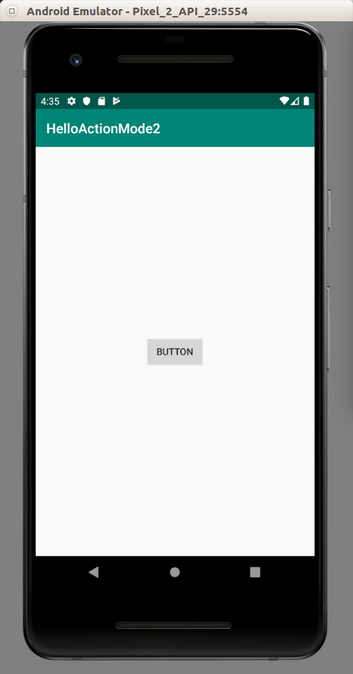

# **Action Mode**

Action mode is how we change the actionbar or toolbar. In some Android applications, if you select some text, 
the menu on the actionbar/toolbar changes. The copy menu item shows up.

Create a new empty Activity Android application. Name it HelloActionMode1.   
   

Edit app / res / layout / activity_main.xml. Add two buttons. The first button will launch the action mode. The second button will invalidate action mode.  
  
```xml
<?xml version="1.0" encoding="utf-8"?>
<androidx.constraintlayout.widget.ConstraintLayout
        xmlns:android="http://schemas.android.com/apk/res/android"
        xmlns:tools="http://schemas.android.com/tools"
        xmlns:app="http://schemas.android.com/apk/res-auto"
        android:layout_width="match_parent"
        android:layout_height="match_parent"
        tools:context=".MainActivity">
    <Button
            android:text="Launch Action Mode"
            android:layout_width="wrap_content"
            android:layout_height="wrap_content"
            android:id="@+id/button" app:layout_constraintStart_toStartOf="parent"
            app:layout_constraintHorizontal_bias="0.5" app:layout_constraintEnd_toEndOf="parent"
            app:layout_constraintTop_toTopOf="parent" app:layout_constraintBottom_toBottomOf="parent"/>
    <Button
            android:text="Invalidate Action Mode"
            android:layout_width="wrap_content"
            android:layout_height="wrap_content"
            android:id="@+id/buttonInvalidate" android:layout_marginTop="8dp"
            app:layout_constraintTop_toBottomOf="@+id/button" android:layout_marginBottom="8dp"
            app:layout_constraintBottom_toBottomOf="parent" app:layout_constraintStart_toStartOf="parent"
            app:layout_constraintHorizontal_bias="0.5" app:layout_constraintEnd_toEndOf="parent"/>
</androidx.constraintlayout.widget.ConstraintLayout>
```  
Add three drawable files in app / res / drawable. Name them: ic_call_received_white.xml, ic_fiber_new_white.xml, ic_transfer_within_a_station_white.xml.  
  
Edit app / res / values / strings.xml.  
```xml  
<resources>
    <string name="app_name">HelloActionMode1</string>
    <string name="new_action">New</string>
    <string name="download_action">Download</string>
    <string name="login_action">Login</string>
</resources>
```
  
Create a menu layout resource, app / res / menu / actions.xml. This menu layout will be your menu in Action Mode.  
```xml
<?xml version="1.0" encoding="utf-8"?>
<menu xmlns:android="http://schemas.android.com/apk/res/android"
    xmlns:app="http://schemas.android.com/apk/res-auto">
    <item
            android:id="@+id/newAction"
            android:icon="@drawable/ic_fiber_new_white"
            app:showAsAction="always"
            android:title="@string/new_action"/>
    <item
            android:id="@+id/downloadAction"
            android:icon="@drawable/ic_call_received_white"
            app:showAsAction="ifRoom"
            android:title="@string/download_action"/>
    <item
            android:id="@+id/loginAction"
            android:icon="@drawable/ic_transfer_within_a_station_white"
            app:showAsAction="never"
            android:title="@string/login_action"/>
</menu>
```
Create a menu layout resource, app / res / menu / actions_invalidate.xml. This menu layout will be your menu in Action Mode after invalidating action mode. Invalidating is similar to refreshing.  
```xml
<?xml version="1.0" encoding="utf-8"?>
<menu xmlns:android="http://schemas.android.com/apk/res/android"
    xmlns:app="http://schemas.android.com/apk/res-auto">
    <item
            android:id="@+id/loginAction"
            android:icon="@drawable/ic_transfer_within_a_station_white"
            app:showAsAction="ifRoom"
            android:title="@string/login_action"/>
</menu> 
 ``` 
Edit app / java / com.example.helloactionmode1 / MainActivity.  
  
```kotlin
package com.example.helloactionmode1

import androidx.appcompat.app.AppCompatActivity
import android.os.Bundle
import android.util.Log
import android.view.Menu
import android.view.MenuItem
import android.widget.Button
import androidx.appcompat.view.ActionMode

const val tag = "action-mode-tag"

class MainActivity : AppCompatActivity(), ActionMode.Callback {

    private lateinit var actionMode : ActionMode
    private var beginningActionMode = true

    override fun onCreate(savedInstanceState: Bundle?) {
        super.onCreate(savedInstanceState)
        setContentView(R.layout.activity_main)

        findViewById<Button>(R.id.button).setOnClickListener {
            actionMode = startSupportActionMode(this)!!
        }

        findViewById<Button>(R.id.buttonInvalidate).setOnClickListener {
            beginningActionMode = false
            actionMode.invalidate()
        }
    }

    override fun onActionItemClicked(mode: ActionMode?, item: MenuItem?): Boolean {
        when (item!!.itemId) {
            R.id.newAction -> Log.d(tag, "New Action")
            R.id.downloadAction -> actionMode.finish()
            R.id.loginAction -> Log.d(tag, "Login Action")
        }
        return true
    }

    override fun onCreateActionMode(mode: ActionMode?, menu: Menu?): Boolean {
        menuInflater.inflate(R.menu.actions, menu)
        mode!!.title = "Title of ActionMode"
        return true
    }

    override fun onDestroyActionMode(mode: ActionMode?) {
        Log.d(tag, "Shutting down Action Mode")
    }

    override fun onPrepareActionMode(mode: ActionMode?, menu: Menu?): Boolean {
        if (beginningActionMode) {
            return false
        }
        menu?.clear()
        menuInflater.inflate(R.menu.actions_invalidate, menu)
        mode!!.title = "ActionMode after Invalidation"
        beginningActionMode = true
        return true
    }
}
```  
To start the action mode, we can use startSupportActionMode which accepts ActionMode.Callback. We save the result of this method in ActionMode instance.  
```kotlin
actionMode = startSupportActionMode(this)!!
```
  
There is another similar method, named startActionMode. Since we use AppCompatActivity, we need to use startSupportActionMode instead of startActionMode.  
  
The ActionMode needs to be imported from androidx.appcompat.view.ActionMode, not android.view.ActionMode.  
  
To invalidate the action mode (meaning you want to change the menu in action mode on the fly), you can use invalidate method.  
```kotlin
actionMode.invalidate()
```
Then we need to make MainActivity to implement ActionMode.Callback. You have to implement 4 methods: onActionItemClicked, onCreateActionMode, onDestroyActionMode, onPrepareActionMode.  
  
The first method needs to be implemented is onActionItemClicked.  
```kotlin
override fun onActionItemClicked(mode: ActionMode?, item: MenuItem?): Boolean {
    when (item!!.itemId) {
        R.id.newAction -> Log.d(tag, "New Action")
        R.id.downloadAction -> actionMode.finish()
        R.id.loginAction -> Log.d(tag, "Login Action")
    }
    return true
}
```
This method is executed when you click the menu item on the action bar in action mode.  
  
If we click downloadAction menu item, we will shutdown action mode with finish method.  
  
The second method needs to be implemented is onCreateActionMode.  
  
```kotlin
override fun onCreateActionMode(mode: ActionMode?, menu: Menu?): Boolean {
    menuInflater.inflate(R.menu.actions, menu)
    mode!!.title = "Title of ActionMode"
    return true
}
```
This method is called when the action mode starts. This is when you set up the menu on the action bar on action mode.  

The third method needs to be implemented is onDestroyActionMode.  
  
 ```kotlin
override fun onDestroyActionMode(mode: ActionMode?) {
    Log.d(tag, "Shutting down Action Mode")
}
 ``` 

This method is called when we shut down the action mode.  

The fourth method needs to be implemented is onPrepareActionMode.  

```kotlin
override fun onPrepareActionMode(mode: ActionMode?, menu: Menu?): Boolean {
    if (beginningActionMode) {
        return false
    }
    menu?.clear()
    menuInflater.inflate(R.menu.actions_invalidate, menu)
    mode!!.title = "ActionMode after Invalidation"
    beginningActionMode = true
    return true
}
```
This method is being used when you want to modify the action mode using invalidate method of action mode instance. This method is called after you launch action mode (after onCreateActionMode method).  
  
You clear the menu and inflate a different menu. You also changed the title of the action bar.  
  
Run the application. Click “Launch Action Mode” button to get Action Mode active. The click “Invalidate Action Mode” to change the menu in Action Mode. If we click download menu item, or back button, the action mode will shut down. We’ll get back our own original actionbar.  

<p align="center">


</p>


# ActionMode with Toolbar
We can also use action mode with toolbar. We can also change the background of the toolbar in action mode.  
  
Create a new empty Activity Android project.  
  
Edit app / res / layout / activity_main.xml.  
  
```xml
<?xml version="1.0" encoding="utf-8"?>
<androidx.constraintlayout.widget.ConstraintLayout
        xmlns:android="http://schemas.android.com/apk/res/android"
        xmlns:tools="http://schemas.android.com/tools"
        xmlns:app="http://schemas.android.com/apk/res-auto"
        android:layout_width="match_parent"
        android:layout_height="match_parent"
        tools:context=".MainActivity">
    <androidx.appcompat.widget.Toolbar android:id="@+id/toolbar"
                                       android:layout_width="match_parent"
                                       android:layout_height="wrap_content"
                                       android:background="?attr/colorPrimary"
                                       app:theme="?attr/actionBarTheme"
                                       app:layout_constraintStart_toStartOf="parent"
                                       app:layout_constraintEnd_toEndOf="parent"
                                       app:layout_constraintTop_toTopOf="parent"/>
    <Button
            android:text="Button"
            android:layout_width="wrap_content"
            android:layout_height="wrap_content"
            android:id="@+id/button" app:layout_constraintStart_toStartOf="parent"
            app:layout_constraintHorizontal_bias="0.5" app:layout_constraintEnd_toEndOf="parent"
            app:layout_constraintTop_toBottomOf="@id/toolbar" app:layout_constraintBottom_toBottomOf="parent"/>
</androidx.constraintlayout.widget.ConstraintLayout>
```
We add toolbar and a button to launch action mode.  
  
Edit app / res / values / colors.xml. We add a blue color.  
  
```xml
<?xml version="1.0" encoding="utf-8"?>
<resources>
    <color name="colorPrimary">#008577</color>
    <color name="colorPrimaryDark">#00574B</color>
    <color name="colorAccent">#D81B60</color>
    <color name="colorBlue">#005DB1</color>
</resources>
```
Edit app / res / values / strings.xml.  
```xml
<resources>
    <string name="app_name">HelloActionMode2</string>
    <string name="new_action">New</string>
    <string name="download_action">Download</string>
    <string name="login_action">Login</string>
</resources>
```
Edit app / res / values / styles.xml.  
```xml
<resources>

    <!-- Base application theme. -->
    <style name="AppTheme" parent="Theme.AppCompat.Light.DarkActionBar">
        <!-- Customize your theme here. -->
        <item name="colorPrimary">@color/colorPrimary</item>
        <item name="colorPrimaryDark">@color/colorPrimaryDark</item>
        <item name="colorAccent">@color/colorAccent</item>
        <item name="windowActionBar">false</item>
        <item name="windowNoTitle">true</item>
        <item name="windowActionModeOverlay">true</item>
        <item name="android:actionModeBackground">@color/colorBlue</item>
    </style>

</resources>
```
To use toolbar instead of actionbar you need these two properties set to respective values.  
  
```xml
<item name="windowActionBar">false</item>
<item name="windowNoTitle">true</item>
```
To avoid toolbar and actionbar show up at the same time in action mode, use this property with respective value.  
  
```xml
<item name="windowActionModeOverlay">true</item>
```
To change the background of actionbar or toolbar on action mode, use this property with respective value.  
```xml
<item name="android:actionModeBackground">@color/colorBlue</item>
```
Add three drawable files in app / res / drawable. Name them: ic_call_received_white.xml, ic_fiber_new_white.xml, ic_transfer_within_a_station_white.xml.  
  
Create a menu layout resource, app / res / menu / actions.xml. This menu layout will be your menu in Action Mode.  
  
```xml
<?xml version="1.0" encoding="utf-8"?>
<menu xmlns:android="http://schemas.android.com/apk/res/android"
      xmlns:app="http://schemas.android.com/apk/res-auto">
    <item
            android:id="@+id/newAction"
            android:icon="@drawable/ic_fiber_new_white"
            app:showAsAction="always"
            android:title="@string/new_action"/>
    <item
            android:id="@+id/downloadAction"
            android:icon="@drawable/ic_call_received_white"
            app:showAsAction="ifRoom"
            android:title="@string/download_action"/>
    <item
            android:id="@+id/loginAction"
            android:icon="@drawable/ic_transfer_within_a_station_white"
            app:showAsAction="never"
            android:title="@string/login_action"/>
</menu>
```
Edit app / java / com.example.helloactionmode2 / MainActivity
```kotlin
package com.example.helloactionmode2

import androidx.appcompat.app.AppCompatActivity
import android.os.Bundle
import android.util.Log
import android.view.Menu
import android.view.MenuItem
import android.widget.Button
import android.view.ActionMode
import androidx.appcompat.widget.Toolbar

const val tag = "action-mode-tag"

class MainActivity : AppCompatActivity(), ActionMode.Callback {

    private lateinit var actionMode : ActionMode

    override fun onCreate(savedInstanceState: Bundle?) {
        super.onCreate(savedInstanceState)
        setContentView(R.layout.activity_main)

        val toolbar : Toolbar = findViewById(R.id.toolbar)
        setSupportActionBar(toolbar)

        findViewById<Button>(R.id.button).setOnClickListener {
            actionMode = toolbar.startActionMode(this)!!
        }
    }
    override fun onActionItemClicked(mode: ActionMode?, item: MenuItem?): Boolean {
        when (item!!.itemId) {
            R.id.newAction -> Log.d(tag, "New Action")
            R.id.downloadAction -> actionMode.finish()
            R.id.loginAction -> Log.d(tag, "Login Action")
        }
        return true
    }

    override fun onCreateActionMode(mode: ActionMode?, menu: Menu?): Boolean {
        menuInflater.inflate(R.menu.actions, menu)
        mode!!.title = "Title of ActionMode"
        return true
    }

    override fun onDestroyActionMode(mode: ActionMode?) {
    }

    override fun onPrepareActionMode(mode: ActionMode?, menu: Menu?): Boolean {
        return false
    }
}
```
Here, we use startActionMode method of toolbar instance. Previously we use  startSupportActionMode method of an activity instance. Also, our ActionMode is imported from android.view.ActionMode, not androidx.appcompat.view.ActionMode.  
  
Run the application. Click the button to launch action mode. 

<p align="center">

 
<p>
 
# Optional Reading
https://developer.android.com/guide/topics/ui/menus  
  

# Exercises
1. Create a edit text on which you select the text, the action mode is launched with a menu item to copy, cut, or delete the text.
