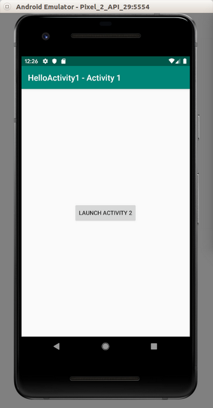
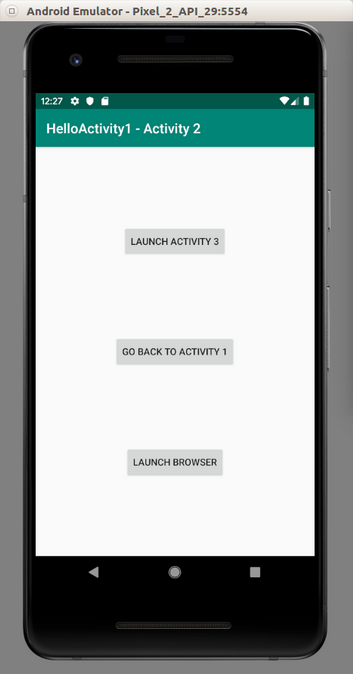
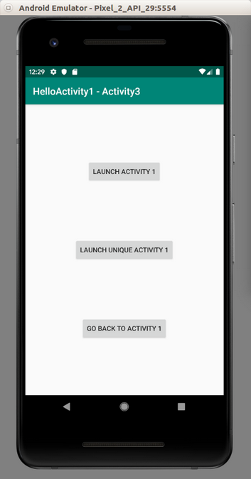
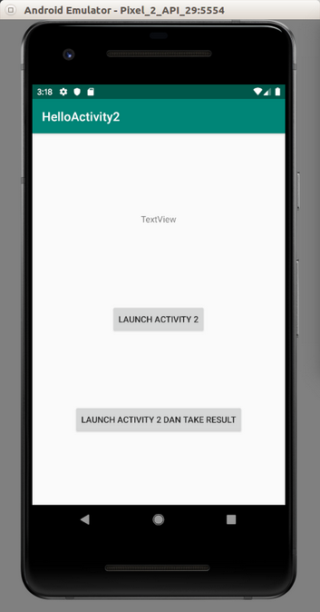
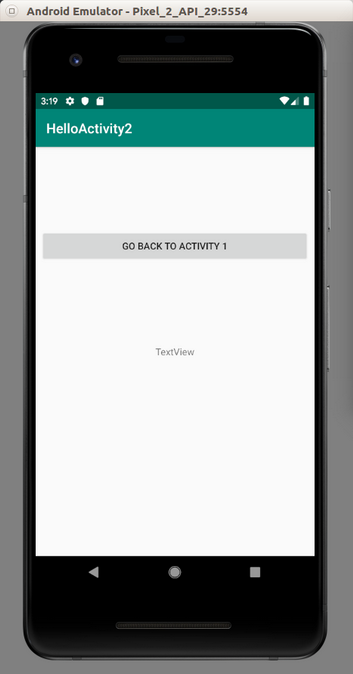
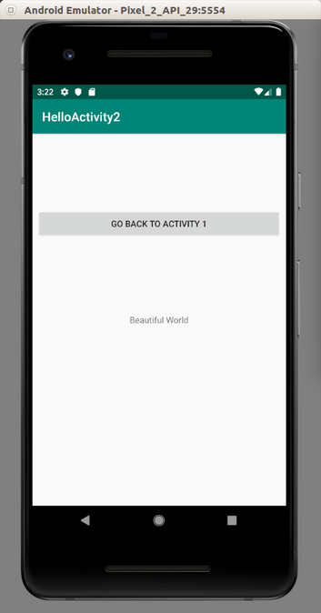

# Activity

Right now you only use one activity. Activity is like a screen.  
  
Create a new empty view project. Edit activity_main.xml.  
  
```xml
<?xml version="1.0" encoding="utf-8"?>
<androidx.constraintlayout.widget.ConstraintLayout
    xmlns:android="http://schemas.android.com/apk/res/android"
    xmlns:tools="http://schemas.android.com/tools"
    xmlns:app="http://schemas.android.com/apk/res-auto"
    android:layout_width="match_parent"
    android:layout_height="match_parent"
    tools:context=".MainActivity">

    <Button
            android:id="@+id/button_launch_activity_2"
            android:layout_width="wrap_content"
            android:layout_height="wrap_content"
            android:text="Launch Activity 2"
            app:layout_constraintBottom_toBottomOf="parent"
            app:layout_constraintLeft_toLeftOf="parent"
            app:layout_constraintRight_toRightOf="parent"
            app:layout_constraintTop_toTopOf="parent"/>

</androidx.constraintlayout.widget.ConstraintLayout>
```
Edit MainActivity.kt.  
  
```kotlin
package com.example.helloactivity1

import android.content.Intent
import androidx.appcompat.app.AppCompatActivity
import android.os.Bundle
import android.widget.Button

class MainActivity : AppCompatActivity() {

    override fun onCreate(savedInstanceState: Bundle?) {
        super.onCreate(savedInstanceState)
        setContentView(R.layout.activity_main)

        val button = findViewById<Button>(R.id.button_launch_activity_2)
        button.setOnClickListener {
            startActivity(Intent(this, MainDetailActivity::class.java))
        }
        title = "HelloActivity1 - Activity 1"
    }
}
```
  
In your activity, you have a default button. If you click that button, you will launch another activity, which is in this case MainDetailActivity. You wrap the activity inside Intent object then pass it to startActivity method.  
  
Of course you need to create a new activity. You can choose File – New – Activity – Empty Activity.  When you create a new activity, you will get a new layout resource as well.  
  
Edit activity_main_detail.xml.  
  
```xml
<?xml version="1.0" encoding="utf-8"?>
<androidx.constraintlayout.widget.ConstraintLayout xmlns:android="http://schemas.android.com/apk/res/android"
                                                   xmlns:app="http://schemas.android.com/apk/res-auto"
                                                   android:layout_width="match_parent"
                                                   android:layout_height="match_parent">
    <Button
            android:id="@+id/button_launch_activity_3"
            android:layout_width="wrap_content"
            android:layout_height="wrap_content"
            android:text="Launch Activity 3"
            app:layout_constraintLeft_toLeftOf="parent"
            app:layout_constraintRight_toRightOf="parent"
            app:layout_constraintTop_toTopOf="parent"
            app:layout_constraintBottom_toTopOf="@+id/back_to_activity_1"
            app:layout_constraintHorizontal_bias="0.5"/>
    <Button
            android:id="@+id/back_to_activity_1"
            android:layout_width="wrap_content"
            android:layout_height="wrap_content"
            android:text="Go Back to Activity 1"
            app:layout_constraintLeft_toLeftOf="parent"
            app:layout_constraintRight_toRightOf="parent"
            app:layout_constraintBottom_toTopOf="@+id/launch_browser"
            app:layout_constraintTop_toBottomOf="@+id/button_launch_activity_3"
            app:layout_constraintHorizontal_bias="0.5"/>
    <Button
            android:id="@+id/launch_browser"
            android:layout_width="wrap_content"
            android:layout_height="wrap_content"
            android:text="Launch Browser"
            app:layout_constraintBottom_toBottomOf="parent"
            app:layout_constraintLeft_toLeftOf="parent"
            app:layout_constraintRight_toRightOf="parent"
            app:layout_constraintTop_toBottomOf="@+id/back_to_activity_1"
            app:layout_constraintHorizontal_bias="0.5"/>
</androidx.constraintlayout.widget.ConstraintLayout>
```
  
You have three buttons in this second activity.  
  
Edit MainDetailActivity.kt.  
  
```kotlin
package com.example.helloactivity1

import android.content.Intent
import android.net.Uri
import android.os.Bundle
import android.widget.Button
import androidx.appcompat.app.AppCompatActivity


class MainDetailActivity : AppCompatActivity() {

    override fun onCreate(savedInstanceState: Bundle?) {
        super.onCreate(savedInstanceState)
        setContentView(R.layout.activity_main_detail)

        val buttonLaunchActivity3 = findViewById<Button>(R.id.button_launch_activity_3)
        buttonLaunchActivity3.setOnClickListener {
            startActivity(Intent(this, MainDeepActivity::class.java))
        }
        val buttonBackToActivity1 = findViewById<Button>(R.id.back_to_activity_1)
        buttonBackToActivity1.setOnClickListener {
            finish()
        }
        val buttonBrowser = findViewById<Button>(R.id.launch_browser)
        buttonBrowser.setOnClickListener {
            //startActivity(Intent(Intent.ACTION_VIEW, Uri.parse("https://liputan6.com")))
            startActivity(Intent(Intent.ACTION_DIAL, Uri.parse("tel:123")))
        }
        title = "HelloActivity1 - Activity 2"
    }
}
```
  
The first button (buttonLaunchActivity3) launches another activity. But the second button just executes finish method. It means it finishes its activity. It will go back to the parent activity, which is MainActivity.  
  
The third activity can call other activity outside your application. Instead of activity, you give what kind of Intent as first parameter, then the parsed uri in second parameter. Intent.ACTION_DIAL will open the dialing screen. If you use Intent.ACTION_VIEW, you can launch a browser.  
  
Now, you need to create the last activity, which is MainDeepActivity.  
  
Edit activity_main_deep.xml.  
  
```xml
<?xml version="1.0" encoding="utf-8"?>
<androidx.constraintlayout.widget.ConstraintLayout xmlns:android="http://schemas.android.com/apk/res/android"
                                                   xmlns:app="http://schemas.android.com/apk/res-auto"
                                                   android:layout_width="match_parent"
                                                   android:layout_height="match_parent">
    <Button
            android:id="@+id/button_launch_activity_1"
            android:layout_width="wrap_content"
            android:layout_height="wrap_content"
            android:text="Launch Activity 1"
            app:layout_constraintLeft_toLeftOf="parent"
            app:layout_constraintRight_toRightOf="parent"
            app:layout_constraintTop_toTopOf="parent"
            app:layout_constraintBottom_toTopOf="@+id/button_launch_activity_1_only"
            app:layout_constraintHorizontal_bias="0.5"/>
    <Button
            android:id="@+id/button_launch_activity_1_only"
            android:layout_width="wrap_content"
            android:layout_height="wrap_content"
            android:text="Launch Unique Activity 1"
            app:layout_constraintLeft_toLeftOf="parent"
            app:layout_constraintRight_toRightOf="parent"
            app:layout_constraintBottom_toTopOf="@+id/pop_to_activity_1"
            app:layout_constraintTop_toBottomOf="@+id/button_launch_activity_1"
            app:layout_constraintHorizontal_bias="0.5"/>
    <Button
            android:id="@+id/pop_to_activity_1"
            android:layout_width="wrap_content"
            android:layout_height="wrap_content"
            android:text="Go Back to Activity 1"
            app:layout_constraintBottom_toBottomOf="parent"
            app:layout_constraintLeft_toLeftOf="parent"
            app:layout_constraintRight_toRightOf="parent"
            app:layout_constraintTop_toBottomOf="@+id/button_launch_activity_1_only"
            app:layout_constraintHorizontal_bias="0.5"/>
</androidx.constraintlayout.widget.ConstraintLayout>
```
  
There are three buttons as well in the last activity.  
  
Edit MainDeepActivity.  
  
```kotlin
package com.example.helloactivity1

import android.content.Intent
import android.os.Bundle
import android.widget.Button
import androidx.appcompat.app.AppCompatActivity

class MainDeepActivity : AppCompatActivity() {

    override fun onCreate(savedInstanceState: Bundle?) {
        super.onCreate(savedInstanceState)
        setContentView(R.layout.activity_main_deep)
        val buttonLaunchActivity1 = findViewById<Button>(R.id.button_launch_activity_1)
        buttonLaunchActivity1.setOnClickListener {
            startActivity(Intent(this, MainActivity::class.java))
        }
        val buttonLaunchActivity1Only = findViewById<Button>(R.id.button_launch_activity_1_only)
        buttonLaunchActivity1Only.setOnClickListener {
            intent = Intent(this, MainActivity::class.java)
            intent.flags = Intent.FLAG_ACTIVITY_REORDER_TO_FRONT
            startActivity(intent)
        }
        val buttonPopToActivity1 = findViewById<Button>(R.id.pop_to_activity_1)
        buttonPopToActivity1.setOnClickListener {
            intent = Intent(this, MainActivity::class.java)
            intent.flags = Intent.FLAG_ACTIVITY_CLEAR_TOP or Intent.FLAG_ACTIVITY_SINGLE_TOP
            startActivity(intent)
        }
        title = "HelloActivity1 - Activity3"
    }
}
```
  
All of these buttons launch or go back to the first activity. But there are some differences in their way to launch or go back to the first activity.  
  
The first way startActivity(Intent(this, MainActivity::class.java)) will create this situation:  
  
Activity 1 → Activity 2 → Activity 3 → Activity 1  

The second way on which you give Intent.FLAG_ACTIVITY_REORDER_TO_FRONT to the flags of intent will create this situation:  
  
Activity 2 → Activity 3 → Activity 1  
  
The last way will create this situation:  
  
Activity 1  
  
Lastly, edit app / manifests / AndroidManifest.xml. Add two new activities in this manifest file.  
  
```xml
<activity android:name=".MainDetailActivity"></activity>
<activity android:name=".MainDeepActivity"></activity>
```
  
Launch the application.  If you click “Launch Activity 2”, you’ll get “Activity 2”. If you click “Launch Activity 3” , you’ll get “Activity 3”.  
  
<p align="center">



</p>
  
  
# Sending Parameters and Results
  
To send parameters from parent activity to child activity or to send results from child activity to parent activity, you must use intent.  
  
Create another empty view project. Name it HelloActivity2.  
  
Edit activity_main.xml.  
  
```xml
<?xml version="1.0" encoding="utf-8"?>
<androidx.constraintlayout.widget.ConstraintLayout
    xmlns:android="http://schemas.android.com/apk/res/android"
    xmlns:tools="http://schemas.android.com/tools"
    xmlns:app="http://schemas.android.com/apk/res-auto"
    android:layout_width="match_parent"
    android:layout_height="match_parent"
    tools:context=".MainActivity">
    <Button
            android:id="@+id/button_launch_activity_2"
            android:layout_width="wrap_content"
            android:layout_height="wrap_content"
            android:text="Launch Activity 2"
            app:layout_constraintBottom_toBottomOf="parent"
            app:layout_constraintLeft_toLeftOf="parent"
            app:layout_constraintRight_toRightOf="parent"
            app:layout_constraintTop_toTopOf="parent"/>
    <Button
            android:text="Launch Activity 2 dan Take Result"
            android:layout_width="wrap_content"
            android:layout_height="wrap_content"
            android:id="@+id/button_launch_activity_2_with_result" android:layout_marginTop="8dp"
            app:layout_constraintTop_toBottomOf="@+id/button_launch_activity_2" android:layout_marginBottom="8dp"
            app:layout_constraintBottom_toBottomOf="parent" app:layout_constraintEnd_toEndOf="parent"
            android:layout_marginEnd="8dp" app:layout_constraintStart_toStartOf="parent"
            android:layout_marginStart="8dp"/>
    <TextView
            android:text="TextView"
            android:layout_width="wrap_content"
            android:layout_height="wrap_content"
            android:id="@+id/textViewResult" android:layout_marginTop="8dp"
            app:layout_constraintTop_toTopOf="parent" android:layout_marginBottom="8dp"
            app:layout_constraintBottom_toTopOf="@+id/button_launch_activity_2"
            app:layout_constraintStart_toStartOf="parent" android:layout_marginStart="8dp"
            app:layout_constraintEnd_toEndOf="parent" android:layout_marginEnd="8dp"/>
</androidx.constraintlayout.widget.ConstraintLayout>
```
  
Here you have two buttons and one text view. The first button will send parameter to child activity. The second button will not send any parameter but will expect the result from child activity to parent activity.  
  
Edit MainActivity.  
  
```kotlin
package com.example.helloactivity2

import android.app.Activity
import android.content.Intent
import androidx.appcompat.app.AppCompatActivity
import android.os.Bundle
import android.widget.Button
import android.widget.TextView

class MainActivity : AppCompatActivity() {

    val request_code = 1

    override fun onCreate(savedInstanceState: Bundle?) {
        super.onCreate(savedInstanceState)
        setContentView(R.layout.activity_main)
        val button = findViewById<Button>(R.id.button_launch_activity_2)
        button.setOnClickListener {
            val intent = Intent(this, MainDetailActivity::class.java)
            intent.putExtra("text", "Beautiful World")
            startActivity(intent)
        }
        val button2 = findViewById<Button>(R.id.button_launch_activity_2_with_result)
        button2.setOnClickListener {
            val intent = Intent(this, MainDetailActivity::class.java)
            startActivityForResult(intent, request_code)
        }
    }

    override fun onActivityResult(requestCode: Int, resultCode: Int, data: Intent?) {
        if (resultCode== Activity.RESULT_OK) {
            if (requestCode==request_code) {
                val result = data!!.getStringExtra("result")
                val textView = findViewById<TextView>(R.id.textViewResult)
                textView.text = result
            }
        }
    }
}
```
  
To send parameter, you can use intent.putExtra method. To wait the result from the child activity, you can use startActivityForResult. To get the result back, you must override onActivityResult method.  
  
Let’s create the second activity. Name it MainDetailActivity.  
  
Edit activity_main_detail.xml file.  
  
```xml
<?xml version="1.0" encoding="utf-8"?>
<androidx.constraintlayout.widget.ConstraintLayout xmlns:android="http://schemas.android.com/apk/res/android"
                                                   xmlns:app="http://schemas.android.com/apk/res-auto"
                                                   android:layout_width="match_parent"
                                                   android:layout_height="match_parent">
    <TextView
            android:text="TextView"
            android:layout_width="wrap_content"
            android:layout_height="wrap_content"
            android:id="@+id/textView" android:layout_marginTop="8dp"
            app:layout_constraintTop_toTopOf="parent" android:layout_marginBottom="8dp"
            app:layout_constraintBottom_toBottomOf="parent" app:layout_constraintEnd_toEndOf="parent"
            android:layout_marginEnd="8dp" app:layout_constraintStart_toStartOf="parent"
            android:layout_marginStart="8dp"/>
    <Button
            android:text="Go Back to Activity 1"
            android:layout_width="0dp"
            android:layout_height="wrap_content"
            android:id="@+id/button" android:layout_marginBottom="8dp"
            app:layout_constraintBottom_toTopOf="@+id/textView" android:layout_marginTop="8dp"
            app:layout_constraintTop_toTopOf="parent" app:layout_constraintEnd_toEndOf="parent"
            android:layout_marginEnd="8dp" app:layout_constraintStart_toStartOf="parent"
            android:layout_marginStart="8dp"/>
</androidx.constraintlayout.widget.ConstraintLayout>
```
  
Edit MainDetailActivity.kt.  
  
```kotlin
package com.example.helloactivity2

import android.app.Activity
import android.content.Intent
import android.os.Bundle
import android.widget.Button
import android.widget.TextView
import androidx.appcompat.app.AppCompatActivity

class MainDetailActivity : AppCompatActivity() {

    override fun onCreate(savedInstanceState: Bundle?) {
        super.onCreate(savedInstanceState)
        setContentView(R.layout.activity_main_detail)

        val text = intent.getStringExtra("text")
        val textView = findViewById<TextView>(R.id.textView)
        if (!text.isNullOrEmpty()) {
            textView.text = text
        }
        val button = findViewById<Button>(R.id.button)
        button.setOnClickListener {
            val returnIntent = Intent()
            returnIntent.putExtra("result", "Result")
            setResult(Activity.RESULT_OK, returnIntent)
            finish()
        }
    }
}
```
  
To get the parameter from the parent parameter, you can use intent.getStringExtra method. To send the parameter from the child activity you use setResult method before executing finish method.  
  
Lastly, edit the manifest file, app / manifests / AndroidManifest.xml.  
  
```xml
<activity android:name=".MainDetailActivity"></activity>
```
  
Run the application. Click “Launch Activity 2 And Take Result” button, you will get Activity 2. Then click “Go Back To Activity 1”, you will get “Result” text. Then click “Launch Activity 2”, you will get “Beautiful World” text in Activity 2.
  
<p align="center">




</p>

# Optional Readings
https://developer.android.com/guide/components/activities/intro-activities  
  
# Exercise
1. Create an application which have this chain: Activity 1 → Activity 2 → Activity 3 → Activity 4 → Activity 5, and Activity 1 → Activity 2 → Activity 3 → Activity 6 → Activity 7. The activities can go forward and go back.