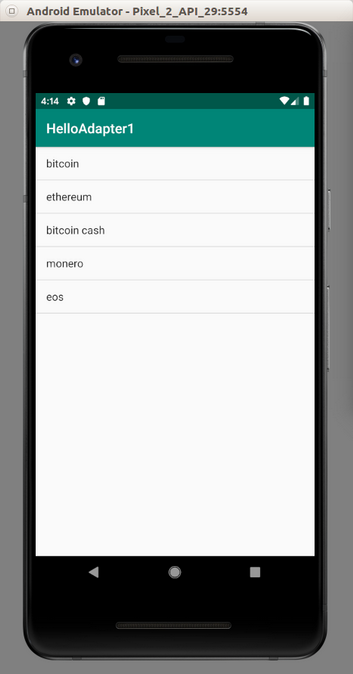
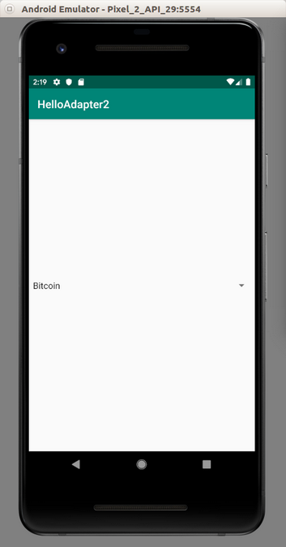
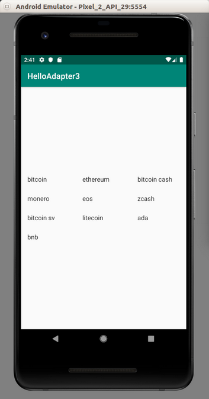

# Adapter

Some layouts and widgets in Android separate data from the UI with adapter.  

## ListView

Create a new empty view Android project. Then edit app / res / layout / activity_main.xml. Make the root element ListView.  
  
This is the content of the file.  
  
```xml
<?xml version="1.0" encoding="utf-8"?>
<ListView xmlns:android="http://schemas.android.com/apk/res/android"
          android:id="@+id/listView"
          android:layout_width="match_parent"
          android:layout_height="match_parent">
</ListView>
```
  
Then edit app / java / com.example.helloadapter1 / MainActivity.  
  
```kotlin
package com.example.helloadapter1

import androidx.appcompat.app.AppCompatActivity
import android.os.Bundle
import android.widget.ArrayAdapter
import android.widget.ListView

class MainActivity : AppCompatActivity() {

    val strings = arrayOf("bitcoin", "ethereum", "bitcoin cash", "monero", "eos")

    override fun onCreate(savedInstanceState: Bundle?) {
        super.onCreate(savedInstanceState)
        setContentView(R.layout.activity_main)

        val listView = findViewById<ListView>(R.id.listView)
        val adapter: ArrayAdapter<String> = ArrayAdapter(this, android.R.layout.simple_list_item_1, strings)
        listView.adapter = adapter
    }
}
```
  
The data is the array of strings (“strings” variable). You wrap this array of string with array adapter.  
  
```kotlin
val adapter: ArrayAdapter<String> = ArrayAdapter(this, android.R.layout.simple_list_item_1, strings)
listView.adapter = adapter
```

android.R.layout.simple_list_item_1 is a built-in layout. We don’t define it in our Android project.  
  
Then you set the adapter to the list view’s adapter!  
  
Run it and you will get this screen.  
  
<p align="center">

</p>

If you want to add callback for clicking item, you can use this method.  
  
```kotlin
import android.util.Log

...

listView.setOnItemClickListener { adapterView, view, position: Int, id: Long ->
    Log.d("item", strings[position])
}
```
  
Log.d is just outputting something to log.  
  
## Spinner
  
In Android, there is a difference between clicking and selecting. In handphone, you can not differentiate between clicking and selecting item. But on other device, like Android Car, selecting item is when you are highlighting an item. It’s one step before clicking an item.  
  
You can grab strings from xml file!  
  
Create a new empty Activity Android project. Edit app / res / layout / main_activity.xml file.  
  
```xml
<?xml version="1.0" encoding="utf-8"?>
<androidx.constraintlayout.widget.ConstraintLayout
        xmlns:android="http://schemas.android.com/apk/res/android"
        xmlns:tools="http://schemas.android.com/tools"
        xmlns:app="http://schemas.android.com/apk/res-auto"
        android:layout_width="match_parent"
        android:layout_height="match_parent"
        tools:context=".MainActivity">

    <Spinner
            android:id="@+id/cryptocurrencies_spinner"
            android:layout_width="fill_parent"
            android:layout_height="wrap_content" 
            app:layout_constraintStart_toStartOf="parent"
            app:layout_constraintHorizontal_bias="0.5" 
            app:layout_constraintEnd_toEndOf="parent"
            app:layout_constraintTop_toTopOf="parent" 
            app:layout_constraintBottom_toBottomOf="parent"/>

</androidx.constraintlayout.widget.ConstraintLayout>
```
  
Edit app / java / com.example.helloadapter2 / MainActivity.  
  
```kotlin
package com.example.helloadapter2

import androidx.appcompat.app.AppCompatActivity
import android.os.Bundle
import android.util.Log
import android.view.View
import android.widget.AdapterView
import android.widget.ArrayAdapter
import android.widget.Spinner

const val LOG_TAG = "adapter-event"

class MainActivity : AppCompatActivity() {

    override fun onCreate(savedInstanceState: Bundle?) {
        super.onCreate(savedInstanceState)
        setContentView(R.layout.activity_main)

        val spinner: Spinner = findViewById(R.id.cryptocurrencies_spinner)
        ArrayAdapter.createFromResource(this, R.array.cryptocurrencies_array, 
        android.R.layout.simple_spinner_item).also { adapter -> 
        adapter.setDropDownViewResource(android.R.layout.simple_spinner_dropdown_item)
            spinner.adapter = adapter
        }
        spinner.onItemSelectedListener = object : AdapterView.OnItemSelectedListener {
            override fun onItemSelected(parent: AdapterView<*>, view: View, pos: Int, id: Long) {
                val item = parent.getItemAtPosition(pos)
                Log.d(LOG_TAG, item.toString())
            }

            override fun onNothingSelected(p0: AdapterView<*>?) {
                Log.d(LOG_TAG, "Nothing selected")
            }
        }
    }

}
```
  
Don’t forget to create an array resourse file, app / res / values / array.xml.  
  
```xml
<?xml version="1.0" encoding="utf-8"?>
<resources>
    <string-array name="cryptocurrencies_array">
        <item>Bitcoin</item>
        <item>Ethereum</item>
        <item>Litecoin</item>
        <item>Monero</item>
        <item>EOS</item>
    </string-array>
</resources>
```
  
As you can see, we created ArrayAdapter from string array resource (R.array.cryptocurrencies_array). Android.R.layout.simple_spinner_item is a built-in layout from Android. Android.R.layout.simple_spinner_dropdown_item is also a built-in layout from Android.  
  
After creating ArrayAdapter in “also” block, we set the adapter to spinner’s adapter.  
  
If we want to add a callback to the spinner, we must set onItemSelectedListener to implement `AdapterView.OnItemClickListener`.  
  
Then add this method.  
  
```kotlin
override fun onItemSelected(parent: AdapterView<*>, view: View, pos: Int, id: Long) {
    val item = parent.getItemAtPosition(pos)
    Log.d(LOG_TAG, item.toString())
}

override fun onNothingSelected(p0: AdapterView<*>?) {
    Log.d(LOG_TAG, "Nothing selected")
}
```
  
Don’t forget to add the constant.  
  
```kotlin
const val LOG_TAG = "adapter-event"
```
  
Run the application and you will get this screen.  
  
<p align="center">

</p>
  
If you change the selected value of the spinner, you will get output of that option.  
  
## GridView
  
You can also have a grid view which has columns.  
  
Create a new empty Activity project.  
  
Edit app / res / layout / activity_main.xml file.  
  
```xml
<?xml version="1.0" encoding="utf-8"?>
<androidx.constraintlayout.widget.ConstraintLayout
    xmlns:android="http://schemas.android.com/apk/res/android"
    xmlns:tools="http://schemas.android.com/tools"
    xmlns:app="http://schemas.android.com/apk/res-auto"
    android:layout_width="match_parent"
    android:layout_height="match_parent"
    tools:context=".MainActivity">

    <GridView
            android:id="@+id/gridView"
            android:layout_height="wrap_content"
            android:layout_width="match_parent"
            android:numColumns="3"
            android:columnWidth="80dp"
            app:layout_constraintBottom_toBottomOf="parent"
            app:layout_constraintLeft_toLeftOf="parent"
            app:layout_constraintRight_toRightOf="parent"
            app:layout_constraintTop_toTopOf="parent"/>

</androidx.constraintlayout.widget.ConstraintLayout>
```
  
Notice these properties of GridView: android:numColumns which is set to “3” (3 columns) and android:columnWidth which is set to “80dp” (80 dp wide column).  
  
Then edit MainActivity.kt file.  
  
```kotlin
package com.example.helloadapter3

import androidx.appcompat.app.AppCompatActivity
import android.os.Bundle
import android.widget.ArrayAdapter
import android.widget.GridView

class MainActivity : AppCompatActivity() {

    val strings = arrayOf("bitcoin", "ethereum", "bitcoin cash", "monero", "eos", "zcash", "bitcoin sv", "litecoin", "ada", "bnb")

    override fun onCreate(savedInstanceState: Bundle?) {
        super.onCreate(savedInstanceState)
        setContentView(R.layout.activity_main)

        val gridView = findViewById<GridView>(R.id.gridView)

        val adapter: ArrayAdapter<String> = ArrayAdapter(this, android.R.layout.simple_list_item_1, strings)
        gridView.adapter = adapter
    }
}
```
  
It is similar to list view. Run the application and you will get this screen.  
  
<p align="center">

</p>
  
# Optional Readings
  
https://developer.android.com/reference/kotlin/android/widget/Adapter
  
# Exercise
  
1. Create an empty Activity project which utilizes AdapterViewFlipper.

2. Create an empty Activity project which utilizes ExpandableListView.
