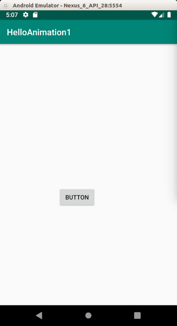

# Animation
  
There are a couple of ways to add animation to Android. Animation is useful to give a spatial clue to users. It makes the transitions between fragments and activities more accessible.  
  
## ValueAnimator
  
ValueAnimator is the most straightway to create an animation.

Create a new empty project. Name it HelloAnimator1.

In app / res / layout / activity_main.xml, create a new button with id button.

```xml
<?xml version="1.0" encoding="utf-8"?>
<androidx.constraintlayout.widget.ConstraintLayout
        xmlns:android="http://schemas.android.com/apk/res/android"
        xmlns:tools="http://schemas.android.com/tools"
        xmlns:app="http://schemas.android.com/apk/res-auto"
        android:layout_width="match_parent"
        android:layout_height="match_parent"
        android:id="@+id/container"
        tools:context=".MainActivity">
    <Button
            android:text="Button"
            android:layout_width="wrap_content"
            android:layout_height="wrap_content"
            android:id="@+id/button" android:layout_marginTop="44dp"
            app:layout_constraintTop_toTopOf="parent" app:layout_constraintStart_toStartOf="parent"
            android:layout_marginStart="40dp"/>
</androidx.constraintlayout.widget.ConstraintLayout>
```
Edit app / java / com.example.helloanimation1 / MainActivity.

```kotlin
package com.example.helloanimation1

import android.animation.ValueAnimator
import androidx.appcompat.app.AppCompatActivity
import android.os.Bundle
import android.view.animation.BounceInterpolator
import android.widget.Button

class MainActivity : AppCompatActivity() {

    override fun onCreate(savedInstanceState: Bundle?) {
        super.onCreate(savedInstanceState)
        setContentView(R.layout.activity_main)

        val button = findViewById<Button>(R.id.button)

        val valueAnimator = ValueAnimator.ofFloat(0f, 1000f)
        valueAnimator.addUpdateListener {
            val value = it.animatedValue as Float
            button.translationX = value / 3
            button.translationY = value
        }

        valueAnimator.interpolator = BounceInterpolator()
        valueAnimator.duration = 2000

        valueAnimator.start()
    }
}
```

We create a value animator object.

```kotlin
val valueAnimator = ValueAnimator.ofFloat(0f, 1000f)
```

We use static method ofFloat. It accepts two parameters, the starting point and the ending point.

Then we define what we want to do in the animation journey.

```kotlin
valueAnimator.addUpdateListener {
    val value = it.animatedValue as Float
    button.translationX = value / 3
    button.translationY = value
}
```

For every change of animation frame, we change the value of translationX and translationY properties of the button. This callback will be called many times.

Then we define the interpolator. Interpolator is what kind of speed the animation is using. Is it linear. Is it slow in the early time and becoming faster in the later time? Is it bouncing?

```kotlin
valueAnimator.interpolator = BounceInterpolator()
```
Then we define the duration in ms. The longer the duration the slower the animation is.

```kotlin
valueAnimator.duration = 2000
```

The last thing you need to do is to run the animation.

```kotlin
valueAnimator.start()
```

Run the application. You will see the button move diagonally.

<p align="center">


</p>

<u>Let’s try with different transformations and interpolators.</u>

Create a new project. Name it HelloAnimation2.

In app / res / layout / activity_main.xml, create three buttons.

```xml
<?xml version="1.0" encoding="utf-8"?>
<androidx.constraintlayout.widget.ConstraintLayout
        xmlns:android="http://schemas.android.com/apk/res/android"
        xmlns:tools="http://schemas.android.com/tools"
        xmlns:app="http://schemas.android.com/apk/res-auto"
        android:layout_width="match_parent"
        android:layout_height="match_parent"
        tools:context=".MainActivity">
    <Button
            android:text="Rotate X"
            android:layout_width="wrap_content"
            android:layout_height="wrap_content"
            android:id="@+id/buttonRotateX" android:layout_marginTop="60dp"
            app:layout_constraintTop_toTopOf="parent" app:layout_constraintStart_toStartOf="parent"
            android:layout_marginStart="48dp"/>
    <Button
            android:text="Rotate Y"
            android:layout_width="wrap_content"
            android:layout_height="wrap_content"
            android:id="@+id/buttonRotateY" android:layout_marginTop="140dp"
            app:layout_constraintTop_toBottomOf="@+id/buttonRotateX" app:layout_constraintStart_toStartOf="parent"
            android:layout_marginStart="48dp"/>
    <Button
            android:text="Rotate"
            android:layout_width="wrap_content"
            android:layout_height="wrap_content"
            android:id="@+id/buttonRotate" android:layout_marginTop="164dp"
            app:layout_constraintTop_toBottomOf="@+id/buttonRotateY" app:layout_constraintStart_toStartOf="parent"
            android:layout_marginStart="48dp"/>
</androidx.constraintlayout.widget.ConstraintLayout>
```

Edit app / java / com.example.helloanimation2 / MainActivity.

```kotlin
package com.example.helloanimation2

import android.animation.ValueAnimator
import androidx.appcompat.app.AppCompatActivity
import android.os.Bundle
import android.view.animation.LinearInterpolator
import android.widget.Button

class MainActivity : AppCompatActivity() {

    override fun onCreate(savedInstanceState: Bundle?) {
        super.onCreate(savedInstanceState)
        setContentView(R.layout.activity_main)

        val buttonRotateX = findViewById<Button>(R.id.buttonRotateX)
        val buttonRotateY = findViewById<Button>(R.id.buttonRotateY)
        val buttonRotate = findViewById<Button>(R.id.buttonRotate)

        val valueAnimator = ValueAnimator.ofFloat(0f, 360f)
        valueAnimator.addUpdateListener {
            val value = it.animatedValue as Float

            buttonRotateX.rotationX = value
            buttonRotateY.rotationY = value
            buttonRotate.rotation = value
        }

        valueAnimator.interpolator = LinearInterpolator()
        valueAnimator.duration = 5000

        valueAnimator.start()
    }
}
```

In the constructor, we give the parameters of 0f and 360f. This is not coincidence. We want to rotate the button and one full rotation is 360 degrees.

There are 3 transformation of rotations: rotationX, rotationY, and rotation.

This time we use LinearInterpolator with duration of 5 seconds.

Run the application to see three types of rotation.

<p align="center">


</p>

<u>Let’s try with different transformations and interpolators.</u>

Create a new project. Name it HelloAnimation3.

In app / res / layout / activity_main.xml, create three buttons.

```xml
<?xml version="1.0" encoding="utf-8"?>
<androidx.constraintlayout.widget.ConstraintLayout
        xmlns:android="http://schemas.android.com/apk/res/android"
        xmlns:tools="http://schemas.android.com/tools"
        xmlns:app="http://schemas.android.com/apk/res-auto"
        android:layout_width="match_parent"
        android:layout_height="match_parent"
        tools:context=".MainActivity">
    <Button
            android:text="Button Scale X"
            android:layout_width="wrap_content"
            android:layout_height="wrap_content"
            android:id="@+id/buttonScaleX" app:layout_constraintTop_toTopOf="parent"
            app:layout_constraintBottom_toTopOf="@+id/buttonScaleY" app:layout_constraintStart_toStartOf="parent"
            app:layout_constraintHorizontal_bias="0.5" app:layout_constraintEnd_toEndOf="parent"
    />
    <Button
            android:text="Button Scale Y"
            android:layout_width="wrap_content"
            android:layout_height="wrap_content"
            android:id="@+id/buttonScaleY"
            app:layout_constraintTop_toBottomOf="@+id/buttonScaleX"
            app:layout_constraintBottom_toTopOf="@+id/buttonAlpha" app:layout_constraintStart_toStartOf="parent"
            app:layout_constraintHorizontal_bias="0.5" app:layout_constraintEnd_toEndOf="parent"
    />
    <Button
            android:text="Button Alpha"
            android:layout_width="wrap_content"
            android:layout_height="wrap_content"
            android:id="@+id/buttonAlpha"
            app:layout_constraintTop_toBottomOf="@+id/buttonScaleY"
            app:layout_constraintBottom_toBottomOf="parent"
            app:layout_constraintStart_toStartOf="parent"
            app:layout_constraintHorizontal_bias="0.5" app:layout_constraintEnd_toEndOf="parent"/>
</androidx.constraintlayout.widget.ConstraintLayout>
```

Edit app / java / com.example.helloanimation3 / MainActivity.

```kotlin
package com.example.helloanimation3

import android.animation.ValueAnimator
import androidx.appcompat.app.AppCompatActivity
import android.os.Bundle
import android.view.animation.LinearInterpolator
import android.widget.Button

class MainActivity : AppCompatActivity() {

    override fun onCreate(savedInstanceState: Bundle?) {
        super.onCreate(savedInstanceState)
        setContentView(R.layout.activity_main)

        val buttonScaleX = findViewById<Button>(R.id.buttonScaleX)
        val buttonScaleY = findViewById<Button>(R.id.buttonScaleY)
        val buttonAlpha = findViewById<Button>(R.id.buttonAlpha)

        val valueAnimator = ValueAnimator.ofFloat(0f, 5f)
        valueAnimator.addUpdateListener {
            val value = it.animatedValue as Float

            buttonScaleX.scaleX = value
            buttonScaleY.scaleY = value
            buttonAlpha.alpha = value / 5
        }

        valueAnimator.interpolator = LinearInterpolator()
        valueAnimator.duration = 5000

        valueAnimator.start()
    }
}
```
This time we use scaling and alpha transformations.

Run the application.

<p align="center">


</p>

## Repetition and Custom Evaluator

In previous examples, the animation runs once and that’s all. We can repeat animation for many times.

Also, we use numerical evaluation, meaning the changing of animation comes from small number to big number (the button is scaled or moved in x direction). But what if we want to change the color of a view? Then we need a special evaluation.

Create a new project. Name it HelloAnimation4.

In app / res / layout / activity_main.xml, create one button. This button is not really useful. You can omit it. We want to animate the background of the parent view of the button. But in this example, I am going to keep the button.

```xml
<?xml version="1.0" encoding="utf-8"?>
<androidx.constraintlayout.widget.ConstraintLayout
        xmlns:android="http://schemas.android.com/apk/res/android"
        xmlns:tools="http://schemas.android.com/tools"
        xmlns:app="http://schemas.android.com/apk/res-auto"
        android:layout_width="match_parent"
        android:layout_height="match_parent"
        android:id="@+id/container"
        tools:context=".MainActivity">
    <Button
            android:text="Button"
            android:layout_width="wrap_content"
            android:layout_height="wrap_content"
            android:id="@+id/button" android:layout_marginTop="8dp"
            app:layout_constraintTop_toTopOf="parent" android:layout_marginBottom="8dp"
            app:layout_constraintBottom_toBottomOf="parent" app:layout_constraintStart_toStartOf="parent"
            app:layout_constraintHorizontal_bias="0.5" app:layout_constraintEnd_toEndOf="parent"/>
</androidx.constraintlayout.widget.ConstraintLayout>
```

Edit app / java / com.example.helloanimation4 / MainActivity.

```kotlin
package com.example.helloanimation4

import android.animation.ArgbEvaluator
import android.animation.ValueAnimator
import androidx.appcompat.app.AppCompatActivity
import android.os.Bundle
import android.view.animation.LinearInterpolator
import androidx.constraintlayout.widget.ConstraintLayout
import androidx.core.content.ContextCompat

class MainActivity : AppCompatActivity() {

    override fun onCreate(savedInstanceState: Bundle?) {
        super.onCreate(savedInstanceState)
        setContentView(R.layout.activity_main)

        val container = findViewById<ConstraintLayout>(R.id.container)

        val valueAnimator = ValueAnimator.ofInt(ContextCompat.getColor(this, R.color.colorPrimaryDark), ContextCompat.getColor(this, R.color.colorAccent))
        valueAnimator.addUpdateListener {
            val value = it.animatedValue as Int

            container.setBackgroundColor(value)
        }

        valueAnimator.interpolator = LinearInterpolator()
        valueAnimator.duration = 5000
        valueAnimator.setEvaluator(ArgbEvaluator())
        valueAnimator.repeatCount = ValueAnimator.INFINITE
        valueAnimator.repeatMode = ValueAnimator.REVERSE

        valueAnimator.start()
    }
}
```

We use different constructor of ValueAnimator.

```kotlin
val valueAnimator = ValueAnimator.ofInt(ContextCompat.getColor(this, R.color.colorPrimaryDark), ContextCompat.getColor(this, R.color.colorAccent))
```

In this example, we use ofInt method instead of ofFloat because color is defined as integer value. We get the color from app / res / values / colors.xml. But we can not give R.color.colorAccent directly as parameter to the constructor method because that is the id set by Android framework. We have to use ContextCompat to translate the id in Android framework to the color value with getColor method.

In animation callback (addUpdateListener), we change the color of the background of the parent view of the button.

```kotlin
container.setBackgroundColor(value)
```

Then we repeat the animation infinite times by going forward to the end value and going back to the start value.

```kotlin
valueAnimator.repeatCount = ValueAnimator.INFINITE
valueAnimator.repeatMode = ValueAnimator.REVERSE
```

Run the application. As you can see the color keeps changing all the time.

<p align="center">


</p>

## ObjectAnimator

Aside from ValueAnimator, you can use ObjectAnimator. With ObjectAnimator, you can only animate one property of the view. But the API is simpler.

Create a new project. Name it HelloAnimation5.

In app / res / layout / activity_main.xml, create one button. 

```xml
<?xml version="1.0" encoding="utf-8"?>
<androidx.constraintlayout.widget.ConstraintLayout
        xmlns:android="http://schemas.android.com/apk/res/android"
        xmlns:tools="http://schemas.android.com/tools"
        xmlns:app="http://schemas.android.com/apk/res-auto"
        android:layout_width="match_parent"
        android:layout_height="match_parent"
        tools:context=".MainActivity">
    <Button
            android:text="Button"
            android:layout_width="wrap_content"
            android:layout_height="wrap_content"
            android:id="@+id/button" app:layout_constraintStart_toStartOf="parent"
            app:layout_constraintHorizontal_bias="0.5" app:layout_constraintEnd_toEndOf="parent"
            app:layout_constraintTop_toTopOf="parent" app:layout_constraintBottom_toBottomOf="parent"/>
</androidx.constraintlayout.widget.ConstraintLayout>
```

Edit app / java / com.example.helloanimation5 / MainActivity.

```kotlin
package com.example.helloanimation5

import android.animation.ObjectAnimator
import androidx.appcompat.app.AppCompatActivity
import android.os.Bundle
import android.widget.Button

class MainActivity : AppCompatActivity() {

    override fun onCreate(savedInstanceState: Bundle?) {
        super.onCreate(savedInstanceState)
        setContentView(R.layout.activity_main)

        val button = findViewById<Button>(R.id.button)

        val objectAnimator = ObjectAnimator.ofFloat(button, "translationX", 0f, 500f)
        objectAnimator.duration = 3000
        objectAnimator.start()
    }
}
```

You create object animator with ObjectAnimator.ofFloat method. The constructor method accepts 4 parameters, the view to be animated, the animation type, the start value, and the end value.

```kotlin
val objectAnimator = ObjectAnimator.ofFloat(button, "translationX", 0f, 500f)
```

Then just like ValueAnimator, you set the duration of the object animator and call the start method.

Run the application.

<p align="center">


</p>

## AnimatorSet

What if you want to combine many animations? It means you want to run animation A with animation B before running animation C?

Create a new project. Name it HelloAnimation6.

In app / res / layout / activity_main.xml, create one button. 

```xml
<?xml version="1.0" encoding="utf-8"?>
<androidx.constraintlayout.widget.ConstraintLayout
        xmlns:android="http://schemas.android.com/apk/res/android"
        xmlns:tools="http://schemas.android.com/tools"
        xmlns:app="http://schemas.android.com/apk/res-auto"
        android:layout_width="match_parent"
        android:layout_height="match_parent"
        tools:context=".MainActivity">
    <Button
            android:text="Button"
            android:layout_width="wrap_content"
            android:layout_height="wrap_content"
            android:id="@+id/button" app:layout_constraintStart_toStartOf="parent"
            app:layout_constraintHorizontal_bias="0.5" app:layout_constraintEnd_toEndOf="parent"
            app:layout_constraintTop_toTopOf="parent" app:layout_constraintBottom_toBottomOf="parent"/>
</androidx.constraintlayout.widget.ConstraintLayout>
```

Edit app / java / com.example.helloanimation6 / MainActivity.

```kotlin
package com.example.helloanimation6

import android.animation.AnimatorSet
import android.animation.ObjectAnimator
import android.animation.ValueAnimator
import androidx.appcompat.app.AppCompatActivity
import android.os.Bundle
import android.view.animation.LinearInterpolator
import android.widget.Button

class MainActivity : AppCompatActivity() {

    override fun onCreate(savedInstanceState: Bundle?) {
        super.onCreate(savedInstanceState)
        setContentView(R.layout.activity_main)

        val button = findViewById<Button>(R.id.button)

        val valueAnimator1 = ValueAnimator.ofFloat(0f, 500f)
        valueAnimator1.addUpdateListener {
            val value = it.animatedValue as Float
            button.translationY = value
        }

        valueAnimator1.interpolator = LinearInterpolator()
        valueAnimator1.duration = 2000

        val valueAnimator2 = ValueAnimator.ofFloat(0f, 360f)
        valueAnimator2.addUpdateListener {
            val value = it.animatedValue as Float
            button.rotation = value
        }

        valueAnimator2.interpolator = LinearInterpolator()
        valueAnimator2.duration = 2000

        val objectAnimator = ObjectAnimator.ofFloat(button, "scaleX", 1f, 3f)
        objectAnimator.duration = 3000

        AnimatorSet().apply {
            play(valueAnimator1).with(objectAnimator).before(valueAnimator2)
            start()
        }
    }
}
```

So you create value animator objects and object animator objects then you combine them with AnimatorSet.

```kotlin
AnimatorSet().apply {
    play(valueAnimator1).with(objectAnimator).before(valueAnimator2)
    start()
}
```

You put initial animator as a parameter in play method, then you put other animator which you want to run it with initial parameter with ‘with’ method. You use before to indicate the this parameter will be launch after previous animations.

Run the application.

<p align="center">


</p>

The button goes down in y direction and is stretched in x direction at the same time. After those animations, the button is rotated 360 degrees.

## Animation Resource File

Other in Kotlin/Java code, animation can be defined in xml file.

Create a new project. Name it HelloAnimation7.

In app / res / layout / activity_main.xml, create two buttons.

```xml
<?xml version="1.0" encoding="utf-8"?>
<androidx.constraintlayout.widget.ConstraintLayout
        xmlns:android="http://schemas.android.com/apk/res/android"
        xmlns:tools="http://schemas.android.com/tools"
        xmlns:app="http://schemas.android.com/apk/res-auto"
        android:layout_width="match_parent"
        android:layout_height="match_parent"
        tools:context=".MainActivity">
    <Button
            android:text="Button"
            android:layout_width="wrap_content"
            android:layout_height="wrap_content"
            android:id="@+id/button" app:layout_constraintTop_toTopOf="parent"
            app:layout_constraintBottom_toBottomOf="parent" app:layout_constraintStart_toStartOf="parent"
            app:layout_constraintHorizontal_bias="0.5" app:layout_constraintEnd_toEndOf="parent"/>
    <Button
            android:text="Button"
            android:layout_width="wrap_content"
            android:layout_height="wrap_content"
            android:id="@+id/button2" android:layout_marginBottom="8dp"
            app:layout_constraintBottom_toTopOf="@+id/button" android:layout_marginTop="8dp"
            app:layout_constraintTop_toTopOf="parent" app:layout_constraintStart_toStartOf="parent"
            app:layout_constraintHorizontal_bias="0.5" app:layout_constraintEnd_toEndOf="parent"/>
</androidx.constraintlayout.widget.ConstraintLayout>
```

In app / res / anim / basic_animation.xml (you have to create a new directory called anim inside res folder, and a new file called basic_animation.xml inside anim directory), we can create our own animation.

```xml
<?xml version="1.0" encoding="utf-8"?>
<set xmlns:android="http://schemas.android.com/apk/res/android">
  <alpha
          android:duration="8000"
          android:fromAlpha="0"
          android:toAlpha="1" />
  <scale
          android:fromXScale="0"
          android:toXScale="1"
          android:fromYScale="0"
          android:toYScale="1"
          android:pivotX="0%"
          android:pivotY="0%"
          android:duration="3000" />

</set>
```

Other than in anim folder, you can also put animation xml file in animator folder. Let’s create one in app / res / animator / basic_animator.xml.

```xml
<?xml version="1.0" encoding="utf-8"?>
<set xmlns:android="http://schemas.android.com/apk/res/android">
    <objectAnimator
            android:propertyName="alpha"
            android:duration="5000"
            android:valueFrom="0f"
            android:valueTo="1f"/>
</set>
```

The difference between them (anim vs animator) is the animation inside anim folder it is tween animation and inside animator folder it is property animation. Property animation is more general and powerful.

Edit app / java / com.example.helloanimation7 / MainActivity.

```kotlin
package com.example.helloanimation7

import android.animation.AnimatorInflater
import androidx.appcompat.app.AppCompatActivity
import android.os.Bundle
import android.view.animation.AnimationUtils
import android.widget.Button

class MainActivity : AppCompatActivity() {

    override fun onCreate(savedInstanceState: Bundle?) {
        super.onCreate(savedInstanceState)
        setContentView(R.layout.activity_main)

        val button = findViewById<Button>(R.id.button)
        val animationOnButton = AnimationUtils.loadAnimation(this, R.anim.basic_animation)
        button.startAnimation(animationOnButton)

        val button2 = findViewById<Button>(R.id.button2)
        AnimatorInflater.loadAnimator(this, R.animator.basic_animator).apply {
            setTarget(button2)
            start()
        }
    }
}
```

You execute the animation inside anim folder with AnimationUtils.

```kotlin
val animationOnButton = AnimationUtils.loadAnimation(this, R.anim.basic_animation)
button.startAnimation(animationOnButton)
```

You execute the animation inside animator folder with AnimationInflater.

```kotlin
AnimatorInflater.loadAnimator(this, R.animator.basic_animator).apply {
    setTarget(button2)
    start()
}
```

Run the application.

<p align="center">


</p>

## Scene Transition

You can create an animation of a view in the transition between activities. It is useful if you want to preserve the continuity between a view in two activities.

Create a new project. Name it HelloAnimation8.

In app / res / layout / activity_main.xml, create one image view.

```xml
<?xml version="1.0" encoding="utf-8"?>
<androidx.constraintlayout.widget.ConstraintLayout
        xmlns:android="http://schemas.android.com/apk/res/android"
        xmlns:tools="http://schemas.android.com/tools"
        xmlns:app="http://schemas.android.com/apk/res-auto"
        android:layout_width="match_parent"
        android:layout_height="match_parent"
        tools:context=".MainActivity">
    <ImageView
            android:layout_width="200dp"
            android:layout_height="200dp" app:srcCompat="@drawable/computer"
            android:id="@+id/imageView"
            android:transitionName="transitionImage"
            app:layout_constraintStart_toStartOf="parent" app:layout_constraintBottom_toBottomOf="parent"
            android:layout_marginStart="16dp" android:layout_marginBottom="16dp"/>
</androidx.constraintlayout.widget.ConstraintLayout>
```

Create a layout for a second activity. Name it app / res / layout / activity_main2.xml.

```xml
<?xml version="1.0" encoding="utf-8"?>
<androidx.constraintlayout.widget.ConstraintLayout xmlns:android="http://schemas.android.com/apk/res/android"
                                                   xmlns:app="http://schemas.android.com/apk/res-auto"
                                                   xmlns:tools="http://schemas.android.com/tools"
                                                   android:layout_width="match_parent"
                                                   android:layout_height="match_parent">

    <ImageView
            android:layout_width="300dp"
                      android:layout_height="300dp" app:srcCompat="@drawable/computer"
            android:id="@+id/imageView2"
            android:transitionName="transitionImage"
            app:layout_constraintStart_toStartOf="parent" app:layout_constraintHorizontal_bias="0.5"
            app:layout_constraintEnd_toEndOf="parent" app:layout_constraintTop_toTopOf="parent"
            app:layout_constraintBottom_toBottomOf="parent"/>
    <TextView
            android:text="TextView"
            android:layout_width="wrap_content"
            android:layout_height="wrap_content"
            android:id="@+id/textView"
            app:layout_constraintTop_toBottomOf="@+id/imageView2" android:layout_marginBottom="8dp"
            app:layout_constraintBottom_toBottomOf="parent" app:layout_constraintEnd_toEndOf="parent"
            android:layout_marginEnd="8dp" app:layout_constraintStart_toStartOf="parent"
            android:layout_marginStart="8dp"/>
</androidx.constraintlayout.widget.ConstraintLayout>
```

Both image views in these different activities are linked together. Note the property “android:transitionName” of ImageView node in the both activities’ layout.

Don’t forget to add an image in app / res / drawable. Name it computer.jpg.

Edit app / java / com.example.helloanimation8 / MainActivity.

```kotlin
package com.example.helloanimation8

import android.content.Intent
import androidx.appcompat.app.AppCompatActivity
import android.os.Bundle
import android.view.View
import android.widget.ImageView
import androidx.core.app.ActivityCompat
import androidx.core.app.ActivityOptionsCompat
import androidx.core.util.Pair

class MainActivity : AppCompatActivity() {

    override fun onCreate(savedInstanceState: Bundle?) {
        super.onCreate(savedInstanceState)
        setContentView(R.layout.activity_main)

        val imageView = findViewById<ImageView>(R.id.imageView)
        imageView.setOnClickListener{
            val imagePair = Pair.create(imageView as View, "transitionImage")
            val options =  ActivityOptionsCompat.makeSceneTransitionAnimation(this, imagePair)
            val intent = Intent(this, Main2Activity::class.java)
            ActivityCompat.startActivity(this, intent, options.toBundle())
        }
    }
}
```

First, you create a pair of the image view and the name of the transition name.

```kotlin
val imagePair = Pair.create(imageView as View, "transitionImage")
```

Then you create an activity option.

```kotlin
val options =  ActivityOptionsCompat.makeSceneTransitionAnimation(this, imagePair)
```

Then you pass this option when you launch another activity.

```kotlin
ActivityCompat.startActivity(this, intent, options.toBundle())
```

In the second activity, you just need to load the proper layout resource file.

Edit app / java / com.example.helloanimation8 / Main2Activity.

```kotlin
package com.example.helloanimation8

import androidx.appcompat.app.AppCompatActivity
import android.os.Bundle

class Main2Activity : AppCompatActivity() {

    override fun onCreate(savedInstanceState: Bundle?) {
        super.onCreate(savedInstanceState)
        setContentView(R.layout.activity_main2)
    }

}
```

Run the application.

<p align="center">


</p>

As you can see the image move and is scaled at the same time when we move on to a new activity.

## Circular Reveal and onAnimationEndCallback

When hiding and showing a view, we can use animation. One of an interesting animation is ciruclar reveal. We also get to know the other animation callback, which is onAnimationEndCallback, where it is being called after the animation is ended.

Create a new project. Name it HelloAnimation9.

In app / res / layout / activity_main.xml, create one image view and two buttons.

```xml
<?xml version="1.0" encoding="utf-8"?>
<androidx.constraintlayout.widget.ConstraintLayout
        xmlns:android="http://schemas.android.com/apk/res/android"
        xmlns:tools="http://schemas.android.com/tools"
        xmlns:app="http://schemas.android.com/apk/res-auto"
        android:layout_width="match_parent"
        android:layout_height="match_parent"
        tools:context=".MainActivity">
    <ImageView
            android:layout_width="300dp"
            android:layout_height="300dp" tools:srcCompat="@tools:sample/avatars[1]"
            android:id="@+id/imageView"
            android:src="@drawable/harley"
            android:visibility="invisible"
            app:layout_constraintStart_toStartOf="parent" app:layout_constraintHorizontal_bias="0.5"
            app:layout_constraintEnd_toEndOf="parent" app:layout_constraintTop_toTopOf="parent"
            app:layout_constraintBottom_toBottomOf="parent"/>
    <Button
            android:text="Reveal"
            android:layout_width="wrap_content"
            android:layout_height="wrap_content"
            android:id="@+id/buttonReveal" android:layout_marginTop="8dp"
            app:layout_constraintTop_toBottomOf="@+id/imageView" android:layout_marginBottom="8dp"
            app:layout_constraintBottom_toBottomOf="parent" app:layout_constraintStart_toStartOf="parent"
            app:layout_constraintHorizontal_bias="0.5" app:layout_constraintEnd_toStartOf="@+id/buttonHide"/>
    <Button
            android:text="Hide"
            android:layout_width="wrap_content"
            android:layout_height="wrap_content"
            android:id="@+id/buttonHide" android:layout_marginTop="8dp"
            app:layout_constraintTop_toBottomOf="@+id/imageView" android:layout_marginBottom="8dp"
            app:layout_constraintBottom_toBottomOf="parent" app:layout_constraintStart_toEndOf="@+id/buttonReveal"
            app:layout_constraintHorizontal_bias="0.5" app:layout_constraintEnd_toEndOf="parent"/>
</androidx.constraintlayout.widget.ConstraintLayout>
```

You need to add an image in app / res / drawable. Name the image harley.jpg.

Edit app / java / com.example.helloanimation9 / MainActivity.

```kotlin
package com.example.helloanimation9

import android.animation.Animator
import android.animation.AnimatorListenerAdapter
import androidx.appcompat.app.AppCompatActivity
import android.os.Bundle
import android.view.View
import android.view.ViewAnimationUtils
import android.widget.Button
import android.widget.ImageView
import kotlin.math.hypot

// https://developer.android.com/training/animation/reveal-or-hide-view

class MainActivity : AppCompatActivity() {

    override fun onCreate(savedInstanceState: Bundle?) {
        super.onCreate(savedInstanceState)
        setContentView(R.layout.activity_main)

        val imageView: ImageView = findViewById(R.id.imageView)

        val buttonReveal: Button = findViewById(R.id.buttonReveal)
        buttonReveal.setOnClickListener {
            val cx = imageView.width / 2
            val cy = imageView.height / 2
            val radius = hypot(cx.toDouble(), cy.toDouble()).toFloat()
            val anim = ViewAnimationUtils.createCircularReveal(imageView, cx, cy, 0f, radius)
            imageView.visibility = View.VISIBLE
            anim.start()
        }

        val buttonHide: Button = findViewById(R.id.buttonHide)
        buttonHide.setOnClickListener {
            val cx = imageView.width / 2
            val cy = imageView.height / 2
            val radius = hypot(cx.toDouble(), cy.toDouble()).toFloat()
            val anim = ViewAnimationUtils.createCircularReveal(imageView, cx, cy, radius, 0f)

            anim.addListener(object : AnimatorListenerAdapter() {
                override fun onAnimationEnd(animation: Animator) {
                    super.onAnimationEnd(animation)
                    imageView.visibility = View.INVISIBLE
                }
            })

            anim.start()
        }
    }
}
```

We get the radius of the circle.

```kotlin
val cx = imageView.width / 2
val cy = imageView.height / 2
val radius = hypot(cx.toDouble(), cy.toDouble()).toFloat()
```

If it is for showing, you put the start value as 0f and the end value as radius.

```kotlin
val anim = ViewAnimationUtils.createCircularReveal(imageView, cx, cy, 0f, radius)
```

If it is for hiding, you put the end value as radius and the start value as radius.

```kotlin
val anim = ViewAnimationUtils.createCircularReveal(imageView, cx, cy, radius, 0f)
```

To show the image, you run the animation.

```kotlin
imageView.visibility = View.VISIBLE
anim.start()
```

To hide the image, you need to use onAnimationEnd callback where you set the visibility of the image to invisible.

```kotlin
anim.addListener(object : AnimatorListenerAdapter() {
                override fun onAnimationEnd(animation: Animator) {
                    super.onAnimationEnd(animation)
                    imageView.visibility = View.INVISIBLE
                }
})

anim.start()
```

Run the application. When you click the reveal button, the image will expand in circle shape. When you click the hide button, the image will shrink in circle shape.

<p align="center">


</p>

## Keyframe

Let’s say we want to rotate a view 360 degrees in 5 seconds with animation in linear time. In 2.5 seconds, the view is already rotated 180 degrees.

With keyframes we can decide in 1 seconds, the view is rotated 180 degrees, in 2 seconds, the view is rotated 270 degrees, then in 5 seconds the view is rotated 360 degrees.

Create a new project. Name it HelloAnimation10.

In app / res / layout / activity_main.xml, create one button.

```xml
<?xml version="1.0" encoding="utf-8"?>
<androidx.constraintlayout.widget.ConstraintLayout
        xmlns:android="http://schemas.android.com/apk/res/android"
        xmlns:tools="http://schemas.android.com/tools"
        xmlns:app="http://schemas.android.com/apk/res-auto"
        android:layout_width="match_parent"
        android:layout_height="match_parent"
        tools:context=".MainActivity">
    <Button
            android:text="Button"
            android:layout_width="wrap_content"
            android:layout_height="wrap_content"
            android:id="@+id/button" android:layout_marginTop="8dp"
            app:layout_constraintTop_toTopOf="parent" android:layout_marginBottom="8dp"
            app:layout_constraintBottom_toBottomOf="parent" app:layout_constraintEnd_toEndOf="parent"
            android:layout_marginEnd="8dp" app:layout_constraintStart_toStartOf="parent"
            android:layout_marginStart="8dp"/>
</androidx.constraintlayout.widget.ConstraintLayout>
```

Edit app / java / com.example.helloanimation10 / MainActivity.

```kotlin
package com.example.helloanimation10

import android.animation.Keyframe
import android.animation.ObjectAnimator
import android.animation.PropertyValuesHolder
import androidx.appcompat.app.AppCompatActivity
import android.os.Bundle
import android.widget.Button

class MainActivity : AppCompatActivity() {

    override fun onCreate(savedInstanceState: Bundle?) {
        super.onCreate(savedInstanceState)
        setContentView(R.layout.activity_main)

        val button: Button = findViewById(R.id.button)
        val kf0 = Keyframe.ofFloat(0f, 0f)
        val kf1 = Keyframe.ofFloat(.5f, 360f)
        val kf2 = Keyframe.ofFloat(.99f, 180f)
        val kf3 = Keyframe.ofFloat(1f, 0f)

        val pvhRotation = PropertyValuesHolder.ofKeyframe("rotation", kf0, kf1, kf2, kf3)
        ObjectAnimator.ofPropertyValuesHolder(button, pvhRotation).apply {
            duration = 5000
            start()
        }
    }
}
```

We create keyframe using Keyframe.ofFloat method.

```kotlin
val kf0 = Keyframe.ofFloat(0f, 0f)
val kf1 = Keyframe.ofFloat(.5f, 360f)
val kf2 = Keyframe.ofFloat(.99f, 180f)
val kf3 = Keyframe.ofFloat(1f, 0f)
```

The first keyframe (kf0) is at the beginning of time (0f) and the value of the animation is 0f degrees.

The second keyframe (kf1) is at the half time (.5f) and the value of the animation is 360 degrees.

The third keyframe (kf2) is almost at the end time (.99f) and the value of the animation is 180 degrees.

The fourth keyframe (kf3) is at the end time (1f) and the value of the animation is 0 degrees again.

Then you combine these keyframes with a transformation with PropertyValuesHolder.

```kotlin
val pvhRotation = PropertyValuesHolder.ofKeyframe("rotation", kf0, kf1, kf2, kf3)
```

Then you start the animation with ObjectAnimator.ofPropertyValuesHolder method.

```kotlin
ObjectAnimator.ofPropertyValuesHolder(button, pvhRotation).apply {
    duration = 5000
    start()
}
```

When you look at the animation, you notice the speed is moderately slow then in end part, the speed becomes so much faster. That happens because the gap of time between the last two keyframes is small (0.01f). If 0.01f is translated to seconds, it will be 0.01f * 5000 = 50 miliseconds.

```kotlin
val kf2 = Keyframe.ofFloat(.99f, 180f)
val kf3 = Keyframe.ofFloat(1f, 0f)
```

<p align="center">

</p>

## Constraint Set

You can animate a view using Constraint Set. In this way, you create two separate layouts then let the TransitionManager compose the animation between those two layouts.

Create a new project. Name it HelloAnimation11.

In app / res / layout / activity_main.xml, create one button. Put the button in the right corner. Don’t forget to give an id to the parent view of the button.

```xml
<?xml version="1.0" encoding="utf-8"?>
<androidx.constraintlayout.widget.ConstraintLayout
        android:id="@+id/constraintLayout"
    xmlns:android="http://schemas.android.com/apk/res/android"
    xmlns:tools="http://schemas.android.com/tools"
    xmlns:app="http://schemas.android.com/apk/res-auto"
    android:layout_width="match_parent"
    android:layout_height="match_parent"
    tools:context=".MainActivity">
    <Button
            android:text="Button"
            android:layout_width="wrap_content"
            android:layout_height="wrap_content"
            android:id="@+id/button" android:layout_marginTop="8dp"
            app:layout_constraintTop_toTopOf="parent" app:layout_constraintEnd_toEndOf="parent"
            android:layout_marginEnd="8dp"/>
</androidx.constraintlayout.widget.ConstraintLayout>
```

Then create a second layout,  app / res / layout / activity_main2.xml. Put the button in the center. The size of the button is bigger.

```xml
<?xml version="1.0" encoding="utf-8"?>
<androidx.constraintlayout.widget.ConstraintLayout
        xmlns:android="http://schemas.android.com/apk/res/android"
        xmlns:tools="http://schemas.android.com/tools"
        xmlns:app="http://schemas.android.com/apk/res-auto"
        android:layout_width="match_parent"
        android:layout_height="match_parent"
        tools:context=".MainActivity">
    <Button
            android:text="Button"
            android:layout_width="300dp"
            android:layout_height="300dp"
            android:id="@+id/button" android:layout_marginTop="8dp"
            app:layout_constraintTop_toTopOf="parent" app:layout_constraintEnd_toEndOf="parent"
            android:layout_marginEnd="8dp" app:layout_constraintStart_toStartOf="parent"
            app:layout_constraintHorizontal_bias="0.5" app:layout_constraintBottom_toBottomOf="parent"/>
</androidx.constraintlayout.widget.ConstraintLayout>
```

Edit app / java / com.example.helloanimation11 / MainActivity.

```kotlin
package com.example.helloanimation11

import androidx.appcompat.app.AppCompatActivity
import android.os.Bundle
import android.transition.TransitionManager
import android.widget.Button
import androidx.constraintlayout.widget.ConstraintLayout
import androidx.constraintlayout.widget.ConstraintSet

class MainActivity : AppCompatActivity() {

    override fun onCreate(savedInstanceState: Bundle?) {
        super.onCreate(savedInstanceState)
        setContentView(R.layout.activity_main)

        val newConstraint = ConstraintSet()
        newConstraint.clone(this, R.layout.activity_main2)

        val root : ConstraintLayout = findViewById(R.id.constraintLayout)

        val button : Button = findViewById(R.id.button)
        button.setOnClickListener {
            TransitionManager.beginDelayedTransition(root)
            newConstraint.applyTo(root)
        }
    }
}
```

We create a constraint se object of the alternative layout.

```kotlin
val newConstraint = ConstraintSet()
newConstraint.clone(this, R.layout.activity_main2)
```

Then you get the constraint layout of the current layout.

```kotlin
val root : ConstraintLayout = findViewById(R.id.constraintLayout)
```

Then the animation is done with TransitionManager.

```kotlin
TransitionManager.beginDelayedTransition(root)
newConstraint.applyTo(root)
```

Run the application. If you click the button, it will be scaled and translated.

<p align="center">


</p>

## animateLayoutChanges

Some views have “android:animateLayoutChanges” property on which when we set it to true, there will be an animation.

Create an empty project named HelloAnimation12.

Edit app / res / layout / activity_main.xml.

```xml
<?xml version="1.0" encoding="utf-8"?>
<androidx.constraintlayout.widget.ConstraintLayout
        xmlns:android="http://schemas.android.com/apk/res/android"
        xmlns:tools="http://schemas.android.com/tools"
        xmlns:app="http://schemas.android.com/apk/res-auto"
        android:layout_width="match_parent"
        android:layout_height="match_parent"
        tools:context=".MainActivity">
    <LinearLayout
            android:orientation="vertical"
            android:id="@+id/linearLayout"
            android:animateLayoutChanges="true"
            android:layout_width="match_parent"
            android:layout_height="match_parent" app:layout_constraintTop_toTopOf="parent"
            android:layout_marginTop="8dp" android:layout_marginEnd="8dp" app:layout_constraintEnd_toEndOf="parent"
            app:layout_constraintBottom_toBottomOf="parent" android:layout_marginBottom="8dp"
            app:layout_constraintStart_toStartOf="parent" android:layout_marginStart="8dp">
        <Button
                android:text="Button"
                android:layout_width="match_parent"
                android:layout_height="wrap_content" android:id="@+id/button"/>
    </LinearLayout>
</androidx.constraintlayout.widget.ConstraintLayout>
```

Notice there is “android:animateLayoutChanges” which is set to true. 

Edit app / java / com.example.helloanimation12 / MainActivity.

```kotlin
package com.example.helloanimation12

import androidx.appcompat.app.AppCompatActivity
import android.os.Bundle
import android.widget.Button
import android.widget.LinearLayout
import android.widget.TextView

class MainActivity : AppCompatActivity() {

    override fun onCreate(savedInstanceState: Bundle?) {
        super.onCreate(savedInstanceState)
        setContentView(R.layout.activity_main)

        val linearLayout: LinearLayout = findViewById(R.id.linearLayout)

        val button: Button = findViewById(R.id.button)
        button.setOnClickListener {
            val textView = TextView(this)
            textView.text = "Hello World"

            linearLayout.addView(textView, 0)
        }
    }
}
```

There is nothing special. Every time we click the button, the new text view will be inserted into the linear layout.

You can compare the difference by setting the value of “android:animateLayoutChanges” to false and true.

Run the application.

<p align="center">

</p>

If “android:animateLayoutChanges” is set to true, if you click the button, there is a sliding animation.

## Animation in Transition Between Fragments with setCustomAnimations

You can use animation in transition between fragments.

Create a new empty project named HelloAnimation13.

Edit app / res / layout / activity_main.xml.

```xml
<?xml version="1.0" encoding="utf-8"?>
<FrameLayout xmlns:android="http://schemas.android.com/apk/res/android"
             android:id="@+id/container"
             android:layout_width="match_parent"
             android:layout_height="match_parent" />
```

This is the container of the fragments in the activity. This is the place where we are going to change the fragments.

Then we have to create two layouts. One for the fragment for the front side. The other is for the fragment for the back side.

The first one is app / res / layout / fragment_card_front.xml.

```xml
<?xml version="1.0" encoding="utf-8"?>
<androidx.constraintlayout.widget.ConstraintLayout xmlns:android="http://schemas.android.com/apk/res/android"
                                                   xmlns:app="http://schemas.android.com/apk/res-auto"
                                                   android:layout_width="match_parent"
                                                   android:layout_height="match_parent" android:background="#FFC107">

    <Button
            android:text="Button"
            android:layout_width="wrap_content"
            android:layout_height="wrap_content"
            android:id="@+id/button" app:layout_constraintStart_toStartOf="parent"
            app:layout_constraintHorizontal_bias="0.5" app:layout_constraintEnd_toEndOf="parent"
            app:layout_constraintTop_toTopOf="parent" app:layout_constraintBottom_toBottomOf="parent"/>
</androidx.constraintlayout.widget.ConstraintLayout>
```

There is a button in yellow background.

The second one is app / res / layout / fragment_card_back.xml.

```xml
<?xml version="1.0" encoding="utf-8"?>
<androidx.constraintlayout.widget.ConstraintLayout xmlns:android="http://schemas.android.com/apk/res/android"
                                                   xmlns:app="http://schemas.android.com/apk/res-auto"
                                                   xmlns:tools="http://schemas.android.com/tools"
                                                   android:layout_width="match_parent"
                                                   android:layout_height="match_parent" android:background="#4CAF50">

    <TextView
            android:text="Back Card"
            android:layout_width="wrap_content"
            android:layout_height="wrap_content"
            android:id="@+id/textView" app:layout_constraintStart_toStartOf="parent"
            app:layout_constraintHorizontal_bias="0.5" app:layout_constraintEnd_toEndOf="parent"
            app:layout_constraintTop_toTopOf="parent" app:layout_constraintBottom_toBottomOf="parent"
            android:textColor="#FFFFFF" android:textSize="18sp"/>
</androidx.constraintlayout.widget.ConstraintLayout>
```

There is a text view in front of the green background.

Then we need to  create 4 animations in app / res / animator folder. The first  animation is the card enters from the left side. The second animation is the card exits to the left side. The third animation is the card enters from the right side. The last animation is the card exits to the right side.

The first animation resource file is app / res / animator / card_flip_left_in.xml.

```xml
<set xmlns:android="http://schemas.android.com/apk/res/android">
    <objectAnimator
            android:valueFrom="1.0"
            android:valueTo="0.0"
            android:propertyName="alpha"
            android:duration="0" />

    <objectAnimator
            android:valueFrom="-180"
            android:valueTo="0"
            android:propertyName="rotationY"
            android:interpolator="@android:interpolator/accelerate_decelerate"
            android:duration="6000" />

    <objectAnimator
            android:valueFrom="0.0"
            android:valueTo="1.0"
            android:propertyName="alpha"
            android:startOffset="3000"
            android:duration="1" />
</set>
```
There are two changing alpha animations and one rotation animation in Y direction. The duration is in milliseconds. So 3000 is 3 seconds. You can experiment with these values to see how it affects animation. It only shows the the view after 3 seconds when the Y rotation animation starts.

The second animation resource file is app / res / animator / card_flip_left_out.xml.

```xml
<set xmlns:android="http://schemas.android.com/apk/res/android">
    <objectAnimator
            android:valueFrom="0"
            android:valueTo="180"
            android:propertyName="rotationY"
            android:interpolator="@android:interpolator/accelerate_decelerate"
            android:duration="6000" />

    <objectAnimator
            android:valueFrom="1.0"
            android:valueTo="0.0"
            android:propertyName="alpha"
            android:startOffset="3000"
            android:duration="1" />
</set>
```

This is similar to the previous animation layout resource file but the direction of Y rotation is switched from 0 to 180 degrees (the previous animation has -180 to 0 degrees direction).

The third animation resource file is app / res / animator / card_flip_right_in.xml.

```xml
<set xmlns:android="http://schemas.android.com/apk/res/android">
    <objectAnimator
            android:valueFrom="1.0"
            android:valueTo="0.0"
            android:propertyName="alpha"
            android:duration="0" />

    <objectAnimator
            android:valueFrom="180"
            android:valueTo="0"
            android:propertyName="rotationY"
            android:interpolator="@android:interpolator/accelerate_decelerate"
            android:duration="6000" />

    <objectAnimator
            android:valueFrom="0.0"
            android:valueTo="1.0"
            android:propertyName="alpha"
            android:startOffset="3000"
            android:duration="1" />
</set>
```

This is similar to the first animation layout resource file but the direction of Y rotation is switched from 0 to 180 degrees (the previous animation has 180 to 0 degrees direction).

The fourth animation resource file is app / res / animator / card_fip_right_out.xml.

```xml
<set xmlns:android="http://schemas.android.com/apk/res/android">
    <objectAnimator
            android:valueFrom="0"
            android:valueTo="-180"
            android:propertyName="rotationY"
            android:interpolator="@android:interpolator/accelerate_decelerate"
            android:duration="6000" />

    <objectAnimator
            android:valueFrom="1.0"
            android:valueTo="0.0"
            android:propertyName="alpha"
            android:startOffset="3000"
            android:duration="1" />
</set>
```

This last animation is similar to the second animation. The only different is the direction of Y rotation.

Edit app / java / com.example.helloanimation13 / MainActivity.

```kotlin
package com.example.helloanimation13

import androidx.appcompat.app.AppCompatActivity
import android.os.Bundle
import android.view.LayoutInflater
import android.view.View
import android.view.ViewGroup
import android.widget.Button
import androidx.fragment.app.Fragment

class MainActivity : AppCompatActivity() {

    var showingBack = false

    class CardFrontFragment : Fragment() {

        override fun onCreateView(
            inflater: LayoutInflater,
            container: ViewGroup?,
            savedInstanceState: Bundle?
        ): View = inflater.inflate(R.layout.fragment_card_front, container, false)

        override fun onViewCreated(view: View, savedInstanceState: Bundle?) {
            super.onViewCreated(view, savedInstanceState)

            val button : Button = getView()!!.findViewById(R.id.button)
            button.setOnClickListener {
                val mainActivity = activity as MainActivity
                mainActivity.flipCard()
            }
        }
    }

    class CardBackFragment : Fragment() {

        override fun onCreateView(
            inflater: LayoutInflater,
            container: ViewGroup?,
            savedInstanceState: Bundle?
        ): View = inflater.inflate(R.layout.fragment_card_back, container, false)
    }

    override fun onCreate(savedInstanceState: Bundle?) {
        super.onCreate(savedInstanceState)
        setContentView(R.layout.activity_main)

        if (savedInstanceState == null) {
            supportFragmentManager.beginTransaction()
                .add(R.id.container, CardFrontFragment())
                .commit()
        }

    }

    private fun flipCard() {
        if (showingBack) {
            supportFragmentManager.popBackStack()
            return
        }

        showingBack = true

        supportFragmentManager.beginTransaction()

            .setCustomAnimations(
                R.animator.card_flip_right_in,
                R.animator.card_flip_right_out,
                R.animator.card_flip_left_in,
                R.animator.card_flip_left_out
            )

            .replace(R.id.container, CardBackFragment())

            .addToBackStack(null)

            .commit()
    }

}
```

You create a front card fragment.

```kotlin
    class CardFrontFragment : Fragment() {

        override fun onCreateView(
            inflater: LayoutInflater,
            container: ViewGroup?,
            savedInstanceState: Bundle?
        ): View = inflater.inflate(R.layout.fragment_card_front, container, false)

        override fun onViewCreated(view: View, savedInstanceState: Bundle?) {
            super.onViewCreated(view, savedInstanceState)

            val button : Button = getView()!!.findViewById(R.id.button)
            button.setOnClickListener {
                val mainActivity = activity as MainActivity
                mainActivity.flipCard()
            }
        }
    }
```

In onCreateView method, you load the fragment_card_front layout. In onViewCreated, you add the callback to the button to flip the card. The method to flip the card is defined later.

Then you create a back card fragment.

```kotlin
    class CardBackFragment : Fragment() {

        override fun onCreateView(
            inflater: LayoutInflater,
            container: ViewGroup?,
            savedInstanceState: Bundle?
        ): View = inflater.inflate(R.layout.fragment_card_back, container, false)
    }
```

In onCreateView method, you load the fragment_card_back layout. 

Then you define onCreate method in this activity.

```kotlin
override fun onCreate(savedInstanceState: Bundle?) {
        super.onCreate(savedInstanceState)
        setContentView(R.layout.activity_main)

        if (savedInstanceState == null) {
            supportFragmentManager.beginTransaction()
                .add(R.id.container, CardFrontFragment())
                .commit()
        }

    }
```

In this onCreate method, you put CardFrontFragment into the FragmentLayout with id “container”.

Then you define flipcard method.

```kotlin
private fun flipCard() {
        if (showingBack) {
            supportFragmentManager.popBackStack()
            return
        }

        showingBack = true

        supportFragmentManager.beginTransaction()

            .setCustomAnimations(
                R.animator.card_flip_right_in,
                R.animator.card_flip_right_out,
                R.animator.card_flip_left_in,
                R.animator.card_flip_left_out
            )

            .replace(R.id.container, CardBackFragment())

            .addToBackStack(null)

            .commit()
    }
```

Basically you replace the fragment in the fragment layout with CardBackFragment instance.

The difference is you use setCustomAnimations method. It accepts four parameters. The signature of setCustomAnimations is setCustomAnimations(int enter, int exit, int popEnter, int popExit).

popEnter means the animation that application will run when you press back button. The third and the fourth parameters are optional.

Run the application. Press the button. Observe the animation.

<p align="center">


</p>
<p align="center">


</p>

## Animation with Path

Sometimes you want to animate a view using a custom path (like bezier path).

You can use Path object.

Create an empty project named HelloAnimation14.

Edit app / res / layout / activity_main.xml.

```xml
<?xml version="1.0" encoding="utf-8"?>
<androidx.constraintlayout.widget.ConstraintLayout
        xmlns:android="http://schemas.android.com/apk/res/android"
        xmlns:tools="http://schemas.android.com/tools"
        xmlns:app="http://schemas.android.com/apk/res-auto"
        android:layout_width="match_parent"
        android:layout_height="match_parent"
        tools:context=".MainActivity">
    <Button
            android:text="Button"
            android:layout_width="wrap_content"
            android:layout_height="wrap_content"
            android:id="@+id/button" app:layout_constraintStart_toStartOf="parent"
            app:layout_constraintHorizontal_bias="0.5" app:layout_constraintEnd_toEndOf="parent"
            app:layout_constraintTop_toTopOf="parent" app:layout_constraintBottom_toBottomOf="parent"/>
</androidx.constraintlayout.widget.ConstraintLayout>
```

Edit app / java / com.example.helloanimation14 / MainActivity.

```kotlin
package com.example.helloanimation14

import android.animation.ObjectAnimator
import android.graphics.Path
import androidx.appcompat.app.AppCompatActivity
import android.os.Bundle
import android.view.View
import android.widget.Button

class MainActivity : AppCompatActivity() {

    override fun onCreate(savedInstanceState: Bundle?) {
        super.onCreate(savedInstanceState)
        setContentView(R.layout.activity_main)

        val button : Button = findViewById(R.id.button)
        val path = Path().apply {
            cubicTo(0f, 0f, 500f, 0f, 0f, 500f)
        }
        ObjectAnimator.ofFloat(button, View.X, View.Y, path).apply {
            duration = 2000
            start()
        }

    }
}
```

You create a path with Path constructor chained with “apply” method which accepts callback.

```kotlin
        val path = Path().apply {
            cubicTo(0f, 0f, 500f, 0f, 0f, 500f)
        }
```

Here, we use cubicTo method. But you can use other path methods, such as arcTo, etc. The complete list is here: https://developer.android.com/reference/android/graphics/Path.

Run the application.  You can see the button make a curve from the top to the bottom position.

<p align="center">


</p>

Spring

You can add physical forces effect in animation with Spring.

Create an empty project named HelloAnimation15.

Edit build.gradle (Module: app).

Add this dependency.

```
implementation 'androidx.dynamicanimation:dynamicanimation:1.1.0-alpha01'
```

Edit app / res / layout / activity_main.xml. You add a button in the upper part of the screen.

```xml
<?xml version="1.0" encoding="utf-8"?>
<androidx.constraintlayout.widget.ConstraintLayout
        xmlns:android="http://schemas.android.com/apk/res/android"
        xmlns:tools="http://schemas.android.com/tools"
        xmlns:app="http://schemas.android.com/apk/res-auto"
        android:layout_width="match_parent"
        android:layout_height="match_parent"
        tools:context=".MainActivity">
    <Button
            android:text="Button"
            android:layout_width="wrap_content"
            android:layout_height="wrap_content"
            android:id="@+id/button" android:layout_marginTop="40dp"
            app:layout_constraintTop_toTopOf="parent" app:layout_constraintStart_toStartOf="parent"
            app:layout_constraintHorizontal_bias="0.5"
            app:layout_constraintEnd_toEndOf="parent"/>
</androidx.constraintlayout.widget.ConstraintLayout>
```

Then edit app / java / com.example.helloanimation15 / MainActivity.

```kotlin
package com.example.helloanimation15

import androidx.appcompat.app.AppCompatActivity
import android.os.Bundle
import android.util.TypedValue
import android.widget.Button
import androidx.dynamicanimation.animation.DynamicAnimation
import androidx.dynamicanimation.animation.SpringAnimation
import androidx.dynamicanimation.animation.SpringForce

class MainActivity : AppCompatActivity() {

    override fun onCreate(savedInstanceState: Bundle?) {
        super.onCreate(savedInstanceState)
        setContentView(R.layout.activity_main)

        val button: Button = findViewById(R.id.button)
        button.setOnClickListener {
            val springAnim1 = button.let {
                SpringAnimation(it, DynamicAnimation.TRANSLATION_Y, 600f).apply {
                    spring.stiffness = SpringForce.STIFFNESS_LOW

                    val pixelPerSecond: Float =
                        TypedValue.applyDimension(TypedValue.COMPLEX_UNIT_DIP, 10000f, resources.displayMetrics)
                    setStartVelocity(pixelPerSecond)

                }
            }
            springAnim1.start()

            val springAnim2 = button.let {
                SpringAnimation(it, DynamicAnimation.SCALE_X, 2f).apply {
                    spring.dampingRatio = SpringForce.DAMPING_RATIO_HIGH_BOUNCY
                }
            }
            springAnim2.start()
        }
    }
}
```

You create SpringAnimation and customize it inside the callback given to apply method.

```kotlin
SpringAnimation(it, DynamicAnimation.TRANSLATION_Y, 600f).apply {
    spring.stiffness = SpringForce.STIFFNESS_LOW
```   

The animation is translation in Y direction of 600f value (going down of 600f value). In this case we use low stiffness.

Optionally you can set the velocity. You define the velocity in dp then convert it into pixels.

```kotlin
val pixelPerSecond: Float =
                        TypedValue.applyDimension(TypedValue.COMPLEX_UNIT_DIP, 10000f, resources.displayMetrics)
```

The other spring animation is scaling in x direction.

```kotlin
SpringAnimation(it, DynamicAnimation.SCALE_X, 2f).apply {
    spring.dampingRatio = SpringForce.DAMPING_RATIO_HIGH_BOUNCY
}
```

In this animation we use high bouncy damping ratio. 2f of scaling means scaling the view two times. The length of the button will be doubled.

To start the animation, you can call “start” method of the spring animation instance.

Run the application and see that there is a spring effect on the button.

<p align="center">


</p>

## Fling

Fling is like Spring. But the way to setup animation is different. In Fling, you setup the initial velocity. Implicitly, the end velocity is 0. Finally you have to setup the friction. The animation will slow down from the initial velocity to the end velocity with the friction force.

Create an empty project named HelloAnimation16.

Edit build.gradle (Module: app).

Add this dependency.

```
implementation 'androidx.dynamicanimation:dynamicanimation:1.1.0-alpha01'
```

Edit app / res / layout / activity_main.xml. Add a button in the center.

```xml
<?xml version="1.0" encoding="utf-8"?>
<androidx.constraintlayout.widget.ConstraintLayout
        xmlns:android="http://schemas.android.com/apk/res/android"
        xmlns:tools="http://schemas.android.com/tools"
        xmlns:app="http://schemas.android.com/apk/res-auto"
        android:layout_width="match_parent"
        android:layout_height="match_parent"
        tools:context=".MainActivity">
    <Button
            android:text="Button"
            android:layout_width="wrap_content"
            android:layout_height="wrap_content"
            android:id="@+id/button" app:layout_constraintStart_toStartOf="parent"
            app:layout_constraintHorizontal_bias="0.5" app:layout_constraintEnd_toEndOf="parent"
            app:layout_constraintTop_toTopOf="parent" app:layout_constraintBottom_toBottomOf="parent"/>
</androidx.constraintlayout.widget.ConstraintLayout>
```

Edit app / java / com.example.helloanimation16 / MainActivity.

```kotlin
package com.example.helloanimation16

import androidx.appcompat.app.AppCompatActivity
import android.os.Bundle
import android.util.TypedValue
import android.widget.Button
import androidx.dynamicanimation.animation.DynamicAnimation
import androidx.dynamicanimation.animation.FlingAnimation

class MainActivity : AppCompatActivity() {

    override fun onCreate(savedInstanceState: Bundle?) {
        super.onCreate(savedInstanceState)
        setContentView(R.layout.activity_main)

        val button: Button = findViewById(R.id.button)
        button.setOnClickListener {
            val flingAnim = button.let {
                FlingAnimation(it, DynamicAnimation.ROTATION).apply {
                    val pixelPerSecond: Float =
                        TypedValue.applyDimension(TypedValue.COMPLEX_UNIT_DIP, 5000f, resources.displayMetrics)
                    setStartVelocity(pixelPerSecond)
                    friction = 2.1f
                }
            }
            flingAnim.start()
        }
    }
}
```

We use FlingAnimation constructor which accepts the view and the animation type. Don’t forget to set the initial velocity, otherwise the animation will not run. Then you set the friction. You can not give 0 to the friction. You can give a very low number to friction, such as 0.01f but the animation will run for a very long time.

Run the application. Click the button and see it rotates and slows down until it stops.

<p align="center">


</p>

## Animation with ViewPager2

ViewPager2 is the newer version of ViewPager. With ViewPager2, we can create screen slides.

Create a new empty view project named HelloAnimation17.

Edit build.gradle (Module: app).

Add viewpager2 library to the dependencies.

implementation 'androidx.viewpager2:viewpager2:1.0.0-alpha06'

Edit app / res / layout / activity_main.xml.

```xml
<?xml version="1.0" encoding="utf-8"?>
<androidx.viewpager2.widget.ViewPager2 xmlns:android="http://schemas.android.com/apk/res/android"
                                       android:id="@+id/pager"
                                       android:layout_width="match_parent"
                                       android:layout_height="match_parent">
</androidx.viewpager2.widget.ViewPager2>
```

This is the ViewPager2 layout. We will put another layout inside this ViewPager2. This is the slide container.

Then we create a layout slide. This layout will be inside of the ViewPager2. Name it app / res / layout / fragment_screen_slide_page.xml.

```xml
<?xml version="1.0" encoding="utf-8"?>
<androidx.constraintlayout.widget.ConstraintLayout xmlns:android="http://schemas.android.com/apk/res/android"
                                                   xmlns:app="http://schemas.android.com/apk/res-auto"
                                                   xmlns:tools="http://schemas.android.com/tools"
                                                   android:layout_width="match_parent"
                                                   android:layout_height="match_parent" android:background="#FFEB3B">
    <TextView
            android:text="TextView"
            android:layout_width="wrap_content"
            android:layout_height="wrap_content"
            android:id="@+id/textView" app:layout_constraintStart_toStartOf="parent"
            app:layout_constraintHorizontal_bias="0.5" app:layout_constraintEnd_toEndOf="parent"
            app:layout_constraintTop_toTopOf="parent" app:layout_constraintBottom_toBottomOf="parent"/>
</androidx.constraintlayout.widget.ConstraintLayout>
```

Basically we have one text view in the middle of the ConstraintLayout.

Create a new class for representing a slide. This will be a fragment class. Create a new fragment class, app / java/ com.example.helloanimation17 / ScreenSlidePageFragment.

```kotlin
package com.example.helloanimation17

import android.os.Bundle
import android.view.LayoutInflater
import android.view.View
import android.view.ViewGroup
import android.widget.TextView
import androidx.fragment.app.Fragment

class ScreenSlidePageFragment : Fragment() {

    companion object {
        fun newInstance(text: String) = ScreenSlidePageFragment().apply {
            arguments = Bundle(1).apply {
                putString("text", text)
            }
        }
    }

    override fun onViewCreated(view: View, savedInstanceState: Bundle?) {
        super.onViewCreated(view, savedInstanceState)
        getView()!!.findViewById<TextView>(R.id.textView).text = arguments!!.getString("text")
    }

    override fun onCreateView(
        inflater: LayoutInflater,
        container: ViewGroup?,
        savedInstanceState: Bundle?
    ): View = inflater.inflate(R.layout.fragment_screen_slide_page, container, false)
}
```

We will create a fragment from the static method newInstance. We use this way because we want to send a parameter in a convenient way. Inside newInstance method, we can create a bundle on which we use putString method to set the argument and set it to “arguments” property of the fragment class.

In onCreateView, we load the layout resource file, which is R.layout.fragment_screen_slide_page.

In onViewCreated, we change the text of the text view based on the arguments we sent previously.

Edit app / java / MainActivity.

```kotlin
package com.example.helloanimation17
import androidx.appcompat.app.AppCompatActivity

import android.os.Bundle
import androidx.fragment.app.Fragment
import androidx.viewpager2.adapter.FragmentStateAdapter
import androidx.viewpager2.widget.ViewPager2

private const val NUM_PAGES = 5

class MainActivity : AppCompatActivity() {

    private lateinit var mPager: ViewPager2

    override fun onCreate(savedInstanceState: Bundle?) {
        super.onCreate(savedInstanceState)
        setContentView(R.layout.activity_main)

        mPager = findViewById(R.id.pager)
        val pagerAdapter = ScreenSlidePagerAdapter(this)
        mPager.adapter = pagerAdapter
        mPager.setPageTransformer(SimplePageTransformer())
    }

    private inner class ScreenSlidePagerAdapter(fa: AppCompatActivity) : FragmentStateAdapter(fa) {
        override fun getItemCount(): Int = NUM_PAGES
        override fun createFragment(position: Int): Fragment = ScreenSlidePageFragment.newInstance(position.toString())
    }

}
```

In onCreate method, we get the view pager object then we set the adapter of this view pager to an adapter which we define in the same class. We also set the page transformer for this view pager. Page transformer is the place where we put animation between pages.

Then we define the adapter for this view pager. For this purpose, we just create  ScreenSlidePagerAdapter inner class. We make this class as a child of FragmentStateAdapter. We have to override two methods, getItemCount method to indicate how many pages we have. The second method that we have to override is createFragment. Inside this method, we create ScreenSlidePageFragment with newInstance static method.

The last thing we need to create is SimplePageTransformer. Edit app / java / SimplePageTransformer.

```kotlin
package com.example.helloanimation17

import android.view.View
import androidx.viewpager2.widget.ViewPager2

class SimplePageTransformer : ViewPager2.PageTransformer {

    override fun transformPage(view: View, position: Float) {
        view.apply {
            when {
                position < 0 -> {
                    alpha = 0.5f
                    scaleX = 0.5f
                    scaleY = 0.5f
                    rotation = 0f
                }
                position <= 0.01f -> {
                    alpha = 1f
                    scaleX = 1f
                    scaleY = 1f
                    rotation = 0f
                }
                position <= 1 -> {
                    alpha = 1f
                    scaleX = 1f
                    scaleY = 1f
                    rotation = 45f
                }
            }
        }
    }
}
```

Our SimplePageTransformer must be a child of ViewPager2.PageTransformer. We must override the transformPage method. It accepts two parameters, view and position. Position parameter in this method is not the same as the position parameter in createFragment method of ScreenSlidePagerAdaptor. Position parameter in transformPage method is the value from -1 to 0 for the view that comes from or to the left and the value from 1 to 0 for the view that comes from or to the right. The value 0 is given to position parameter when the view is in the still position, not dragged to left or right.

In this animation, we divide the animation into 3 parts: the dragging of the view to the left from the center or from the left to the center (left part), the center part, the dragging of the view to the right from the center or from the right to the center (right part).

In the left part, we scale the view to the half size and set the alpha of the view to 0.5. In the center part, we do nothing. In the right part, we rotate the view to 45 degrees.

Run the application. Drag the view to the left. Then you will get a two completely different views. The first one is scaled down and it’s a bit transparent. The second one is rotated 45 degrees.

<p align="center">


</p>

# Optional Readings

https://developer.android.com/training/animation

https://developer.android.com/reference/kotlin/android/view/animation/Animation


# Exercises

1. Put a small image on the view. Create a button to launch the animation on which that small image jumps (not too high) and bounce back after landing, like a rabbit. The movement is vertical only.

2. Create a loading animation. You can use spinning circle or You can use https://loading.io/ for inspiration. Be creative.
