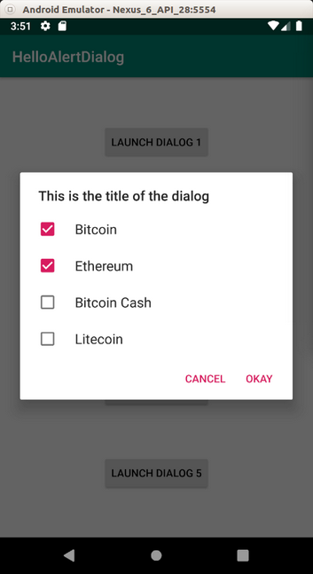

# Dialog

Android has many types of dialog.

## DatePickerDialog & TimePickerDialog

Create an empty Activity project. Name it HelloDialog1.

Edit app / res / layout / activity_main.xml.

```xml
<?xml version="1.0" encoding="utf-8"?>
<androidx.constraintlayout.widget.ConstraintLayout
        xmlns:android="http://schemas.android.com/apk/res/android"
        xmlns:tools="http://schemas.android.com/tools"
        xmlns:app="http://schemas.android.com/apk/res-auto"
        android:layout_width="match_parent"
        android:layout_height="match_parent"
        tools:context=".MainActivity">
    <Button
            android:text="Launch Date Dialog"
            android:layout_width="wrap_content"
            android:layout_height="wrap_content"
            android:id="@+id/buttonDateDialog" app:layout_constraintStart_toStartOf="parent"
            app:layout_constraintHorizontal_bias="0.5" app:layout_constraintEnd_toEndOf="parent"
            app:layout_constraintTop_toTopOf="parent" app:layout_constraintBottom_toBottomOf="parent"/>
    <Button
            android:text="Launch Time Dialog"
            android:layout_width="wrap_content"
            android:layout_height="wrap_content"
            android:id="@+id/buttonTimeDialog" android:layout_marginTop="8dp"
            app:layout_constraintTop_toBottomOf="@+id/buttonDateDialog" android:layout_marginBottom="8dp"
            app:layout_constraintBottom_toBottomOf="parent" app:layout_constraintEnd_toEndOf="parent"
            android:layout_marginEnd="8dp" app:layout_constraintStart_toStartOf="parent"
            android:layout_marginStart="8dp"/>
</androidx.constraintlayout.widget.ConstraintLayout>
```

Edit app / java / com.example.hellodialog / MainActivity.

```kotlin
package com.example.hellodialog1

import android.app.DatePickerDialog
import android.app.TimePickerDialog
import androidx.appcompat.app.AppCompatActivity
import android.os.Bundle
import android.util.Log
import android.widget.Button
import android.widget.DatePicker
import android.widget.TimePicker
import java.util.Calendar

const val logTag = "calendar"


class MainActivity : AppCompatActivity(), DatePickerDialog.OnDateSetListener, TimePickerDialog.OnTimeSetListener {

    override fun onCreate(savedInstanceState: Bundle?) {
        super.onCreate(savedInstanceState)
        setContentView(R.layout.activity_main)
        val calendar = Calendar.getInstance()
        Log.d(logTag, "calendar.time: " + calendar.time.toString())
        Log.d(logTag, "calendar.get(Calendar.YEAR): " + calendar.get(Calendar.YEAR).toString())
        Log.d(logTag, "calendar.get(Calendar.MONTH): " + calendar.get(Calendar.MONTH).toString())
        Log.d(logTag, "calendar.get(Calendar.DAY_OF_MONTH): " + calendar.get(Calendar.DAY_OF_MONTH).toString())
        Log.d(logTag, "calendar.get(Calendar.HOUR_OF_DAY): " + calendar.get(Calendar.HOUR_OF_DAY).toString())
        Log.d(logTag, "calendar.get(Calendar.MINUTE): " + calendar.get(Calendar.MINUTE).toString())
        Log.d(logTag, "calendar.timeZone.displayName: " + calendar.timeZone.displayName.toString())
        Log.d(logTag, "calendar.timeZone.rawOffset: " + calendar.timeZone.rawOffset.toString())
        Log.d(logTag, "calendar.timeInMillis: " + calendar.timeInMillis.toString())

        findViewById<Button>(R.id.buttonDateDialog).setOnClickListener {
            DatePickerDialog(this, this, 2019, 2, 2).show()
        }
        findViewById<Button>(R.id.buttonTimeDialog).setOnClickListener {
            TimePickerDialog(this, this, 23, 2, true).show()
        }
    }

    override fun onDateSet(view: DatePicker?, year: Int, month: Int, dayOfMonth: Int) {
        Log.d(logTag, "$year - $month - $dayOfMonth")
    }

    override fun onTimeSet(view: TimePicker?, hourOfDay: Int, minute: Int) {
        Log.d(logTag, "$hourOfDay - $minute")
    }
}
```

To launch DatePickerDialog, you can use this line:

```kotlin
DatePickerDialog(this, this, 2019, 2, 2).show()
```

The first parameter of DatePickerDialog is the context (activity-like object). The second parameter of DatePickerDialog is the interface. Usually you put the activity that contains this DatePickerDialog. But your activity must implement DatePickerDialog.OnDateSetListener. The third parameter, the fourth parameter, and the fifth parameters are the year, the month, and the date of the month the value of this DatePickerDialog will have. The month starts from 0 number. It means 2 is March not February. After initializing DatePickerDialog object, you must call show method.

To launch TimePickerDialog, you can use this line:

```kotlin
TimePickerDialog(this, this, 23, 2, true).show()
```

The first parameter of TimePickerDialog is the context (activity-like object). The second parameter of TimePickerDialog is the interface. Usually you put the activity that contains this TimePickerDialog. But your activity must implement TimePickerDialog.OnTimeSetListener. The third parameter and the fourth parameter are the hour and the minute of this TimePickerDialog will have. The fifth parameter is to indicate whether the third parameter and the fourth parameter are in 24-hour format or not.

If you use DatePickerDialog, you have to override onDateSet method.

```kotlin
override fun onDateSet(view: DatePicker?, year: Int, month: Int, dayOfMonth: Int) {
    Log.d(logTag, "$year - $month - $dayOfMonth")
}
```

This method will be called when you press OK in DatePickerDialog dialog.

If you use TimePickerDialog, you have to override onTimeSet method.

```kotlin
override fun onTimeSet(view: TimePicker?, hourOfDay: Int, minute: Int) {
    Log.d(logTag, "$hourOfDay - $minute")
}
```

This method will be called when you press OK in TimePickerDialog dialog.

To get the current time, you can use Calendar library from Java.

```kotlin
val calendar = Calendar.getInstance()
Log.d(logTag, "calendar.time: " + calendar.time.toString())
Log.d(logTag, "calendar.get(Calendar.YEAR): " + calendar.get(Calendar.YEAR).toString())
Log.d(logTag, "calendar.get(Calendar.MONTH): " + calendar.get(Calendar.MONTH).toString())
Log.d(logTag, "calendar.get(Calendar.DAY_OF_MONTH): " + calendar.get(Calendar.DAY_OF_MONTH).toString())
Log.d(logTag, "calendar.get(Calendar.HOUR_OF_DAY): " + calendar.get(Calendar.HOUR_OF_DAY).toString())
Log.d(logTag, "calendar.get(Calendar.MINUTE): " + calendar.get(Calendar.MINUTE).toString())
Log.d(logTag, "calendar.timeZone.displayName: " + calendar.timeZone.displayName.toString())
Log.d(logTag, "calendar.timeZone.rawOffset: " + calendar.timeZone.rawOffset.toString())
Log.d(logTag, "calendar.timeInMillis: " + calendar.timeInMillis.toString())
```

You will get this output when you run the application.

```
2019-07-25 12:13:03.836 24290-24290/com.example.hellodialog1 D/calendar: calendar.time: Thu Jul 25 12:13:03 GMT+07:00 2019
2019-07-25 12:13:03.836 24290-24290/com.example.hellodialog1 D/calendar: calendar.get(Calendar.YEAR): 2019
2019-07-25 12:13:03.836 24290-24290/com.example.hellodialog1 D/calendar: calendar.get(Calendar.MONTH): 6
2019-07-25 12:13:03.836 24290-24290/com.example.hellodialog1 D/calendar: calendar.get(Calendar.DAY_OF_MONTH): 25
2019-07-25 12:13:03.836 24290-24290/com.example.hellodialog1 D/calendar: calendar.get(Calendar.HOUR_OF_DAY): 12
2019-07-25 12:13:03.836 24290-24290/com.example.hellodialog1 D/calendar: calendar.get(Calendar.MINUTE): 13
2019-07-25 12:13:03.836 24290-24290/com.example.hellodialog1 D/calendar: calendar.timeZone.displayName: Western Indonesia Time
2019-07-25 12:13:03.836 24290-24290/com.example.hellodialog1 D/calendar: calendar.timeZone.rawOffset: 25200000
2019-07-25 12:13:03.836 24290-24290/com.example.hellodialog1 D/calendar: calendar.timeInMillis: 1564031583793
```
<p align="center">

</p>

If you click “Launch Date Dialog”, you will be presented with this dialog:

<p align="center">

</p>

If you click “Launch Time Dialog”, you will be presented with this dialog:

<p align="center">

</p>

## Alert Dialog

Other than choosing time and date, Android provides alert dialog that can show simple message. You can inherit the class from alert dialog and create a custom dialog.

Create an empty Activity project. Name it HelloDialog2.

Edit app / res / layout / activity_main.xml.

```xml
<?xml version="1.0" encoding="utf-8"?>
<androidx.constraintlayout.widget.ConstraintLayout
        xmlns:android="http://schemas.android.com/apk/res/android"
        xmlns:tools="http://schemas.android.com/tools"
        xmlns:app="http://schemas.android.com/apk/res-auto"
        android:layout_width="match_parent"
        android:layout_height="match_parent"
        tools:context=".MainActivity">
    <Button
            android:text="Launch Dialog 1"
            android:layout_width="wrap_content"
            android:layout_height="wrap_content"
            android:id="@+id/buttonDialog1"
            app:layout_constraintTop_toTopOf="parent"
            app:layout_constraintBottom_toTopOf="@+id/buttonDialog2" app:layout_constraintStart_toStartOf="parent"
            app:layout_constraintHorizontal_bias="0.5" app:layout_constraintEnd_toEndOf="parent"/>
    <Button
            android:text="Launch Dialog 2"
            android:layout_width="wrap_content"
            android:layout_height="wrap_content"
            android:id="@+id/buttonDialog2"
            app:layout_constraintTop_toBottomOf="@+id/buttonDialog1"
            app:layout_constraintBottom_toTopOf="@+id/buttonDialog3" app:layout_constraintStart_toStartOf="parent"
            app:layout_constraintHorizontal_bias="0.5" app:layout_constraintEnd_toEndOf="parent"/>
    <Button
            android:text="Launch Dialog 3"
            android:layout_width="wrap_content"
            android:layout_height="wrap_content"
            android:id="@+id/buttonDialog3"
            app:layout_constraintTop_toBottomOf="@+id/buttonDialog2"
            app:layout_constraintBottom_toTopOf="@+id/buttonDialog4" app:layout_constraintStart_toStartOf="parent"
            app:layout_constraintHorizontal_bias="0.5" app:layout_constraintEnd_toEndOf="parent"/>
    <Button
            android:text="Launch Dialog 4"
            android:layout_width="wrap_content"
            android:layout_height="wrap_content"
            android:id="@+id/buttonDialog4"
            app:layout_constraintTop_toBottomOf="@+id/buttonDialog3"
            app:layout_constraintBottom_toTopOf="@+id/buttonDialog5" app:layout_constraintStart_toStartOf="parent"
            app:layout_constraintHorizontal_bias="0.5" app:layout_constraintEnd_toEndOf="parent"/>
    <Button
            android:text="Launch Dialog 5"
            android:layout_width="wrap_content"
            android:layout_height="wrap_content"
            android:id="@+id/buttonDialog5"
            app:layout_constraintBottom_toBottomOf="parent" app:layout_constraintTop_toBottomOf="@+id/buttonDialog4"
            app:layout_constraintStart_toStartOf="parent" app:layout_constraintHorizontal_bias="0.5"
            app:layout_constraintEnd_toEndOf="parent"/>
</androidx.constraintlayout.widget.ConstraintLayout>
```

There are five buttons in this layout.

Create a new layout resource file, app / res / layout / custom_dialog.xml.

```xml
<?xml version="1.0" encoding="utf-8"?>
<androidx.constraintlayout.widget.ConstraintLayout xmlns:android="http://schemas.android.com/apk/res/android"
                                                   xmlns:app="http://schemas.android.com/apk/res-auto"
                                                   xmlns:tools="http://schemas.android.com/tools"
                                                   android:layout_width="match_parent"
                                                   android:layout_height="match_parent">
    <ImageView
            android:src="@drawable/tree"
            android:layout_width="100dp"
            android:layout_height="60dp" tools:srcCompat="@tools:sample/avatars[2]"
            android:id="@+id/imageView" android:layout_marginTop="40dp"
            app:layout_constraintTop_toTopOf="parent" app:layout_constraintEnd_toEndOf="parent"
            android:layout_marginEnd="8dp" app:layout_constraintStart_toStartOf="parent"
            android:layout_marginStart="8dp"/>
    <EditText
            android:id="@+id/username"
            android:inputType="textEmailAddress"
            android:layout_width="match_parent"
            android:layout_height="wrap_content"
            android:layout_marginTop="24dp"
            android:hint="Username" app:layout_constraintTop_toBottomOf="@+id/imageView"
            app:layout_constraintEnd_toEndOf="parent" app:layout_constraintStart_toStartOf="parent"
            app:layout_constraintHorizontal_bias="0.5"/>
    <EditText
            android:id="@+id/password"
            android:inputType="textPassword"
            android:layout_width="match_parent"
            android:layout_height="wrap_content"
            android:layout_marginTop="24dp"
            android:hint="Password" app:layout_constraintTop_toBottomOf="@+id/username"
            app:layout_constraintEnd_toEndOf="parent" app:layout_constraintStart_toStartOf="parent"
            app:layout_constraintHorizontal_bias="0.5"/>
    <Switch
            android:text="Remember Password"
            android:layout_width="wrap_content"
            android:layout_height="wrap_content"
            android:id="@+id/rememberPassword" android:layout_marginTop="24dp"
            app:layout_constraintTop_toBottomOf="@+id/password" app:layout_constraintEnd_toEndOf="parent"
            android:layout_marginEnd="8dp"/>
</androidx.constraintlayout.widget.ConstraintLayout>
```

This will be the layout of the custom dialog which you are going to build.

Each button will launch a unique dialog. There are 5 buttons in the layout resource file. So there are 5 kinds of dialog.

Each kind of dialog will be based on DialogFragment.

### First Kind of Dialog

Create a new class, app / java / com.example.hellodialog2 / SimpleDialogFragment.

```kotlin
package com.example.hellodialog2

import android.app.Dialog
import android.os.Bundle
import android.util.Log
import androidx.appcompat.app.AlertDialog
import androidx.fragment.app.DialogFragment

class SimpleDialogFragment : DialogFragment() {

    override fun onCreateDialog(savedInstanceState: Bundle?): Dialog {
        return activity?.let {
            val builder = AlertDialog.Builder(it)
            builder.setMessage(R.string.dialog_message)
                .setTitle(R.string.dialog_title)
                .setPositiveButton(R.string.positive_button_message) { dialog, id ->
                    Log.d("alert-dialog", "OK Button Pressed")
                }
                .setNegativeButton(R.string.negative_button_message) { dialog, id ->
                    Log.d("alert-dialog", "Cancel Button Pressed")
                }
            builder.create()
        } ?: throw IllegalStateException("Activity cannot be null")
    }

}
```

So you create a child class of DialogFragment. Then you override onCreateDialog method.

Inside onCreateDialog method, you create a dialog with the builder from AlertDialog.Builder. With the builder, you can set message, set title, set the string and the callback on the positive button and the negative button. To create the dialog, you call method ‘create’ from builder object.

Don’t forget to create a string resource file, app / res / values / strings.xml.

```xml
<resources>
    <string name="app_name">HelloDialog2</string>
    <string name="dialog_message">This is the message of the dialog</string>
    <string name="dialog_title">This is the title of the dialog</string>
    <string name="positive_button_message">Okay</string>
    <string name="negative_button_message">Cancel</string>
</resources>
```

### Second Kind of Dialog

Create a new class, app / java / com.example.hellodialog2 / ListDialogFragment.

```kotlin
package com.example.hellodialog2

import android.app.Dialog
import android.os.Bundle
import android.util.Log
import androidx.appcompat.app.AlertDialog
import androidx.fragment.app.DialogFragment

class ListDialogFragment : DialogFragment() {

    override fun onCreateDialog(savedInstanceState: Bundle?): Dialog {
        val arrayOfStrings = arrayOf("Bitcoin", "Ethereum", "Monero", "Bitcoin Case")
        return activity?.let {
            val builder = AlertDialog.Builder(it)
            builder
                .setItems(arrayOfStrings) { dialog, id ->
                    Log.d("alert-dialog", "Item pressed " + id.toString())
                }
                .setTitle(R.string.dialog_title)
                .setPositiveButton(R.string.positive_button_message) { dialog, id ->
                    Log.d("alert-dialog", "OK Button Pressed")
                }
                .setNegativeButton(R.string.negative_button_message) { dialog, id ->
                    Log.d("alert-dialog", "Cancel Button Pressed")
                }
            builder.create()
        } ?: throw IllegalStateException("Activity cannot be null")
    }

}
```

Instead of ‘setMessage’, this time you use ‘setItems’ method. You give an array of strings as parameter to ‘setItems’ method.

In this dialog, you choose one among many options.

### Third Kind of Dialog

Create a new class, app / java / com.example.hellodialog2 / MultipleOptionsListDialogFragment.

```kotlin
package com.example.hellodialog2

import android.app.Dialog
import android.os.Bundle
import android.util.Log
import androidx.appcompat.app.AlertDialog
import androidx.fragment.app.DialogFragment

class MultipleOptionsListDialogFragment : DialogFragment() {

    override fun onCreateDialog(savedInstanceState: Bundle?): Dialog {
        return activity?.let {
            val builder = AlertDialog.Builder(it)
            val selectedItems = ArrayList<Int>()
            builder
                .setMultiChoiceItems(R.array.dialog_options, null) { dialog, which, isChecked ->
                    if (isChecked) {
                        selectedItems.add(which)
                    } else if (selectedItems.contains(which)) {
                        selectedItems.remove(Integer.valueOf(which))
                    }
                }
                .setTitle(R.string.dialog_title)
                .setPositiveButton(R.string.positive_button_message) { dialog, id ->
                    Log.d("alert-dialog", "OK Button Pressed")
                    selectedItems.forEach { item ->
                        Log.d("alert-dialog", item.toString())
                    }
                }
                .setNegativeButton(R.string.negative_button_message) { dialog, id ->
                    Log.d("alert-dialog", "Cancel Button Pressed")
                }
            builder.create()
        } ?: throw IllegalStateException("Activity cannot be null")
    }

}
```

And you must define the array in xml file. Create app / res / values / arrays.xml.

```xml
<?xml version="1.0" encoding="utf-8"?>
<resources>
    <array name="dialog_options">
        <item>Bitcoin</item>
        <item>Ethereum</item>
        <item>Bitcoin Cash</item>
        <item>Litecoin</item>
    </array>
</resources>
```

Instead of ‘setMessage’ or ‘setItems’, you use ‘setMultiChoiceItems’ method. The first parameter is the array, the second parameter is the checked items by default, the third parameter is the callback when you click the item in this dialog. In this example, you add the checked item inside array list.

### Fourth Kind of Dialog

Create a new class, app / java / com.example.hellodialog2 / CustomDialogFragment.

```kotlin
package com.example.helloalertdialog

import android.app.Dialog
import android.os.Bundle
import android.util.Log
import android.widget.EditText
import android.widget.Switch
import androidx.appcompat.app.AlertDialog
import androidx.fragment.app.DialogFragment

class CustomDialogFragment : DialogFragment() {

    override fun onCreateDialog(savedInstanceState: Bundle?): Dialog {
        return activity?.let {
            val builder = AlertDialog.Builder(it)

            val inflater = requireActivity().layoutInflater
            val view = inflater.inflate(R.layout.custom_dialog, null)
            val usernameEditText = view.findViewById<EditText>(R.id.username)
            val passwordEditText = view.findViewById<EditText>(R.id.password)
            val rememberPasswordSwitch = view.findViewById<Switch>(R.id.rememberPassword)

            builder.setView(view)
                .setTitle(R.string.dialog_title)
                .setPositiveButton(R.string.positive_button_message) { dialog, id ->
                    Log.d("alert-dialog", "OK Button Pressed")
                    Log.d("alert-dialog", usernameEditText.text.toString())
                    Log.d("alert-dialog", passwordEditText.text.toString())
                    Log.d("alert-dialog", rememberPasswordSwitch.isChecked.toString())
                }
                .setNegativeButton(R.string.negative_button_message) { dialog, id ->
                    Log.d("alert-dialog", "Cancel Button Pressed")
                }
            builder.create()
        } ?: throw IllegalStateException("Activity cannot be null")
    }
}
```

You get the layout inflater to get the view.

```kotlin
val inflater = requireActivity().layoutInflater
val view = inflater.inflate(R.layout.custom_dialog, null)
```

From the view you can get the reference to the edit text or the switch.

```kotlin
val usernameEditText = view.findViewById<EditText>(R.id.username)
val passwordEditText = view.findViewById<EditText>(R.id.password)
val rememberPasswordSwitch = view.findViewById<Switch>(R.id.rememberPassword)
```

Then instead of ‘setMessage’, ‘setItems’, or ‘setMultiChoiceItems’, you use setView method. The parameter that you sent to this method is the view that you get from the inflater previously.

### Fifth Kind of Dialog

Create a new class, app / java / com.example.hellodialog2 / PassParameterToActivityDialogFragment.

All of these dialogs handle what happens when you click positive button or negative button inside their class. But you can let the activity containing this dialog fragment to handle things when you click positive button or negative button.

```kotlin
package com.example.hellodialog2

import android.app.Dialog
import android.content.Context
import android.os.Bundle
import androidx.appcompat.app.AlertDialog
import androidx.fragment.app.DialogFragment

class PassParameterToActivityDialogFragment : DialogFragment() {

    private lateinit var listener: PassParameterToActivityListener

    interface PassParameterToActivityListener {
        fun onPositiveButtonClick(dialog: DialogFragment)
        fun onNegativeButtonClick(dialog: DialogFragment)
    }

    override fun onAttach(context: Context?) {
        super.onAttach(context)
        try {
            listener = context as PassParameterToActivityListener
        } catch (e: ClassCastException) {
            throw java.lang.ClassCastException((context.toString() + " must implement PassParameterToActivityListener"))
        }
    }

    override fun onCreateDialog(savedInstanceState: Bundle?): Dialog {
        return activity?.let {
            val builder = AlertDialog.Builder(it)
            builder.setMessage(R.string.dialog_message)
                .setTitle(R.string.dialog_title)
                .setPositiveButton(R.string.positive_button_message) { dialog, id ->
                    listener.onPositiveButtonClick(this)
                }
                .setNegativeButton(R.string.negative_button_message) { dialog, id ->
                    listener.onNegativeButtonClick(this)
                }
            builder.create()
        } ?: throw IllegalStateException("Activity cannot be null")
    }

}
```

You create an interface of PassParameterToActivityListener. This is just a custom abstract 

```kotlin
interface PassParameterToActivityListener {
    fun onPositiveButtonClick(dialog: DialogFragment)
    fun onNegativeButtonClick(dialog: DialogFragment)
}
```

Then create a variable of this type of interface.

```kotlin
private lateinit var listener: PassParameterToActivityListener
```

Then force the activity that hosts this fragment to implement this listener.

```kotlin
override fun onAttach(context: Context?) {
    super.onAttach(context)

    try {
        listener = context as PassParameterToActivityListener
    } catch (e: ClassCastException) {
        throw java.lang.ClassCastException((context.toString() + " must implement PassParameterToActivityListener"))
    }
}
```

In the callback of positive and negative buttons, you execute the methods defined in this listener.

```kotlin
.setPositiveButton(R.string.positive_button_message) { dialog, id ->
    listener.onPositiveButtonClick(this)
}
.setNegativeButton(R.string.negative_button_message) { dialog, id ->
    listener.onNegativeButtonClick(this)
}
```

Finally, edit app / java / com.example.hellodialog2 / MainActivity.

```kotlin
package com.example.helloalertdialog
import androidx.appcompat.app.AppCompatActivity
import android.os.Bundle
import android.util.Log
import android.widget.Button
import androidx.fragment.app.DialogFragment

class MainActivity : AppCompatActivity(), PassParameterToActivityDialogFragment.PassParameterToActivityListener {

    override fun onCreate(savedInstanceState: Bundle?) {
        super.onCreate(savedInstanceState)
        setContentView(R.layout.activity_main)
        findViewById<Button>(R.id.buttonDialog1).setOnClickListener {
            SimpleDialogFragment().show(supportFragmentManager, "simple dialog")
        }
        findViewById<Button>(R.id.buttonDialog2).setOnClickListener {
            ListDialogFragment().show(supportFragmentManager, "list dialog")
        }
        findViewById<Button>(R.id.buttonDialog3).setOnClickListener {
            MultipleOptionsListDialogFragment().show(supportFragmentManager, "multiple options list dialog")
        }
        findViewById<Button>(R.id.buttonDialog4).setOnClickListener {
            CustomDialogFragment().show(supportFragmentManager, "custom dialog")
        }
        findViewById<Button>(R.id.buttonDialog5).setOnClickListener {
            PassParameterToActivityDialogFragment().show(supportFragmentManager, "pass parameter to activity dialog")
        }
    }

    override fun onPositiveButtonClick(dialog: DialogFragment) {
        Log.d("main-activity", "Positive button from dialog clicked")
    }

    override fun onNegativeButtonClick(dialog: DialogFragment) {
        Log.d("main-activity", "Negative button from dialog clicked")
    }
}
```

The MainActivity class must implement the listener (interface). Because of that, MainActivity must override two methods defined in the interface.

```kotlin
override fun onPositiveButtonClick(dialog: DialogFragment) {
    Log.d("main-activity", "Positive button from dialog clicked")
}

override fun onNegativeButtonClick(dialog: DialogFragment) {
    Log.d("main-activity", "Negative button from dialog clicked")
}
```

To launch the dialog, you can call ‘show’ method.

```kotlin
override fun onCreate(savedInstanceState: Bundle?) {
    super.onCreate(savedInstanceState)
    setContentView(R.layout.activity_main)

    findViewById<Button>(R.id.buttonDialog1).setOnClickListener {
        SimpleDialogFragment().show(supportFragmentManager, "simple dialog")
    }

    findViewById<Button>(R.id.buttonDialog2).setOnClickListener {
        ListDialogFragment().show(supportFragmentManager, "list dialog")
    }

    findViewById<Button>(R.id.buttonDialog3).setOnClickListener {
        MultipleOptionsListDialogFragment().show(supportFragmentManager, "multiple options list dialog")
    }

    findViewById<Button>(R.id.buttonDialog4).setOnClickListener {
        CustomDialogFragment().show(supportFragmentManager, "custom dialog")
    }

    findViewById<Button>(R.id.buttonDialog5).setOnClickListener {
        PassParameterToActivityDialogFragment().show(supportFragmentManager, "pass parameter to activity dialog")
    }
}
```

Run the application and you will be presented with 5 buttons.

<p align="center">

</p>

The first dialog can be launched by clicking “Launch Dialog 1”.

<p align="center">

</p>

The second dialog can be launched by clicking “Launch Dialog 2”.

<p align="center">

</p>

The third dialog can be launched by clicking “Launch Dialog 3”.

<p align="center">

</p>

The fourth dialog can be launched by clicking “Launch Dialog 4”.

<p align="center">

</p>

The fifth dialog can be launched by clicking “Launch Dialog 5”. It is same as the first dialog. But when you click “Cancel” or “Okay” button, you’ll get different message in the log.

<p align="center">

</p>

# Optional Readings

https://developer.android.com/guide/topics/ui/dialogs

https://developer.android.com/reference/kotlin/android/app/Dialog?hl=en


# Exercise

1. Create a custom dialog like this screenshot.
<p align="center">

</p>


