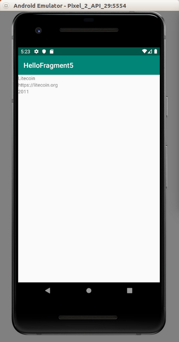

# Fragment

Usually Android application does not use Activity directly. It uses Fragment. So Activity does not host widgets (button, textview, etc) directly but it uses Fragment which contains those widgets.

Create a new empty Android project. Name it HelloFragment1.

Right click directory of “com.example.hellofragment1”, then create a new fragment, File – New – Fragment – Fragment (Blank).

<p align="center">

</p>

In the dialog window, give ButtonFragment as fragment name, fragment_button as Fragment Layout Name. Uncheck “Include fragment factory...”, “include interface callback?”.

Edit app / res / layout / fragment_button.xml.

```xml
<?xml version="1.0" encoding="utf-8"?>
<FrameLayout xmlns:android="http://schemas.android.com/apk/res/android"
             xmlns:tools="http://schemas.android.com/tools"
             android:layout_width="match_parent"
             android:layout_height="match_parent"
             tools:context=".ButtonFragment">
    <Button xmlns:android="http://schemas.android.com/apk/res/android"
            android:id="@+id/button"
            android:text="Button"
            android:layout_width="wrap_content"
            android:layout_height="wrap_content">
    </Button>
</FrameLayout>
```

This frame layout has just one button.

Edit app / java / com.example.hellofragment1 / ButtonFragment.

```kotlin
package com.example.hellofragment1

import android.os.Bundle
import androidx.fragment.app.Fragment
import android.view.LayoutInflater
import android.view.View
import android.view.ViewGroup
import android.widget.Button


class ButtonFragment : Fragment() {

    override fun onCreateView(
        inflater: LayoutInflater, container: ViewGroup?,
        savedInstanceState: Bundle?
    ): View? {
        val result = inflater.inflate(R.layout.fragment_button, container, false)
        result.findViewById<Button>(R.id.button).setOnClickListener {
            (activity as MainActivity).buttonCallback()
        }
        return result
    }
    
}
```

In Activity, you override onCreate, in fragment, you override onCreateView. Frame can get host activity.

Edit app / java / com.example.hellofragment1 / MainActivity.

```kotlin
package com.example.hellofragment1

import androidx.appcompat.app.AppCompatActivity
import android.os.Bundle
import android.widget.Toast

class MainActivity : AppCompatActivity() {

    override fun onCreate(savedInstanceState: Bundle?) {
        super.onCreate(savedInstanceState)
        setContentView(R.layout.activity_main)
    }

    fun buttonCallback() {
        Toast.makeText(this, "Button is clicked", Toast.LENGTH_SHORT).show()
    }
}
```

Lastly, don’t forget to edit activity_main.xml.

```xml
<?xml version="1.0" encoding="utf-8"?>
<fragment xmlns:android="http://schemas.android.com/apk/res/android"
          android:layout_width="match_parent"
          android:layout_height="match_parent"
          android:name="com.example.hellofragment1.ButtonFragment" />
```

You must set the fragment class in this fragment xml file.

Run the application.

<p align="center">

</p>

## Dynamic Fragment

The one you created just now is Static Fragment. You can create a dynamic fragment.

Create an empty Activity Android project. Name it HelloFragment2.

Add a new fragment. Name it ButtonFragment for the class and fragment_button.xml for the layout resource.

Edit app / java / com.example.hellofragment2 / ButtonFragment.

```kotlin
package com.example.hellofragment2

import android.os.Bundle
import androidx.fragment.app.Fragment
import android.view.LayoutInflater
import android.view.View
import android.view.ViewGroup
import android.widget.Button


class ButtonFragment : Fragment() {
    override fun onCreateView(
        inflater: LayoutInflater, container: ViewGroup?,
        savedInstanceState: Bundle?
    ): View? {
        val result = inflater.inflate(R.layout.fragment_button, container, false)
        result.findViewById<Button>(R.id.button).setOnClickListener {
            (activity as MainActivity).buttonCallback()
        }
        return result
    }

}
```

Edit app / res / layout / fragment_button.xml.

```xml
<?xml version="1.0" encoding="utf-8"?>
<FrameLayout xmlns:android="http://schemas.android.com/apk/res/android"
             xmlns:tools="http://schemas.android.com/tools"
             android:layout_width="match_parent"
             android:layout_height="match_parent"
             tools:context=".ButtonFragment">
    <Button xmlns:android="http://schemas.android.com/apk/res/android"
            android:id="@+id/button"
            android:text="Button"
            android:layout_width="wrap_content"
            android:layout_height="wrap_content">
    </Button>
</FrameLayout>
```

Then edit MainActivity.kt. This is where the difference lies.

```kotlin
package com.example.hellofragment2

import androidx.appcompat.app.AppCompatActivity
import android.os.Bundle
import android.widget.Toast


class MainActivity : AppCompatActivity() {

    override fun onCreate(savedInstanceState: Bundle?) {
        super.onCreate(savedInstanceState)
        if (supportFragmentManager.findFragmentById(android.R.id.content) == null) {
            supportFragmentManager.beginTransaction()
                .add(android.R.id.content,
                    ButtonFragment()).commit()
        }
    }

    fun buttonCallback() {
        Toast.makeText(this, "Button is clicked", Toast.LENGTH_SHORT).show()
    }
}
```

There is no setContentView method anymore. You use supportFragmentManager to add ButtonFragment fragment.

Run the application.

<p align="center">

</p>

## Changing Frame Inside One Activity

Create an empty Activity Android project. Name it HelloFragment3.

Add one dependency to build.gradle (Module:app).

```
implementation 'androidx.fragment:fragment-ktx:1.0.0'
```

Rename app / res / layout / activity_main.xml to app / res / layout / fragment_main.xml. Then edit app / res / layout / fragment_main.xml.

```xml
<?xml version="1.0" encoding="utf-8"?>
<androidx.constraintlayout.widget.ConstraintLayout
        xmlns:android="http://schemas.android.com/apk/res/android"
        xmlns:tools="http://schemas.android.com/tools"
        xmlns:app="http://schemas.android.com/apk/res-auto"
        android:layout_width="match_parent"
        android:layout_height="match_parent"
        tools:context=".MainActivity">
    <Button
            android:text="Button"
            android:layout_width="wrap_content"
            android:layout_height="wrap_content"
            android:id="@+id/button" android:layout_marginTop="8dp"
            app:layout_constraintTop_toTopOf="parent" android:layout_marginBottom="8dp"
            app:layout_constraintBottom_toBottomOf="parent" app:layout_constraintStart_toStartOf="parent"
            android:layout_marginStart="8dp" app:layout_constraintEnd_toEndOf="parent" android:layout_marginEnd="8dp"/>
</androidx.constraintlayout.widget.ConstraintLayout>
```

Then add new layout resource file: app / res / layout / fragment_detail.xml.

```xml
<?xml version="1.0" encoding="utf-8"?>
<androidx.constraintlayout.widget.ConstraintLayout xmlns:android="http://schemas.android.com/apk/res/android"
                                                   xmlns:app="http://schemas.android.com/apk/res-auto"
                                                   android:layout_width="match_parent"
                                                   android:layout_height="match_parent">
    <TextView
            android:text="TextView"
            android:layout_width="wrap_content"
            android:layout_height="wrap_content"
            android:id="@+id/textView" app:layout_constraintTop_toTopOf="parent"
            android:layout_marginBottom="8dp" app:layout_constraintBottom_toBottomOf="parent"
            app:layout_constraintEnd_toEndOf="parent" android:layout_marginEnd="8dp"
            app:layout_constraintStart_toStartOf="parent" android:layout_marginStart="8dp"/>
</androidx.constraintlayout.widget.ConstraintLayout>
```

Add new class, DetailFragment.

```kotlin
package com.example.hellofragment3

import android.os.Bundle
import android.view.LayoutInflater
import android.view.View
import android.view.ViewGroup
import android.widget.TextView
import androidx.fragment.app.Fragment


class DetailFragment : Fragment() {

    override fun onCreateView(inflater: LayoutInflater, container: ViewGroup?, savedInstanceState: Bundle?): View? {
        return inflater.inflate(R.layout.fragment_detail, container, false)
    }

    override fun onViewCreated(view: View, savedInstanceState: Bundle?) {
        super.onViewCreated(view, savedInstanceState)
        view.findViewById<TextView>(R.id.textView).text = "Fragment 2"
    }
}
```

Add new class, app / java / com.example.hellofragment3 / MainFragment.

```kotlin
package com.example.hellofragment3

import android.os.Bundle
import android.view.LayoutInflater
import android.view.View
import android.view.ViewGroup
import android.widget.Button
import androidx.fragment.app.Fragment
import androidx.fragment.app.transaction


class MainFragment : Fragment() {

    override fun onCreateView(inflater: LayoutInflater, container: ViewGroup?, savedInstanceState: Bundle?): View? {
        return inflater.inflate(R.layout.fragment_main, container, false)
    }

    override fun onViewCreated(view: View, savedInstanceState: Bundle?) {
        super.onViewCreated(view, savedInstanceState)
        view.findViewById<Button>(R.id.button).setOnClickListener{
            fragmentManager?.transaction {
                replace(android.R.id.content, DetailFragment())
                addToBackStack(null)
            }
        }
    }
}
```

To replace the fragment, this is how you do it:

```kotlin
fragmentManager?.transaction {
    replace(android.R.id.content, DetailFragment())
    addToBackStack(null)
}
```

You use replace method to replace the fragment. addToBackStack method is to prevent you exit the activity when you press Back button in DetailFragment.

Lastly, edit app / java / com.example.hellofragment3 / MainActivity. We want to make sure we load MainFragment in the beginning.

```kotlin
package com.example.hellofragment3

import androidx.appcompat.app.AppCompatActivity
import android.os.Bundle


class MainActivity : AppCompatActivity() {

    override fun onCreate(savedInstanceState: Bundle?) {
        super.onCreate(savedInstanceState)
        if (supportFragmentManager.findFragmentById(android.R.id.content) == null) {
            supportFragmentManager.beginTransaction()
                .add(android.R.id.content,
                    MainFragment()).commit()
        }
    }
}
```

Run the application. If you click the button, the fragment will be changed.

<p align="center">

</p>

If you press back button, the DetailFragment fragment will be popped up.

<p align="center">

</p>

## ViewModel

ViewModel is a way to keep data when Android activity is being created and destroyed. Otherwise you have to keep the data manually by overriding lifecycle activity callback.

Create a new empty Activity project. Name it HelloFragment4.

Edit build.gradle (Module::app). Add these two dependencies.

```
implementation 'androidx.lifecycle:lifecycle-extensions:2.0.0'
implementation 'androidx.lifecycle:lifecycle-viewmodel-ktx:2.0.0'
```

Add new layout resource. Name it app / res / layout / fragment_text.xml.

```xml
<?xml version="1.0" encoding="utf-8"?>
<FrameLayout xmlns:android="http://schemas.android.com/apk/res/android"
             xmlns:tools="http://schemas.android.com/tools"
             android:layout_width="match_parent"
             android:layout_height="match_parent"
             tools:context=".TextFragment">
    <TextView
            android:id="@+id/textView"
            android:layout_width="match_parent"
            android:layout_height="match_parent"
            android:text="Hello Blank Fragment"/>
</FrameLayout>
```

Add a new class. This is our ViewModel. Name it app / java / com.example.hellofragment4 / BasicViewModel.

```kotlin
package com.example.hellofragment4

import androidx.lifecycle.ViewModel


class BasicViewModel : ViewModel() {
    private val cryptocurrencies = arrayOf("bitcoin", "ethereum", "monero", "bitcoin cash", "litecoin", "eos", "zcash")
    val cryptocurrency = cryptocurrencies.random()
}
```

You use ViewModel in the fragment not the activity. Create a new class, app / java / com.example.hellofragment4 / TextFragment.

```kotlin
package com.example.hellofragment4

import android.os.Bundle
import android.view.LayoutInflater
import android.view.View
import android.view.ViewGroup
import android.widget.TextView
import androidx.fragment.app.Fragment
import androidx.lifecycle.ViewModelProviders
import androidx.lifecycle.get


class TextFragment : Fragment() {
    override fun onCreateView(
        inflater: LayoutInflater, container: ViewGroup?,
        savedInstanceState: Bundle?
    ): View? {
        val result = inflater.inflate(R.layout.fragment_text, container, false)
        val textView = result.findViewById<TextView>(R.id.textView)
        val viewModel: BasicViewModel = ViewModelProviders.of(this).get()
        textView.text = viewModel.cryptocurrency
        return result
    }
}
```

You get the data from the viewmodel. The ViewModelProviders can get the same viewmodel if the activity is being destroyed and created.

In the activity, MainActivity, you need add the fragment in usual way.

```kotlin
package com.example.hellofragment4

import androidx.appcompat.app.AppCompatActivity
import android.os.Bundle


class MainActivity : AppCompatActivity() {

    override fun onCreate(savedInstanceState: Bundle?) {
        super.onCreate(savedInstanceState)
        if (supportFragmentManager.findFragmentById(android.R.id.content) == null) {
            supportFragmentManager.beginTransaction()
                .add(android.R.id.content,
                    TextFragment()).commit()
        }
    }
}
```

You can run the application and when you rotate the device, the data should stay the same.

<p align="center">

</p>

## Fragment with ViewModel in Master Detail Setting

It’s very common to create a list screen and if you click one of the rows, you’ll get directed to another screen, the detail screen.

Previously the usual way is to create two activities. Then you send a parameter from master activity to detail activity using Intent.

The new way is to keep using one activity but using two fragments. You can pass data easily in one activity.

Let’s create an empty Activity project. Name it HelloFragment5.

Edit build.gradle (Module.app). Add these three dependencies.

```
implementation 'androidx.lifecycle:lifecycle-viewmodel-ktx:2.0.0'
implementation 'androidx.lifecycle:lifecycle-extensions:2.0.0'
implementation 'androidx.fragment:fragment-ktx:1.0.0'
```

Create three new layout resources. 

The first one is fragment_list.xml. This is the master’s list layout resource file.

```xml
<?xml version="1.0" encoding="utf-8"?>
<androidx.recyclerview.widget.RecyclerView xmlns:android="http://schemas.android.com/apk/res/android"
                                           android:id="@+id/list"
                                           android:layout_width="match_parent"
                                           android:layout_height="match_parent">
</androidx.recyclerview.widget.RecyclerView>
```

The second one is fragment_row.xml. This is the master’s row layout resource file.

```xml
<?xml version="1.0" encoding="utf-8"?>
<LinearLayout xmlns:android="http://schemas.android.com/apk/res/android"
              android:orientation="horizontal"
              android:layout_width="match_parent"
              android:gravity="center"
              android:background="@color/colorPrimary"
              android:layout_marginTop="10dp"
              android:layout_marginStart="10dp"
              android:layout_marginEnd="10dp"
              android:layout_height="50dp">
    <TextView
            android:text="TextView"
            android:textColor="@color/colorWhite"
            android:layout_width="wrap_content"
            android:layout_height="wrap_content" android:id="@+id/nameRowTextView" android:layout_weight="1"/>
    <TextView
            android:text="TextView"
            android:textColor="@color/colorWhite"
            android:layout_width="wrap_content"
            android:layout_height="wrap_content" android:id="@+id/urlRowTextView" android:layout_weight="1"/>
</LinearLayout>
```

The third one is fragment_detail.xml. This is the detail screen layout resource file.

```xml
<?xml version="1.0" encoding="utf-8"?>
<LinearLayout xmlns:android="http://schemas.android.com/apk/res/android"
              android:orientation="vertical"
              android:layout_width="match_parent"
              android:layout_height="match_parent">
    <TextView
            android:text="Bitcoin"
            android:layout_width="match_parent"
            android:layout_height="wrap_content" android:id="@+id/nameTextView"/>
    <TextView
            android:text="https://bitcoin.org"
            android:layout_width="match_parent"
            android:layout_height="wrap_content" android:id="@+id/urlTextView"/>
    <TextView
            android:text="2009"
            android:layout_width="match_parent"
            android:layout_height="wrap_content" android:id="@+id/createdOnTextView"/>
</LinearLayout>
```

Edit app / res /values / colors.xml.

```xml
<?xml version="1.0" encoding="utf-8"?>
<resources>
    <color name="colorPrimary">#008577</color>
    <color name="colorPrimaryDark">#00574B</color>
    <color name="colorAccent">#D81B60</color>
    <color name="colorWhite">#FFFFFF</color>
</resources>
```

Then you need to create 9 Kotlin files.

Create app / java / com.example.hellofragment5 / CryptocurrencyModel.

```kotlin
package com.example.hellofragment5


data class CryptocurrencyModel (
    val id: Int,
    val name: String,
    val url: String,
    val createdOn: Int
)
```

This is like a struct of your data.

Create app / java / com.example.hellofragment5 / CryptocurrencyRepository.

```kotlin
package com.example.hellofragment5


object CryptocurrencyRepository {
    private val cryptocurrencies = listOf(
        CryptocurrencyModel(
            id = 1,
            name = "Bitcoin",
            url = "https://bitcoin.org",
            createdOn = 2009
        ),
        CryptocurrencyModel(
            id = 2,
            name = "Ethereum",
            url = "https://ethereum.org",
            createdOn = 2014
        ),
        CryptocurrencyModel(
            id = 3,
            name = "Bitcoin Cash",
            url = "https://bitcoin.com",
            createdOn = 2015
        ),
        CryptocurrencyModel(
            id = 4,
            name = "Litecoin",
            url = "https://litecoin.org",
            createdOn = 2011
        )
    ).associateBy { it.id }

    fun getCryptocurrencies() : List<CryptocurrencyModel> = cryptocurrencies.values.toList()

    fun findCryptocurrencyById(id: Int) = cryptocurrencies[id]
}
```

This is basically a wrapper around of your model list. If you want to make it simpler, you can just use the list of your models.

Create your first view model that is used by Master fragment. Name it app / java / com.example.hellofragment5 / CryptocurrenciesListViewModel.

```kotlin
package com.example.hellofragment5

import androidx.lifecycle.ViewModel


class CryptocurrenciesListViewModel : ViewModel() {
    val cryptocurrencies = CryptocurrencyRepository.getCryptocurrencies()
}
```

Create your second view model that is used by Detail fragment. Name it DetailViewModel.kt.

```kotlin
package com.example.hellofragment5

import androidx.lifecycle.ViewModel


class DetailViewModel : ViewModel() {
    private var model: CryptocurrencyModel? = null
    fun getModel(id: Int) = model ?: CryptocurrencyRepository.findCryptocurrencyById(id).also { model = it }
}
```

Then create view holder. Name it CryptocurrencyViewHolder.kt.

```kotlin
package com.example.hellofragment5

import android.view.View
import android.widget.TextView
import androidx.recyclerview.widget.RecyclerView


class CryptocurrencyViewHolder(private val view : View, rowClicked: (CryptocurrencyModel) -> Unit) : RecyclerView.ViewHolder(view), View.OnClickListener {

    private val nameRowTextView : TextView = this.view.findViewById(R.id.nameRowTextView)
    private val urlRowTextView : TextView = this.view.findViewById(R.id.urlRowTextView)
    private var rowClicked : (CryptocurrencyModel) -> Unit
    private lateinit var model: CryptocurrencyModel

    init {
        view.setOnClickListener(this)
        this.rowClicked = rowClicked
    }

    fun bindModel(item : CryptocurrencyModel) {
        this.nameRowTextView.text = item.name
        this.urlRowTextView.text = item.url
        this.model = item
    }

    override fun onClick(view : View) {
        rowClicked(this.model)
    }
}
```

This constructor function accepts other parameter other than layout. The function itself which will be defined in master fragment. You will execute this callback in onClick method callback of this view holder.

Then create an adapter. Name it app / java / com.example.hellofragment5 / CryptocurrencyListAdapter.

```kotlin
package com.example.hellofragment5

import android.view.LayoutInflater
import android.view.ViewGroup
import androidx.recyclerview.widget.RecyclerView


class CryptocurrencyListAdapter(private val dataset: List<CryptocurrencyModel>, private val rowClicked: (CryptocurrencyModel) -> Unit) : RecyclerView.Adapter<CryptocurrencyViewHolder>() {
    
    override fun onCreateViewHolder(parent: ViewGroup, viewType: Int): CryptocurrencyViewHolder {
        val layout = LayoutInflater.from(parent.context).inflate(R.layout.fragment_row, parent, false)
        return CryptocurrencyViewHolder(layout, rowClicked)
    }
    
    override fun onBindViewHolder(holder: CryptocurrencyViewHolder, position: Int) {
        holder.bindModel(dataset[position])
    }
    
    override fun getItemCount(): Int {
        return dataset.count()
    }
}
```

This adapter also accepts the second parameter of callback. The adapter just passes it to the view holder.

Create app / java / com.example.hellofragment5 / DetailFragment.kt file.

```kotlin
package com.example.hellofragment5

import android.os.Bundle
import android.view.LayoutInflater
import android.view.View
import android.view.ViewGroup
import android.widget.TextView
import androidx.fragment.app.Fragment
import androidx.lifecycle.ViewModelProviders
import androidx.lifecycle.get


class DetailFragment : Fragment() {

    private val ARG_CRYPTOCURRENCY_ID = "cryptocurrencyId"
    private lateinit var nameTextView: TextView
    private lateinit var urlTextView: TextView
    private lateinit var createdOnTextView: TextView

    companion object {
        fun newInstance(cryptocurrencyId: Int) = DetailFragment().apply {
            arguments = Bundle().apply { putInt(ARG_CRYPTOCURRENCY_ID, cryptocurrencyId) }
        }
    }

    override fun onCreateView(
        inflater: LayoutInflater,
        container: ViewGroup?,
        savedInstanceState: Bundle?
    ) : View? {
        val result = inflater.inflate(R.layout.fragment_detail, container, false)
        nameTextView = result.findViewById(R.id.nameTextView)
        urlTextView = result.findViewById(R.id.urlTextView)
        createdOnTextView = result.findViewById(R.id.createdOnTextView)
        return result
    }

    override fun onViewCreated(view: View, savedInstanceState: Bundle?) {
        super.onViewCreated(view, savedInstanceState)
        val vm: DetailViewModel = ViewModelProviders.of(this).get()
        val model = vm.getModel(arguments!!.getInt(ARG_CRYPTOCURRENCY_ID))
        model.let {
            nameTextView.text = it!!.name
                     urlTextView.text = it.url
                     createdOnTextView.text = it.createdOn.toString()
        }
    }
}
```

This is the detail fragment. You initialize all the widgets in the detail fragment. In onViewCreated, you get the data from the view model and set it to the widgets.

Then create master fragment. Name it ListFragment.kt.

```kotlin
package com.example.hellofragment5

import android.os.Bundle
import android.view.LayoutInflater
import android.view.View
import android.view.ViewGroup
import androidx.fragment.app.Fragment
import androidx.fragment.app.transaction
import androidx.lifecycle.ViewModelProviders
import androidx.lifecycle.get
import androidx.recyclerview.widget.LinearLayoutManager
import androidx.recyclerview.widget.RecyclerView


class ListFragment : Fragment() {

    override fun onCreateView(inflater: LayoutInflater, container: ViewGroup?, savedInstanceState: Bundle?): View? {
        return inflater.inflate(R.layout.fragment_list, container, false)
    }

    override fun onViewCreated(view: View, savedInstanceState: Bundle?) {
        super.onViewCreated(view, savedInstanceState)
        val vm : CryptocurrenciesListViewModel = ViewModelProviders.of(this).get()
        view.findViewById<RecyclerView>(R.id.list).apply {
            setHasFixedSize(true)
            layoutManager = LinearLayoutManager(context)
            adapter = CryptocurrencyListAdapter(vm.cryptocurrencies) { navigate(it) }
        }
    }

    fun navigate(model: CryptocurrencyModel) {
        fragmentManager?.transaction {
            replace(android.R.id.content, DetailFragment.newInstance(model.id))
            addToBackStack(null)
        }
    }
}
```

In master fragment, as usual, you initialize recyclerview widget. The navigate method is the callback that you pass to adapter which passes it to the view holder.

This is how you change the master fragment to detail fragment. You use replace method. The addToBackStack method is used because when you press back button, you don’t exit the activity. But you get the master fragment back.

In MainActivity, you just put the master fragment.

```kotlin
package com.example.hellofragment5

import androidx.appcompat.app.AppCompatActivity
import androidx.fragment.app.transaction
import android.os.Bundle


class MainActivity : AppCompatActivity() {

    override fun onCreate(savedInstanceState: Bundle?) {
        super.onCreate(savedInstanceState)
        if (savedInstanceState == null) {
            supportFragmentManager.transaction {
                add(android.R.id.content, ListFragment())
            }
        }
    }
}
```

Run the application. Click the row and the master list’s fragment will be changed into master row’s fragment.

<p align="center">


</p>

# Optional Readings

https://developer.android.com/guide/components/fragments

https://developer.android.com/reference/kotlin/androidx/fragment/app/package-summary

# Exercises

1. Create a recyclerview on which you click the row, the fragment of recyclerview will be changed and if you click a button in the detail fragment, the detail fragment will be changed into nested detail fragment.

Recyclerview fragment→ detail fragment → nested detail fragment.