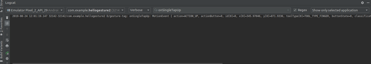

# Gesture

We can detect when we touch our fingers on Android.

## Touch Listener

Create a new empty Activity project. Name it HelloGesture1.

Edit app / res / layout / activity_main.xml.

```xml
<?xml version="1.0" encoding="utf-8"?>
<androidx.constraintlayout.widget.ConstraintLayout
    xmlns:android="http://schemas.android.com/apk/res/android"
    xmlns:tools="http://schemas.android.com/tools"
    xmlns:app="http://schemas.android.com/apk/res-auto"
    android:layout_width="match_parent"
    android:layout_height="match_parent"
    tools:context=".MainActivity">
    <View
            android:layout_width="0dp"
            android:layout_height="0dp"
            android:background="@color/colorPrimary"
            android:id="@+id/view" app:layout_constraintTop_toTopOf="parent" app:layout_constraintEnd_toEndOf="parent"
            app:layout_constraintBottom_toBottomOf="parent" app:layout_constraintStart_toStartOf="parent"
            android:layout_marginTop="128dp" android:layout_marginEnd="128dp" android:layout_marginStart="128dp"
            android:layout_marginBottom="128dp"/>
</androidx.constraintlayout.widget.ConstraintLayout>
```

There is a single view with green color in the layout.

Edit app / java / com.example.hellogesture1 / MainActivity.

```kotlin
package com.example.hellogesture1

import androidx.appcompat.app.AppCompatActivity
import android.os.Bundle
import android.util.Log
import android.view.MotionEvent
import android.view.View

const val ACTIVITY_DEBUG_TAG = "activity-gesture-tag"
const val VIEW_DEBUG_TAG = "view-gesture-tag"


class MainActivity : AppCompatActivity() {

    override fun onCreate(savedInstanceState: Bundle?) {
        super.onCreate(savedInstanceState)
        setContentView(R.layout.activity_main)

        findViewById<View>(R.id.view).setOnTouchListener { v, event ->
            val action: Int = event.actionMasked

            when (action) {
                MotionEvent.ACTION_DOWN -> {
                    Log.d(VIEW_DEBUG_TAG, "Action was DOWN")
                    true
                }
                MotionEvent.ACTION_MOVE -> {
                    Log.d(VIEW_DEBUG_TAG, "Action was MOVE")
                    true
                }
                MotionEvent.ACTION_UP -> {
                    Log.d(VIEW_DEBUG_TAG, "Action was UP")
                    true
                }
                MotionEvent.ACTION_CANCEL -> {
                    Log.d(VIEW_DEBUG_TAG, "Action was CANCEL")
                    true
                }
                MotionEvent.ACTION_OUTSIDE -> {
                    Log.d(VIEW_DEBUG_TAG, "Movement occurred outside bounds of current screen element")
                    true
                }
                else -> super.onTouchEvent(event)
            }
        }
    }

    override fun onTouchEvent(event: MotionEvent): Boolean {

        val action: Int = event.actionMasked

        return when (action) {
            MotionEvent.ACTION_DOWN -> {
                Log.d(ACTIVITY_DEBUG_TAG, "Action was DOWN")
                true
            }
            MotionEvent.ACTION_MOVE -> {
                Log.d(ACTIVITY_DEBUG_TAG, "Action was MOVE")
                true
            }
            MotionEvent.ACTION_UP -> {
                Log.d(ACTIVITY_DEBUG_TAG, "Action was UP")
                true
            }
            MotionEvent.ACTION_CANCEL -> {
                Log.d(ACTIVITY_DEBUG_TAG, "Action was CANCEL")
                true
            }
            MotionEvent.ACTION_OUTSIDE -> {
                Log.d(
                    ACTIVITY_DEBUG_TAG,
                    "Movement occurred outside bounds of current screen element"
                )
                true
            }
            else -> super.onTouchEvent(event)
        }
    }

}
```

To add a touch listener to a view, you can use setOnTouchListener.

```kotlin
findViewById<View>(R.id.view).setOnTouchListener { v, event ->
    val action: Int = event.actionMasked

    when (action) {
        MotionEvent.ACTION_DOWN -> {
            Log.d(VIEW_DEBUG_TAG, "Action was DOWN")
            true
        }
        MotionEvent.ACTION_MOVE -> {
            Log.d(VIEW_DEBUG_TAG, "Action was MOVE")
            true
        }
        MotionEvent.ACTION_UP -> {
            Log.d(VIEW_DEBUG_TAG, "Action was UP")
            true
        }
        MotionEvent.ACTION_CANCEL -> {
            Log.d(VIEW_DEBUG_TAG, "Action was CANCEL")
            true
        }
        MotionEvent.ACTION_OUTSIDE -> {
            Log.d(VIEW_DEBUG_TAG, "Movement occurred outside bounds of current screen element")
            true
        }
        else -> super.onTouchEvent(event)
    }
}
```

Inside the callback, you can get what kind of action the finger performs from the event.

```kotlin
val action: Int = event.actionMasked
```

From there, you can filter the actions.

```kotlin
when (action) {
    MotionEvent.ACTION_DOWN -> {
        Log.d(VIEW_DEBUG_TAG, "Action was DOWN")
        true
    }
....
```

To add the touch listener on the activity itself, you can add onTouchEvent method. The definition of this method is similar to the previous callback.

```kotlin
override fun onTouchEvent(event: MotionEvent): Boolean {

    val action: Int = event.actionMasked

    return when (action) {
        MotionEvent.ACTION_DOWN -> {
            Log.d(ACTIVITY_DEBUG_TAG, "Action was DOWN")
            true
        }
        MotionEvent.ACTION_MOVE -> {
            Log.d(ACTIVITY_DEBUG_TAG, "Action was MOVE")
            true
        }
        MotionEvent.ACTION_UP -> {
            Log.d(ACTIVITY_DEBUG_TAG, "Action was UP")
            true
        }
        MotionEvent.ACTION_CANCEL -> {
            Log.d(ACTIVITY_DEBUG_TAG, "Action was CANCEL")
            true
        }
        MotionEvent.ACTION_OUTSIDE -> {
            Log.d(
                ACTIVITY_DEBUG_TAG,
                "Movement occurred outside bounds of current screen element"
            )
            true
        }
        else -> super.onTouchEvent(event)
    }
}
```

Run the application and you will get this output.

<p align="center">

</p>

You can run your mouse or finger on the green view and the activity (white color). You will get this kind of log.

```
2019-08-23 21:04:55.496 29566-29566/com.example.hellogesture1 D/activity-gesture-tag: Action was DOWN
2019-08-23 21:04:55.600 29566-29566/com.example.hellogesture1 D/activity-gesture-tag: Action was MOVE
2019-08-23 21:04:56.043 29566-29566/com.example.hellogesture1 D/activity-gesture-tag: Action was MOVE
2019-08-23 21:04:56.262 29566-29566/com.example.hellogesture1 D/activity-gesture-tag: Action was UP
2019-08-23 21:04:57.945 29566-29566/com.example.hellogesture1 D/view-gesture-tag: Action was DOWN
2019-08-23 21:04:58.054 29566-29566/com.example.hellogesture1 D/view-gesture-tag: Action was MOVE
2019-08-23 21:04:59.571 29566-29566/com.example.hellogesture1 D/view-gesture-tag: Action was MOVE
2019-08-23 21:04:59.839 29566-29566/com.example.hellogesture1 D/view-gesture-tag: Action was UP
```

When we lay down our finger/mouse on the screen, the system catches down action. When we drag our finger/mouse on the screen, the system catches move action. When we release our finger/mouse on the screen, the system catches up action.

When we have a small activity like dialog with certain configuration, and we lay down our finger/mouse, the system catches outside action.

For the system to catch cancel action, the view must have a parent view (view group like scrollview), and the parent view must intercept the touch event in a certain way. Later we will implement such case.

## Fling, Scroll, Double Tap, Long Press, Single Tap

We can intercept a certain kind of touch patterns like fling (swiping), scroll, double tap, long press, single tap.

Create a new empty Activity project. Name it HelloGesture2.

Edit app / java / com.example.hellogesture2 / MainActivity.

```kotlin
package com.example.hellogesture2

import androidx.appcompat.app.AppCompatActivity
import android.os.Bundle
import android.util.Log
import android.view.GestureDetector
import android.view.MotionEvent
import androidx.core.view.GestureDetectorCompat

const val DEBUG_TAG = "gesture-tag"


class MainActivity : AppCompatActivity(), GestureDetector.OnGestureListener, GestureDetector.OnDoubleTapListener {

    private lateinit var mDetector: GestureDetectorCompat

    public override fun onCreate(savedInstanceState: Bundle?) {
        super.onCreate(savedInstanceState)
        setContentView(R.layout.activity_main)
        mDetector = GestureDetectorCompat(this, this)
    }

    override fun onTouchEvent(event: MotionEvent): Boolean {
        return if (mDetector.onTouchEvent(event)) {
            true
        } else {
            super.onTouchEvent(event)
        }
    }

    override fun onDown(event: MotionEvent): Boolean {
        Log.d(DEBUG_TAG, "onDown: $event")
        return true
    }

    override fun onFling(
        event1: MotionEvent,
        event2: MotionEvent,
        velocityX: Float,
        velocityY: Float
    ): Boolean {
        Log.d(DEBUG_TAG, "onFling (event): $event1 $event2")
        Log.d(DEBUG_TAG, "onFling (velocity): $velocityX $velocityY")
        return true
    }

    override fun onLongPress(event: MotionEvent) {
        Log.d(DEBUG_TAG, "onLongPress: $event")
    }

    override fun onScroll(
        event1: MotionEvent,
        event2: MotionEvent,
        distanceX: Float,
        distanceY: Float
    ): Boolean {
        Log.d(DEBUG_TAG, "onScroll (event): $event1 $event2")
        Log.d(DEBUG_TAG, "onScroll (distance): $distanceX $distanceY")
        return true
    }

    override fun onShowPress(event: MotionEvent) {
        Log.d(DEBUG_TAG, "onShowPress: $event")
    }

    override fun onSingleTapUp(event: MotionEvent): Boolean {
        Log.d(DEBUG_TAG, "onSingleTapUp: $event")
        return true
    }

    override fun onDoubleTap(event: MotionEvent): Boolean {
        Log.d(DEBUG_TAG, "onDoubleTap: $event")
        return true
    }

    override fun onDoubleTapEvent(event: MotionEvent): Boolean {
        Log.d(DEBUG_TAG, "onDoubleTapEvent: $event")
        return true
    }

    override fun onSingleTapConfirmed(event: MotionEvent): Boolean {
        Log.d(DEBUG_TAG, "onSingleTapConfirmed: $event")
        return true
    }

}
```

Our activity implements two GestureDetector.

```kotlin
class MainActivity : AppCompatActivity(), GestureDetector.OnGestureListener, GestureDetector.OnDoubleTapListener {
```

We create a GestureDetectorCompat object the initialize it in onCreate method.

```kotlin
private lateinit var mDetector: GestureDetectorCompat

public override fun onCreate(savedInstanceState: Bundle?) {
    super.onCreate(savedInstanceState)
    setContentView(R.layout.activity_main)
    mDetector = GestureDetectorCompat(this, this)
}
```

In onTouchEvent method in the activity, we need to call onTouchEvent method of GestureDetectorCompat.

```kotlin
override fun onTouchEvent(event: MotionEvent): Boolean {
    return if (mDetector.onTouchEvent(event)) {
        true
    } else {
        super.onTouchEvent(event)
    }
}
```

Then we implement the required methods. OnDown, onLongPress, onShowPress, onSingleTapUp, onDoubleTap, onDoubleTapEvent, onSingleTapConfirmed accept MotionEvent parameter. The other two methods: onScroll and onFling accepts more complex parameters. OnScroll accepts two MotionEvent parameters, a float distance in x direction and a float distance in y direction. OnFling accepts two MotionEvent parameters, a float velocity in x direction and a float distance in y direction. A fling is like a scroll but faster.

OnDown is called when our finger touches the screen.

OnLongPress is called when our finger touches the screen and stays there for quite some time.

OnSingleTapUp is called when our finger does the single tap and it is in up condition already.

OnDoubleTap is called when our finger does double taps.

OnDoubleTapEvent is called twice when our finger does double taps. The first time is when our finger is down and the second time is when our finger is up.

OnSingleTapUp is called when our finger taps then is in up condition. The tap could be single tap or double taps.

OnSingleTapConfirmed is called when the system is very sure that our finger does single tap not double taps.

Run the application and you will get ordinary view.

<p align="center">

</p>

We can play around with our finger/mouse on the activity and you will get the log.

One useful way to experiment with touch events is to use filter in Logcat. So we can experiment with each kind of movement.

<p align="center">

</p>

## Simple Gesture Listener

Sometimes we are only interested in certain types of gestures (only long press). Instead of overriding all callbacks, we can only override the only callback that we have interest.

Create a new empty Activity. Name it HelloGesture3.

Edit app / java / com.example.hellogesture3 / MainActivity.

```kotlin
package com.example.hellogesture3

import androidx.appcompat.app.AppCompatActivity
import android.os.Bundle
import android.util.Log
import android.view.GestureDetector
import android.view.MotionEvent
import androidx.core.view.GestureDetectorCompat

const val DEBUG_TAG = "gesture-tag"


class MainActivity : AppCompatActivity() {

    private lateinit var mDetector: GestureDetectorCompat

    public override fun onCreate(savedInstanceState: Bundle?) {
        super.onCreate(savedInstanceState)
        setContentView(R.layout.activity_main)
        mDetector = GestureDetectorCompat(this, SimpleGestureListener())
    }

    override fun onTouchEvent(event: MotionEvent): Boolean {
        return if (mDetector.onTouchEvent(event)) {
            true
        } else {
            super.onTouchEvent(event)
        }
    }

    private class SimpleGestureListener : GestureDetector.SimpleOnGestureListener() {
        
        override fun onLongPress(event: MotionEvent) {
            Log.d(DEBUG_TAG, "onLongPress: $event")
        }
    }

}
```

We still create GestureDetectorCompat instance. But this time, on the second parameter, our GestureDetectorCompat instance accepts an object from a class which implements SimpleOnGestureListener.

```kotlin
public override fun onCreate(savedInstanceState: Bundle?) {
    super.onCreate(savedInstanceState)
    setContentView(R.layout.activity_main)
    mDetector = GestureDetectorCompat(this, SimpleGestureListener())
}
```

Inside the class definition, you only override the callback which interests you.

```kotlin
private class SimpleGestureListener : GestureDetector.SimpleOnGestureListener() {

    override fun onLongPress(event: MotionEvent) {
        Log.d(DEBUG_TAG, "onLongPress: $event")
    }
}
```

Run the application and you will see an ordinary activity.

<p align="center">

</p>

If we press long enough with our finger/mouse, we will see the log.

```
2019-08-24 12:10:14.800 681-681/com.example.hellogesture3 D/gesture-tag: onLongPress: MotionEvent { action=ACTION_DOWN, actionButton=0, id[0]=0, x[0]=601.9629, y[0]=1326.9141, toolType[0]=TOOL_TYPE_FINGER, buttonState=0, classification=NONE, metaState=0, flags=0x0, edgeFlags=0x0, pointerCount=1, historySize=0, eventTime=228836705, downTime=228836705, deviceId=0, source=0x1002, displayId=0 }
```

## Velocity Tracker

We can get the velocity of our finger/mouse movement.

Create an empty Activity project. Name it HelloGesture4.

Edit app / java / com.example.hellogesture4 / MainActivity.

```kotlin
package com.example.hellogesture4

import androidx.appcompat.app.AppCompatActivity
import android.os.Bundle
import android.util.Log
import android.view.MotionEvent
import android.view.VelocityTracker

const val DEBUG_TAG = "gesture-tag"


class MainActivity : AppCompatActivity() {

    private var mVelocityTracker: VelocityTracker? = null

    public override fun onCreate(savedInstanceState: Bundle?) {
        super.onCreate(savedInstanceState)
        setContentView(R.layout.activity_main)
    }

    override fun onTouchEvent(event: MotionEvent): Boolean {

        when (event.actionMasked) {
            MotionEvent.ACTION_DOWN -> {
                mVelocityTracker?.clear()
                mVelocityTracker = mVelocityTracker ?: VelocityTracker.obtain()
                mVelocityTracker?.addMovement(event)
            }
            MotionEvent.ACTION_MOVE -> {
                mVelocityTracker?.apply {
                    val pointerId: Int = event.getPointerId(event.actionIndex)
                    addMovement(event)
                    computeCurrentVelocity(100)
                    Log.d(DEBUG_TAG, "X velocity: ${getXVelocity(pointerId)}")
                    Log.d(DEBUG_TAG, "Y velocity: ${getYVelocity(pointerId)}")
                }
            }
            MotionEvent.ACTION_UP, MotionEvent.ACTION_CANCEL -> {
                mVelocityTracker?.recycle()
                mVelocityTracker = null
            }
        }
        return true
    }

}
```

We create VelocityTracker object.

```kotlin
private var mVelocityTracker: VelocityTracker? = null
```

Then initialize it in action down motion event. But you have to clear first in case you still have the object. After initializing the velocity tracker, we can add the event with addMovement method.

```kotlin
MotionEvent.ACTION_DOWN -> {
    mVelocityTracker?.clear()
    mVelocityTracker = mVelocityTracker ?: VelocityTracker.obtain()
    mVelocityTracker?.addMovement(event)
}
```

Then in action move motion event, we can get the velocities, both in x and y direction.

```kotlin
MotionEvent.ACTION_MOVE -> {
    mVelocityTracker?.apply {
        val pointerId: Int = event.getPointerId(event.actionIndex)
        addMovement(event)
        computeCurrentVelocity(100)
        Log.d(DEBUG_TAG, "X velocity: ${getXVelocity(pointerId)}")
        Log.d(DEBUG_TAG, "Y velocity: ${getYVelocity(pointerId)}")
    }
}
```

To get the velocities, we need to get pointers. Then we still need to use addMovement method.. To set the scale of the velocities, we use computeCurrentVelocity method. Then in the end we can get the velocities with getXVelocity and getYVelocity. Both methods accept the pointers that we got from getPointerId method from event object.

Run the application.

<p align="center">

</p>

We can run our finger/mouse and we will get some logs in Logcat.
```
2019-08-24 17:02:23.441 688-688/com.example.hellogesture4 D/gesture-tag: X velocity: -14.13058
2019-08-24 17:02:23.441 688-688/com.example.hellogesture4 D/gesture-tag: Y velocity: 163.6365
2019-08-24 17:02:23.458 688-688/com.example.hellogesture4 D/gesture-tag: X velocity: -11.580416
2019-08-24 17:02:23.458 688-688/com.example.hellogesture4 D/gesture-tag: Y velocity: 109.27531
```

## Multi Touch Gestures

We can use two fingers to give touch events.

Create a new empty Activity project. Name it HelloGesture5.

Edit app / java / com.example.hellogesture5 / MainActivity.

```kotlin
package com.example.hellogesture5

import androidx.appcompat.app.AppCompatActivity
import android.os.Bundle
import android.util.Log
import android.view.MotionEvent

const val DEBUG_TAG = "gesture-tag"


class MainActivity : AppCompatActivity() {

    override fun onCreate(savedInstanceState: Bundle?) {
        super.onCreate(savedInstanceState)
        setContentView(R.layout.activity_main)
    }

    override fun onTouchEvent(event: MotionEvent): Boolean {

        event.actionMasked.let { action ->
            Log.d(DEBUG_TAG, "The action is ${MotionEvent.actionToString(action)}")

            val xPos = event.getX(0).toInt()
            val yPos = event.getY(0).toInt()
            Log.d(DEBUG_TAG, "Single touch event")
            Log.d(DEBUG_TAG, "Single touch => X Position: $xPos, Y Position: $yPos")
            if (event.pointerCount > 1) {
                val xPos = event.getX(1).toInt()
                val yPos = event.getY(1).toInt()
                Log.d(DEBUG_TAG, "Multitouch event")
                Log.d(DEBUG_TAG, "Multitouch => X Position: $xPos, Y Position: $yPos")
            }
        }

        return true
    }

}
```

On onTouchEvent method, we get the action from actionMasked property.

```kotlin
event.actionMasked.let { action ->
```

Then we can get the representation of action with static actionToString method.

```kotlin
Log.d(DEBUG_TAG, "The action is ${MotionEvent.actionToString(action)}")
```

When we land our first finger, we get ACTION_DOWN action. When we land our second finger, we get ACTION_POINTER_DOWN action. When we lift our second finger, we get ACTION_POINTER_UP action. When we lift our first finger, we get ACTION_UP action.

To get the position (in x and y direction), you can use getX and getY methods.

```kotlin
val xPos = event.getX(0).toInt()
val yPos = event.getY(0).toInt()
Log.d(DEBUG_TAG, "Single touch event")
Log.d(DEBUG_TAG, "Single touch => X Position: $xPos, Y Position: $yPos")
```

The getX and getY methods receive pointer index parameters. The first finger has index 0. So we give parameter 0 to getX and getY methods.

For second finger, we need to make sure there are two pointers (fingers) with pointerCount method. Then we use getX and getY methods but we give parameter 1.

```kotlin
if (event.pointerCount > 1) {
    val xPos = event.getX(1).toInt()
    val yPos = event.getY(1).toInt()
    Log.d(DEBUG_TAG, "Multitouch event")
    Log.d(DEBUG_TAG, "Multitouch => X Position: $xPos, Y Position: $yPos")
}
```

Run the application and when we lay down our two fingers, we get multi touch events.

```
2019-08-31 16:13:07.312 11898-11898/com.example.hellogesture5 D/gesture-tag: Single touch event
2019-08-31 16:13:07.312 11898-11898/com.example.hellogesture5 D/gesture-tag: Single touch => X Position: 566, Y Position: 1395
2019-08-31 16:13:07.312 11898-11898/com.example.hellogesture5 D/gesture-tag: Multitouch event
2019-08-31 16:13:07.312 11898-11898/com.example.hellogesture5 D/gesture-tag: Multitouch => X Position: 828, Y Position: 1450
2019-08-31 16:13:07.318 11898-11898/com.example.hellogesture5 D/gesture-tag: The action is ACTION_POINTER_UP(0)
2019-08-31 16:13:07.318 11898-11898/com.example.hellogesture5 D/gesture-tag: Single touch event
2019-08-31 16:13:07.318 11898-11898/com.example.hellogesture5 D/gesture-tag: Single touch => X Position: 566, Y Position: 1394
2019-08-31 16:13:07.318 11898-11898/com.example.hellogesture5 D/gesture-tag: Multitouch event
2019-08-31 16:13:07.318 11898-11898/com.example.hellogesture5 D/gesture-tag: Multitouch => X Position: 828, Y Position: 1450
```

# Optional Readings

https://developer.android.com/guide/input

https://developer.android.com/reference/kotlin/android/view/GestureDetector?hl=en

# Exercises

1. Create a gesture detector on which you can swipe a card view to the left and to the right. You must combine it with animation. What you want to achieve is similar to swiping cards in Tinder-like application.