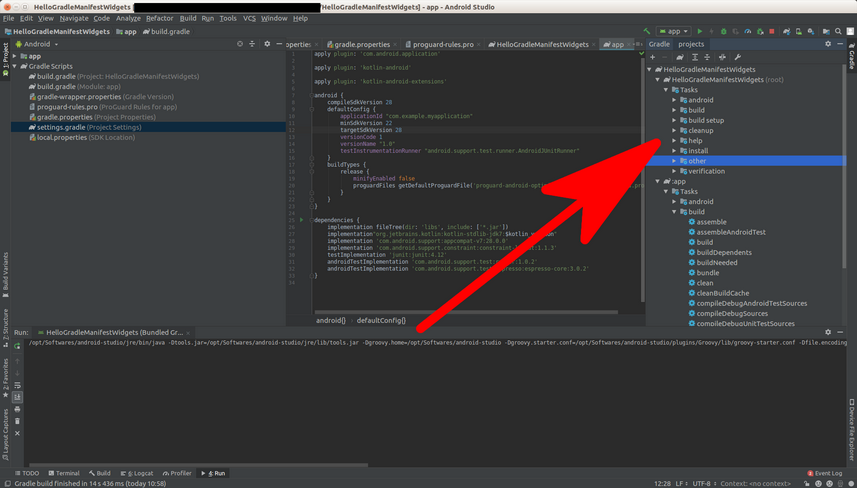

# Gradle, Manifest, and Widgets

This document assumes Android Studio has been installed successfully with its SDK in student’s operating system.

## New Project

Let’s create a new project.

<p align="center">

</p>

Click “+ Start a new Android Studio project”.

You’ll be greeted with some options of templates.

<p align="center">

</p>

Choose “Empty Activity”. Then you can configure your project.

<p align="center">

</p>

The name that you put in Name field will be showing up on your Android phone. Package name must be unique to avoid name collision with other Android applications. Usually people use domain name reversely. For Language, choose “Kotlin”. In Save location field, you can choose the directory to keep the project file. For Minimum API level field, choose API 22 for now.

Then your Android Studio is ready.

<p align="center">

</p>

Look at the left panel (the tree). You are using Android project view. There are other types of project view, for example Project project view. With Project project view, you can see the directory with its files in traditional sense.

<p align="center">

</p>

In Project project view, you can see your project in traditional sense.

<p align="center">

</p>

Before running your application, you need to setup the emulator first.

Click Tools – AVD Manager.

<p align="center">

</p>

Click “Choose Virtual Device”.

<p align="center">

</p>

Select hardware. For now, choose Nexus 6.

<p align="center">

</p>

Choose System Image. For now, choose Pie.

<p align="center">

</p>

Name your Android Virtual Device.

Now you have Android Virtual Device that you can launch.

<p align="center">

</p>

Click Play button.

You’ll launch Android Virtual Device.

<p align="center">

</p>

Then you can launch your application. Run – Run ‘app’ or Shift + F10.

You’ll be asked where you want to deploy your application.

<p align="center">

</p>

For now, we only have 1 Android Virtual Device. Later, you can use real phone for launching application.

You’ll get this screen.

<p align="center">

</p>

## Gradle

Gradle is a build tool. In an Android project, there are two Gradle build files that you need to put attention. Both have the same name, build.gradle.

<p align="center">

</p>

One is in project level. The other one is in module app level.

### Project Level Gradle File

Open build.gradle (Project: HelloGradleManifestWidgets).

```gradle
buildscript {
    ext.kotlin_version = '1.3.21'
    repositories {
        google()
        jcenter()
        
    }
    dependencies {
        classpath 'com.android.tools.build:gradle:3.3.2'
        classpath "org.jetbrains.kotlin:kotlin-gradle-plugin:$kotlin_version"
        // NOTE: Do not place your application dependencies here; they belong
        // in the individual module build.gradle files
    }
}

allprojects {
    repositories {
        google()
        jcenter()
        
    }
}

task clean(type: Delete) {
    delete rootProject.buildDir
}
```
ext.kotlin.version is the version of Kotlin you use. Go to https://kotlinlang.org/ to see the latest version of Kotlin.

The section

repositories {
  google()
  jcenter()
}

are present in both buildscript and allprojects. Buildscript is used by Gradle to build application. The allprojects part is used by application itself. Most likely you will never change the content of repositories unless you use custom repository.

dependencies is used by Gradle to build application. Gradle uses Android Gradle plugin and Kotlin Gradle plugin. Most likely you will never change the content of dependencies here. To see the latest version of Android Gradle plugin, you can go to this website: 

https://developer.android.com/studio/releases/gradle-plugin

The latest version of Gralde can be seen on that website as well. If you want to know what Gradle version you use, open gradle-wrapper.properties file.

This is the content of gradle-wrapper.properties file.

```gradle
distributionBase=GRADLE_USER_HOME
distributionPath=wrapper/dists
zipStoreBase=GRADLE_USER_HOME
zipStorePath=wrapper/dists
distributionUrl=https\://services.gradle.org/distributions/gradle-4.10.1-all.zip
```

The version of Gradle we use is 4.10.1.

Coming back to project level build.gradle file, there is “clean” task.

You can execute “clean” task using two ways. The first one is click Search button in right part of Android Studio.

<p align="center">

</p>

In search window, type Gradle then click Gradle in Tools Window section.

<p align="center">

</p>

Then your Gradle tasks list is opened in the right side of Android Studio.

<p align="center">

</p>

Then you can find “clean” task (in :app – Tasks – build – clean) before right clicking “clean” task and choosing Run submenu.

The other way is to run it through command line. Go inside project directory. Then type this command: “./gradlew app:clean” before pressing Enter.

### Module Level Gradle File

Open build.gradle (Module: app). This is the file you most likely edit often.

```gradle
apply plugin: 'com.android.application'
apply plugin: 'kotlin-android'
apply plugin: 'kotlin-android-extensions'
```

This is Gradle plugin. You can find more Gradle plugins in  https://plugins.gradle.org/. For example, you can find a Gradle plugin which converts a text document to PDF document. You may write a text document and you want to convert this text document to PDF document when you build an Android application.

```gradle
android {
    compileSdkVersion 28
    defaultConfig {
        applicationId "com.example.myapplication"
        minSdkVersion 22
        targetSdkVersion 28
        versionCode 1
        versionName "1.0"
        testInstrumentationRunner "android.support.test.runner.AndroidJUnitRunner"
    }
    buildTypes {
        release {
            minifyEnabled false
            proguardFiles getDefaultProguardFile('proguard-android-optimize.txt'), 'proguard-rules.pro'
        }
    }
}
```

compileSdkVersion is what your Android application is compiled against SDK version. The applicationId is the id of your application (use domain in reverse way), minSdkVersion is the lowest  SDK version of Android phone that can install your application. TargetSdkVersion is usually same as compileSdkVersion but should not be higher. It tells Android phone how this Android application should look like. VersionCode should be higher everytime you release new version of application. VersionName is the version that is displayed for user.

TestInstrumentationRunner will be discussed when we talk about testing Android application.

minifyEnabled and proguardFiles will be discussed when we talk about deploying Android application.

```gradle
dependencies {
    implementation fileTree(dir: 'libs', include: ['*.jar'])
    implementation"org.jetbrains.kotlin:kotlin-stdlib-jdk7:$kotlin_version"
    implementation 'androidx.appcompat:appcompat:1.0.2'
    implementation 'androidx.core:core-ktx:1.0.2'
    implementation 'androidx.constraintlayout:constraintlayout:1.1.3'
    testImplementation 'junit:junit:4.12'
    androidTestImplementation 'com.android.support.test:runner:1.0.2'
    androidTestImplementation 'com.android.support.test.espresso:espresso-core:3.0.2'
}
```

This is the part that you will edit often.  If you want to install new library that your application uses, here is the place.

Everytime you modify Gradle file, you have to sync it.

<p align="center">

</p>

## Manifest

Open AndroidManifest.xml file in app – manifests.

<p align="center">

</p>

This is the content of the file.

```xml
<?xml version="1.0" encoding="utf-8"?>
<manifest xmlns:android="http://schemas.android.com/apk/res/android"
          package="com.example.myapplication">
    <application
            android:allowBackup="true"
            android:icon="@mipmap/ic_launcher"
            android:label="@string/app_name"
            android:roundIcon="@mipmap/ic_launcher_round"
            android:supportsRtl="true"
            android:theme="@style/AppTheme">
        <activity android:name=".MainActivity">
            <intent-filter>
                <action android:name="android.intent.action.MAIN"/>
                <category android:name="android.intent.category.LAUNCHER"/>
            </intent-filter>
        </activity>
    </application>
</manifest>
```

You’ll get warning of “App is not indexable by Google Search”. To ignore the warning, you need to put:

```xml
xmlns:tools="http://schemas.android.com/tools"
```

as attribute of manifest tag.

Then add:

```xml
tools:ignore="GoogleAppIndexingWarning"
```

as attribute in application tag.

This is the modified AndroidManifest.xml file.

```xml
<?xml version="1.0" encoding="utf-8"?>
<manifest xmlns:android="http://schemas.android.com/apk/res/android"
          xmlns:tools="http://schemas.android.com/tools"
          package="com.example.myapplication">
    <application
            android:allowBackup="true"
            android:icon="@mipmap/ic_launcher"
            android:label="@string/app_name"
            android:roundIcon="@mipmap/ic_launcher_round"
            android:supportsRtl="true"
            tools:ignore="GoogleAppIndexingWarning"
            android:theme="@style/AppTheme">
        <activity android:name=".MainActivity">
            <intent-filter>
                <action android:name="android.intent.action.MAIN"/>
                <category android:name="android.intent.category.LAUNCHER"/>
            </intent-filter>
        </activity>
    </application>
</manifest>
```

Later, you’ll provide deep linking to make this app indexable by Google Search.

In Manifest file, you can change the icon, the app label name, the theme. In this file as well, you’ll add new activities. Right now you only have one activity (which is called MainActivity). Activity is like a window (this is simple analogy) of Android application.

Other than manifests directory, there are three other directories inside app directory: 
java, generatedJava, res.

You don’t need to care about generatedJava directory. Java directory is where your coding resides. Res directory is where your images reside and your strings (with its translations) reside.

### res Directory

There are four directories inside res directory: drawable, layout, mipmap, and values.

In drawable directory, you can put images and icons. In mipmap, you also put images but you put images which you don’t want Android to strip away, such as launcher icons. In drawable, Android build system could remove some images to provide optimizations. In Android, sometimes, you put same image but with different resolution.

In values directory, there are three xml files, colors.xml, strings.xml, styles.xml.

If you open strings.xml, you’ll get this content of the file.

```xml
<resources>
    <string name="app_name">My Application</string>
</resources>
```

In layout files or code files, you should not use hard code string, like “My Application”. But you use the string reference file.

For example in the layout file, instead of

```xml
android:text="My Application"
```

you’ll write

```xml
android:text="@string/app_name"
```

This is to make the translation process easier.

The same thing happens in colors.xml and styles.xml. If you want to define a color you want to use, don’t use hard coded color string, but define it in colors.xml and use color string reference.

In layout directory, you have activity_main.xml file. This is the layout that is used by your only activity (MainActivity). You can add widgets here.

## Widgets

Open activity_main.xml and you’ll get the layout.

<p align="center">

</p>

In the screen, you’ll have one text view in the middle of the screen. You can add other widgets like button to this screen. Drag the button from Palette to the activity screen.

<p align="center">

</p>

You can also add a button not using GUI, but by editing XML file.

Click “Text” tab.

<p align="center">

</p>

Then you can type Button tag in the xml file.

<p align="center">

</p>

You can modify the properties of a button (or a text view) with Attributes panel in the right side. Click Attributes tab to expand Attributes panel.

<p align="center">

</p>

You can change the text, the style, of the button among many other things.

<p align="center">

</p>

You can edit more properties of the button by clicking two reverse direction arrow icon.

<p align="center">

</p>

<p align="center">

</p>

Other way is to edit the button in xml file. Click the Text tab. Then you can add, modify or delete attributes from the button.

<p align="center">

</p>

You can change the background col

## Activity

The activity_main.xml is used as layout by activity. Open MainActivity inside app – java – com.example.myapplication directory.

This is the content of the file.

```kotlin
package com.example.myapplication

import android.support.v7.app.AppCompatActivity
import android.os.Bundle

class MainActivity : AppCompatActivity() {

    override fun onCreate(savedInstanceState: Bundle?) {
        super.onCreate(savedInstanceState)
        setContentView(R.layout.activity_main)
    }
}
```

As you can see, the layout activity_main is used in this line.

```kotlin
setContentView(R.layout.activity_main)
```

In the coding part, you can also change the attribute of the button.

But first you need to get the button reference.

```kotlin
val button = findViewById<Button>(R.id.button)
```

Don’t forget to import Button class.

```kotlin
import android.widget.Button
```

Then you can add change the text attribute using this line:

```kotlin
button.setText(R.string.app_name)
```

This is the complete code:

```kotlin
package com.example.myapplication

import android.support.v7.app.AppCompatActivity
import android.os.Bundle
import android.widget.Button

class MainActivity : AppCompatActivity() {
    override fun onCreate(savedInstanceState: Bundle?) {
        super.onCreate(savedInstanceState)
        setContentView(R.layout.activity_main)

        val button = findViewById<Button>(R.id.button)
        button.setText(R.string.app_name)
    }
}
```

You can run the application and you will get this screen.

<p align="center">

</p>

If you are surprised why the button is located on the top left of the screen, you need to give some constraints to the button. We’ll discuss it later.

If you want to add callback to the button, you can use setOnClickListener method.

```kotlin
button.setOnClickListener({
    label.setText(R.string.hello)
})
```

You must give ID to the label in the application. You can open activity_main.xml file.

<p align="center">

</p>

Then edit ID in the right panel. You can of course give ID directly by manipulating XML node of the button in XML file.

<p align="center">

</p>

Then you need to get the text view and set it to our label variable.

```kotlin
val label = findViewById<TextView>(R.id.label)
```

You need to import TextView.

```kotlin
import android.widget.TextView
```

You also need to set new string (R.string.hello) in res/values/strings.xml.

Run the application and when you click the button, the text view’s text will be changed.

# Optional Readings

https://docs.gradle.org/current/userguide/tutorial_using_tasks.html
https://developer.android.com/studio/build
https://developer.android.com/studio/build/application-id
https://developer.android.com/studio/build/dependencies
https://developer.android.com/guide/topics/manifest/manifest-intro

# Exercise

1. Try to create an Android application and launch it successfully in emulator.