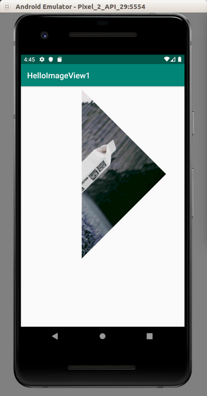
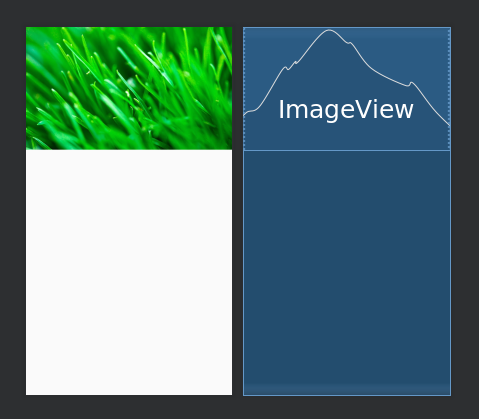

# Image

To show image on the screen, you can use ImageView or ImageButton (if you want the widget to be clickable).

## ImageView

Create an empty Activity project. Name it HelloImageView1.

To add an image to Android project, you can copy paste the image to app / res / drawable directory. Make sure the image’s filename does not have dash (“-”). 

<p align="center">

</p>

Then edit app / res / layout / activity_main.xml file.

```xml
<?xml version="1.0" encoding="utf-8"?>
<androidx.constraintlayout.widget.ConstraintLayout
    xmlns:android="http://schemas.android.com/apk/res/android"
    xmlns:tools="http://schemas.android.com/tools"
    xmlns:app="http://schemas.android.com/apk/res-auto"
    android:layout_width="match_parent"
    android:layout_height="match_parent"
    tools:context=".MainActivity">

    <ImageView
            android:layout_width="250dp"
            android:layout_height="wrap_content"
            android:src="@drawable/boxedwater"
            android:id="@+id/imageView"
            android:layout_marginTop="8dp"
            app:layout_constraintTop_toTopOf="parent"
            app:layout_constraintEnd_toEndOf="parent"
            android:layout_marginEnd="8dp"/>

</androidx.constraintlayout.widget.ConstraintLayout>
```

You will get this screen. By default it uses scale type of center inside or fit center

<p align="center">

</p>

Then put android:scaleType="center" as attribute in ImageView xml node. You will get this screen.

<p align="center">

</p>

Then put android:scaleType="centerCrop" as attribute in ImageView xml node. You will get this screen.

<p align="center">

</p>

Then put android:scaleType="fitStart" as attribute in ImageView xml node. You will get this screen.

<p align="center">

</p>

Then put android:scaleType="fitEnd" as attribute in ImageView xml node. You will get this screen.

<p align="center">

</p>

Then put android:scaleType="fitXY" as attribute in ImageView xml node. You will get this screen.

<p align="center">

</p>

The last attribute is `android:scaleType="matrix"`. But you also must set the graphics matrix to the image view. You can do it in the code.

```kotlin
class MainActivity : AppCompatActivity() {
    override fun onCreate(savedInstanceState: Bundle?) {
        super.onCreate(savedInstanceState)
        setContentView(R.layout.activity_main)

        val imageView = findViewById<ImageView>(R.id.imageView)
        val matrix = Matrix()
        matrix.postScale(0.05f, 0.1f)
        imageView.imageMatrix = matrix
    }
}
```

You scaled the image. The width will be half of the height of the image. Remember the x scaling is 0.05f and the y scaling is 0.1f. Run the application.

<p align="center">

</p>

You can also rotate the image using postRotate method.

```kotlin
val imageView = findViewById<ImageView>(R.id.imageView)
val matrix = Matrix()
matrix.postScale(0.05f, 0.1f)
matrix.postRotate(45f)
imageView.imageMatrix = matrix
```

You will get this screen.

<p align="center">

</p>

## ImageButton

Create an empty Activity project. Name it HelloImageView2.

Edit app / res / layout / main_activity.xml.

```xml
<?xml version="1.0" encoding="utf-8"?>
<android.support.constraint.ConstraintLayout
        xmlns:android="http://schemas.android.com/apk/res/android"
        xmlns:tools="http://schemas.android.com/tools"
        xmlns:app="http://schemas.android.com/apk/res-auto"
        android:layout_width="match_parent"
        android:layout_height="match_parent"
        tools:context=".MainActivity">
    <ImageButton
            android:layout_width="wrap_content"
            android:layout_height="wrap_content"
            app:srcCompat="@drawable/boxedwater"
            app:layout_constraintTop_toTopOf="parent"
            app:layout_constraintStart_toStartOf="parent"
            app:layout_constraintBottom_toBottomOf="parent"
            app:layout_constraintEnd_toEndOf="parent"
            android:id="@+id/imageButton"/>
</android.support.constraint.ConstraintLayout>
```

You will get this screen.

<p align="center">

</p>

You can also set the scale type of the image button. If you set scaleType property to centerCrop, you will have this screen.

The behavior of scaleType property is same as in the image view.

<p align="center">

</p>

Button has different states. You can have different image for different state.

Create a drawable resource file in app / res / drawable directory. Name it image_button_image.xml. 

```xml
<?xml version="1.0" encoding="utf-8"?>
<selector xmlns:android="http://schemas.android.com/apk/res/android">
    <item android:state_pressed="true"
          android:drawable="@drawable/tree" /> <!-- pressed -->
    <item android:drawable="@drawable/boxedwater" />
</selector>
```

So when you click the button, you’ll get @drawable/tree image. Of course, you must put an image named tree.png (or tree.jpg) to app / res / drawable. 

But you need to add this drawable file to android:src attribute of ImageButton. The final app / res / layout / activity_main.xml file is this one.

```xml
<?xml version="1.0" encoding="utf-8"?>
<androidx.constraintlayout.widget.ConstraintLayout
    xmlns:android="http://schemas.android.com/apk/res/android"
    xmlns:app="http://schemas.android.com/apk/res-auto"
    android:layout_width="match_parent"
    android:layout_height="match_parent">

    <ImageButton
            android:layout_width="wrap_content"
            android:layout_height="wrap_content"
            app:srcCompat="@drawable/boxedwater"
            android:src="@drawable/image_button_image"
            android:scaleType="centerCrop"
            app:layout_constraintTop_toTopOf="parent"
            app:layout_constraintStart_toStartOf="parent"
            app:layout_constraintBottom_toBottomOf="parent"
            app:layout_constraintEnd_toEndOf="parent"
            android:id="@+id/imageButton"/>

</androidx.constraintlayout.widget.ConstraintLayout>
```

# Optional Readings

https://developer.android.com/reference/android/widget/ImageView
https://developer.android.com/reference/android/widget/ImageButton


# Exercise

1. Create an image view which has height of 1/3rd of the parent and width as wide as parent.

<p align="center">

</p>