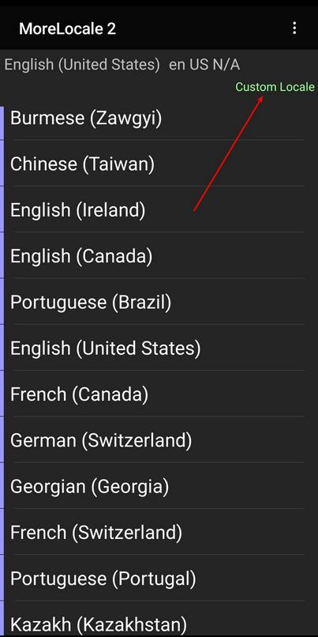
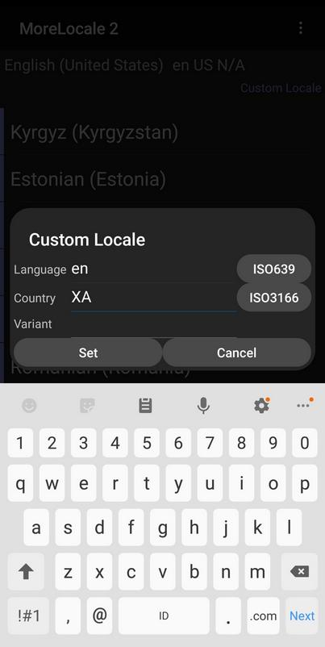

# Internationalization

Internationalization is the process of preparing Android application to be translatable. Localization is the process of translating Android application into other languages.

## values-in

Create a new empty Activity Android project. Name it HelloInternationalization1.

Right click the app / res / values directory in tree panel. Choose New – Android Resource Directory. Name it values-in. We have the new directory already. But if you can not see the new directory, you can switch to Project mode first from Android mode.

<p align="center">

</p>

Edit app / res / values / strings.xml.

```xml
<resources>
    <string name="app_name">HelloInternationalization1</string>
    <string name="hello_world">Hello World</string>
</resources>
```

Copy strings.xml from app / res / values directory to app / res / values-in.

Edit app / res / values-in / strings.xml.

```xml
<resources>
    <string name="app_name">HelloInternationalization1</string>
    <string name="hello_world">Halo Dunia</string>
</resources>
```

Edit app / res / layout / activity_main.xml.

```xml
<?xml version="1.0" encoding="utf-8"?>
<androidx.constraintlayout.widget.ConstraintLayout xmlns:android="http://schemas.android.com/apk/res/android"
    xmlns:app="http://schemas.android.com/apk/res-auto"
    xmlns:tools="http://schemas.android.com/tools"
    android:layout_width="match_parent"
    android:layout_height="match_parent"
    tools:context=".MainActivity">

    <TextView
        android:layout_width="wrap_content"
        android:layout_height="wrap_content"
        android:text="@string/hello_world"
        app:layout_constraintBottom_toBottomOf="parent"
        app:layout_constraintLeft_toLeftOf="parent"
        app:layout_constraintRight_toRightOf="parent"
        app:layout_constraintTop_toTopOf="parent" />

</androidx.constraintlayout.widget.ConstraintLayout>
```

Notice the value of android:text in TextView node is @string/hello_world not hard-coded string anymore.

If you run the application, you will get default language.

<p align="center">

</p>

To change the locale in Android emulator phone, click Settings.

<p align="center">

</p>

Then click System.

<p align="center">

</p>

Then choose Language & Input.

<p align="center">

</p>

Then click Languages.

<p align="center">

</p>

Then click “Add a language” button.

<p align="center">

</p>

Choose Indonesia.

<p align="center">

</p>

Once Indonesia language is in our Languages list, drag Indonesia to the first position.

<p align="center">

</p>

<p align="center">

</p>

Then run our application again. This time, we will get our Hello World in Indonesia.

<p align="center">

</p>

## Notice

In Android, the locale code for Indonesia is “in” not “id”. But in the backend server, it is usually “id”. Be mindful of this situation.

## Extract String

Instead of editing strings.xml manually, Android has a tool to extract the string.

Create a new empty Activity Android project. Name it HelloInternationalization2.

Right click the app / res / values directory in tree panel. Choose New – Android Resource Directory. Name it values-in. Copy strings.xml from app / res / values directory to app / res / values-in.

Then edit app / res / layout / activity_main.xml.

We put our cursor in “Hello World” string in “android:text” line. Right click, then choose “Extract string resource”. We will be greeted with a dialog.

<p align="center">

</p>

Fill “hello_world” in “Resource name” field. Check both resources: “values”, “values-in”.

After we click OK button, the hard-coded string in activity_main.xml layout becomes “@string/hello_world”.

Both of our strings.xml in app / res / values and app / res / values-in directories have this line:

```xml
<string name="hello_world">Hello World!</string>
```

We can translate the “hello_world” string by editing app / res / values-in / strings.xml manually.

But we can also use translations editor provided by Android. Right click, strings.xml (the one which is in app / res / values), then choose “Open Translations Editor”.

<p align="center">

</p>

We can translate the words directly there.

When we want to translate strings inside values directory, we create values-in directory. The Indonesian locale used by Android phone/emulator will force Android application to use strings inside values-in directory.  Basically we put country code, “in”, in front of “values-” name. We can also do the same thing with other resources directory, such as drawable, layout, mipmap, anim, etc.

Create app / res / layout-in resource directory. Then copy activity_main.xml from app / res / layout directory to app / res / layout-in directory.

Edit this activity_main.xml (the one inside app / res / layout-in directory).

```xml
<?xml version="1.0" encoding="utf-8"?>
<androidx.constraintlayout.widget.ConstraintLayout xmlns:android="http://schemas.android.com/apk/res/android"
    xmlns:app="http://schemas.android.com/apk/res-auto"
    xmlns:tools="http://schemas.android.com/tools"
    android:layout_width="match_parent"
    android:layout_height="match_parent"
    tools:context=".MainActivity">

    <Button
        android:id="@+id/button"
        android:layout_width="wrap_content"
        android:layout_height="wrap_content"
        android:text="Button"
        app:layout_constraintBottom_toBottomOf="parent"
        app:layout_constraintEnd_toEndOf="parent"
        app:layout_constraintHorizontal_bias="0.5"
        app:layout_constraintStart_toStartOf="parent"
        app:layout_constraintTop_toTopOf="parent" />
</androidx.constraintlayout.widget.ConstraintLayout>
```

Make sure locale in Android emulator is Indonesia, run the application and we will see a button.

<p align="center">

</p>

Make sure locale in Android emulator is English, run the application and we will see a text view.

<p align="center">

</p>

## Pseudolanguages

Sometimes one language is more verbose than the other. For example, Indonesian language is more verbose than English language. Most likely words in Indonesian is longer than the counterpart in English. Also some languages like French has accent. Rather than testing with many languages, we can use pseudolanguages that simulate the language which is more verbose and has accent.

Create an empty Activity Android project. Name it HelloInternationalization3.

Extract string in text view in the layout file. Name the key “hello_world”. The hardcoded string “Hello World!” in android:text attribute in text view will be turned into “@string/hello_world”.


Edit build.gradle (Module: app). Add this code inside buildTypes block.

```gradle
debug {
    pseudoLocalesEnabled true
}
```

Change android:layout_width from wrap_content to 100dp in text view.

Run the application and we will get this screen.

<p align="center">

</p>

Now. let’s test it with pseudolanguage.

To install pseudolanguages, we must install MoreLocale 2 app.  In this example, we do it in device not simulator.

<p align="center">

</p>

Run this app and click “Custom Locale”.

<p align="center">

</p>

Before we can set the custom locale, we need to do an extra step. Connect our device with USB to computer. Then run this command in host computer.

```
$ adb shell pm grant jp.co.c_lis.ccl.morelocale android.permission.CHANGE_CONFIGURATION
```

Then go back to MoreLocale 2 application.

Fill “en” in Language field. Fill “XA” in Country field.

Then click “Set” button.

<p align="center">

</p>

Run the application again using English language.

<p align="center">

</p>

Then we can see the problem. Our fixed width constraint makes our text split in 3 lines. Whether that is okay or not, it depends on our need. But at least, with pseudolanguages we can be aware of such things.

## String Formatting

Android has support for string formatting which accept dynamic parameter.

On top of that, Android has support for plural string. Indonesian and English have different rules for pluralization.

Create an empty Activity Android project. Name it HelloInternationalization4.

Create values-in resource directory. Copy app / res / values / strings.xml to app / res / values-in / strings.xml.

Edit app / res / values / strings.xml.

```xml
<resources>
    <string name="app_name">HelloInternationalization4</string>
    <string name="hello_world">Hello World!</string>
    <string name="incoming_transfer">Hi, %1$s! Someone just transferred you %2$d dollar.</string>
    <plurals name="books">
        <item quantity="one">There is one book in this room.</item>
        <item quantity="other">There are %d books in this room.</item>
    </plurals>
</resources>
``` 

Edit app / res / values-in / strings.xml.

```xml
<resources>
    <string name="app_name">HelloInternationalization4</string>
    <string name="hello_world">Halo Dunia!</string>
    <string name="incoming_transfer">Hai, %1$s! Seseorang baru saja mengirim kamu %2$d dollar.</string>
    <plurals name="books">
        <item quantity="other">Ada %d buku di ruangan ini.</item>
    </plurals>
</resources>
```

Edit app / java / com.example.hellointernationalization4 / MainActivity.kt. Add this code inside onCreate method.

```kotlin
val helloWorld : String = getString(R.string.hello_world)
Log.d(LOG, helloWorld)
```

This is to get the normal string. Use R.string.hello_world to get the string with name “hello_world”.

Check the string “incoming_transfer”. We have “%1$s” word and “%2$d” word.  The “%” character and “$” character represent boundaries. The number (1 and 2) represents the order of the parameters. The “s” and “d” represent parameter type. “s” means string. “d” means integer.

Edit app / java / com.example.hellointernationalization4 / MainActivity.kt. Add this code inside onCreate method.

```kotlin
val incomingTransfer : String = getString(R.string.incoming_transfer, "Sarah Connor", 3000)
Log.d(LOG, incomingTransfer)
```

It’s similar with previous example, but this time we add two parameters in getString method.

Check plural node with name “books”. It has item node with attribute “quantity”.

The string in the item node has %d word. It will be the placeholder for number that will be fed to the method to get the string.

Edit app / java / com.example.hellointernationalization4 / MainActivity.kt. Add this code inside onCreate method.

```kotlin
val oneBook = 1
val oneBookString = resources.getQuantityString(R.plurals.books, oneBook, oneBook)
Log.d(LOG, oneBookString)

val fiveBooks = 5
val fiveBooksString = resources.getQuantityString(R.plurals.books, fiveBooks, fiveBooks)
Log.d(LOG, fiveBooksString)
```

This time we use resources.getQuantityString method instead of getSTring method. The first parameter is clear. The second parameter is to decide which “item” node which we will use. If second parameter is 1, then we will use “item” node with “quantity” attribute with value “one” rather than “item” node with “quantity” attribute with value “other”. The third parameters and so on will be fed into the string itself.

Run the application in Indonesian and we will get this output in Logcat.

```
2019-09-16 14:37:50.763 9400-9400/? D/i18n: Halo Dunia!
2019-09-16 14:37:50.775 9400-9400/? D/i18n: Hai, Sarah Connor! Seseorang baru saja mengirim kamu 3000 dollar.
2019-09-16 14:37:50.787 9400-9400/? D/i18n: Ada 1 buku di ruangan ini.
2019-09-16 14:37:50.787 9400-9400/? D/i18n: Ada 5 buku di ruangan ini.

Run the application in English and we will get this output in Logcat.

2019-09-16 14:40:08.635 10689-10689/? D/i18n: Hello World!
2019-09-16 14:40:08.635 10689-10689/? D/i18n: Hi, Sarah Connor! Someone just transferred you 3000 dollar.
2019-09-16 14:40:08.643 10689-10689/? D/i18n: There is one book in this room.
2019-09-16 14:40:08.643 10689-10689/? D/i18n: There are 5 books in this room.
```

## Date and Number Formatting

Indonesian and English display date in different format.

Let’s create an empty activity Android project. Name it HelloInternationalization5.

Edit app / java / com.example.hellointernationalization5 / MainActivity.kt.

Add this code outside MainActivity class.

```kotlin
import java.text.DateFormat
import java.util.*

const val LOG = "date-formatting"
```

Add this code inside onCreate method.

```kotlin
val date = Date()

val mediumDf : DateFormat = DateFormat.getDateInstance(DateFormat.MEDIUM)
val mediumDateString = mediumDf.format(date)
Log.d(LOG, mediumDateString)

val shortDf : DateFormat = DateFormat.getDateInstance(DateFormat.SHORT)
val shortDateString = shortDf.format(date)
Log.d(LOG, shortDateString)
```

We get a date formatter with getDateInstance static method which accepts a type of date format.

```kotlin
val mediumDf : DateFormat = DateFormat.getDateInstance(DateFormat.MEDIUM)
```

The we can format the date with this date formatter.

```kotlin
val mediumDateString = mediumDf.format(date)
```

If we run this application in English, we get this output in Logcat:

```
2019-09-17 14:12:58.567 14431-14431/com.example.hellointernationalization5 D/date-formatting: Sep 17, 2019
2019-09-17 14:12:58.567 14431-14431/com.example.hellointernationalization5 D/date-formatting: 9/17/19
```

If we run this application in Indonesian, we get this output in Logcat:

```
2019-09-17 14:14:35.669 14431-14431/com.example.hellointernationalization5 D/date-formatting: 17 Sep 2019
2019-09-17 14:14:35.669 14431-14431/com.example.hellointernationalization5 D/date-formatting: 17/09/19
```

For number formatting, we can use NumberFormat.

Add this code inside onCreate method.

```kotlin
val number = 12345678.34

val nf = NumberFormat.getNumberInstance()
val numberString = nf.format(number)
Log.d(LOG, numberString)

val cf = NumberFormat.getCurrencyInstance()
val currencyString = cf.format(number)
Log.d(LOG, currencyString)
```

We get number formatter and currency formatter.

```kotlin
val nf = NumberFormat.getNumberInstance()

val cf = NumberFormat.getCurrencyInstance()
```

Then we can format the number.

```kotlin
val numberString = nf.format(number)
```

If we run the application in Indonesian, we get this output in Logcat.

```
2019-09-17 15:24:39.983 17379-17379/? D/date-formatting: 12.345.678,34
2019-09-17 15:24:39.983 17379-17379/? D/date-formatting: Rp12.345.678,34
```

If we run the application in English, we get this output in Logcat.

```
2019-09-17 15:26:37.111 19250-19250/com.example.hellointernationalization5 D/date-formatting: 12,345,678.34
2019-09-17 15:26:37.111 19250-19250/com.example.hellointernationalization5 D/date-formatting: $12,345,678.34
```

If we use Android API version 26, we can use a nicer API.

Create a new empty Activity Android project. Don’t forget to set “Minimum API level” to “API 26: Android 8.0 (Oreo)”. Name it HelloInternationalization6.

Edit app / java / com.example.hellointernationalization6 / MainActivity.kt.

Add some import statements and a constant statement.

```kotlin
import java.time.LocalDate
import java.time.format.DateTimeFormatter
import java.time.format.FormatStyle

const val LOG = "date-formatting"
```

Add this code in onCreate method.

```kotlin
val date = LocalDate.now()

val mediumDateString = date.format(DateTimeFormatter.ofLocalizedDate(FormatStyle.MEDIUM))
Log.d(LOG, mediumDateString)
val shortDateString = date.format(DateTimeFormatter.ofLocalizedDate(FormatStyle.SHORT))
Log.d(LOG, shortDateString)
```

We get the current date with LocalDate.now() method. Then we get the date formatter with DateTimeFormatter.ofLocalizedDate(FormatStyle.MEDIUM)) statement. The to format the date we can use format method of the date object.

Run in English, we will get this output in Logcat:

```
2019-09-18 15:47:11.847 3055-3055/com.example.hellointernationalization6 D/date-formatting: Sep 18, 2019
2019-09-18 15:47:11.847 3055-3055/com.example.hellointernationalization6 D/date-formatting: 9/18/19
```

Run in Indonesian, we will get this output in Logcat:
```
2019-09-18 15:55:24.596 3055-3055/com.example.hellointernationalization6 D/date-formatting: 18 Sep 2019
2019-09-18 15:55:24.596 3055-3055/com.example.hellointernationalization6 D/date-formatting: 18/09/19
```

## Getting Locale Information

To get the locale information, we can use Locale class.

Create an empty Activity Android project. Name it HelloInternationalization7.

Edit app / java / com.example.hellointernationalization7 / MainActivity.

Add this code inside onCreate method.

```kotlin
val locales = resources.configuration.locales
val locale = locales[0]
Log.d(LOG, locale.toString())
if (locales.size()>1) {
    val locale2 = locales[1]
    Log.d(LOG, locale2.toString())
}

Log.d(LOG, locale.country)
Log.d(LOG, locale.language)
Log.d(LOG, locale.displayName)
Log.d(LOG, locale.displayCountry)
Log.d(LOG, locale.displayLanguage)
```

To get all locales, we can use resources.configuration.locales.

```kotlin
val locales = resources.configuration.locales
```

In our case, we have two locales: Indonesian and English.

<p align="center">

</p>

Then we can check the country and the language from the locale.

```kotlin
Log.d(LOG, locale.country)
Log.d(LOG, locale.language)
Log.d(LOG, locale.displayName)
Log.d(LOG, locale.displayCountry)
Log.d(LOG, locale.displayLanguage)
```

Run the application in English, we will get this output:

```
2019-09-19 18:01:29.916 13409-13409/com.example.hellointernationalization7 D/locale-settings: en_US
2019-09-19 18:01:29.916 13409-13409/com.example.hellointernationalization7 D/locale-settings: US
2019-09-19 18:01:29.916 13409-13409/com.example.hellointernationalization7 D/locale-settings: en
2019-09-19 18:01:29.916 13409-13409/com.example.hellointernationalization7 D/locale-settings: English (United States)
2019-09-19 18:01:29.916 13409-13409/com.example.hellointernationalization7 D/locale-settings: United States
2019-09-19 18:01:29.916 13409-13409/com.example.hellointernationalization7 D/locale-settings: English
2019-09-19 18:01:40.704 13410-13410/com.example.hellointernationalization7 D/locale-settings: in_ID
2019-09-19 18:01:40.704 13410-13410/com.example.hellointernationalization7 D/locale-settings: ID
2019-09-19 18:01:40.704 13410-13410/com.example.hellointernationalization7 D/locale-settings: in
2019-09-19 18:01:40.704 13410-13410/com.example.hellointernationalization7 D/locale-settings: Indonesia (Indonesia)
2019-09-19 18:01:40.704 13410-13410/com.example.hellointernationalization7 D/locale-settings: Indonesia
2019-09-19 18:01:40.704 13410-13410/com.example.hellointernationalization7 D/locale-settings: Indonesia
```

## Changing Locale

Other than changing locale in Settings, we can also change locale in the application.

First, we create a ContextWrapper class. Add app / java / com.example.hellointernationalization7 / ContextWrapper.

```kotlin
package com.example.hellointernationalization7

import android.content.Context
import android.os.LocaleList
import java.util.*


// https://stackoverflow.com/questions/39705739/android-n-change-language-programmatically
class ContextWrapper(base: Context) : android.content.ContextWrapper(base) {
    companion object {

        fun wrap(context: Context, newLocale: Locale): ContextWrapper {
            var context = context
            val res = context.resources
            val configuration = res.configuration

            if (android.os.Build.VERSION.SDK_INT  >= 24) {
                configuration.setLocale(newLocale)

                val localeList = LocaleList(newLocale)
                LocaleList.setDefault(localeList)
                configuration.setLocales(localeList)

                context = context.createConfigurationContext(configuration)

            } else if (android.os.Build.VERSION.SDK_INT >= 17) {
                configuration.setLocale(newLocale)
                context = context.createConfigurationContext(configuration)

            } else {
                configuration.locale = newLocale
                res.updateConfiguration(configuration, res.displayMetrics)
            }

            return ContextWrapper(context)
        }
    }
}
```

With the new API (Android API > version 24), we can change the locale with this code:

```kotlin
val res = context.resources
val configuration = res.configuration

configuration.setLocale(newLocale)

val localeList = LocaleList(newLocale)
LocaleList.setDefault(localeList)
configuration.setLocales(localeList)

context = context.createConfigurationContext(configuration)
```

Edit app / com.example.hellointernationalization7 / MainActivity.

Add this method inside MainActivity class.

```kotlin
override fun attachBaseContext(newBase: Context?) {
    val context = ContextWrapper.wrap(newBase!!, Locale("in", "ID"))
    // val context = ContextWrapper.wrap(newBase!!, Locale("en", "US"))
    super.attachBaseContext(context)
}
```

Run the application and we will get Indonesian locale running on the application.

Change the attachBaseContext method to this one:

```kotlin
override fun attachBaseContext(newBase: Context?) {
    // val context = ContextWrapper.wrap(newBase!!, Locale("in", "ID"))
    val context = ContextWrapper.wrap(newBase!!, Locale("en", "US"))
    super.attachBaseContext(context)
}
```

Run the application and we will get English locale running on the application.

# Optional Readings

https://developer.android.com/guide/topics/resources/localization

# Exercises

1. Take one of your previous projects and translate it.