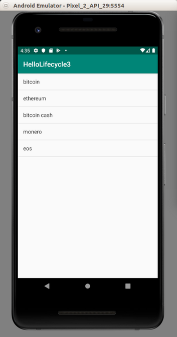
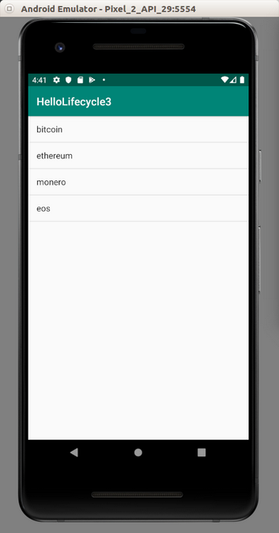

# LifeCycle

There are various methods you can override to intercept the lifecycles of Android’s activity and fragment.

Create an empty Activity project. Name it HelloLifecycle1.

Edit app / res / layout / activity_main.xml.

```xml
<?xml version="1.0" encoding="utf-8"?>
<androidx.constraintlayout.widget.ConstraintLayout
        xmlns:android="http://schemas.android.com/apk/res/android"
        xmlns:tools="http://schemas.android.com/tools"
        xmlns:app="http://schemas.android.com/apk/res-auto"
        android:layout_width="match_parent"
        android:layout_height="match_parent"
        tools:context=".MainActivity">
    <TextView
            android:layout_width="wrap_content"
            android:layout_height="wrap_content"
            android:text="Hello World!"
            app:layout_constraintBottom_toBottomOf="parent"
            app:layout_constraintLeft_toLeftOf="parent"
            app:layout_constraintRight_toRightOf="parent"
            app:layout_constraintTop_toTopOf="parent" android:id="@+id/textView"/>
    <Button
            android:text="Button"
            android:layout_width="wrap_content"
            android:layout_height="wrap_content"
            android:id="@+id/button"
            app:layout_constraintBottom_toTopOf="@+id/textView" android:layout_marginTop="8dp"
            app:layout_constraintTop_toTopOf="parent" app:layout_constraintEnd_toEndOf="parent"
            android:layout_marginEnd="8dp" app:layout_constraintStart_toStartOf="parent"
            android:layout_marginStart="8dp"/>
</androidx.constraintlayout.widget.ConstraintLayout>
```

Edit app / java / com.example.hellolifecycle1 / MainActivity.

```kotlin
package com.example.hellolifecycle1

import android.os.Bundle
import android.util.Log
import android.widget.Button
import android.widget.TextView
import androidx.appcompat.app.AppCompatActivity


class MainActivity : AppCompatActivity() {

    private val tag = "activity-lifecycle"

    override fun onCreate(savedInstanceState: Bundle?) {
        super.onCreate(savedInstanceState)
        setContentView(R.layout.activity_main)

        findViewById<Button>(R.id.button).setOnClickListener {
            findViewById<TextView>(R.id.textView).text = "Custom Message"
        }

        if (savedInstanceState != null) {
            findViewById<TextView>(R.id.textView).text = savedInstanceState.getString("textvalue", "default")
        }

        Log.d(tag, "onCreate")
    }

    override fun onStart() {
        super.onStart()
        Log.d(tag, "onStart")
    }

    override fun onResume() {
        super.onResume()
        Log.d(tag, "onResume")
    }

    override fun onPause() {
        super.onPause()
        Log.d(tag, "onPause")
    }

    override fun onStop() {
        super.onStop()
        Log.d(tag, "onStop")
    }

    override fun onDestroy() {
        super.onDestroy()
        Log.d(tag, "onDestroy")
    }

    // Uncomment this if you want to preserve value when rotating a device
    /*
    override fun onSaveInstanceState(outState: Bundle?) {
        super.onSaveInstanceState(outState)
        Log.d(tag, "onSaveInstanceState")
        outState?.putString("textvalue", findViewById<TextView>(R.id.textView).text.toString())
    }
    */
}
```

## Device Rotation

Run the application and you will get this screen.

<p align="center">

</p>

If you click the button, the text in the textview will be changed.

<p align="center">

</p>

If you rotate the image, the text in the textview changed to default.

<p align="center">

</p>

Then look at the log.

```
2019-08-06 14:50:38.517 10521-10521/? D/activity-lifecycle: onCreate
2019-08-06 14:50:38.524 10521-10521/? D/activity-lifecycle: onStart
2019-08-06 14:50:38.527 10521-10521/? D/activity-lifecycle: onResume
2019-08-06 14:50:43.527 10521-10521/com.example.hellolifecycle1 D/activity-lifecycle: onPause
2019-08-06 14:50:43.529 10521-10521/com.example.hellolifecycle1 D/activity-lifecycle: onStop
2019-08-06 14:50:43.532 10521-10521/com.example.hellolifecycle1 D/activity-lifecycle: onDestroy
2019-08-06 14:50:43.689 10521-10521/com.example.hellolifecycle1 D/activity-lifecycle: onCreate
2019-08-06 14:50:43.703 10521-10521/com.example.hellolifecycle1 D/activity-lifecycle: onStart
2019-08-06 14:50:43.706 10521-10521/com.example.hellolifecycle1 D/activity-lifecycle: onResume
```

At first, when your application is launched, your application will be in onCreate, onStart, and onResume lifecycle. Then when you rotate the device, your application will be in onPause, onStop, onDestroy lifecycles to destroy the activity in portrait mode.

Then it recreates the activity in landscape mode. You application will be in onCreate, onStart and onResume lifecycles.

That’s why the text in the textview is changed to default. If you want to keep the value across the rotation of the device, you can save the value in onSaveInstanceState. Uncomment onSaveInstanceState method.

```kotlin
override fun onSaveInstanceState(outState: Bundle?) {
    super.onSaveInstanceState(outState)
    Log.d(tag, "onSaveInstanceState")
    outState?.putString("textvalue", findViewById<TextView>(R.id.textView).text.toString())
}
```

Then in onCreate method, remember you have these lines:

```kotlin
if (savedInstanceState != null) {
    findViewById<TextView>(R.id.textView).text = savedInstanceState.getString("textvalue", "default")
}
```

Then run the application again, click the button, then rotate the device. The text in the textview stays the same.

Your application will call onSaveInstanceState method after calling onStop method.

# Home Button

Run the same application again. Press Home button.

You will get this log:

```
2019-08-06 14:57:22.935 11483-11483/com.example.hellolifecycle1 D/activity-lifecycle: onCreate
2019-08-06 14:57:22.941 11483-11483/com.example.hellolifecycle1 D/activity-lifecycle: onStart
2019-08-06 14:57:22.944 11483-11483/com.example.hellolifecycle1 D/activity-lifecycle: onResume
2019-08-06 14:57:31.311 11483-11483/com.example.hellolifecycle1 D/activity-lifecycle: onPause
2019-08-06 14:57:31.351 11483-11483/com.example.hellolifecycle1 D/activity-lifecycle: onStop
2019-08-06 14:57:31.361 11483-11483/com.example.hellolifecycle1 D/activity-lifecycle: onSaveInstanceState
```

Then resume the application again.

You will get this additional log.

```
2019-08-06 14:58:00.239 11483-11483/com.example.hellolifecycle1 D/activity-lifecycle: onStart
2019-08-06 14:58:00.241 11483-11483/com.example.hellolifecycle1 D/activity-lifecycle: onResume
```

If you press the back button, you will get this additional log.

```
2019-08-06 14:58:17.449 11483-11483/com.example.hellolifecycle1 D/activity-lifecycle: onPause
2019-08-06 14:58:17.848 11483-11483/com.example.hellolifecycle1 D/activity-lifecycle: onStop
2019-08-06 14:58:17.852 11483-11483/com.example.hellolifecycle1 D/activity-lifecycle: onDestroy
```

So onDestroy will be called when you rotate the device and press back button.

# Launching Another Activity

Let’s create another empty project.

As usual edit build.gradle (Module: app).

```gradle
dependencies {
    implementation fileTree(dir: 'libs', include: ['*.jar'])
    implementation "org.jetbrains.kotlin:kotlin-stdlib-jdk7:$kotlin_version"
    implementation 'androidx.appcompat:appcompat:1.0.2'
    implementation 'androidx.recyclerview:recyclerview:1.0.0'
    implementation 'androidx.lifecycle:lifecycle-viewmodel-ktx:2.0.0'
    implementation 'androidx.lifecycle:lifecycle-extensions:2.0.0'
    implementation 'androidx.fragment:fragment-ktx:1.0.0'
    implementation 'androidx.constraintlayout:constraintlayout:1.1.3'
    implementation 'com.android.support.constraint:constraint-layout:1.1.3'
}
```

Edit app / res / layout / activity_main.xml.

```xml
<?xml version="1.0" encoding="utf-8"?>
<androidx.constraintlayout.widget.ConstraintLayout
        xmlns:android="http://schemas.android.com/apk/res/android"
        xmlns:tools="http://schemas.android.com/tools"
        xmlns:app="http://schemas.android.com/apk/res-auto"
        android:layout_width="match_parent"
        android:layout_height="match_parent"
        tools:context=".MainActivity">
    <Button
            android:text="Button"
            android:layout_width="wrap_content"
            android:layout_height="wrap_content"
            android:id="@+id/button" app:layout_constraintEnd_toEndOf="parent"
            app:layout_constraintStart_toStartOf="parent" app:layout_constraintHorizontal_bias="0.5"
            app:layout_constraintTop_toTopOf="parent" app:layout_constraintBottom_toBottomOf="parent"/>
</androidx.constraintlayout.widget.ConstraintLayout>
```

There is only one button in this layout resource.

Create another layout resource. Name it app / res / layout / activity_main2.xml.

```xml
<?xml version="1.0" encoding="utf-8"?>
<androidx.constraintlayout.widget.ConstraintLayout
        xmlns:android="http://schemas.android.com/apk/res/android"
        xmlns:tools="http://schemas.android.com/tools"
        xmlns:app="http://schemas.android.com/apk/res-auto"
        android:layout_width="match_parent"
        android:layout_height="match_parent"
        tools:context=".Main2Activity">
    <TextView
            android:text="TextView"
            android:layout_width="wrap_content"
            android:layout_height="wrap_content"
            android:id="@+id/textView" app:layout_constraintStart_toStartOf="parent"
            app:layout_constraintHorizontal_bias="0.5" app:layout_constraintEnd_toEndOf="parent"
            app:layout_constraintTop_toTopOf="parent" app:layout_constraintBottom_toBottomOf="parent"/>
</androidx.constraintlayout.widget.ConstraintLayout>
```

There is only one text view in this layout resource.

Create app / java / com.example.hellolifecycle2 / Main2Activity class.

```kotlin
package com.example.hellolifecycle2

import android.os.Bundle
import androidx.appcompat.app.AppCompatActivity


class Main2Activity : AppCompatActivity() {
    override fun onCreate(savedInstanceState: Bundle?) {
        super.onCreate(savedInstanceState)
        setContentView(R.layout.activity_main2)
    }
}
```

Edit app / java / com.example.hellolifecycle2 / MainActivity class.

```kotlin
package com.example.hellolifecycle2

import android.content.Intent
import android.os.Bundle
import android.util.Log
import android.widget.Button
import androidx.appcompat.app.AppCompatActivity


class MainActivity : AppCompatActivity() {
    
    private val tag = "activity-lifecycle"

    override fun onCreate(savedInstanceState: Bundle?) {
        super.onCreate(savedInstanceState)
        setContentView(R.layout.activity_main)
        
        findViewById<Button>(R.id.button).setOnClickListener {
            startActivity(Intent(this, Main2Activity::class.java))
        }
        Log.d(tag, "onCreate")
    }

    override fun onStart() {
        super.onStart()
        Log.d(tag, "onStart")
    }

    override fun onResume() {
        super.onResume()
        Log.d(tag, "onResume")
    }

    override fun onPause() {
        super.onPause()
        Log.d(tag, "onPause")
    }

    override fun onStop() {
        super.onStop()
        Log.d(tag, "onStop")
    }

    override fun onDestroy() {
        super.onDestroy()
        Log.d(tag, "onDestroy")
    }
}
```

Don’t forget to add the new activity in manifest file, app / manifests / AndroidManifest.xml.

```xml
<activity android:name=".Main2Activity" />
```

Run the application. You will get this screen.

<p align="center">

</p>

You will get this log.

```
2019-08-06 15:30:26.382 30002-30002/com.example.hellolifecycle2 D/activity-lifecycle: onCreate
2019-08-06 15:30:26.384 30002-30002/com.example.hellolifecycle2 D/activity-lifecycle: onStart
2019-08-06 15:30:26.385 30002-30002/com.example.hellolifecycle2 D/activity-lifecycle: onResume
```

Press the button. You will get new activity.

<p align="center">

</p>

You will get this log.

```
2019-08-06 15:30:42.138 30002-30002/com.example.hellolifecycle2 D/activity-lifecycle: onPause
2019-08-06 15:30:42.653 30002-30002/com.example.hellolifecycle2 D/activity-lifecycle: onStop
```

So the parent activity in onStop lifecycle when the child activity is in active. Press back button. The child activity will be destroyed.

You will get this additional log:

```
2019-08-06 15:31:47.430 30002-30002/com.example.hellolifecycle2 D/activity-lifecycle: onStart
2019-08-06 15:31:47.430 30002-30002/com.example.hellolifecycle2 D/activity-lifecycle: onResume
```

## onResume Method

Common case of using onResume method is when you have master detail activities. In master activity, you have a list of items. You press a row then you are redirected to a detail activity. Let’s say in that activity you choose to delete this item. When you go back to the master activity, the list should update itself because the row which has been selected has been deleted.

Create an empty project. Name it HelloLifecycle3.

Edit app / res / layout / activity_main.xml.

```xml
<?xml version="1.0" encoding="utf-8"?>
<ListView xmlns:android="http://schemas.android.com/apk/res/android"
          android:id="@+id/listView"
          android:layout_width="match_parent"
          android:layout_height="match_parent">
</ListView>
```

Create a new layout resource file, app / res / layout / activity_detail.xml.

```xml
<?xml version="1.0" encoding="utf-8"?>
<androidx.constraintlayout.widget.ConstraintLayout xmlns:android="http://schemas.android.com/apk/res/android"
                                                   xmlns:app="http://schemas.android.com/apk/res-auto" xmlns:tools="http://schemas.android.com/tools" android:layout_width="match_parent"
                                                   android:layout_height="match_parent">
    <TextView
            android:text="TextView"
            android:layout_width="wrap_content"
            android:layout_height="wrap_content"
            android:id="@+id/textView" app:layout_constraintTop_toTopOf="parent"
            android:layout_marginBottom="8dp" app:layout_constraintBottom_toBottomOf="parent"
            app:layout_constraintStart_toStartOf="parent" android:layout_marginStart="8dp"
            app:layout_constraintEnd_toEndOf="parent" android:layout_marginEnd="8dp"/>
</androidx.constraintlayout.widget.ConstraintLayout>
```

Create a new class. Name it app / java / com.example.hellolifecycle3 / DetailActivity.

```kotlin
package com.example.hellolifecycle3

import android.os.Bundle
import android.widget.TextView
import androidx.appcompat.app.AppCompatActivity


class DetailActivity : AppCompatActivity() {

    override fun onCreate(savedInstanceState: Bundle?) {
        super.onCreate(savedInstanceState)
        setContentView(R.layout.activity_detail)

        val text = intent.getStringExtra("text")
        val textView = findViewById<TextView>(R.id.textView)
        if (!text.isNullOrEmpty()) {
            textView.text = text
        }
    }

}
```

Edit app / com.example.hellolifecycle3 / MainActivity.kt.

```kotlin
package com.example.hellolifecycle3

import android.content.Intent
import android.os.Bundle
import android.util.Log
import android.widget.ArrayAdapter
import android.widget.ListView
import androidx.appcompat.app.AppCompatActivity


class MainActivity : AppCompatActivity() {

    private val tag = "activity-lifecycle"
    private var strings = arrayOf("bitcoin", "ethereum", "bitcoin cash", "monero", "eos")
    private var selectedRow = ""
    private lateinit var listView: ListView

    override fun onCreate(savedInstanceState: Bundle?) {
        super.onCreate(savedInstanceState)
        setContentView(R.layout.activity_main)
        
        listView = findViewById(R.id.listView)
        val adapter: ArrayAdapter<String> = ArrayAdapter(this, android.R.layout.simple_list_item_1, strings)
        listView.adapter = adapter
        listView.setOnItemClickListener { adapterView, view, position: Int, id: Long ->
            selectedRow = strings[position]
            Log.d("item", selectedRow)
            
            val intent = Intent(this, DetailActivity::class.java)
            intent.putExtra("text", selectedRow)
            startActivity(intent)
        }
        
        Log.d(tag, "onCreate")
    }

    override fun onStart() {
        super.onStart()
        Log.d(tag, "onStart")
    }

    override fun onResume() {
        super.onResume()
        
        // Simulating the deletion of item
        strings = strings.filterNot { it == selectedRow }.toTypedArray()
        val adapter: ArrayAdapter<String> = ArrayAdapter(this, android.R.layout.simple_list_item_1, strings)
        listView.adapter = adapter
        
        Log.d(tag, "onResume")
    }

    override fun onPause() {
        super.onPause()
        Log.d(tag, "onPause")
    }

    override fun onStop() {
        super.onStop()
        Log.d(tag, "onStop")
    }

    override fun onDestroy() {
        super.onDestroy()
        Log.d(tag, "onDestroy")
    }
}
```

This is normal listview activity. In onResume method, you remove the row from the adapter’s data.

Add new activity. DetailActivity, in the manifest file, app / manifests / AndroidManifest.xml.

```xml
<activity android:name=".DetailActivity"/>
```

Run the application.

<p align="center">

</p>

Click one of the row. The new activity will be launched.

<p align="center">

</p>

Press back. Then the child activity will be destroyed. The parent activity will call onResume method. This is where you want to update the adapter’s data.

```kotlin
override fun onResume() {
    super.onResume()

    // Simulating the deletion of item
    strings = strings.filterNot { it == selectedRow }.toTypedArray()
    val adapter: ArrayAdapter<String> = ArrayAdapter(this, android.R.layout.simple_list_item_1, strings)
    listView.adapter = adapter

    Log.d(tag, "onResume")
}
```

The list is updated.

<p align="center">

</p>

What have you done just now is simulating deleting row in child activity.

## Fragment LifeCycle

Fragment has also lifecyle.

Let’s create an empty project. Call it HelloLifecycle4.

Edit dependencies part of  build.gradle (Module: app). Add this dependency into dependencies.

```
implementation 'androidx.fragment:fragment-ktx:1.0.0'
```

Create a new layout resource file. Name it app / res / layout / fragment_main.xml.

```xml
<?xml version="1.0" encoding="utf-8"?>
<androidx.constraintlayout.widget.ConstraintLayout xmlns:android="http://schemas.android.com/apk/res/android"
                                                   xmlns:app="http://schemas.android.com/apk/res-auto"
                                                   android:id="@+id/fragment_main"
                                                   android:layout_width="match_parent"
                                                   android:layout_height="match_parent">
    <TextView
            android:text="TextView"
            android:layout_width="wrap_content"
            android:layout_height="wrap_content"
            android:id="@+id/textView" app:layout_constraintStart_toStartOf="parent"
            app:layout_constraintHorizontal_bias="0.5" app:layout_constraintEnd_toEndOf="parent"
            app:layout_constraintTop_toTopOf="parent" app:layout_constraintBottom_toBottomOf="parent"/>
</androidx.constraintlayout.widget.ConstraintLayout>
```

Create a new class, app / java / com.example.hellolifecycle4 / BasicFragment.

```kotlin
package com.example.hellolifecycle4

import android.content.Context
import android.os.Bundle
import android.util.Log
import android.view.LayoutInflater
import android.view.View
import android.view.ViewGroup
import androidx.fragment.app.Fragment


class BasicFragment : Fragment() {

    private val debugTag = "fragment-lifecycle"

    override fun onCreateView(inflater: LayoutInflater, container: ViewGroup?, savedInstanceState: Bundle?): View? {
        Log.d(debugTag, "onCreateView")
        return inflater.inflate(R.layout.fragment_main, container, false)
    }

    override fun onViewCreated(view: View, savedInstanceState: Bundle?) {
        super.onViewCreated(view, savedInstanceState)
        Log.d(debugTag, "onViewCreated")
    }

    override fun onAttach(context: Context?) {
        super.onAttach(context)
        Log.d(debugTag, "onAttach")
    }

    override fun onDetach() {
        super.onDetach()
        Log.d(debugTag, "onDetach")
    }

    override fun onStart() {
        super.onStart()
        Log.d(debugTag, "onStart")
    }

    override fun onResume() {
        super.onResume()
        Log.d(debugTag, "onResume")
    }

    override fun onPause() {
        super.onPause()
        Log.d(debugTag, "onPause")
    }

    override fun onStop() {
        super.onStop()
        Log.d(debugTag, "onStop")
    }

    override fun onDestroy() {
        super.onDestroy()
        Log.d(debugTag, "onDestroy")
    }

}
```

Fragment has additional two life cycles: onAttach and onDetach.

Edit app / java / com.example.hellolifecycle4 / MainActivity.

```kotlin
package com.example.hellolifecycle4

import android.os.Bundle
import android.util.Log
import androidx.appcompat.app.AppCompatActivity
import androidx.fragment.app.transaction


class MainActivity : AppCompatActivity() {

    private val tag = "activity-lifecycle"

    override fun onCreate(savedInstanceState: Bundle?) {
        super.onCreate(savedInstanceState)
        Log.d(tag, "onCreate")
        if (savedInstanceState == null) {
            supportFragmentManager.transaction {
                add(android.R.id.content, BasicFragment())
            }
        }
    }

    override fun onStart() {
        super.onStart()
        Log.d(tag, "onStart")
    }

    override fun onResume() {
        super.onResume()
        Log.d(tag, "onResume")
    }

    override fun onPause() {
        super.onPause()
        Log.d(tag, "onPause")
    }

    override fun onStop() {
        super.onStop()
        Log.d(tag, "onStop")
    }

    override fun onDestroy() {
        super.onDestroy()
        Log.d(tag, "onDestroy")
    }

}
```

Run the application. You will get this log:

```
2019-08-06 16:35:14.260 30163-30163/? D/activity-lifecycle: onCreate
2019-08-06 16:35:14.262 30163-30163/? D/activity-lifecycle: onStart
2019-08-06 16:35:14.262 30163-30163/? D/activity-lifecycle: onResume
2019-08-06 16:39:37.498 30751-30751/? D/activity-lifecycle: onCreate
2019-08-06 16:39:37.500 30751-30751/? D/activity-lifecycle: onStart
2019-08-06 16:39:37.501 30751-30751/? D/activity-lifecycle: onResume
2019-08-06 16:40:09.751 30751-30751/? D/activity-lifecycle: onPause
2019-08-06 16:40:10.277 30751-30751/? D/activity-lifecycle: onStop
2019-08-06 16:41:09.834 30751-30751/? D/activity-lifecycle: onStart
2019-08-06 16:41:09.835 30751-30751/? D/activity-lifecycle: onResume
2019-08-06 16:58:37.963 30752-30752/com.example.hellolifecycle4 D/activity-lifecycle: onCreate
2019-08-06 16:58:37.982 30752-30752/com.example.hellolifecycle4 D/fragment-lifecycle: onAttach
2019-08-06 16:58:38.008 30752-30752/com.example.hellolifecycle4 D/fragment-lifecycle: onCreateView
2019-08-06 16:58:38.024 30752-30752/com.example.hellolifecycle4 D/fragment-lifecycle: onViewCreated
2019-08-06 16:58:38.024 30752-30752/com.example.hellolifecycle4 D/fragment-lifecycle: onStart
2019-08-06 16:58:38.024 30752-30752/com.example.hellolifecycle4 D/activity-lifecycle: onStart
2019-08-06 16:58:38.025 30752-30752/com.example.hellolifecycle4 D/activity-lifecycle: onResume
2019-08-06 16:58:38.026 30752-30752/com.example.hellolifecycle4 D/fragment-lifecycle: onResume
```

Press Home. You will get these additional logs.

```
2019-08-06 16:59:56.414 30752-30752/com.example.hellolifecycle4 D/fragment-lifecycle: onPause
2019-08-06 16:59:56.414 30752-30752/com.example.hellolifecycle4 D/activity-lifecycle: onPause
2019-08-06 16:59:57.148 30752-30752/com.example.hellolifecycle4 D/fragment-lifecycle: onStop
2019-08-06 16:59:57.148 30752-30752/com.example.hellolifecycle4 D/activity-lifecycle: onStop
```

Resume the application. You will get these additional logs.

```
2019-08-06 17:00:17.231 30752-30752/com.example.hellolifecycle4 D/fragment-lifecycle: onStart
2019-08-06 17:00:17.240 30752-30752/com.example.hellolifecycle4 D/activity-lifecycle: onStart
2019-08-06 17:00:17.240 30752-30752/com.example.hellolifecycle4 D/activity-lifecycle: onResume
2019-08-06 17:00:17.240 30752-30752/com.example.hellolifecycle4 D/fragment-lifecycle: onResume
```

Click back button. You will get these additional logs.

```
2019-08-06 17:01:12.205 30752-30752/com.example.hellolifecycle4 D/fragment-lifecycle: onPause
2019-08-06 17:01:12.205 30752-30752/com.example.hellolifecycle4 D/activity-lifecycle: onPause
2019-08-06 17:01:12.846 30752-30752/com.example.hellolifecycle4 D/fragment-lifecycle: onStop
2019-08-06 17:01:12.847 30752-30752/com.example.hellolifecycle4 D/activity-lifecycle: onStop
2019-08-06 17:01:12.853 30752-30752/com.example.hellolifecycle4 D/fragment-lifecycle: onDestroy
2019-08-06 17:01:12.853 30752-30752/com.example.hellolifecycle4 D/fragment-lifecycle: onDetach
2019-08-06 17:01:12.853 30752-30752/com.example.hellolifecycle4 D/activity-lifecycle: onDestroy
```

## ViewModel

You could save data manually using onSaveInstanceState method and the data will survive across the configuration change (like rotation). 

But the recommended way is to use ViewModel. ViewModel complements onSaveInstanceState method. onSaveInstanceState method survives longer time than ViewModel. But you should not save a complicated data in onSaveInstanceState method. The general rule is you save an ID which is an integer in onSaveInstanceState method. But you can save a complicated object in ViewModel.

Let’s create an empty project. Name it HelloLifecycle5.

Edit dependencies build.gradle (Module: app). Add these two dependencies into the dependencies.

```
implementation 'androidx.lifecycle:lifecycle-viewmodel-ktx:2.0.0'
implementation 'androidx.lifecycle:lifecycle-extensions:2.0.0'
```

Edit app / res / layout / activity_main.xml.

```xml
<?xml version="1.0" encoding="utf-8"?>
<androidx.constraintlayout.widget.ConstraintLayout
        xmlns:android="http://schemas.android.com/apk/res/android"
        xmlns:tools="http://schemas.android.com/tools"
        xmlns:app="http://schemas.android.com/apk/res-auto"
        android:layout_width="match_parent"
        android:layout_height="match_parent"
        tools:context=".MainActivity">
    <TextView
            android:id="@+id/textView"
            android:layout_width="wrap_content"
            android:layout_height="wrap_content"
            android:text="Hello World!"
            app:layout_constraintBottom_toBottomOf="parent"
            app:layout_constraintLeft_toLeftOf="parent"
            app:layout_constraintRight_toRightOf="parent"
            app:layout_constraintTop_toTopOf="parent"/>
</androidx.constraintlayout.widget.ConstraintLayout>
```

Create a new class, app / java / com.example.hellolifecycle5 / BasicViewModel.

```kotlin
package com.example.helloviewmodellifecycle
import androidx.lifecycle.ViewModel

class BasicViewModel : ViewModel() {
    private val cryptocurrencies = arrayOf("bitcoin", "ethereum", "monero", "bitcoin cash", "litecoin", "eos", "zcash")
    val cryptocurrency = cryptocurrencies.random()
}
```

This is your view model. The data lies in cryptocurrency variable.

Edit app / java / com.example.hellolifecycle5 / MainActivity.

```kotlin
package com.example.hellolifecycle5

import android.os.Bundle
import android.widget.TextView
import androidx.appcompat.app.AppCompatActivity
import androidx.lifecycle.ViewModelProviders
import androidx.lifecycle.get


class MainActivity : AppCompatActivity() {

    override fun onCreate(savedInstanceState: Bundle?) {
        super.onCreate(savedInstanceState)
        setContentView(R.layout.activity_main)
        val textView = findViewById<TextView>(R.id.textView)
        val viewModel: BasicViewModel = ViewModelProviders.of(this).get()
        textView.text = viewModel.cryptocurrency
    }
}
```

Run the application and rotate the device. The text stays the same. It recognizes you are in the same activity so it will give the same view model which has the same cryptocurrency variable. It does not call random method anymore.

<p align="center">

</p>

<p align="center">

</p>

## Sharing Data With ViewModel

Create another empty project. In this project you will share data between fragments with view model. Name the project HelloLifecycle6.

Edit dependencies build.gradle (Module: app). Add these dependencies into the dependencies of the application.

```
implementation 'androidx.lifecycle:lifecycle-extensions:2.0.0'
implementation 'androidx.lifecycle:lifecycle-viewmodel-ktx:2.0.0'
```

Create two layout resources. The first is app / res / layout / fragment_main.xml.

```xml
<?xml version="1.0" encoding="utf-8"?>
<androidx.constraintlayout.widget.ConstraintLayout xmlns:android="http://schemas.android.com/apk/res/android"
                                                   xmlns:app="http://schemas.android.com/apk/res-auto"
                                                   android:layout_width="match_parent"
                                                   android:layout_height="match_parent">
    <TextView
            android:text="TextView"
            android:layout_width="wrap_content"
            android:layout_height="wrap_content"
            android:id="@+id/textView" app:layout_constraintStart_toStartOf="parent"
            app:layout_constraintHorizontal_bias="0.5" app:layout_constraintEnd_toEndOf="parent"
            app:layout_constraintTop_toTopOf="parent" app:layout_constraintBottom_toBottomOf="parent"/>
    <Button
            android:text="Button"
            android:layout_width="wrap_content"
            android:layout_height="wrap_content"
            android:id="@+id/button"
            app:layout_constraintBottom_toTopOf="@+id/textView" android:layout_marginTop="8dp"
            app:layout_constraintTop_toTopOf="parent" app:layout_constraintEnd_toEndOf="parent"
            android:layout_marginEnd="8dp" app:layout_constraintStart_toStartOf="parent"
            android:layout_marginStart="8dp"/>
</androidx.constraintlayout.widget.ConstraintLayout>
```

The second is app / res / layout / fragment_detail.xml.

```xml
<?xml version="1.0" encoding="utf-8"?>
<androidx.constraintlayout.widget.ConstraintLayout xmlns:android="http://schemas.android.com/apk/res/android"
                                                   xmlns:app="http://schemas.android.com/apk/res-auto" xmlns:tools="http://schemas.android.com/tools" android:layout_width="match_parent"
                                                   android:layout_height="match_parent">
    <TextView
            android:text="TextView"
            android:layout_width="wrap_content"
            android:layout_height="wrap_content"
            android:id="@+id/textView2"
            app:layout_constraintTop_toTopOf="parent" android:layout_marginBottom="8dp"
            app:layout_constraintBottom_toBottomOf="parent" app:layout_constraintEnd_toEndOf="parent"
            android:layout_marginEnd="8dp" app:layout_constraintStart_toStartOf="parent"
            android:layout_marginStart="8dp"/>
</androidx.constraintlayout.widget.ConstraintLayout>
```

Add new class, app / java / com.example.hellolifecycle6 / BasicViewModel.

```kotlin
package com.example.hellolifecycle6

import androidx.lifecycle.ViewModel


class BasicViewModel : ViewModel() {
    private val cryptocurrencies = arrayOf("bitcoin", "ethereum", "monero", "bitcoin cash", "litecoin", "eos", "zcash")
    val cryptocurrency = cryptocurrencies.random()
}
```

Add new class, app / java / com.example.hellolifecycle6 / DetailFragment.

```kotlin
package com.example.hellolifecycle6

import android.os.Bundle
import android.view.LayoutInflater
import android.view.View
import android.view.ViewGroup
import android.widget.TextView
import androidx.fragment.app.Fragment
import androidx.lifecycle.ViewModelProviders
import androidx.lifecycle.get


class DetailFragment : Fragment() {

    override fun onCreateView(inflater: LayoutInflater, container: ViewGroup?, savedInstanceState: Bundle?): View? {
        return inflater.inflate(R.layout.fragment_detail, container, false)
    }

    override fun onViewCreated(view: View, savedInstanceState: Bundle?) {
        super.onViewCreated(view, savedInstanceState)
        activity?.let {
            val vm: BasicViewModel = ViewModelProviders.of(it).get()
            view.findViewById<TextView>(R.id.textView2).text = vm.cryptocurrency
        }
    }
}
```

Notice in this fragment the “of” method of ViewModelProviders can accept fragment or activity as parameter. You want to give it the activity not the fragment because two fragments share the same activity.

Add new class, app / java / com.example.hellolifecycle6 / MainFragment.

```kotlin
package com.example.hellolifecycle6

import android.os.Bundle
import android.view.LayoutInflater
import android.view.View
import android.view.ViewGroup
import android.widget.Button
import android.widget.TextView
import androidx.fragment.app.Fragment
import androidx.lifecycle.ViewModelProviders
import androidx.lifecycle.get


class MainFragment : Fragment() {

    override fun onCreateView(inflater: LayoutInflater, container: ViewGroup?, savedInstanceState: Bundle?): View? {
        return inflater.inflate(R.layout.fragment_main, container, false)
    }

    override fun onViewCreated(view: View, savedInstanceState: Bundle?) {
        super.onViewCreated(view, savedInstanceState)
        activity?.let {
            val vm: BasicViewModel = ViewModelProviders.of(it).get()
            view.findViewById<TextView>(R.id.textView).text = vm.cryptocurrency
            view.findViewById<Button>(R.id.button).setOnClickListener {
                fragmentManager?.beginTransaction()!!.replace(android.R.id.content, DetailFragment())
                    .addToBackStack(null).commit()
            }
        }
    }
}
```

Notice, the “of” method of ViewModelProviders accepts activity parameter not fragment parameter. If you use fragment parameter, you can not share the view model between two fragments.

Edit app / java / com.example.hellolifecycle6 / MainActivity.

```kotlin
package com.example.hellolifecycle6

import android.os.Bundle
import androidx.appcompat.app.AppCompatActivity


class MainActivity : AppCompatActivity() {

    override fun onCreate(savedInstanceState: Bundle?) {
        super.onCreate(savedInstanceState)
        if (savedInstanceState == null) {
            supportFragmentManager.beginTransaction()!!.replace(android.R.id.content, MainFragment()).commit()
        }
    }

}
```

Run the application.

<p align="center">

</p>

Click the button to launch a new fragment.

<p align="center">

</p>

The text comes from the same view model that attached to same activity.

# Optional Readings

https://developer.android.com/guide/components/activities/activity-lifecycle

https://developer.android.com/reference/androidx/lifecycle/package-summary?hl=en

# Exercises

1. Create an application on which the first activity has a button to launch the second activity. In this second activity, there is a button to change the fragment in the second activity. The first activity send data to the second activity. When we switch the fragment in the second activity, we also send the data to this new fragment.