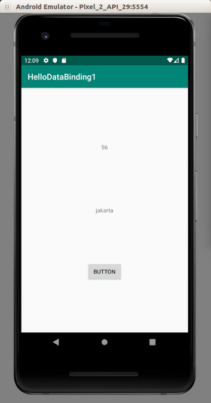
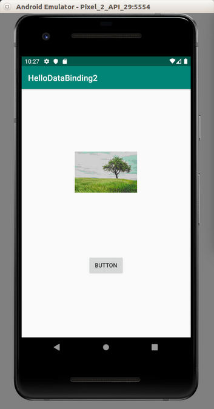
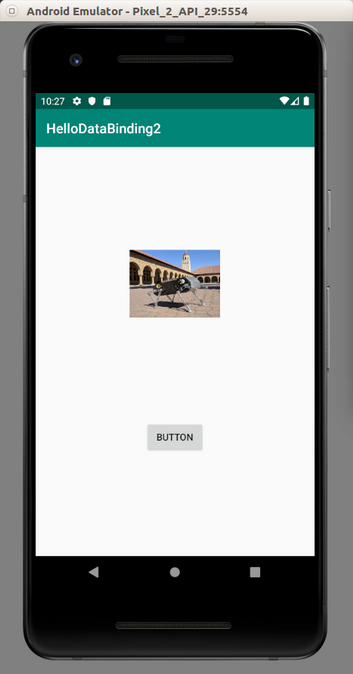

# Live Data

To set data on UI, instead of doing it manually like:

```
findViewById<TextView>(R.id.textView).text = “Hello World”
```

you can do it with binding.

## Data Binding

Create a new empty Activity project. Name it HelloDataBinding1.

Edit build.gradle (Module: app).

Add

```gradle
dataBinding {
    enabled = true
}
```

inside android block.

Create a new data class inside app / java / com.example.hellodatabinding1. Name it MyData.

```kotlin
package com.example.hellodatabinding1

data class MyData(val city : String, val country : String, val people : Int)
```

Edit app / res / layout / activity_main.xml.

```xml
<?xml version="1.0" encoding="utf-8"?>
<layout xmlns:app="http://schemas.android.com/apk/res-auto" xmlns:tools="http://schemas.android.com/tools" xmlns:android="http://schemas.android.com/apk/res/android">

    <data>
        <variable name="myData" type="com.example.hellodatabinding1.MyData"/>
        <variable name="activity" type="com.example.hellodatabinding1.MainActivity"/>
    </data>

    <androidx.constraintlayout.widget.ConstraintLayout
            android:layout_width="match_parent"
            android:layout_height="match_parent"
            tools:context=".MainActivity">

        <TextView
                android:layout_width="wrap_content"
                android:layout_height="wrap_content"
                android:text="@{myData.city}"
                app:layout_constraintBottom_toBottomOf="parent"
                app:layout_constraintLeft_toLeftOf="parent"
                app:layout_constraintRight_toRightOf="parent"
                app:layout_constraintTop_toTopOf="parent" android:id="@+id/textView2"/>

        <TextView
                android:text="@{String.valueOf(myData.people)}"
                android:layout_width="wrap_content"
                android:layout_height="wrap_content"
                android:id="@+id/textView" android:layout_marginBottom="8dp"
                app:layout_constraintBottom_toTopOf="@+id/textView2" android:layout_marginTop="8dp"
                app:layout_constraintTop_toTopOf="parent" app:layout_constraintStart_toStartOf="parent"
                app:layout_constraintHorizontal_bias="0.5" app:layout_constraintEnd_toEndOf="parent"/>

        <Button
                android:text="Button"
                android:layout_width="wrap_content"
                android:layout_height="wrap_content"
                android:id="@+id/button"
                android:onClick="@{activity::onButtonClicked}"
                app:layout_constraintTop_toBottomOf="@+id/textView2" android:layout_marginBottom="8dp"
                app:layout_constraintBottom_toBottomOf="parent" app:layout_constraintStart_toStartOf="parent"
                app:layout_constraintHorizontal_bias="0.5" app:layout_constraintEnd_toEndOf="parent"/>

    </androidx.constraintlayout.widget.ConstraintLayout>
</layout>
```

Your normal layout, androidx.constraintlayout.widget.ConstraintLayout is wrapped in layout node and has data node as sibling.

The data node defined type of variable inside your layout,  androidx.constraintlayout.widget.ConstraintLayout.

```xml
<data>
    <variable name="myData" type="com.example.hellodatabinding1.MyData"/>
    <variable name="activity" type="com.example.hellodatabinding1.MainActivity"/>
</data>
```

Now, let’s see the text of one of the TextView.

```xml
<TextView
        android:layout_width="wrap_content"
        android:layout_height="wrap_content"
        android:text="@{myData.city}"
        app:layout_constraintBottom_toBottomOf="parent"
        app:layout_constraintLeft_toLeftOf="parent"
        app:layout_constraintRight_toRightOf="parent"
        app:layout_constraintTop_toTopOf="parent" android:id="@+id/textView2"/>
```

Look at the attribute, android:text. The value is “@{myData.city}”.

You can put some simple statement as the value for android:text, like in other TextView.

```xml
android:text="@{String.valueOf(myData.people)}"
```

You can also set callback to a button like in Button node.

```xml
<Button
        android:text="Button"
        android:layout_width="wrap_content"
        android:layout_height="wrap_content"
        android:id="@+id/button"
        android:onClick="@{activity::onButtonClicked}"
        app:layout_constraintTop_toBottomOf="@+id/textView2" android:layout_marginBottom="8dp"
        app:layout_constraintBottom_toBottomOf="parent" app:layout_constraintStart_toStartOf="parent"
        app:layout_constraintHorizontal_bias="0.5" app:layout_constraintEnd_toEndOf="parent"/>
```

The android:onClick property got the value “@{activity::onButtonClicked}”. OnButtonClicked is a method that you are going to define in MainActivity class.

Edit app / java / com.example.hellodatabinding1 / MainActivity.

```kotlin
package com.example.hellodatabinding1

import androidx.appcompat.app.AppCompatActivity
import android.os.Bundle
import android.util.Log
import android.view.View
import androidx.databinding.DataBindingUtil
import com.example.hellodatabinding1.databinding.ActivityMainBinding


class MainActivity : AppCompatActivity() {

    override fun onCreate(savedInstanceState: Bundle?) {
        super.onCreate(savedInstanceState)
        val binding: ActivityMainBinding = DataBindingUtil.setContentView(this, R.layout.activity_main)
        binding.myData = MyData("jakarta", "indonesia", 56)
        binding.activity = this
    }

    fun onButtonClicked(view: View) {
        Log.d("button-click", "Button is clicked")
    }
}
```
The ActivityMainBinding is a generated class based on your layout filename, which is  activity_main.xml.

To get the binding, you use setContentView of DataBindingUtil. Then you set the variables defined in data node in the layout, which are myData and activity.

Run the application and you will get this screen.

<p align="center">

</p>

If you click the button, it will print the message in the Log.

## BindingAdapter

In the previous example, the android:text property is linked to text method or setText method. But the relation between the attribute and the method can be different. You need to create the binding adapter for that purpose.

Create a new empty Activity project. Name it HelloDataBinding2.

Edit build.gradle (Module: app).

Add 

```gradle
dataBinding {
    enabled true
}
```

inside android block.

Add

```gradle
apply plugin: 'kotlin-kapt'
```

in this file as well.

Add two images, dogrobot.jpg and tree.jpg to  app / res / drawable.

Create new class, CustomBindingAdapter inside app / java / com.example.hellodatabinding2.

```kotlin
package com.example.hellodatabinding2

import android.widget.ImageView
import androidx.databinding.BindingMethod
import androidx.databinding.BindingMethods


@BindingMethods(
    BindingMethod(type = ImageView::class, attribute = "app:imageSourceFromBindingMethod", method = "setImageResource")
)
class CustomBindingAdapter
```

This binding adapter is only valid for ImageView data type. The attribute in the xml file is app:imageSourceFromBindingMethod. The value to the property will be passed to setImageResource method.

Edit app / res / layout / activity_main.xml file.

```xml
<?xml version="1.0" encoding="utf-8"?>
<layout xmlns:app="http://schemas.android.com/apk/res-auto" xmlns:tools="http://schemas.android.com/tools"
        xmlns:android="http://schemas.android.com/apk/res/android">
    <data>
        <variable name="myPicture" type="int"/>
        <variable name="activity" type="com.example.hellodatabinding2.MainActivity"/>
    </data>
    <androidx.constraintlayout.widget.ConstraintLayout
            android:layout_width="match_parent"
            android:layout_height="match_parent"
            tools:context=".MainActivity">
        <ImageView
                app:imageSourceFromBindingMethod="@{myPicture}"
                android:layout_width="wrap_content"
                android:layout_height="100dp" tools:srcCompat="@tools:sample/avatars[7]"
                android:id="@+id/imageView" app:layout_constraintTop_toTopOf="parent"
                app:layout_constraintBottom_toTopOf="@+id/button" app:layout_constraintStart_toStartOf="parent"
                app:layout_constraintHorizontal_bias="0.5" app:layout_constraintEnd_toEndOf="parent"/>
        <Button
                android:text="Button"
                android:layout_width="wrap_content"
                android:layout_height="wrap_content"
                android:id="@+id/button"
                android:onClick="@{activity::onButtonClicked}"
                app:layout_constraintBottom_toBottomOf="parent" app:layout_constraintTop_toBottomOf="@+id/imageView"
                app:layout_constraintStart_toStartOf="parent" app:layout_constraintHorizontal_bias="0.5"
                app:layout_constraintEnd_toEndOf="parent"/>
    </androidx.constraintlayout.widget.ConstraintLayout>
</layout>
```

You can see that there is property of app:imageSourceFromBindingMethod of ImageView node.

Edit app / java / com.example.hellodatabinding2 / MainActivity.

```kotlin
package com.example.hellodatabinding2

import androidx.appcompat.app.AppCompatActivity
import android.os.Bundle
import android.view.View
import androidx.databinding.DataBindingUtil
import com.example.hellodatabinding2.databinding.ActivityMainBinding


class MainActivity : AppCompatActivity() {

    private lateinit var binding : ActivityMainBinding

    override fun onCreate(savedInstanceState: Bundle?) {
        super.onCreate(savedInstanceState)
        setContentView(R.layout.activity_main)
        binding =  DataBindingUtil.setContentView(
            this, R.layout.activity_main
        )
        binding.myPicture = R.drawable.tree
        binding.activity = this
    }

    fun onButtonClicked(view: View) {
        binding.myPicture = R.drawable.dogrobot
    }
}
```

There are two places where you set myPicture binding variable. Initially in onCreate method, and in onButtonClicked method. When you set myPicture binding variable, you will call setImageResource method.

Run the application and you will see this screen.

<p align="center">

</p>

Click the button.  It will change the picture.

<p align="center">

</p>

## ObservableField

Instead of normal object, you can use ObservableField in binding variable.

Create a new empty view AndroidX application.

Add 
```gradle
dataBinding {
    enabled true
}
```
inside android block.

Add
```gradle
apply plugin: 'kotlin-kapt'
```
in this file as well.

Create MyData class in app / java / com.example.hellodatabinding3.

```kotlin
package com.example.hellodatabinding3

import androidx.databinding.ObservableField
import androidx.databinding.ObservableInt


data class MyData(
    val city : ObservableField<String>,
    val country : ObservableField<String>,
    val people : ObservableInt)
```

Edit app / res / layout / activity_main.xml.

```xml
<?xml version="1.0" encoding="utf-8"?>
<layout xmlns:app="http://schemas.android.com/apk/res-auto" xmlns:tools="http://schemas.android.com/tools"
        xmlns:android="http://schemas.android.com/apk/res/android">
    <data>
        <variable name="myData" type="com.example.hellodatabindingobservable.MyData"/>
        <variable name="activity" type="com.example.hellodatabindingobservable.MainActivity"/>
    </data>
    <androidx.constraintlayout.widget.ConstraintLayout
            android:layout_width="match_parent"
            android:layout_height="match_parent"
            tools:context=".MainActivity">
        <Button
                android:text="Button"
                android:layout_width="wrap_content"
                android:layout_height="wrap_content" android:id="@+id/button"
                android:layout_marginTop="8dp"
                android:onClick="@{activity::onButtonClicked}"
                app:layout_constraintTop_toBottomOf="@+id/textView" android:layout_marginBottom="8dp"
                app:layout_constraintBottom_toBottomOf="parent" app:layout_constraintEnd_toEndOf="parent"
                android:layout_marginEnd="8dp" app:layout_constraintStart_toStartOf="parent"
                android:layout_marginStart="8dp"/>
        <TextView
                android:layout_width="wrap_content"
                android:layout_height="wrap_content"
                android:text="@{myData.city}"
                app:layout_constraintBottom_toBottomOf="parent"
                app:layout_constraintLeft_toLeftOf="parent"
                app:layout_constraintRight_toRightOf="parent"
                app:layout_constraintTop_toTopOf="parent" android:id="@+id/textView"/>
        <TextView
                android:text="@{String.valueOf(myData.people)}"
                android:layout_width="wrap_content"
                android:layout_height="wrap_content"
                android:id="@+id/textView2"
                app:layout_constraintBottom_toTopOf="@+id/textView" android:layout_marginTop="8dp"
                app:layout_constraintTop_toTopOf="parent" app:layout_constraintStart_toStartOf="parent"
                app:layout_constraintHorizontal_bias="0.5" app:layout_constraintEnd_toEndOf="parent"/>
    </androidx.constraintlayout.widget.ConstraintLayout>
</layout>
```

Edit app / java / com.example.hellodatabinding3 / MainActivity.

```kotlin
package com.example.hellodatabinding3

import androidx.appcompat.app.AppCompatActivity
import android.os.Bundle
import android.view.View
import androidx.databinding.DataBindingUtil
import androidx.databinding.ObservableField
import androidx.databinding.ObservableInt
import com.example.hellodatabinding3.databinding.ActivityMainBinding


class MainActivity : AppCompatActivity() {

    private lateinit var binding : ActivityMainBinding

    override fun onCreate(savedInstanceState: Bundle?) {
        super.onCreate(savedInstanceState)
        binding =  DataBindingUtil.setContentView(
            this, R.layout.activity_main
        )
        binding.myData = MyData(ObservableField("jakarta"), ObservableField("indonesia"), ObservableInt(56))
        binding.activity = this
    }

    fun onButtonClicked(view: View) {
        binding.myData!!.city.set("singapore")
        binding.myData!!.people.set(1 + binding.myData!!.people.get())
    }
}
```

To set the value of observable field, you use set method of that observable field.

Run the application.

<p align="center">

</p>

If you click the button, the text will be changed and the number will be increased.

<p align="center">

</p>

## Two Ways Data Binding

Right now you are using one way data binding. Update UI from the field. But you can update the field from UI. It’s called two ways data binding.

Create a new empty Activity project.

Add 
```gradle
dataBinding {
    enabled true
}
```
inside android block.

Add
```gradle
apply plugin: 'kotlin-kapt'
```
in this file as well.

Edit app / res / layout / activity_main.xml.

```xml
<?xml version="1.0" encoding="utf-8"?>
<layout xmlns:app="http://schemas.android.com/apk/res-auto" xmlns:tools="http://schemas.android.com/tools"
        xmlns:android="http://schemas.android.com/apk/res/android">
    <data>
        <variable name="myText" type="String"/>
        <variable name="activity" type="com.example.hellodatabinding4.MainActivity"/>
    </data>
    <androidx.constraintlayout.widget.ConstraintLayout
            android:layout_width="match_parent"
            android:layout_height="match_parent"
            tools:context=".MainActivity">
        <EditText
                android:layout_width="wrap_content"
                android:layout_height="wrap_content"
                android:inputType="textPersonName"
                android:text="@={myText}"
                android:ems="10"
                android:id="@+id/editText" android:layout_marginTop="8dp"
                app:layout_constraintTop_toTopOf="parent" android:layout_marginBottom="8dp"
                app:layout_constraintBottom_toBottomOf="parent" android:layout_marginEnd="8dp"
                app:layout_constraintEnd_toEndOf="parent" android:layout_marginStart="8dp"
                app:layout_constraintStart_toStartOf="parent"/>
        <Button
                android:text="Button"
                android:layout_width="wrap_content"
                android:layout_height="wrap_content"
                android:id="@+id/button" android:layout_marginTop="8dp"
                android:onClick="@{activity::onButtonClicked}"
                app:layout_constraintTop_toBottomOf="@+id/editText" android:layout_marginBottom="8dp"
                app:layout_constraintBottom_toBottomOf="parent" app:layout_constraintStart_toStartOf="parent"
                app:layout_constraintHorizontal_bias="0.5" app:layout_constraintEnd_toEndOf="parent"/>
    </androidx.constraintlayout.widget.ConstraintLayout>
</layout>
```

Notice the property android:text=”@={myText}” of EditText. It has = sign. It means two ways binding.

Edit app / java / com.example.hellodatabinding4 / MainActivity.

```kotlin
package com.example.hellodatabinding4

import androidx.appcompat.app.AppCompatActivity
import android.os.Bundle
import android.util.Log
import android.view.View
import androidx.databinding.DataBindingUtil
import com.example.hellodatabinding4.databinding.ActivityMainBinding


class MainActivity : AppCompatActivity() {

    private lateinit var binding : ActivityMainBinding

    override fun onCreate(savedInstanceState: Bundle?) {
        super.onCreate(savedInstanceState)
        setContentView(R.layout.activity_main)
        binding =  DataBindingUtil.setContentView(
            this, R.layout.activity_main
        )
        binding.myText = "Initial Data"
        binding.activity = this
    }

    fun onButtonClicked(view: View) {
        Log.d("button-clicked", binding.myText)
    }
}
```
Run the application and you will get this screen.

<p align="center">

</p>

Change the data inside the EditText to something else. Let’s say you change it to “Altered Data”.

Click the button and you will see “Altered Data” is being printed on the log.

## Live Data

Create an empty Activity project.

Edit build.gradle (Module:app).

Add these two lines.
```
implementation 'androidx.lifecycle:lifecycle-viewmodel-ktx:2.0.0'
implementation 'androidx.lifecycle:lifecycle-extensions:2.0.0'
```
Edit app / res / layout / activity_main.xml.

```xml
<?xml version="1.0" encoding="utf-8"?>
<androidx.constraintlayout.widget.ConstraintLayout
        xmlns:android="http://schemas.android.com/apk/res/android"
        xmlns:tools="http://schemas.android.com/tools"
        xmlns:app="http://schemas.android.com/apk/res-auto"
        android:layout_width="match_parent"
        android:layout_height="match_parent"
        tools:context=".MainActivity">
    <TextView
            android:layout_width="wrap_content"
            android:layout_height="wrap_content"
            android:text="Hello World!"
            android:id="@+id/textView"
            app:layout_constraintBottom_toBottomOf="parent"
            app:layout_constraintLeft_toLeftOf="parent"
            app:layout_constraintRight_toRightOf="parent"
            app:layout_constraintTop_toTopOf="parent"/>
    <Button
            android:text="Button"
            android:layout_width="wrap_content"
            android:layout_height="wrap_content"
            android:id="@+id/button"
            app:layout_constraintTop_toBottomOf="@+id/textView" android:layout_marginBottom="8dp"
            app:layout_constraintBottom_toBottomOf="parent" app:layout_constraintStart_toStartOf="parent"
            app:layout_constraintHorizontal_bias="0.5" app:layout_constraintEnd_toEndOf="parent"/>
    <TextView
            android:text="TextView"
            android:layout_width="wrap_content"
            android:layout_height="wrap_content"
            android:id="@+id/textView2"
            app:layout_constraintTop_toTopOf="parent" android:layout_marginBottom="8dp"
            app:layout_constraintBottom_toTopOf="@+id/textView" app:layout_constraintStart_toStartOf="parent"
            app:layout_constraintHorizontal_bias="0.5" app:layout_constraintEnd_toEndOf="parent"/>
</androidx.constraintlayout.widget.ConstraintLayout>
```

There is no layout wrapper this time.

Live data usually lives inside ViewModel. Create MyCryptocurrencyViewModel in app / java / com.example.hellodatabinding5.

```kotlin
package com.example.hellodatabinding5

import androidx.lifecycle.LiveData
import androidx.lifecycle.MutableLiveData
import androidx.lifecycle.Transformations
import androidx.lifecycle.ViewModel


class MyCryptocurrencyViewModel : ViewModel() {

    val name: MutableLiveData<String> by lazy {
        MutableLiveData<String>()
    }

    val fullname: LiveData<String> = Transformations.map(name) {
            name -> "Full $name"
    }

    val rank: LiveData<String> = Transformations.switchMap(name) { cryptocurrencyName -> getRank(cryptocurrencyName) }

    fun getRank(cryptocurrencyName: String) : LiveData<String> {
        val rank = MutableLiveData<String>()
        rank.value = "$cryptocurrencyName is First"
        return rank
    }
}
```

name field is MutableLiveData type variable on which you can change the value. But you are not interested in reading the value from name field. But you are interested in fullname field which is name field but transformed first. You are also interested in rank field which is using a function to transform name field.

So when the value of name field is changed, the fullname field is updated automatically.

Edit app / java / com.example.hellodatabinding5 / MainActivity.

```kotlin
package com.example.hellodatabinding5

import androidx.appcompat.app.AppCompatActivity
import android.os.Bundle
import android.widget.Button
import android.widget.TextView
import androidx.lifecycle.Observer
import androidx.lifecycle.ViewModelProviders


class MainActivity : AppCompatActivity() {

    private lateinit var model: MyCryptocurrencyViewModel

    override fun onCreate(savedInstanceState: Bundle?) {
        super.onCreate(savedInstanceState)
        setContentView(R.layout.activity_main)

        model = ViewModelProviders.of(this).get(MyCryptocurrencyViewModel::class.java)

        val textView : TextView = findViewById(R.id.textView)
        val textView2 : TextView = findViewById(R.id.textView2)

        val nameObserver = Observer<String> { newName ->
            textView.text = newName
        }

        val rankObserver = Observer<String> { newRank ->
            textView2.text = newRank
        }

        findViewById<Button>(R.id.button).setOnClickListener {
            model.name.setValue("New Name")
        }

        model.fullname.observe(this, nameObserver)
        model.rank.observe(this, rankObserver)
    }
}
```

First, you get the viewmodel from ViewModelProviders.

```kotlin
model = ViewModelProviders.of(this).get(MyCryptocurrencyViewModel::class.java)
```

You create an observer.

```kotlin
val nameObserver = Observer<String> { newName ->
    textView.text = newName
}
```
Then you use this observer to observe fullname field.

```kotlin
model.fullname.observe(this, nameObserver)
```

Run the application.

<p align="center">

</p>

Click the button. You update name field and the fullname field is observed automatically.

<p align="center">

</p>

# Optional Readings

https://developer.android.com/topic/libraries/architecture/livedata

# Exercises

1. LiveData has a subclass, MediatorLiveData. Try to use that class.