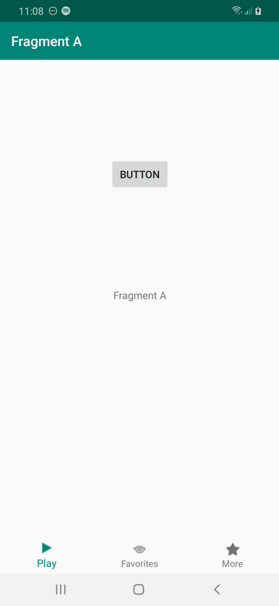
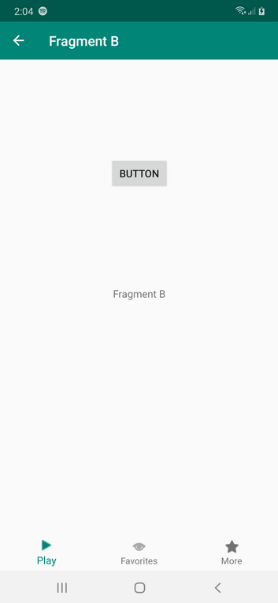
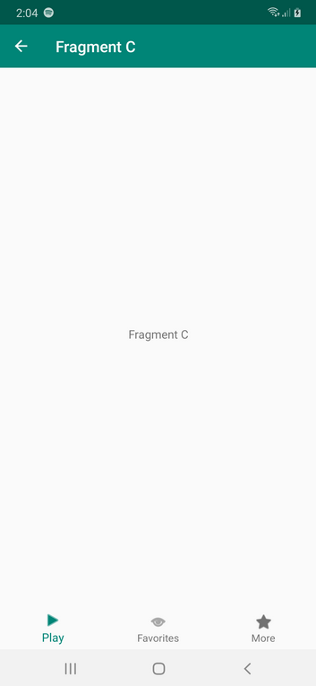
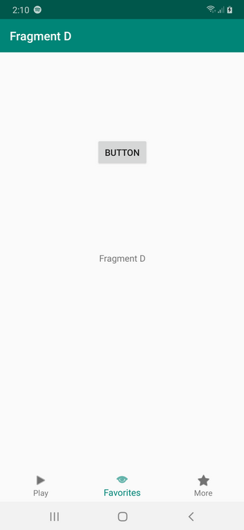
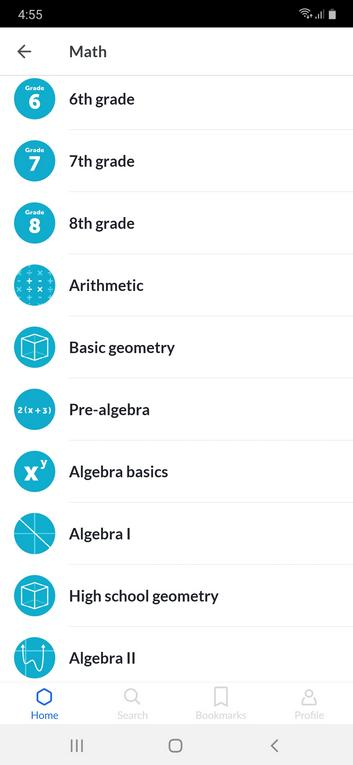
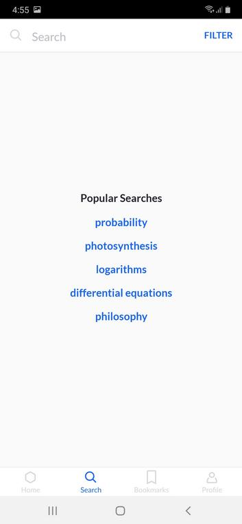

# Bottom Navigation View

Bottom Navigation View is a tab bar but attached to bottom.

<p align="center">

</p>

Create an empty Activity project. Name it HelloBottomNavigationView1.

Edit build.gradle (Module:app).

Add two dependencies to the dependencies.
```gradle
implementation "androidx.navigation:navigation-fragment-ktx:2.0.0"
implementation "androidx.navigation:navigation-ui-ktx:2.0.0"
```
Create a new resource directory, app / res / menu. Create a new menu resource: menu_bottom_nav.xml inside that directory.

```xml
<?xml version="1.0" encoding="utf-8"?>
<menu xmlns:android="http://schemas.android.com/apk/res/android">
    <item android:id="@+id/tab_abc" android:title="@string/play" android:icon="@android:drawable/ic_media_play"/>
    <item android:id="@+id/tab_def" android:title="@string/favorites" android:icon="@android:drawable/ic_menu_view"/>
    <item android:id="@+id/tab_ghi" android:title="@string/more" android:icon="@android:drawable/btn_star"/>
</menu>
```

This menu defines your bottom navigation view. The icon which has value like “@android:drawable/ic_media_play” is using the assets from Android framework. Of couse, you can use the custom one.

Edit app / res / values / styles.xml.

```xml
<resources>

    <!-- Base application theme. -->
    <style name="AppTheme" parent="Theme.AppCompat.Light.DarkActionBar">
        <!-- Customize your theme here. -->
        <item name="colorPrimary">@color/colorPrimary</item>
        <item name="colorPrimaryDark">@color/colorPrimaryDark</item>
        <item name="colorAccent">@color/colorAccent</item>
        <item name="windowActionBar">false</item>
        <item name="windowNoTitle">true</item>
    </style>
    <style name="ToolbarTheme" parent="Theme.AppCompat.Light.DarkActionBar">
        <item name="colorPrimary">@color/colorPrimary</item>
        <item name="colorControlNormal">@color/colorWhite</item>
        <item name="android:textColorPrimary">@color/colorWhite</item>
    </style>

</resources>
```

The ToolbarTheme will be used as a theme for the toolbar.

Edit app / res / values / strings.xml.

```xml
<resources>
    <string name="app_name">HelloBottomNavigationView1</string>
    <string name="play">Play</string>
    <string name="favorites">Favorites</string>
    <string name="more">More</string>
</resources>
```
Edit app / res / values / colors.xml.
```xml
<?xml version="1.0" encoding="utf-8"?>
<resources>
    <color name="colorPrimary">#008577</color>
    <color name="colorPrimaryDark">#00574B</color>
    <color name="colorAccent">#D81B60</color>
    <color name="colorWhite">#FFFFFF</color>
</resources>
```
You need three navigation files.

Create a new resource directory, app / res / navigation.

Create a new navigation file: app / res / navigation / tab_abc.xml.

```xml
<?xml version="1.0" encoding="utf-8"?>
<navigation xmlns:android="http://schemas.android.com/apk/res/android"
            xmlns:app="http://schemas.android.com/apk/res-auto"
            app:startDestination="@id/fragment_a"
            android:id="@+id/tab_abc">
    <fragment
            android:id="@+id/fragment_a"
            android:name="com.example.hellobottomnavigationview1.FragmentA"
            android:label="Fragment A">
        <action
                android:id="@+id/action_a_to_b"
                app:destination="@id/fragment_b" />
    </fragment>
    <fragment
            android:id="@+id/fragment_b"
            android:name="com.example.hellobottomnavigationview1.FragmentB"
            android:label="Fragment B">
        <action
                android:id="@+id/action_b_to_c"
                app:destination="@id/fragment_c" />
    </fragment>
    <fragment
            android:id="@+id/fragment_c"
            android:name="com.example.hellobottomnavigationview1.FragmentC"
            android:label="Fragment C">
    </fragment>
</navigation>
```

This is the navigation file that is used by first tab on Bottom Navigation View. Remember bottom navigation view has three tabs.

Create a new navigation file: app / res / navigation / tab_def.xml.

```xml
<?xml version="1.0" encoding="utf-8"?>
<navigation xmlns:android="http://schemas.android.com/apk/res/android"
            xmlns:app="http://schemas.android.com/apk/res-auto"
            app:startDestination="@id/fragment_d"
            android:id="@+id/tab_def">
    <fragment
            android:id="@+id/fragment_d"
            android:name="com.example.hellobottomnavigationview1.FragmentD"
            android:label="Fragment D">
        <action
                android:id="@+id/action_d_to_e"
                app:destination="@id/fragment_e" />
    </fragment>
    <fragment
            android:id="@+id/fragment_e"
            android:name="com.example.hellobottomnavigationview1.FragmentE"
            android:label="Fragment E">
        <action
                android:id="@+id/action_e_to_f"
                app:destination="@id/fragment_f" />
    </fragment>
    <fragment
            android:id="@+id/fragment_f"
            android:name="com.example.hellobottomnavigationview1.FragmentF"
            android:label="Fragment F">
    </fragment>
</navigation>
```

Create a new navigation file: app / res / navigation / tab_ghi.xml.

```xml
<?xml version="1.0" encoding="utf-8"?>
<navigation xmlns:android="http://schemas.android.com/apk/res/android"
            xmlns:app="http://schemas.android.com/apk/res-auto"
            app:startDestination="@id/fragment_g"
            android:id="@+id/tab_ghi">
    <fragment
            android:id="@+id/fragment_g"
            android:name="com.example.hellobottomnavigationview1.FragmentG"
            android:label="Fragment G">
        <action
                android:id="@+id/action_g_to_h"
                app:destination="@id/fragment_h" />
    </fragment>
    <fragment
            android:id="@+id/fragment_h"
            android:name="com.example.hellobottomnavigationview1.FragmentH"
            android:label="Fragment H">
        <action
                android:id="@+id/action_h_to_i"
                app:destination="@id/fragment_i" />
    </fragment>
    <fragment
            android:id="@+id/fragment_i"
            android:name="com.example.hellobottomnavigationview1.FragmentI"
            android:label="Fragment I">
    </fragment>
</navigation>
```

The id in navigation node must match the id of menu in menu_bottom_nav.xml. For example, the id in tab_ghi.xml file is tab_ghi. There must be menu item which has id tab_ghi in menu for Bottom Navigation View.

Edit app / res / layout / activity_main.xml.

```xml
<?xml version="1.0" encoding="utf-8"?>
<androidx.constraintlayout.widget.ConstraintLayout
        xmlns:android="http://schemas.android.com/apk/res/android"
        xmlns:tools="http://schemas.android.com/tools"
        xmlns:app="http://schemas.android.com/apk/res-auto"
        android:layout_width="match_parent"
        android:layout_height="match_parent"
        tools:context=".MainActivity">
    <androidx.appcompat.widget.Toolbar
            android:id="@+id/toolbar"
            android:layout_width="match_parent"
            android:layout_height="wrap_content"
            android:background="?attr/colorPrimary"
            app:layout_constraintEnd_toEndOf="parent"
            app:layout_constraintStart_toStartOf="parent"
            app:layout_constraintTop_toTopOf="parent"
            app:theme="@style/ToolbarTheme" />
    <FrameLayout
            android:id="@+id/nav_host"
            android:name="androidx.navigation.fragment.NavHostFragment"
            android:layout_width="0dp"
            android:layout_height="0dp"
            app:layout_constraintBottom_toTopOf="@id/bottom_nav"
            app:layout_constraintEnd_toEndOf="parent"
            app:layout_constraintStart_toStartOf="parent"
            app:layout_constraintTop_toBottomOf="@id/toolbar" />
    <com.google.android.material.bottomnavigation.BottomNavigationView
            android:id="@+id/bottom_nav"
            android:layout_height="wrap_content"
            android:layout_width="match_parent"
            app:layout_constraintBottom_toBottomOf="parent"
            app:layout_constraintEnd_toEndOf="parent"
            app:layout_constraintStart_toStartOf="parent"
            app:menu="@menu/menu_bottom_nav" />
</androidx.constraintlayout.widget.ConstraintLayout>
```

You have toolbar, framelayout on which the navigator with bottom navigation view will update its content, and bottom navigation view which is located on the bottom.

Create app / res / layout / fragment_a.xml layout file.

```xml
<?xml version="1.0" encoding="utf-8"?>
<androidx.constraintlayout.widget.ConstraintLayout xmlns:android="http://schemas.android.com/apk/res/android"
                                                   xmlns:app="http://schemas.android.com/apk/res-auto"
                                                   android:layout_width="match_parent"
                                                   android:layout_height="match_parent">
    <TextView
            android:text="Fragment A"
            android:layout_width="wrap_content"
            android:layout_height="wrap_content"
            android:id="@+id/textViewFragmentA" app:layout_constraintTop_toTopOf="parent"
            android:layout_marginBottom="8dp" app:layout_constraintBottom_toBottomOf="parent"
            app:layout_constraintStart_toStartOf="parent" android:layout_marginStart="8dp"
            app:layout_constraintEnd_toEndOf="parent" android:layout_marginEnd="8dp"/>
    <Button
            android:text="Button"
            android:layout_width="wrap_content"
            android:layout_height="wrap_content"
            android:id="@+id/buttonFragmentA" android:layout_marginTop="8dp"
            app:layout_constraintTop_toTopOf="parent" android:layout_marginBottom="8dp"
            app:layout_constraintBottom_toTopOf="@+id/textViewFragmentA" app:layout_constraintEnd_toEndOf="parent"
            android:layout_marginEnd="8dp" app:layout_constraintStart_toStartOf="parent"
            android:layout_marginStart="8dp"/>
</androidx.constraintlayout.widget.ConstraintLayout>
```

Create app / res / layout / fragment_b.xml layout file.

```xml
<?xml version="1.0" encoding="utf-8"?>
<androidx.constraintlayout.widget.ConstraintLayout xmlns:android="http://schemas.android.com/apk/res/android"
                                                   xmlns:app="http://schemas.android.com/apk/res-auto"
                                                   android:layout_width="match_parent"
                                                   android:layout_height="match_parent">
    <TextView
            android:text="Fragment B"
            android:layout_width="wrap_content"
            android:layout_height="wrap_content"
            android:id="@+id/textViewFragmentB"
            app:layout_constraintTop_toTopOf="parent" android:layout_marginBottom="8dp"
            app:layout_constraintBottom_toBottomOf="parent" app:layout_constraintEnd_toEndOf="parent"
            android:layout_marginEnd="8dp" app:layout_constraintStart_toStartOf="parent"
            android:layout_marginStart="8dp"/>
    <Button
            android:text="Button"
            android:layout_width="wrap_content"
            android:layout_height="wrap_content"
            android:id="@+id/buttonFragmentB" android:layout_marginTop="8dp"
            app:layout_constraintTop_toTopOf="parent" android:layout_marginBottom="8dp"
            app:layout_constraintBottom_toTopOf="@+id/textViewFragmentB" app:layout_constraintEnd_toEndOf="parent"
            android:layout_marginEnd="8dp" app:layout_constraintStart_toStartOf="parent"
            android:layout_marginStart="8dp"/>
</androidx.constraintlayout.widget.ConstraintLayout>
```

Create app / res / layout / fragment_c.xml.
```xml
<?xml version="1.0" encoding="utf-8"?>
<androidx.constraintlayout.widget.ConstraintLayout xmlns:android="http://schemas.android.com/apk/res/android"
                                                   xmlns:app="http://schemas.android.com/apk/res-auto"
                                                   android:layout_width="match_parent"
                                                   android:layout_height="match_parent">
    <TextView
            android:text="Fragment C"
            android:layout_width="wrap_content"
            android:layout_height="wrap_content"
            android:id="@+id/textViewFragmentC"
            app:layout_constraintTop_toTopOf="parent" android:layout_marginBottom="8dp"
            app:layout_constraintBottom_toBottomOf="parent" app:layout_constraintStart_toStartOf="parent"
            android:layout_marginStart="8dp" app:layout_constraintEnd_toEndOf="parent" android:layout_marginEnd="8dp"/>
</androidx.constraintlayout.widget.ConstraintLayout>
```
Create fragment_d.xml, fragment_e.xml, and fragment_f.xml which mirror fragment_a.xml, fragment_b.xml, and fragment_c.xml.

Create fragment_g.xml, fragment_h.xml, and fragment_i.xml which mirror fragment_a.xml, fragment_b.xml, and fragment_c.xml.

Download NavigationExtensions.kt from https://github.com/googlesamples/android-architecture-components/blob/master/NavigationAdvancedSample/app/src/main/java/com/example/android/navigationadvancedsample/NavigationExtensions.kt to app / java / com.example.hellobottomnavigationview1 directory.

Edit app / java / com.example.hellobottomnavigationview1 / MainActivity.

```kotlin
package com.example.hellobottomnavigationview1

import android.os.Bundle
import androidx.appcompat.app.AppCompatActivity
import androidx.appcompat.widget.Toolbar
import androidx.lifecycle.LiveData
import androidx.lifecycle.Observer
import androidx.navigation.NavController
import androidx.navigation.ui.setupActionBarWithNavController
import androidx.navigation.ui.setupWithNavController
import com.google.android.material.bottomnavigation.BottomNavigationView


class MainActivity : AppCompatActivity() {

    private var currentNavController: LiveData<NavController>? = null

    override fun onCreate(savedInstanceState: Bundle?) {
        super.onCreate(savedInstanceState)
        setContentView(R.layout.activity_main)
        if (savedInstanceState == null) {
            setupBottomNavigationBar()
        }
    }

    override fun onRestoreInstanceState(savedInstanceState: Bundle?) {
        super.onRestoreInstanceState(savedInstanceState)
        setupBottomNavigationBar()
    }

    private fun setupBottomNavigationBar() {
        val bottomNavigationView = findViewById<BottomNavigationView>(R.id.bottom_nav)
        val navGraphIds = listOf(R.navigation.tab_abc, R.navigation.tab_def, R.navigation.tab_ghi)
        // Setup the bottom navigation view with a list of navigation graphs
        val controller = bottomNavigationView.setupWithNavController(
            navGraphIds = navGraphIds,
            fragmentManager = supportFragmentManager,
            containerId = R.id.nav_host,
            intent = intent
        )
        controller.observe(this, Observer { navController ->
            findViewById<Toolbar>(R.id.toolbar).setupWithNavController(navController)
        })
        currentNavController = controller
    }

    override fun onSupportNavigateUp(): Boolean {
        return currentNavController?.value?.navigateUp() ?: false
    }

    override fun onBackPressed() {
        if (currentNavController?.value?.popBackStack() != true) {
            super.onBackPressed()
        }
    }
}
```

The core method is setupBottomNavigationBar. Inside this method you create a controller from NavigationExtensions.kt file.

Create FragmentA class.

```kotlin
package com.example.hellobottomnavigationview1

import android.os.Bundle
import android.view.LayoutInflater
import android.view.View
import android.view.ViewGroup
import android.widget.Button
import androidx.fragment.app.Fragment
import androidx.navigation.fragment.findNavController


class FragmentA : Fragment() {

    private lateinit var button: Button

    override fun onCreateView(inflater: LayoutInflater, container: ViewGroup?, savedInstanceState: Bundle?): View? {
        val result = inflater.inflate(R.layout.fragment_a, container, false)
        button = result.findViewById(R.id.buttonFragmentA)
        return result
    }

    override fun onViewCreated(view: View, savedInstanceState: Bundle?) {
        super.onViewCreated(view, savedInstanceState)
        button.setOnClickListener {
            findNavController().navigate(R.id.fragment_b)
        }
    }
}
```

Create also FragmentD and FragmentG which also mirror FragmentA.

Create FragmentB class.

```kotlin
package com.example.hellobottomnavigationview1

import android.os.Bundle
import android.view.LayoutInflater
import android.view.View
import android.view.ViewGroup
import android.widget.Button
import androidx.fragment.app.Fragment
import androidx.navigation.fragment.findNavController


class FragmentB : Fragment() {

    private lateinit var button: Button

    override fun onCreateView(inflater: LayoutInflater, container: ViewGroup?, savedInstanceState: Bundle?): View? {
        val result = inflater.inflate(R.layout.fragment_b, container, false)
        button = result.findViewById(R.id.buttonFragmentB)
        return result
    }

    override fun onViewCreated(view: View, savedInstanceState: Bundle?) {
        super.onViewCreated(view, savedInstanceState)
        button.setOnClickListener {
            findNavController().navigate(R.id.fragment_c)
        }
    }
}
```

Create also FragmentE and FragmentH which also mirror FragmentB.

Create FragmentC class.

```kotlin
package com.example.hellobottomnavigationview1

import android.os.Bundle
import android.view.LayoutInflater
import android.view.View
import android.view.ViewGroup
import androidx.fragment.app.Fragment


class FragmentC : Fragment() {

    override fun onCreateView(inflater: LayoutInflater, container: ViewGroup?, savedInstanceState: Bundle?): View? {
        val result = inflater.inflate(R.layout.fragment_c, container, false)
        return result
    }
}
```

Create also FragmentF and FragmentI which also mirror FragmentC.

Tab1

Fragment A → Fragment B → Fragment C

Tab 2

Fragment D → Fragment E → Fragment F

Tab 3

Fragment G → Fragment H → Fragment I

Run the application.

<p align="center">

</p>

Click button. You will be in Fragment B in the first tab.

<p align="center">

</p>

Click button again. You will be in Fragment C.

<p align="center">

</p>

Click second tab. You will be in Fragment D.

<p align="center">

</p>

Each tab maintain its own navigation. If you click back the first tab, you will get Fragment C not Fragment A.

# Optional Readings

https://developer.android.com/guide/navigation/navigation-ui

# Exercises

1. Create bottom view like in Khan Academy app.
<p align="center">


</p>
