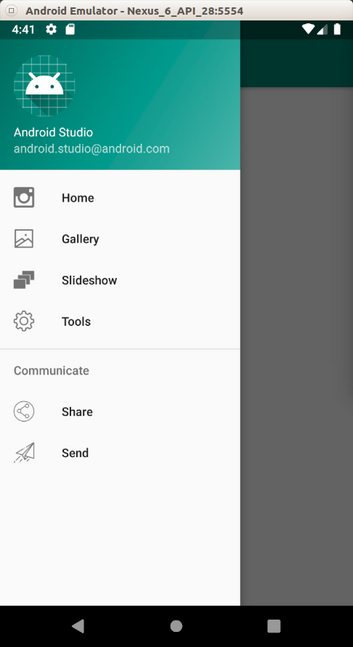

# Drawer

Drawer layout is common in Android application.

Create a new empty Activity application.

Edit build.gradle (Module: app).

Add two dependencies:
```
implementation 'com.google.android.material:material:1.0.0'
implementation 'androidx.fragment:fragment-ktx:1.0.0'
```
Edit app / res / values / styles.xml.

```xml
<resources>
    <!-- Base application theme. -->
    <style name="AppTheme" parent="Theme.AppCompat.Light.DarkActionBar">
        <!-- Customize your theme here. -->
        <item name="colorPrimary">@color/colorPrimary</item>
        <item name="colorPrimaryDark">@color/colorPrimaryDark</item>
        <item name="colorAccent">@color/colorAccent</item>
        <item name="windowActionBar">false</item>
        <item name="windowNoTitle">true</item>
    </style>
    <style name="AppTheme.AppBarOverlay" parent="ThemeOverlay.AppCompat.Dark.ActionBar"/>
    <style name="AppTheme.PopupOverlay" parent="ThemeOverlay.AppCompat.Light"/>
</resources>
```

Edit app / res / values / strings.xml.

```xml
<resources>
    <string name="app_name">HelloDrawer1</string>
    <string name="navigation_drawer_open">Open navigation drawer</string>
    <string name="navigation_drawer_close">Close navigation drawer</string>
    <string name="nav_header_title">Android Studio</string>
    <string name="nav_header_subtitle">android.studio@android.com</string>
    <string name="nav_header_desc">Navigation header</string>
    <string name="action_settings">Settings</string>
    <string name="menu_home">Home</string>
    <string name="menu_gallery">Gallery</string>
    <string name="menu_slideshow">Slideshow</string>
    <string name="menu_tools">Tools</string>
    <string name="menu_share">Share</string>
    <string name="menu_send">Send</string>
</resources>
```

Edit app / res / values / dimens.xml.
```xml
<resources>
    <!-- Default screen margins, per the Android Design guidelines. -->
    <dimen name="activity_horizontal_margin">16dp</dimen>
    <dimen name="activity_vertical_margin">16dp</dimen>
    <dimen name="nav_header_vertical_spacing">8dp</dimen>
    <dimen name="nav_header_height">176dp</dimen>
    <dimen name="fab_margin">16dp</dimen>
</resources>
```

Download 6 icon files. Name them ic_menu_camera.png, ic_menu_gallery.png, ic_menu_manage.png, ic_menu_send.png, ic_menu_share.png, ic_menu_slideshow.png. Drag them to drawable folder in Android studio.

Add a new xml file inside the drawable folder. Name it side_nav_bar.xml file.
```xml
<shape xmlns:android="http://schemas.android.com/apk/res/android"
       android:shape="rectangle">
    <gradient
            android:angle="135"
            android:centerColor="#009688"
            android:endColor="#00695C"
            android:startColor="#4DB6AC"
            android:type="linear"/>
</shape>
```
You can create a circle, a rectangle with xml file. This rectangle has gradient background.

Create a new resource folder named app / res / menu. Create new resource file, named activity_main_drawer.xml inside that menu directory.

```xml
<?xml version="1.0" encoding="utf-8"?>
<menu xmlns:android="http://schemas.android.com/apk/res/android"
      xmlns:tools="http://schemas.android.com/tools"
      tools:showIn="navigation_view">

    <group android:checkableBehavior="single">
        <item
                android:id="@+id/nav_home"
                android:icon="@drawable/ic_menu_camera"
                android:title="@string/menu_home"/>
        <item
                android:id="@+id/nav_gallery"
                android:icon="@drawable/ic_menu_gallery"
                android:title="@string/menu_gallery"/>
        <item
                android:id="@+id/nav_slideshow"
                android:icon="@drawable/ic_menu_slideshow"
                android:title="@string/menu_slideshow"/>
        <item
                android:id="@+id/nav_tools"
                android:icon="@drawable/ic_menu_manage"
                android:title="@string/menu_tools"/>
    </group>

    <item android:title="Communicate">
        <menu>
            <item
                    android:id="@+id/nav_share"
                    android:icon="@drawable/ic_menu_share"
                    android:title="@string/menu_share"/>
            <item
                    android:id="@+id/nav_send"
                    android:icon="@drawable/ic_menu_send"
                    android:title="@string/menu_send"/>
        </menu>
    </item>
</menu>
```

There are two sections of menu in drawer:
```xml
<group android:checkableBehavior="single">
```
and
```xml
<item android:title="Communicate">
```
The first section has 4 items. The second section has 2 items. All 6 items can be clicked. But only 4 items from the first section are checkable (there is indication that this item has been chosen).

Edit app / res / layout / nav_header_main.xml.

```xml
<?xml version="1.0" encoding="utf-8"?>
<LinearLayout
        xmlns:android="http://schemas.android.com/apk/res/android"
        xmlns:app="http://schemas.android.com/apk/res-auto"
        android:layout_width="match_parent"
        android:layout_height="@dimen/nav_header_height"
        android:background="@drawable/side_nav_bar"
        android:paddingBottom="@dimen/activity_vertical_margin"
        android:paddingLeft="@dimen/activity_horizontal_margin"
        android:paddingRight="@dimen/activity_horizontal_margin"
        android:paddingTop="@dimen/activity_vertical_margin"
        android:theme="@style/ThemeOverlay.AppCompat.Dark"
        android:orientation="vertical"
        android:gravity="bottom">
    <ImageView
            android:layout_width="wrap_content"
            android:layout_height="wrap_content"
            android:paddingTop="@dimen/nav_header_vertical_spacing"
            app:srcCompat="@mipmap/ic_launcher_round"
            android:contentDescription="@string/nav_header_desc"
            android:id="@+id/imageView"/>
    <TextView
            android:layout_width="match_parent"
            android:layout_height="wrap_content"
            android:paddingTop="@dimen/nav_header_vertical_spacing"
            android:text="@string/nav_header_title"
            android:textAppearance="@style/TextAppearance.AppCompat.Body1"/>
    <TextView
            android:layout_width="wrap_content"
            android:layout_height="wrap_content"
            android:text="@string/nav_header_subtitle"
            android:id="@+id/textView"/>
</LinearLayout>
```

This is the layout of the header of the drawer. It is optional.

Edit app / res / layout / content_main.xml.

```xml
<?xml version="1.0" encoding="utf-8"?>
<androidx.constraintlayout.widget.ConstraintLayout
        xmlns:android="http://schemas.android.com/apk/res/android"
        xmlns:tools="http://schemas.android.com/tools"
        xmlns:app="http://schemas.android.com/apk/res-auto"
        android:layout_width="match_parent"
        android:layout_height="match_parent"
        app:layout_behavior="@string/appbar_scrolling_view_behavior"
        tools:showIn="@layout/app_bar_main"
        tools:context=".MainActivity">

    <TextView
            android:id="@+id/textView"
            android:layout_width="wrap_content"
            android:layout_height="wrap_content"
            android:text="Hello World!"
            app:layout_constraintBottom_toBottomOf="parent"
            app:layout_constraintLeft_toLeftOf="parent"
            app:layout_constraintRight_toRightOf="parent"
            app:layout_constraintTop_toTopOf="parent"/>

</androidx.constraintlayout.widget.ConstraintLayout>
```

This is the layout of the main content on Android application. Each menu in drawer will launch a different fragment but all of them are using this layout.

Edit app / res / layout / app_bar_main.xml.

```xml
<?xml version="1.0" encoding="utf-8"?>
<androidx.coordinatorlayout.widget.CoordinatorLayout
        xmlns:android="http://schemas.android.com/apk/res/android"
        xmlns:app="http://schemas.android.com/apk/res-auto"
        xmlns:tools="http://schemas.android.com/tools"
        android:layout_width="match_parent"
        android:layout_height="match_parent"
        tools:context=".MainActivity">

    <com.google.android.material.appbar.AppBarLayout
            android:layout_height="wrap_content"
            android:layout_width="match_parent"
            android:theme="@style/AppTheme.AppBarOverlay">
        <androidx.appcompat.widget.Toolbar
                android:id="@+id/toolbar"
                android:layout_width="match_parent"
                android:layout_height="?attr/actionBarSize"
                android:background="?attr/colorPrimary"
                app:popupTheme="@style/AppTheme.PopupOverlay"/>
    </com.google.android.material.appbar.AppBarLayout>

    <!-- <include layout="@layout/content_main"/> -->
    <FrameLayout android:id="@+id/fragmentDrawer"
                 android:layout_width="match_parent"
                 android:layout_height="match_parent" />
</androidx.coordinatorlayout.widget.CoordinatorLayout>
```

This is the layout which hosts your main content. It just has additional toolbar.

Edit app / res / layout / activity_main.xml.

```xml
<?xml version="1.0" encoding="utf-8"?>
<androidx.drawerlayout.widget.DrawerLayout
        xmlns:android="http://schemas.android.com/apk/res/android"
        xmlns:app="http://schemas.android.com/apk/res-auto"
        xmlns:tools="http://schemas.android.com/tools"
        android:id="@+id/drawer_layout"
        android:layout_width="match_parent"
        android:layout_height="match_parent"
        android:fitsSystemWindows="true"
        tools:openDrawer="start">

    <include
            layout="@layout/app_bar_main"
            android:layout_width="match_parent"
            android:layout_height="match_parent"/>
    <com.google.android.material.navigation.NavigationView
            android:id="@+id/nav_view"
            android:layout_width="wrap_content"
            android:layout_height="match_parent"
            android:layout_gravity="start"
            android:fitsSystemWindows="true"
            app:headerLayout="@layout/nav_header_main"
            app:menu="@menu/activity_main_drawer"/>

</androidx.drawerlayout.widget.DrawerLayout>
```

This is the outer layout which is the drawer layout. The navigation view is the drawer itself. So the drawer layout is composed of our content layout (with its toolbar) and navigation view (the drawer that can be hidden to the left).

Create a package named ‘fragments’ inside app / java / com.example.hellodrawer1. Create HomeFragment class inside this folder.

```kotlin
package com.example.hellodrawer1.fragments

import android.os.Bundle
import android.view.LayoutInflater
import android.view.View
import android.view.ViewGroup
import android.widget.TextView
import androidx.fragment.app.Fragment
import com.example.hellodrawer1.R


class HomeFragment : Fragment() {

    override fun onCreateView(inflater: LayoutInflater, container: ViewGroup?, savedInstanceState: Bundle?): View? {
        return inflater.inflate(R.layout.content_main, container, false)
    }

    override fun onViewCreated(view: View, savedInstanceState: Bundle?) {
        super.onViewCreated(view, savedInstanceState)

        view.findViewById<TextView>(R.id.textView).text = resources.getText(R.string.menu_home)
    }
}
```

Create GalleryFragment, SendFragment, ShareFragment, SlideshowFragment, ToolsFragment which are similar to HomeFragment. Make sure the string (R.string.menu_home) is changed accordingly.

Lastly, edit app / java / com.example.hellodrawer1 / MainActivity.

```kotlin
package com.example.hellodrawer1

import android.os.Bundle
import androidx.core.view.GravityCompat
import androidx.appcompat.app.ActionBarDrawerToggle
import android.view.MenuItem
import androidx.drawerlayout.widget.DrawerLayout
import com.google.android.material.navigation.NavigationView
import androidx.appcompat.app.AppCompatActivity
import androidx.appcompat.widget.Toolbar
import androidx.fragment.app.transaction
import com.example.hellodrawer1.fragments.*


class MainActivity : AppCompatActivity(), NavigationView.OnNavigationItemSelectedListener {

    override fun onCreate(savedInstanceState: Bundle?) {
        super.onCreate(savedInstanceState)
        setContentView(R.layout.activity_main)

        val toolbar: Toolbar = findViewById(R.id.toolbar)
        setSupportActionBar(toolbar)

        val drawerLayout: DrawerLayout = findViewById(R.id.drawer_layout)
        val navView: NavigationView = findViewById(R.id.nav_view)
        val toggle = ActionBarDrawerToggle(
            this, drawerLayout, toolbar, R.string.navigation_drawer_open, R.string.navigation_drawer_close
        )
        drawerLayout.addDrawerListener(toggle)
        toggle.syncState()

        navView.setNavigationItemSelectedListener(this)
    }

    override fun onNavigationItemSelected(item: MenuItem): Boolean {
        // Handle navigation view item clicks here.
        when (item.itemId) {
            R.id.nav_home -> {
                supportFragmentManager.transaction {
                    replace(R.id.fragmentDrawer, HomeFragment())
                }
            }
            R.id.nav_gallery -> {
                supportFragmentManager.transaction {
                    replace(R.id.fragmentDrawer, GalleryFragment())
                }
            }
            R.id.nav_slideshow -> {
                supportFragmentManager.transaction {
                    replace(R.id.fragmentDrawer, SlideshowFragment())
                }
            }
            R.id.nav_tools -> {
                supportFragmentManager.transaction {
                    replace(R.id.fragmentDrawer, ToolsFragment())
                }
            }
            R.id.nav_share -> {
                supportFragmentManager.transaction {
                    replace(R.id.fragmentDrawer, ShareFragment())
                }
            }
            R.id.nav_send -> {
                supportFragmentManager.transaction {
                    replace(R.id.fragmentDrawer, SendFragment())
                }
            }
        }
        val drawerLayout: DrawerLayout = findViewById(R.id.drawer_layout)
        drawerLayout.closeDrawer(GravityCompat.START)
        return true
    }
}
```

There are two methods, onCreate and onNavigationItemSelected.

onNavigationItemSelected is the callback method when you click menu item in drawer.

If you click one of the menu items, it will replace the fragment in frame layout with a specific fragment.
```kotlin
supportFragmentManager.transaction {
    replace(R.id.fragmentDrawer, SlideshowFragment())
}
```

Then you close the drawer.
```kotlin
val drawerLayout: DrawerLayout = findViewById(R.id.drawer_layout)
drawerLayout.closeDrawer(GravityCompat.START)
```
In onCreate method, you need to setup a lot of things.

You need to setup toolbar.

```kotlin
val toolbar: Toolbar = findViewById(R.id.toolbar)
setSupportActionBar(toolbar)
```
You need to setup the drawer so you can have a burger menu on the toolbar.
```kotlin
val drawerLayout: DrawerLayout = findViewById(R.id.drawer_layout)
val navView: NavigationView = findViewById(R.id.nav_view)
val toggle = ActionBarDrawerToggle(
    this, drawerLayout, toolbar, R.string.navigation_drawer_open, R.string.navigation_drawer_close
)
drawerLayout.addDrawerListener(toggle)
toggle.syncState()
```
Then you need to attach the listener to the drawer.
```kotlin
navView.setNavigationItemSelectedListener(this)
```
You also need to make sure MainActivity implements NavigationView.OnNavigationItemSelectedListener.
```kotlin
class MainActivity : AppCompatActivity(), NavigationView.OnNavigationItemSelectedListener {
```
Run the application and you will get empty screen with the burger menu.

<p align="center">

</p>

Click the burger menu.

<p align="center">

</p>

Click Gallery menu.

<p align="center">

</p>

Click the burger menu again. This time, the menu item is checked (green tint color).

<p align="center">

</p>

# Optional Readings

https://developer.android.com/guide/navigation/navigation-ui

# Exercises

1. Create a drawer like Moon+ Reader has. The drawer has bottom navigation view.

<p align="center">

</p>