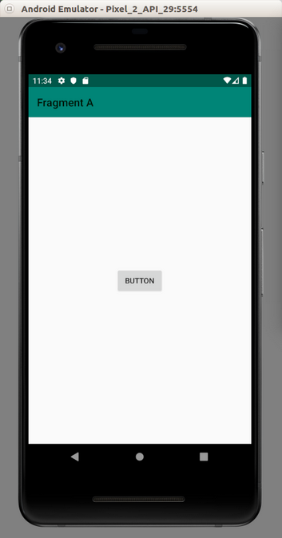
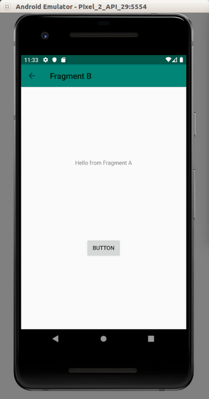
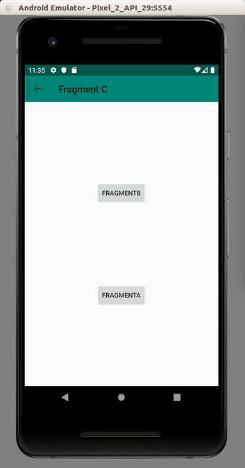

# Navigation

This is the new way to navigate. The previous way is to use Activity and FragmentTransaction.

Create an empty Activity project.

Edit build.gradle (Project: HelloNavigation1)

Add this line:
```gradle
classpath "androidx.navigation:navigation-safe-args-gradle-plugin:2.0.0"
```
Edit build.gradle (Module:app)

Add this line:
```gradle
apply plugin: 'androidx.navigation.safeargs.kotlin'
```
Add two dependencies.

```gradle
implementation "androidx.navigation:navigation-fragment-ktx:2.0.0"
implementation "androidx.navigation:navigation-ui-ktx:2.0.0"
```
You must create a new resource directory, named navigation. Create app / res / navigation / main_nav_graph.xml.

```xml
<?xml version="1.0" encoding="utf-8"?>
<navigation xmlns:android="http://schemas.android.com/apk/res/android"
            xmlns:app="http://schemas.android.com/apk/res-auto"
            android:id="@+id/main_nav_graph.xml"
            app:startDestination="@id/fragment_a">
    <fragment
            android:id="@+id/fragment_a"
            android:name="com.example.hellonavigation1.FragmentA"
            android:label="Fragment A">
        <action
                android:id="@+id/goToFragmentB"
                app:destination="@id/fragment_b"/>
    </fragment>
    <fragment
            android:id="@+id/fragment_b"
            android:name="com.example.hellonavigation1.FragmentB"
            android:label="Fragment B">
        <argument
                android:name="parameterFromFragmentA"
                app:argType="string"/>
        <action
                android:id="@+id/goToFragmentC"
                app:destination="@id/fragment_c"/>
    </fragment>
    <fragment
            android:id="@+id/fragment_c"
            android:name="com.example.hellonavigation1.FragmentC"
            android:label="Fragment C">
        <argument
                android:name="parameterFromFragmentB"
                app:argType="integer"/>
        <action
                android:id="@+id/goBackToFragmentA"
                app:destination="@id/fragment_a"
                app:popUpTo="@id/fragment_a"
                app:popUpToInclusive="true"/>
    </fragment>
</navigation>
```

This is our roadmap in Android application. The entry is defined in app:startDestination attribute which has the value “@id/fragment_a”.

The fragment which has id fragment_a is defined inside navigation node.

```xml
<fragment
            android:id="@+id/fragment_a"
            android:name="com.example.hellonavigation1.FragmentA"
            android:label="Fragment A">
        <action
                android:id="@+id/goToFragmentB"
                app:destination="@id/fragment_b"/>
</fragment>
```
The android:name points to the fragment class of this fragment node. The android:label points to the  title on the toolbar of the application.

Inside the fragment, there is an action node. It has app:destination which has the value “”@id/fragment_b”. This tells there is a way from fragment_a fragment to go to fragment_b fragment.

Inside the fragment_b fragment, there is an argument node which defines the parameter that the fragment_b fragment receives from the parent fragment.

Action node can also has other attributes like app:popUpTo. This is like popping up the fragments to go to earlier parent.

So you have three fragments. Let’s create three new layout resources for each of these three fragments.

Let’s create app / res / layout / fragment_a.xml.

```xml
<?xml version="1.0" encoding="utf-8"?>
<androidx.constraintlayout.widget.ConstraintLayout xmlns:android="http://schemas.android.com/apk/res/android"
                                                   xmlns:app="http://schemas.android.com/apk/res-auto"
                                                   android:id="@+id/fragment_a"
                                                   android:layout_width="match_parent"
                                                   android:layout_height="match_parent">
    <Button
            android:text="Button"
            android:layout_width="wrap_content"
            android:layout_height="wrap_content"
            android:id="@+id/button_fragment_a" android:layout_marginTop="8dp"
            app:layout_constraintTop_toTopOf="parent" android:layout_marginBottom="8dp"
            app:layout_constraintBottom_toBottomOf="parent" app:layout_constraintEnd_toEndOf="parent"
            android:layout_marginEnd="8dp" app:layout_constraintStart_toStartOf="parent"
            android:layout_marginStart="8dp"/>
</androidx.constraintlayout.widget.ConstraintLayout>
```
This fragment only consists of one button.

Let’s create app / res / layout / fragment_b.xml.
```xml
<?xml version="1.0" encoding="utf-8"?>
<androidx.constraintlayout.widget.ConstraintLayout xmlns:android="http://schemas.android.com/apk/res/android"
                                                   xmlns:app="http://schemas.android.com/apk/res-auto"
                                                   android:id="@+id/fragment_b"
                                                   android:layout_width="match_parent"
                                                   android:layout_height="match_parent">
    <TextView
            android:text="TextView"
            android:layout_width="wrap_content"
            android:layout_height="wrap_content"
            android:id="@+id/textView_fragment_b" app:layout_constraintTop_toTopOf="parent"
            app:layout_constraintBottom_toTopOf="@+id/button_fragment_b" app:layout_constraintStart_toStartOf="parent"
            android:layout_marginStart="8dp" app:layout_constraintEnd_toEndOf="parent" android:layout_marginEnd="8dp"/>
    <Button
            android:text="Button"
            android:layout_width="wrap_content"
            android:layout_height="wrap_content"
            android:id="@+id/button_fragment_b"
            app:layout_constraintBottom_toBottomOf="parent" app:layout_constraintTop_toBottomOf="@+id/textView_fragment_b"
            app:layout_constraintStart_toStartOf="parent" android:layout_marginStart="8dp"
            app:layout_constraintEnd_toEndOf="parent" android:layout_marginEnd="8dp"/>
</androidx.constraintlayout.widget.ConstraintLayout>
```

This fragment consists of one button and one text view.

Let’s create fragment_c.xml.

```xml
<?xml version="1.0" encoding="utf-8"?>
<androidx.constraintlayout.widget.ConstraintLayout xmlns:android="http://schemas.android.com/apk/res/android"
                                                   xmlns:app="http://schemas.android.com/apk/res-auto"
                                                   android:layout_width="match_parent"
                                                   android:id="@+id/fragment_c"
                                                   android:layout_height="match_parent">
    <Button
            android:text="FragmentA"
            android:layout_width="wrap_content"
            android:layout_height="wrap_content"
            android:id="@+id/button_fragment_c_go_back_to_fragment_a"
            app:layout_constraintEnd_toEndOf="parent"
            android:layout_marginEnd="8dp" app:layout_constraintStart_toStartOf="parent"
            android:layout_marginStart="8dp" app:layout_constraintHorizontal_bias="0.5"
            app:layout_constraintBottom_toBottomOf="parent"
            app:layout_constraintTop_toBottomOf="@+id/button_fragment_c_go_back_to_fragment_b"/>
    <Button
            android:text="FragmentB"
            android:layout_width="wrap_content"
            android:layout_height="wrap_content"
            android:id="@+id/button_fragment_c_go_back_to_fragment_b" app:layout_constraintEnd_toEndOf="parent" android:layout_marginEnd="8dp"
            app:layout_constraintStart_toStartOf="parent" android:layout_marginStart="8dp"
            app:layout_constraintTop_toTopOf="parent" app:layout_constraintHorizontal_bias="0.5"
            app:layout_constraintBottom_toTopOf="@+id/button_fragment_c_go_back_to_fragment_a"/>
</androidx.constraintlayout.widget.ConstraintLayout>
```

This fragment consists of two buttons.

Lastly edit app / res / layout / activity_main.xml.

```xml
<?xml version="1.0" encoding="utf-8"?>
<androidx.constraintlayout.widget.ConstraintLayout
        xmlns:android="http://schemas.android.com/apk/res/android"
        xmlns:tools="http://schemas.android.com/tools"
        xmlns:app="http://schemas.android.com/apk/res-auto"
        android:layout_width="match_parent"
        android:layout_height="match_parent"
        tools:context=".MainActivity">
    <androidx.appcompat.widget.Toolbar
            android:id="@+id/toolbar"
            android:layout_width="match_parent"
            android:layout_height="wrap_content"
            android:background="?attr/colorPrimary"
            app:layout_constraintEnd_toEndOf="parent"
            app:layout_constraintStart_toStartOf="parent"
            app:layout_constraintTop_toTopOf="parent"
            app:theme="?attr/actionBarPopupTheme" />
    <fragment
            android:id="@+id/nav_host"
            android:name="androidx.navigation.fragment.NavHostFragment"
            android:layout_width="0dp"
            android:layout_height="0dp"
            app:defaultNavHost="true"
            app:layout_constraintBottom_toBottomOf="parent"
            app:layout_constraintEnd_toEndOf="parent"
            app:layout_constraintStart_toStartOf="parent"
            app:layout_constraintTop_toBottomOf="@id/toolbar"
            app:navGraph="@navigation/main_nav_graph" />
</androidx.constraintlayout.widget.ConstraintLayout>
```

The most important thing is fragment node. The android:name property’s value is “androidx.navigation.fragment.NavHostFragment”.

The content inside this fragment will be changed by navigator. The toolbar stays the same.

Let’s create app / java / com.example.hellonavigation1 / FragmentA class.

```kotlin
package com.example.hellonavigation1

import android.os.Bundle
import android.view.LayoutInflater
import android.view.View
import android.view.ViewGroup
import android.widget.Button
import androidx.fragment.app.Fragment
import androidx.navigation.fragment.findNavController


class FragmentA : Fragment() {

    private lateinit var button: Button

    override fun onCreateView(inflater: LayoutInflater, container: ViewGroup?, savedInstanceState: Bundle?): View? {
        val result = inflater.inflate(R.layout.fragment_a, container, false)
        button = result.findViewById(R.id.button_fragment_a)
        return result
    }

    override fun onViewCreated(view: View, savedInstanceState: Bundle?) {
        super.onViewCreated(view, savedInstanceState)
        button.setOnClickListener {
            findNavController().navigate(FragmentADirections.goToFragmentB("Hello from Fragment A"))
        }
    }
}
```

The most important thing to notice is this line:
```kotlin
findNavController().navigate(FragmentADirections.goToFragmentB("Hello from Fragment A"))
```
FragmentADirections is generated class (by Navigator). It is a class to represent the action node in fragment_a fragment node. GoToFragmentB comes from the attribute in the action node.

Let’s create app / java / com.example.hellonavigation1 / FragmentB.

```kotlin
package com.example.hellonavigation1

import android.os.Bundle
import android.view.LayoutInflater
import android.view.View
import android.view.ViewGroup
import android.widget.Button
import android.widget.TextView
import androidx.fragment.app.Fragment
import androidx.navigation.fragment.findNavController


class FragmentB : Fragment() {

    private lateinit var button: Button
    private lateinit var textView: TextView

    override fun onCreateView(inflater: LayoutInflater, container: ViewGroup?, savedInstanceState: Bundle?): View? {
        val result = inflater.inflate(R.layout.fragment_b, container, false)
        button = result.findViewById(R.id.button_fragment_b)
        textView = result.findViewById(R.id.textView_fragment_b)
        return result
    }

    override fun onViewCreated(view: View, savedInstanceState: Bundle?) {
        super.onViewCreated(view, savedInstanceState)
        textView.text = FragmentBArgs.fromBundle(arguments!!).parameterFromFragmentA
        button.setOnClickListener {
            findNavController().navigate(FragmentBDirections.goToFragmentC(3))
        }
    }
}
```

Notice this line:
```kotlin
textView.text = FragmentBArgs.fromBundle(arguments!!).parameterFromFragmentA
```
This is how you get the parameters from the parent fragment. ParameterFromFragmentA itself is defined in fragment_b fragment node in main_nav_graph.xml file.

Let’s create FragmentC class.

```kotlin
package com.example.hellonavigation1

import android.os.Bundle
import android.util.Log
import android.view.LayoutInflater
import android.view.View
import android.view.ViewGroup
import android.widget.Button
import androidx.fragment.app.Fragment
import androidx.navigation.fragment.findNavController


class FragmentC : Fragment() {

    private lateinit var button_go_to_fragment_b: Button
    private lateinit var button_go_to_fragment_a: Button

    override fun onCreateView(inflater: LayoutInflater, container: ViewGroup?, savedInstanceState: Bundle?): View? {
        val result = inflater.inflate(R.layout.fragment_c, container, false)
        button_go_to_fragment_a = result.findViewById(R.id.button_fragment_c_go_back_to_fragment_a)
        button_go_to_fragment_b = result.findViewById(R.id.button_fragment_c_go_back_to_fragment_b)
        return result
    }

    override fun onViewCreated(view: View, savedInstanceState: Bundle?) {
        super.onViewCreated(view, savedInstanceState)
        Log.d("button", FragmentCArgs.fromBundle(arguments!!).parameterFromFragmentB.toString())
        button_go_to_fragment_a.setOnClickListener {
            findNavController().navigate(FragmentCDirections.goBackToFragmentA())
        }
        button_go_to_fragment_b.setOnClickListener{
            findNavController().popBackStack()
        }
    }
}
```

Notice this line:
```kotlin
findNavController().popBackStack()
```
This is to go back to immediate parent fragment.

To go back to root parent, you do this:
```kotlin
findNavController().navigate(FragmentCDirections.goBackToFragmentA())
```
Edit app / java / com.example.hellonavigation1 / MainActivity class.

```kotlin
package com.example.hellonavigation1

import androidx.appcompat.app.AppCompatActivity
import android.os.Bundle
import androidx.appcompat.widget.Toolbar
import androidx.navigation.findNavController
import androidx.navigation.ui.AppBarConfiguration
import androidx.navigation.ui.setupWithNavController


class MainActivity : AppCompatActivity() {

    override fun onCreate(savedInstanceState: Bundle?) {
        super.onCreate(savedInstanceState)
        setContentView(R.layout.activity_main)

        findNavController(R.id.nav_host).let { nav ->
            findViewById<Toolbar>(R.id.toolbar).setupWithNavController(nav, AppBarConfiguration(nav.graph))
        }
    }

}
```

Take notice of these lines:
```kotlin
findNavController(R.id.nav_host).let { nav ->
    findViewById<Toolbar>(R.id.toolbar).setupWithNavController(nav, AppBarConfiguration(nav.graph))
}
```

That is to setup the toolbar. So the toolbar can have back arrow if you are in certain fragment.

Run the application.

<p align="center">

</p>

Click the button. You’ll be redirected to the second fragment.

<p align="center">

</p>

Click the button again to launch fragment c.

<p align="center">

</p>

This is the fragment C. You can go back to fragment B or fragment C.

Notice the toolbar. There is a back arrow button.

All of these navigations are made possible using Navigation. You don’t have to add fragment manually anymore.

# Optional Readings

https://developer.android.com/guide/navigation/

https://developer.android.com/reference/kotlin/androidx/navigation/Navigator?hl=en

# Exercises

1. Rewrite application of Fragment and Activity with Navigation component.