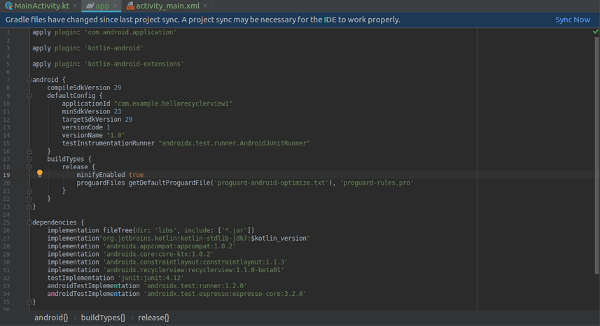
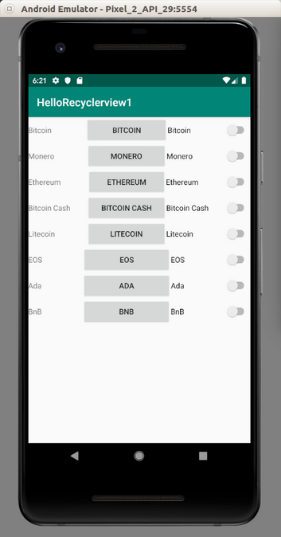
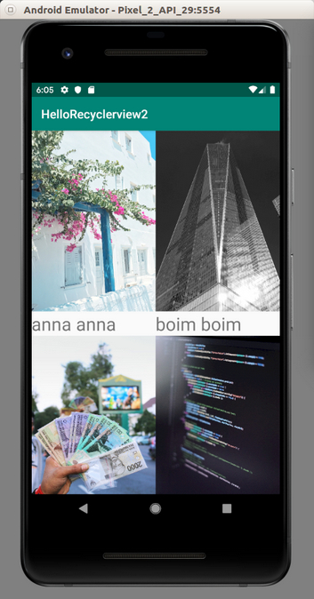
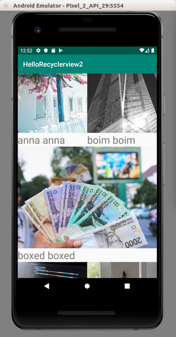
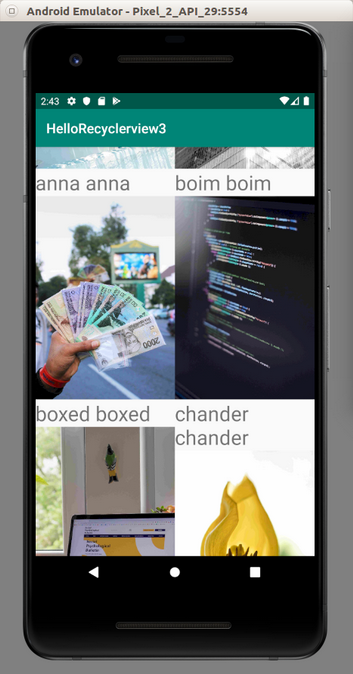
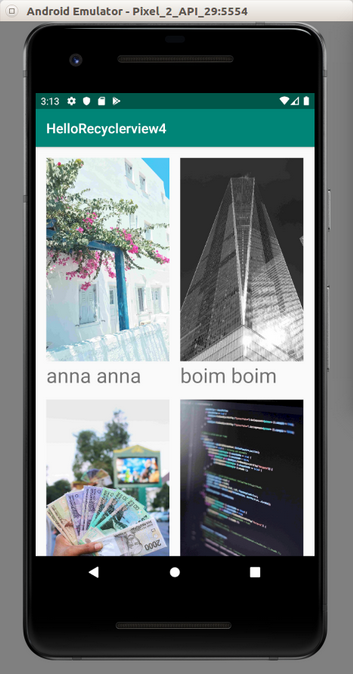
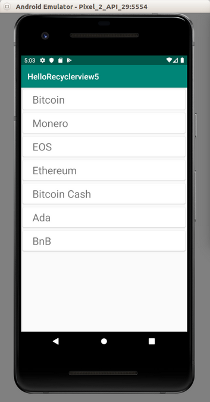

# RecyclerView

To create a list view or a grid view, it is not recommended to use ListView or GridView. You should use RecyclerView. RecyclerView uses adapter and view holder. Adapter deals with the source of data. View holder deals with the view on the row.

Create a new project.

RecyclerView is not installed by default. You have to install it manually. Open build.gradle (Module:app).

Add this line in dependencies block:
```
implementation 'androidx.recyclerview:recyclerview:1.1.0-beta01'
```
When you change the content of build.gradle, you will be asked to resync.

<p align="center">

</p>

Then edit activity_main.xml file.
```xml
<?xml version="1.0" encoding="utf-8"?>
<androidx.recyclerview.widget.RecyclerView
        xmlns:android="http://schemas.android.com/apk/res/android"
        android:id="@+id/recyclerView"
        android:layout_width="match_parent"
        android:layout_height="match_parent"/>
```
In previous cases, you used built-in layout for a row. Now you are going to use custom row’s layout. Create new layout resource. Name it crypto_row.xml.
```xml
<?xml version="1.0" encoding="utf-8"?>
<LinearLayout xmlns:android="http://schemas.android.com/apk/res/android"
              android:id="@+id/cryptoRow"
              android:orientation="horizontal"
              android:layout_width="match_parent"
              android:layout_height="wrap_content">
    <TextView
            android:text="TextView"
            android:layout_width="wrap_content"
            android:layout_height="wrap_content" android:id="@+id/textView" android:layout_weight="1"/>
    <Button
            android:text="Button"
            android:layout_width="wrap_content"
            android:layout_height="wrap_content" android:id="@+id/button" android:layout_weight="1"/>
    <Switch
            android:text="Switch"
            android:layout_width="wrap_content"
            android:layout_height="wrap_content" android:id="@+id/switch1" android:layout_weight="1"/>
</LinearLayout>
```

This is a horizontal layout which has a text view on the left, a button on the center, a switch on the right.

### ViewHolder

Let’s create a viewholder for this row’s layout. Create a new class inside app – java – com.example.hellorecyclerview1. Name it CryptoViewHolder.

```kotlin
package com.example.hellorecyclerview1

import android.view.View
import android.widget.Button
import android.widget.TextView
import androidx.recyclerview.widget.RecyclerView


class CryptoViewHolder(private val view : View) : RecyclerView.ViewHolder(view) {

    private val textView : TextView = this.view.findViewById(R.id.textView)
    private val button : Button = this.view.findViewById(R.id.button)
    private val switch : Button = this.view.findViewById(R.id.switch1)

    fun bindModel(item : String) {
        this.textView.text = item
        this.button.text = item
        this.switch.text = item
    }
}
```

The view of View is a linear layout of row. Item of String is a data from adapter.

In bindModel (this is a custom method, you can name it differently), you set the text on the text view, the button, and the switch.

### Adapter

Let’s create an adapter for this recyclerview. Create a new class inside app – java – com.example.recycleview. Name it CryptoAdapter.

```kotlin
package com.example.hellorecyclerview1

import android.view.LayoutInflater
import android.view.ViewGroup
import androidx.recyclerview.widget.RecyclerView


class CryptoAdapter(private val cryptoDataset: Array<String>) : RecyclerView.Adapter<CryptoViewHolder>() {

    override fun onCreateViewHolder(parent: ViewGroup, viewType: Int) : CryptoViewHolder {
        val linearLayout = LayoutInflater.from(parent.context).inflate(R.layout.crypto_row, parent, false)
        return CryptoViewHolder(linearLayout)
    }

    override fun onBindViewHolder(holder: CryptoViewHolder, position: Int) {
        holder.bindModel(cryptoDataset[position])
    }

    override fun getItemCount() = cryptoDataset.size
}
```

You have to define three methods in the adapter. The first one is onCreateViewHolder, on which you get the layout of the row and initialize your view holder (CryptoViewHolder) with the row’s layout. The second one is onBindViewHolder, on which you bind the data for a row in a specific position. It uses bindModel (our custom method in view holder). The last one is getItemCount which defines how many items you have in this list. In this adapter, your data is just an array of strings.

### MainActivity

Edit app / java / com.example.hellorecyclerview1 / MainActivity.
```kotlin
package com.example.hellorecyclerview1

import androidx.appcompat.app.AppCompatActivity
import android.os.Bundle
import androidx.recyclerview.widget.LinearLayoutManager
import androidx.recyclerview.widget.RecyclerView


class MainActivity : AppCompatActivity() {
    private lateinit var recyclerView: RecyclerView
    private lateinit var viewAdapter: RecyclerView.Adapter<*>
    private lateinit var viewManager: RecyclerView.LayoutManager
    val cryptocurrencies = arrayOf("Bitcoin", "Monero", "Ethereum", "Bitcoin Cash", "Litecoin", "EOS", "Ada", "BnB")

    override fun onCreate(savedInstanceState: Bundle?) {
        super.onCreate(savedInstanceState)
        setContentView(R.layout.activity_main)
        viewManager = LinearLayoutManager(this)
        viewAdapter = CryptoAdapter(cryptocurrencies)
        recyclerView = findViewById<RecyclerView>(R.id.recyclerView).apply {
            setHasFixedSize(true)
            layoutManager = viewManager
            adapter = viewAdapter
        }
    }
}
```

To combine them together, you need to create LayoutManager (you are using LinearLayoutManager, but there are other layout managers). Then you need to create the adapter.

Then get the recyclersview from the layout resource. Set its layout  manager to the linear layout manager. Set the adapter.
Run the application and you will get this application.

<p align="center">

</p>

### Clicking Event

To add clicking event, you implement View.OnClickListener in the view holder. Then you call onClickListener method of the row’s layout view. Finally you implement onClick method in the view holder’s class.
```kotlin
package com.example.hellorecyclerview1

import android.util.Log
import android.view.View
import android.widget.Button
import android.widget.TextView
import androidx.recyclerview.widget.RecyclerView


class CryptoViewHolder(private val view : View) : RecyclerView.ViewHolder(view), View.OnClickListener {

    private val textView : TextView = this.view.findViewById(R.id.textView)
    private val button : Button = this.view.findViewById(R.id.button)
    private val switch : Button = this.view.findViewById(R.id.switch1)

    init {
        button.setOnClickListener(this)
    }

    fun bindModel(item : String) {
        this.textView.text = item
        this.button.text = item
        this.switch.text = item
    }

    override fun onClick(view: View) {
        Log.d("recyclerview clicked event", this.textView.text.toString())
    }
}
```
## GridView

Let’s use another layout manager for recyclerview. Create another empty Android project.

Add 8 pictures to app – res – drawable: anna.jpg, boim.jpg, boxed.jpg, chander.jpg, daniel.jpg, devon.jpg, omid.jpg, tanner.jpg.

Edit app / res / layout / activity_main.xml.

```xml 
<?xml version="1.0" encoding="utf-8"?>
<androidx.recyclerview.widget.RecyclerView
        xmlns:android="http://schemas.android.com/apk/res/android"
        android:id="@+id/recyclerView"
        android:layout_width="match_parent"
        android:layout_height="match_parent"/>
```

Create new layout resource file, app / res / layout / image_card.xml.
```xml
<?xml version="1.0" encoding="utf-8"?>
<LinearLayout xmlns:android="http://schemas.android.com/apk/res/android"
              android:orientation="vertical"
              android:layout_width="wrap_content"
              android:layout_height="wrap_content">
    <ImageView android:layout_width="match_parent" android:layout_height="300dp" android:id="@+id/imageView" android:scaleType="centerCrop"/>
    <TextView android:layout_width="match_parent" android:layout_height="wrap_content" android:id="@+id/textView" android:textSize="30dp" />
</LinearLayout>
```

Don’t forget to add recyclerview library in build.gradle file.
```
implementation 'androidx.recyclerview:recyclerview:1.1.0-beta01'
```
Let’s create a view holder. Name the file ImageViewHolder.kt. Put it in app / java / com.example.hellorecyclerview2.
```kotlin
package com.example.hellorecyclerview2

import android.util.Log
import android.view.View
import android.widget.ImageView
import android.widget.TextView
import androidx.recyclerview.widget.RecyclerView


class ImageViewHolder(private val view : View) : RecyclerView.ViewHolder(view), View.OnClickListener {
    
    private val textView : TextView = this.view.findViewById(R.id.textView)
    private val imageView : ImageView = this.view.findViewById(R.id.imageView)
    
    init {
        view.setOnClickListener(this)
    }
    
    fun bindModel(item : String) {
        this.textView.text = item + " " + item
        val imageResource = this.view.context.resources.getIdentifier("@drawable/" + item, null, this.view.context.packageName)
        this.imageView.setImageResource(imageResource)
    }
    
    override fun onClick(view : View) {
        Log.d("row", this.textView.text.toString())
    }
}
```

The content of the view holder is the same as before, except when setting the image.
```kotlin
val imageResource = this.view.context.resources.getIdentifier("@drawable/" + item, null, this.view.context.packageName)
this.imageView.setImageResource(imageResource)
```
Then create the adapter’s code. Name the file ImageAdapter.kt. Put it in app / java / com.example.hellorecyclerview2.

```kotlin
package com.example.hellorecyclerview2

import android.view.LayoutInflater
import android.view.ViewGroup
import androidx.recyclerview.widget.RecyclerView


class ImageAdapter(private val imageDataset: Array<String>) : RecyclerView.Adapter<ImageViewHolder>() {
    
    override fun onCreateViewHolder(parent: ViewGroup, viewType: Int) : ImageViewHolder {
        val linearLayout = LayoutInflater.from(parent.context).inflate(R.layout.image_card, parent, false)
        return ImageViewHolder(linearLayout)
    }
    
    override fun onBindViewHolder(holder: ImageViewHolder, position: Int) {
        holder.bindModel(imageDataset[position])
    }
    
    override fun getItemCount() = imageDataset.size
}
```

It’s similar to what you have seen before.

Finally edit app / java / com.example.hellorecyclerview2 / MainActivity.

```kotlin
package com.example.hellorecyclerview2

import androidx.appcompat.app.AppCompatActivity
import android.os.Bundle
import androidx.recyclerview.widget.GridLayoutManager
import androidx.recyclerview.widget.RecyclerView


class MainActivity : AppCompatActivity() {

    private lateinit var recyclerView: RecyclerView
    private lateinit var viewAdapter: RecyclerView.Adapter<*>
    private lateinit var viewManager: RecyclerView.LayoutManager

    val images = arrayOf("anna", "boim", "boxed", "chander", "daniel", "devon", "omid", "tanner")

    override fun onCreate(savedInstanceState: Bundle?) {
        super.onCreate(savedInstanceState)
        setContentView(R.layout.activity_main)
        viewManager = GridLayoutManager(this, 2)
        viewAdapter = ImageAdapter(images)
        recyclerView = findViewById<RecyclerView>(R.id.recyclerView).apply {
            setHasFixedSize(true)
            layoutManager = viewManager
            adapter = viewAdapter
        }
    }
}
```

The difference is in this line:
```kotlin
viewManager = GridLayoutManager(this, 2)
```
The second parameter in GridLayoutManager is 2, meaning there are two columns.

Lastly, add eight images to app / res / drawable. Those 8 images must have names: `"anna"`, `"boim"`, `"boxed"`, `"chander"`, `"daniel"`, `"devon"`, `"omid"`, `"tanner"`.

Run the application and you will see this screen.

<p align="center">

</p>

### Span Size

If you want to diversify the number of columns in row, you could use spanSizeLookup.
```kotlin
(viewManager as GridLayoutManager).spanSizeLookup = object : GridLayoutManager.SpanSizeLookup() {
    override fun getSpanSize(p0: Int): Int {
        if (p0 == 0 || p0 == 1 || p0 == 3 || p0 == 4) {
            return 1
        }
        return 2
    }
}
```

Run the application. The first, second, fourth and fifth cards has the span size of 1. But other cards have the span size of 2. The first row has two cards (because each card has the span size of 1). The second row has one card (because the card has the span size of 2). Each row is calculated to have the size of “2”.

<p align="center">

</p>

## StaggeredGridLayoutManager

If you want to have a card which has different weight (like Pinterest), use StaggeredGridLayoutManager. Create an empty Activity project. Name it HelloRecyclerview3. Make it same as the previous project.

Then edit onCreate method in MainActivity. Don’t forget to import StaggeredGridLayoutManager.

```kotlin
import androidx.recyclerview.widget.StaggeredGridLayoutManager

...

override fun onCreate(savedInstanceState: Bundle?) {
    super.onCreate(savedInstanceState)
    setContentView(R.layout.activity_main)
    viewManager = StaggeredGridLayoutManager(2, GridLayoutManager.VERTICAL)
    viewAdapter = ImageAdapter(images)
    recyclerView = findViewById<RecyclerView>(R.id.recyclerView).apply {
        setHasFixedSize(true)
        layoutManager = viewManager
        adapter = viewAdapter
    }
}
```

Run the application.

<p align="center">

</p>

## Spacing Item

You can add some space between cards.

Create an empty Activity project. Name it HelloRecyclerview4. Make it same as previous project.

To give space between items or rows, you add a new class. Name it SpacingItemDecoration.

```kotlin
package com.example.hellorecyclerview4

import android.graphics.Rect
import android.view.View
import androidx.recyclerview.widget.RecyclerView


class SpacingItemDecoration(private val spanCount: Int, private val spacing: Int) : RecyclerView.ItemDecoration() {
    
    override fun getItemOffsets(outRect: Rect, view: View, parent: RecyclerView, state: RecyclerView.State) {
        val position = parent.getChildAdapterPosition(view)
        if (position < spanCount) {
            outRect.top = spacing
        }
        outRect.bottom = spacing
        outRect.left = spacing
        outRect.right = spacing
        if (position % spanCount == 0) {
            outRect.right = spacing / 2
        }
        if ((position + 1) % spanCount == 0) {
            outRect.left = spacing / 2
        }
    }
}
```

Then edit app / java / com.example.hellorecyclerview4 / MainActivity. You use addItemDecoration method to add the space between cards.

```kotlin
package com.example.hellorecyclerview4

import androidx.appcompat.app.AppCompatActivity
import android.os.Bundle
import androidx.recyclerview.widget.GridLayoutManager
import androidx.recyclerview.widget.RecyclerView


class MainActivity : AppCompatActivity() {

    private lateinit var recyclerView: RecyclerView
    private lateinit var viewAdapter: RecyclerView.Adapter<*>
    private lateinit var viewManager: RecyclerView.LayoutManager

    val images = arrayOf("anna", "boim", "boxed", "chander", "daniel", "devon", "omid", "tanner")

    override fun onCreate(savedInstanceState: Bundle?) {
        super.onCreate(savedInstanceState)
        setContentView(R.layout.activity_main)
        viewManager = GridLayoutManager(this, 2)
        viewAdapter = ImageAdapter(images)
        recyclerView = findViewById<RecyclerView>(R.id.recyclerView).apply {
            setHasFixedSize(true)
            layoutManager = viewManager
            adapter = viewAdapter
            val spacing = resources.getDimensionPixelSize(R.dimen.grid_spacing)
            addItemDecoration(SpacingItemDecoration(2, spacing))
        }
    }
}
```

Run the application and you will get this screen.

<p align="center">

</p>

## ItemTouchHelper & CardView

If you want to intercept dragging or swiping event, you must use ItemTouchHelper. For the row, you can use cardview instead of linear layout.

Create an empty project. Name it HelloRecyclerview5. Add recyclerview and cardview library to build.gradle (Module:app).
```
implementation 'androidx.recyclerview:recyclerview:1.1.0-beta01'
implementation 'androidx.cardview:cardview:1.0.0'
```
Edit app / res / layout / activity_main.xml.

```xml
<?xml version="1.0" encoding="utf-8"?>
<androidx.recyclerview.widget.RecyclerView
        xmlns:android="http://schemas.android.com/apk/res/android"
        android:id="@+id/recyclerView"
        android:layout_width="match_parent"
        android:layout_height="match_parent"/>
```
Add new layout resource, app / res / layout / crypto_row.xml.

```xml
<?xml version="1.0" encoding="utf-8"?>
<androidx.cardview.widget.CardView xmlns:android="http://schemas.android.com/apk/res/android"
                                    xmlns:cardview="http://schemas.android.com/apk/res-auto"
                                    android:id="@+id/cryptoRow"
                                    android:orientation="horizontal"
                                    android:layout_width="match_parent"
                                    android:layout_margin="4dp"
                                    cardview:cardCornerRadius="4dp"
                                    android:layout_height="wrap_content">
    <TextView
            android:text="TextView"
            android:layout_width="wrap_content"
            android:textSize="26dp"
            android:gravity="center"
            android:layout_marginStart="24dp"
            android:layout_height="50dp" android:id="@+id/textView"/>
</androidx.cardview.widget.CardView>
```
The interesting property of CardView is cardCornerRadius.

Create the view holder., app / java / com.example.hellorecyclerview5 / CryptoViewHolder.
```kotlin
package com.example.hellorecyclerview5

import android.view.View
import android.widget.TextView
import androidx.recyclerview.widget.RecyclerView


class CryptoViewHolder(private val view : View) : RecyclerView.ViewHolder(view) {

    private val textView : TextView = this.view.findViewById(R.id.textView)

    fun bindModel(item : String) {
        this.textView.text = item
    }
}
```

Create the adapter, app / java / com.example.hellorecyclerview5 / CryptoAdapter.
```kotlin
package com.example.hellorecyclerview5

import android.view.LayoutInflater
import android.view.ViewGroup
import androidx.recyclerview.widget.RecyclerView


class CryptoAdapter(private val cryptoDataset: MutableList<String>) : RecyclerView.Adapter<CryptoViewHolder>() {

    override fun onCreateViewHolder(parent: ViewGroup, viewType: Int) : CryptoViewHolder {
        val cardLayout = LayoutInflater.from(parent.context).inflate(R.layout.crypto_row, parent, false)
        return CryptoViewHolder(cardLayout)
    }

    override fun onBindViewHolder(holder: CryptoViewHolder, position: Int) {
        holder.bindModel(cryptoDataset[position])
    }

    override fun getItemCount() = cryptoDataset.size
}
```
Edit app / java / com.example.hellorecyclerview5 / MainActivity.

```kotlin
package com.example.hellorecyclerview5

import androidx.appcompat.app.AppCompatActivity
import android.os.Bundle
import androidx.recyclerview.widget.ItemTouchHelper
import androidx.recyclerview.widget.LinearLayoutManager
import androidx.recyclerview.widget.RecyclerView
import java.util.*


class MainActivity : AppCompatActivity() {

    private lateinit var recyclerView: RecyclerView
    private lateinit var viewAdapter: RecyclerView.Adapter<*>
    private lateinit var viewManager: RecyclerView.LayoutManager

    val cryptocurrencies : MutableList<String> = mutableListOf("Bitcoin", "Monero", "Ethereum", "Bitcoin Cash", "Litecoin", "EOS", "Ada", "BnB")

    override fun onCreate(savedInstanceState: Bundle?) {
        super.onCreate(savedInstanceState)
        setContentView(R.layout.activity_main)

        viewManager = LinearLayoutManager(this)
        viewAdapter = CryptoAdapter(cryptocurrencies)
        recyclerView = findViewById<RecyclerView>(R.id.recyclerView).apply {
            setHasFixedSize(true)
            layoutManager = viewManager
            adapter = viewAdapter
        }
        setRecyclerViewItemTouchListenerDrag()
        setRecyclerViewItemTouchListenerSwipe()
    }

    private fun setRecyclerViewItemTouchListenerDrag() {
        val itemTouchCallback =
            object : ItemTouchHelper.SimpleCallback(ItemTouchHelper.UP or ItemTouchHelper.DOWN, 0) {
                override fun onMove(
                    recyclerView: RecyclerView,
                    viewHolder: RecyclerView.ViewHolder,
                    target: RecyclerView.ViewHolder
                ): Boolean {
                    val fromPos = viewHolder.adapterPosition
                    val toPos = target.adapterPosition
                    Collections.swap(cryptocurrencies, fromPos, toPos)
                    recyclerView.adapter!!.notifyItemMoved(fromPos, toPos)
                    return true
                }
                override fun onSwiped(viewHolder: RecyclerView.ViewHolder, swipeDir: Int) {

                }
            }
        val itemTouchHelper = ItemTouchHelper(itemTouchCallback)
        itemTouchHelper.attachToRecyclerView(recyclerView)
    }

    private fun setRecyclerViewItemTouchListenerSwipe() {
        val itemTouchCallback =
            object : ItemTouchHelper.SimpleCallback(0, ItemTouchHelper.LEFT or ItemTouchHelper.RIGHT) {
                override fun onMove(
                    recyclerView: RecyclerView,
                    viewHolder: RecyclerView.ViewHolder,
                    viewHolder1: RecyclerView.ViewHolder
                ): Boolean {
                    return false
                }
                override fun onSwiped(viewHolder: RecyclerView.ViewHolder, swipeDir: Int) {
                    val position = viewHolder.adapterPosition
                    cryptocurrencies.removeAt(position)
                    recyclerView.adapter!!.notifyItemRemoved(position)
                }
            }
        val itemTouchHelper = ItemTouchHelper(itemTouchCallback)
        itemTouchHelper.attachToRecyclerView(recyclerView)
    }
}
```

### <u>Dragging Up and Down</u>

If you want to drag the row up and down, you can use

To make it draggable to up and down, you use ItemTouchHelper.SimpleCallback method. Then you filter what direction you want to intercept. In this case, we want to reorder the row when we drag one row to top direction or bottom direction.

Inside ItemTouchHelper.SimpleCallback method, You create a callback which accepts two parameters. The first parameter is the directions of dragging. The second parameter is the directions of swiping. You can set 0 to disable dragging or swiping. Inside the callback you override onMove (for dragging) and onSwiped (for swiping).

```kotlin
override fun onCreate(savedInstanceState: Bundle?) {
…
    setRecyclerViewItemTouchListenerDrag()
}


private fun setRecyclerViewItemTouchListenerDrag() {
    val itemTouchCallback =
        object : ItemTouchHelper.SimpleCallback(ItemTouchHelper.UP or ItemTouchHelper.DOWN, 0) {
            override fun onMove(
                recyclerView: RecyclerView,
                viewHolder: RecyclerView.ViewHolder,
                target: RecyclerView.ViewHolder
            ): Boolean {
                val fromPos = viewHolder.adapterPosition
                val toPos = target.adapterPosition
                Collections.swap(cryptocurrencies, fromPos, toPos)
                recyclerView.adapter!!.notifyItemMoved(fromPos, toPos)
                return true
            }
            override fun onSwiped(viewHolder: RecyclerView.ViewHolder, swipeDir: Int) {

            }
        }
    val itemTouchHelper = ItemTouchHelper(itemTouchCallback)
    itemTouchHelper.attachToRecyclerView(recyclerView)
}
```

### <u>Swiping To The Left and Right</u>

For swiping, You use same method but with different parameter and different callback. When you swipe the row to the right or to the left, the row will be deleted.

```kotlin
override fun onCreate(savedInstanceState: Bundle?) {
…
    setRecyclerViewItemTouchListenerSwipe()
}


private fun setRecyclerViewItemTouchListenerDrag() {
    val itemTouchCallback =
        object : ItemTouchHelper.SimpleCallback(ItemTouchHelper.UP or ItemTouchHelper.DOWN, 0) {
            override fun onMove(
                recyclerView: RecyclerView,
                viewHolder: RecyclerView.ViewHolder,
                target: RecyclerView.ViewHolder
            ): Boolean {
                val fromPos = viewHolder.adapterPosition
                val toPos = target.adapterPosition
                Collections.swap(cryptocurrencies, fromPos, toPos)
                recyclerView.adapter!!.notifyItemMoved(fromPos, toPos)
                return true
            }
            override fun onSwiped(viewHolder: RecyclerView.ViewHolder, swipeDir: Int) {

            }
        }
    val itemTouchHelper = ItemTouchHelper(itemTouchCallback)
    itemTouchHelper.attachToRecyclerView(recyclerView)
}
```

Run the application and you will get this screen.

<p align="center">

</p>

# Optional Readings

https://developer.android.com/guide/topics/ui/layout/recyclerview

https://developer.android.com/reference/kotlin/androidx/recyclerview/selection/package-summary?hl=en 

# Exercise

1. Look at news apps on Android. They have news list. Try to emulate them.

<p align="center">

</p>