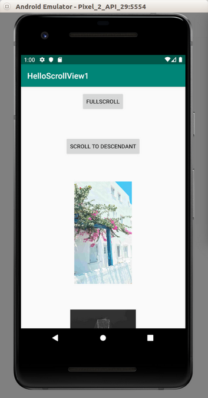
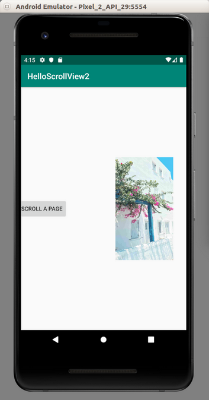
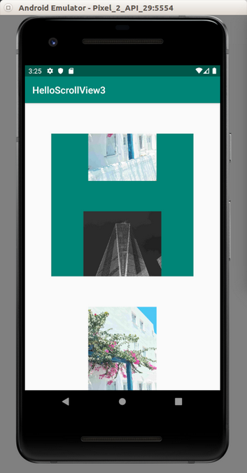
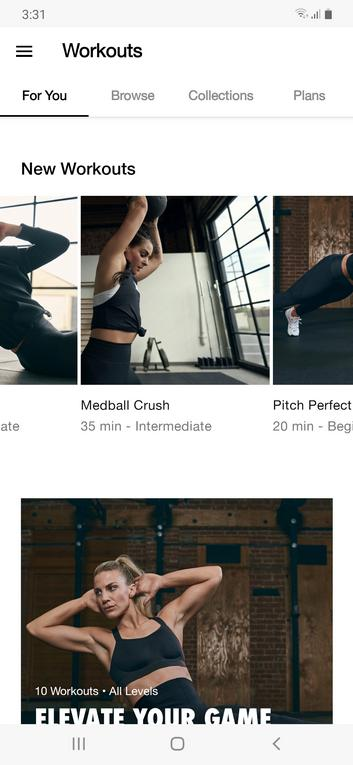

# ScrollView

Sometimes we have a bigger size content but the container has a smaller size. We can use scrollview.

Android scrollview can be divided into three categories: scrollview (vertical), horizontal scrollview, and nested scrollview.

## ScrollView (Vertical)

Create an empty Activity project. Name it HelloScrollView1.

Edit app / res / layout / activity_main.xml.

```xml
<?xml version="1.0" encoding="utf-8"?>
<androidx.constraintlayout.widget.ConstraintLayout
        xmlns:android="http://schemas.android.com/apk/res/android"
        xmlns:tools="http://schemas.android.com/tools"
        xmlns:app="http://schemas.android.com/apk/res-auto"
        android:layout_width="match_parent"
        android:layout_height="match_parent"
        tools:context=".MainActivity">
    <ScrollView
            android:layout_width="match_parent"
            android:layout_height="match_parent"
            app:layout_constraintStart_toStartOf="parent" app:layout_constraintHorizontal_bias="0.5"
            app:layout_constraintEnd_toEndOf="parent" app:layout_constraintTop_toTopOf="parent"
            app:layout_constraintBottom_toBottomOf="parent" android:id="@+id/scrollView">
        <LinearLayout android:layout_width="match_parent" android:layout_height="wrap_content"
                      android:gravity="center"
                      android:orientation="vertical">

            <Button
                    android:text="Scroll to X, Y"
                    android:layout_marginTop="64dp"
                    android:layout_width="wrap_content"
                    android:layout_height="wrap_content" android:id="@+id/buttonScrollToXY"/>
            <Button
                    android:text="FullScroll"
                    android:layout_marginTop="64dp"
                    android:layout_width="wrap_content"
                    android:layout_height="wrap_content" android:id="@+id/buttonFullScroll"/>
            <Button
                    android:text="Scroll to Descendant"
                    android:layout_marginTop="64dp"
                    android:layout_width="wrap_content"
                    android:layout_height="wrap_content" android:id="@+id/buttonScrollToDescendant"/>
            <ImageView
                    android:layout_width="256dp"
                    android:layout_height="256dp" tools:srcCompat="@tools:sample/avatars[2]"
                    android:id="@+id/imageView"
                    android:src="@drawable/anna"
                    android:layout_marginTop="64dp"
                    />
            <ImageView
                    android:layout_width="256dp"
                    android:layout_height="256dp" tools:srcCompat="@tools:sample/avatars[4]"
                    android:id="@+id/imageView2"
                    android:src="@drawable/boim"
                    android:layout_marginTop="64dp"
                    />
            <ImageView
                    android:layout_width="256dp"
                    android:layout_height="256dp" tools:srcCompat="@tools:sample/avatars[11]"
                    android:id="@+id/imageView3" android:layout_marginTop="64dp"
                    android:src="@drawable/boxed"
                    />
            <ImageView
                    android:layout_width="256dp"
                    android:layout_height="256dp" tools:srcCompat="@tools:sample/avatars[12]"
                    android:id="@+id/imageView4" android:layout_marginTop="64dp" android:layout_marginBottom="64dp"
                    android:src="@drawable/chander"
                    />
        </LinearLayout>
    </ScrollView>
</androidx.constraintlayout.widget.ConstraintLayout>
```

Basically a scrollview can only have one child. Usually we put a container here. In this example, we use LinearLayout with vertical direction. Inside this linear layout, we add three buttons, and four image views.

Then add four images into app / res / drawable with these names: anna.jpg, boim.jpg, boxed.jpg, chander.jpg.

Edit app / java / com.example.helloscrollview1 / MainActivity.

```kotlin
package com.example.helloscrollview1

import android.os.Build
import androidx.appcompat.app.AppCompatActivity
import android.os.Bundle
import android.view.View
import android.widget.Button
import android.widget.ImageView
import android.widget.ScrollView


class MainActivity : AppCompatActivity() {

    override fun onCreate(savedInstanceState: Bundle?) {
        super.onCreate(savedInstanceState)
        setContentView(R.layout.activity_main)

        val scrollView : ScrollView = findViewById(R.id.scrollView)
        findViewById<Button>(R.id.buttonScrollToXY).setOnClickListener {
            scrollView.scrollTo(0, 1600)
        }
        findViewById<Button>(R.id.buttonFullScroll).setOnClickListener {
            scrollView.fullScroll(View.FOCUS_DOWN)
        }

        if (Build.VERSION.SDK_INT >= 29) {
            findViewById<Button>(R.id.buttonScrollToDescendant).setOnClickListener {
                val imageView3: ImageView = findViewById(R.id.imageView3)
                scrollView.scrollToDescendant(imageView3)
            }
        }
    }
}
```
We give a callback to each button.

In the first callback, we access scrollTo method from the scrollview. It accepts x and y parameters.

In the second callback, we access fullScroll method from the scrollview. It accepts a vertical direction.

In the third callback, we access scrollToDescendant method from the scrollview. It accepts child view.

Each method from the scrollview that we use scroll the scrollview programmatically.

Run the application. Try to press each button to see the effect.

<p align="center">

</p>

## HorizontalScrollView

Let’s create a horizontal scrollview. Create an empty Activity project. Name it HelloScrollView2.

Edit app / res / layout / activity_main.xml.

```xml
<?xml version="1.0" encoding="utf-8"?>
<androidx.constraintlayout.widget.ConstraintLayout
        xmlns:android="http://schemas.android.com/apk/res/android"
        xmlns:tools="http://schemas.android.com/tools"
        xmlns:app="http://schemas.android.com/apk/res-auto"
        android:layout_width="match_parent"
        android:layout_height="match_parent"
        tools:context=".MainActivity">
    <HorizontalScrollView
            android:layout_width="match_parent"
            android:layout_height="match_parent"
            app:layout_constraintStart_toStartOf="parent" app:layout_constraintHorizontal_bias="0.0"
            app:layout_constraintEnd_toEndOf="parent" app:layout_constraintTop_toTopOf="parent"
            app:layout_constraintBottom_toBottomOf="parent" android:id="@+id/scrollView"
            app:layout_constraintVertical_bias="0.0">
        <LinearLayout android:layout_width="wrap_content" android:layout_height="match_parent"
                      android:gravity="center"
                      android:orientation="horizontal">

            <Button
                    android:text="Scroll to X, Y"
                    android:layout_marginStart="64dp"
                    android:layout_width="wrap_content"
                    android:layout_height="wrap_content" android:id="@+id/buttonScrollToXY"/>
            <Button
                    android:text="FullScroll"
                    android:layout_marginStart="64dp"
                    android:layout_width="wrap_content"
                    android:layout_height="wrap_content" android:id="@+id/buttonFullScroll"/>
            <Button
                    android:text="Scroll A Page"
                    android:layout_marginStart="64dp"
                    android:layout_width="wrap_content"
                    android:layout_height="wrap_content" android:id="@+id/buttonScrollAPage"/>
            <ImageView
                    android:layout_width="256dp"
                    android:layout_height="256dp" tools:srcCompat="@tools:sample/avatars[2]"
                    android:id="@+id/imageView"
                    android:src="@drawable/anna"
                    android:layout_marginStart="64dp"
            />
            <ImageView
                    android:layout_width="256dp"
                    android:layout_height="256dp" tools:srcCompat="@tools:sample/avatars[4]"
                    android:id="@+id/imageView2"
                    android:src="@drawable/boim"
                    android:layout_marginStart="64dp"
            />
            <ImageView
                    android:layout_width="256dp"
                    android:layout_height="256dp" tools:srcCompat="@tools:sample/avatars[11]"
                    android:id="@+id/imageView3" android:layout_marginStart="64dp"
                    android:src="@drawable/boxed"
            />
            <ImageView
                    android:layout_width="256dp"
                    android:layout_height="256dp" tools:srcCompat="@tools:sample/avatars[12]"
                    android:id="@+id/imageView4" android:layout_marginStart="64dp" android:layout_marginEnd="64dp"
                    android:src="@drawable/chander"
            />
        </LinearLayout>
    </HorizontalScrollView>
</androidx.constraintlayout.widget.ConstraintLayout>
```
In this example, we use HorizontalScrollView not ScrollView for the horizontal scrollview. The child of the scrollview is the linear layout which horizontal direction.

Add four images to app / res / drawable: anna.jpg, boim.jpg, boxed.jpg, chander.jpg.

Edit app / java / com.example.helloscrollview2 / MainActivity.

```kotlin
package com.example.helloscrollview2

import androidx.appcompat.app.AppCompatActivity
import android.os.Bundle
import android.view.View
import android.widget.Button
import android.widget.HorizontalScrollView


class MainActivity : AppCompatActivity() {

    override fun onCreate(savedInstanceState: Bundle?) {
        super.onCreate(savedInstanceState)
        setContentView(R.layout.activity_main)

        val scrollView : HorizontalScrollView = findViewById(R.id.scrollView)

        findViewById<Button>(R.id.buttonScrollToXY).setOnClickListener {
            scrollView.scrollTo(3200, 0)
        }

        findViewById<Button>(R.id.buttonFullScroll).setOnClickListener {
            scrollView.fullScroll(View.FOCUS_RIGHT)
        }

        findViewById<Button>(R.id.buttonScrollAPage).setOnClickListener {
            scrollView.pageScroll(View.FOCUS_RIGHT)
        }
    }
}
```

HorizontalScrollView does not have scrollToDescendant method. In this example, as a replacement, we use pageScroll method which scroll as far as the page width (for HorizontalScrollView).

Run the application. Try to press each button to see the effect of the methods.

<p align="center">

</p>

## NestedScrollView

You can have a scrollview inside a scrollview.

But you must use NestedScrollView instead of ScrollView for the scrollview inside a scrollview.

Create an empty Activity project. Name it HelloScrollView3.

Edit app / res / layout / activity_main.xml.
```xml
<?xml version="1.0" encoding="utf-8"?>
<androidx.constraintlayout.widget.ConstraintLayout
        xmlns:android="http://schemas.android.com/apk/res/android"
        xmlns:tools="http://schemas.android.com/tools"
        xmlns:app="http://schemas.android.com/apk/res-auto"
        android:layout_width="match_parent"
        android:layout_height="match_parent"
        tools:context=".MainActivity">
    <ScrollView
            android:layout_width="match_parent"
            android:layout_height="match_parent"
            app:layout_constraintStart_toStartOf="parent" app:layout_constraintHorizontal_bias="0.5"
            app:layout_constraintEnd_toEndOf="parent" app:layout_constraintTop_toTopOf="parent"
            app:layout_constraintBottom_toBottomOf="parent" android:id="@+id/scrollView">
        <LinearLayout android:layout_width="match_parent" android:layout_height="wrap_content"
                      android:gravity="center"
                      android:orientation="vertical">

            <androidx.core.widget.NestedScrollView android:layout_width="300dp"
                                                   android:layout_marginTop="64dp"
                                                   android:background="@color/colorPrimary"
                                                   android:layout_height="300dp">
                <LinearLayout android:layout_width="match_parent" android:layout_height="wrap_content"
                              android:gravity="center"
                              android:orientation="vertical">

                    <ImageView
                            android:layout_width="256dp"
                            android:layout_height="256dp" tools:srcCompat="@tools:sample/avatars[2]"
                            android:id="@+id/imageViewNested"
                            android:src="@drawable/anna"
                            android:layout_marginTop="64dp"
                    />
                    <ImageView
                            android:layout_width="256dp"
                            android:layout_height="256dp" tools:srcCompat="@tools:sample/avatars[4]"
                            android:id="@+id/imageView2Nested"
                            android:src="@drawable/boim"
                            android:layout_marginTop="64dp"
                    />
                    <ImageView
                            android:layout_width="256dp"
                            android:layout_height="256dp" tools:srcCompat="@tools:sample/avatars[11]"
                            android:id="@+id/imageView3Nested" android:layout_marginTop="64dp"
                            android:src="@drawable/boxed"
                    />
                    <ImageView
                            android:layout_width="256dp"
                            android:layout_height="256dp" tools:srcCompat="@tools:sample/avatars[12]"
                            android:id="@+id/imageView4Nested" android:layout_marginTop="64dp" android:layout_marginBottom="64dp"
                            android:src="@drawable/chander"
                    />
                </LinearLayout>
            </androidx.core.widget.NestedScrollView>

            <ImageView
                    android:layout_width="256dp"
                    android:layout_height="256dp" tools:srcCompat="@tools:sample/avatars[2]"
                    android:id="@+id/imageView"
                    android:src="@drawable/anna"
                    android:layout_marginTop="64dp"
            />
            <ImageView
                    android:layout_width="256dp"
                    android:layout_height="256dp" tools:srcCompat="@tools:sample/avatars[4]"
                    android:id="@+id/imageView2"
                    android:src="@drawable/boim"
                    android:layout_marginTop="64dp"
            />
            <ImageView
                    android:layout_width="256dp"
                    android:layout_height="256dp" tools:srcCompat="@tools:sample/avatars[11]"
                    android:id="@+id/imageView3" android:layout_marginTop="64dp"
                    android:src="@drawable/boxed"
            />
            <ImageView
                    android:layout_width="256dp"
                    android:layout_height="256dp" tools:srcCompat="@tools:sample/avatars[12]"
                    android:id="@+id/imageView4" android:layout_marginTop="64dp" android:layout_marginBottom="64dp"
                    android:src="@drawable/chander"
            />
        </LinearLayout>
    </ScrollView>
</androidx.constraintlayout.widget.ConstraintLayout>
```
NestedScrollView is just like any other child inside a linear layout container. We add a background color to differentiate it with outer ScrollView. NestedScrollView is like a ScrollView. It must have only one child. So inside NestedScrollView, there is only one child, which is a linear layout.

Add four images into app / res / drawable: anna.jpg, boim.jpg, boxed.jpg, chander.jpg.

Run the application. You have a nested scrollview!

<p align="center">

</p>

# Optional Readings

https://developer.android.com/reference/kotlin/android/widget/ScrollView

# Exercise

1. Create a scroll view which has a horizontal view inside of it. For example: Nike Training app.

<p align="center">

</p>
