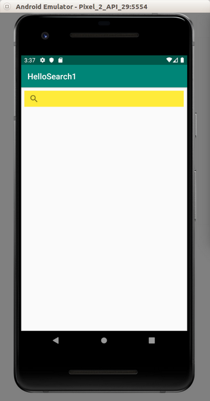
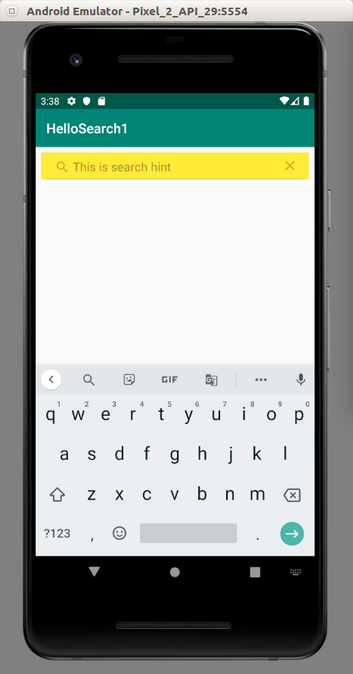
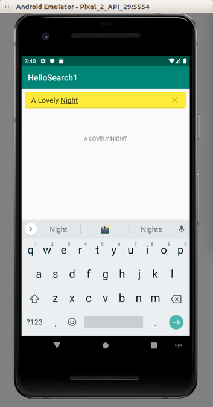
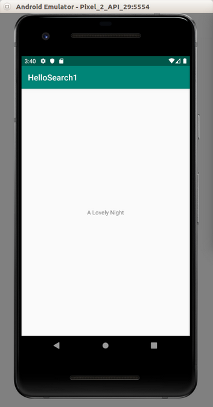
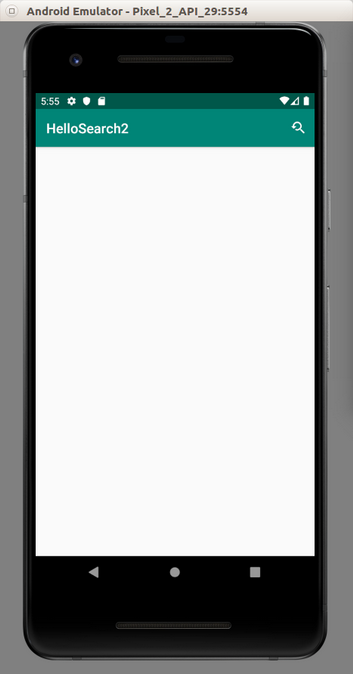
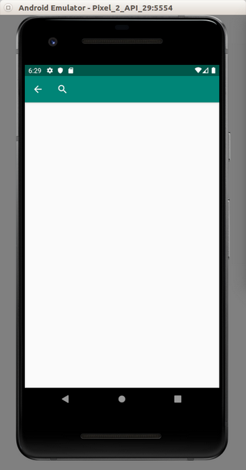
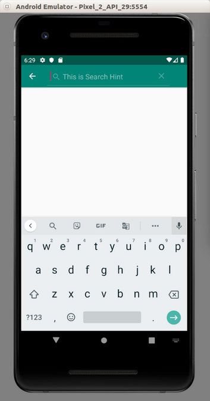
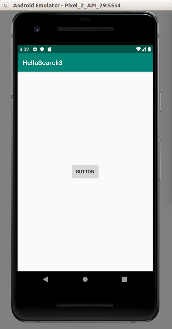
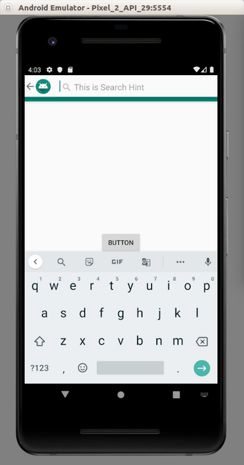

# Search

Android has a common search interface, which is a search interface.

There are two kinds of search interface, which are SearchView and search dialog.

## SearchView

SearchView is like another widget. You put it in any place you like on the container.

Create an empty Activity project. Name it HelloSearch1.

Edit app / res / values / strings.xml.

```xml
<resources>
    <string name="app_name">HelloSearch1</string>
    <string name="search_hint">This is search hint</string>
</resources>
```
Edit app / res / layout / activity_main.xml.

```xml
<?xml version="1.0" encoding="utf-8"?>
<androidx.constraintlayout.widget.ConstraintLayout
        xmlns:android="http://schemas.android.com/apk/res/android"
        xmlns:tools="http://schemas.android.com/tools"
        xmlns:app="http://schemas.android.com/apk/res-auto"
        android:layout_width="match_parent"
        android:layout_height="match_parent"
        tools:context=".MainActivity">
    <SearchView
            android:layout_width="match_parent"
            android:layout_height="40dp"
            app:layout_constraintStart_toStartOf="parent" android:layout_marginStart="8dp"
            android:layout_marginEnd="8dp" app:layout_constraintEnd_toEndOf="parent"
            app:layout_constraintTop_toTopOf="parent" android:layout_marginTop="8dp" android:id="@+id/searchView"
            android:background="#FFEB3B"/>
    <TextView
            android:text=""
            android:layout_width="wrap_content"
            android:layout_height="wrap_content" android:id="@+id/textViewSearchView"
            app:layout_constraintStart_toStartOf="parent" app:layout_constraintHorizontal_bias="0.5"
            app:layout_constraintEnd_toEndOf="parent"
            app:layout_constraintTop_toBottomOf="@+id/searchView" android:layout_marginTop="64dp"/>
</androidx.constraintlayout.widget.ConstraintLayout>
```
The interesting widget is SearchView. We give a yellow background to this widget.

This search view needs a configuration on its behavior.

Edit app / res / xml / searchable.xml.

```xml
<?xml version="1.0" encoding="utf-8"?>
<searchable xmlns:android="http://schemas.android.com/apk/res/android"
            android:label="@string/app_name"
            android:hint="@string/search_hint" >
</searchable>
```

Usually the search result is in different activity than the activity which hosts the search view.

So we need to have a layout resource for the search result activity.
```xml
<?xml version="1.0" encoding="utf-8"?>
<androidx.constraintlayout.widget.ConstraintLayout
        xmlns:android="http://schemas.android.com/apk/res/android"
        xmlns:tools="http://schemas.android.com/tools"
        xmlns:app="http://schemas.android.com/apk/res-auto"
        android:layout_width="match_parent"
        android:layout_height="match_parent"
        tools:context=".MainActivity">

    <TextView
            android:text="TextView"
            android:layout_width="wrap_content"
            android:layout_height="wrap_content"
            android:id="@+id/textView" app:layout_constraintStart_toStartOf="parent"
            app:layout_constraintHorizontal_bias="0.5" app:layout_constraintEnd_toEndOf="parent"
            app:layout_constraintTop_toTopOf="parent" app:layout_constraintBottom_toBottomOf="parent"/>
</androidx.constraintlayout.widget.ConstraintLayout>
```
We need to have two Activity classes.

Edit app / java / com.example.hellosearch1 / MainActivity.

```kotlin
package com.example.hellosearch1

import android.app.SearchManager
import android.content.ComponentName
import android.content.Context
import androidx.appcompat.app.AppCompatActivity
import android.os.Bundle
import android.widget.SearchView
import android.widget.TextView


class MainActivity : AppCompatActivity() {

    override fun onCreate(savedInstanceState: Bundle?) {
        super.onCreate(savedInstanceState)
        setContentView(R.layout.activity_main)

        val searchManager = getSystemService(Context.SEARCH_SERVICE) as SearchManager
        val searchView = findViewById<SearchView>(R.id.searchView)
        searchView.apply {
            val component = ComponentName(context, SearchableActivity::class.java)
            setSearchableInfo(searchManager.getSearchableInfo(component))
        }

        val textViewSearchView = findViewById<TextView>(R.id.textViewSearchView)
        searchView.setOnQueryTextListener(
            object : SearchView.OnQueryTextListener {
                override fun onQueryTextChange(p0: String?): Boolean {
                    textViewSearchView.text = p0!!.toUpperCase()
                    return true
                }

                override fun onQueryTextSubmit(p0: String?): Boolean {
                    return true
                }
            }
        )
    }

}
```

To link the search view with the search result Activity, you need to set the searchable info.
```kotlin
val searchManager = getSystemService(Context.SEARCH_SERVICE) as SearchManager
val searchView = findViewById<SearchView>(R.id.searchView)
searchView.apply {
    val component = ComponentName(context, SearchableActivity::class.java)
    setSearchableInfo(searchManager.getSearchableInfo(component))
}
```

You can also intercept when a user type a query in the search view.
```kotlin
val textViewSearchView = findViewById<TextView>(R.id.textViewSearchView)
searchView.setOnQueryTextListener(
    object : SearchView.OnQueryTextListener {
        override fun onQueryTextChange(p0: String?): Boolean {
            textViewSearchView.text = p0!!.toUpperCase()
            return true
        }

        override fun onQueryTextSubmit(p0: String?): Boolean {
            return true
        }
    }
)
```
As you type the query, the text view’s text is changed.

Create the search result Activity, app / java / com.example.hellosearch1 / SearchableActivity.

```kotlin
package com.example.hellosearch1

import android.app.SearchManager
import android.content.Intent
import androidx.appcompat.app.AppCompatActivity
import android.os.Bundle
import android.widget.TextView


class SearchableActivity : AppCompatActivity() {

    override fun onCreate(savedInstanceState: Bundle?) {
        super.onCreate(savedInstanceState)
        setContentView(R.layout.activity_searchable)

        if (Intent.ACTION_SEARCH == intent.action) {
            intent.getStringExtra(SearchManager.QUERY)?.also { query ->
                findViewById<TextView>(R.id.textView).text = query
            }
        }
    }
}
```

You get the query from intent.

You need to register this search activity in manifest file.
```xml
<activity android:name=".SearchableActivity" >
    <intent-filter>
        <action android:name="android.intent.action.SEARCH" />
    </intent-filter>
    <meta-data android:name="android.app.searchable"
               android:resource="@xml/searchable"/>
</activity>
```
Run the application.

<p align="center">

</p>

Click the search icon. Then you can type in the search view.

<p align="center">

</p>

<p align="center">

</p>

<p align="center">

</p>

Usually the search view is put on the actionbar or toolbar. We put the search icon on the actionbar then when we click that icon, it will be expanded into edit text on the actionbar.

Create a new empty Activity project. Name it HelloSearch2.

Edit app / res / xml / searchable.xml.
```xml
<?xml version="1.0" encoding="utf-8"?>
<searchable xmlns:android="http://schemas.android.com/apk/res/android"
            android:label="@string/app_name"
            android:hint="@string/search_hint" >
</searchable>
```
Edit app / res / values / strings.xml.
```xml
<resources>
    <string name="app_name">HelloSearch2</string>
    <string name="search_title">This is Search Title</string>
    <string name="search_hint">This is Search Hint</string>
</resources>
```
Create a new vector asset named ic_search.xml in app / res / drawable.

Edit app / res / menu / options_menu.xml.
```xml
<?xml version="1.0" encoding="utf-8"?>
<menu xmlns:android="http://schemas.android.com/apk/res/android" xmlns:app="http://schemas.android.com/apk/res-auto">
    <item android:id="@+id/search"
          android:title="@string/search_title"
          android:icon="@drawable/ic_search"
          app:showAsAction="collapseActionView|ifRoom"
          app:actionViewClass="android.widget.SearchView" />
</menu>
```
The first interesting property is app:showAsAction which collapses action view and show it if there is a space. The second interesting property is app:actionViewClass which has value of SearchView.

Edit app / res / layout / activity_main.xml. It’s empty because our search view is on the actionbar.
```xml
<?xml version="1.0" encoding="utf-8"?>
<androidx.constraintlayout.widget.ConstraintLayout
    xmlns:android="http://schemas.android.com/apk/res/android"
    xmlns:tools="http://schemas.android.com/tools"
    android:layout_width="match_parent"
    android:layout_height="match_parent"
    tools:context=".MainActivity">


</androidx.constraintlayout.widget.ConstraintLayout>
```
Edit app / res / layout / activity_searchable.xml. This is the layout resource file for the search result Activity.
```xml
<?xml version="1.0" encoding="utf-8"?>
<androidx.constraintlayout.widget.ConstraintLayout
        xmlns:android="http://schemas.android.com/apk/res/android"
        xmlns:tools="http://schemas.android.com/tools"
        xmlns:app="http://schemas.android.com/apk/res-auto"
        android:layout_width="match_parent"
        android:layout_height="match_parent"
        tools:context=".MainActivity">

    <TextView
            android:text="TextView"
            android:layout_width="wrap_content"
            android:layout_height="wrap_content"
            android:id="@+id/textView" app:layout_constraintStart_toStartOf="parent"
            app:layout_constraintHorizontal_bias="0.5" app:layout_constraintEnd_toEndOf="parent"
            app:layout_constraintTop_toTopOf="parent" app:layout_constraintBottom_toBottomOf="parent"/>
</androidx.constraintlayout.widget.ConstraintLayout>
```
Edit app / java / com.example.hellosearch2 / SearchableActivity.

```kotlin
package com.example.hellosearch2

import android.app.SearchManager
import android.content.Intent
import androidx.appcompat.app.AppCompatActivity
import android.os.Bundle
import android.widget.TextView


class SearchableActivity : AppCompatActivity() {

    override fun onCreate(savedInstanceState: Bundle?) {
        super.onCreate(savedInstanceState)
        setContentView(R.layout.activity_searchable)

        if (Intent.ACTION_SEARCH == intent.action) {
            intent.getStringExtra(SearchManager.QUERY)?.also { query ->
                findViewById<TextView>(R.id.textView).text = query
            }
        }
    }
}
```

This is same as SearchableActivity in previous project.

Edit app / java / com.example.hellosearch2 / MainActivity.

```kotlin
package com.example.hellosearch2

import android.app.SearchManager
import android.content.ComponentName
import android.content.Context
import androidx.appcompat.app.AppCompatActivity
import android.os.Bundle
import android.se.omapi.SEService
import android.view.Menu
import android.widget.SearchView

class MainActivity : AppCompatActivity() {

    override fun onCreate(savedInstanceState: Bundle?) {
        super.onCreate(savedInstanceState)
        setContentView(R.layout.activity_main)
    }

    override fun onCreateOptionsMenu(menu: Menu?): Boolean {
        menuInflater.inflate(R.menu.options_menu, menu)
        val searchManager = getSystemService(Context.SEARCH_SERVICE) as SearchManager
        val searchView = menu!!.findItem(R.id.search).actionView as SearchView
        searchView.apply {
            val component = ComponentName(context, SearchableActivity::class.java)
            setSearchableInfo(searchManager.getSearchableInfo(component))
        }

        return true
    }
}
```

We inflate our menu resource file.
```kotlin
menuInflater.inflate(R.menu.options_menu, menu)
```
We get the search view from the menu.
```kotlin
val searchView = menu!!.findItem(R.id.search).actionView as SearchView
```
Then, everything else remains the same. We set the searchable info of the search view.

Edit the manifest file, app / manifests / AndroidManifest.xml. Add SearchableActivity in the manifest file.

```xml
<activity android:name=".SearchableActivity" >
    <intent-filter>
        <action android:name="android.intent.action.SEARCH" />
    </intent-filter>
    <meta-data android:name="android.app.searchable"
               android:resource="@xml/searchable"/>
</activity>
```
Run the application.

<p align="center">

</p>

Click the right top button.

<p align="center">

</p>

Then click the search icon before you can type your query.

<p align="center">

</p>

## SearchDialog

Other than SearchView, you can use SearchDialog. SearchDialog is a view displayed on top of the parent activity.

Create an empty Activity project. Name it HelloSearch3.

Edit app / res / values/ strings.xml.
```xml
<resources>
    <string name="app_name">HelloSearch3</string>
    <string name="search_title">This is Search Title</string>
    <string name="search_hint">This is Search Hint</string>
</resources>
```
Edit app / res / xml / searchable.xml. This is the configuration of search behavior.
```xml
<?xml version="1.0" encoding="utf-8"?>
<searchable xmlns:android="http://schemas.android.com/apk/res/android"
            android:label="@string/app_name"
            android:hint="@string/search_hint" >
</searchable>
```

Edit app / res / layout / activity_searchable.xml. This is the layout resource for the search result activity.
```xml
<?xml version="1.0" encoding="utf-8"?>
<androidx.constraintlayout.widget.ConstraintLayout
        xmlns:android="http://schemas.android.com/apk/res/android"
        xmlns:tools="http://schemas.android.com/tools"
        xmlns:app="http://schemas.android.com/apk/res-auto"
        android:layout_width="match_parent"
        android:layout_height="match_parent"
        tools:context=".MainActivity">

    <TextView
            android:text="TextView"
            android:layout_width="wrap_content"
            android:layout_height="wrap_content"
            android:id="@+id/textView" app:layout_constraintStart_toStartOf="parent"
            app:layout_constraintHorizontal_bias="0.5" app:layout_constraintEnd_toEndOf="parent"
            app:layout_constraintTop_toTopOf="parent" app:layout_constraintBottom_toBottomOf="parent"/>
</androidx.constraintlayout.widget.ConstraintLayout>
```
Edit app / res / layout / activity_main.xml. This is the layout resource for the activity that will launch the search dialog.
```xml
<?xml version="1.0" encoding="utf-8"?>
<androidx.constraintlayout.widget.ConstraintLayout
        xmlns:android="http://schemas.android.com/apk/res/android"
        xmlns:tools="http://schemas.android.com/tools"
        xmlns:app="http://schemas.android.com/apk/res-auto"
        android:layout_width="match_parent"
        android:layout_height="match_parent"
        tools:context=".MainActivity">
    <Button
            android:text="Button"
            android:layout_width="wrap_content"
            android:layout_height="wrap_content"
            android:id="@+id/button" app:layout_constraintStart_toStartOf="parent"
            app:layout_constraintHorizontal_bias="0.5" app:layout_constraintEnd_toEndOf="parent"
            app:layout_constraintTop_toTopOf="parent" app:layout_constraintBottom_toBottomOf="parent"/>
</androidx.constraintlayout.widget.ConstraintLayout>
```
We have one button. If we click this button, the search dialog will appear.

Create a new activity which will be the search result activity, app / java / com.example.hellosearch3 / SearchableActivity.

```kotlin
package com.example.hellosearch3

import android.app.SearchManager
import android.content.Intent
import androidx.appcompat.app.AppCompatActivity
import android.os.Bundle
import android.widget.TextView


class SearchableActivity : AppCompatActivity() {

    override fun onCreate(savedInstanceState: Bundle?) {
        super.onCreate(savedInstanceState)
        setContentView(R.layout.activity_searchable)

        if (Intent.ACTION_SEARCH == intent.action) {
            intent.getStringExtra(SearchManager.QUERY)?.also { query ->
                findViewById<TextView>(R.id.textView).text = query
            }
        }
    }
}
```

Edit app / java / com.example.hellosearch3 / MainActivity.
```kotlin
package com.example.hellosearch3

import androidx.appcompat.app.AppCompatActivity
import android.os.Bundle
import android.widget.Button

class MainActivity : AppCompatActivity() {

    override fun onCreate(savedInstanceState: Bundle?) {
        super.onCreate(savedInstanceState)
        setContentView(R.layout.activity_main)

        findViewById<Button>(R.id.button).setOnClickListener {
            onSearchRequested()
        }
    }
}
```

The keyword in onSearchRequested. This method will launch a search dialog.

Lastly edit app / manifests / AndroidManifest.xml file. Add this content inside application node.
```xml
<activity android:name=".SearchableActivity" >
    <intent-filter>
        <action android:name="android.intent.action.SEARCH" />
    </intent-filter>
    <meta-data android:name="android.app.searchable"
               android:resource="@xml/searchable"/>
</activity>
<meta-data android:name="android.app.default_searchable"
           android:value=".SearchableActivity" />
```
Unlike previous Android projects that we have worked on, this time there is something different. A meta-data node outside activity node. This is to make sure our MainActivity can launch the search dialog. If this meta-data node (outside activity nodes) does not exist, onSearchRequested will not do anything.

Run the application. If you click the button, it will launch the search dialog.

<p align="center">


</p>

# Optional Readings

https://developer.android.com/guide/topics/search/

https://developer.android.com/reference/android/widget/SearchView?hl=en

# Exercises

1. Create a voice search view interface.