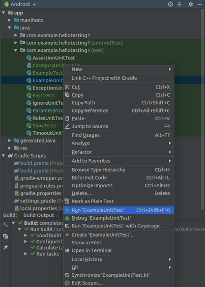

# Testing

Testing in Android can be categorized into some categories: unit testing, instrumented testing, automator testing. We will discuss it one by one.

## Unit Testing

This kind of test does not have access to Android framework. You can not write something to the log like Log.d(“tag”, “Logging message...”).

Create a new empty view Android project named HelloTesting1.

Edit build.gradle (Module: app).

Add this line inside dependencies:
```
implementation 'com.natpryce:hamkrest:1.7.0.0'
```
Edit app / java / com.example.hellotesting1 (test) / ExampleTestSuite.

```kotlin
package com.example.hellotesting1

import org.junit.*
import org.junit.Assert.assertEquals


class ExampleUnitTest {

    companion object {
        init {
            println("init")
        }

        val variable1 = 7

        @BeforeClass
        @JvmStatic
        fun setup() {
            println("BeforeClass")
        }

        @AfterClass
        @JvmStatic
        fun teardown() {
            println("AfterClass")
        }
    }

    val variable2 = 9

    @Before
    fun beforeEachTest() {
        println("Before each test")
    }

    @After
    fun afterEachTest() {
        println("After each test")
    }

    @Test
    fun addition_isCorrect() {
        assertEquals(16, variable2 + variable1)
    }

    @Test
    fun subtraction_isCorrect() {
        assertEquals(2, variable2 - variable1)
    }
}
```

There are two test methods. These methods are annotated with @Test. Inside these test methods, we  use assertEquals to test the addition and subtraction operations.
```kotlin
    @Test
    fun addition_isCorrect() {
        assertEquals(16, variable2 + variable1)
    }

    @Test
    fun subtraction_isCorrect() {
        assertEquals(2, variable2 - variable1)
    }
```
If you want to run a method before running each test, you can use @Before annotation like:
```kotlin
    @Before
    fun beforeEachTest() {
        println("Before each test")
    }
```
If you want to run a method after running each test, you can use @After annotation like:
```kotlin
    @After
    fun afterEachTest() {
        println("After each test")
    }
```
These methods with @Before and @After annotations will be run two times because there are two test methods (with @Test annotations).

If you want to run a method before running all tests, you can use method that annotated with @BeforeClass and @JvmStatic. These methods must be put inside companion object block.
```kotlin
companion object {
    init {
        println("init")
    }

    val variable1 = 7

    @BeforeClass
    @JvmStatic
    fun setup() {
        println("BeforeClass")
    }

    @AfterClass
    @JvmStatic
    fun teardown() {
        println("AfterClass")
    }
}
```
The init method will be run first, then setup method. After running all tests, the teardown method will be executed.

To run the test, right click ExampleUnitTest, and choose Run ‘ExampleUnitTest’.

<p align="center">

</p>

Or you can do it via command line. Go inside project directory then run this command:
```
$ ./gradlew test
```
To run a specific test, you run this command:
```
$ ./gradlew :app:testDebugUnitTest --tests "RulesUnitTest"
```
Other than assertEquals, we have many other types of assertions. Add a new test file in app / java / com.example.hellotesting1 (test), named AssertionUnitTest.

```kotlin
package com.example.hellotesting1

import com.natpryce.hamkrest.allOf
import com.natpryce.hamkrest.and
import com.natpryce.hamkrest.assertion.assertThat
import com.natpryce.hamkrest.containsSubstring
import org.hamcrest.core.IsCollectionContaining.hasItems
import org.junit.*

import org.junit.Assert.*

class AssertionUnitTest {

    @Test
    fun assertThat_isCorrect() {
        assertEquals(16, 15 + 1)
        assertTrue("must be true", true)
        assertThat("check string", containsSubstring("check"))
        assertThat("check string", allOf(containsSubstring("check") and containsSubstring("string")))
        assertThat(arrayListOf("one", "two", "three"), hasItems("one", "three"))
    }
}
```

There is assertTrue, and assertThat. Inside assertThat, you can use helper methods to check something, like containsSubstring, hasItems. Add a new test file in app / java / com.example.hellotesting1 (test), named ExceptionUnitTest.

```kotlin
package com.example.hellotesting1

import org.junit.Test

class ExceptionUnitTest {

    @Test(expected=IndexOutOfBoundsException::class)
    fun retrieveInvalidIndex() {
        arrayListOf("haha")[3]
    }
}
```

We know that fetching an invalid index from array, like arrayListOf(“haha”)[3], will throw an exception, which is IndexOutOfBoundsException. We can test that a certain exception is thrown with parameter of @Test annotation.
```kotlin
    @Test(expected=IndexOutOfBoundsException::class)
```

You can ignore some tests. Add a new test file in app / java / com.example.hellotesting1 (test), named IgnoreUnitTest.
```kotlin
package com.example.hellotesting1

import org.junit.Ignore
import org.junit.Test

class IgnoreUnitTest {

    @Ignore("Test is ignored")
    @Test
    fun retrieveInvalidIndex() {
        arrayListOf("haha")[3]
    }
}
```
To ignore a test, you can use @Ignore annotation.

You can run a test method many times with different parameters. Add a test file in app / java / com.example.hellotesting1 (test), named ParameterizedUnitTest.

```kotlin
package com.example.hellotesting1

import org.junit.Assert
import org.junit.Test
import org.junit.runner.RunWith
import org.junit.runners.Parameterized


@RunWith(Parameterized::class)
class ParameterizedUnitTest(val fInput: Int, val fExpected: Int) {

    companion object {
        @Parameterized.Parameters
        @JvmStatic fun data() =
            arrayListOf(
                arrayOf(1, 2),
                arrayOf(2, 4),
                arrayOf(10, 20)
            )
    }

    @Test
    fun twoTimes_isCorrect() {
        Assert.assertEquals(fExpected, 2 * fInput)
    }
}
```

Notice we have an array of three arrays in data method.
```kotlin
    companion object {
        @Parameterized.Parameters
        @JvmStatic fun data() =
            arrayListOf(
                arrayOf(1, 2),
                arrayOf(2, 4),
                arrayOf(10, 20)
            )
    }
```

To create parameters to be sent to test methods, you annotate a static method with @Parameterized.Parameters. The parameters are an array of three arrays. Each array consists of two numbers.

To make sure our class test can use these parameters, we need to annotate the class and make sure the constructor of the class accepts two parameters.
```kotlin
@RunWith(Parameterized::class)
class ParameterizedUnitTest(val fInput: Int, val fExpected: Int) {
```
The twoTimes_isCorrect test method will be run three times.
```kotlin
    @Test
    fun twoTimes_isCorrect() {
        Assert.assertEquals(fExpected, 2 * fInput)
    }
```
The first time, fInput will be 1  and fExpected will be 2. The second time, fInput will be 2 and fExpected will be 4. The third time, fInput will be 10 and fExpected will be 20.

Remember our parameters data?
```kotlin
    arrayListOf(
        arrayOf(1, 2),
        arrayOf(2, 4),
        arrayOf(10, 20)
    )
```
When creating unit tests, you can use rules. Rules are like helper methods. In unit tests, you have some rules that you can use. Add a test file in app / java / com.example.hellotesting1 (test), named RulesUnitTest.

```kotlin
package com.example.hellotesting1

import org.junit.Assert.assertTrue
import org.junit.Rule
import org.junit.Test
import org.junit.rules.ExpectedException
import org.junit.rules.TemporaryFolder


class RulesUnitTest {
    @get:Rule
    val tempFolder : TemporaryFolder = TemporaryFolder()

    @get:Rule
    val exception = ExpectedException.none()

    @Test
    fun countsAssets() {
        val testFile = tempFolder.newFile("test.txt")
        assertTrue(testFile.exists())
    }

    @Test
    fun accessInvalidIndex() {
        exception.expect(IndexOutOfBoundsException::class.java)
        exception.expectMessage("Index: 3, Size: 1")
        arrayListOf("haha")[3]
    }
}
```

The first rule is about temporary folder.
```kotlin
    @get:Rule
    val tempFolder : TemporaryFolder = TemporaryFolder()
```
It is used in this test method.
```kotlin
    @Test
    fun checkFileExists() {
        val testFile = tempFolder.newFile("test.txt")
        assertTrue(testFile.exists())
    }
```
With this rule, you have an access to temporary folder.

The second rule is about exception.
```kotlin
@get:Rule
val exception = ExpectedException.none()
```
It is used in this test method.
```kotlin
@Test
fun accessInvalidIndex() {
    exception.expect(IndexOutOfBoundsException::class.java)
    exception.expectMessage("Index: 3, Size: 1")
    arrayListOf("haha")[3]
}
```
With this rule, you can expect an exception to be thrown.

You can use timeout to test whether a certain method fails because it passes a time limit. Add a new file in app / java / com.example.hellotesting1 (test). Name it TimeoutUnitTest.
```kotlin
package com.example.hellotesting1

import org.junit.Test
import java.util.concurrent.TimeUnit

class TimeoutUnitTest {

    @Test(timeout=1100)
    fun veryLongUnitTest() {
        TimeUnit.SECONDS.sleep(1)
    }
}
```
We use parameter timeout in @Test. It the test method exceeds the timeout, it will fail.

You can categorize the tests into some categories.

Create an interface in app / java / com.example.hellotesting1 (test), named SlowTests.
```kotlin
package com.example.hellotesting1

interface SlowTests {
}
```
Create an interface in app / java / com.example.hellotesting1 (test), named FastTests.
```kotlin
package com.example.hellotesting1

interface FastTests {
}
```
Then create a new file in app / java / com.example.hellotesting1 (test), named CategoryUnitTest.
```kotlin
package com.example.hellotesting1

import org.junit.Assert
import org.junit.Test
import org.junit.experimental.categories.Category


@Category(FastTests::class)
class CategoryUnitTest {

    @Test
    fun addition_isCorrect() {
        Assert.assertEquals(16, 15 + 1)
    }
}

@Category(SlowTests::class)
class Category2UnitTest {

    @Test
    fun addition_isCorrect() {
        Assert.assertEquals(16, 15 + 2)
    }
}
```
We have two test classes. Each class test has same @Category but with different parameter. The first test class got @Category(FastTests::class). The second test class got @Category(SlowTests::class).

Then create a test suite. Create a file inside app / java / com.example.hellotesting1 (test), named ExampleTestSuite.
```kotlin
package com.example.hellotesting1

import org.junit.experimental.categories.Categories
import org.junit.runner.RunWith
import org.junit.runners.Suite


@RunWith(Categories::class)
@Categories.IncludeCategory(FastTests::class)
@Suite.SuiteClasses(CategoryUnitTest::class, Category2UnitTest::class)
class ExampleTestSuite {
}
```

Then run the test suite.

This test suite will run CategoryUnitTest and Category2UnitTest classes but only the ones marked by @Category(FastTests::class).

## Instrumented Test

With instrumented test, you can access Android framework.

Edit build.gradle (Module: app).

Change androidTestImplementation from `‘androidx.test:runner:1.2.0’` to `‘androidx.test.ext:junit:1.1.1’`.

androidTestImplementation 'androidx.test.ext:junit:1.1.1'
androidTestImplementation 'androidx.test:rules:1.2.0'

### InstrumentationRegistry

Edit app / java / com.example.hellotesting1 (androidTest) / ExampleInstrumentedTest.

```kotlin
package com.example.hellotesting1

import androidx.test.ext.junit.runners.AndroidJUnit4
import androidx.test.platform.app.InstrumentationRegistry

import org.junit.Test
import org.junit.runner.RunWith

import org.junit.Assert.*

@RunWith(AndroidJUnit4::class)
class ExampleInstrumentedTest {
    @Test
    fun useAppContext() {
        val appContext = InstrumentationRegistry.getInstrumentation().targetContext
        assertEquals("com.example.hellotesting1", appContext.packageName)
    }
}
```
Run the instrumented test. You will need a device or a simulator to be able to run instrumented tests.

You annotate the class with @RunWith accepting AndroidJUnit4::class.

In the test method, you get the application context with InstrumentationRegistry.getInstrumentation() which gives you targetContext. From this context you can get the package name among other things.

### Espresso

Now edit app / res / layout / activity_main.xml. 

```xml
<?xml version="1.0" encoding="utf-8"?>
<androidx.constraintlayout.widget.ConstraintLayout
        xmlns:android="http://schemas.android.com/apk/res/android"
        xmlns:tools="http://schemas.android.com/tools"
        xmlns:app="http://schemas.android.com/apk/res-auto"
        android:layout_width="match_parent"
        android:layout_height="match_parent"
        tools:context=".MainActivity">

    <TextView
            android:id="@+id/helloWorld"
            android:layout_width="wrap_content"
            android:layout_height="wrap_content"
            android:text="Hello World!"
            app:layout_constraintBottom_toBottomOf="parent"
            app:layout_constraintLeft_toLeftOf="parent"
            app:layout_constraintRight_toRightOf="parent"
            app:layout_constraintTop_toTopOf="parent"/>
    <EditText
            android:layout_width="wrap_content"
            android:layout_height="wrap_content"
            android:inputType="textPersonName"
            android:text="Name"
            android:ems="10"
            android:id="@+id/editText"
            app:layout_constraintStart_toStartOf="parent" app:layout_constraintHorizontal_bias="0.5"
            app:layout_constraintEnd_toEndOf="parent" android:layout_marginTop="16dp"
            app:layout_constraintTop_toTopOf="parent"/>
    <Button
            android:text="Button"
            android:layout_width="wrap_content"
            android:layout_height="wrap_content"
            android:id="@+id/button" android:layout_marginTop="24dp"
            app:layout_constraintTop_toBottomOf="@+id/editText" app:layout_constraintStart_toStartOf="parent"
            app:layout_constraintHorizontal_bias="0.5" app:layout_constraintEnd_toEndOf="parent"/>

</androidx.constraintlayout.widget.ConstraintLayout>
```

We have one button, one edit text, and one text view in our layout resource file.

Add IsDisplayedInstrumentedTest test class in app / java / com.example.hellotesting1 (androidTest).

```kotlin
package com.example.hellotesting1

import android.widget.TextView
import androidx.test.espresso.Espresso.onView
import androidx.test.espresso.assertion.ViewAssertions.matches
import androidx.test.espresso.matcher.ViewMatchers.isDisplayed
import androidx.test.espresso.matcher.ViewMatchers.withText
import androidx.test.ext.junit.runners.AndroidJUnit4
import androidx.test.rule.ActivityTestRule

import org.junit.Test
import org.junit.runner.RunWith

import org.junit.Rule
import org.junit.Assert.assertEquals


@RunWith(AndroidJUnit4::class)
class IsDisplayedInstrumentedTest {

    @get:Rule
    val activityRule = ActivityTestRule(MainActivity::class.java)

    @Test
    fun testHelloWorld() {
        onView(withText("Hello World!")).check(matches(isDisplayed()))
        assertEquals(activityRule.activity.findViewById<TextView>(R.id.helloWorld).text, "Hello World!")
    }
}
```

As usual, you annotate the test class with @RunWith.

Then you can get the activity test rule on which later you can get the activity itself.
```kotlin
    @get:Rule
    val activityRule = ActivityTestRule(MainActivity::class.java)
```
To check the value of the text view (for example), you can use Espresso way, or pure instrumented way.

This is the Espresso way.
```kotlin
onView(withText("Hello World!")).check(matches(isDisplayed()))
```
This is pure instrumented way.
```kotlin
assertEquals(activityRule.activity.findViewById<TextView>(R.id.helloWorld).text, "Hello World!")
```
From this forward, we are focusing on Espresso way.

With Espresso way, first you get the view matcher.
```kotlin
onView(withText("Hello World!"))
```
Then you check what you want to check on this view matcher. In this case, we want to make sure the text view is displayed.
```kotlin
.check(matches(isDisplayed()))
```

### Testing of Clicking Button

Now, let’s test the case where we do something on the view (like clicking button or typing message) before checking the property of the view.

Edit app / java / com.example.hellotesting1 / MainActivity.

```kotlin
package com.example.hellotesting1

import androidx.appcompat.app.AppCompatActivity
import android.os.Bundle
import android.widget.Button
import android.widget.EditText
import android.widget.TextView

class MainActivity : AppCompatActivity() {

    override fun onCreate(savedInstanceState: Bundle?) {
        super.onCreate(savedInstanceState)
        setContentView(R.layout.activity_main)

        findViewById<Button>(R.id.button).setOnClickListener {
            findViewById<TextView>(R.id.helloWorld).text = findViewById<EditText>(R.id.editText).text
        }
    }

}
```

When you click the button, anything you have typed on the edit text will be copied to the text view’s text.

Create a new instrumented test in app / java / com.example.hellotesting1 (androidTest), named ButtonClickedInstrumentedTest.

```kotlin
package com.example.hellotesting1

import androidx.test.espresso.Espresso.onView
import androidx.test.espresso.action.ViewActions.*
import androidx.test.espresso.assertion.ViewAssertions.matches
import androidx.test.espresso.matcher.ViewMatchers.*
import androidx.test.ext.junit.runners.AndroidJUnit4
import androidx.test.rule.ActivityTestRule
import org.junit.Rule
import org.junit.Test
import org.junit.runner.RunWith

@RunWith(AndroidJUnit4::class)
class ButtonClickedInstrumentedTest {

    @get:Rule
    val activityRule = ActivityTestRule(MainActivity::class.java)


    @Test
    fun testButtonClicked() {
        val newText = "Hello Sun!"
        onView(withId(R.id.helloWorld)).check(matches(withText("Hello World!")))
        onView(withId(R.id.editText)).perform(clearText(), typeText(newText), closeSoftKeyboard())
        onView(withId(R.id.button)).perform(click())
        onView(withId(R.id.helloWorld)).check(matches(withText(newText)))
    }
}
```

In the line below, we clear the text, type the text, and close the keyboard. We use perform method.
```kotlin
onView(withId(R.id.editText)).perform(clearText(), typeText(newText), closeSoftKeyboard())
```
To click the button, you use click method inside perform method.
```kotlin
onView(withId(R.id.button)).perform(click())
```
In this example, we use withId matcher instead of withText matcher.

After doing that, we check the text view with id helloWorld whether the text has been changed or not.

### Testing of Recyclerview

Now let’s test recyclerview. We click the row, by clicking the row we launch other activity and we test the text in the other activity.

Create an empty view project, named HelloTesting2.

Add some dependencies in build.gradle (Module: app).
```
implementation 'androidx.recyclerview:recyclerview:1.1.0-beta01'
androidTestImplementation 'androidx.test:rules:1.2.0'
androidTestImplementation 'androidx.test.uiautomator:uiautomator:2.2.0'
androidTestImplementation 'androidx.test.espresso:espresso-contrib:3.2.0'
```
Edit app / res / layout / activity_main.xml.
```xml
<?xml version="1.0" encoding="utf-8"?>
<androidx.recyclerview.widget.RecyclerView
        xmlns:android="http://schemas.android.com/apk/res/android"
        android:id="@+id/recyclerView"
        android:layout_width="match_parent"
        android:layout_height="match_parent"/>
```
This is our recyclerview layout resource file used by MainActivity.

Let’s create a layout resource file for the recyclerview’s row. Create app / res / layout / crypto_row.xml.

```xml
<?xml version="1.0" encoding="utf-8"?>
<LinearLayout xmlns:android="http://schemas.android.com/apk/res/android"
              android:id="@+id/cryptoRow"
              android:orientation="horizontal"
              android:layout_width="match_parent"
              android:layout_height="wrap_content">
    <TextView
            android:text="TextView"
            android:layout_width="wrap_content"
            android:layout_height="50dp" android:id="@+id/textView" android:layout_weight="1"/>
</LinearLayout>
```
We just put a text view inside each row of the recyclerview.

Let’s create a layout resource file for the other activity. Create app / res / layout / activity_main_detail.xml.

```xml
<?xml version="1.0" encoding="utf-8"?>
<androidx.constraintlayout.widget.ConstraintLayout xmlns:android="http://schemas.android.com/apk/res/android"
                                                   xmlns:app="http://schemas.android.com/apk/res-auto"
                                                   xmlns:tools="http://schemas.android.com/tools"
                                                   android:layout_width="match_parent"
                                                   android:layout_height="match_parent">

    <TextView
            android:text="TextView"
            android:layout_width="wrap_content"
            android:layout_height="wrap_content"
            android:id="@+id/textView" app:layout_constraintStart_toStartOf="parent"
            app:layout_constraintHorizontal_bias="0.5" app:layout_constraintEnd_toEndOf="parent"
            app:layout_constraintTop_toTopOf="parent" app:layout_constraintBottom_toBottomOf="parent"/>
</androidx.constraintlayout.widget.ConstraintLayout>
```

Let’s create a view holder for the recyclerview. Create app / java / com.example.hellotesting2 / CryptoViewHolder.

```kotlin
package com.example.hellotesting2

import android.content.Intent
import android.view.View
import android.widget.TextView
import androidx.recyclerview.widget.RecyclerView


class CryptoViewHolder(private val view : View) : RecyclerView.ViewHolder(view), View.OnClickListener {

    private val textView : TextView = this.view.findViewById(R.id.textView)

    init {
        view.setOnClickListener(this)
    }

    fun bindModel(item : String) {
        this.textView.text = item
    }

    override fun onClick(view: View) {
        val context = view.context
        val intent = Intent(context, DetailActivity::class.java)
        intent.putExtra("text", this.textView.text)
        context.startActivity(intent)
    }
}
```
Let’s create an adapter for the recyclerview. Create app / java / com.example.hellotesting2 / CryptoAdapter.

```kotlin
package com.example.hellotesting2

import android.view.LayoutInflater
import android.view.ViewGroup
import androidx.recyclerview.widget.RecyclerView


class CryptoAdapter(private val cryptoDataset: Array<String>) : RecyclerView.Adapter<CryptoViewHolder>() {

    override fun onCreateViewHolder(parent: ViewGroup, viewType: Int) : CryptoViewHolder {
        val linearLayout = LayoutInflater.from(parent.context).inflate(R.layout.crypto_row, parent, false)
        return CryptoViewHolder(linearLayout)
    }

    override fun onBindViewHolder(holder: CryptoViewHolder, position: Int) {
        holder.bindModel(cryptoDataset[position])
    }

    override fun getItemCount() = cryptoDataset.size
}
```
Then create other activity. Create app / java / com.example.hellotesting2 / DetailActivity.
```kotlin
package com.example.hellotesting2

import android.os.Bundle
import android.widget.TextView
import androidx.appcompat.app.AppCompatActivity


class DetailActivity : AppCompatActivity() {

    override fun onCreate(savedInstanceState: Bundle?) {
        super.onCreate(savedInstanceState)
        setContentView(R.layout.activity_main_detail)

        val text = intent.getStringExtra("text")
        val textView = findViewById<TextView>(R.id.textView)
        if (!text.isNullOrEmpty()) {
            textView.text = text
        }
    }
}
```
We set the text view in other activity from the text in the row of the recyclerview.

Edit app / java / com.example.hellotesting2 / MainActivity.
```kotlin
package com.example.hellotesting2

import androidx.appcompat.app.AppCompatActivity
import android.os.Bundle
import androidx.recyclerview.widget.LinearLayoutManager
import androidx.recyclerview.widget.RecyclerView


class MainActivity : AppCompatActivity() {
    private lateinit var recyclerView: RecyclerView
    private lateinit var viewAdapter: RecyclerView.Adapter<*>
    private lateinit var viewManager: RecyclerView.LayoutManager
    val cryptocurrencies = arrayOf("Bitcoin", "Monero", "Ethereum", "Bitcoin Cash", "Litecoin", "EOS", "Ada", "BnB",
        "ZCash", "Tron", "BSV", "Stellar", "Cardano", "Tether", "IOTA", "Dash", "Chainlink")

    override fun onCreate(savedInstanceState: Bundle?) {
        super.onCreate(savedInstanceState)
        setContentView(R.layout.activity_main)

        viewManager = LinearLayoutManager(this)
        viewAdapter = CryptoAdapter(cryptocurrencies)
        recyclerView = findViewById<RecyclerView>(R.id.recyclerView).apply {
            setHasFixedSize(true)
            layoutManager = viewManager
            adapter = viewAdapter
        }
    }
}
```
Don’t forget to add DetailActivity in Manifest file. Add the line below in app / manifests / AndroidManifest.xml.
```xml
<activity android:name=".DetailActivity"></activity>
```

The application is complete. Now, let’s write the test for it. Add RecyclerviewInstrumentedTest inside app / java / com.example.hellotesting2.

```kotlin
package com.example.hellotesting2

import androidx.test.espresso.Espresso.onView
import androidx.test.espresso.action.ViewActions.*
import androidx.test.espresso.assertion.ViewAssertions.matches
import androidx.test.espresso.contrib.RecyclerViewActions.actionOnItemAtPosition
import androidx.test.espresso.matcher.ViewMatchers.*
import androidx.test.ext.junit.runners.AndroidJUnit4
import androidx.test.platform.app.InstrumentationRegistry
import androidx.test.rule.ActivityTestRule
import androidx.test.uiautomator.UiDevice
import org.junit.BeforeClass
import org.junit.Rule
import org.junit.Test
import org.junit.runner.RunWith


@RunWith(AndroidJUnit4::class)
class RecyclerviewInstrumentedTest {

    @get:Rule
    val activityRule = ActivityTestRule(MainActivity::class.java)

    companion object {
        @BeforeClass
        @JvmStatic
        fun setDevicePreferences() {
            val uiDevice = UiDevice.getInstance(InstrumentationRegistry.getInstrumentation())
            uiDevice.executeShellCommand("settings put global animator_duration_scale 0.0")
            uiDevice.executeShellCommand("settings put global transition_animation_scale 0.0")
            uiDevice.executeShellCommand("settings put global window_animation_scale 0.0")
        }
    }

    @Test
    fun testRowClicked() {
        onView(withId(R.id.recyclerView)).perform(actionOnItemAtPosition<CryptoViewHolder>(2, click()))
        onView(withText("Ethereum")).check(matches(isDisplayed()))
    }
}
```
Before we run the test on the recyclerview, we need to disable the animation. You can do that manually by going to Settings of the device or the simulator or you can do that manually with UIAutomator.

UIAutomator gives a device that you can run a shell command on top of it.
```kotlin
val uiDevice = UiDevice.getInstance(InstrumentationRegistry.getInstrumentation())
```
With UiDevice, you can run shell command to turn off the animation.
```
uiDevice.executeShellCommand("settings put global animator_duration_scale 0.0")
uiDevice.executeShellCommand("settings put global transition_animation_scale 0.0")
uiDevice.executeShellCommand("settings put global window_animation_scale 0.0")
```
To click the row, you can use perform method with actionOnItemAtPosition method’s result.
```
onView(withId(R.id.recyclerView)).perform(actionOnItemAtPosition<CryptoViewHolder>(2, click()))
```

### onData (Testing AdapterView)

To test AdapterView (ListView, GridView), you can use onData method.

Create an empty Activity project.

Edit build.gradle (Module: app).

Use these dependencies.

```gradle
dependencies {
    implementation fileTree(dir: 'libs', include: ['*.jar'])
    implementation"org.jetbrains.kotlin:kotlin-stdlib-jdk7:$kotlin_version"
    implementation 'androidx.appcompat:appcompat:1.0.2'
    implementation 'androidx.core:core-ktx:1.0.2'
    implementation 'androidx.constraintlayout:constraintlayout:1.1.3'
    implementation 'androidx.recyclerview:recyclerview:1.1.0-beta01'
    implementation 'com.natpryce:hamkrest:1.7.0.0'
    testImplementation 'junit:junit:4.12'
    androidTestImplementation 'androidx.test.ext:junit:1.1.1'
    androidTestImplementation 'androidx.test:runner:1.2.0'
    androidTestImplementation 'androidx.test:rules:1.2.0'
    androidTestImplementation 'androidx.test.uiautomator:uiautomator:2.2.0'
    androidTestImplementation 'androidx.test.espresso:espresso-core:3.2.0'
    androidTestImplementation 'androidx.test.espresso:espresso-contrib:3.2.0'
}
```

Edit app / res / layout / activity_main.xml.
```xml
<?xml version="1.0" encoding="utf-8"?>
<ListView xmlns:android="http://schemas.android.com/apk/res/android"
          android:id="@+id/listView"
          android:layout_width="match_parent"
          android:layout_height="match_parent">
</ListView>
```
Edit app / java / com.example.hellotesting3 / MainActivity.
```kotlin
package com.example.hellotesting3

import androidx.appcompat.app.AppCompatActivity
import android.os.Bundle
import android.widget.ArrayAdapter
import android.widget.ListView

class MainActivity : AppCompatActivity() {

    val strings = arrayOf("bitcoin", "ethereum", "bitcoin cash", "monero", "eos")

    override fun onCreate(savedInstanceState: Bundle?) {
        super.onCreate(savedInstanceState)
        setContentView(R.layout.activity_main)

        val listView = findViewById<ListView>(R.id.listView)
        val adapter: ArrayAdapter<String> = ArrayAdapter(this, android.R.layout.simple_list_item_1, strings)
        listView.adapter = adapter

    }
}
```
Now add a new instrumented test inside app / java / com.example.hellotesting3 (androidTest). Name it ListviewInstrumentedTest.

```kotlin
package com.example.hellotesting3

import androidx.test.espresso.Espresso.onData
import androidx.test.espresso.assertion.ViewAssertions.matches
import androidx.test.espresso.matcher.ViewMatchers.*
import androidx.test.ext.junit.runners.AndroidJUnit4
import androidx.test.rule.ActivityTestRule
import org.hamcrest.CoreMatchers.instanceOf
import org.junit.Rule
import org.junit.Test
import org.junit.runner.RunWith


@RunWith(AndroidJUnit4::class)
class ListviewInstrumentedTest {

    @get:Rule
    val activityRule = ActivityTestRule(MainActivity::class.java)

    @Test
    fun testRowClicked() {
        onData(instanceOf(String::class.java))
            .inAdapterView(withId(R.id.listView))
            .atPosition(2)
            .check(matches(withText("bitcoin cash")))
    }
}
```
We send instanceOf(String::class.java) to onData method because in our adapter view, the list view, we use an array of strings for the adapter. If you use an array of Something, then you need to use instanceOf(Something::class.java).

```kotlin
onData(instanceOf(String::class.java))
```
Then you get the adapter view.
```kotlin
.inAdapterView(withId(R.id.listView))
```
Then you get the row.
```kotlin
.atPosition(2)
```
Then you check the content inside that row.
```kotlin
.check(matches(withText("bitcoin cash")))
```

# Optional Readings

https://developer.android.com/training/testing/fundamentals

https://developer.android.com/studio/test

https://site.mockito.org/

https://github.com/nhaarman/mockito-kotlin

# Exercise

1. Create tests (unit testing and instrumented tests) of other Android projects you have built.