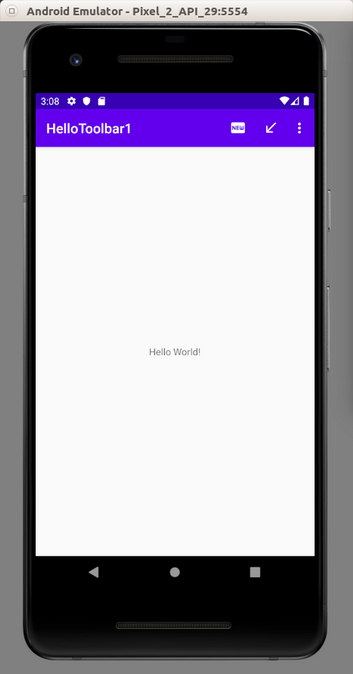
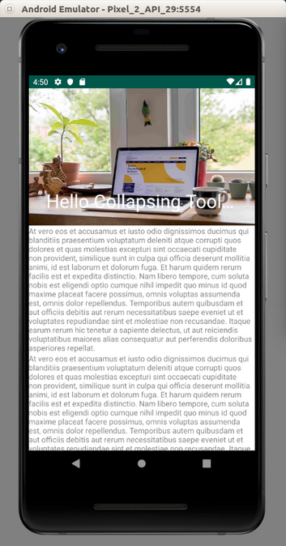

# Toolbar

There is a toolbar and there is an actionbar. A toolbar is more customizable than an actionbar. It’s the thing that occupies a top most place in Android screen.

## Actionbar

Create an empty Activity project. Name it HelloToolbar1.

Add a new menu layout resource in app / res / menu / actions.xml. You have to create a resource directory first.

```xml
<?xml version="1.0" encoding="utf-8"?>
<menu xmlns:android="http://schemas.android.com/apk/res/android"
      xmlns:app="http://schemas.android.com/apk/res-auto">
    <item
            android:id="@+id/newAction"
            android:icon="@drawable/ic_fiber_new_white"
            app:showAsAction="always"
            android:title="@string/new_action"/>
    <item
            android:id="@+id/downloadAction"
            android:icon="@drawable/ic_call_received_white"
            app:showAsAction="ifRoom"
            android:title="@string/download_action"/>
    <item
            android:id="@+id/loginAction"
            android:icon="@drawable/ic_transfer_within_a_station_white"
            app:showAsAction="never"
            android:title="@string/login_action"/>
</menu>
```
There is an interesting property of item node, which is called app:showAsAction. If the value of this property is “always”, the menu button will be shown. If the value is “ifRoom”, the menu button will be shown if there is a space. If the value is “never”, the menu button is hidden within another menu which has three vertical dots.

You must add some drawable vector images to app / res / drawable

Right click drawable folder in Android Studio. Choose New – Vector Asset.

<p align="center">

</p>

Change the name, choose your clip art, and use white color. Add 3 images: ic_fiber_new_white,  ic_call_received_white, ic_transfer_within_a_station_white.

Then you must edit app / res / values / strings.xml.
```xml
<resources>
    <string name="app_name">HelloToolbar1</string>
    <string name="new_action">New</string>
    <string name="download_action">Download</string>
    <string name="login_action">Login</string>
</resources>
```
Edit app / java / com.example.hellotoolbar1 / MainActivity.kt.

```kotlin
package com.example.hellotoolbar1

import androidx.appcompat.app.AppCompatActivity
import android.os.Bundle
import android.util.Log
import android.view.Menu
import android.view.MenuItem

class MainActivity : AppCompatActivity() {

    override fun onCreate(savedInstanceState: Bundle?) {
        super.onCreate(savedInstanceState)
        setContentView(R.layout.activity_main)
    }

    override fun onCreateOptionsMenu(menu: Menu?): Boolean {
        menuInflater.inflate(R.menu.actions, menu)
        return super.onCreateOptionsMenu(menu)
    }

    override fun onOptionsItemSelected(item: MenuItem?): Boolean {
        when (item!!.itemId) {
            R.id.newAction -> {
                Log.d("Menu", "New Action")
                return true
            }
            R.id.downloadAction -> {
                Log.d("Menu", "Download Action")
                return true
            }
            R.id.loginAction -> {
                Log.d("Menu", "Login Action")
                return true
            }
        }
        return super.onOptionsItemSelected(item)
    }
}
```
You create the menu with onCreateOptionsMenu method. You add callbacks to menu with onOptionsItemSelected method.

Run the application and you will get this screen. Click the menu button and check the log.

<p align="center">

</p>

### Theme

You can change the color of the action bar.

Edit app / res / values / colors.xml.

```xml
<?xml version="1.0" encoding="utf-8"?>
<resources>
    <color name="colorPrimary">#008577</color>
    <color name="colorPrimaryDark">#00574B</color>
    <color name="colorAccent">#D81B60</color>
    <color name="colorPurplePrimary">#6200EE</color>
    <color name="colorPurplePrimaryDark">#3700B3</color>
    <color name="colorPurpleAccent">#BB86FC</color>
</resources>
```
Edit app / res / values / styles.xml.
```xml
<resources>
    <!-- Base application theme. -->
    <style name="AppTheme" parent="Theme.AppCompat.Light.DarkActionBar">
        <!-- Customize your theme here. -->
        <item name="colorPrimary">@color/colorPrimary</item>
        <item name="colorPrimaryDark">@color/colorPrimaryDark</item>
        <item name="colorAccent">@color/colorAccent</item>
    </style>
    <style name="AppTheme2" parent="Theme.AppCompat.DayNight.DarkActionBar">
        <item name="colorPrimary">@color/colorPurplePrimary</item>
        <item name="colorPrimaryDark">@color/colorPurplePrimaryDark</item>
        <item name="colorAccent">@color/colorPurpleAccent</item>
    </style>
</resources>
```
Edit app / manifests / AndroidManifest.xml.

Change android:theme value to @style/AppTheme2.
```xml
android:theme="@style/AppTheme2"
```
Run the application and you will get this screen.

<p align="center">

</p>

## Toolbar

You can also use a toolbar as a actionbar replacement.

Create a new empty Activity Android project. Name it HelloToolbar2.

Edit app / java / com.example.hellotoolbar1 / activity_main.xml.

```xml
<?xml version="1.0" encoding="utf-8"?>
<androidx.constraintlayout.widget.ConstraintLayout
        xmlns:android="http://schemas.android.com/apk/res/android"
        xmlns:tools="http://schemas.android.com/tools"
        xmlns:app="http://schemas.android.com/apk/res-auto"
        android:layout_width="match_parent"
        android:layout_height="match_parent"
        tools:context=".MainActivity">

    <androidx.appcompat.widget.Toolbar android:id="@+id/toolbar"
                                       android:layout_width="match_parent"
                                       android:layout_height="wrap_content"
                                       android:background="?attr/colorPrimary"
                                       app:theme="?attr/actionBarTheme"
                                       app:layout_constraintStart_toStartOf="parent"
                                       app:layout_constraintEnd_toEndOf="parent"
                                       app:layout_constraintTop_toTopOf="parent"/>
    <TextView
            android:layout_width="wrap_content"
            android:layout_height="wrap_content"
            android:text="Hello World!"
            app:layout_constraintBottom_toBottomOf="parent"
            app:layout_constraintLeft_toLeftOf="parent"
            app:layout_constraintRight_toRightOf="parent"
            app:layout_constraintTop_toBottomOf="@id/toolbar"/>

</androidx.constraintlayout.widget.ConstraintLayout>
```
Add same pictures of the previous project to drawable directory: ic_call_received_white.xml, ic_fiber_new_white.xml, ic_transfer_within_a_station_white.xml. Add same strings to app / res / values / strings.xml. Add same menu resource file (app / res / menu / actions.xml).

Edit app / java / com.example.hellotoolbar2 / MainActivity.

```kotlin
package com.example.hellotoolbar2

import androidx.appcompat.app.AppCompatActivity
import android.os.Bundle
import android.util.Log
import android.view.Menu
import android.view.MenuItem
import androidx.appcompat.widget.Toolbar

class MainActivity : AppCompatActivity() {

    override fun onCreate(savedInstanceState: Bundle?) {
        super.onCreate(savedInstanceState)
        setContentView(R.layout.activity_main)
        val toolbar = findViewById<Toolbar>(R.id.toolbar)
        toolbar.apply {
            title = "Toolbar Title"
        }
        setSupportActionBar(toolbar)
    }

    override fun onCreateOptionsMenu(menu: Menu): Boolean {
        menuInflater.inflate(R.menu.actions, menu)
        return super.onCreateOptionsMenu(menu)
    }

    override fun onOptionsItemSelected(item: MenuItem): Boolean {
        return when {
            item.itemId == R.id.newAction -> {
                Log.d("menu", "newAction")
                true
            }
            item.itemId == R.id.downloadAction -> {
                Log.d("menu", "downloadAction")
                true
            }
            item.itemId == R.id.loginAction -> {
                Log.d("menu", "loginAction")
                true
            }
            else -> false
        }
    }
}
```
After getting the toolbar, you set the toolbar as support action bar.

The last thing you need to to is to edit app / res / values / styles.xml.

Add two properties, windowActionBar and windowNoTitle.

```xml
<resources>

    <!-- Base application theme. -->
    <style name="AppTheme" parent="Theme.AppCompat.Light.DarkActionBar">
        <!-- Customize your theme here. -->
        <item name="colorPrimary">@color/colorPrimary</item>
        <item name="colorPrimaryDark">@color/colorPrimaryDark</item>
        <item name="colorAccent">@color/colorAccent</item>
        <item name="windowActionBar">false</item>
        <item name="windowNoTitle">true</item>
    </style>

</resources>
```
Run it and you will get this screen.

<p align="center">

</p>

## CollapsingToolbarLayout

You can also have a collapsing toolbar, a specific toolbar which can have different height when you scroll the screen.

Create an empty Activity project. Name it HelloToolbar3.

Edit gradle-wrapper.properties. We need to use a newer version of gradle.
```gradle
distributionUrl=https\://services.gradle.org/distributions/gradle-5.4-all.zip
```
Then edit build.gradle (Module: app).
```gradle
implementation 'com.google.android.material:material:1.0.0'
```

Edit app / res / values / colors.xml.
```xml
<?xml version="1.0" encoding="utf-8"?>
<resources>
    <color name="colorPrimary">#008577</color>
    <color name="colorPrimaryDark">#00574B</color>
    <color name="colorAccent">#D81B60</color>
    <color name="colorWhite">#FFFFFF</color>
    <color name="colorGrey">#858585</color>
</resources>
```
Edit app / res / values / strings.xml.
```xml
<resources>
    <string name="app_name">HelloToolbar3</string>
    <string name="lorem">At vero eos et accusamus et iusto odio dignissimos ducimus qui blanditiis praesentium voluptatum deleniti atque corrupti quos dolores et quas molestias excepturi sint occaecati cupiditate non provident, similique sunt in culpa qui officia deserunt mollitia animi, id est laborum et dolorum fuga. Et harum quidem rerum facilis est et expedita distinctio. Nam libero tempore, cum soluta nobis est eligendi optio cumque nihil impedit quo minus id quod maxime placeat facere possimus, omnis voluptas assumenda est, omnis dolor repellendus. Temporibus autem quibusdam et aut officiis debitis aut rerum necessitatibus saepe eveniet ut et voluptates repudiandae sint et molestiae non recusandae. Itaque earum rerum hic tenetur a sapiente delectus, ut aut reiciendis voluptatibus maiores alias consequatur aut perferendis doloribus asperiores repellat.</string>
    <string name="imageDescription">Computer</string>
</resources>
```

Edit app / res / layout / activity_main.xml.

```xml
<?xml version="1.0" encoding="utf-8"?>
<androidx.coordinatorlayout.widget.CoordinatorLayout
        xmlns:android="http://schemas.android.com/apk/res/android"
        xmlns:app="http://schemas.android.com/apk/res-auto"
        android:layout_width="match_parent"
        android:layout_height="match_parent">

    <com.google.android.material.appbar.AppBarLayout android:id="@+id/app_bar_layout"
                                                     android:layout_width="match_parent"
                                                     android:layout_height="wrap_content"
                                                     android:theme="@style/AppTheme">
        <com.google.android.material.appbar.CollapsingToolbarLayout android:id="@+id/collapsing_toolbar"
                                                                    android:layout_width="match_parent"
                                                                    android:layout_height="250dp"
                                                                    app:contentScrim="@color/colorPrimaryDark"
                                                                    app:layout_scrollFlags="scroll|exitUntilCollapsed">

            <ImageView android:id="@+id/image"
                       android:layout_width="match_parent"
                       android:layout_height="wrap_content"
                       android:contentDescription="@string/imageDescription"
                       android:scaleType="centerCrop"
                       android:background="@drawable/daniel"
                       app:layout_collapseMode="parallax"/>
            <androidx.appcompat.widget.Toolbar android:id="@+id/toolbar"
                                               android:layout_width="match_parent"
                                               android:layout_height="50dp"/>
        </com.google.android.material.appbar.CollapsingToolbarLayout>

        <LinearLayout android:layout_width="match_parent"
                      android:layout_height="wrap_content"
                      android:background="@color/colorWhite"
                      android:orientation="vertical">
            <TextView android:layout_width="match_parent" android:layout_height="wrap_content"
                      android:textColor="@color/colorGrey"
                      android:text="@string/lorem"/>
            <TextView android:layout_width="match_parent" android:layout_height="wrap_content"
                      android:textColor="@color/colorGrey"
                      android:text="@string/lorem"/>
        </LinearLayout>
    </com.google.android.material.appbar.AppBarLayout>
</androidx.coordinatorlayout.widget.CoordinatorLayout>
```
The parent container is CoordinatorLayout.
```xml
<androidx.coordinatorlayout.widget.CoordinatorLayout
        xmlns:android="http://schemas.android.com/apk/res/android"
        xmlns:app="http://schemas.android.com/apk/res-auto"
        android:layout_width="match_parent"
        android:layout_height="match_parent">
...
</androidx.coordinatorlayout.widget.CoordinatorLayout>
```
The direct child of CoordinatorLayout is AppBarLayout.
```xml

<com.google.android.material.appbar.AppBarLayout android:id="@+id/app_bar_layout"
                                                 android:layout_width="match_parent"
                                                 android:layout_height="wrap_content"
                                                 android:theme="@style/AppTheme">
...
</com.google.android.material.appbar.AppBarLayout>
```
The AppBarLayout has two direct children. The first is the collapsing toolbar and the other is the content.

The collapsing toolbar is CollapsingToolbarLayout and has two children. The first is the expanded toolbar which is usually an imageview. The second is the normal toolbar.
```xml
<com.google.android.material.appbar.CollapsingToolbarLayout android:id="@+id/collapsing_toolbar"
                                                            android:layout_width="match_parent"
                                                            android:layout_height="250dp"
                                                            app:contentScrim="@color/colorPrimaryDark"
                                                            app:layout_scrollFlags="scroll|exitUntilCollapsed">

    <ImageView android:id="@+id/image"
               android:layout_width="match_parent"
               android:layout_height="wrap_content"
               android:contentDescription="@string/imageDescription"
               android:scaleType="centerCrop"
               android:background="@drawable/daniel"
               app:layout_collapseMode="parallax"/>
    <androidx.appcompat.widget.Toolbar android:id="@+id/toolbar"
                                       android:layout_width="match_parent"
                                       android:layout_height="50dp"/>
</com.google.android.material.appbar.CollapsingToolbarLayout>
```
There are two properties of CollapsingToolbarLayout which are important, app:contentScrim and app:layout_scrollFlags. The value for app:contentScrim determines the background color of the normal toolbar (the collapsed version). The value for app:layout_scrollFlags that we want is usually scroll|exitUntilCollapsed.

The property which is interesting for ImageView is app:layout_collapseMode. It determines how you collapse the imageview when scrolling to the top. You can try parallax or pin value to see the difference between them.

The second child of AppBarLayout is the content. This can be recyclerview, nestedscrollview. Here, for simplicity, we use linear layout.
```xml
<LinearLayout android:layout_width="match_parent"
              android:layout_height="wrap_content"
              android:background="@color/colorWhite"
              android:orientation="vertical">
    <TextView android:layout_width="match_parent" android:layout_height="wrap_content"
              android:textColor="@color/colorGrey"
              android:text="@string/lorem"/>
    <TextView android:layout_width="match_parent" android:layout_height="wrap_content"
              android:textColor="@color/colorGrey"
              android:text="@string/lorem"/>
</LinearLayout>
```
Lastly don’t forget to add an image in app / res / drawable. Name it daniel.jpg.

Run the application.

<p align="center">

</p>

Scroll to the top. The collapsing toolbar layout will collapse.

<p align="center">

</p>

# Optional Readings

https://developer.android.com/reference/kotlin/android/widget/Toolbar

# Exercise

1. Try to implement collapsable toolbar which has transparent toolbar.