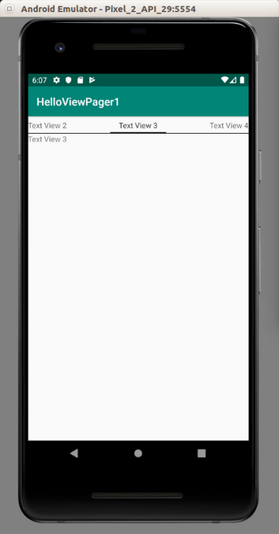

# ViewPager

ViewPager is like a book-like widget. You can swipe page (which is a frame) inside this book.

Create an empty Activity Android project.

Edit build.gradle (Module: app). Add this dependency.
```gradle
implementation 'androidx.legacy:legacy-support-core-ui:1.0.0'
```
The ViewPager is part of Android support library but from now on, you use Android Jetpack. You use androidx namespace. So you use ‘androix.legacy:legacy-support-core-ui:1.0.0’ instead of "com.android.support:support-core-ui:28.0.2". So how do you know the namespace of androidx for particular library which is part of Android Support library.

https://developer.android.com/jetpack/androidx/migrate

Then edit app / res / layout / activity_main.xml.

```xml
<?xml version="1.0" encoding="utf-8"?>
<androidx.viewpager.widget.ViewPager
        xmlns:android="http://schemas.android.com/apk/res/android"
        android:id="@+id/view_pager"
        android:layout_width="match_parent"
        android:layout_height="match_parent">
    <androidx.viewpager.widget.PagerTabStrip android:layout_width="match_parent"
                                             android:layout_height="wrap_content"
                                             android:layout_gravity="top">
    </androidx.viewpager.widget.PagerTabStrip>
</androidx.viewpager.widget.ViewPager>
```
PagerTabStrip is optional. It is an indicator in ViewPager.

Create a new layout resource file, named app / res / layout / full_text_view.xml.

```xml
<?xml version="1.0" encoding="utf-8"?>
<LinearLayout xmlns:android="http://schemas.android.com/apk/res/android"
              android:orientation="vertical"
              android:layout_width="match_parent"
              android:layout_height="match_parent">
    <TextView
            android:text="TextView"
            android:layout_width="match_parent"
            android:layout_height="wrap_content" android:id="@+id/text_view"/>
</LinearLayout>
```
This is the fragment of a single page inside the book (ViewPager).

Let’s create a new class, named app / java / com.example/helloviewpager1 / TextViewFragment.

```kotlin
package com.example.helloviewpager1

import android.content.Context
import android.os.Bundle
import android.view.LayoutInflater
import android.view.View
import android.view.ViewGroup
import android.widget.TextView
import androidx.fragment.app.Fragment


class TextViewFragment : Fragment() {
    private val NUMBER = "number"
    private lateinit var textView : TextView

    companion object {
        fun newInstance(number : Int) = TextViewFragment().apply {
            arguments = Bundle().apply { putInt(NUMBER, number) }
        }

        fun getTitle(context: Context, number: Int) : String {
            return String.format(context.getString(R.string.text_view_string), number)
        }
    }

    override fun onCreateView(
        inflater: LayoutInflater,
        container: ViewGroup?,
        savedInstanceState: Bundle?
    ) : View? {
        val result = inflater.inflate(R.layout.full_text_view, container, false)
        textView = result.findViewById(R.id.text_view)
        return result
    }

    override fun onViewCreated(view : View, savedInstanceState : Bundle?) {
        super.onViewCreated(view, savedInstanceState)
        textView.text = String.format(resources.getString(R.string.text_view_string), arguments!!.getInt(NUMBER))
    }
}
```
As usual, the fragment has static methods, newInstance to create a fragment. The getTitle static method is to get the title for the indicator in the view pager.

In onCreateView, you inflate the layout resource for the fragment of a single page. Then you get the reference for the text view inside the fragment. In onViewCreated, you set the value for the text view.
```kotlin
textView.text = String.format(resources.getString(R.string.text_view_string), arguments!!.getInt(NUMBER))
```
Here, we format the value of the string (R.string.text_view_string) with String.format method.

Edit app / res / values / strings.xml.
```xml
<resources>
    <string name="app_name">HelloViewPager1</string>
    <string name="text_view_string">Text View %1$d</string>
</resources>
```
Notice “%1$d” in the string. “%1$” means the first parameter. The “d” means integer.

Add a new class, app / java / com.example.helloviewpager1 / BasicAdapter which is how the view pager will get the data from.

```kotlin
package com.example.helloviewpager1

import android.content.Context
import androidx.fragment.app.FragmentManager
import androidx.fragment.app.FragmentPagerAdapter


class BasicAdapter(mgr : FragmentManager, private val context : Context) : FragmentPagerAdapter(mgr) {

    override fun getCount() = 10

    override fun getItem(number: Int) = TextViewFragment.newInstance(number)

    override fun getPageTitle(number: Int) = TextViewFragment.getTitle(context, number)

}
```
In getCount, you tell the view pager how many pages it has. In getItem, you give the fragment itself. In getPageTitle, you set the indicator’s string.

Lastly, edit app / java / com.example.helloviewpager1 / MainActivity.
```kotlin
package com.example.helloviewpager1

import android.os.Bundle
import androidx.appcompat.app.AppCompatActivity
import androidx.viewpager.widget.ViewPager


class MainActivity : AppCompatActivity() {
    
    override fun onCreate(savedInstanceState: Bundle?) {
        super.onCreate(savedInstanceState)
        setContentView(R.layout.activity_main)
        
        val viewPager: ViewPager = findViewById(R.id.view_pager)
        viewPager.adapter = BasicAdapter(supportFragmentManager, this)
    }
    
}
```
You get the reference of the view pager. Then you set the adapter of this view pager.

Run the application and you will get this screen.

<p align="center">

</p>

# Optional Readings

https://developer.android.com/reference/androidx/viewpager/widget/ViewPager

https://developer.android.com/training/animation/screen-slide

https://developer.android.com/training/animation/screen-slide-2

# Exercises

1. Create an application which has a view pager but when you scroll, there is an indicator showing that we are scrolling the page in the view pager.