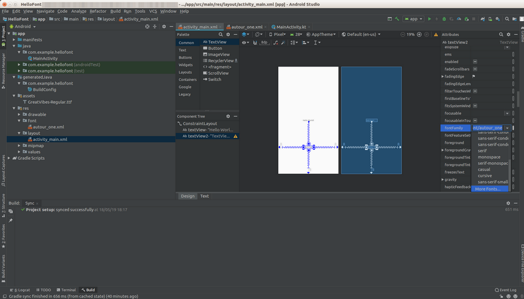
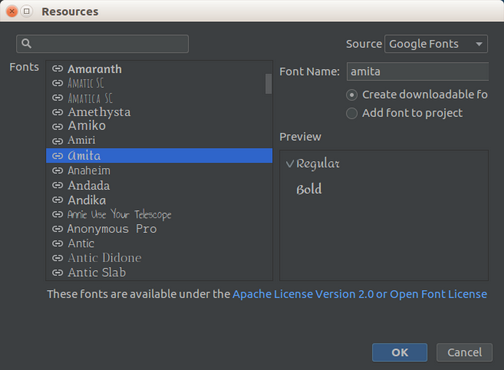
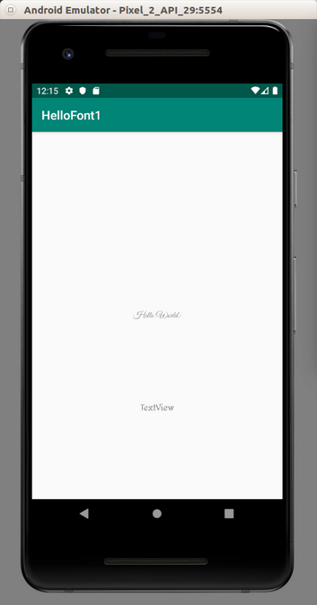

# Font

You can use custom fonts for the text view.

Create an empty Activity Android project. Name it HelloFont1.

Edit app / res / layout / activity_main.xml.

```xml
<?xml version="1.0" encoding="utf-8"?>
<androidx.constraintlayout.widget.ConstraintLayout
        xmlns:android="http://schemas.android.com/apk/res/android"
        xmlns:tools="http://schemas.android.com/tools"
        xmlns:app="http://schemas.android.com/apk/res-auto"
        android:layout_width="match_parent"
        android:layout_height="match_parent"
        tools:context=".MainActivity">

    <TextView
            android:id="@+id/textView"
            android:layout_width="wrap_content"
            android:layout_height="wrap_content"
            android:text="Hello World!"
            app:layout_constraintBottom_toBottomOf="parent"
            app:layout_constraintLeft_toLeftOf="parent"
            app:layout_constraintRight_toRightOf="parent"
            app:layout_constraintTop_toTopOf="parent"/>
    <TextView
            android:text="TextView"
            android:layout_width="wrap_content"
            android:layout_height="wrap_content"
            android:id="@+id/textView2"
            app:layout_constraintTop_toBottomOf="@+id/textView" android:layout_marginBottom="8dp"
            app:layout_constraintBottom_toBottomOf="parent" app:layout_constraintEnd_toEndOf="parent"
            android:layout_marginEnd="8dp" app:layout_constraintStart_toStartOf="parent"
            android:layout_marginStart="8dp"/>

</androidx.constraintlayout.widget.ConstraintLayout>
```
Create assets folder inside app / src / main.

Put font file (with ttf extension) inside assets folder. In my case, I got GreatVibes-Regular.ttf. You can download the font from https://www.1001fonts.com/great-vibes-font.html.

Edit app / java / com.example.hellofont1 / MainActivity.

```kotlin
package com.example.hellofont1

import android.graphics.Typeface
import androidx.appcompat.app.AppCompatActivity
import android.os.Bundle
import android.widget.TextView


class MainActivity : AppCompatActivity() {

    override fun onCreate(savedInstanceState: Bundle?) {
        super.onCreate(savedInstanceState)
        setContentView(R.layout.activity_main)

        val textView = findViewById<TextView>(R.id.textView)
        val typeface = Typeface.createFromAsset(assets, "GreatVibes-Regular.ttf")
        textView.typeface = typeface
    }

}
```

You can get the font (they call it typeface) with Typeface.createFromAsset method.
```kotlin
val typeface = Typeface.createFromAsset(assets, "GreatVibes-Regular.ttf")
```
To change the font, you can set the typeface property of the text view.
```kotlin
textView.typeface = typeface
```
Then open activity_main.xml in design mode (not text mode).

Make sure the second text view on the layout is selected.

<p align="center">

</p>

Then in the right panel, choose fontFamily attribute. Click “More Fonts...”

<p align="center">

</p>

In the dialog, choose any font you like, and make sure “Create downloadable font” option is checked. Then click Ok.

The second text view will use the font you chose. If you open activity_main.xml, you will notice the second text view has additional attribute, whichh is android:fontFamily.

```xml
<TextView
        android:text="TextView"
        android:layout_width="wrap_content"
        android:layout_height="wrap_content"
        android:id="@+id/textView2"
        app:layout_constraintTop_toBottomOf="@+id/textView" android:layout_marginBottom="8dp"
        app:layout_constraintBottom_toBottomOf="parent" app:layout_constraintEnd_toEndOf="parent"
        android:layout_marginEnd="8dp" app:layout_constraintStart_toStartOf="parent"
        android:layout_marginStart="8dp" android:fontFamily="@font/amita"/>
```
Run the application and your application will have two text views, each with different font.

<p align="center">

</p>

# Optional Readings

https://developer.android.com/guide/topics/ui/look-and-feel/downloadable-fonts

https://developer.android.com/guide/topics/ui/look-and-feel/fonts-in-xml

https://developer.android.com/reference/kotlin/android/provider/FontRequest

https://developer.android.com/reference/kotlin/android/provider/FontsContract

# Exercises

1. Create a downloadable fonts programmatically using FontRequest and FontsCotnract.