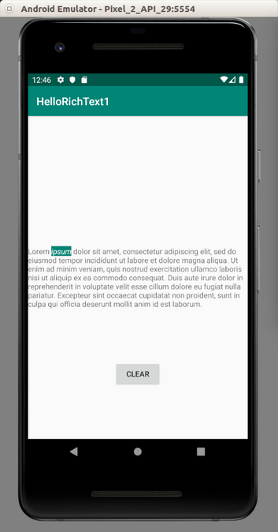
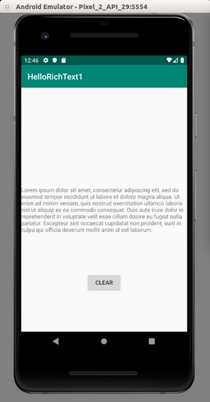

# Rich Text

Other than using WebView, you can use rich text to use style when displaying text. You can add style (background color, italic style, foreground color) to TextView.

Create an empty Activity Android project.

Then edit app / res / values / colors.xml.

```xml
<?xml version="1.0" encoding="utf-8"?>
<resources>
    <color name="colorPrimary">#008577</color>
    <color name="colorPrimaryDark">#00574B</color>
    <color name="colorAccent">#D81B60</color>
    <color name="colorWhite">#FFFFFF</color>
</resources>
```
Then edit app / res / values / strings.xml.

```xml
<resources>
    <string name="app_name">HelloRichText1</string>
    <string name="lorem_ipsum">Lorem ipsum dolor sit amet, consectetur adipiscing elit, sed do eiusmod tempor incididunt ut labore et dolore magna aliqua. Ut enim ad minim veniam, quis nostrud exercitation ullamco laboris nisi ut aliquip ex ea commodo consequat. Duis aute irure dolor in reprehenderit in voluptate velit esse cillum dolore eu fugiat nulla pariatur. Excepteur sint occaecat cupidatat non proident, sunt in culpa qui officia deserunt mollit anim id est laborum.</string>
</resources>
```
Then edit app / res / layout / activity_main.xml.

```xml
<?xml version="1.0" encoding="utf-8"?>
<androidx.constraintlayout.widget.ConstraintLayout
        xmlns:android="http://schemas.android.com/apk/res/android"
        xmlns:tools="http://schemas.android.com/tools"
        xmlns:app="http://schemas.android.com/apk/res-auto"
        android:layout_width="match_parent"
        android:layout_height="match_parent"
        tools:context=".MainActivity">

    <TextView
            android:id="@+id/textView"
            android:layout_width="wrap_content"
            android:layout_height="wrap_content"
            android:text="@string/lorem_ipsum"
            app:layout_constraintBottom_toBottomOf="parent"
            app:layout_constraintLeft_toLeftOf="parent"
            app:layout_constraintRight_toRightOf="parent"
            app:layout_constraintTop_toTopOf="parent"/>

    <Button
            android:text="Clear"
            android:layout_width="wrap_content"
            android:layout_height="wrap_content"
            android:id="@+id/button" android:layout_marginTop="8dp"
            app:layout_constraintTop_toBottomOf="@+id/textView" android:layout_marginBottom="8dp"
            app:layout_constraintBottom_toBottomOf="parent" app:layout_constraintEnd_toEndOf="parent"
            android:layout_marginEnd="8dp" app:layout_constraintStart_toStartOf="parent"
            android:layout_marginStart="8dp"/>

</androidx.constraintlayout.widget.ConstraintLayout>
```

Edit app / java / com.example.hellorichtext1 /  MainActivity.
```kotlin
package com.example.hellorichtext1

import android.graphics.Typeface
import androidx.appcompat.app.AppCompatActivity
import android.os.Bundle
import android.text.SpannableString
import android.text.Spanned
import android.text.style.BackgroundColorSpan
import android.text.style.ForegroundColorSpan
import android.text.style.StyleSpan
import android.widget.Button
import android.widget.TextView
import androidx.core.content.ContextCompat


class MainActivity : AppCompatActivity() {

    override fun onCreate(savedInstanceState: Bundle?) {
        super.onCreate(savedInstanceState)
        setContentView(R.layout.activity_main)

        val textView : TextView = findViewById(R.id.textView)
        val spannable = SpannableString(textView.text)

        findViewById<Button>(R.id.button).setOnClickListener {
            val backgroundSpans = spannable.getSpans(0, spannable.length, BackgroundColorSpan::class.java)
            spannable.removeSpan(backgroundSpans[0])
            val foregroundSpans = spannable.getSpans(0, spannable.length, ForegroundColorSpan::class.java)
            spannable.removeSpan(foregroundSpans[0])
            val styleSpans = spannable.getSpans(0, spannable.length, StyleSpan::class.java)
            spannable.removeSpan(styleSpans[0])
            textView.text = spannable
        }

        val backgroundColor = ContextCompat.getColor(this, R.color.colorPrimary)
        val whiteColor = ContextCompat.getColor(this, R.color.colorWhite)

        spannable.setSpan(BackgroundColorSpan(backgroundColor), 6, 11, Spanned.SPAN_EXCLUSIVE_EXCLUSIVE)
        spannable.setSpan(ForegroundColorSpan(whiteColor), 6, 11, Spanned.SPAN_EXCLUSIVE_EXCLUSIVE)
        spannable.setSpan(StyleSpan(Typeface.ITALIC), 6, 11, Spanned.SPAN_EXCLUSIVE_EXCLUSIVE)

        textView.text = spannable
    }

}
```
First, you must convert the string to SpannableString.
```kotlin
val spannable = SpannableString(textView.text)
```
Then you can set some styles (background color, white color, italic style) to this spannable string.
```kotlin
spannable.setSpan(BackgroundColorSpan(backgroundColor), 6, 11, Spanned.SPAN_EXCLUSIVE_EXCLUSIVE)
spannable.setSpan(ForegroundColorSpan(whiteColor), 6, 11, Spanned.SPAN_EXCLUSIVE_EXCLUSIVE)
spannable.setSpan(StyleSpan(Typeface.ITALIC), 6, 11, Spanned.SPAN_EXCLUSIVE_EXCLUSIVE)
````
You use setSpan method. It accepts the rich text style object, the start index, the end index, and whether you count the start index and the end index inclusively or exclusively.

The list of rich text style can be seen here:
https://developer.android.com/reference/android/text/style/StyleSpan.html

Then you set this spannable string to the text of the text view.

To find the span style from the spannable string, you can use getSpans method.
```kotlin
val backgroundSpans = spannable.getSpans(0, spannable.length, BackgroundColorSpan::class.java)
```
The third parameter is the class (not an instance) of the span style class you are looking for.

To remove this span style, you can use removeSpan method.
```kotlin
spannable.removeSpan(styleSpans[0])
```
Run the application.

<p align="center">

</p>

If you click “CLEAR” button, the span style of “ipsum” word will be removed.

<p align="center">

</p>

# Optional Readings

https://developer.android.com/reference/kotlin/android/text/SpannableString

https://developer.android.com/reference/android/text/style/StyleSpan.html

# Exercises

1. Create a simple rich text editor. So you can select some text, click a button, then the text will be given some style (bold or italic).