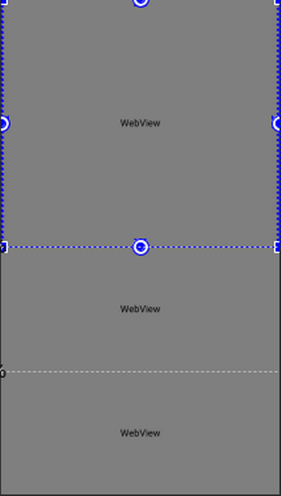
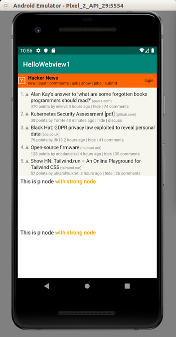

# WebView

WebView is a widget to display html file.

Create an empty Activity Android project. Name it HelloWebview1.

Edit app / manifests / AndroidManifest.xml. Add this line inside manifest node.
```xml
<uses-permission android:name="android.permission.INTERNET" />
```
If your Android application needs to access internet, you need to add the previous line.

Create a folder inside app / src / main and name it assets. Create a folder inside app / src / main / assets and name it html.

Create index.html inside this html folder.
```html
<html>
<head><link rel="stylesheet" type="text/css" href="style.css">
</head>
<body>
<p>This is p node <strong>with strong node</strong>
</body>
</html>
```
Create style.css inside this html folder.
```css
strong {
  color: #faaf00;
}
```
Edit app / res / layout / activity_main.xml resource file.

```xml
<?xml version="1.0" encoding="utf-8"?>
<androidx.constraintlayout.widget.ConstraintLayout
        xmlns:android="http://schemas.android.com/apk/res/android"
        xmlns:tools="http://schemas.android.com/tools"
        xmlns:app="http://schemas.android.com/apk/res-auto"
        android:layout_width="match_parent"
        android:layout_height="match_parent"
        tools:context=".MainActivity">
    <WebView
            android:id="@+id/webViewInternet"
            android:layout_width="match_parent"
            android:layout_height="0dp"
            app:layout_constraintBottom_toTopOf="@+id/guidelineHalf"
            app:layout_constraintLeft_toLeftOf="parent"
            app:layout_constraintRight_toRightOf="parent"
            app:layout_constraintTop_toTopOf="parent">
    </WebView>
    <androidx.constraintlayout.widget.Guideline
            android:orientation="horizontal"
            android:layout_width="wrap_content"
            android:layout_height="1dp"
            app:layout_constraintGuide_percent="0.5"
            android:id="@+id/guidelineHalf"/>
    <WebView
            android:id="@+id/webViewLocal1"
            android:layout_width="match_parent"
            android:layout_height="0dp"
            app:layout_constraintTop_toBottomOf="@+id/guidelineHalf"
            app:layout_constraintLeft_toLeftOf="parent"
            app:layout_constraintRight_toRightOf="parent"
            app:layout_constraintBottom_toTopOf="@+id/guideline3rdQuarter">
    </WebView>
    <androidx.constraintlayout.widget.Guideline
            android:orientation="horizontal"
            android:layout_width="wrap_content"
            android:layout_height="1dp"
            app:layout_constraintGuide_percent="0.75"
            android:id="@+id/guideline3rdQuarter"/>
    <WebView
            android:id="@+id/webViewLocal2"
            android:layout_width="match_parent"
            android:layout_height="0dp"
            app:layout_constraintTop_toBottomOf="@+id/guideline3rdQuarter"
            app:layout_constraintLeft_toLeftOf="parent"
            app:layout_constraintRight_toRightOf="parent"
            app:layout_constraintBottom_toBottomOf="parent">
    </WebView>
</androidx.constraintlayout.widget.ConstraintLayout>
```

Basically you have three webviews in this layout file.

<p align="center">

</p>

Edit app / java / com.example.hellowebview1 / MainActivity.

```kotlin
package com.example.hellowebview1

import android.os.Bundle
import android.webkit.WebView
import androidx.appcompat.app.AppCompatActivity


class MainActivity : AppCompatActivity() {

    override fun onCreate(savedInstanceState: Bundle?) {
        super.onCreate(savedInstanceState)
        setContentView(R.layout.activity_main)

        val webViewInternet : WebView = findViewById(R.id.webViewInternet)
        webViewInternet.loadUrl("https://news.ycombinator.com")

        val webViewLocal1 : WebView = findViewById(R.id.webViewLocal1)
        val cssString = assets.open("html/style.css").bufferedReader().readText()
        webViewLocal1.loadDataWithBaseURL(null, "<html>" +
                "<head>" +
                "<style>" +
                cssString +
                "</style>" +
                "</head>" +
                "<body>" +
                "<p>This is p node <strong>with strong node</strong>" +
                "</body>" +
                "</html>",
            "text/html", "UTF-8",null)

        val webViewLocal2 : WebView = findViewById(R.id.webViewLocal2)
        webViewLocal2.loadUrl("file:///android_asset/html/index.html")
    }

}
```

To load url from internet, you can use loadUrl method as in this line:
```kotlin
webViewInternet.loadUrl("https://news.ycombinator.com")
```
To load html data as in string, you can use loadData method as in this line:
```kotlin
webViewLocal1.loadData("<html>" +
        "<head>" +
        "<style>" +
        cssString +
        "</style>" +
        "</head>" +
        "<body>" +
        "<p>This is p node <strong>with strong node</strong>" +
        "</body>" +
        "</html>",
    "text/html; charset=UTF-8",
    null)
```
The cssString is from css file inside html folder. You can get the content of css file with assets as in this line:
```kotlin
val cssString = assets.open("html/style.css").bufferedReader().readText()
```

You can also load local html file with loadUrl method as in this line.

webViewLocal2.loadUrl("file:///android_asset/html/index.html")

The “file:///android_asset” refers to assets directory.

Run the application and you will see this screen.

<p align="center">

</p>

# Optional Readings

https://developer.android.com/guide/webapps

https://developer.android.com/reference/androidx/webkit/package-summary?hl=en

# Exercises

1. Create a webview with javascript code.