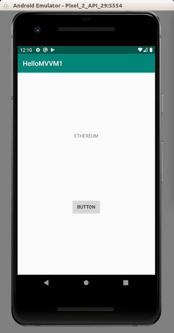
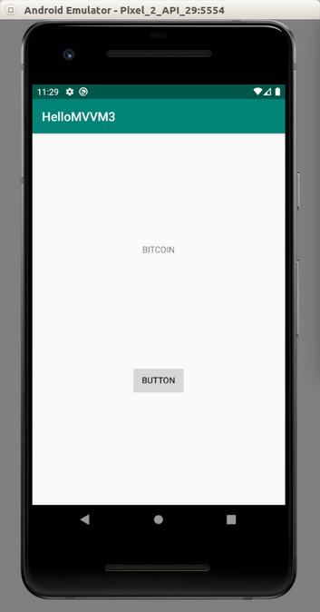
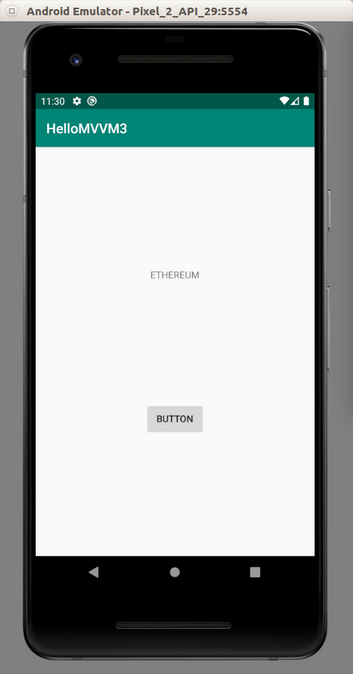
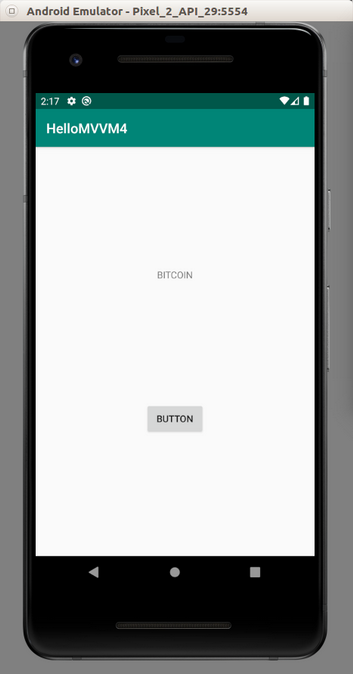
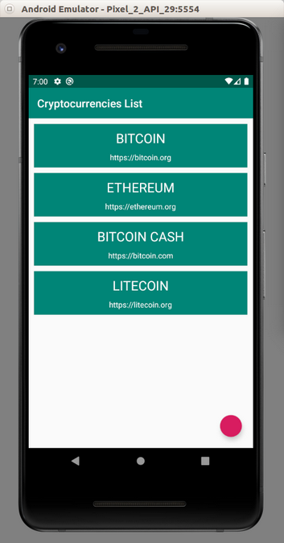
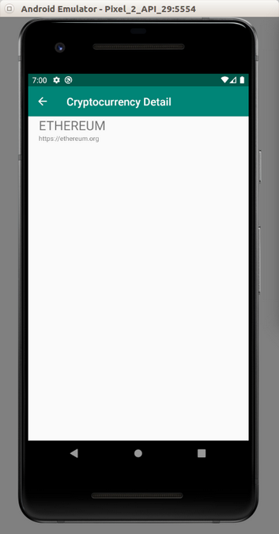
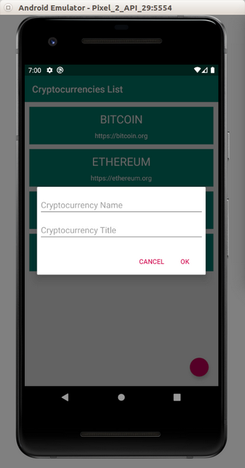
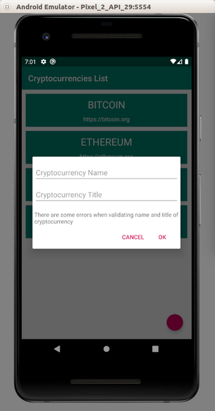
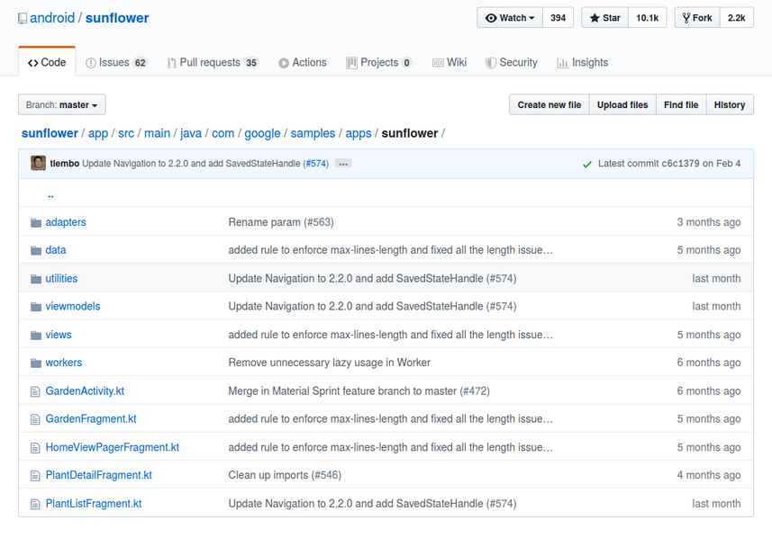

# MVVM (Model View ViewModel)

This is one of the most popular architecture in Android when building application. Some developers use MVC (Model View Controller) architecture. But in this document, we will use MVVM (Model View View Model).

There are three components of MVVM:
1. Model
2. View
3. ViewModel

The first component is Model. Every application has data. So we put the code to handle data inside Model component. Sometimes we call it as repository. This data can come from networking through API or local database.

The second component is View. This is about code for User Interface. We can put Activities, Fragments inside this component.

The third component is ViewModel. This is the link between View and Model. So View does not interact with Model directly. View interacts with Model through ViewModel.

The button is in the View component. Inside the click callback of the button, we can call the code in ViewModel to save the data inside Model component.

We must use JVM 1.8 for using ViewModel extension.

Edit build.gradle (Module: app).

Add these lines inside “android” block.

```gradle
compileOptions {
    sourceCompatibility JavaVersion.VERSION_1_8
    targetCompatibility JavaVersion.VERSION_1_8
}
kotlinOptions {
    jvmTarget = "1.8"
}
```
You also need to add these dependencies.
```gradle
implementation 'androidx.activity:activity-ktx:1.1.0'
```
Then sync it.

## Simplest Case of MVVM

Create a new empty Activity project. Name it HelloMVVM1.

Edit app / res / layout / activity_main.xml. We need to add a button and a text view.

```xml
<?xml version="1.0" encoding="utf-8"?>
<androidx.constraintlayout.widget.ConstraintLayout xmlns:android="http://schemas.android.com/apk/res/android"
    xmlns:app="http://schemas.android.com/apk/res-auto"
    xmlns:tools="http://schemas.android.com/tools"
    android:layout_width="match_parent"
    android:layout_height="match_parent"
    tools:context=".view.MainActivity">

    <TextView
        android:id="@+id/textView"
        android:layout_width="wrap_content"
        android:layout_height="19dp"
        android:text="TextView"
        app:layout_constraintBottom_toTopOf="@+id/button"
        app:layout_constraintEnd_toEndOf="parent"
        app:layout_constraintHorizontal_bias="0.5"
        app:layout_constraintStart_toStartOf="parent"
        app:layout_constraintTop_toTopOf="parent" />

    <Button
        android:id="@+id/button"
        android:layout_width="wrap_content"
        android:layout_height="wrap_content"
        android:text="Button"
        app:layout_constraintBottom_toBottomOf="parent"
        app:layout_constraintEnd_toEndOf="parent"
        app:layout_constraintHorizontal_bias="0.5"
        app:layout_constraintStart_toStartOf="parent"
        app:layout_constraintTop_toBottomOf="@+id/textView" />
</androidx.constraintlayout.widget.ConstraintLayout>
```

Create three packages directory inside app / java / com.example.hellomvvm1: model, view, and viewmodel.

Move MainActivity to app / java / com.example.hellomvvm1 / view.

Create a new class inside “model” package directory, “Database”.

```kotlin
package com.example.hellomvvm1.model


class Database {

    companion object {

        private var cryptocurrencies = "BITCOIN"

        fun getCryptocurrencies() = cryptocurrencies

        fun setCryptocurrencies(newCryptocurrencies : String) {
            cryptocurrencies = newCryptocurrencies
        }
    }
}
```

The data is in “cryptocurrencies” variable which is set to “Bitcoin” initially.

We have a method to retrieve this data and to change the data, which are “getCryptocurrencies” and “setCryptocurrencies”.

Create a new class inside “viewmodel” package directory, “BasicViewModel”

```kotlin
package com.example.hellomvvm1.viewmodel

import androidx.lifecycle.ViewModel
import com.example.hellomvvm1.model.Database


class BasicViewModel : ViewModel() {

    fun setCryptocurrencies(newCryptocurrencies : String) {
        Database.setCryptocurrencies(newCryptocurrencies.toUpperCase())
    }

    fun getCryptocurrencies(): String = Database.getCryptocurrencies()

}
```

In this view model class, we basically interact with model class. We get the data from the model class, which is “Database”. We also put the logic inside view model class. In this case, the logic is to make the input uppercased.

Lastly, we must edit MainActivity which is located inside “view” package folder.

```kotlin
package com.example.hellomvvm1.view

import androidx.appcompat.app.AppCompatActivity
import android.os.Bundle
import android.widget.Button
import android.widget.TextView
import androidx.activity.viewModels
import com.example.hellomvvm1.R
import com.example.hellomvvm1.viewmodel.BasicViewModel


class MainActivity : AppCompatActivity() {

    private lateinit var textView: TextView
    private lateinit var button: Button
    private val viewModel: BasicViewModel by viewModels()

    override fun onCreate(savedInstanceState: Bundle?) {
        super.onCreate(savedInstanceState)
        setContentView(R.layout.activity_main)

        textView = findViewById(R.id.textView)
        button = findViewById(R.id.button)

        button.setOnClickListener {
            val newCryptocurrency = "Ethereum"
            viewModel.setCryptocurrencies(newCryptocurrency)
            setText()
        }

        setText()
    }

    private fun setText() {
        textView.text = viewModel.getCryptocurrencies()
    }
}
```

We add a callback to a button to update data. Inside the callback, we use view model class to alter the data.

We get the data from view model class.

To get the view model itself, we can use “viewModels”.
```kotlin
    private val viewModel: BasicViewModel by viewModels()
```
If we ran the application, we would get this screen.

<p align="center">

</p>

If we clicked the button, we would get this screen.

<p align="center">

</p>

## LiveData

Usually we use LiveData with ViewModel. LiveData is an observer on which we can notify the View class that the data has been changed. So we don’t have to do the job manually anymore in the View class.

Create a new Activity project. Name it HelloMVVM2. 

Edit app / res / layout / activity_main.xml. We need to have a text view and a button.
```xml
<?xml version="1.0" encoding="utf-8"?>
<androidx.constraintlayout.widget.ConstraintLayout xmlns:android="http://schemas.android.com/apk/res/android"
    xmlns:app="http://schemas.android.com/apk/res-auto"
    xmlns:tools="http://schemas.android.com/tools"
    android:layout_width="match_parent"
    android:layout_height="match_parent"
    tools:context=".view.MainActivity">

    <TextView
        android:id="@+id/textView"
        android:layout_width="wrap_content"
        android:layout_height="19dp"
        android:text="TextView"
        app:layout_constraintBottom_toTopOf="@+id/button"
        app:layout_constraintEnd_toEndOf="parent"
        app:layout_constraintHorizontal_bias="0.5"
        app:layout_constraintStart_toStartOf="parent"
        app:layout_constraintTop_toTopOf="parent" />

    <Button
        android:id="@+id/button"
        android:layout_width="wrap_content"
        android:layout_height="wrap_content"
        android:text="Button"
        app:layout_constraintBottom_toBottomOf="parent"
        app:layout_constraintEnd_toEndOf="parent"
        app:layout_constraintHorizontal_bias="0.5"
        app:layout_constraintStart_toStartOf="parent"
        app:layout_constraintTop_toBottomOf="@+id/textView" />
</androidx.constraintlayout.widget.ConstraintLayout>
```

Create three packages directory inside app / java / com.example.hellomvvm2: model, view, and viewmodel.

Move MainActivity to app / java / com.example.hellomvvm2 / view.

Create a new class inside “model” package directory, “Database”.

```kotlin
package com.example.hellomvvm2.model


class Database {

    companion object {

        private var cryptocurrencies = "BITCOIN"

        fun getCryptocurrencies() = cryptocurrencies

        fun setCryptocurrencies(newCryptocurrencies : String) {
            cryptocurrencies = newCryptocurrencies
        }
    }
}
```

Create a new class inside “viewmodel” package directory, “BasicViewModel”.

```kotlin
package com.example.hellomvvm2.viewmodel

import androidx.lifecycle.LiveData
import androidx.lifecycle.MutableLiveData
import androidx.lifecycle.ViewModel
import com.example.hellomvvm2.model.Database
import java.util.*


class BasicViewModel : ViewModel() {

    private val cryptocurrency : MutableLiveData<String> = MutableLiveData(Database.getCryptocurrencies())

    fun setCryptocurrencies(newCryptocurrencies : String) {
        Database.setCryptocurrencies(newCryptocurrencies.toUpperCase(Locale.getDefault()))
        cryptocurrency.value = Database.getCryptocurrencies()
    }

    fun getCryptocurrencies(): LiveData<String> = cryptocurrency

}
```
The data is a string from “Database” class. But we wrap it in `MutableLiveData<String>`. MutableLiveData is a LiveData which is editable. LiveData is a read version of MutableLiveData.

```kotlin
private val cryptocurrency : MutableLiveData<String> = MutableLiveData(Database.getCryptocurrencies())
```

We expose the LiveData version of the data to the world.

```kotlin
fun getCryptocurrencies(): LiveData<String> = cryptocurrency
```

To change the value inside LiveData, we must use “.value” property of the LiveData.

```kotlin
cryptocurrency.value = Database.getCryptocurrencies()
```

Edit MainActivity which is in “view” package directory.

```kotlin
package com.example.hellomvvm2.view

import androidx.appcompat.app.AppCompatActivity
import android.os.Bundle
import android.widget.Button
import android.widget.TextView
import androidx.activity.viewModels
import androidx.lifecycle.Observer
import com.example.hellomvvm2.R
import com.example.hellomvvm2.viewmodel.BasicViewModel


class MainActivity : AppCompatActivity() {

    private lateinit var textView: TextView
    private lateinit var button: Button
    private val viewModel: BasicViewModel by viewModels()

    override fun onCreate(savedInstanceState: Bundle?) {
        super.onCreate(savedInstanceState)
        setContentView(R.layout.activity_main)

        textView = findViewById(R.id.textView)
        button = findViewById(R.id.button)

        val cryptocurrencyObserver = Observer<String> {
            textView.text = it
        }
        viewModel.getCryptocurrencies().observe(this, cryptocurrencyObserver)

        button.setOnClickListener {
            val newCryptocurrency = "Ethereum"
            viewModel.setCryptocurrencies(newCryptocurrency)
        }
    }

}
```

We create an observer for String data. In that subscription, we set the text of the text view. Later we attach this observation on the view model class. “this” refers to MainActivity. So our observation can follow the Activity’s lifecycle.

```kotlin
    val cryptocurrencyObserver = Observer<String> {
                textView.text = it
            }
            viewModel.getCryptocurrencies().observe(this, cryptocurrencyObserver)
```
If we ran the application, we would get this screen.

<p align="center">

</p>

If we clicked the button, we would get this screen.

<p align="center">

</p>

As we can see the subscription in the observer will change the text in the text view. We don’t have to do that manually anymore. We just change the value in live data.

## Data Binding

We can connect data between view model and view with data binding. So we don’t have to manipulate User Interface manually.

Create a new empty Activity project manually. Name it HelloMVVM3.

Edit build.gradle (Module: app).

Add this block inside “android” block.
```gradle
dataBinding {
    enabled true
}
```

Create three packages directory inside app / java / com.example.hellomvvm3: model, view, and viewmodel.

Move MainActivity to app / java / com.example.hellomvvm3 / view.

Create a new class inside “model” package directory, “Database”.

```kotlin
package com.example.hellomvvm3.model


class Database {

    companion object {

        private var cryptocurrencies = "BITCOIN"

        fun getCryptocurrencies() = cryptocurrencies

        fun setCryptocurrencies(newCryptocurrencies : String) {
            cryptocurrencies = newCryptocurrencies
        }
    }
}
```

Create a new class inside “viewmodel” package directory, “BasicViewModel”.
```kotlin
package com.example.hellomvvm3.viewmodel

import androidx.lifecycle.LiveData
import androidx.lifecycle.MutableLiveData
import androidx.lifecycle.ViewModel
import com.example.hellomvvm3.model.Database
import java.util.*


class BasicViewModel : ViewModel() {

    private val cryptocurrency : MutableLiveData<String> = MutableLiveData(Database.getCryptocurrencies())

    fun setCryptocurrencies(newCryptocurrencies : String) {
        Database.setCryptocurrencies(newCryptocurrencies.toUpperCase(Locale.getDefault()))
        cryptocurrency.value = Database.getCryptocurrencies()
    }

    fun getCryptocurrencies(): LiveData<String> = cryptocurrency

}
```

Edit app / res / layout / activity_main.xml. Create a button and a text view.
```xml
<?xml version="1.0" encoding="utf-8"?>
<layout xmlns:android="http://schemas.android.com/apk/res/android"
    xmlns:app="http://schemas.android.com/apk/res-auto">

    <data>
        <variable
            name="viewmodel"
            type="com.example.hellomvvm3.viewmodel.BasicViewModel" />
    </data>

    <androidx.constraintlayout.widget.ConstraintLayout
        xmlns:tools="http://schemas.android.com/tools"
        android:layout_width="match_parent"
        android:layout_height="match_parent"
        tools:context=".view.MainActivity">

        <TextView
            android:id="@+id/textView"
            android:layout_width="wrap_content"
            android:layout_height="19dp"
            android:text="@{viewmodel.getCryptocurrencies()}"
            app:layout_constraintBottom_toTopOf="@+id/button"
            app:layout_constraintEnd_toEndOf="parent"
            app:layout_constraintHorizontal_bias="0.5"
            app:layout_constraintStart_toStartOf="parent"
            app:layout_constraintTop_toTopOf="parent" />

        <Button
            android:id="@+id/button"
            android:layout_width="wrap_content"
            android:layout_height="wrap_content"
            android:text="Button"
            android:onClick='@{() -> viewmodel.setCryptocurrencies("Ethereum")}'
            app:layout_constraintBottom_toBottomOf="parent"
            app:layout_constraintEnd_toEndOf="parent"
            app:layout_constraintHorizontal_bias="0.5"
            app:layout_constraintStart_toStartOf="parent"
            app:layout_constraintTop_toBottomOf="@+id/textView" />
    </androidx.constraintlayout.widget.ConstraintLayout>
</layout>
```

We can put an instance of ViewModel inside this layout with “data” node.
```xml
<data>
    <variable
        name="viewmodel"
        type="com.example.hellomvvm3.viewmodel.BasicViewModel" />
</data>
```

Notice in TextView node, we set the value for “android:text” with “viewmodel” variable.
```xml
<TextView
    ...
    android:text="@{viewmodel.getCryptocurrencies()}"
    ... />
```
Notice in Button node, we set the value for “android:onClick” with a method from “viewmodel” variable.
```xml
<Button
    ...
    android:onClick='@{() -> viewmodel.setCryptocurrencies("Ethereum")}'
    ... />
```
Edit MainActivity.

```kotlin
package com.example.hellomvvm3.view

import androidx.appcompat.app.AppCompatActivity
import android.os.Bundle
import androidx.activity.viewModels
import androidx.databinding.DataBindingUtil
import com.example.hellomvvm3.R
import com.example.hellomvvm3.databinding.ActivityMainBinding
import com.example.hellomvvm3.viewmodel.BasicViewModel


class MainActivity : AppCompatActivity() {

    private val viewModel: BasicViewModel by viewModels()

    override fun onCreate(savedInstanceState: Bundle?) {
        super.onCreate(savedInstanceState)

        val binding : ActivityMainBinding =
            DataBindingUtil.setContentView(this, R.layout.activity_main)

        binding.viewmodel = viewModel
        binding.lifecycleOwner = this
    }
}
```

We delete the “setContentView” line first because we want to use DataBindingUtil to do “setContentView” method.
```kotlin
val binding : ActivityMainBinding =
            DataBindingUtil.setContentView(this, R.layout.activity_main)
```

ActivityMainBinding class is generated from “activity_main” layout resource file.

Then we can set the “viewmodel” property of the binding.

```kotlin
binding.viewmodel = viewModel
```
Then we can set the lifecyleOwner property of the binding. This is important. Otherwise, the callback of the button would not work.
```kotlin
binding.lifecycleOwner = this
```
If we ran the application, we would get this screen.

<p align="center">

</p>

If we clicked the button, we would get this output.

<p align="center">

</p>

## AndroidViewModel

We use ViewModel class. But if we want to get the context of the application, we need to use AndroidViewModel.

Create a new empty Activity project application. Name it HelloMVVM4.

Edit app / res / layout / activity_main.xml. We need to have a text view and a button.

```xml
<?xml version="1.0" encoding="utf-8"?>
<androidx.constraintlayout.widget.ConstraintLayout xmlns:android="http://schemas.android.com/apk/res/android"
    xmlns:app="http://schemas.android.com/apk/res-auto"
    xmlns:tools="http://schemas.android.com/tools"
    android:layout_width="match_parent"
    android:layout_height="match_parent"
    tools:context=".view.MainActivity">

    <TextView
        android:id="@+id/textView"
        android:layout_width="wrap_content"
        android:layout_height="19dp"
        android:text="TextView"
        app:layout_constraintBottom_toTopOf="@+id/button"
        app:layout_constraintEnd_toEndOf="parent"
        app:layout_constraintHorizontal_bias="0.5"
        app:layout_constraintStart_toStartOf="parent"
        app:layout_constraintTop_toTopOf="parent" />

    <Button
        android:id="@+id/button"
        android:layout_width="wrap_content"
        android:layout_height="wrap_content"
        android:text="Button"
        app:layout_constraintBottom_toBottomOf="parent"
        app:layout_constraintEnd_toEndOf="parent"
        app:layout_constraintHorizontal_bias="0.5"
        app:layout_constraintStart_toStartOf="parent"
        app:layout_constraintTop_toBottomOf="@+id/textView" />
</androidx.constraintlayout.widget.ConstraintLayout>
```

Create three packages directory inside app / java / com.example.hellomvvm4: model, view, and viewmodel.

Move MainActivity to app / java / com.example.hellomvvm4 / view.

Create a new class inside “model” package directory, “Database”.

```kotlin
package com.example.hellomvvm2.model


class Database {

    companion object {

        private var cryptocurrencies = "BITCOIN"

        fun getCryptocurrencies() = cryptocurrencies

        fun setCryptocurrencies(newCryptocurrencies : String) {
            cryptocurrencies = newCryptocurrencies
        }
    }
}
```

Create a new class inside “viewmodel” package directory, “BasicAndroidViewModel”.

```kotlin
package com.example.hellomvvm4.viewmodel

import android.app.Application
import android.widget.Toast
import androidx.lifecycle.AndroidViewModel
import androidx.lifecycle.LiveData
import androidx.lifecycle.MutableLiveData
import com.example.hellomvvm4.model.Database
import java.util.*


class BasicAndroidViewModel(application: Application) : AndroidViewModel(application) {

    private val cryptocurrency : MutableLiveData<String> = MutableLiveData(Database.getCryptocurrencies())
    private var app : Application = application

    fun setCryptocurrencies(newCryptocurrencies : String) {
        Database.setCryptocurrencies(newCryptocurrencies.toUpperCase(Locale.getDefault()))
        cryptocurrency.value = Database.getCryptocurrencies()
        createToast()
    }

    fun getCryptocurrencies(): LiveData<String> = cryptocurrency

    private fun createToast() {
        val text = "Updating Cryptocurrency"
        val duration = Toast.LENGTH_SHORT

        val toast = Toast.makeText(app, text, duration)
        toast.show()
    }
}
```

With AndroidViewModel, we must pass “Application” instance in the constructor.

In the “createToast” model, we can use “Application” instance which is a context to create a Toast object.

```kotlin
private var app : Application = application
...
val toast = Toast.makeText(app, text, duration)
```

Edit MainActivity.

```kotlin
package com.example.hellomvvm4.view

import androidx.appcompat.app.AppCompatActivity
import android.os.Bundle
import android.widget.Button
import android.widget.TextView
import androidx.activity.viewModels
import androidx.lifecycle.Observer
import com.example.hellomvvm4.R
import com.example.hellomvvm4.viewmodel.BasicAndroidViewModel


class MainActivity : AppCompatActivity() {

    private lateinit var textView: TextView
    private lateinit var button: Button
    private val viewModel: BasicAndroidViewModel by viewModels()

    override fun onCreate(savedInstanceState: Bundle?) {
        super.onCreate(savedInstanceState)
        setContentView(R.layout.activity_main)

        textView = findViewById(R.id.textView)
        button = findViewById(R.id.button)

        val cryptocurrencyObserver = Observer<String> {
            textView.text = it
        }
        viewModel.getCryptocurrencies().observe(this, cryptocurrencyObserver)

        button.setOnClickListener {
            val newCryptocurrency = "Ethereum"
            viewModel.setCryptocurrencies(newCryptocurrency)
        }
    }

}
```

If we ran the application, we would get this screen.

<p align="center">

</p>

If we clicked the button, we would get the toast and the text would change.

<p align="center">

</p>

## MVVM with RecyclerView and Navigation Architecture

We will create an application which uses MVVM architecture, RecyclerView, and Navigation Architecture.

Create an empty Activity project. Name it HelloMVVM5.

Edit build.gradle (Project: HelloMVVM5). We need to install Navigation plugin.

Add this classpath inside “dependencies” block.

```gradle
classpath "androidx.navigation:navigation-safe-args-gradle-plugin:2.2.1"
```

Edit build.gradle (Module: app).

Apply navigation safeargs plugin. Add this “apply” line on top of the gradle file.
```gradle
apply plugin: 'androidx.navigation.safeargs.kotlin'
```
Upgrade JVM to 1.8. Add these blocks inside “android” block.

```gradle
compileOptions {
    sourceCompatibility JavaVersion.VERSION_1_8
    targetCompatibility JavaVersion.VERSION_1_8
}
kotlinOptions {
    jvmTarget = "1.8"
}
```

Add these dependencies.
```gradle
implementation 'androidx.activity:activity-ktx:1.1.0'
implementation "androidx.navigation:navigation-fragment-ktx:2.2.1"
implementation "androidx.navigation:navigation-ui-ktx:2.2.1"
```

Because we want to use Toolbar, we have to edit app / res / values / styles.xml. Add these two “item” nodes inside “style” node.
```xml
<item name="windowActionBar">false</item>
<item name="windowNoTitle">true</item>
```
Then create a new style for the toolbar. Add these lines inside “resources” node.
```xml
<style name="ToolbarTheme" parent="@style/ThemeOverlay.AppCompat.ActionBar">
    <!-- Customize color of navigation drawer icon and back arrow -->
    <item name="colorControlNormal">@color/colorWhite</item>
</style>
```
Edit app / res / values / strings.xml.
```xml
<resources>
    <string name="app_name">HelloMVVM5</string>
    <string name="cryptocurrency_name">Cryptocurrency Name</string>
    <string name="cryptocurrency_title">Cryptocurrency Title</string>
    <string name="dialog_ok">OK</string>
    <string name="dialog_cancel">Cancel</string>
    <string name="dialog_validating">There are some errors when validating name and title of cryptocurrency</string>
</resources>
```
Edit app / res / values / colors.xml.
```xml
<?xml version="1.0" encoding="utf-8"?>
<resources>
    <color name="colorPrimary">#008577</color>
    <color name="colorPrimaryDark">#00574B</color>
    <color name="colorAccent">#D81B60</color>
    <color name="colorWhite">#FFFFFF</color>
</resources>
```

Create “navigation” directory inside app / res. Then create a navigation file, app / res / navigation / main_nav_graph.xml.

```xml
<?xml version="1.0" encoding="utf-8"?>
<navigation xmlns:android="http://schemas.android.com/apk/res/android"
    xmlns:app="http://schemas.android.com/apk/res-auto"
    app:startDestination="@id/list"
    android:id="@+id/main_nav_graph">
    <fragment
        android:id="@+id/list"
        android:name="com.example.hellomvvm5.view.ListFragment"
        android:label="Cryptocurrencies List">
        <action
            android:id="@+id/goToDetailFragment"
            app:destination="@id/detail"/>
    </fragment>
    <fragment
        android:id="@+id/detail"
        android:name="com.example.hellomvvm5.view.DetailFragment"
        android:label="Cryptocurrency Detail">
        <argument
            android:name="parameterFromListFragment"
            app:argType="string"/>
    </fragment>
</navigation>
```

We have two screens or fragments.  The list fragment which lists rows of cryptocurrencies and the detail fragment which shows one specific cryptocurrency. We pass an argument to the detail fragment from the list fragment.

Edit app / res / layout / fragment_row.xml. This is the row of the cryptocurrency.

```xml
<?xml version="1.0" encoding="utf-8"?>
<LinearLayout xmlns:android="http://schemas.android.com/apk/res/android"
    android:orientation="vertical"
    android:layout_width="match_parent"
    android:gravity="center"
    android:background="@color/colorPrimary"
    android:layout_marginTop="10dp"
    android:layout_marginStart="10dp"
    android:layout_marginEnd="10dp"
    android:layout_height="80sp">
    <TextView
        android:text="TextView"
        android:layout_marginTop="10dp"
        android:textColor="@color/colorWhite"
        android:textSize="24sp"
        android:layout_width="wrap_content"
        android:layout_height="wrap_content" android:id="@+id/nameRowTextView" android:layout_weight="1"/>
    <TextView
        android:text="TextView"
        android:textColor="@color/colorWhite"
        android:layout_width="wrap_content"
        android:layout_height="wrap_content" android:id="@+id/titleRowTextView" android:layout_weight="1"/>
</LinearLayout>
```

Basically there are two text views inside a row: The name of the cryptocurrency and other label.

Edit app / res / layout / fragment_list.xml.

```xml
<?xml version="1.0" encoding="utf-8"?>
<androidx.coordinatorlayout.widget.CoordinatorLayout
    android:layout_height="match_parent"
    android:layout_width="match_parent"
    xmlns:android="http://schemas.android.com/apk/res/android">
    <androidx.recyclerview.widget.RecyclerView
        android:id="@+id/list"
        android:layout_width="match_parent"
        android:layout_height="match_parent">
    </androidx.recyclerview.widget.RecyclerView>

    <com.google.android.material.floatingactionbutton.FloatingActionButton
        android:id="@+id/floatingButton"
        android:layout_width="40sp"
        android:layout_height="40sp"
        android:layout_gravity="bottom|end"
        android:layout_marginBottom="20sp"
        android:layout_marginEnd="20sp"
        />
</androidx.coordinatorlayout.widget.CoordinatorLayout>
```

In the list fragment, we have one recyclerview and one floating button.

Edit app / res / layout / fragment_detail.xml. This is the fragment of the detail of the cryptocurrency

```xml
<?xml version="1.0" encoding="utf-8"?>
<LinearLayout xmlns:android="http://schemas.android.com/apk/res/android"
    android:orientation="vertical"
    android:id="@+id/detail"
    android:layout_width="match_parent"
    android:layout_height="match_parent">
    <TextView
        android:text="Bitcoin"
        android:layout_marginStart="20dp"
        android:textSize="24sp"
        android:layout_width="match_parent"
        android:layout_height="wrap_content" android:id="@+id/nameTextView"/>
    <TextView
        android:text="https://bitcoin.org"
        android:layout_marginStart="20dp"
        android:textSize="12sp"
        android:layout_width="match_parent"
        android:layout_height="wrap_content" android:id="@+id/titleTextView"/>
</LinearLayout>
```
Then we need a layout for showing a dialog for creating a new cryptocurrency.

```xml
<?xml version="1.0" encoding="utf-8"?>
<LinearLayout xmlns:android="http://schemas.android.com/apk/res/android"
    android:orientation="vertical" android:layout_width="match_parent"
    android:layout_height="match_parent">
    <EditText
        android:id="@+id/name"
        android:layout_width="match_parent"
        android:layout_height="wrap_content"
        android:layout_marginTop="16dp"
        android:layout_marginStart="4dp"
        android:layout_marginEnd="4dp"
        android:layout_marginBottom="4dp"
        android:hint="@string/cryptocurrency_name" />
    <EditText
        android:id="@+id/title"
        android:layout_width="match_parent"
        android:layout_height="wrap_content"
        android:layout_marginTop="4dp"
        android:layout_marginStart="4dp"
        android:layout_marginEnd="4dp"
        android:layout_marginBottom="16dp"
        android:fontFamily="sans-serif"
        android:hint="@string/cryptocurrency_title"/>

    <TextView
        android:id="@+id/error"
        android:layout_marginStart="4dp"
        android:layout_width="match_parent"
        android:layout_height="wrap_content"
        android:text="@string/dialog_validating" />

</LinearLayout>
```

There are two edit texts and one text view for showing error.

Edit app / res / layout / activity_main.xml.
```xml
<?xml version="1.0" encoding="utf-8"?>
<androidx.constraintlayout.widget.ConstraintLayout
    xmlns:android="http://schemas.android.com/apk/res/android"
    xmlns:tools="http://schemas.android.com/tools"
    xmlns:app="http://schemas.android.com/apk/res-auto"
    android:layout_width="match_parent"
    android:layout_height="match_parent"
    tools:context=".view.MainActivity">
    <androidx.appcompat.widget.Toolbar
        android:id="@+id/toolbar"
        android:layout_width="match_parent"
        android:layout_height="wrap_content"
        android:background="?attr/colorPrimary"
        app:layout_constraintEnd_toEndOf="parent"
        app:layout_constraintStart_toStartOf="parent"
        app:layout_constraintTop_toTopOf="parent"
        app:titleTextColor="@color/colorWhite"
        app:theme="@style/ToolbarTheme" />
    <fragment
        android:id="@+id/nav_host"
        android:name="androidx.navigation.fragment.NavHostFragment"
        android:layout_width="0dp"
        android:layout_height="0dp"
        app:defaultNavHost="true"
        app:layout_constraintBottom_toBottomOf="parent"
        app:layout_constraintEnd_toEndOf="parent"
        app:layout_constraintStart_toStartOf="parent"
        app:layout_constraintTop_toBottomOf="@id/toolbar"
        app:navGraph="@navigation/main_nav_graph" />
</androidx.constraintlayout.widget.ConstraintLayout>
```
We have a toolbar and a fragment where we put the list fragment or the detail fragment.

Create three directories inside app / java / com.example.hellomvvm5: “model”, “view”, “viewmodel”. Move MainActivity to “view” directory.

### Model

Create app / java / com.example.hellomvvm5 / model / CryptocurrencyModel.

```kotlin
package com.example.hellomvvm5.model


data class CryptocurrencyModel (
    val name: String,
    val title: String
)
```
Basically our cryptocurrency model has two attributes.

Create app / java / com.example.hellomvvm5 / model / Database.

```kotlin
package com.example.hellomvvm5.model


class Database {

    companion object {

        private val cryptocurrencies = mutableMapOf(
            0 to CryptocurrencyModel(
                name = "BITCOIN",
                title = "https://bitcoin.org"
            ),
            1 to CryptocurrencyModel(
                name = "ETHEREUM",
                title = "https://ethereum.org"
            ),
            2 to CryptocurrencyModel(
                name = "BITCOIN CASH",
                title = "https://bitcoin.com"
            ),
            3 to CryptocurrencyModel(
                name = "LITECOIN",
                title = "https://litecoin.org"
            )
        )

        fun getCryptocurrencies() = cryptocurrencies

        fun addToCryptocurrencies(newCryptocurrency : CryptocurrencyModel) {
            cryptocurrencies[cryptocurrencies.count()] = newCryptocurrency
        }

        fun findCryptocurrency(name : String) : CryptocurrencyModel? {
            var cryptocurrencyModel : CryptocurrencyModel? = null
            for ((_, value) in cryptocurrencies) {
                if (value.name==name) {
                    cryptocurrencyModel = value
                    break
                }
            }
            return cryptocurrencyModel
        }
    }
}
```
The data is in “cryptocurrencies” variable. We have a method to add a cryptocurrency and a amethod to return cryptocurrencies. We also have a method to find a cryptocurrency based on the name.

### ViewModel

Create a viewmodel for the list fragment, app / java / com.example.hellomvvm5 / viewmodel / CryptocurrenciesViewModel.

```kotlin
package com.example.hellomvvm5.viewmodel

import androidx.lifecycle.LiveData
import androidx.lifecycle.MutableLiveData
import androidx.lifecycle.ViewModel
import com.example.hellomvvm5.model.CryptocurrencyModel
import com.example.hellomvvm5.model.Database
import java.util.*


class CryptocurrenciesViewModel : ViewModel() {

    private val cryptocurrencies : MutableLiveData<MutableMap<Int, CryptocurrencyModel>> = MutableLiveData(Database.getCryptocurrencies())
    private val errorMode : MutableLiveData<Boolean> = MutableLiveData(false)

    fun validateCryptocurrencies(name : String, title : String) {
        val upperCasedName = name.toUpperCase(Locale.getDefault())
        errorMode.value = (upperCasedName.isEmpty() or title.isEmpty() or (Database.findCryptocurrency(upperCasedName) != null))
    }

    fun clearError() {
        errorMode.value = false
    }

    fun addToCryptocurrencies(name : String, title : String) {
        val upperCaseName = name.toUpperCase(Locale.getDefault())
        val newCryptocurrency = CryptocurrencyModel(upperCaseName, title)
        Database.addToCryptocurrencies(newCryptocurrency)
        cryptocurrencies.value = Database.getCryptocurrencies()
    }

    fun getCryptocurrencies(): LiveData<MutableMap<Int, CryptocurrencyModel>> = cryptocurrencies

    fun isError(): LiveData<Boolean> = errorMode
}
```

We create two live data. One is for error for validation purpose. One is for retrieving cryptocurrencies. If there is an error in validation, we change the value of the error live data. If the data of cryptocurrencies is changed, we change the value of the cryptocurrencies live data.

Create a view model for the detail fragment, app / java / com.example.hellomvvm5 / viewmodel / CryptocurrencyViewModel.
```kotlin
package com.example.hellomvvm5.viewmodel

import androidx.lifecycle.ViewModel
import com.example.hellomvvm5.model.CryptocurrencyModel
import com.example.hellomvvm5.model.Database


class CryptocurrencyViewModel : ViewModel() {
    private var model: CryptocurrencyModel? = null
    fun getModel(name: String) = model ?: Database.findCryptocurrency(name).also { model = it }
}
```
We create a method to get a CryptocurrencyModel based on the name.

### View

Edit app / java / com.example.hellomvvm5 / view / MainActivity.
```kotlin
package com.example.hellomvvm5.view

import androidx.appcompat.app.AppCompatActivity
import android.os.Bundle
import androidx.appcompat.widget.Toolbar
import androidx.navigation.findNavController
import androidx.navigation.ui.AppBarConfiguration
import androidx.navigation.ui.setupWithNavController
import com.example.hellomvvm5.R

class MainActivity : AppCompatActivity() {

    override fun onCreate(savedInstanceState: Bundle?) {
        super.onCreate(savedInstanceState)
        setContentView(R.layout.activity_main)

        findNavController(R.id.nav_host).let { nav ->
            findViewById<Toolbar>(R.id.toolbar).setupWithNavController(nav, AppBarConfiguration(nav.graph))
        }
    }
}
```

We setup the navigation controller in onCreate method and tie it to the toolbar.
```kotlin
findNavController(R.id.nav_host).let { nav ->
            findViewById<Toolbar>(R.id.toolbar).setupWithNavController(nav, AppBarConfiguration(nav.graph))
        }
```
Create a holder for the recyclerview, app / java / com.example.hellomvvm5 / view / ListViewHolder.

```kotlin
package com.example.hellomvvm5.view

import android.view.View
import android.widget.TextView
import androidx.recyclerview.widget.RecyclerView
import com.example.hellomvvm5.R
import com.example.hellomvvm5.model.CryptocurrencyModel


class ListViewHolder(private val view : View, rowClicked: (CryptocurrencyModel) -> Unit) : RecyclerView.ViewHolder(view), View.OnClickListener {

    private val nameRowTextView : TextView = this.view.findViewById(R.id.nameRowTextView)
    private val titleRowTextView : TextView = this.view.findViewById(R.id.titleRowTextView)
    private var rowClicked : (CryptocurrencyModel) -> Unit
    private lateinit var model: CryptocurrencyModel

    init {
        view.setOnClickListener(this)
        this.rowClicked = rowClicked
    }

    fun bindModel(item : CryptocurrencyModel) {
        this.nameRowTextView.text = item.name
        this.titleRowTextView.text = item.title
        this.model = item
    }

    override fun onClick(view : View) {
        rowClicked(this.model)
    }
}
```

Our view holder accepts a view and a callback.

Then we create an adapter for the recyclerview, app / java / com.example.hellomvvm5 / view / ListAdapter.

```kotlin
package com.example.hellomvvm5.view

import android.view.LayoutInflater
import android.view.ViewGroup
import androidx.recyclerview.widget.RecyclerView
import com.example.hellomvvm5.R
import com.example.hellomvvm5.model.CryptocurrencyModel


class ListAdapter(private val dataset: MutableMap<Int, CryptocurrencyModel>,
                  private val rowClicked: (CryptocurrencyModel) -> Unit) : RecyclerView.Adapter<ListViewHolder>() {

    override fun onCreateViewHolder(parent: ViewGroup, viewType: Int): ListViewHolder {
        val layout = LayoutInflater.from(parent.context).inflate(R.layout.fragment_row, parent, false)
        return ListViewHolder(layout, rowClicked)
    }

    override fun onBindViewHolder(holder: ListViewHolder, position: Int) {
        dataset[position]?.let {
            holder.bindModel(it)
        }
    }

    override fun getItemCount(): Int {
        return dataset.count()
    }
}
```

Our adapter accepts a dataset and a callback. Inside “onCreateViewHolder”, we create ListViewHolder and pass the view and the callback. Inside “onBindViewHolder”, we bind our model to the view holder. Inside “getItemCount”, we just return the size of the dataset.

Create a fragment for the detail cryptocurrency, app / java / com.example.hellomvvm5 / DetailFragment.

```kotlin
package com.example.hellomvvm5.view

import android.os.Bundle
import android.view.LayoutInflater
import android.view.View
import android.view.ViewGroup
import android.widget.TextView
import androidx.fragment.app.Fragment
import androidx.fragment.app.viewModels
import com.example.hellomvvm5.R
import com.example.hellomvvm5.viewmodel.CryptocurrencyViewModel


class DetailFragment : Fragment() {

    private lateinit var nameTextView: TextView
    private lateinit var titleTextView: TextView

    override fun onCreateView(
        inflater: LayoutInflater,
        container: ViewGroup?,
        savedInstanceState: Bundle?
    ) : View? {
        val result = inflater.inflate(R.layout.fragment_detail, container, false)
        nameTextView = result.findViewById(R.id.nameTextView)
        titleTextView = result.findViewById(R.id.titleTextView)
        return result
    }

    override fun onViewCreated(view: View, savedInstanceState: Bundle?) {
        super.onViewCreated(view, savedInstanceState)
        val vm : CryptocurrencyViewModel by viewModels()
        val cryptocurrencyName = DetailFragmentArgs.fromBundle(arguments!!).parameterFromListFragment
        val model = vm.getModel(cryptocurrencyName)
        model.let {
            nameTextView.text = it?.name
            titleTextView.text = it?.title
        }
    }
}
```

In “onCreateView” method, we inflate the layout resource file and get the references of the widget. In “onViewCreated” method, we get the argument from the list fragment with “fromBundle” method from DetailFragmentArgs (this is generated class) and the argument property.

We get the cryptocurrency model from “getModel” method from the view model for this detail fragment and set the values for these two text views.

Create a list fragment class, app / java / com.example.hellomvvm5 / view / ListFragment.

We must make the class inside “view” package directory.

```kotlin
package com.example.hellomvvm5.view
```
We must use these import lines.

```kotlin
import android.os.Bundle
import android.view.LayoutInflater
import android.view.View
import android.view.ViewGroup
import android.widget.EditText
import android.widget.TextView
import androidx.appcompat.app.AlertDialog
import androidx.fragment.app.Fragment
import androidx.fragment.app.viewModels
import androidx.lifecycle.Observer
import androidx.navigation.fragment.findNavController
import androidx.recyclerview.widget.LinearLayoutManager
import androidx.recyclerview.widget.RecyclerView
import com.example.hellomvvm5.R
import com.example.hellomvvm5.model.CryptocurrencyModel
import com.example.hellomvvm5.viewmodel.CryptocurrenciesViewModel
import com.google.android.material.floatingactionbutton.FloatingActionButton
```

Create a ListFragment fragment class.
```kotlin
class ListFragment : Fragment() {
...
}
```
Create a view model state variable inside “ListFragment” class.
```kotlin
val vm : CryptocurrenciesViewModel by viewModels()
```
Create onCreateView method. Here, we inflate our layout.
```kotlin
override fun onCreateView(inflater: LayoutInflater, container: ViewGroup?, savedInstanceState: Bundle?): View? {
    return inflater.inflate(R.layout.fragment_list, container, false)
}
```

Create onViewCreated method. Inside this method, we want to setup our recyclerview and a floating button.
```kotlin
override fun onViewCreated(view: View, savedInstanceState: Bundle?) {
    super.onViewCreated(view, savedInstanceState)
    view.findViewById<RecyclerView>(R.id.list).apply {
        setHasFixedSize(true)
        layoutManager = LinearLayoutManager(context)
        adapter = ListAdapter(vm.getCryptocurrencies().value!!) { navigate(it) }
    }
    view.findViewById<FloatingActionButton>(R.id.floatingButton).setOnClickListener {
        createDialog()
    }
}
```
Create “createDialog” method.
```kotlin
fun createDialog() {
    val dialog = activity?.let {
        val builder = AlertDialog.Builder(it)
        val inflater = requireActivity().layoutInflater

        val view = inflater.inflate(R.layout.create_dialog, null)

        builder.setView(view)
            .setPositiveButton(R.string.dialog_ok, null)
            .setNegativeButton(R.string.dialog_cancel, null)
        builder.create()
    }

    var nameEditText : EditText? = null
    var titleEditText : EditText? = null

    dialog?.setOnShowListener {
        val positiveButton = dialog.getButton(AlertDialog.BUTTON_POSITIVE)
        positiveButton.setOnClickListener {
            val name = nameEditText?.text.toString()
            val title = titleEditText?.text.toString()
            vm.validateCryptocurrencies(name, title)
            if (!vm.isError().value!!) {
                vm.addToCryptocurrencies(name, title)
                dialog.dismiss()
            }
        }
        val negativeButton = dialog.getButton(AlertDialog.BUTTON_NEGATIVE)
        negativeButton.setOnClickListener {
            vm.clearError()
            dialog.dismiss()
        }
    }

    dialog?.show()

    nameEditText = dialog?.findViewById(R.id.name)
    titleEditText = dialog?.findViewById(R.id.title)

    val errorTextView = dialog?.findViewById<TextView>(R.id.error)
    val cryptocurrencyObserver = Observer<Boolean> { error ->
        if (error) {
            errorTextView?.visibility = View.VISIBLE
        } else {
            errorTextView?.visibility = View.GONE
        }
    }
    vm.isError().observe(viewLifecycleOwner, cryptocurrencyObserver)
}
```
We create a dialog.
```kotlin
val dialog = activity?.let {
    val builder = AlertDialog.Builder(it)
    val inflater = requireActivity().layoutInflater

    val view = inflater.inflate(R.layout.create_dialog, null)

    builder.setView(view)
        .setPositiveButton(R.string.dialog_ok, null)
        .setNegativeButton(R.string.dialog_cancel, null)
    builder.create()
}
```
Then we set the callbacks for those two buttons.
```kotlin
var nameEditText : EditText? = null
var titleEditText : EditText? = null

dialog?.setOnShowListener {
    val positiveButton = dialog.getButton(AlertDialog.BUTTON_POSITIVE)
    positiveButton.setOnClickListener {
        val name = nameEditText?.text.toString()
        val title = titleEditText?.text.toString()
        vm.validateCryptocurrencies(name, title)
        if (!vm.isError().value!!) {
            vm.addToCryptocurrencies(name, title)
            dialog.dismiss()
        }
    }
    val negativeButton = dialog.getButton(AlertDialog.BUTTON_NEGATIVE)
    negativeButton.setOnClickListener {
        vm.clearError()
        dialog.dismiss()
    }
}
```
Inside the callback, we can validate inputs with view model. We can also add new data with the method from our view model.

Show our dialog.
```kotlin
dialog?.show()
```
Create an observer for displaying validation message when there is an error by subscribing to our view model.
```kotlin
nameEditText = dialog?.findViewById(R.id.name)
titleEditText = dialog?.findViewById(R.id.title)

val errorTextView = dialog?.findViewById<TextView>(R.id.error)
val cryptocurrencyObserver = Observer<Boolean> { error ->
    if (error) {
        errorTextView?.visibility = View.VISIBLE
    } else {
        errorTextView?.visibility = View.GONE
    }
}
vm.isError().observe(viewLifecycleOwner, cryptocurrencyObserver)
```
If we ran the application, we would get this output. We have a list of cryptocurrencies. We can click one of the rows and see the detail of the cryptocurrency. We can also click our floating button and get the dialog.

<p align="center">


</p>

<p align="center">


</p>

### Testing

Edit build.gradle (Module: app). Add this dependency to test LiveData.
```gradle
implementation "android.arch.core:core-testing:1.1.1"
```
Create a new view model test, app / java / com.example.hellomvvm5 (test) / viewmodel / CryptocurrenciesViewModelTest.

```kotlin
package com.example.hellomvvm5.viewmodel

import androidx.arch.core.executor.testing.InstantTaskExecutorRule
import org.junit.Assert.assertEquals
import org.junit.Before
import org.junit.Rule
import org.junit.Test
import org.junit.rules.TestRule


class CryptocurrenciesViewModelTest {

    private lateinit var cryptocurrenciesViewModel: CryptocurrenciesViewModel

    @get:Rule
    var rule: TestRule = InstantTaskExecutorRule()

    @Before
    fun setup() {
        cryptocurrenciesViewModel = CryptocurrenciesViewModel()
    }

    @Test
    fun testInitial() {
        val liveData = cryptocurrenciesViewModel.getCryptocurrencies()
        assertEquals(liveData.value!![0]!!.name, "BITCOIN")
    }

    @Test
    fun testAddCryptocurrency() {
        cryptocurrenciesViewModel.addToCryptocurrencies("Monero", "monero.org")
        val liveData = cryptocurrenciesViewModel.getCryptocurrencies()
        assertEquals(liveData.value!![4]!!.name, "MONERO")
    }
}
```

We need to use InstantTaskExecutorRule because we want to test LiveData in an instant manner.
```kotlin
@get:Rule
var rule: TestRule = InstantTaskExecutorRule()
```
Then we can unwrap the data from the live data.
```kotlin
@Test
fun testInitial() {
    val liveData = cryptocurrenciesViewModel.getCryptocurrencies()
    assertEquals(liveData.value!![0]!!.name, "BITCOIN")
}

@Test
fun testAddCryptocurrency() {
    cryptocurrenciesViewModel.addToCryptocurrencies("Monero", "monero.org")
    val liveData = cryptocurrenciesViewModel.getCryptocurrencies()
    assertEquals(liveData.value!![4]!!.name, "MONERO")
}
```
If we ran the test, we would get successful result.

## MVVM with Room, Coroutine, and LiveData

Now we will create an empty Activity project. Name it HelloMVVM6. In this project, we will store and retrieve data using database.

Edit build.gradle (Project: HelloMVVM6).

We need to install navigation library. Add this classpath inside dependencies.

```
classpath "androidx.navigation:navigation-safe-args-gradle-plugin:2.2.1"
```
Edit build.gradle (Module: app).

Add kapt plugin for using Room library in a certain way.
```gradle
apply plugin: 'kotlin-kapt'
```

Add these dependencies.
```gradle
implementation 'androidx.activity:activity-ktx:1.1.0'
implementation "androidx.navigation:navigation-fragment-ktx:2.2.1"
implementation "androidx.navigation:navigation-ui-ktx:2.2.1"
implementation "androidx.room:room-common:2.2.3"
implementation 'org.jetbrains.kotlinx:kotlinx-coroutines-android:1.3.3'
kapt "androidx.room:room-compiler:2.2.3"
implementation "androidx.room:room-runtime:2.2.3"
```
Edit app / res / values / styles.xml.

```xml
<resources>

    <!-- Base application theme. -->
    <style name="AppTheme" parent="Theme.AppCompat.Light.DarkActionBar">
        <!-- Customize your theme here. -->
        <item name="colorPrimary">@color/colorPrimary</item>
        <item name="colorPrimaryDark">@color/colorPrimaryDark</item>
        <item name="colorAccent">@color/colorAccent</item>
        <item name="windowActionBar">false</item>
        <item name="windowNoTitle">true</item>
    </style>

    <style name="ToolbarTheme" parent="@style/ThemeOverlay.AppCompat.ActionBar">
        <!-- Customize color of navigation drawer icon and back arrow -->
        <item name="colorControlNormal">@color/colorWhite</item>
    </style>

</resources>
```
Edit app / res / values / string.xml.

```xml
<resources>
    <string name="app_name">HelloMVVM6</string>
    <string name="cryptocurrency_name">Cryptocurrency Name</string>
    <string name="cryptocurrency_title">Cryptocurrency Title</string>
    <string name="dialog_ok">OK</string>
    <string name="dialog_cancel">Cancel</string>
    <string name="dialog_validating_db">Error in validation</string>
</resources>
```
Edit app / res / values / colors.xml.

```xml
<?xml version="1.0" encoding="utf-8"?>
<resources>
    <color name="colorPrimary">#008577</color>
    <color name="colorPrimaryDark">#00574B</color>
    <color name="colorAccent">#D81B60</color>
    <color name="colorWhite">#FFFFFF</color>
</resources>
```

Create a navigation directory inside app / res. Then create a new navigation file, app / res / navigation / main_nav_graph.xml.

```xml
<?xml version="1.0" encoding="utf-8"?>
<navigation xmlns:android="http://schemas.android.com/apk/res/android"
    xmlns:app="http://schemas.android.com/apk/res-auto"
    app:startDestination="@id/list"
    android:id="@+id/main_nav_graph">
    <fragment
        android:id="@+id/list"
        android:name="com.example.hellomvvm6.view.ListFragment"
        android:label="Cryptocurrencies List">
        <action
            android:id="@+id/goToDetailFragment"
            app:destination="@id/detail"/>
    </fragment>
    <fragment
        android:id="@+id/detail"
        android:name="com.example.hellomvvm6.view.DetailFragment"
        android:label="Cryptocurrency Detail">
        <argument
            android:name="parameterFromListFragment"
            app:argType="string"/>
    </fragment>
</navigation>
```

Edit app / res / layout / fragment_row.xml.

```xml
<?xml version="1.0" encoding="utf-8"?>
<LinearLayout xmlns:android="http://schemas.android.com/apk/res/android"
    android:orientation="vertical"
    android:layout_width="match_parent"
    android:gravity="center"
    android:background="@color/colorPrimary"
    android:layout_marginTop="10dp"
    android:layout_marginStart="10dp"
    android:layout_marginEnd="10dp"
    android:layout_height="80sp">
    <TextView
        android:text="TextView"
        android:layout_marginTop="10dp"
        android:textColor="@color/colorWhite"
        android:textSize="24sp"
        android:layout_width="wrap_content"
        android:layout_height="wrap_content" android:id="@+id/nameRowTextView" android:layout_weight="1"/>
    <TextView
        android:text="TextView"
        android:textColor="@color/colorWhite"
        android:layout_width="wrap_content"
        android:layout_height="wrap_content" android:id="@+id/titleRowTextView" android:layout_weight="1"/>
</LinearLayout>
```

Edit app / res / layout / fragment_list.xml.

```xml
<?xml version="1.0" encoding="utf-8"?>
<androidx.coordinatorlayout.widget.CoordinatorLayout
    android:layout_height="match_parent"
    android:layout_width="match_parent"
    xmlns:android="http://schemas.android.com/apk/res/android">
    <androidx.recyclerview.widget.RecyclerView
        android:id="@+id/list"
        android:layout_width="match_parent"
        android:layout_height="match_parent">
    </androidx.recyclerview.widget.RecyclerView>

    <com.google.android.material.floatingactionbutton.FloatingActionButton
        android:id="@+id/floatingButton"
        android:layout_width="40sp"
        android:layout_height="40sp"
        android:layout_gravity="bottom|end"
        android:layout_marginBottom="20sp"
        android:layout_marginEnd="20sp"
        />
</androidx.coordinatorlayout.widget.CoordinatorLayout>
```

Edit app / res / layout / fragment_detail.xml.
```xml
<?xml version="1.0" encoding="utf-8"?>
<LinearLayout xmlns:android="http://schemas.android.com/apk/res/android"
    android:orientation="vertical"
    android:id="@+id/detail"
    android:layout_width="match_parent"
    android:layout_height="match_parent">
    <TextView
        android:text="Bitcoin"
        android:layout_marginStart="20dp"
        android:textSize="24sp"
        android:layout_width="match_parent"
        android:layout_height="wrap_content" android:id="@+id/nameTextView"/>
    <TextView
        android:text="https://bitcoin.org"
        android:layout_marginStart="20dp"
        android:textSize="12sp"
        android:layout_width="match_parent"
        android:layout_height="wrap_content" android:id="@+id/titleTextView"/>
</LinearLayout>
```
Edit app / res / layout / create_dialog.xml.
```xml
<?xml version="1.0" encoding="utf-8"?>
<LinearLayout xmlns:android="http://schemas.android.com/apk/res/android"
    android:orientation="vertical" android:layout_width="match_parent"
    android:layout_height="match_parent">
    <EditText
        android:id="@+id/name"
        android:layout_width="match_parent"
        android:layout_height="wrap_content"
        android:layout_marginTop="16dp"
        android:layout_marginStart="4dp"
        android:layout_marginEnd="4dp"
        android:layout_marginBottom="4dp"
        android:hint="@string/cryptocurrency_name" />
    <EditText
        android:id="@+id/title"
        android:layout_width="match_parent"
        android:layout_height="wrap_content"
        android:layout_marginTop="4dp"
        android:layout_marginStart="4dp"
        android:layout_marginEnd="4dp"
        android:layout_marginBottom="16dp"
        android:fontFamily="sans-serif"
        android:hint="@string/cryptocurrency_title"/>

    <TextView
        android:id="@+id/error"
        android:layout_marginStart="4dp"
        android:visibility="gone"
        android:layout_width="match_parent"
        android:layout_height="wrap_content"
        android:text="@string/dialog_validating_db" />

</LinearLayout>
```

Edit app / res / layout / activity_main.xml.
```xml
<?xml version="1.0" encoding="utf-8"?>
<androidx.constraintlayout.widget.ConstraintLayout
    xmlns:android="http://schemas.android.com/apk/res/android"
    xmlns:tools="http://schemas.android.com/tools"
    xmlns:app="http://schemas.android.com/apk/res-auto"
    android:layout_width="match_parent"
    android:layout_height="match_parent"
    tools:context=".view.MainActivity">
    <androidx.appcompat.widget.Toolbar
        android:id="@+id/toolbar"
        android:layout_width="match_parent"
        android:layout_height="wrap_content"
        android:background="?attr/colorPrimary"
        app:layout_constraintEnd_toEndOf="parent"
        app:layout_constraintStart_toStartOf="parent"
        app:layout_constraintTop_toTopOf="parent"
        app:titleTextColor="@color/colorWhite"
        app:theme="@style/ToolbarTheme" />
    <fragment
        android:id="@+id/nav_host"
        android:name="androidx.navigation.fragment.NavHostFragment"
        android:layout_width="0dp"
        android:layout_height="0dp"
        app:defaultNavHost="true"
        app:layout_constraintBottom_toBottomOf="parent"
        app:layout_constraintEnd_toEndOf="parent"
        app:layout_constraintStart_toStartOf="parent"
        app:layout_constraintTop_toBottomOf="@id/toolbar"
        app:navGraph="@navigation/main_nav_graph" />
</androidx.constraintlayout.widget.ConstraintLayout>
```

Create three directories inside app / java / com.example.hellomvvm6: model, view, viewmodel.

Move MainActivity to “view” directory.

Create a new class inside app / java / com.example.hellomvvm6 / model / CryptocurrencyModel.
```kotlin
package com.example.hellomvvm6.model

import androidx.room.Entity
import androidx.room.PrimaryKey


@Entity(tableName = "cryptocurrencies")
data class CryptocurrencyModel (
    @PrimaryKey(autoGenerate = true)
    var id: Int,

    var name: String,

    var title: String?

)
```

This is our entity representing the table in the database.

Create a new class inside app / java / com.example.hellomvvm6 / model / CryptocurrenciesDao.
```kotlin
package com.example.hellomvvm6.model

import androidx.lifecycle.LiveData
import androidx.room.*


@Dao
interface CryptocurrenciesDao {

    @Insert(onConflict = OnConflictStrategy.ABORT)
    fun insertCryptocurrency(cryptocurrency: CryptocurrencyModel)

    @Query("select * from cryptocurrencies")
    fun getAllCryptocurrencies(): LiveData<List<CryptocurrencyModel>>

    @Query("select * from cryptocurrencies where name = :name")
    fun findCryptocurrency(name : String): LiveData<List<CryptocurrencyModel>>

    @Query("select 1 from cryptocurrencies where name = :name")
    fun cryptocurrencyExists(name : String): Boolean
}
```
This is how we access the table in our database. Notice that “getAllCryptocurrencies” and “findCryptocurrency” use LiveData for returning values. This is asynchronous way to access the database.

```kotlin
package com.example.hellomvvm6.model

import android.content.Context
import androidx.room.Database
import androidx.room.Room
import androidx.room.RoomDatabase
import androidx.sqlite.db.SupportSQLiteDatabase
import kotlin.concurrent.thread


// Adapted from https://github.com/android/sunflower/blob/master/app/src/main/java/com/google/samples/apps/sunflower/data/AppDatabase.kt
@Database(entities = [CryptocurrencyModel::class], version = 1, exportSchema = false)
abstract class CryptocurrenciesDatabase : RoomDatabase() {

    abstract fun cryptocurrenciesDao(): CryptocurrenciesDao

    companion object {

        @Volatile private var instance: CryptocurrenciesDatabase? = null

        fun getInstance(context: Context): CryptocurrenciesDatabase {
            return instance ?: synchronized(this) {
                instance ?: buildDatabase(context).also { instance = it }
            }
        }

        private fun buildDatabase(context: Context): CryptocurrenciesDatabase {
            return Room.databaseBuilder(context, CryptocurrenciesDatabase::class.java, "cryptocurrencies_db")
                .addCallback(object : RoomDatabase.Callback() {
                    override fun onCreate(db: SupportSQLiteDatabase) {
                        super.onCreate(db)
                        thread {
                            val database = getInstance(context)
                            val cryptocurrency1 =
                                CryptocurrencyModel(id = 0, name = "BITCOIN", title = "bitcoin.org")
                            database.cryptocurrenciesDao().insertCryptocurrency(cryptocurrency1)
                            val cryptocurrency2 = CryptocurrencyModel(
                                id = 0,
                                name = "ETHEREUM",
                                title = "ethereum.org"
                            )
                            database.cryptocurrenciesDao().insertCryptocurrency(cryptocurrency2)
                            val cryptocurrency3 = CryptocurrencyModel(
                                id = 0,
                                name = "BITCOIN CASH",
                                title = "bitcoin.com"
                            )
                            database.cryptocurrenciesDao().insertCryptocurrency(cryptocurrency3)
                            val cryptocurrency4 = CryptocurrencyModel(
                                id = 0,
                                name = "LITECOIN",
                                title = "litecoin.org"
                            )
                            database.cryptocurrenciesDao().insertCryptocurrency(cryptocurrency4)
                        }
                    }
                })
                .build()
        }
    }
}
```

We use Singleton to get the database context so every place in our application would use the same database context. When we create a database object, we use the callback to insert some initial data.

For viewmodel, create app / java / com.example.hellomvvm6 / viewmodel / CryptocurrenciesViewModel.

```kotlin
package com.example.hellomvvm6.viewmodel

import android.app.Application
import androidx.lifecycle.*
import com.example.hellomvvm6.model.CryptocurrenciesDao
import com.example.hellomvvm6.model.CryptocurrencyModel
import com.example.hellomvvm6.model.CryptocurrenciesDatabase
import java.util.*


class CryptocurrenciesViewModel(app: Application) : AndroidViewModel(app) {

    private val database : CryptocurrenciesDatabase
    private val cryptocurrenciesDao : CryptocurrenciesDao
    private val cryptocurrencies : LiveData<List<CryptocurrencyModel>>

    init {
        database = CryptocurrenciesDatabase.getInstance(app)
        cryptocurrenciesDao = database.cryptocurrenciesDao()
        cryptocurrencies = cryptocurrenciesDao.getAllCryptocurrencies()
    }

    fun addToCryptocurrencies(name : String, title : String) {
        val upperCaseName = name.toUpperCase(Locale.getDefault())
        val newCryptocurrency = CryptocurrencyModel(id=0, name=upperCaseName, title=title)
        cryptocurrenciesDao.insertCryptocurrency(newCryptocurrency)
    }

    fun validateNameAndTitle(name : String, title : String) : Boolean {
        if (name.isEmpty() or title.isEmpty()) {
            return false
        }
        return true
    }

    fun validateCryptocurrencyName(name : String) : Boolean {
        return !cryptocurrenciesDao.cryptocurrencyExists(name.toUpperCase(Locale.getDefault()))
    }

    fun getCryptocurrencies(): LiveData<List<CryptocurrencyModel>> = cryptocurrencies

    fun findCryptocurrency(name: String) : LiveData<List<CryptocurrencyModel>> = cryptocurrenciesDao.findCryptocurrency(name)
}
```

In this viewmodel class, we interact with our database (through Dao interface) either inserting data to database or retrieving data asynchronously and synchronously.

Edit app / java / com.example.hellomvvm6 / MainActivity. Setup the navigator there.

```kotlin
package com.example.hellomvvm6.view

import androidx.appcompat.app.AppCompatActivity
import android.os.Bundle
import androidx.appcompat.widget.Toolbar
import androidx.navigation.findNavController
import androidx.navigation.ui.AppBarConfiguration
import androidx.navigation.ui.setupWithNavController
import com.example.hellomvvm6.R


class MainActivity : AppCompatActivity() {

    override fun onCreate(savedInstanceState: Bundle?) {
        super.onCreate(savedInstanceState)
        setContentView(R.layout.activity_main)

        findNavController(R.id.nav_host).let { nav ->
            findViewById<Toolbar>(R.id.toolbar).setupWithNavController(nav, AppBarConfiguration(nav.graph))
        }
    }
}
```

Edit app / java / com.example.hellomvvm6 / view / MainActivity.

```kotlin
package com.example.hellomvvm6.view

import androidx.appcompat.app.AppCompatActivity
import android.os.Bundle
import androidx.appcompat.widget.Toolbar
import androidx.navigation.findNavController
import androidx.navigation.ui.AppBarConfiguration
import androidx.navigation.ui.setupWithNavController
import com.example.hellomvvm6.R


class MainActivity : AppCompatActivity() {

    override fun onCreate(savedInstanceState: Bundle?) {
        super.onCreate(savedInstanceState)
        setContentView(R.layout.activity_main)

        findNavController(R.id.nav_host).let { nav ->
            findViewById<Toolbar>(R.id.toolbar).setupWithNavController(nav, AppBarConfiguration(nav.graph))
        }
    }
}
```

Edit app / java / com.example.hellomvvm6 / view / ListViewHolder.

```kotlin
package com.example.hellomvvm6.view

import android.view.View
import android.widget.TextView
import androidx.recyclerview.widget.RecyclerView
import com.example.hellomvvm6.R
import com.example.hellomvvm6.model.CryptocurrencyModel


class ListViewHolder(private val view : View, rowClicked: (CryptocurrencyModel) -> Unit) : RecyclerView.ViewHolder(view), View.OnClickListener {

    private val nameRowTextView : TextView = this.view.findViewById(R.id.nameRowTextView)
    private val titleRowTextView : TextView = this.view.findViewById(R.id.titleRowTextView)
    private var rowClicked : (CryptocurrencyModel) -> Unit
    private lateinit var model: CryptocurrencyModel

    init {
        view.setOnClickListener(this)
        this.rowClicked = rowClicked
    }

    fun bindModel(item : CryptocurrencyModel) {
        this.nameRowTextView.text = item.name
        this.titleRowTextView.text = item.title
        this.model = item
    }

    override fun onClick(view : View) {
        rowClicked(this.model)
    }
}
```

Edit app / java / com.example.hellomvvm6 / view / ListAdapter.
```kotlin
package com.example.hellomvvm6.view

import android.view.LayoutInflater
import android.view.ViewGroup
import androidx.recyclerview.widget.RecyclerView
import com.example.hellomvvm6.R
import com.example.hellomvvm6.model.CryptocurrencyModel


class ListAdapter(private val dataset: List<CryptocurrencyModel>,
                  private val rowClicked: (CryptocurrencyModel) -> Unit) : RecyclerView.Adapter<ListViewHolder>() {

    override fun onCreateViewHolder(parent: ViewGroup, viewType: Int): ListViewHolder {
        val layout = LayoutInflater.from(parent.context).inflate(R.layout.fragment_row, parent, false)
        return ListViewHolder(layout, rowClicked)
    }

    override fun onBindViewHolder(holder: ListViewHolder, position: Int) {
        dataset[position].let {
            holder.bindModel(it)
        }
    }

    override fun getItemCount(): Int {
        return dataset.count()
    }
}
```

Edit app / java / com.example.hellomvvm6 / view / DetailFragment.
```kotlin
package com.example.hellomvvm6.view

import android.os.Bundle
import android.view.LayoutInflater
import android.view.View
import android.view.ViewGroup
import android.widget.TextView
import androidx.fragment.app.Fragment
import androidx.fragment.app.activityViewModels
import androidx.lifecycle.Observer
import com.example.hellomvvm6.R
import com.example.hellomvvm6.viewmodel.CryptocurrenciesViewModel


class DetailFragment : Fragment() {

    private lateinit var nameTextView: TextView
    private lateinit var titleTextView: TextView

    val vm : CryptocurrenciesViewModel by activityViewModels()

    override fun onCreateView(
        inflater: LayoutInflater,
        container: ViewGroup?,
        savedInstanceState: Bundle?
    ) : View? {
        val result = inflater.inflate(R.layout.fragment_detail, container, false)
        nameTextView = result.findViewById(R.id.nameTextView)
        titleTextView = result.findViewById(R.id.titleTextView)
        return result
    }

    override fun onViewCreated(view: View, savedInstanceState: Bundle?) {
        super.onViewCreated(view, savedInstanceState)
        val cryptocurrencyName = DetailFragmentArgs.fromBundle(arguments!!).parameterFromListFragment
        vm.findCryptocurrency(cryptocurrencyName).observe(viewLifecycleOwner, Observer {list ->
            val cryptocureencyModel = list[0]
            nameTextView.text = cryptocureencyModel.name
            titleTextView.text = cryptocureencyModel.title
        })
    }
}
```

Edit app / java / com.example.hellomvvm6 / view / ListFragment.

Add these import lines.
```kotlin
package com.example.hellomvvm6.view

import android.os.Bundle
import android.view.LayoutInflater
import android.view.View
import android.view.ViewGroup
import android.widget.EditText
import android.widget.TextView
import androidx.appcompat.app.AlertDialog
import androidx.fragment.app.Fragment
import androidx.fragment.app.activityViewModels
import androidx.lifecycle.Observer
import androidx.navigation.fragment.findNavController
import androidx.recyclerview.widget.LinearLayoutManager
import androidx.recyclerview.widget.RecyclerView
import com.example.hellomvvm6.R
import com.example.hellomvvm6.model.CryptocurrencyModel
import com.example.hellomvvm6.viewmodel.CryptocurrenciesViewModel
import com.google.android.material.floatingactionbutton.FloatingActionButton
import kotlinx.coroutines.*
import kotlin.coroutines.CoroutineContext
```

Create ListFragment as a fragment class which implements coroutine scope.
```kotlin
class ListFragment : Fragment(), CoroutineScope by MainScope() {
...
}
```
Create a coroutine context.
```kotlin
private var job: Job = Job()

override val coroutineContext: CoroutineContext
    get() = Dispatchers.IO + job
```
Initialize our view model class.

```kotlin
val vm : CryptocurrenciesViewModel by activityViewModels()
```
Create onCreateView method which we inflate the layout resource file.
```kotlin
override fun onCreateView(inflater: LayoutInflater, container: ViewGroup?, savedInstanceState: Bundle?): View? {
    return inflater.inflate(R.layout.fragment_list, container, false)
}
```

Create onViewCreated method which we setup our recyclerview, floating button and set the adapter.
```kotlin
override fun onViewCreated(view: View, savedInstanceState: Bundle?) {
    super.onViewCreated(view, savedInstanceState)
    val recyclerView = view.findViewById<RecyclerView>(R.id.list)
    recyclerView.apply {
        setHasFixedSize(true)
        layoutManager = LinearLayoutManager(context)
    }
    view.findViewById<FloatingActionButton>(R.id.floatingButton).setOnClickListener {
        createDialog()
    }
    vm.getCryptocurrencies().observe(viewLifecycleOwner, Observer { list ->
        list?.let { recyclerView.adapter = ListAdapter(list) { navigate(it) } }
    })
}
```

Notice we setup the observation for live data in “getCryptocurrencies” method.
```kotlin
vm.getCryptocurrencies().observe(viewLifecycleOwner, Observer { list ->
    list?.let { recyclerView.adapter = ListAdapter(list) { navigate(it) } }
})
```
So if the data returned in “getCryptocurrencies” method changed, we will execute this callback automatically.

Create “navigate” method to jump to a detail fragment.
```kotlin
fun navigate(model: CryptocurrencyModel) {
    findNavController().navigate(ListFragmentDirections.goToDetailFragment(model.name))
}
```

We need to override onDestroy method to cancel the coroutine job because we tied the coroutine to the fragment.
```kotlin
override fun onDestroy() {
    super.onDestroy()
    job.cancel()
}
```
Create a “createDialog” method on which we want to insert new data to the database.

```kotlin
fun createDialog() {
    val dialog = activity?.let {
        val builder = AlertDialog.Builder(it)
        val inflater = requireActivity().layoutInflater

        val view = inflater.inflate(R.layout.create_dialog, null)

        builder.setView(view)
            .setPositiveButton(R.string.dialog_ok, null)
            .setNegativeButton(R.string.dialog_cancel, null)
        builder.create()
    }

    var nameEditText : EditText? = null
    var titleEditText : EditText? = null
    var errorTextView : TextView? = null

    dialog?.setOnShowListener {
        val positiveButton = dialog.getButton(AlertDialog.BUTTON_POSITIVE)
        val negativeButton = dialog.getButton(AlertDialog.BUTTON_NEGATIVE)
        positiveButton?.setOnClickListener {
            val name = nameEditText?.text.toString()
            val title = titleEditText?.text.toString()
            if (vm.validateNameAndTitle(name, title)) {
                launch {
                    if (vm.validateCryptocurrencyName(name)) {
                        vm.addToCryptocurrencies(name, title)
                        withContext(Dispatchers.Main) {
                            onResult(true, dialog, errorTextView!!)
                        }
                    } else {
                        withContext(Dispatchers.Main) {
                            onResult(false, dialog, errorTextView!!)
                        }
                    }
                }
            } else {
                errorTextView?.visibility = View.VISIBLE
            }
        }
        negativeButton?.setOnClickListener {
            dialog.dismiss()
        }
    }

    dialog?.show()

    nameEditText = dialog?.findViewById(R.id.name)
    titleEditText = dialog?.findViewById(R.id.title)
    errorTextView = dialog?.findViewById(R.id.error)
}
```

Notice in the callback after we click the positive button.

We validate the name and the text. If the validation is passed, we validate whether the name of the cryptocurrency is already present or not in the database. Accessing database must be done on the thread other than UI thread. So we put our code inside “launch” block. But after validating and/or inserting new data, we must manipulate UI to show the errror message. So our action must be done inside UI trhead.
```kotlin
launch {
    if (vm.validateCryptocurrencyName(name)) {
        vm.addToCryptocurrencies(name, title)
        withContext(Dispatchers.Main) {
            onResult(true, dialog, errorTextView!!)
        }
    } else {
        withContext(Dispatchers.Main) {
            onResult(false, dialog, errorTextView!!)
        }
    }
}
```
We show the error message or not in the onResult method.

Don’t forget to create “onResult” method.
```kotlin
fun onResult(result: Boolean, dialog: AlertDialog, errorTextView: TextView) {
    if (result) {
        errorTextView.visibility = View.GONE
        dialog.dismiss()
    } else {
        errorTextView.visibility = View.VISIBLE
    }
}
```

If we ran the application we would get the same application. But this time the data is stored in the database.

## MVVM with Retrofit and Coroutine

We can use Retrofit in MVVM architecture. Create a new empty Activity. Name it HelloMVVM7.

The backend code for this code is in Common/Restful/code/HelloRestful2/hello_cryptocurrency.py.

Edit build.gradle (Project: HelloMVVM7).

Add one classpath inside dependencies.
```gradle
classpath "androidx.navigation:navigation-safe-args-gradle-plugin:2.2.1"
```
Edit build.gradle (Module: app).

Add this plugin.
```gradle
apply plugin: 'androidx.navigation.safeargs.kotlin'
```
Add this block inside “android” block.
```gradle
compileOptions {
    sourceCompatibility JavaVersion.VERSION_1_8
    targetCompatibility JavaVersion.VERSION_1_8
}
kotlinOptions {
    jvmTarget = "1.8"
}
```
Add these dependencies.
```gradle
implementation "androidx.navigation:navigation-fragment-ktx:2.2.1"
implementation "androidx.navigation:navigation-ui-ktx:2.2.1"
implementation "com.squareup.retrofit2:retrofit:2.7.1"
implementation "com.squareup.retrofit2:converter-gson:2.7.1"
implementation "com.squareup.retrofit2:converter-scalars:2.7.1"
implementation 'org.jetbrains.kotlinx:kotlinx-coroutines-android:1.3.3'
```
We need to make the application be able to talk to local network.

Create a folder named “xml” inside app / res. Create “network_security_config.xml” file inside app / res / xml.
```xml
<?xml version="1.0" encoding="utf-8"?>
<network-security-config>
    <domain-config cleartextTrafficPermitted="true">
        <domain includeSubdomains="true">10.0.2.2</domain>
    </domain-config>
</network-security-config>
```
Edit app / values / colors.xml.
```xml
<?xml version="1.0" encoding="utf-8"?>
<resources>
    <color name="colorPrimary">#008577</color>
    <color name="colorPrimaryDark">#00574B</color>
    <color name="colorAccent">#D81B60</color>
    <color name="colorWhite">#FFFFFF</color>
</resources>
```
Edit app / values / strings.xml.
```xml
<resources>
    <string name="app_name">HelloMVVM7</string>
    <string name="cryptocurrency_name">Cryptocurrency Name</string>
    <string name="cryptocurrency_title">Cryptocurrency Title</string>
    <string name="dialog_ok">OK</string>
    <string name="dialog_cancel">Cancel</string>
    <string name="dialog_validating_db">Error in validation</string>
</resources>
```
Edit app / res / values / styles.xml.
```xml
<resources>

    <!-- Base application theme. -->
    <style name="AppTheme" parent="Theme.AppCompat.Light.DarkActionBar">
        <!-- Customize your theme here. -->
        <item name="colorPrimary">@color/colorPrimary</item>
        <item name="colorPrimaryDark">@color/colorPrimaryDark</item>
        <item name="colorAccent">@color/colorAccent</item>
        <item name="windowActionBar">false</item>
        <item name="windowNoTitle">true</item>
    </style>

    <style name="ToolbarTheme" parent="@style/ThemeOverlay.AppCompat.ActionBar">
        <!-- Customize color of navigation drawer icon and back arrow -->
        <item name="colorControlNormal">@color/colorWhite</item>
    </style>

</resources>
```

Create a directory named “navigation” inside app / res. Create a navigation file, app / res / navigation / main_nav_graph.xml.
```xml
<?xml version="1.0" encoding="utf-8"?>
<navigation xmlns:android="http://schemas.android.com/apk/res/android"
    xmlns:app="http://schemas.android.com/apk/res-auto"
    app:startDestination="@id/list"
    android:id="@+id/main_nav_graph">
    <fragment
        android:id="@+id/list"
        android:name="com.example.hellomvvm7.view.ListFragment"
        android:label="Cryptocurrencies List">
        <action
            android:id="@+id/goToDetailFragment"
            app:destination="@id/detail"/>
    </fragment>
    <fragment
        android:id="@+id/detail"
        android:name="com.example.hellomvvm7.view.DetailFragment"
        android:label="Cryptocurrency Detail">
        <argument
            android:name="parameterFromListFragment"
            app:argType="string"/>
    </fragment>
</navigation>
```
Create some layout files. Create app / res / layout / fragment_row.xml.
```xml
<?xml version="1.0" encoding="utf-8"?>
<LinearLayout xmlns:android="http://schemas.android.com/apk/res/android"
    android:orientation="vertical"
    android:layout_width="match_parent"
    android:gravity="center"
    android:background="@color/colorPrimary"
    android:layout_marginTop="10dp"
    android:layout_marginStart="10dp"
    android:layout_marginEnd="10dp"
    android:layout_height="80sp">
    <TextView
        android:text="TextView"
        android:layout_marginTop="10dp"
        android:textColor="@color/colorWhite"
        android:textSize="24sp"
        android:layout_width="wrap_content"
        android:layout_height="wrap_content" android:id="@+id/nameRowTextView" android:layout_weight="1"/>
    <TextView
        android:text="TextView"
        android:textColor="@color/colorWhite"
        android:layout_width="wrap_content"
        android:layout_height="wrap_content" android:id="@+id/titleRowTextView" android:layout_weight="1"/>
</LinearLayout>
```
Create app / res / layout / fragment_list.xml.
```xml
<?xml version="1.0" encoding="utf-8"?>
<androidx.coordinatorlayout.widget.CoordinatorLayout
    android:layout_height="match_parent"
    android:layout_width="match_parent"
    xmlns:android="http://schemas.android.com/apk/res/android">
    <androidx.recyclerview.widget.RecyclerView
        android:id="@+id/list"
        android:layout_width="match_parent"
        android:layout_height="match_parent">
    </androidx.recyclerview.widget.RecyclerView>

    <com.google.android.material.floatingactionbutton.FloatingActionButton
        android:id="@+id/floatingButton"
        android:layout_width="40sp"
        android:layout_height="40sp"
        android:layout_gravity="bottom|end"
        android:layout_marginBottom="20sp"
        android:layout_marginEnd="20sp"
        />
</androidx.coordinatorlayout.widget.CoordinatorLayout>
```

Create app / res / layout / create_dialog.xml.

```xml
<?xml version="1.0" encoding="utf-8"?>
<LinearLayout xmlns:android="http://schemas.android.com/apk/res/android"
    android:orientation="vertical" android:layout_width="match_parent"
    android:layout_height="match_parent">
    <EditText
        android:id="@+id/name"
        android:layout_width="match_parent"
        android:layout_height="wrap_content"
        android:layout_marginTop="16dp"
        android:layout_marginStart="4dp"
        android:layout_marginEnd="4dp"
        android:layout_marginBottom="4dp"
        android:hint="@string/cryptocurrency_name" />
    <EditText
        android:id="@+id/title"
        android:layout_width="match_parent"
        android:layout_height="wrap_content"
        android:layout_marginTop="4dp"
        android:layout_marginStart="4dp"
        android:layout_marginEnd="4dp"
        android:layout_marginBottom="16dp"
        android:fontFamily="sans-serif"
        android:hint="@string/cryptocurrency_title"/>

    <TextView
        android:id="@+id/error"
        android:layout_marginStart="4dp"
        android:visibility="gone"
        android:layout_width="match_parent"
        android:layout_height="wrap_content"
        android:text="@string/dialog_validating_db" />

</LinearLayout>
```

Create app / res / layout / activity_main.xml.
```xml
<?xml version="1.0" encoding="utf-8"?>
<androidx.constraintlayout.widget.ConstraintLayout
    xmlns:android="http://schemas.android.com/apk/res/android"
    xmlns:tools="http://schemas.android.com/tools"
    xmlns:app="http://schemas.android.com/apk/res-auto"
    android:layout_width="match_parent"
    android:layout_height="match_parent"
    tools:context=".view.MainActivity">
    <androidx.appcompat.widget.Toolbar
        android:id="@+id/toolbar"
        android:layout_width="match_parent"
        android:layout_height="wrap_content"
        android:background="?attr/colorPrimary"
        app:layout_constraintEnd_toEndOf="parent"
        app:layout_constraintStart_toStartOf="parent"
        app:layout_constraintTop_toTopOf="parent"
        app:titleTextColor="@color/colorWhite"
        app:theme="@style/ToolbarTheme" />
    <fragment
        android:id="@+id/nav_host"
        android:name="androidx.navigation.fragment.NavHostFragment"
        android:layout_width="0dp"
        android:layout_height="0dp"
        app:defaultNavHost="true"
        app:layout_constraintBottom_toBottomOf="parent"
        app:layout_constraintEnd_toEndOf="parent"
        app:layout_constraintStart_toStartOf="parent"
        app:layout_constraintTop_toBottomOf="@id/toolbar"
        app:navGraph="@navigation/main_nav_graph" />
</androidx.constraintlayout.widget.ConstraintLayout>
```

Edit manifest file, app / manifests / AndroidManifest.xml.
```xml
<?xml version="1.0" encoding="utf-8"?>
<manifest xmlns:android="http://schemas.android.com/apk/res/android"
    package="com.example.hellomvvm7">
    <uses-permission android:name="android.permission.INTERNET" />
    <uses-permission android:name="android.permission.ACCESS_NETWORK_STATE" />
    <application
        android:allowBackup="true"
        android:icon="@mipmap/ic_launcher"
        android:label="@string/app_name"
        android:roundIcon="@mipmap/ic_launcher_round"
        android:supportsRtl="true"
        android:networkSecurityConfig="@xml/network_security_config"
        android:theme="@style/AppTheme">
        <activity android:name=".view.MainActivity">
            <intent-filter>
                <action android:name="android.intent.action.MAIN" />

                <category android:name="android.intent.category.LAUNCHER" />
            </intent-filter>
        </activity>
    </application>

</manifest>
```

This is needed in order to connect to local network.

Create 3 new folders inside app / java / com.example.hellomvvm7: “model”, “view”, “viewmodel”.

Move MainActivity to app / java / com.example.hellomvvm7 / view.

Create a new file inside “model” directory, app / java / com.exmaple.hellomvvm7 / Cryptocurrency.

```kotlin
package com.example.hellomvvm7.model

import retrofit2.Call
import retrofit2.http.*


interface Cryptocurrency {
    @GET("/cryptocurrencies")
    fun requestCryptocurrenciesList(): Call<Map<String, Map<String, String>>>

    @POST("/cryptocurrencies")
    @FormUrlEncoded
    fun requestCreateCryptocurrency(@Field("name") name: String, @Field("title") title: String): Call<Map<String, String>>

    @GET("/cryptocurrencies/{cryptocurrency_id}")
    fun requestCryptocurrency(@Path("cryptocurrency_id") cryptocurrency_id: String): Call<Map<String, String>>
}
```

This is Retrofit interface to connect to the server.

Create a new file inside “model” directory, app / java / com.example.hellomvvm7 / CryptocurrencyAPI.
```kotlin
package com.example.hellomvvm7.model

import retrofit2.Retrofit
import retrofit2.converter.gson.GsonConverterFactory


class CryptocurrencyAPI {

    companion object {
        private val retrofit = Retrofit.Builder()
            .baseUrl("http://10.0.2.2:5000")
            .addConverterFactory(GsonConverterFactory.create())
            .build()

        private val api = retrofit.create(Cryptocurrency::class.java)

        fun downloadCryptocurrenciesList() : Map<String, Map<String, String>>? {
            val call = api.requestCryptocurrenciesList()
            val cryptocurrenciesList = call.execute().body()
            return cryptocurrenciesList
        }

        fun getCryptocurrency(name: String) : Map<String, String> {
            val call = api.requestCryptocurrency(name)
            val cryptocurrency = call.execute().body()
            cryptocurrency?.let {
                return it
            }
            return emptyMap()
        }

        fun createCryptocurrency(name: String, title: String) : Map<String, String> {
            val call = api.requestCreateCryptocurrency(name, title)
            val cryptocurrency = call.execute().body()
            cryptocurrency?.let {
                return it
            }
            return emptyMap()
        }
    }
}
```

This is the class to instantiate the Retrofit implementation and make use of it.

Create a model file, app / java / com.example.hellomvvm7 / model / CryptocurrencyModel.
```kotlin
package com.example.hellomvvm7.model


data class CryptocurrencyModel (
    var name: String,
    var title: String?
)
```
Create a view model class, app / java / com.example.hellomvvm7 / viewmodel / CryptocurrenciesViewModel.

```kotlin
package com.example.hellomvvm7.viewmodel

import androidx.lifecycle.ViewModel
import com.example.hellomvvm7.model.CryptocurrencyAPI
import com.example.hellomvvm7.model.CryptocurrencyModel
import kotlinx.coroutines.CoroutineScope
import kotlinx.coroutines.Dispatchers
import kotlinx.coroutines.Job
import java.util.*


class CryptocurrenciesViewModel: ViewModel() {

    private val job = Job()

    val scope = CoroutineScope(Dispatchers.IO + job)

    fun getCryptocurrencies() : Map<String, Map<String, String>>? {
        return CryptocurrencyAPI.downloadCryptocurrenciesList()
    }

    fun getCryptocurrency(name: String) : CryptocurrencyModel {
        val cryptocurrency = CryptocurrencyAPI.getCryptocurrency(name)
        cryptocurrency["name"]?.let {
            return CryptocurrencyModel(it, cryptocurrency["title"])
        }
        return CryptocurrencyModel("", "")
    }

    fun validateNameAndTitle(name : String, title : String) : Boolean {
        if (name.isEmpty() or title.isEmpty()) {
            return false
        }
        return true
    }

    fun validateCryptocurrencyName(name : String) : Boolean {
        return CryptocurrencyAPI.getCryptocurrency(name.toUpperCase(Locale.getDefault())).isEmpty()
    }

    fun addToCryptocurrencies(name : String, title : String) {
        val upperCaseName = name.toUpperCase(Locale.getDefault())
        CryptocurrencyAPI.createCryptocurrency(upperCaseName, title)
    }

    override fun onCleared() {
        super.onCleared()
        job.cancel()
    }

}
```

Other than using CryptocurrencyAPI class to fetch data from network, we attach the coroutine lifecycle to our view model class.
```kotlin
private val job = Job()

val scope = CoroutineScope(Dispatchers.IO + job)
```
We cancel the job when we clear the view model.
```kotlin
override fun onCleared() {
    super.onCleared()
    job.cancel()
}
```

Then we edit app / java / com.example.hellomvvm7 / view / MainActivity.

```kotlin
package com.example.hellomvvm7.view

import androidx.appcompat.app.AppCompatActivity
import android.os.Bundle
import androidx.appcompat.widget.Toolbar
import androidx.navigation.findNavController
import androidx.navigation.ui.AppBarConfiguration
import androidx.navigation.ui.setupWithNavController
import com.example.hellomvvm7.R

class MainActivity : AppCompatActivity() {

    override fun onCreate(savedInstanceState: Bundle?) {
        super.onCreate(savedInstanceState)
        setContentView(R.layout.activity_main)

        findNavController(R.id.nav_host).let { nav ->
            findViewById<Toolbar>(R.id.toolbar).setupWithNavController(nav, AppBarConfiguration(nav.graph))
        }
    }
}
```

In MainActivity, we setup the navigation.

Create a view holder for the recyclerview, app / java / com.example.hellomvvm7 / view / ListViewHolder.

```kotlin
package com.example.hellomvvm7.view

import android.view.View
import android.widget.TextView
import androidx.recyclerview.widget.RecyclerView
import com.example.hellomvvm7.R
import com.example.hellomvvm7.model.CryptocurrencyModel


class ListViewHolder(private val view : View, rowClicked: (CryptocurrencyModel) -> Unit) : RecyclerView.ViewHolder(view), View.OnClickListener {

    private val nameRowTextView : TextView = this.view.findViewById(R.id.nameRowTextView)
    private val titleRowTextView : TextView = this.view.findViewById(R.id.titleRowTextView)
    private var rowClicked : (CryptocurrencyModel) -> Unit
    private lateinit var model: CryptocurrencyModel

    init {
        view.setOnClickListener(this)
        this.rowClicked = rowClicked
    }

    fun bindModel(item : CryptocurrencyModel) {
        this.nameRowTextView.text = item.name
        this.titleRowTextView.text = item.title
        this.model = item
    }

    override fun onClick(view : View) {
        rowClicked(this.model)
    }
}
```

Create an adapter for the recyclerview, app / java / com.example.hellomvvm7 / view / ListAdapter.

```kotlin
package com.example.hellomvvm7.view


import android.view.LayoutInflater
import android.view.ViewGroup
import androidx.recyclerview.widget.RecyclerView
import com.example.hellomvvm7.R
import com.example.hellomvvm7.model.CryptocurrencyModel


class ListAdapter(private val dataset: List<CryptocurrencyModel>,
                  private val rowClicked: (CryptocurrencyModel) -> Unit) : RecyclerView.Adapter<ListViewHolder>() {

    override fun onCreateViewHolder(parent: ViewGroup, viewType: Int): ListViewHolder {
        val layout = LayoutInflater.from(parent.context).inflate(R.layout.fragment_row, parent, false)
        return ListViewHolder(layout, rowClicked)
    }

    override fun onBindViewHolder(holder: ListViewHolder, position: Int) {
        dataset[position].let {
            holder.bindModel(it)
        }
    }

    override fun getItemCount(): Int {
        return dataset.count()
    }
}
```

Create a detail fragment, app / java / com.example.hellomvvm7 / view / DetailFragment.

```kotlin
package com.example.hellomvvm7.view

import android.os.Bundle
import android.view.LayoutInflater
import android.view.View
import android.view.ViewGroup
import android.widget.TextView
import androidx.fragment.app.Fragment
import androidx.fragment.app.activityViewModels
import com.example.hellomvvm7.R
import com.example.hellomvvm7.viewmodel.CryptocurrenciesViewModel
import kotlinx.coroutines.*


class DetailFragment : Fragment() {

    private lateinit var nameTextView: TextView
    private lateinit var titleTextView: TextView

    val vm : CryptocurrenciesViewModel by activityViewModels()

    override fun onCreateView(
        inflater: LayoutInflater,
        container: ViewGroup?,
        savedInstanceState: Bundle?
    ) : View? {
        val result = inflater.inflate(R.layout.fragment_detail, container, false)
        nameTextView = result.findViewById(R.id.nameTextView)
        titleTextView = result.findViewById(R.id.titleTextView)
        return result
    }

    override fun onViewCreated(view: View, savedInstanceState: Bundle?) {
        super.onViewCreated(view, savedInstanceState)
        val cryptocurrencyName = DetailFragmentArgs.fromBundle(arguments!!).parameterFromListFragment
        vm.scope.launch {
            val model = vm.getCryptocurrency(cryptocurrencyName)
            withContext(Dispatchers.Main) {
                nameTextView.text = model.name
                titleTextView.text = model.title
            }
        }
    }
}
```

In the viewCreated method, we use the scope of the view model (which uses IO Dispatcher) to launch the coroutine. Inside the coroutine, we retrieve the data from the network, then we switch the context to Main Dispatcher to set the text views’ text.

Create the list fragment, app / java / com.example.hellomvvm7 / ListFragment.


Add these import lines under the package line.

```kotlin
package com.example.hellomvvm7.view

import android.os.Bundle
import android.view.LayoutInflater
import android.view.View
import android.view.ViewGroup
import android.widget.EditText
import android.widget.TextView
import androidx.appcompat.app.AlertDialog
import androidx.fragment.app.Fragment
import androidx.fragment.app.activityViewModels
import androidx.navigation.fragment.findNavController
import androidx.recyclerview.widget.LinearLayoutManager
import androidx.recyclerview.widget.RecyclerView
import com.example.hellomvvm7.R
import com.example.hellomvvm7.model.CryptocurrencyModel
import com.example.hellomvvm7.viewmodel.CryptocurrenciesViewModel
import com.google.android.material.floatingactionbutton.FloatingActionButton
import kotlinx.coroutines.*
```

Create a ListFragment class.
```kotlin
class ListFragment : Fragment() {
...
}
```
Create a view model and a recyclerview variables.
```kotlin
val vm : CryptocurrenciesViewModel by activityViewModels()
private lateinit var recyclerView : RecyclerView
```
Create onCreateView method. Inflate the layout inside the method.
```kotlin
override fun onCreateView(inflater: LayoutInflater, container: ViewGroup?, savedInstanceState: Bundle?): View? {
    return inflater.inflate(R.layout.fragment_list, container, false)
}
```
Create onViewCreated method. Here, we setup the recyclerview mainly.
```kotlin
override fun onViewCreated(view: View, savedInstanceState: Bundle?) {
    super.onViewCreated(view, savedInstanceState)
    recyclerView = view.findViewById<RecyclerView>(R.id.list)
    recyclerView.apply {
        setHasFixedSize(true)
        layoutManager = LinearLayoutManager(context)
    }
    view.findViewById<FloatingActionButton>(R.id.floatingButton).setOnClickListener {
        createDialog()
    }
    recyclerView.adapter = ListAdapter(emptyList()) {}
    vm.scope.launch {
        fillDataToRecyclerView()
    }
}
```
Notice, we launch a coroutine to execute “fillDataToRecyclerView” method to get data from network.

Create “fillDataToRecyclerView” method.
```kotlin
private suspend fun fillDataToRecyclerView() {
    val list = vm.getCryptocurrencies()
    list?.let {
        val cryptocurrencyModelList: MutableList<CryptocurrencyModel> = mutableListOf()
        for ((key, value) in list) {
            val cryptocurrencyModel = CryptocurrencyModel(key, value["title"])
            cryptocurrencyModelList.add(cryptocurrencyModel)
        }
        withContext(Dispatchers.Main) {
            cryptocurrencyModelList.let {
                recyclerView.adapter = ListAdapter(cryptocurrencyModelList) { navigate(it) }
            }
        }
    }
}
```

This method needed to be defined with suspend because it’s a coroutine method.

We retrieve the data with “getCryptocurrencies” method. Then we switch the context to Main Dispatchers to setup the adapter of the recyclerview.

Create “createDialog” method where we show up a dialog to create a new cryptocurrency.

```kotlin
fun createDialog() {
    val dialog = activity?.let {
        val builder = AlertDialog.Builder(it)
        val inflater = requireActivity().layoutInflater

        val view = inflater.inflate(R.layout.create_dialog, null)

        builder.setView(view)
            .setPositiveButton(R.string.dialog_ok, null)
            .setNegativeButton(R.string.dialog_cancel, null)
        builder.create()
    }

    var nameEditText : EditText? = null
    var titleEditText : EditText? = null
    var errorTextView : TextView? = null

    dialog?.setOnShowListener {
        val positiveButton = dialog.getButton(AlertDialog.BUTTON_POSITIVE)
        val negativeButton = dialog.getButton(AlertDialog.BUTTON_NEGATIVE)
        positiveButton?.setOnClickListener {
            val name = nameEditText?.text.toString()
            val title = titleEditText?.text.toString()
            if (vm.validateNameAndTitle(name, title)) {
                vm.scope.launch {
                    if (vm.validateCryptocurrencyName(name)) {
                        vm.addToCryptocurrencies(name, title)
                        withContext(Dispatchers.Main) {
                            onResult(true, dialog, errorTextView!!)
                            withContext(Dispatchers.IO) {
                                fillDataToRecyclerView()
                            }
                            recyclerView.adapter?.notifyDataSetChanged()
                        }
                    } else {
                        withContext(Dispatchers.Main) {
                            onResult(false, dialog, errorTextView!!)
                        }
                    }
                }
            } else {
                errorTextView?.visibility = View.VISIBLE
            }
        }
        negativeButton?.setOnClickListener {
            dialog.dismiss()
        }
    }

    dialog?.show()

    nameEditText = dialog?.findViewById(R.id.name)
    titleEditText = dialog?.findViewById(R.id.title)
    errorTextView = dialog?.findViewById(R.id.error)
}
```

Notice, in positive button callback, we launch a coroutine then we switch to Main Dispatchers to manipulate UI. By using coroutines, it’s easier to jump from one function to another function with different thread.

Create onResult method.

```kotlin
fun onResult(result: Boolean, dialog: AlertDialog, errorTextView: TextView) {
    if (result) {
        errorTextView.visibility = View.GONE
        dialog.dismiss()
    } else {
        errorTextView.visibility = View.VISIBLE
    }
}
```
Create “navigate” method on which we want to change the fragment.
```kotlin
fun navigate(model: CryptocurrencyModel) {
    findNavController().navigate(ListFragmentDirections.goToDetailFragment(model.name))
}
```
In this example, we attach the coroutine’s lifecycle to viewmodel. But we can attach it to fragment. Attaching it to view model is just for illustrating purpose.

If we ran the application, we would get the same application. Don’t forget to run the backend code.

## RxKotlin with MVVM

We can avoid using coroutines by using RxKotlin (or RxJava).

Create an empty Activity project. Name it HelloMVVM8.

Edit build.gradle (Project: HelloMVVM8).

Add this classpath inside dependencies.
```gradle
classpath "androidx.navigation:navigation-safe-args-gradle-plugin:2.2.1"
```
Edit build.gradle (Module: app).

Add this plugin for Navigation.
```gradle
apply plugin: 'androidx.navigation.safeargs.kotlin'
```
Use Java 1.8. Add this block inside “android” block.
```gradle
compileOptions {
    sourceCompatibility JavaVersion.VERSION_1_8
    targetCompatibility JavaVersion.VERSION_1_8
}
kotlinOptions {
    jvmTarget = "1.8"
}
```
Add these dependencies.

```gradle
implementation "androidx.navigation:navigation-fragment-ktx:2.2.1"
implementation "androidx.navigation:navigation-ui-ktx:2.2.1"
implementation "com.squareup.retrofit2:retrofit:2.7.1"
implementation "com.squareup.retrofit2:converter-gson:2.7.1"
implementation "com.squareup.retrofit2:converter-scalars:2.7.1"
implementation "com.squareup.retrofit2:adapter-rxjava2:2.7.1"
implementation 'org.jetbrains.kotlinx:kotlinx-coroutines-android:1.3.3'
implementation 'io.reactivex.rxjava2:rxjava:2.2.16'
implementation 'io.reactivex.rxjava2:rxkotlin:2.4.0'
implementation 'io.reactivex.rxjava2:rxandroid:2.1.1'
implementation 'com.jakewharton.rxbinding2:rxbinding:2.2.0'
implementation 'com.jakewharton.rxbinding2:rxbinding-kotlin:2.2.0'
```

### res Folder

Create two new directories inside app / res: “navigation”, “xml”.

Create app / res / xml / network_security_config.xml. This is needed so we can connect to local network.
```xml
<?xml version="1.0" encoding="utf-8"?>
<network-security-config>
    <domain-config cleartextTrafficPermitted="true">
        <domain includeSubdomains="true">10.0.2.2</domain>
    </domain-config>
</network-security-config>
```
Create app / res / navigation / main_nav_graph.xml.  This is the navigation file that connects frames.

```xml
<?xml version="1.0" encoding="utf-8"?>
<navigation xmlns:android="http://schemas.android.com/apk/res/android"
    xmlns:app="http://schemas.android.com/apk/res-auto"
    app:startDestination="@id/list"
    android:id="@+id/main_nav_graph">
    <fragment
        android:id="@+id/list"
        android:name="com.example.hellomvvm8.view.ListFragment"
        android:label="Cryptocurrencies List">
        <action
            android:id="@+id/goToDetailFragment"
            app:destination="@id/detail"/>
    </fragment>
    <fragment
        android:id="@+id/detail"
        android:name="com.example.hellomvvm8.view.DetailFragment"
        android:label="Cryptocurrency Detail">
        <argument
            android:name="parameterFromListFragment"
            app:argType="string"/>
    </fragment>
</navigation>
```

Edit app / res / values / styles.xml. We remove the action bar so we can use toolbar.
```xml
<resources>

    <!-- Base application theme. -->
    <style name="AppTheme" parent="Theme.AppCompat.Light.DarkActionBar">
        <!-- Customize your theme here. -->
        <item name="colorPrimary">@color/colorPrimary</item>
        <item name="colorPrimaryDark">@color/colorPrimaryDark</item>
        <item name="colorAccent">@color/colorAccent</item>
        <item name="windowActionBar">false</item>
        <item name="windowNoTitle">true</item>
    </style>

    <style name="ToolbarTheme" parent="@style/ThemeOverlay.AppCompat.ActionBar">
        <!-- Customize color of navigation drawer icon and back arrow -->
        <item name="colorControlNormal">@color/colorWhite</item>
    </style>

</resources>
```
Edit app / res / values / strings.xml.
```xml
<resources>
    <string name="app_name">HelloMVVM8</string>
    <string name="cryptocurrency_name">Cryptocurrency Name</string>
    <string name="cryptocurrency_title">Cryptocurrency Title</string>
    <string name="dialog_ok">OK</string>
    <string name="dialog_cancel">Cancel</string>
    <string name="dialog_validating_db">Error in validation</string>
</resources>
```
Edit app / res / values / colors.xml.
```xml
<?xml version="1.0" encoding="utf-8"?>
<resources>
    <color name="colorPrimary">#008577</color>
    <color name="colorPrimaryDark">#00574B</color>
    <color name="colorAccent">#D81B60</color>
    <color name="colorWhite">#FFFFFF</color>
</resources>
```
Edit app / res / layout / fragment_row.xml. This is the layout for the row of the recyclerview.

```xml
<?xml version="1.0" encoding="utf-8"?>
<LinearLayout xmlns:android="http://schemas.android.com/apk/res/android"
    android:orientation="vertical"
    android:layout_width="match_parent"
    android:gravity="center"
    android:background="@color/colorPrimary"
    android:layout_marginTop="10dp"
    android:layout_marginStart="10dp"
    android:layout_marginEnd="10dp"
    android:layout_height="80sp">
    <TextView
        android:text="TextView"
        android:layout_marginTop="10dp"
        android:textColor="@color/colorWhite"
        android:textSize="24sp"
        android:layout_width="wrap_content"
        android:layout_height="wrap_content" android:id="@+id/nameRowTextView" android:layout_weight="1"/>
    <TextView
        android:text="TextView"
        android:textColor="@color/colorWhite"
        android:layout_width="wrap_content"
        android:layout_height="wrap_content" android:id="@+id/titleRowTextView" android:layout_weight="1"/>
</LinearLayout>
```
Edit app / res / layout / fragment_list.xml.

```xml
<?xml version="1.0" encoding="utf-8"?>
<androidx.coordinatorlayout.widget.CoordinatorLayout
    android:layout_height="match_parent"
    android:layout_width="match_parent"
    xmlns:android="http://schemas.android.com/apk/res/android">
    <androidx.recyclerview.widget.RecyclerView
        android:id="@+id/list"
        android:layout_width="match_parent"
        android:layout_height="match_parent">
    </androidx.recyclerview.widget.RecyclerView>

    <com.google.android.material.floatingactionbutton.FloatingActionButton
        android:id="@+id/floatingButton"
        android:layout_width="40sp"
        android:layout_height="40sp"
        android:layout_gravity="bottom|end"
        android:layout_marginBottom="20sp"
        android:layout_marginEnd="20sp"
        />
</androidx.coordinatorlayout.widget.CoordinatorLayout>
```
Edit app / res / layout / fragment_detail.xml.

```xml
<?xml version="1.0" encoding="utf-8"?>
<LinearLayout xmlns:android="http://schemas.android.com/apk/res/android"
    android:orientation="vertical"
    android:id="@+id/detail"
    android:layout_width="match_parent"
    android:layout_height="match_parent">
    <TextView
        android:text="Bitcoin"
        android:layout_marginStart="20dp"
        android:textSize="24sp"
        android:layout_width="match_parent"
        android:layout_height="wrap_content" android:id="@+id/nameTextView"/>
    <TextView
        android:text="https://bitcoin.org"
        android:layout_marginStart="20dp"
        android:textSize="12sp"
        android:layout_width="match_parent"
        android:layout_height="wrap_content" android:id="@+id/titleTextView"/>
</LinearLayout>
```
Edit app / res / layout / create_dialog.xml.

```xml
<?xml version="1.0" encoding="utf-8"?>
<LinearLayout xmlns:android="http://schemas.android.com/apk/res/android"
    android:orientation="vertical" android:layout_width="match_parent"
    android:layout_height="match_parent">
    <EditText
        android:id="@+id/name"
        android:layout_width="match_parent"
        android:layout_height="wrap_content"
        android:layout_marginTop="16dp"
        android:layout_marginStart="4dp"
        android:layout_marginEnd="4dp"
        android:layout_marginBottom="4dp"
        android:hint="@string/cryptocurrency_name" />
    <EditText
        android:id="@+id/title"
        android:layout_width="match_parent"
        android:layout_height="wrap_content"
        android:layout_marginTop="4dp"
        android:layout_marginStart="4dp"
        android:layout_marginEnd="4dp"
        android:layout_marginBottom="16dp"
        android:fontFamily="sans-serif"
        android:hint="@string/cryptocurrency_title"/>

    <TextView
        android:id="@+id/error"
        android:layout_marginStart="4dp"
        android:visibility="gone"
        android:layout_width="match_parent"
        android:layout_height="wrap_content"
        android:text="@string/dialog_validating_db" />

</LinearLayout>
```
Edit app / res / layout / activity_main.xml.

```xml
<?xml version="1.0" encoding="utf-8"?>
<androidx.constraintlayout.widget.ConstraintLayout
    xmlns:android="http://schemas.android.com/apk/res/android"
    xmlns:tools="http://schemas.android.com/tools"
    xmlns:app="http://schemas.android.com/apk/res-auto"
    android:layout_width="match_parent"
    android:layout_height="match_parent"
    tools:context=".view.MainActivity">
    <androidx.appcompat.widget.Toolbar
        android:id="@+id/toolbar"
        android:layout_width="match_parent"
        android:layout_height="wrap_content"
        android:background="?attr/colorPrimary"
        app:layout_constraintEnd_toEndOf="parent"
        app:layout_constraintStart_toStartOf="parent"
        app:layout_constraintTop_toTopOf="parent"
        app:titleTextColor="@color/colorWhite"
        app:theme="@style/ToolbarTheme" />
    <fragment
        android:id="@+id/nav_host"
        android:name="androidx.navigation.fragment.NavHostFragment"
        android:layout_width="0dp"
        android:layout_height="0dp"
        app:defaultNavHost="true"
        app:layout_constraintBottom_toBottomOf="parent"
        app:layout_constraintEnd_toEndOf="parent"
        app:layout_constraintStart_toStartOf="parent"
        app:layout_constraintTop_toBottomOf="@id/toolbar"
        app:navGraph="@navigation/main_nav_graph" />
</androidx.constraintlayout.widget.ConstraintLayout>
```

### manifests Directory

Edit app / manifests / AndroidManifest.xml.

Add permissions inside “manifest” node.

```xml
<uses-permission android:name="android.permission.INTERNET" />
<uses-permission android:name="android.permission.ACCESS_NETWORK_STATE" />
```
Add this attribute in “application” node.
```xml
android:networkSecurityConfig="@xml/network_security_config"
```
Create 3 directories inside app / java / com.example.hellomvvm8: “model”, “view”, “viewmodel”.

Move MainActivity to “view” directory.

### “model” Directory

Create app / java / com.example.hellomvvm8 / model / Cryptocurrency. This is the Retrofit interface.

```kotlin
package com.example.hellomvvm8.model

import io.reactivex.Observable
import retrofit2.Call
import retrofit2.http.*


interface Cryptocurrency {
    @GET("/cryptocurrencies")
    fun requestCryptocurrenciesList(): Observable<Map<String, Map<String, String>>>

    @POST("/cryptocurrencies")
    @FormUrlEncoded
    fun requestCreateCryptocurrency(@Field("name") name: String, @Field("title") title: String): Call<Map<String, String>>

    @GET("/cryptocurrencies/{cryptocurrency_id}")
    fun requestCryptocurrency(@Path("cryptocurrency_id") cryptocurrency_id: String): Observable<Map<String, String>>

    @GET("/cryptocurrencies/{cryptocurrency_id}")
    fun requestSyncCryptocurrency(@Path("cryptocurrency_id") cryptocurrency_id: String): Call<Map<String, String>>
}
```

There are Observable types which are asynchronous and there are Call types which are synchronous.

Create a model for Cryptocurrency which is a data class for two strings, app / java / com.example.hellomvvm8 / model / CryptocurrencyModel.

```kotlin
package com.example.hellomvvm8.model


data class CryptocurrencyModel (
    var name: String,
    var title: String?
)
```
Create Retrofit implementation, app / java / com.example.hellomvvm8 / model / CryptocurrencyAPI.

```kotlin
package com.example.hellomvvm8.model

import io.reactivex.android.schedulers.AndroidSchedulers
import io.reactivex.disposables.CompositeDisposable
import io.reactivex.rxkotlin.addTo
import io.reactivex.schedulers.Schedulers
import retrofit2.Retrofit
import retrofit2.adapter.rxjava2.RxJava2CallAdapterFactory
import retrofit2.converter.gson.GsonConverterFactory


class CryptocurrencyAPI {

    companion object {
        private val retrofit = Retrofit.Builder()
            .baseUrl("http://10.0.2.2:5000")
            .addCallAdapterFactory(RxJava2CallAdapterFactory.create())
            .addConverterFactory(GsonConverterFactory.create())
            .build()

        private val api = retrofit.create(Cryptocurrency::class.java)

        private val compositeDisposable = CompositeDisposable()

        fun downloadCryptocurrenciesList(callback: (Map<String, Map<String, String>>) -> Unit) {
            api
                .requestCryptocurrenciesList()
                .subscribeOn(Schedulers.io())
                .observeOn(AndroidSchedulers.mainThread())
                .subscribe(callback)
                .addTo(compositeDisposable)
        }

        fun getCryptocurrency(name: String, callback: (CryptocurrencyModel) -> Unit) {
            api
                .requestCryptocurrency(name)
                .map { item ->
                    CryptocurrencyModel(item.getValue("name"), item["title"])
                }
                .subscribeOn(Schedulers.io())
                .observeOn(AndroidSchedulers.mainThread())
                .subscribe(callback)
                .addTo(compositeDisposable)
        }

        fun validateCryptocurrencyNameDoesNotExist(name: String) : Boolean {
            val cryptocurrency = api.requestSyncCryptocurrency(name).execute().body()
            return cryptocurrency == null
        }

        fun createCryptocurrency(name: String, title: String) : Map<String, String> {
            val cryptocurrency = api.requestCreateCryptocurrency(name, title).execute().body()
            return cryptocurrency!!
        }

    }
}
```

“downloadCryptocurrenciesList” and “getCryptocurrency” methods are using reactive programming. “validateCryptocurrencyNameDoesNotExist” and “createCryptocurrency” methods are using synchronous way.

### “viewmodel” Directory

Create the view model class, app / java / com.example.hellomvvm8 / viewmodel / CryptocurrenciesViewModel.

```kotlin
package com.example.hellomvvm8.viewmodel

import androidx.lifecycle.ViewModel
import com.example.hellomvvm8.model.CryptocurrencyAPI
import com.example.hellomvvm8.model.CryptocurrencyModel
import io.reactivex.Observable
import io.reactivex.android.schedulers.AndroidSchedulers
import io.reactivex.disposables.CompositeDisposable
import io.reactivex.rxkotlin.Observables
import io.reactivex.rxkotlin.addTo
import io.reactivex.rxkotlin.withLatestFrom
import io.reactivex.schedulers.Schedulers
import java.util.Locale
import java.util.concurrent.TimeUnit


class CryptocurrenciesViewModel: ViewModel() {

    private val compositeDisposable = CompositeDisposable()

    fun getCryptocurrencies(callback: (List<CryptocurrencyModel>) -> Unit) {
        CryptocurrencyAPI.downloadCryptocurrenciesList()
            .map { list ->
                val cryptocurrencyModelList: MutableList<CryptocurrencyModel> = mutableListOf()
                for ((key, value) in list) {
                    val cryptocurrencyModel = CryptocurrencyModel(key, value["title"])
                    cryptocurrencyModelList.add(cryptocurrencyModel)
                }
                cryptocurrencyModelList
            }
            .subscribeOn(Schedulers.io())
            .observeOn(AndroidSchedulers.mainThread())
            .subscribe(callback)
            .addTo(compositeDisposable)
    }

    fun getCryptocurrency(name: String, callback: (CryptocurrencyModel) -> Unit) {
        CryptocurrencyAPI.getCryptocurrency(name.toUpperCase(Locale.getDefault()))
            .map { item ->
                CryptocurrencyModel(item.getValue("name"), item["title"])
            }
            .subscribeOn(Schedulers.io())
            .observeOn(AndroidSchedulers.mainThread())
            .subscribe(callback)
            .addTo(compositeDisposable)
    }

    fun createCryptocurrency(name :String, title: String) {
        CryptocurrencyAPI.createCryptocurrency(name.toUpperCase(Locale.getDefault()), title)
    }

    fun validateCryptocurrencyNameDoesNotExist(name : String) : Boolean {
        return CryptocurrencyAPI.validateCryptocurrencyNameDoesNotExist(name.toUpperCase(Locale.getDefault()))
    }

    fun setupValidateCryptocurrencyNameDoesNotExist(buttonObservable: Observable<Any>,
                                                    textObservable: Observable<CharSequence>) : Observable<Boolean> {
        return buttonObservable
            .debounce(500, TimeUnit.MILLISECONDS)
            .withLatestFrom(textObservable)
            .map {
                val name = it.second.toString()
                this.validateCryptocurrencyNameDoesNotExist(name)
            }
            .share()
    }

    fun postErrorValidateCryptocurrencyNameDoesNotExist(valObservable: Observable<Boolean>, callback: (Boolean) -> Unit) {
        valObservable
            .filter {
                !it
            }
            .observeOn(AndroidSchedulers.mainThread())
            .subscribe(callback)
            .addTo(compositeDisposable)
    }

    fun postValidateToCreateCryptocurrency(valObservable: Observable<Boolean>,
                                           nameStringObservable: Observable<CharSequence>,
                                           titleStringObservable: Observable<CharSequence>,
                                           successValidationCallback: (Boolean) -> Boolean,
                                           postSuccessCallback: (Unit) -> Unit) {
        valObservable
            .filter {
                it
            }
            .observeOn(AndroidSchedulers.mainThread())
            .map(successValidationCallback)
            .observeOn(Schedulers.io())
            .withLatestFrom(nameStringObservable)
            .withLatestFrom(titleStringObservable)
            .map {
                this.createCryptocurrency(it.first.second.toString(), it.second.toString())
            }
            .observeOn(AndroidSchedulers.mainThread())
            .subscribe(postSuccessCallback)
            .addTo(compositeDisposable)
    }

    fun setupCancelDialogButton(observable: Observable<Any>, callback: (Any) -> Unit) {
        observable
            .observeOn(AndroidSchedulers.mainThread())
            .subscribe(callback)
            .addTo(compositeDisposable)
    }

    fun validatePositiveButton(textObservable1: Observable<CharSequence>, textObservable2: Observable<CharSequence>, callback: (Pair<Boolean, Boolean>) -> Unit) {
        val textObservableBool1 = textObservable1.map {
            it.isNotEmpty()
        }
        val textObservableBool2 = textObservable2.map {
            it.isNotEmpty()
        }
        Observables.combineLatest(textObservableBool1, textObservableBool2).subscribe(callback).addTo(compositeDisposable)
    }

    override fun onCleared() {
        super.onCleared()
        compositeDisposable.dispose()
    }
}
```

We create a composite disposable and tie it to the view model’s lifecycle.
```kotlin
private val compositeDisposable = CompositeDisposable()

override fun onCleared() {
    super.onCleared()
    compositeDisposable.dispose()
}
```

The first method is to get the list of cryptocurrencies. The parameter is just a callback which we want to execute if we got the list of the cryptocurrencies.
```kotlin
fun getCryptocurrencies(callback: (List<CryptocurrencyModel>) -> Unit) {
    CryptocurrencyAPI.downloadCryptocurrenciesList()
        .map { list ->
            val cryptocurrencyModelList: MutableList<CryptocurrencyModel> = mutableListOf()
            for ((key, value) in list) {
                val cryptocurrencyModel = CryptocurrencyModel(key, value["title"])
                cryptocurrencyModelList.add(cryptocurrencyModel)
            }
            cryptocurrencyModelList
        }
        .subscribeOn(Schedulers.io())
        .observeOn(AndroidSchedulers.mainThread())
        .subscribe(callback)
        .addTo(compositeDisposable)
}
```
The second method is similar. But we want to get one cryptocurrency based on name.

```kotlin
fun getCryptocurrency(name: String, callback: (CryptocurrencyModel) -> Unit) {
    CryptocurrencyAPI.getCryptocurrency(name.toUpperCase(Locale.getDefault()))
        .map { item ->
            CryptocurrencyModel(item.getValue("name"), item["title"])
        }
        .subscribeOn(Schedulers.io())
        .observeOn(AndroidSchedulers.mainThread())
        .subscribe(callback)
        .addTo(compositeDisposable)
}
```
The third method is to create a cryptocurrency. This is a synchronous method.
```kotlin
fun createCryptocurrency(name :String, title: String) {
    CryptocurrencyAPI.createCryptocurrency(name.toUpperCase(Locale.getDefault()), title)
}
```
The fourth method is to validate the name of the cryptocurrency synchronously.
```kotlin
fun validateCryptocurrencyNameDoesNotExist(name : String) : Boolean {
    return CryptocurrencyAPI.validateCryptocurrencyNameDoesNotExist(name.toUpperCase(Locale.getDefault()))
}
```
The fifth method is to create an observable for validating the name of the cryptocurrency. We get the latest value from the text observable (from edit text) and validate it then share it.
```kotlin
fun setupValidateCryptocurrencyNameDoesNotExist(buttonObservable: Observable<Any>,
                                                textObservable: Observable<CharSequence>) : Observable<Boolean> {
    return buttonObservable
        .debounce(500, TimeUnit.MILLISECONDS)
        .withLatestFrom(textObservable)
        .map {
            val name = it.second.toString()
            this.validateCryptocurrencyNameDoesNotExist(name)
        }
        .share()
}
```
The sixth method is to create subscription if the validation is failed.
```kotlin
fun postErrorValidateCryptocurrencyNameDoesNotExist(valObservable: Observable<Boolean>, callback: (Boolean) -> Unit) {
    valObservable
        .filter {
            !it
        }
        .observeOn(AndroidSchedulers.mainThread())
        .subscribe(callback)
        .addTo(compositeDisposable)
}
```
The seventh method is to create an observable to create a cryptocurrency and a subscription to do something after creating it.

```kotlin
fun postValidateToCreateCryptocurrency(valObservable: Observable<Boolean>,
                                       nameStringObservable: Observable<CharSequence>,
                                       titleStringObservable: Observable<CharSequence>,
                                       successValidationCallback: (Boolean) -> Boolean,
                                       postSuccessCallback: (Unit) -> Unit) {
    valObservable
        .filter {
            it
        }
        .observeOn(AndroidSchedulers.mainThread())
        .map(successValidationCallback)
        .observeOn(Schedulers.io())
        .withLatestFrom(nameStringObservable)
        .withLatestFrom(titleStringObservable)
        .map {
            this.createCryptocurrency(it.first.second.toString(), it.second.toString())
        }
        .observeOn(AndroidSchedulers.mainThread())
        .subscribe(postSuccessCallback)
        .addTo(compositeDisposable)
}
```
The eight method is to create a subscription for cancelling the dialog.

```kotlin
fun setupCancelDialogButton(observable: Observable<Any>, callback: (Any) -> Unit) {
    observable
        .observeOn(AndroidSchedulers.mainThread())
        .subscribe(callback)
        .addTo(compositeDisposable)
}
```

### “view” Directory

Create app / java / com.example.hellomvvm8 / view / MainActivity. Here, we setup the navigation.
```kotlin
package com.example.hellomvvm8.view

import androidx.appcompat.app.AppCompatActivity
import android.os.Bundle
import androidx.appcompat.widget.Toolbar
import androidx.navigation.findNavController
import androidx.navigation.ui.AppBarConfiguration
import androidx.navigation.ui.setupWithNavController
import com.example.hellomvvm8.R


// The server code is in Common/Restful/code/HelloRestful2/hello_cryptocurrency.py
class MainActivity : AppCompatActivity() {

    override fun onCreate(savedInstanceState: Bundle?) {
        super.onCreate(savedInstanceState)
        setContentView(R.layout.activity_main)

        findNavController(R.id.nav_host).let { nav ->
            findViewById<Toolbar>(R.id.toolbar).setupWithNavController(nav, AppBarConfiguration(nav.graph))
        }
    }
}
```

Create a view holder for the recyclerview, app / java / com.example.hellomvvm8 / ListViewHolder.

```kotlin
package com.example.hellomvvm8.view

import android.view.View
import android.widget.TextView
import androidx.recyclerview.widget.RecyclerView
import com.example.hellomvvm8.R
import com.example.hellomvvm8.model.CryptocurrencyModel


class ListViewHolder(private val view : View, rowClicked: (CryptocurrencyModel) -> Unit) : RecyclerView.ViewHolder(view), View.OnClickListener {

    private val nameRowTextView : TextView = this.view.findViewById(R.id.nameRowTextView)
    private val titleRowTextView : TextView = this.view.findViewById(R.id.titleRowTextView)
    private var rowClicked : (CryptocurrencyModel) -> Unit
    private lateinit var model: CryptocurrencyModel

    init {
        view.setOnClickListener(this)
        this.rowClicked = rowClicked
    }

    fun bindModel(item : CryptocurrencyModel) {
        this.nameRowTextView.text = item.name
        this.titleRowTextView.text = item.title
        this.model = item
    }

    override fun onClick(view : View) {
        rowClicked(this.model)
    }
}
```
Create the adapter for the recyclerview, app / java / com.example.hellomvvm8 / view / ListAdapter.

```kotlin
package com.example.hellomvvm8.view

import android.view.LayoutInflater
import android.view.ViewGroup
import androidx.recyclerview.widget.RecyclerView
import com.example.hellomvvm8.R
import com.example.hellomvvm8.model.CryptocurrencyModel


class ListAdapter(private val dataset: List<CryptocurrencyModel>,
                  private val rowClicked: (CryptocurrencyModel) -> Unit) : RecyclerView.Adapter<ListViewHolder>() {

    override fun onCreateViewHolder(parent: ViewGroup, viewType: Int): ListViewHolder {
        val layout = LayoutInflater.from(parent.context).inflate(R.layout.fragment_row, parent, false)
        return ListViewHolder(layout, rowClicked)
    }

    override fun onBindViewHolder(holder: ListViewHolder, position: Int) {
        dataset[position].let {
            holder.bindModel(it)
        }
    }

    override fun getItemCount(): Int {
        return dataset.count()
    }
}
```
Create the detail fragment, app / java / com.example.hellomvvm8 / DetailFragment.

```kotlin
package com.example.hellomvvm8.view

import android.os.Bundle
import android.view.LayoutInflater
import android.view.View
import android.view.ViewGroup
import android.widget.TextView
import androidx.fragment.app.Fragment
import androidx.fragment.app.activityViewModels
import com.example.hellomvvm8.R
import com.example.hellomvvm8.viewmodel.CryptocurrenciesViewModel


class DetailFragment : Fragment() {

    private lateinit var nameTextView: TextView
    private lateinit var titleTextView: TextView

    val vm : CryptocurrenciesViewModel by activityViewModels()

    override fun onCreateView(
        inflater: LayoutInflater,
        container: ViewGroup?,
        savedInstanceState: Bundle?
    ) : View? {
        val result = inflater.inflate(R.layout.fragment_detail, container, false)
        nameTextView = result.findViewById(R.id.nameTextView)
        titleTextView = result.findViewById(R.id.titleTextView)
        return result
    }

    override fun onViewCreated(view: View, savedInstanceState: Bundle?) {
        super.onViewCreated(view, savedInstanceState)
        val cryptocurrencyName = DetailFragmentArgs.fromBundle(arguments!!).parameterFromListFragment
        vm.getCryptocurrency(cryptocurrencyName) { model ->
            nameTextView.text = model.name
            titleTextView.text = model.title
        }
    }
}
```
Create app / java / com.example.hellomvvm8 / view / ListFragment.

Add these import lines.
```kotlin
package com.example.hellomvvm8.view

import android.os.Bundle
import android.view.LayoutInflater
import android.view.View
import android.view.ViewGroup
import android.widget.EditText
import android.widget.TextView
import androidx.appcompat.app.AlertDialog
import androidx.fragment.app.Fragment
import androidx.fragment.app.activityViewModels
import androidx.navigation.fragment.findNavController
import androidx.recyclerview.widget.LinearLayoutManager
import androidx.recyclerview.widget.RecyclerView
import com.example.hellomvvm8.R
import com.example.hellomvvm8.model.CryptocurrencyModel
import com.example.hellomvvm8.viewmodel.CryptocurrenciesViewModel
import com.google.android.material.floatingactionbutton.FloatingActionButton
import com.jakewharton.rxbinding2.view.RxView
import com.jakewharton.rxbinding2.widget.RxTextView
import io.reactivex.android.schedulers.AndroidSchedulers
import io.reactivex.disposables.CompositeDisposable
import io.reactivex.rxkotlin.Observables
import io.reactivex.rxkotlin.addTo
import io.reactivex.rxkotlin.withLatestFrom
import io.reactivex.schedulers.Schedulers
import io.reactivex.subjects.PublishSubject
import java.util.concurrent.TimeUnit
```

Create ListFragment class.
```kotlin
class ListFragment : Fragment() {
...
}
```
Create a view model variable and a recyclerview.
```kotlin
val vm : CryptocurrenciesViewModel by activityViewModels()
private lateinit var recyclerView : RecyclerView
```
Create onCreateView method to inflate the layout.
```kotlin
override fun onCreateView(inflater: LayoutInflater, container: ViewGroup?, savedInstanceState: Bundle?): View? {
    return inflater.inflate(R.layout.fragment_list, container, false)
}
```
Create onViewCreated method to setup the recyclerview.
```kotlin
override fun onViewCreated(view: View, savedInstanceState: Bundle?) {
    super.onViewCreated(view, savedInstanceState)
    recyclerView = view.findViewById(R.id.list)
    recyclerView.apply {
        setHasFixedSize(true)
        layoutManager = LinearLayoutManager(context)
    }
    view.findViewById<FloatingActionButton>(R.id.floatingButton).setOnClickListener {
        createDialog()
    }
    recyclerView.adapter = ListAdapter(emptyList()) {}
    fillDataToRecyclerView()
}
```
Create a method to set data to recyclerview.

```kotlin
override fun onViewCreated(view: View, savedInstanceState: Bundle?) {
    super.onViewCreated(view, savedInstanceState)
    recyclerView = view.findViewById(R.id.list)
    recyclerView.apply {
        setHasFixedSize(true)
        layoutManager = LinearLayoutManager(context)
    }
    view.findViewById<FloatingActionButton>(R.id.floatingButton).setOnClickListener {
        createDialog()
    }
    recyclerView.adapter = ListAdapter(emptyList()) {}
    fillDataToRecyclerView()
}
```
Create a method to create a dialog.

```kotlin
fun createDialog() {
    val compositeDisposable = CompositeDisposable()

    val dialog = activity?.let {
        val builder = AlertDialog.Builder(it)
        val inflater = requireActivity().layoutInflater

        val view = inflater.inflate(R.layout.create_dialog, null)

        builder.setView(view)
            .setPositiveButton(R.string.dialog_ok, null)
            .setNegativeButton(R.string.dialog_cancel, null)
        builder.create()
    }

    var nameEditText : EditText? = null
    var titleEditText : EditText? = null
    var errorTextView : TextView? = null

    val publishSubjectError = PublishSubject.create<Boolean>()

    dialog?.setOnShowListener {
        val positiveButton = dialog.getButton(AlertDialog.BUTTON_POSITIVE)
        val negativeButton = dialog.getButton(AlertDialog.BUTTON_NEGATIVE)

        vm.validatePositiveButton(RxTextView.textChanges(nameEditText!!), RxTextView.textChanges(titleEditText!!)) {
            positiveButton.isEnabled = it.first and it.second
        }

        val nameStringObservable = RxTextView.textChanges(nameEditText!!)
        val titleStringObservable = RxTextView.textChanges(titleEditText!!)

        val nameValidation = vm.setupValidateCryptocurrencyNameDoesNotExist(RxView.clicks(positiveButton), nameStringObservable)

        vm.postErrorValidateCryptocurrencyNameDoesNotExist(nameValidation) {
            publishSubjectError.onNext(true)
        }

        vm.postValidateToCreateCryptocurrency(nameValidation,
                                              nameStringObservable,
                                              titleStringObservable, {
                publishSubjectError.onNext(false)
            it }, {
                fillDataToRecyclerView()
                publishSubjectError.onNext(false)
                dialog.dismiss()
            })

        vm.setupCancelDialogButton(RxView.clicks(negativeButton!!)) {
            dialog.dismiss()
        }

    }

    publishSubjectError.subscribe {
        if (it) {
            errorTextView?.visibility = View.VISIBLE
        } else {
            errorTextView?.visibility = View.GONE
        }
    }.addTo(compositeDisposable)

    dialog?.show()

    nameEditText = dialog?.findViewById(R.id.name)
    titleEditText = dialog?.findViewById(R.id.title)
    errorTextView = dialog?.findViewById(R.id.error)
}
```

We create a validation to enable or disable buttons based on two edit texts.
```kotlin
vm.validatePositiveButton(RxTextView.textChanges(nameEditText!!), RxTextView.textChanges(titleEditText!!)) {
    positiveButton.isEnabled = it.first and it.second
}
```
Then we create an observable to check whether the cryptocurrency name has been taken or not.
```kotlin
val nameStringObservable = RxTextView.textChanges(nameEditText!!)
val titleStringObservable = RxTextView.textChanges(titleEditText!!)

val nameValidation = vm.setupValidateCryptocurrencyNameDoesNotExist(RxView.clicks(positiveButton), nameStringObservable)
```

Then we can create a validation to show the error message if the name has been taken.
```kotlin
vm.postErrorValidateCryptocurrencyNameDoesNotExist(nameValidation) {
    publishSubjectError.onNext(true)
}
```
Then if the name has not been taken, we can create a cryptocurrency.
```kotlin
vm.postValidateToCreateCryptocurrency(nameValidation,
                                      nameStringObservable,
                                      titleStringObservable, {
        publishSubjectError.onNext(false)
    it }, {
        fillDataToRecyclerView()
        publishSubjectError.onNext(false)
        dialog.dismiss()
    })
```
Lastly, we set the callback for the cancel button.

```kotlin
vm.setupCancelDialogButton(RxView.clicks(negativeButton!!)) {
    dialog.dismiss()
}
```
After creating “createDialog” method, we need to create “navigate” callback method called when we click the row.
```kotlin
fun navigate(model: CryptocurrencyModel) {
    findNavController().navigate(ListFragmentDirections.goToDetailFragment(model.name))
}
```
If we ran the application, we would get the same application.

## Dependency Injection with MVVM

We can use MVVM architecture with Dependency Injection. In this example, we inject a Retrofit object in our application.

Create a new empty Activity application. Name it HelloMVVM9.

It is similar to HelloMVVM7. But there are differences.

Edit build.gradle (Project: HelloMVVM9).

Add this classpath inside dependencies.
```gradle
classpath "androidx.navigation:navigation-safe-args-gradle-plugin:2.2.1"
```
Edit build.gradle (Module: app).

Add navigation line plugin.
```gradle
apply plugin: 'androidx.navigation.safeargs.kotlin'
```
Add support for JVM 1.8.
```gradle
compileOptions {
    sourceCompatibility JavaVersion.VERSION_1_8
    targetCompatibility JavaVersion.VERSION_1_8
}
kotlinOptions {
    jvmTarget = "1.8"
}
```
Add lines inside dependencies.
```gradle
implementation 'org.koin:koin-android:2.0.1'
implementation 'org.koin:koin-test:2.0.1'
implementation 'androidx.activity:activity-ktx:1.1.0'
implementation "androidx.navigation:navigation-fragment-ktx:2.2.1"
implementation "androidx.navigation:navigation-ui-ktx:2.2.1"
implementation "com.squareup.retrofit2:retrofit:2.7.1"
implementation "com.squareup.retrofit2:converter-gson:2.7.1"
implementation "com.squareup.retrofit2:converter-scalars:2.7.1"
implementation 'org.jetbrains.kotlinx:kotlinx-coroutines-android:1.3.3'
```
Create two new directories inside app / res: “xml” and “navigation”.

Create a network security config inside app / res / xml: network_security_config.xml.

```xml
<?xml version="1.0" encoding="utf-8"?>
<network-security-config>
    <domain-config cleartextTrafficPermitted="true">
        <domain includeSubdomains="true">10.0.2.2</domain>
    </domain-config>
</network-security-config>
```
Edit app / res / values / styles.xml.

```xml
<resources>

    <!-- Base application theme. -->
    <style name="AppTheme" parent="Theme.AppCompat.Light.DarkActionBar">
        <!-- Customize your theme here. -->
        <item name="colorPrimary">@color/colorPrimary</item>
        <item name="colorPrimaryDark">@color/colorPrimaryDark</item>
        <item name="colorAccent">@color/colorAccent</item>
        <item name="windowActionBar">false</item>
        <item name="windowNoTitle">true</item>
    </style>

    <style name="ToolbarTheme" parent="@style/ThemeOverlay.AppCompat.ActionBar">
        <!-- Customize color of navigation drawer icon and back arrow -->
        <item name="colorControlNormal">@color/colorWhite</item>
    </style>

</resources>
```
Edit app / res / values / strings.xml.

```xml
<resources>
    <string name="app_name">HelloMVVM9</string>
    <string name="cryptocurrency_name">Cryptocurrency Name</string>
    <string name="cryptocurrency_title">Cryptocurrency Title</string>
    <string name="dialog_ok">OK</string>
    <string name="dialog_cancel">Cancel</string>
    <string name="dialog_validating_db">Error in validation</string>
</resources>
```
Edit app / res / values / colors.xml.

```xml
<?xml version="1.0" encoding="utf-8"?>
<resources>
    <color name="colorPrimary">#6200EE</color>
    <color name="colorPrimaryDark">#3700B3</color>
    <color name="colorAccent">#03DAC5</color>
    <color name="colorWhite">#FFFFFF</color>
</resources>
```
Edit app / res / navigation / main_nav_graph.xml.

```xml
<?xml version="1.0" encoding="utf-8"?>
<navigation xmlns:android="http://schemas.android.com/apk/res/android"
    xmlns:app="http://schemas.android.com/apk/res-auto"
    app:startDestination="@id/list"
    android:id="@+id/main_nav_graph">
    <fragment
        android:id="@+id/list"
        android:name="com.example.hellomvvm9.view.ListFragment"
        android:label="Cryptocurrencies List">
        <action
            android:id="@+id/goToDetailFragment"
            app:destination="@id/detail"/>
    </fragment>
    <fragment
        android:id="@+id/detail"
        android:name="com.example.hellomvvm9.view.DetailFragment"
        android:label="Cryptocurrency Detail">
        <argument
            android:name="parameterFromListFragment"
            app:argType="string"/>
    </fragment>
</navigation>
```
Create a layout for the row of the recyclerview, app / res / layout / fragment_row.xml.

```xml
<?xml version="1.0" encoding="utf-8"?>
<LinearLayout xmlns:android="http://schemas.android.com/apk/res/android"
    android:orientation="vertical"
    android:layout_width="match_parent"
    android:gravity="center"
    android:background="@color/colorPrimary"
    android:layout_marginTop="10dp"
    android:layout_marginStart="10dp"
    android:layout_marginEnd="10dp"
    android:layout_height="80sp">
    <TextView
        android:text="TextView"
        android:layout_marginTop="10dp"
        android:textColor="@color/colorWhite"
        android:textSize="24sp"
        android:layout_width="wrap_content"
        android:layout_height="wrap_content" android:id="@+id/nameRowTextView" android:layout_weight="1"/>
    <TextView
        android:text="TextView"
        android:textColor="@color/colorWhite"
        android:layout_width="wrap_content"
        android:layout_height="wrap_content" android:id="@+id/titleRowTextView" android:layout_weight="1"/>
</LinearLayout>
```
Create a layout for the list of the recyclerview, app / res / layout / fragment_list.xml.

```xml
<?xml version="1.0" encoding="utf-8"?>
<androidx.coordinatorlayout.widget.CoordinatorLayout
    android:layout_height="match_parent"
    android:layout_width="match_parent"
    xmlns:android="http://schemas.android.com/apk/res/android">
    <androidx.recyclerview.widget.RecyclerView
        android:id="@+id/list"
        android:layout_width="match_parent"
        android:layout_height="match_parent">
    </androidx.recyclerview.widget.RecyclerView>

    <com.google.android.material.floatingactionbutton.FloatingActionButton
        android:id="@+id/floatingButton"
        android:layout_width="40sp"
        android:layout_height="40sp"
        android:layout_gravity="bottom|end"
        android:layout_marginBottom="20sp"
        android:layout_marginEnd="20sp"
        />
</androidx.coordinatorlayout.widget.CoordinatorLayout>
```
Create a layout for the detail of the cryptocurrency, app / res / layout / fragment_detail.xml.

```xml
<?xml version="1.0" encoding="utf-8"?>
<LinearLayout xmlns:android="http://schemas.android.com/apk/res/android"
    android:orientation="vertical"
    android:id="@+id/detail"
    android:layout_width="match_parent"
    android:layout_height="match_parent">
    <TextView
        android:text="Bitcoin"
        android:layout_marginStart="20dp"
        android:textSize="24sp"
        android:layout_width="match_parent"
        android:layout_height="wrap_content" android:id="@+id/nameTextView"/>
    <TextView
        android:text="https://bitcoin.org"
        android:layout_marginStart="20dp"
        android:textSize="12sp"
        android:layout_width="match_parent"
        android:layout_height="wrap_content" android:id="@+id/titleTextView"/>
</LinearLayout>
```
Create a layout for the dialog to create a cryptocurrency, app / res / layout / create_dialog.xml.

```xml
<?xml version="1.0" encoding="utf-8"?>
<LinearLayout xmlns:android="http://schemas.android.com/apk/res/android"
    android:orientation="vertical" android:layout_width="match_parent"
    android:layout_height="match_parent">
    <EditText
        android:id="@+id/name"
        android:layout_width="match_parent"
        android:layout_height="wrap_content"
        android:layout_marginTop="16dp"
        android:layout_marginStart="4dp"
        android:layout_marginEnd="4dp"
        android:layout_marginBottom="4dp"
        android:hint="@string/cryptocurrency_name" />
    <EditText
        android:id="@+id/title"
        android:layout_width="match_parent"
        android:layout_height="wrap_content"
        android:layout_marginTop="4dp"
        android:layout_marginStart="4dp"
        android:layout_marginEnd="4dp"
        android:layout_marginBottom="16dp"
        android:fontFamily="sans-serif"
        android:hint="@string/cryptocurrency_title"/>

    <TextView
        android:id="@+id/error"
        android:layout_marginStart="4dp"
        android:visibility="gone"
        android:layout_width="match_parent"
        android:layout_height="wrap_content"
        android:text="@string/dialog_validating_db" />

</LinearLayout>
```
Edit app / res / layout / activity_main.xml.

```xml
<?xml version="1.0" encoding="utf-8"?>
<androidx.constraintlayout.widget.ConstraintLayout
    xmlns:android="http://schemas.android.com/apk/res/android"
    xmlns:tools="http://schemas.android.com/tools"
    xmlns:app="http://schemas.android.com/apk/res-auto"
    android:layout_width="match_parent"
    android:layout_height="match_parent"
    tools:context=".view.MainActivity">
    <androidx.appcompat.widget.Toolbar
        android:id="@+id/toolbar"
        android:layout_width="match_parent"
        android:layout_height="wrap_content"
        android:background="?attr/colorPrimary"
        app:layout_constraintEnd_toEndOf="parent"
        app:layout_constraintStart_toStartOf="parent"
        app:layout_constraintTop_toTopOf="parent"
        app:titleTextColor="@color/colorWhite"
        app:theme="@style/ToolbarTheme" />
    <fragment
        android:id="@+id/nav_host"
        android:name="androidx.navigation.fragment.NavHostFragment"
        android:layout_width="0dp"
        android:layout_height="0dp"
        app:defaultNavHost="true"
        app:layout_constraintBottom_toBottomOf="parent"
        app:layout_constraintEnd_toEndOf="parent"
        app:layout_constraintStart_toStartOf="parent"
        app:layout_constraintTop_toBottomOf="@id/toolbar"
        app:navGraph="@navigation/main_nav_graph" />
</androidx.constraintlayout.widget.ConstraintLayout>
```
Edit the manifest file, app / manifests / AndroidManifest.xml.

Add these permission lines inside “manifest” node.

```xml
<uses-permission android:name="android.permission.INTERNET" />
<uses-permission android:name="android.permission.ACCESS_NETWORK_STATE" />
```
Add this attribute to application node.
```xml
android:networkSecurityConfig="@xml/network_security_config"
```
Create 4 directories inside app / java / com.example.hellomvvm9: di, model, view, viewmodel. Move MainActivity to “view” folder.

Create the dependency injection class, app / java / com.example.hellomvvm9 / di / AppModule.

```kotlin
package com.example.hellomvvm9.di

import org.koin.core.qualifier.named
import org.koin.dsl.module
import retrofit2.Retrofit
import retrofit2.converter.gson.GsonConverterFactory


val appModule = module {

    single(named("RETROFIT")) { Retrofit.Builder()
        .baseUrl("http://10.0.2.2:5000")
        .addConverterFactory(GsonConverterFactory.create())
        .build() }

}
```
Here, we create a singleton Retrofit instance which we name “RETROFIT”.

Create a Retrofit interface, app / java / com.example.hellomvvm9 / model / Cryptocurrency.
```kotlin
package com.example.hellomvvm9.model

import retrofit2.Call
import retrofit2.http.*


interface Cryptocurrency {
    @GET("/cryptocurrencies")
    fun requestCryptocurrenciesList(): Call<Map<String, Map<String, String>>>

    @POST("/cryptocurrencies")
    @FormUrlEncoded
    fun requestCreateCryptocurrency(@Field("name") name: String, @Field("title") title: String): Call<Map<String, String>>

    @GET("/cryptocurrencies/{cryptocurrency_id}")
    fun requestCryptocurrency(@Path("cryptocurrency_id") cryptocurrency_id: String): Call<Map<String, String>>
}
```
Create a Retrofit interface, app / java / com.example.hellomvvm9 / CryptocurrencyAPI.

```kotlin
package com.example.hellomvvm9.model

import retrofit2.Retrofit


class CryptocurrencyAPI(retrofit: Retrofit) {

    private val api = retrofit.create(Cryptocurrency::class.java)

    fun downloadCryptocurrenciesList() : Map<String, Map<String, String>>? {
        val call = api.requestCryptocurrenciesList()
        val cryptocurrenciesList = call.execute().body()
        return cryptocurrenciesList
    }

    fun getCryptocurrency(name: String) : Map<String, String> {
        val call = api.requestCryptocurrency(name)
        val cryptocurrency = call.execute().body()
        cryptocurrency?.let {
            return it
        }
        return emptyMap()
    }

    fun createCryptocurrency(name: String, title: String) : Map<String, String> {
        val call = api.requestCreateCryptocurrency(name, title)
        val cryptocurrency = call.execute().body()
        cryptocurrency?.let {
            return it
        }
        return emptyMap()
    }
}
```

Notice, this class receives a Retrofit object parameter. In HelloMVVM7, we create Retrofit object inside the class. Later, we will inject the Retrofit object.

Create a model for cryptocurrency, app / java / com.example.hellomvvm9 / model / CryptocurrencyModel.

```kotlin
package com.example.hellomvvm9.model


data class CryptocurrencyModel (
    var name: String,
    var title: String?
)
```
Create a viewmodel class, app / java / com.example.hellomvvm9 / viewmodel / CryptocurrenciesViewModel.

```kotlin
package com.example.hellomvvm9.viewmodel

import androidx.lifecycle.ViewModel
import com.example.hellomvvm9.model.CryptocurrencyAPI
import com.example.hellomvvm9.model.CryptocurrencyModel
import kotlinx.coroutines.CoroutineScope
import kotlinx.coroutines.Dispatchers
import kotlinx.coroutines.Job
import org.koin.core.KoinComponent
import org.koin.core.inject
import org.koin.core.qualifier.named
import retrofit2.Retrofit
import java.util.*


class CryptocurrenciesViewModel(): ViewModel(), KoinComponent {

    val retrofit : Retrofit by inject(named("RETROFIT"))
    private val cryptocurrencyAPI : CryptocurrencyAPI

    private val job = Job()

    val scope = CoroutineScope(Dispatchers.IO + job)

    init {
        cryptocurrencyAPI = CryptocurrencyAPI(retrofit)
    }

    fun getCryptocurrencies() : Map<String, Map<String, String>>? {
        return cryptocurrencyAPI.downloadCryptocurrenciesList()
    }

    fun getCryptocurrency(name: String) : CryptocurrencyModel {
        val cryptocurrency = cryptocurrencyAPI.getCryptocurrency(name)
        cryptocurrency["name"]?.let {
            return CryptocurrencyModel(it, cryptocurrency["title"])
        }
        return CryptocurrencyModel("", "")
    }

    fun validateNameAndTitle(name : String, title : String) : Boolean {
        if (name.isEmpty() or title.isEmpty()) {
            return false
        }
        return true
    }

    fun validateCryptocurrencyName(name : String) : Boolean {
        return cryptocurrencyAPI.getCryptocurrency(name.toUpperCase(Locale.getDefault())).isEmpty()
    }

    fun addToCryptocurrencies(name : String, title : String) {
        val upperCaseName = name.toUpperCase(Locale.getDefault())
        cryptocurrencyAPI.createCryptocurrency(upperCaseName, title)
    }

    override fun onCleared() {
        super.onCleared()
        job.cancel()
    }

}
```

We create a ViewModel class which implements KoinComponent. KoinComponent lets we inject the dependency anywhere. Otherwise, we have to go through Activity, Fragment and ViewModel.

We inject the Retrofit instance.
```kotlin
val retrofit : Retrofit by inject(named("RETROFIT"))
```
Then we send it as parameter to CryptocurrencyAPI.
```kotlin
init {
    cryptocurrencyAPI = CryptocurrencyAPI(retrofit)
}
```
Edit MainActivity, in app / java / com.example.hellomvvm9 / view / MainActivity.

```kotlin
package com.example.hellomvvm9.view

import androidx.appcompat.app.AppCompatActivity
import android.os.Bundle
import androidx.appcompat.widget.Toolbar
import androidx.navigation.findNavController
import androidx.navigation.ui.AppBarConfiguration
import androidx.navigation.ui.setupWithNavController
import com.example.hellomvvm9.R
import com.example.hellomvvm9.di.appModule
import org.koin.android.ext.koin.androidContext
import org.koin.android.ext.koin.androidLogger
import org.koin.core.context.startKoin


// The server code is in Common/Restful/code/HelloRestful2/hello_cryptocurrency.py
class MainActivity : AppCompatActivity() {

    override fun onCreate(savedInstanceState: Bundle?) {
        super.onCreate(savedInstanceState)
        setContentView(R.layout.activity_main)

        startKoin {
            androidLogger()
            androidContext(this@MainActivity)
            modules(appModule)
        }

        findNavController(R.id.nav_host).let { nav ->
            findViewById<Toolbar>(R.id.toolbar).setupWithNavController(nav, AppBarConfiguration(nav.graph))
        }
    }
}
```

We start the Koin dependency injection process here.

Create a view holder class, app / java / com.example.hellomvvm9 / view / ListViewHolder.

```kotlin
package com.example.hellomvvm9.view

import android.view.View
import android.widget.TextView
import androidx.recyclerview.widget.RecyclerView
import com.example.hellomvvm9.R
import com.example.hellomvvm9.model.CryptocurrencyModel


class ListViewHolder(private val view : View, rowClicked: (CryptocurrencyModel) -> Unit) : RecyclerView.ViewHolder(view), View.OnClickListener {

    private val nameRowTextView : TextView = this.view.findViewById(R.id.nameRowTextView)
    private val titleRowTextView : TextView = this.view.findViewById(R.id.titleRowTextView)
    private var rowClicked : (CryptocurrencyModel) -> Unit
    private lateinit var model: CryptocurrencyModel

    init {
        view.setOnClickListener(this)
        this.rowClicked = rowClicked
    }

    fun bindModel(item : CryptocurrencyModel) {
        this.nameRowTextView.text = item.name
        this.titleRowTextView.text = item.title
        this.model = item
    }

    override fun onClick(view : View) {
        rowClicked(this.model)
    }
}
```

Create a list fragment class, app / java / com.example.hellomvvm9 / view / ListFragment.

```kotlin
package com.example.hellomvvm9.view

import android.os.Bundle
import android.view.LayoutInflater
import android.view.View
import android.view.ViewGroup
import android.widget.EditText
import android.widget.TextView
import androidx.appcompat.app.AlertDialog
import androidx.fragment.app.Fragment
import androidx.fragment.app.activityViewModels
import androidx.navigation.fragment.findNavController
import androidx.recyclerview.widget.LinearLayoutManager
import androidx.recyclerview.widget.RecyclerView
import com.example.hellomvvm9.R
import com.example.hellomvvm9.model.CryptocurrencyModel
import com.example.hellomvvm9.viewmodel.CryptocurrenciesViewModel
import com.google.android.material.floatingactionbutton.FloatingActionButton
import kotlinx.coroutines.*


class ListFragment : Fragment() {

    val vm : CryptocurrenciesViewModel by activityViewModels()
    private lateinit var recyclerView : RecyclerView

    override fun onCreateView(inflater: LayoutInflater, container: ViewGroup?, savedInstanceState: Bundle?): View? {
        return inflater.inflate(R.layout.fragment_list, container, false)
    }

    override fun onViewCreated(view: View, savedInstanceState: Bundle?) {
        super.onViewCreated(view, savedInstanceState)
        recyclerView = view.findViewById<RecyclerView>(R.id.list)
        recyclerView.apply {
            setHasFixedSize(true)
            layoutManager = LinearLayoutManager(context)
        }
        view.findViewById<FloatingActionButton>(R.id.floatingButton).setOnClickListener {
            createDialog()
        }
        recyclerView.adapter = ListAdapter(emptyList()) {}
        vm.scope.launch {
            fillDataToRecyclerView()
        }
    }

    private suspend fun fillDataToRecyclerView() {
        val list = vm.getCryptocurrencies()
        list?.let {
            val cryptocurrencyModelList: MutableList<CryptocurrencyModel> = mutableListOf()
            for ((key, value) in list) {
                val cryptocurrencyModel = CryptocurrencyModel(key, value["title"])
                cryptocurrencyModelList.add(cryptocurrencyModel)
            }
            withContext(Dispatchers.Main) {
                cryptocurrencyModelList.let {
                    recyclerView.adapter = ListAdapter(cryptocurrencyModelList) { navigate(it) }
                }
            }
        }
    }

    fun createDialog() {
        val dialog = activity?.let {
            val builder = AlertDialog.Builder(it)
            val inflater = requireActivity().layoutInflater

            val view = inflater.inflate(R.layout.create_dialog, null)

            builder.setView(view)
                .setPositiveButton(R.string.dialog_ok, null)
                .setNegativeButton(R.string.dialog_cancel, null)
            builder.create()
        }

        var nameEditText : EditText? = null
        var titleEditText : EditText? = null
        var errorTextView : TextView? = null

        dialog?.setOnShowListener {
            val positiveButton = dialog.getButton(AlertDialog.BUTTON_POSITIVE)
            val negativeButton = dialog.getButton(AlertDialog.BUTTON_NEGATIVE)
            positiveButton?.setOnClickListener {
                val name = nameEditText?.text.toString()
                val title = titleEditText?.text.toString()
                if (vm.validateNameAndTitle(name, title)) {
                    vm.scope.launch {
                        if (vm.validateCryptocurrencyName(name)) {
                            vm.addToCryptocurrencies(name, title)
                            withContext(Dispatchers.Main) {
                                onResult(true, dialog, errorTextView!!)
                                withContext(Dispatchers.IO) {
                                    fillDataToRecyclerView()
                                }
                                recyclerView.adapter?.notifyDataSetChanged()
                            }
                        } else {
                            withContext(Dispatchers.Main) {
                                onResult(false, dialog, errorTextView!!)
                            }
                        }
                    }
                } else {
                    errorTextView?.visibility = View.VISIBLE
                }
            }
            negativeButton?.setOnClickListener {
                dialog.dismiss()
            }
        }

        dialog?.show()

        nameEditText = dialog?.findViewById(R.id.name)
        titleEditText = dialog?.findViewById(R.id.title)
        errorTextView = dialog?.findViewById(R.id.error)
    }

    fun onResult(result: Boolean, dialog: AlertDialog, errorTextView: TextView) {
        if (result) {
            errorTextView.visibility = View.GONE
            dialog.dismiss()
        } else {
            errorTextView.visibility = View.VISIBLE
        }
    }

    fun navigate(model: CryptocurrencyModel) {
        findNavController().navigate(ListFragmentDirections.goToDetailFragment(model.name))
    }
```

Create an adapter, app / java / com.example.hellomvvm9 / view / ListAdapter.

```kotlin
package com.example.hellomvvm9.view

import android.view.LayoutInflater
import android.view.ViewGroup
import androidx.recyclerview.widget.RecyclerView
import com.example.hellomvvm9.R
import com.example.hellomvvm9.model.CryptocurrencyModel


class ListAdapter(private val dataset: List<CryptocurrencyModel>,
                  private val rowClicked: (CryptocurrencyModel) -> Unit) : RecyclerView.Adapter<ListViewHolder>() {

    override fun onCreateViewHolder(parent: ViewGroup, viewType: Int): ListViewHolder {
        val layout = LayoutInflater.from(parent.context).inflate(R.layout.fragment_row, parent, false)
        return ListViewHolder(layout, rowClicked)
    }

    override fun onBindViewHolder(holder: ListViewHolder, position: Int) {
        dataset[position].let {
            holder.bindModel(it)
        }
    }

    override fun getItemCount(): Int {
        return dataset.count()
    }
}
```
Create a detail fragment, app / java / com.example.hellomvvm9 / view / DetailFragment.

```kotlin
package com.example.hellomvvm9.view

import android.os.Bundle
import android.view.LayoutInflater
import android.view.View
import android.view.ViewGroup
import android.widget.TextView
import androidx.fragment.app.Fragment
import androidx.fragment.app.activityViewModels
import com.example.hellomvvm9.R
import com.example.hellomvvm9.viewmodel.CryptocurrenciesViewModel
import kotlinx.coroutines.*


class DetailFragment : Fragment() {

    private lateinit var nameTextView: TextView
    private lateinit var titleTextView: TextView

    val vm : CryptocurrenciesViewModel by activityViewModels()

    override fun onCreateView(
        inflater: LayoutInflater,
        container: ViewGroup?,
        savedInstanceState: Bundle?
    ) : View? {
        val result = inflater.inflate(R.layout.fragment_detail, container, false)
        nameTextView = result.findViewById(R.id.nameTextView)
        titleTextView = result.findViewById(R.id.titleTextView)
        return result
    }

    override fun onViewCreated(view: View, savedInstanceState: Bundle?) {
        super.onViewCreated(view, savedInstanceState)
        val cryptocurrencyName = DetailFragmentArgs.fromBundle(arguments!!).parameterFromListFragment
        vm.scope.launch {
            val model = vm.getCryptocurrency(cryptocurrencyName)
            withContext(Dispatchers.Main) {
                nameTextView.text = model.name
                titleTextView.text = model.title
            }
        }
    }
}
```

If we ran the application, we would get the same application.

## An Example from Google

Google releases sunflower application which illustrates many components from Android JetPack.

https://github.com/android/sunflower

It uses MVVM architecture but it does not have model directory. It puts Activity and Fragment classes outside model, view, and viewmodel directories. It has other directories to compensate the lacking of model directory, such as “adapters” where we put Adapter classes (adapter is used in recyclerview), “data” where we put classes to fetch data. This is the equivalence “model” directory. It also has “utilities” directory on which we put helper classes, “viewmodels” which is pretty clear, “views” on which we put view classes, and “workers” on which we put Worker classes. Worker classes are for background job.

<p align="center">

</p>

# Optional Readings

https://www.raywenderlich.com/6729-android-jetpack-architecture-components-getting-started

https://en.wikipedia.org/wiki/Model%E2%80%93view%E2%80%93viewmodel

# Exercises

1. Create a MVVM project which has recyclerview of items like projects in this document. But add detail page, search interface, and an interface to delete the item.