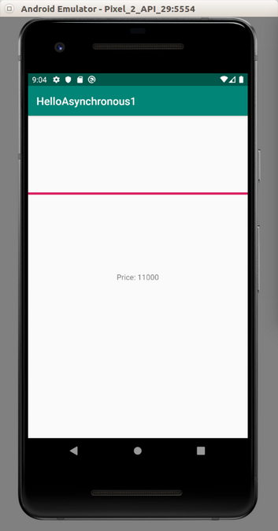

# Asynchronous Tasks

There are many ways to create asynchronous tasks without coroutines. We will discuss it one by one.

## AsyncTask

Create an empty Activity Android project. Name it HelloAsynchronous1.

In the layout file, we want to have a progress bar and a text view. Edit app / res / layout / activity_main.xml.

```xml
<?xml version="1.0" encoding="utf-8"?>
<androidx.constraintlayout.widget.ConstraintLayout xmlns:android="http://schemas.android.com/apk/res/android"
    xmlns:app="http://schemas.android.com/apk/res-auto"
    xmlns:tools="http://schemas.android.com/tools"
    android:layout_width="match_parent"
    android:layout_height="match_parent"
    tools:context=".MainActivity">

    <TextView
        android:layout_width="wrap_content"
        android:layout_height="wrap_content"
        android:text="Hello World!"
        android:id="@+id/textView"
        app:layout_constraintBottom_toBottomOf="parent"
        app:layout_constraintLeft_toLeftOf="parent"
        app:layout_constraintRight_toRightOf="parent"
        app:layout_constraintTop_toTopOf="parent" />

    <ProgressBar
        android:id="@+id/progressBar"
        style="?android:attr/progressBarStyleHorizontal"
        android:layout_width="match_parent"
        android:layout_height="wrap_content"
        app:layout_constraintBottom_toTopOf="@+id/textView"
        app:layout_constraintEnd_toEndOf="parent"
        app:layout_constraintStart_toStartOf="parent"
        app:layout_constraintTop_toTopOf="parent" />

</androidx.constraintlayout.widget.ConstraintLayout>
```

AsyncTask is an abstract class so we must create a subclass of AsyncTask.

Create a new file (class), CryptocurrencyPrice in app / java / com.example.helloasynchronous1.

```kotlin
package com.example.helloasynchronous1

import android.os.AsyncTask
import android.util.Log
import android.widget.ProgressBar
import android.widget.TextView
import java.lang.ref.WeakReference


const val LOG = "android-asynctask"

class CryptocurrencyPrice(val textView: TextView, val progressBar: ProgressBar) : AsyncTask<String, Int, Int>() {

    val cryptocurrencies = mapOf("Bitcoin" to 11000, "Ethereum" to 180)
    val weakTextView : WeakReference<TextView>? = WeakReference(textView)
    val weakProgressBar : WeakReference<ProgressBar>? = WeakReference(progressBar)

    override fun onPreExecute() {
        weakTextView?.get()?.text = "Calculating the price of cryptocurrency"
    }

    override fun doInBackground(vararg inputs: String): Int {
        publishProgress(25)
        Thread.sleep(300)
        val price = cryptocurrencies[inputs[0]]
        publishProgress(90)
        Thread.sleep(300)
        publishProgress(100)

        return price!!
    }

    override fun onProgressUpdate(vararg values: Int?) {
        weakProgressBar?.get()?.progress = values[0]!!
        Log.d(LOG, "Progress ${values[0]}")
    }

    override fun onPostExecute(price: Int) {
        weakTextView?.get()?.text = "Price: $price"
        Log.d(LOG, "Price $price")
    }
}
```

The CryptocurrencyPrice initializer accepts two variables. How many parameters inside the subclass of AsyncTask is up to us. In this case, there are two parameters because we want to manipulate two widgets (the progress bar and the text view).

AsyncTask is a template class with three data types that we must set. The number is always three but what kind of data types is up to us.
```kotlin
class CryptocurrencyPrice(val textView: TextView, val progressBar: ProgressBar) : AsyncTask<String, Int, Int>() {
```
Our data types in AsyncTask are String, Int, and Int. The first data type, which is String, refers to data type that we send into “doInBackground” method. The second data type, which is Int, refers to data type of what we send into “onProgressUpdate” method. The third data type, which is Int, refers to data type of what we send into “onPostExecute” method.

Then we create some variables inside the class.

```kotlin
val cryptocurrencies = mapOf("Bitcoin" to 11000, "Ethereum" to 180)
val weakTextView : WeakReference<TextView>? = WeakReference(textView)
val weakProgressBar : WeakReference<ProgressBar>? = WeakReference(progressBar)
```
The cryptocurrencies variable is a dummy data variable.

Other parameters (weakTextView and weakProgressBar) are weak references to Android widgets. We use weak references because we don’t want AsyncTask class to have strong reference for activity or fragment. The activity or the fragment can be destroyed when the user rotate the device. In the case, we want all the variables inside the activity or the fragment garbage-collected. 

The first method that we override is onPreExecute method.
```kotlin
override fun onPreExecute() {
    weakTextView?.get()?.text = "Calculating the price of cryptocurrency"
}
```
This method will be called just right before we run the task in the background. This method can access the widgets. We can choose not to override this method if we don’t do anything special before running the task in the background. In this example, we set the label of the text view.

The most important method that we want to override is “doInBackground” method. This is the main task that we run in the background.

```kotlin
override fun doInBackground(vararg inputs: String): Int {
    publishProgress(25)
    Thread.sleep(300)
    val price = cryptocurrencies[inputs[0]]
    publishProgress(90)
    Thread.sleep(300)
    publishProgress(100)

    return price!!
}
```
The “doInBackground” method accepts varargs arguments with the String type. Remember AsyncTask<String, Int, Int>? The varargs arguments means we can send as many as arguments later  to “doInBackground” method.

Inside the method, we call many methods. The first one is “publishProgress”. The value that we sent as argument in “publishProgress” indicates the progress of our task. The integer value will be sent to “onProgressUpdate”.

The Thread.sleep method is to simulate that our task takes some time to finish.

This method returns integer variable. This must match with the third data type in AsyncTask<String, Int, Int> template data types.

The third method is “onProgressUpdate”. This is optional.

```kotlin
override fun onProgressUpdate(vararg values: Int?) {
    weakProgressBar?.get()?.progress = values[0]!!
    Log.d(LOG, "Progress ${values[0]}")
}
```
In this method, we can access widgets and manipulate it. In this example, we just update the progress value of the progress bar.

The last method is “onPostExecute”. It accepts the argument which has Integer data type. Remember AsyncTask<String, Int, Int>? The data type of argument must match with the third data type in the template’s data type.

```kotlin
override fun onPostExecute(price: Int) {
    weakTextView?.get()?.text = "Price: $price"
    Log.d(LOG, "Price $price")
}
```
In this method, we set the label of the text view.

Edit app / java / com.example.helloasynchronous1 / MainActivity.
```kotlin
package com.example.helloasynchronous1

import androidx.appcompat.app.AppCompatActivity
import android.os.Bundle
import android.util.Log
import android.widget.ProgressBar
import android.widget.TextView


class MainActivity : AppCompatActivity() {

    override fun onCreate(savedInstanceState: Bundle?) {
        super.onCreate(savedInstanceState)
        setContentView(R.layout.activity_main)

        val textView = findViewById<TextView>(R.id.textView)
        val progressBar = findViewById<ProgressBar>(R.id.progressBar)

        val cryptocurrencyPrice = CryptocurrencyPrice(textView, progressBar)
        cryptocurrencyPrice.execute("Bitcoin")

        Log.d(LOG, "The execute method of the task is not blocking")
    }
}
```

To create an async task object, there is nothing special.
```kotlin
val cryptocurrencyPrice = CryptocurrencyPrice(textView, progressBar)
```
To run the task of async task object, we use “execute” method.
```kotlin
cryptocurrencyPrice.execute("Bitcoin")
```
The “Bitcoin” string will be sent to “doInBackground” method.

If we run the application, we would get this output.

<p align="center">

</p>

<p align="center">

</p>

This is the output in LogCat:
```
2019-11-02 21:04:25.263 25824-25824/? D/android-asynctask: The execute method of the task is not blocking
2019-11-02 21:04:25.271 25824-25824/? D/android-asynctask: Progress 25
2019-11-02 21:04:25.604 25824-25824/? D/android-asynctask: Progress 90
2019-11-02 21:04:25.909 25824-25824/? D/android-asynctask: Progress 100
2019-11-02 21:04:25.910 25824-25824/? D/android-asynctask: Price 11000
```

## WorkManager

We can use WorkManager to create a background task.

Create a new empty Activity application. Name it HelloAsynchronous2.

Edit build.gradle (Module: app).

Add this implementation inside dependencies.
```gradle
implementation "androidx.work:work-runtime-ktx:2.2.0"
```
We need to use JVM 1.8 version in order to use WorkManager.

Add these 2 blocks inside android block.
```gradle
compileOptions {
    sourceCompatibility = 1.8
    targetCompatibility = 1.8
}
kotlinOptions {
    jvmTarget = "1.8"
}
```
Sync the file.

Edit app / res / layout / activity_main.xml.

```xml
<?xml version="1.0" encoding="utf-8"?>
<androidx.constraintlayout.widget.ConstraintLayout xmlns:android="http://schemas.android.com/apk/res/android"
    xmlns:app="http://schemas.android.com/apk/res-auto"
    xmlns:tools="http://schemas.android.com/tools"
    android:layout_width="match_parent"
    android:layout_height="match_parent"
    tools:context=".MainActivity">

    <Button
        android:id="@+id/button"
        android:layout_width="wrap_content"
        android:layout_height="wrap_content"
        android:text="Button"
        app:layout_constraintBottom_toBottomOf="parent"
        app:layout_constraintEnd_toEndOf="parent"
        app:layout_constraintHorizontal_bias="0.5"
        app:layout_constraintStart_toStartOf="parent"
        app:layout_constraintTop_toTopOf="parent" />
</androidx.constraintlayout.widget.ConstraintLayout>
```

We put a button in the screen.

Then we need to create a worker class, in app / java / com.example.helloasynchronous2 / BasicTrulySimpleWorker.

```kotlin
package com.example.helloasynchronous2

import android.content.Context
import android.util.Log
import androidx.work.Worker
import androidx.work.WorkerParameters


const val LOG = "android-concurrency"

class BasicTrulySimpleWorker(appContext: Context, workerParams: WorkerParameters): Worker(appContext, workerParams) {

    override fun doWork(): Result {
        doingSomethingIntense()

        return Result.Success()
    }

    fun doingSomethingIntense() {
        Thread.sleep(1000)
        Log.d(LOG, "Doing something intense")
    }
}
```

The class must be a subclass of Worker.

We need to override “doWork” method. Inside this method, we do the intensive task.
```kotlin
override fun doWork(): Result {
    doingSomethingIntense()

    return Result.success()
}
```
To signify that we successfully run the background task, we need to return success result object.

Inside the custom method, “doingSomethingIntense”, we just sleep and print something to LogCat.

Edit app / java / com.example.helloasynchronous2 / MainActivity.

Add these import lines.

```kotlin
import android.widget.Button
import androidx.work.OneTimeWorkRequestBuilder
import androidx.work.WorkManager
```
Add a callback to the button in the screen.
```kotlin
findViewById<Button>(R.id.button).setOnClickListener {
    callWorker()
}
```
Define “callWorker” method.

```kotlin
fun callWorker() {
    val basicTrulySimpleWorker = OneTimeWorkRequestBuilder<BasicTrulySimpleWorker>().build()
    WorkManager.getInstance(applicationContext).enqueue(basicTrulySimpleWorker)

    val repeatBasicTrulySimpleWorker = PeriodicWorkRequestBuilder<BasicTrulySimpleWorker>(20, TimeUnit.MINUTES).build()
    WorkManager.getInstance(applicationContext).enqueue(repeatBasicTrulySimpleWorker)
}
```
We create a one time work request with the type of our worker class.

```kotlin
val basicTrulySimpleWorker = OneTimeWorkRequestBuilder<BasicTrulySimpleWorker>().build()
```

Then we enqueue this work request object into work manager.
```kotlin
WorkManager.getInstance(applicationContext).enqueue(basicTrulySimpleWorker)
```

We create a periodic work request with the type of our worker class.
```kotlin
val repeatBasicTrulySimpleWorker = PeriodicWorkRequestBuilder<BasicTrulySimpleWorker>(20, TimeUnit.MINUTES).build()
```

We will run it every 20 minutes. 15 minutes is the minimum time we can set.

Then we enqueue this work request object into work manager.

```kotlin
WorkManager.getInstance(applicationContext).enqueue(repeatBasicTrulySimpleWorker)
```

If we ran the application and clicked the button on the screen, we would get this output in LogCat.
```
2019-12-05 22:27:49.575 7252-7297/com.example.helloasynchronous2 D/android-concurrency: Doing something intense
2019-12-05 22:27:49.580 7252-7298/com.example.helloasynchronous2 D/android-concurrency: Doing something intense
```
If we wait for 20 minutes, we will get the same message.

## Test for WorkManager

Edit app / java / com.example.helloasynchronous2 / ExampleInstrumentedTest.

Delete “setup” method.

Create a new test method, named “testWorker” method.

```kotlin
@Test
fun testWorker() {
    val appContext = InstrumentationRegistry.getInstrumentation().targetContext
    val request = OneTimeWorkRequestBuilder<BasicTrulySimpleWorker>().build()

    val workManager = WorkManager.getInstance(appContext)
    workManager.enqueue(request)

    Thread.sleep(1600)

    val workInfo = workManager.getWorkInfoById(request.id).get()
    assertThat(workInfo.state, `is`(WorkInfo.State.SUCCEEDED))
}
```
We need to put sleep in order to wait the work request to be finished. Then we can check the result of the work request by inspecting work info.

```kotlin
    val workInfo = workManager.getWorkInfoById(request.id).get()
    assertThat(workInfo.state, `is`(WorkInfo.State.SUCCEEDED))
```
If we ran the test, we would get this test result.
```
I/TestRunner: run finished: 1 tests, 0 failed, 0 ignored
```

## Constraints of WorkManager

We can configure the work request.

Create an empty Activity project. Name it HelloAsynchronous3.

Edit build.gradle (Module: app).

Add this implementation inside dependencies.
```gradle
implementation "androidx.work:work-runtime-ktx:2.2.0"
```
We need to use JVM 1.8 version in order to use WorkManager.

Add these 2 blocks inside android block.

```gradle
compileOptions {
    sourceCompatibility = 1.8
    targetCompatibility = 1.8
}
kotlinOptions {
    jvmTarget = "1.8"
}
```

Sync the file.

Edit app / res / layout / activity_main.xml.

```xml
<?xml version="1.0" encoding="utf-8"?>
<androidx.constraintlayout.widget.ConstraintLayout xmlns:android="http://schemas.android.com/apk/res/android"
    xmlns:app="http://schemas.android.com/apk/res-auto"
    xmlns:tools="http://schemas.android.com/tools"
    android:layout_width="match_parent"
    android:layout_height="match_parent"
    tools:context=".MainActivity">

    <Button
        android:id="@+id/button"
        android:layout_width="wrap_content"
        android:layout_height="wrap_content"
        android:text="Button"
        app:layout_constraintBottom_toBottomOf="parent"
        app:layout_constraintEnd_toEndOf="parent"
        app:layout_constraintHorizontal_bias="0.5"
        app:layout_constraintStart_toStartOf="parent"
        app:layout_constraintTop_toTopOf="parent" />
</androidx.constraintlayout.widget.ConstraintLayout>
```

We put a button in the screen.

Then we need to create a worker class, in app / java / com.example.helloasynchronous2 / BasicTrulySimpleWorker.

```kotlin
package com.example.helloasynchronous3

import android.content.Context
import android.util.Log
import androidx.work.Worker
import androidx.work.WorkerParameters


const val LOG = "android-concurrency"

class BasicTrulySimpleWorker(appContext: Context, workerParams: WorkerParameters): Worker(appContext, workerParams) {

    companion object {
        var times = 0
    }

    override fun doWork(): Result {
        val inputData = inputData.getString("key")!!

        return if (times == 2) {
            doingSomethingIntense(inputData)
            Result.success()
        } else {
            times++
            Log.d(LOG, "Retry for: $times times")
            Result.retry()
        }
    }

    fun doingSomethingIntense(inputData: String) {
        Thread.sleep(1000)
        Log.d(LOG, "Doing something intense with: ${inputData}")
    }
}
```
In this example, we get the parameter input from the caller in “doWork” method.

```kotlin
val inputData = inputData.getString("key")!!
```
Then we simulate the retrying case with “Result.retry()”. Two times the work manager will retry to call “doWork” method. For the third times, the work manager will succeed. 
```kotlin
return if (times == 2) {
    doingSomethingIntense(inputData)
    Result.success()
} else {
    times++
    Log.d(LOG, "Retry for: $times times")
    Result.retry()
}
```
Edit app / java / com.example.helloasynchronous3 / MainActivity.

Add these import lines.
```kotlin
import android.widget.Button
import androidx.work.*
import java.util.concurrent.TimeUnit
```
Add a callback to the button.
```kotlin
findViewById<Button>(R.id.button).setOnClickListener {
    callWorker()
}
```
Define “callWorker” method.

```kotlin
fun callWorker() {
    val constraints = Constraints.Builder()
        .setRequiresDeviceIdle(false)
        .setRequiresCharging(false)
        .setRequiresBatteryNotLow(true)
        .setRequiresStorageNotLow(true)
        .setRequiredNetworkType(NetworkType.NOT_ROAMING)
        .build()

    val inputData = workDataOf("key" to "value")

    val basicTrulySimpleWorker = OneTimeWorkRequestBuilder<BasicTrulySimpleWorker>()
        .setConstraints(constraints)
        .setInitialDelay(2, TimeUnit.SECONDS)
        .setBackoffCriteria(BackoffPolicy.LINEAR, 11, TimeUnit.SECONDS)
        .setInputData(inputData)
        .build()
    WorkManager.getInstance(applicationContext).enqueue(basicTrulySimpleWorker)
}
```
We can create a constraint for the work request.

```kotlin
    val constraints = Constraints.Builder()
        .setRequiresDeviceIdle(false)
        .setRequiresCharging(false)
        .setRequiresBatteryNotLow(true)
        .setRequiresStorageNotLow(true)
        .setRequiredNetworkType(NetworkType.NOT_ROAMING)
        .build()
```
In this case, the work manager will wait until the battery is not low before executing the background work.

Then we create a parameter to be sent to the background work’s callback.

```kotlin
val inputData = workDataOf("key" to "value")
```
It’s a map. In BasicTrulySimpleWorker class, we extract the value “value” with key “key”.

Then we build a work request with this constraint and input and other configuration.

```kotlin
val basicTrulySimpleWorker = OneTimeWorkRequestBuilder<BasicTrulySimpleWorker>()
    .setConstraints(constraints)
    .setInitialDelay(2, TimeUnit.SECONDS)
    .setBackoffCriteria(BackoffPolicy.LINEAR, 11, TimeUnit.SECONDS)
    .setInputData(inputData)
    .build()
```
The other configurations that we use are the initial delay and backoff criteria for retrying the background work.

The initial delay is 2 seconds, set with “setInitialDelay” method.
```kotlin
    .setInitialDelay(2, TimeUnit.SECONDS)
```
The backoff criter is set for 11 seconds with linear backoff policy, set with “setBackoffCriteria” method.
```kotlin
    .setBackoffCriteria(BackoffPolicy.LINEAR, 11, TimeUnit.SECONDS)
```
The minimum seconds we can set it 10 seconds. We can not set it less than 10 seconds. The linear backoff policy means if we will wait 11 seconds before retrying the work again. Then we will wait 22 seconds before retrying the work again. And so on.

Lastly, we enqueue this work request to the work manager.

```kotlin
WorkManager.getInstance(applicationContext).enqueue(basicTrulySimpleWorker)
```
If we ran the application and clicked the button, we would get this output.
```
2019-12-03 16:53:42.273 3696-3763/com.example.helloasynchronous3 D/android-concurrency: Retry for: 1 times
2019-12-03 16:53:53.296 3696-3770/com.example.helloasynchronous3 D/android-concurrency: Retry for: 2 times
2019-12-03 16:54:16.319 3696-3790/com.example.helloasynchronous3 D/android-concurrency: Doing something intense with: value
```
Look at the times. 16:53:42, then 16:53:53, then 16:54:16.

## Canceling Worker and Observing Lifecycle of WorkManager

We can cancel the worker and observe the status of worker.

Create a new empty Activity application and name it HelloAsynchronous4.

Edit build.gradle (Module: app).

Add this implementation inside dependencies.
```gradle
implementation "androidx.work:work-runtime-ktx:2.2.0"
```
We need to use JVM 1.8 version in order to use WorkManager.

Add these 2 blocks inside android block.
```gradle
compileOptions {
    sourceCompatibility = 1.8
    targetCompatibility = 1.8
}
kotlinOptions {
    jvmTarget = "1.8"
}
```
Sync the file.

Edit app / res / layout / activity_main.xml.

```xml
<?xml version="1.0" encoding="utf-8"?>
<androidx.constraintlayout.widget.ConstraintLayout xmlns:android="http://schemas.android.com/apk/res/android"
    xmlns:app="http://schemas.android.com/apk/res-auto"
    xmlns:tools="http://schemas.android.com/tools"
    android:layout_width="match_parent"
    android:layout_height="match_parent"
    tools:context=".MainActivity">

    <Button
        android:id="@+id/startWorkManager"
        android:layout_width="wrap_content"
        android:layout_height="wrap_content"
        android:text="Start Work Manager"
        app:layout_constraintBottom_toTopOf="@+id/cancelWorkManager"
        app:layout_constraintEnd_toEndOf="parent"
        app:layout_constraintHorizontal_bias="0.5"
        app:layout_constraintStart_toStartOf="parent"
        app:layout_constraintTop_toTopOf="parent" />

    <Button
        android:id="@+id/cancelWorkManager"
        android:layout_width="wrap_content"
        android:layout_height="wrap_content"
        android:text="Cancel Work Manager"
        app:layout_constraintBottom_toBottomOf="parent"
        app:layout_constraintEnd_toEndOf="parent"
        app:layout_constraintHorizontal_bias="0.5"
        app:layout_constraintStart_toStartOf="parent"
        app:layout_constraintTop_toBottomOf="@+id/startWorkManager" />
</androidx.constraintlayout.widget.ConstraintLayout>
```

We put two buttons on the screen. One is for starting the worker. The other one is for cancelling the worker.

Create a Worker, app / java / com.example.helloasynchronous4 / BasicTrulySimpleWorker.

```kotlin
package com.example.helloasynchronous4

import android.content.Context
import android.util.Log
import androidx.work.Worker
import androidx.work.WorkerParameters


const val LOG = "android-concurrency"

class BasicTrulySimpleWorker(appContext: Context, workerParams: WorkerParameters): Worker(appContext, workerParams) {

    override fun doWork(): Result {
        doingSomethingIntense()

        return Result.success()
    }

    fun doingSomethingIntense() {
        Thread.sleep(5000)
        Log.d(LOG, "Doing something intense")
    }
}
```
Then edit app / java / com.example.helloasynchronous4 / MainActivity.

Add these import lines.
```kotlin
import android.util.Log
import android.widget.Button
import androidx.lifecycle.Observer
import androidx.work.OneTimeWorkRequestBuilder
import androidx.work.WorkManager
```
Create a Worker object based on “BasicTrulySimpleWorker” class inside MainActivity class.
```kotlin
val basicTrulySimpleWorker = OneTimeWorkRequestBuilder<BasicTrulySimpleWorker>().build()
```

Create a variable of type WorkManager.
```kotlin
lateinit var workManager: WorkManager
```

Inside “onCreate” method, initialize “workManager” variable and set the lifecycle observing method.
```kotlin
workManager = WorkManager.getInstance(applicationContext)
workManager.getWorkInfoByIdLiveData(basicTrulySimpleWorker.id)
    .observe(this, Observer {
        if (it != null) {
            Log.d(LOG, "Lifecycle of WorkManager: ${it.state}")
        }
    })
```

To observe the lifecycle of the worker, we use “getWorkInfoByIdLiveData” method which accepts the id of “basicTrulySimpleWorker”. Then chain it with “observer” method which accepts the lifecycle owner (the Activity in this case) and the Observer callback. Inside the Observer callback, we print the “state” of the WorkInfo object.

Then we set the callback for each button.
```kotlin
findViewById<Button>(R.id.startWorkManager).setOnClickListener {
    callWorker()
}

findViewById<Button>(R.id.cancelWorkManager).setOnClickListener {
    cancelWorker()
}
```

Lastly we need to define “callWorker” method and “cancelWorker” method.
```kotlin
fun callWorker() {
    workManager.enqueue(basicTrulySimpleWorker)
}

fun cancelWorker() {
    workManager.cancelWorkById(basicTrulySimpleWorker.id)
}
```

To load our worker, we use “enqueue” method of “workManager” variable. To cancel our worker, we use “cancelWorkById” method and give the id of “basicTrulySimpleWorker” variable.

If we ran the application and clicked the “Start Work Manager” button, we would get this output in LogCat.
```
2019-12-03 21:47:51.979 6373-6373/com.example.helloasynchronous4 D/android-concurrency: Lifecycle of WorkManager: ENQUEUED
2019-12-03 21:47:51.996 6373-6373/com.example.helloasynchronous4 D/android-concurrency: Lifecycle of WorkManager: RUNNING
```

If we click “Cancel Work Manager” button before 5 seconds, we would get additional log in LogCat.
```
2019-12-03 21:47:54.241 6373-6373/com.example.helloasynchronous4 D/android-concurrency: Lifecycle of WorkManager: CANCELLED
2019-12-03 21:47:56.995 6373-6424/com.example.helloasynchronous4 D/android-concurrency: Doing something intense
```

## Chaining Work

We can make a sequence of worker A to be run parallel with worker B before running worker C.

Create a new empty Activity application and name it HelloAsynchronous5.

Edit build.gradle (Module: app).

Add this implementation inside dependencies.
```gradle
implementation "androidx.work:work-runtime-ktx:2.2.0"
```
We need to use JVM 1.8 version in order to use WorkManager.

Add these 2 blocks inside android block.
```gradle
compileOptions {
    sourceCompatibility = 1.8
    targetCompatibility = 1.8
}
kotlinOptions {
    jvmTarget = "1.8"
}
```

Sync the file.

Edit app / res / layout / activity_main.xml.
```xml
<?xml version="1.0" encoding="utf-8"?>
<androidx.constraintlayout.widget.ConstraintLayout xmlns:android="http://schemas.android.com/apk/res/android"
    xmlns:app="http://schemas.android.com/apk/res-auto"
    xmlns:tools="http://schemas.android.com/tools"
    android:layout_width="match_parent"
    android:layout_height="match_parent"
    tools:context=".MainActivity">

    <Button
        android:id="@+id/button"
        android:layout_width="wrap_content"
        android:layout_height="wrap_content"
        android:text="Button"
        app:layout_constraintBottom_toBottomOf="parent"
        app:layout_constraintEnd_toEndOf="parent"
        app:layout_constraintHorizontal_bias="0.5"
        app:layout_constraintStart_toStartOf="parent"
        app:layout_constraintTop_toTopOf="parent" />
</androidx.constraintlayout.widget.ConstraintLayout>
```

Create 3 worker classes.

The first one is SimpleWorker1 in app / java / com.example.helloasynchronous5 / SimpleWorker1.
```kotlin
package com.example.helloasynchronous5

import android.content.Context
import android.util.Log
import androidx.work.CoroutineWorker
import androidx.work.WorkerParameters


class SimpleWorker1(appContext: Context, workerParams: WorkerParameters): CoroutineWorker(appContext, workerParams) {

    override suspend fun doWork(): Result {
        doingSomethingIntense()

        return Result.success()
    }

    fun doingSomethingIntense() {
        Thread.sleep(1000)
        Log.d(LOG, "Doing something intense in SimpleWorker1")
    }
}
```

The first one is SimpleWorker2 in app / java / com.example.helloasynchronous5 / SimpleWorker2.
```kotlin
package com.example.helloasynchronous5

import android.content.Context
import android.util.Log
import androidx.work.CoroutineWorker
import androidx.work.WorkerParameters


class SimpleWorker2(appContext: Context, workerParams: WorkerParameters): CoroutineWorker(appContext, workerParams) {

    override suspend fun doWork(): Result {
        doingSomethingIntense()

        return Result.success()
    }

    fun doingSomethingIntense() {
        Thread.sleep(1000)
        Log.d(LOG, "Doing something intense in SimpleWorker2")
    }
}
```

The first one is SimpleWorker3 in app / java / com.example.helloasynchronous5 / SimpleWorker3.
```kotlin
package com.example.helloasynchronous5

import android.content.Context
import android.util.Log
import androidx.work.CoroutineWorker
import androidx.work.WorkerParameters


class SimpleWorker3(appContext: Context, workerParams: WorkerParameters): CoroutineWorker(appContext, workerParams) {

    override suspend fun doWork(): Result {
        doingSomethingIntense()

        return Result.success()
    }

    fun doingSomethingIntense() {
        Thread.sleep(1000)
        Log.d(LOG, "Doing something intense in SimpleWorker3")
    }
}
```

Edit app / java / com.example.helloasynchronous5 / MainActivity.
```kotlin
package com.example.helloasynchronous5

import androidx.appcompat.app.AppCompatActivity
import android.os.Bundle
import android.widget.Button
import androidx.work.OneTimeWorkRequestBuilder
import androidx.work.WorkManager


const val LOG = "android-concurrency"

class MainActivity : AppCompatActivity() {

    override fun onCreate(savedInstanceState: Bundle?) {
        super.onCreate(savedInstanceState)
        setContentView(R.layout.activity_main)

        findViewById<Button>(R.id.button).setOnClickListener {
            callWorker()
        }
    }

    fun callWorker() {
        val simpleWorker1 = OneTimeWorkRequestBuilder<SimpleWorker1>().build()
        val simpleWorker2 = OneTimeWorkRequestBuilder<SimpleWorker2>().build()
        val simpleWorker3 = OneTimeWorkRequestBuilder<SimpleWorker3>().build()
        WorkManager.getInstance(applicationContext)
            .beginWith(simpleWorker1)
            .then(listOf(simpleWorker2, simpleWorker3))
            .enqueue()
    }
}
```

We can use “beginWith” method to start with workers.
```kotlin
        WorkManager.getInstance(applicationContext)
            .beginWith(simpleWorker1)
```

We can use “then” to follow with other workers.
```kotlin
            .then(listOf(simpleWorker2, simpleWorker3))
```

Inside “then” method we send a list of two workers. It means these two workers will be run parallel.

If we ran the application and clicked the button, we would get this output.
```
2019-12-05 21:33:10.658 4408-6369/com.example.helloasynchronous5 D/android-concurrency: Doing something intense in SimpleWorker1
2019-12-05 21:33:11.726 4408-6369/com.example.helloasynchronous5 D/android-concurrency: Doing something intense in SimpleWorker2
2019-12-05 21:33:11.731 4408-6371/com.example.helloasynchronous5 D/android-concurrency: Doing something intense in SimpleWorker3
```

# Optional Readings

https://stackoverflow.com/questions/14250989/how-to-use-asynctask-correctly-in-android

https://developer.android.com/topic/libraries/architecture/workmanager/

# Exercises

1. Create a project on which you need to download a file with WorkManager.