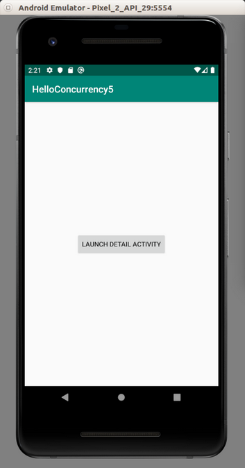

# Coroutine

Android provides coroutine to achieve concurrency. Coroutine is like a thread but it is very light. A block of code in a coroutine can be run in different thread.

## Launching Coroutine

Create an empty Activity project. Name it HelloConcurrency1. 

Edit build.gradle (Module: app).

Add this dependency inside dependencies.

```gradle
implementation 'org.jetbrains.kotlinx:kotlinx-coroutines-android:1.3.2'
```
Then sync the gradle file.

Edit app / java / com.example.helloconcurrency1 / MainActivity.

Add these import lines.
```kotlin
import android.util.Log
import kotlinx.coroutines.*
```

Add this constant variable declaration.
```kotlin
const val LOG = "android-coroutines"
```

Edit onCreate method. Add this code.
```kotlin
runBlocking {
    GlobalScope.launch {
        Log.d(LOG, "Inside launch method of GlobalScope")
        delay(1000)
        Log.d(LOG, "Still inside launch method of GlobalScope")
    }
    Log.d(LOG, "Outside launch method of GlobalScope")
}
```
runBlocking connects between Android code (blocking code) and coroutine (non-blocking code).

GlobalScope.launch launches a coroutine. The code block which is an argument of “launch” method will be executed in “GlobalScope” coroutine scope. The “GlobalScope” is tied to the application life cycle (not to the activity life cycle). So if the activity is destroyed, the code in the coroutine is still alive.

delay(1000) suspends the code inside the coroutine for a second.

The GlobalScope.launch immediately returns and the application will execute the writing of the log outside GlobalScope.launch. So the code inside GlobalScope.launch will be executed concurrently with the code outside GlobalScope.launch.

If we run the application we will get this output:
```
2019-10-19 16:50:01.554 13737-13737/com.example.helloconcurrency1 D/android-coroutines: Outside launch method of GlobalScope
2019-10-19 16:50:01.554 13737-13794/com.example.helloconcurrency1 D/android-coroutines: Inside launch method of GlobalScope
2019-10-19 16:50:02.557 13737-13794/com.example.helloconcurrency1 D/android-coroutines: Still inside launch method of GlobalScope
```

Comment out the previous code. Add this code.
```kotlin
runBlocking {
    val lazyJob = GlobalScope.launch(start = CoroutineStart.LAZY) {
        Log.d(LOG, "Lazy job. It must be started manually.")
    }
    val parentJob = GlobalScope.launch(start = CoroutineStart.LAZY) {
        Log.d(LOG, "Parent job. It will be started via child job.")
    }
    val childJob = GlobalScope.launch {
        parentJob.join()
        Log.d(LOG, "The child of parentJob. It will start the parent job first.")
    } // We wait this job to be finished first before going to the next line
    lazyJob.start() // Starting lazyJob
    childJob.join()
}
```

GlobalScope.launch method accepts optional parameter which is “start” argument. We give it CoroutineStart.LAZY value. This parameter makes the coroutine launched by GlobalScope.launch delayed (not started immediately). To start the coroutine, we have to do it manually, by executing “start” method of the job (the result of “launch” method).

We can also create a dependency between jobs. We can run the parent job inside the child job. So the parent job will be finished before the child job is finished.

If we want to wait for a job to be finished before we step to next line, we can use “join” method.

Run the application and we will get this output.
```
2019-10-19 17:14:41.343 14851-14897/? D/android-coroutines: Lazy job. It must be started manually.
2019-10-19 17:14:41.343 14851-14898/? D/android-coroutines: Parent job. It will be started via child job.
2019-10-19 17:14:41.345 14851-14896/? D/android-coroutines: The child of parentJob. It will start the parent job first.
```

Comment out the previous code and add this code.
```kotlin
runBlocking {
    launch {
        delay(1000)
        Log.d(LOG, "Inside runBlocking with launch")
    }
}

Log.d(LOG, "Outside runBlocking with launch")

runBlocking {
    GlobalScope.launch {
        delay(1000)
        Log.d(LOG, "Inside runBlocking with GlobalScope.launch")
    }
}

Log.d(LOG, "Outside runBlocking with GlobalScope.launch")
```

GlobalScope.launch is different than the “launch” (without GlobalScope). If we run the application we will get this output.
```
2019-10-19 21:29:21.497 19153-19153/com.example.helloconcurrency1 D/android-coroutines: Inside runBlocking with launch
2019-10-19 21:29:21.497 19153-19153/com.example.helloconcurrency1 D/android-coroutines: Outside runBlocking with launch
2019-10-19 21:29:21.503 19153-19153/com.example.helloconcurrency1 D/android-coroutines: Outside runBlocking with GlobalScope.launch
2019-10-19 21:29:22.507 19153-19222/com.example.helloconcurrency1 D/android-coroutines: Inside runBlocking with GlobalScope.launch
```

Notice that runBlocking blocks the code inside “launch” method. But runBlocking can not block the code inside GlobalScope.launch method because GlobalScope is not tied to runBlocking block. GlobalScope is tied to the application life cycle. “launch” method (without GlobalScope) will create a new coroutine scope tied to where it belongs to.

Because of this reason, using GlobalScope is not recommended.

Comment out the previous code and add this code.
```kotlin
runBlocking {
    launch {
        Log.d(LOG, "The name of the thread with launch is ${Thread.currentThread().name}")
    }
    GlobalScope.launch(Dispatchers.Main) {
        Log.d(LOG, "The name of the thread with GlobalScope.launch(Dispatchers.Main) is ${Thread.currentThread().name}")
    }
    launch(Dispatchers.IO) {
        Log.d(LOG, "The name of the thread with launch(Dispatchers.IO) is ${Thread.currentThread().name}")
    }
    launch(Dispatchers.Unconfined) {
        Log.d(LOG, "The name of the thread with launch(Dispatchers.Unconfined) is ${Thread.currentThread().name}")
    }
    launch(Dispatchers.Default) {
        Log.d(LOG, "The name of the thread with launch(Dispatchers.Default) is ${Thread.currentThread().name}")
    }
}
```

“launch” method accept optional parameter, which is the dispatcher. Dispatcher is the place of thread or threads where we execute this coroutine.

Dispatchers.Main is for doing things in User Interface (updating UI).

Dispatchers.IO is for downloading or uploading data from/to network or reading data from file or database.

Dispatchers.Default is for doing tasks which require intensive CPU usage, like sorting numbers.

Dispatchers.Unconfined is not confined for one specific thread nor it has any thread policy.

Run the application and we will get this output.
```
2019-10-19 21:57:30.051 20370-20370/? D/android-coroutines: The name of the thread with launch(Dispatchers.Unconfined) is main
2019-10-19 21:57:30.051 20370-20406/? D/android-coroutines: The name of the thread with launch(Dispatchers.IO) is DefaultDispatcher-worker-1
2019-10-19 21:57:30.051 20370-20407/? D/android-coroutines: The name of the thread with launch(Dispatchers.Default) is DefaultDispatcher-worker-2
2019-10-19 21:57:30.052 20370-20370/? D/android-coroutines: The name of the thread with launch is main
2019-10-19 21:57:30.066 20370-20370/? D/android-coroutines: The name of the thread with GlobalScope.launch(Dispatchers.Main) is main
```

Launching coroutine with “launch” method can not give us the result of the code block we are executing. We can set the variable outside coroutine to achieve our purpose. But there is a better way, which is using async.

## Getting Result From Coroutine With Async

Create a new empty Activity Android application. Name it HelloConcurrency2.

Edit build.gradle (Module: app).

Add this dependency inside dependencies.
```gradle
implementation 'org.jetbrains.kotlinx:kotlinx-coroutines-android:1.3.2'
```

Then sync the gradle file.

Edit app / java / com.example.helloconcurrency2 / MainActivity.

Add these import lines.
```
import android.util.Log
import kotlinx.coroutines.async
import kotlinx.coroutines.delay
import kotlinx.coroutines.runBlocking
```

Add this constant variable declaration.
```kotlin
const val LOG = "android-coroutines"
```

Add these two methods inside MainActivity class.
```kotlin
suspend fun downloadFile(): String {
    delay(1000)
    return "Downloaded File"
}

suspend fun readDataFromDatabase(): String {
    delay(1000)
    return "Data From Database"
}
```

Notice that both methods have “suspend” words attached in front of them. It means these methods are suspendable methods. Suspendable means the method will not block the current thread.

Edit onCreate method. Add this code.
```kotlin
runBlocking {
    Log.d(LOG, "Before executing methods")
    val result1 = downloadFile()
    val result2 = readDataFromDatabase()
    Log.d(LOG, "After executing methods, getting result: ${result1 + result2}")
}
```

If we run the application, we will get this output.
```2019-10-20 11:52:39.594 21832-21832/com.example.helloconcurrency2 D/android-coroutines: Before executing methods
2019-10-20 11:52:41.596 21832-21832/com.example.helloconcurrency2 D/android-coroutines: After executing methods, getting result: Downloaded FileData From Database
```

Notice the time. There are 2 seconds between 11:52:39.594 and 11:52:41.596. But downloadFile method and readDataFromDatabase method are not dependent to each other. We can execute them concurrently.

Add this code inside onCreate method.
```kotlin
runBlocking {
    Log.d(LOG, "Before async")
    val deferredDownload = async { downloadFile() }
    val deferredDatabase = async { readDataFromDatabase() }

    val result1 = deferredDownload.await()
    val result2 = deferredDatabase.await()
    Log.d(LOG, "After async's await, getting result: ${result1 + result2}")
}
```

Notice we execute the method inside “async” block. “async” block returns deferred object which can give us the results we want.

To get the result, we use await method from the deferred object. The “await” method will not block the current thread.

If we run the application, we will get this output.
```
2019-10-20 11:52:41.597 21832-21832/com.example.helloconcurrency2 D/android-coroutines: Before async
2019-10-20 11:52:42.606 21832-21832/com.example.helloconcurrency2 D/android-coroutines: After async's await, getting result: Downloaded FileData From Database
```

There is 1 second between  11:52:41.597 and 11:52:42.606, not 2 seconds anymore.

## Handling Exception

We have different ways to deal exception with GlobalScope or not, with launch or async.

Create a new empty Activity Android application. Name it HelloConcurrency3.

Edit build.gradle (Module: app).

Add this dependency inside dependencies.
```gradle
implementation 'org.jetbrains.kotlinx:kotlinx-coroutines-android:1.3.2'
```

Then sync the gradle file.

Edit app / java / com.example.helloconcurrency3 / MainActivity.

Add these import lines.
```kotlin
import android.util.Log
import kotlinx.coroutines.*
```

Add this constant variable declaration.
```kotlin
const val LOG = "android-coroutines"
```

Inside MainActivity, add one suspendable method which throws an exception.
```kotlin
suspend fun problematicMethod() {
    delay(500)
    throw Exception("Error inside problematicMethod")
}
```

Edit onCreate method. Add this code.
```kotlin
runBlocking {
    launch {
        try {
            problematicMethod()
        } catch (e: Exception) {
            Log.d(LOG, "Catching an exception from launch method: $e")
        }
    }
}
```

If we use “launch” method without GlobalScope, we must catch the exception inside “launch” method itself.

Add this code.
```kotlin
runBlocking {
    async {
        try {
            problematicMethod()
        } catch (e: Exception) {
            Log.d(LOG, "Catching an exception from async method: $e")
        }
    }
}
```

Same as when we use async method.

Things are different when we use different scope, such as GlobalScope. Add this code.
```kotlin
runBlocking {
    val deferredMethod = GlobalScope.async { problematicMethod() }
    deferredMethod.join()
    if (deferredMethod.isCancelled) {
        Log.d(LOG, "There is an exception")
    }
}
```

When we wait the task to be finished with “join” method, we can check whether we are canceled by the exception or not with isCancelled property.

But if we want to get the result with “await” method, we must prepare for the potential exception. Add this code.
```kotlin
runBlocking {
    val deferredMethod = GlobalScope.async { problematicMethod() }
    try {
        deferredMethod.await()
    } catch (e: Exception) {
        Log.d(LOG, "Catching an exception from async's await: $e")
    }
}
```

If we want to handle the exception with GlobalScope.launch, we must create coroutine exception handler. Add this code.
```kotlin
val handler = CoroutineExceptionHandler {c, e ->
    Log.d(LOG, "Inside CoroutineExceptionHandler, catching an exception $e in $c")
}

runBlocking {
    val deferredMethod = GlobalScope.launch(handler) { problematicMethod() }
    deferredMethod.join()
}
```

If we run the application, we will get this output.
```
2019-10-20 17:16:29.927 25966-25966/? D/android-coroutines: Catching an exception from launch method: java.lang.Exception: Error inside problematicMethod
2019-10-20 17:16:30.432 25966-25966/com.example.helloconcurrency3 D/android-coroutines: Catching an exception from async method: java.lang.Exception: Error inside problematicMethod
2019-10-20 17:16:30.937 25966-25966/com.example.helloconcurrency3 D/android-coroutines: There is an exception
2019-10-20 17:16:31.447 25966-25966/com.example.helloconcurrency3 D/android-coroutines: Catching an exception from async's await: java.lang.Exception: Error inside problematicMethod
2019-10-20 17:16:31.953 25966-26014/com.example.helloconcurrency3 D/android-coroutines: Inside CoroutineExceptionHandler, catching an exception java.lang.Exception: Error inside problematicMethod in [com.example.helloconcurrency3.MainActivity$onCreate$$inlined$CoroutineExceptionHandler$1@3e91447, StandaloneCoroutine{Cancelling}@4557474, DefaultDispatcher]
```

## Canceling Jobs

We launch a coroutine to do some tasks in background. We can wait the coroutine to complete. But we can also cancel it.

Create a new empty Activity project. Name it HelloConcurrency4.

Edit build.gradle (Module: app).

Add this dependency inside dependencies.
```gradle
implementation 'org.jetbrains.kotlinx:kotlinx-coroutines-android:1.3.2'
```

Then sync the gradle file.

Edit app / java / com.example.helloconcurrency4 / MainActivity.

Add these import lines.
```kotlin
import android.util.Log
import kotlinx.coroutines.*
```

Add this constant variable declaration.
```kotlin
const val LOG = "android-coroutines"
```

Edit onCreate method. Add this code.
```kotlin
Log.d(LOG, "=== With cancelAndJoin")

runBlocking {
    val job = launch {
        try {
            repeat(10) {
                Log.d(LOG, "Printing.... 1")
                Log.d(LOG, "Printing.... 2")
                Log.d(LOG, "Printing.... 3")
                Log.d(LOG, "Printing.... 4")
                delay(20)
            }
        } finally {
            Log.d(LOG, "Finally...")
        }
    }
    job.invokeOnCompletion {
        Log.d(LOG, "Executed after completion")
    }
    delay(50)
    Log.d(LOG, "Outside launch before 'cancel'")
    job.cancelAndJoin()
    Log.d(LOG, "Outside launch after 'cancel'")
}
```

cancelAndJoin method is like “cancel” method followed by “join” method.

If we run the application, we will get this output.
```
2019-10-22 20:59:09.932 5563-5563/com.example.helloconcurrency4 D/android-coroutines: === With cancelAndJoin
2019-10-22 20:59:09.964 5563-5563/com.example.helloconcurrency4 D/android-coroutines: Printing.... 1
2019-10-22 20:59:09.964 5563-5563/com.example.helloconcurrency4 D/android-coroutines: Printing.... 2
2019-10-22 20:59:09.964 5563-5563/com.example.helloconcurrency4 D/android-coroutines: Printing.... 3
2019-10-22 20:59:09.964 5563-5563/com.example.helloconcurrency4 D/android-coroutines: Printing.... 4
2019-10-22 20:59:09.985 5563-5563/com.example.helloconcurrency4 D/android-coroutines: Printing.... 1
2019-10-22 20:59:09.985 5563-5563/com.example.helloconcurrency4 D/android-coroutines: Printing.... 2
2019-10-22 20:59:09.985 5563-5563/com.example.helloconcurrency4 D/android-coroutines: Printing.... 3
2019-10-22 20:59:09.985 5563-5563/com.example.helloconcurrency4 D/android-coroutines: Printing.... 4
2019-10-22 20:59:10.006 5563-5563/com.example.helloconcurrency4 D/android-coroutines: Printing.... 1
2019-10-22 20:59:10.006 5563-5563/com.example.helloconcurrency4 D/android-coroutines: Printing.... 2
2019-10-22 20:59:10.006 5563-5563/com.example.helloconcurrency4 D/android-coroutines: Printing.... 3
2019-10-22 20:59:10.006 5563-5563/com.example.helloconcurrency4 D/android-coroutines: Printing.... 4
2019-10-22 20:59:10.012 5563-5563/com.example.helloconcurrency4 D/android-coroutines: Outside launch before 'cancel'
2019-10-22 20:59:10.015 5563-5563/com.example.helloconcurrency4 D/android-coroutines: Finally...
2019-10-22 20:59:10.015 5563-5563/com.example.helloconcurrency4 D/android-coroutines: Executed after completion
2019-10-22 20:59:10.015 5563-5563/com.example.helloconcurrency4 D/android-coroutines: Outside launch after 'cancel'
```

When we cancel the job, the suspending function (delay in this case) will check if the job has been canceled or not. If the job has been canceled, the continuation of coroutine will to “finally” block. Then the it will jump to the code block of invokeOnCompletion method. Then it will return to “cancelAndJoin” method line. That’s why the 4 lines of printing in LogCat code before “delay” method are never interrupted (“Printing…. 1” to “Printing…. 4”). The coroutine only checks if it should cancel itself in suspending method.

Add another code.
```kotlin
Log.d(LOG, "=== With cancel")

runBlocking {
    val job = launch {
        try {
            repeat(10) {
                Log.d(LOG, "Printing....")
                delay(20)
            }
        } finally {
            Log.d(LOG, "Finally...")
        }
    }
    job.invokeOnCompletion {
        Log.d(LOG, "Executed after completion")
    }
    delay(50)
    Log.d(LOG, "Outside launch before 'cancel'")
    job.cancel()
    Log.d(LOG, "Outside launch after 'cancel'")
}
```

The code is similar to the previous code except we use “cancel” method instead of “cancelAndJoin” method.

If we run the application, we will get this output.
```
2019-10-22 17:45:20.843 4836-4836/com.example.helloconcurrency4 D/android-coroutines: === With cancel
2019-10-22 17:45:20.843 4836-4836/com.example.helloconcurrency4 D/android-coroutines: Printing....
2019-10-22 17:45:20.863 4836-4836/com.example.helloconcurrency4 D/android-coroutines: Printing....
2019-10-22 17:45:20.884 4836-4836/com.example.helloconcurrency4 D/android-coroutines: Printing....
2019-10-22 17:45:20.893 4836-4836/com.example.helloconcurrency4 D/android-coroutines: Outside launch before 'cancel'
2019-10-22 17:45:20.894 4836-4836/com.example.helloconcurrency4 D/android-coroutines: Outside launch after 'cancel'
2019-10-22 17:45:20.894 4836-4836/com.example.helloconcurrency4 D/android-coroutines: Finally...
2019-10-22 17:45:20.894 4836-4836/com.example.helloconcurrency4 D/android-coroutines: Executed after completion
```

This time, the order of the output in LogCat is different. After executing “cancel” method, we carry on. The job still executes the code in “finally” block and “invokeOnCompletion” block. But it will execute them concurrently to the code after “cancel” method.

Add another code.
```kotlin
runBlocking {
    val job = launch {
        try {
            for (i in 1..10000) {
                if (isActive) {
                    if (i % 100 == 0) {
                        Log.d(LOG, "Printing....")
                    }
                }
            }
        } finally {
            Log.d(LOG, "Finally...")
        }
    }
    delay(500)
    Log.d(LOG, "Outside launch before 'cancel'")
    job.cancel()
    Log.d(LOG, "Outside launch after 'cancel'")
}
```

This time, we don’t have suspending function inside the coroutine to check whether the code should cancel itself or not. But we can use “isActive” variable to check whether the job has been canceled or not.

If we run the application, we will get this output.
```
2019-10-22 21:05:16.253 5685-5685/com.example.helloconcurrency4 D/android-coroutines: === With isActive
2019-10-22 21:05:16.258 5685-5685/com.example.helloconcurrency4 D/android-coroutines: Printing....
2019-10-22 21:05:16.331 5685-5685/com.example.helloconcurrency4 D/android-coroutines: Printing....
2019-10-22 21:05:16.331 5685-5685/com.example.helloconcurrency4 D/android-coroutines: Finally...
2019-10-22 21:05:16.757 5685-5685/com.example.helloconcurrency4 D/android-coroutines: Outside launch before 'cancel'
2019-10-22 21:05:16.757 5685-5685/com.example.helloconcurrency4 D/android-coroutines: Outside launch after 'cancel'
```

Add another code.
```kotlin
Log.d(LOG, "=== cancelAllChildren")

runBlocking {
    val job = launch {
        launch {
            repeat(10) {
                Log.d(LOG, "Printing in child job....")
                delay(50)
            }
        }
        repeat(8) {
            Log.d(LOG, "Printing....")
            delay(50)
        }
    }
    delay(100)
    Log.d(LOG, "Outside launch before 'cancel'")
    job.cancelChildren()
    Log.d(LOG, "Outside launch after 'cancel'")
    job.join()
}
```

This time, we don’t cancel the job but we can the job’s children.

If we run the application, we will get this output.
```
2019-10-22 21:05:16.757 5685-5685/com.example.helloconcurrency4 D/android-coroutines: === cancelAllChildren
2019-10-22 21:05:16.761 5685-5685/com.example.helloconcurrency4 D/android-coroutines: Printing....
2019-10-22 21:05:16.761 5685-5685/com.example.helloconcurrency4 D/android-coroutines: Printing in child job....
2019-10-22 21:05:16.812 5685-5685/com.example.helloconcurrency4 D/android-coroutines: Printing....
2019-10-22 21:05:16.812 5685-5685/com.example.helloconcurrency4 D/android-coroutines: Printing in child job....
2019-10-22 21:05:16.860 5685-5685/com.example.helloconcurrency4 D/android-coroutines: Outside launch before 'cancel'
2019-10-22 21:05:16.865 5685-5685/com.example.helloconcurrency4 D/android-coroutines: Outside launch after 'cancel'
2019-10-22 21:05:16.866 5685-5685/com.example.helloconcurrency4 D/android-coroutines: Printing....
2019-10-22 21:05:17.070 5685-5685/com.example.helloconcurrency4 D/android-coroutines: Printing....
2019-10-22 21:05:17.121 5685-5685/com.example.helloconcurrency4 D/android-coroutines: Printing....
```

After calling cancelChildren, the code of job’s child is stopped but the code of the job still runs.

Add another code.
```kotlin
Log.d(LOG, "=== withTimeout")

runBlocking {
    try {
        withTimeout(200) {
            repeat(8) {
                Log.d(LOG, "Printing....")
                delay(50)
            }
        }
    } catch (e: Exception) {
        Log.d(LOG, e.toString())
    }
}
```

We can use timeout to cancel the job. It means if the job can not finish under specified time, then the job will be canceled. We can catch the exception.

If we run the application, we will get this output.
```
2019-10-22 21:05:17.172 5685-5685/com.example.helloconcurrency4 D/android-coroutines: === withTimeout
2019-10-22 21:05:17.188 5685-5685/com.example.helloconcurrency4 D/android-coroutines: Printing....
2019-10-22 21:05:17.341 5685-5685/com.example.helloconcurrency4 D/android-coroutines: Printing....
2019-10-22 21:05:17.380 5685-5685/com.example.helloconcurrency4 D/android-coroutines: kotlinx.coroutines.TimeoutCancellationException: Timed out waiting for 200 ms
```

Add another code.
```kotlin
Log.d(LOG, "=== withTimeoutOrNull returns Null")

runBlocking {
    val result = withTimeoutOrNull(200) {
        repeat(8) {
            Log.d(LOG, "Printing....")
            delay(50)
        }
        "Finishing printing"
    }
    Log.d(LOG, result.toString())
}
```

Instead of catching the fail case using try catch, we can also return null.

Run the application and we will get this output.
```
2019-10-22 21:05:17.380 5685-5685/com.example.helloconcurrency4 D/android-coroutines: === withTimeoutOrNull returns Null
2019-10-22 21:05:17.384 5685-5685/com.example.helloconcurrency4 D/android-coroutines: Printing....
2019-10-22 21:05:17.536 5685-5685/com.example.helloconcurrency4 D/android-coroutines: Printing....
2019-10-22 21:05:17.585 5685-5685/com.example.helloconcurrency4 D/android-coroutines: null
```

Add this code.
```kotlin
Log.d(LOG, "=== withTimeoutOrNull returns result")

runBlocking {
    val result = withTimeoutOrNull(200) {
        repeat(2) {
            Log.d(LOG, "Printing....")
            delay(50)
        }
        "Finishing printing"
    }
    Log.d(LOG, result.toString())
}
```

Run the application, and we will get this output.
```
2019-10-22 21:05:17.586 5685-5685/com.example.helloconcurrency4 D/android-coroutines: === withTimeoutOrNull returns result
2019-10-22 21:05:17.588 5685-5685/com.example.helloconcurrency4 D/android-coroutines: Printing....
2019-10-22 21:05:17.639 5685-5685/com.example.helloconcurrency4 D/android-coroutines: Printing....
2019-10-22 21:05:17.690 5685-5685/com.example.helloconcurrency4 D/android-coroutines: Finishing printing
```

If the job can finish under the specified time, it will return the last statement of the code block.

## Integrating Coroutine to Activity

Usually developers tie coroutines into Android’s activity, or fragment, or viewmodel. For example if we tied a coroutine to an Android’s activity and the activity was destroyed, the coroutine would be destroyed automatically. We can avoid a situation on which the coroutine is still alive when the activity is destroyed.

Create an empty Activity Android project. Name it HelloConcurrency5.

Edit build.gradle (Module: app).

Add this dependency inside dependencies.
```gradle
implementation 'org.jetbrains.kotlinx:kotlinx-coroutines-android:1.3.2'
```

Then sync the gradle file.

Create a new class: app / java / com.example.helloconcurrency5 / DetailActivity.

Add this code below line: “package com.example.helloconcurrency5”.
```kotlin
import androidx.appcompat.app.AppCompatActivity
import android.os.Bundle
import android.util.Log
import android.widget.Button
import kotlinx.coroutines.*


const val LOG = "android-coroutine"

class DetailActivity : AppCompatActivity(), CoroutineScope by MainScope() {

    override fun onCreate(savedInstanceState: Bundle?) {
        super.onCreate(savedInstanceState)
        setContentView(R.layout.activity_detail)

        val button = findViewById<Button>(R.id.button)
        button.setOnClickListener {
            launch {
                repeat(10) {
                    Log.d(LOG, "Inside coroutine printing $it...")
                    delay(1000)
                }
            }
        }
    }

    override fun onDestroy() {
        cancel()
        super.onDestroy()
    }
}
```

The activity class must implement “CoroutineScope by MainScope()”. Then we can use “launch” method to create a coroutine. To make sure the coroutine is canceled when we destroy the activity, we can override onDestroy method and call “cancel” method.

After creating DetailActivity, let’s create activity_detail.xml layout file to place a button.
```xml
<?xml version="1.0" encoding="utf-8"?>
<androidx.constraintlayout.widget.ConstraintLayout xmlns:android="http://schemas.android.com/apk/res/android"
    xmlns:app="http://schemas.android.com/apk/res-auto"
    xmlns:tools="http://schemas.android.com/tools"
    android:layout_width="match_parent"
    android:layout_height="match_parent"
    tools:context=".MainActivity">

    <Button
        android:id="@+id/button"
        android:layout_width="wrap_content"
        android:layout_height="wrap_content"
        android:text="Launch Coroutine"
        app:layout_constraintBottom_toBottomOf="parent"
        app:layout_constraintEnd_toEndOf="parent"
        app:layout_constraintStart_toStartOf="parent"
        app:layout_constraintTop_toTopOf="parent" />
</androidx.constraintlayout.widget.ConstraintLayout>
```

Edit app / manifests / AndroidManifest.xml file. Add DetailActivity inside “application” node inside the manifest file.
```xml
    <activity android:name=".DetailActivity">
    </activity>
```
Now let’s modify app / java / com.example.helloconcurrency5 / MainActivity.

Replace everything below “package com.example.helloconcurrency5” line with this code:
```kotlin
import android.content.Intent
import androidx.appcompat.app.AppCompatActivity
import android.os.Bundle
import android.widget.Button


class MainActivity : AppCompatActivity() {

    override fun onCreate(savedInstanceState: Bundle?) {
        super.onCreate(savedInstanceState)
        setContentView(R.layout.activity_main)

        findViewById<Button>(R.id.button).setOnClickListener {
            val intent = Intent(this, DetailActivity::class.java)
            startActivity(intent)
        }
    }
}
```

Edit app / res / layout / activity_main.xml layout file.
```xml
<?xml version="1.0" encoding="utf-8"?>
<androidx.constraintlayout.widget.ConstraintLayout xmlns:android="http://schemas.android.com/apk/res/android"
    xmlns:app="http://schemas.android.com/apk/res-auto"
    xmlns:tools="http://schemas.android.com/tools"
    android:layout_width="match_parent"
    android:layout_height="match_parent"
    tools:context=".MainActivity">

    <Button
        android:id="@+id/button"
        android:layout_width="wrap_content"
        android:layout_height="wrap_content"
        android:text="Launch Detail Activity"
        app:layout_constraintBottom_toBottomOf="parent"
        app:layout_constraintEnd_toEndOf="parent"
        app:layout_constraintStart_toStartOf="parent"
        app:layout_constraintTop_toTopOf="parent" />
</androidx.constraintlayout.widget.ConstraintLayout>
```

If you run the application, you would get this screen.
<p align="center">

</p>

If you clicked the button, you would get this screen.
<p align="center">

</p>

If you clicked the button, you would get this output in LogCat.
```
2019-10-26 14:25:43.010 12990-12990/com.example.helloconcurrency5 D/android-coroutine: Inside coroutine printing 0...
2019-10-26 14:25:44.012 12990-12990/com.example.helloconcurrency5 D/android-coroutine: Inside coroutine printing 1...
2019-10-26 14:25:45.016 12990-12990/com.example.helloconcurrency5 D/android-coroutine: Inside coroutine printing 2...
2019-10-26 14:25:46.018 12990-12990/com.example.helloconcurrency5 D/android-coroutine: Inside coroutine printing 3...
2019-10-26 14:25:47.020 12990-12990/com.example.helloconcurrency5 D/android-coroutine: Inside coroutine printing 4...
```

If you destroyed DetailActivity by pressing back button, the coroutine would be canceled. The printing in LogCat would be stopped.

When we use MainScope, we use supervisor job (we will explain supervisor job later) combined with Dispatchers.Main. But we can create a custom coroutine context for our activity.

### Custom CoroutineScope

Create an empty Activity Android project. Name it HelloConcurrency6.

Edit build.gradle (Module: app).

Add this dependency inside dependencies.
```gradle
implementation 'org.jetbrains.kotlinx:kotlinx-coroutines-android:1.3.2'
```

Then sync the gradle file.

Edit app / java / com.example.helloconcurrency6 / MainActivity.

Replace everything below “package com.example.helloconcurrency6” line with this code:
```kotlin
import androidx.appcompat.app.AppCompatActivity
import android.os.Bundle
import android.util.Log
import android.widget.Button
import kotlinx.coroutines.*
import kotlin.coroutines.CoroutineContext


const val LOG = "android-coroutine"

class MainActivity : AppCompatActivity(), CoroutineScope {

    private val job: Job = Job()

    private val handler = CoroutineExceptionHandler {c, e ->
        Log.d(LOG, "Inside CoroutineExceptionHandler, catching an exception $e in $c")
    }

    override val coroutineContext: CoroutineContext
        get() = Dispatchers.Main + job + handler

    override fun onCreate(savedInstanceState: Bundle?) {
        super.onCreate(savedInstanceState)
        setContentView(R.layout.activity_main)

        findViewById<Button>(R.id.button).setOnClickListener {
            launch {
                throw Exception("Error in coroutine")
            }
        }
    }
}
```

In this example, we don’t use MainScope. We use CoroutineScope only. If we do this, we need to override coroutineContext variable.
```kotlin
    override val coroutineContext: CoroutineContext
        get() = Dispatchers.Main + job + handler
```

We use this value: Dispatchers.Main + job + handler. Job variable has been declared previously.
```kotlin
    private val job: Job = Job()
```

This job variable is to define coroutine scope. If we don’t add this job variable into coroutineContext, when we cancel the job, the application will crash.

Handler variable is to handle exception thrown in coroutine.
```kotlin
private val handler = CoroutineExceptionHandler {c, e ->
    Log.d(LOG, "Inside CoroutineExceptionHandler, catching an exception $e in $c")
}
```

If we run the application, we would get this screen.
<p align="center">

</p>

If we clicked the button, the application would catch the exception in the coroutine.

## Supervisor Job

If we launched a child coroutine from a Job and that child coroutine throwed error, other child coroutines would be cancelled.

To avoid that situation, we can use SupervisorJob.

Create a new empty Activity project. Name it HelloConcurrency7.

Edit build.gradle (Module: app).

Add this dependency inside dependencies.
```gradle
implementation 'org.jetbrains.kotlinx:kotlinx-coroutines-android:1.3.2'
```

Then sync the gradle file.

Edit app / java / com.example.helloconcurrency7 / MainActivity.

Add this code inside “onCreate” method.
```kotlin
val handler = CoroutineExceptionHandler {_, _ ->
    Log.d(LOG, "Catching exception inside CoroutineExceptionHandler")
}

Log.d(LOG, "=== Using Supervisor ===")
runBlocking {
    val supervisor = SupervisorJob()
    val scope = CoroutineScope(coroutineContext + supervisor)
    val child1 = scope.launch(handler) {
        Log.d(LOG, "Child 1")
        throw Exception("Error in child 1")
    }
    val child2 = scope.launch {
        Log.d(LOG, "Child 2")
    }
    child1.join()
    child2.join()
}

Log.d(LOG, "=== Using Job ===")
runBlocking {
    val job = Job()
    val scope = CoroutineScope(coroutineContext + job)
    val child1 = scope.launch(handler) {
        Log.d(LOG, "Child 1")
        throw Exception("Error in child 1")
    }
    val child2 = scope.launch {
        Log.d(LOG, "Child 2")
    }
    child1.join()
    child2.join()
}
```

Here are two similar blocks. Inside the first block, we launch two children from SupervisorJob. Inside the first child, we throw exception. Inside the second block, we launch two children from SupervisorJob. Inside the first child, we throw exception.

If we run the application, we would get this output.
```
2019-10-29 22:20:32.785 20152-20152/? D/android-coroutine: === Using Supervisor ===
2019-10-29 22:20:32.798 20152-20152/? D/android-coroutine: Child 1
2019-10-29 22:20:32.798 20152-20152/? D/android-coroutine: Catching exception inside CoroutineExceptionHandler
2019-10-29 22:20:32.799 20152-20152/? D/android-coroutine: Child 2
2019-10-29 22:20:32.799 20152-20152/? D/android-coroutine: === Using Job ===
2019-10-29 22:20:32.799 20152-20152/? D/android-coroutine: Child 1
2019-10-29 22:20:32.800 20152-20152/? D/android-coroutine: Catching exception inside CoroutineExceptionHandler
```

As we can see, with SupervisorJob, the second child could still run its task. But not with Job.

# Optional Readings

https://kotlinlang.org/docs/reference/coroutines-overview.html

# Exercises

1. Create a project using coroutines to download a file from internet.