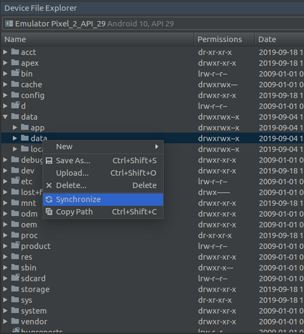

# Data Persistence

We can create and read files in Android. There are two types of storage: internal storage and external storage.

Create a new empty Activity Android project. Name it HelloDataPersistence1.

Edit app / java / com.example.hellodatapersistence1 / MainActivity.

Make import statements like this.
```kotlin
import android.content.Context
import androidx.appcompat.app.AppCompatActivity
import android.os.Bundle
import android.util.Log
import java.io.*
```

Add a constant value for logging purpose.
```kotlin
const val LOG = "data-persistence"
```

Android has a resource directory for raw files, named “raw”.

## Raw Folder

Create a app / res / raw resource directory. Create a file inside app / res / raw directory, named file1.txt. Open file1.txt and write anything.

Line1.  
Line2.

Create a new method inside MainActivity.
```kotlin
fun readRaw() {
    val inputStream1 = resources.openRawResource(R.raw.file1)
    val content = StringBuilder()
    val reader = inputStream1.reader()
    val buffered = reader.buffered()
    do {
        val line = buffered.readLine()
        if (line!=null)
            content.append(line)
    } while (line != null)
    buffered.close()
    reader.close()
    inputStream1.close()
    Log.d(LOG, "Reading from raw folder")
    Log.d(LOG, content.toString())
}
```

We refer to a file inside raw resource folder using this statement: R.raw.file1. Notice that we don’t use extension of the file. To get the file stream, we can use openRawResource method from resources object.

To read the file we can use buffered reader and its readLine method.
```kotlin
val content = StringBuilder()
val reader = inputStream1.reader()
val buffered = reader.buffered()
do {
    val line = buffered.readLine()
    if (line!=null)
        content.append(line)
} while (line != null)
reader.close()
```

Execute readRaw method inside onCreate method. If we run the application, we can get the output of the file inside raw resource folder.
```
2019-09-26 16:23:41.790 6114-6114/com.example.hellodatapersistence1 D/data-persistence: Reading from raw folder
2019-09-26 16:23:41.790 6114-6114/com.example.hellodatapersistence1 D/data-persistence: Line1.Line2.
```

## Assets Folder

To create assets folder we must switch from Android mode to Project mode in the tree panel.

<p align="center">

</p>

Create a folder app / src / main / assets. Then create a new file inside that assets folder, named file2.txt. Write anything inside that file.

Line1.  
Line2.  
Line3.  

Create a new method, named readAssets.
```kotlin
fun readAssets() {
    val inputStream1 = assets.open("file2.txt")
    inputStream1.reader().use { reader ->
        val content = reader.buffered().use { it.readText() }
        Log.d(LOG, "Reading from assets folder")
        Log.d(LOG, content)
    }
}
```

To get the input stream from the file in assets folder, we can use open method from assets object.

Then we can use the previous way to read the file in readRaw method. Or we can use idiomatic Kotlin code with “use” method. With “use” method, we don’t need to close the resource object manually.

Execute readAssets method in onCreate method and we will get this output in LogCat.
```
2019-09-26 16:23:41.791 6114-6114/com.example.hellodatapersistence1 D/data-persistence: Reading from assets folder
2019-09-26 16:23:41.791 6114-6114/com.example.hellodatapersistence1 D/data-persistence: Line1.
    Line2.
    Line3.
```

## Internal Storage

To write a file to internal storage programmatically, we get the internal storage directory with filesDir attribute from the application context.

Add a new method named writeToInternalStorage.
```kotlin
fun writeToInternalStorage() {
    val file1 = File(applicationContext.filesDir, "file3")
    val outputStream1 = FileOutputStream(file1)
    val outputStreamWriter1 = OutputStreamWriter(outputStream1)
    val writer1 = BufferedWriter(outputStreamWriter1)

    writer1.write("Line1.\n")
    writer1.write("Line2.\n")
    writer1.write("Line3.\n")
    writer1.write("Line4.\n")
    writer1.flush()
    outputStream1.fd.sync()
    writer1.close()
    outputStreamWriter1.close()
    outputStream1.close()
}
```

The key point is we create a file object inside the internal storage directory (applicationContext.filesDir).
```kotlin
val file1 = File(applicationContext.filesDir, "file3")
```

To write data to a file, we can use FileOutputStream, OutputStreamWriter, and BufferedWriter.

To make sure the file is written synchronously, we can use flush method of the writer and sync method of fd attribute of output stream object.

Execute writeToInternalStorage method in onCreate method.

To see whether the file has been created or not, we can launch Device File Explorer from Android Studio.
<p align="center">

</p>

The device file explorer will pop up in the right side of Android Studio.
<p align="center">

</p>

<p align="center">

</p>

Our internal storage is in / data / data / com.example.hellodatapersistence1 folder.

We can click and open the file inside internal storage. The file will be displayed on Android Studio.

To read the file from the internal storage, we still use filesDir attribute from application context.

Create a new method named readFromInternalStorage.
```kotlin
fun readFromInternalStorage() {
    val file1 = File(applicationContext.filesDir, "file3")
    val inputStream1 = FileInputStream(file1)
    inputStream1.reader().use { reader ->
        val content = reader.buffered().use { it.readText() }
        Log.d(LOG, "Reading from internal storage")
        Log.d(LOG, content)
    }
}
```

Execute readFromInternalStorage in onCreate method, we will get this output in LogCat.

To create a directory, we still use applicationContext with its attribute: filesDir. Create a new method, named createDirectoryInsideInternalStorage.
```kotlin
fun createDirectoryInsideInternalStorage() {
    val dir1 = File(applicationContext.filesDir, "dir2")
    if (!dir1.exists())
        dir1.mkdir()
}
```

Execute createDirectoryInsideInternalStorage in onCreate method. We can see the new directory appear in internal storage. But we have to sync it first because the folder is not displayed automatically.
<p align="center">

</p>

Application context also provides convenient methods for dealing with files, such as openFileOutput for writing file and openFileInput for reading file.

Create a new method, named writeUsingContext.
```kotlin
fun writeUsingContext() {
    applicationContext.openFileOutput("file4", Context.MODE_PRIVATE).use { outputStream ->
        outputStream.write("The content of file4, written using application context.".toByteArray())
    }
}
```

For writing the file in internal storage, we must put Context.MODE_PRIVATE as a second parameter in openFileOutput method.

Create a new method, named readUsingContext.
```kotlin
fun readUsingContext() {
    applicationContext.openFileInput("file4").use { inputStream ->
        val text = inputStream.bufferedReader().use {
            it.readText()
        }
        Log.d(LOG, "Reading using application context")
        Log.d(LOG, text)
    }
}
```

Execute writeUsingContext and readUsingContext methods in onCreate method. We will get file4 in internal storage.

## Temporary File

We have a way to create a temporary directory, using createTempFile method. Create a new method, named writeAndReadTmpFile.
```kotlin
fun writeAndReadTmpFile() {
    val filetmp = File.createTempFile("filetmp", ".tmp")
    val outputStream1 = FileOutputStream(filetmp)
    val outputStreamWriter1 = OutputStreamWriter(outputStream1)
    val writer1 = BufferedWriter(outputStreamWriter1)

    writer1.write("The content of the temporary file: filetmp.")
    writer1.flush()
    outputStream1.fd.sync()
    writer1.close()
    outputStreamWriter1.close()
    outputStream1.close()

    val inputStream1 = FileInputStream(filetmp)
    val reader = inputStream1.reader()
    val content = reader.buffered().use { it.readText() }
    Log.d(LOG, "Reading from cache directory")
    Log.d(LOG, content)
}
```

The first parameter of the createTempFile method is the name of the file. The second parameter of the createTempFile method is the extension of the file. The third parameter (which we omit) is the directory of this temporary file. The default value is cache directory in internal storage directory.

The file name of this temporary file will not be filetmp.tmp but something like filetmp5228309935229935921.tmp.

Execute writeAndReadTmpFile method in onCreate method. We can see the temporary file shows up in cache directory. In uncertain time and if it is necessary, Android can delete files in cache directory.

By the end our onCreate method looks like this:
```kotlin
override fun onCreate(savedInstanceState: Bundle?) {
    super.onCreate(savedInstanceState)
    setContentView(R.layout.activity_main)

    readRaw()
    readAssets()
    writeToInternalStorage()
    readFromInternalStorage()
    createDirectoryInsideInternalStorage()
    writeUsingContext()
    readUsingContext()
    writeAndReadTmpFile()
}
```

## External Storage

Create an empty Activity Android project, named HelloDataPersistence2.

Edit app / java / com.example.hellodatapersistence2 / MainActivity.

Add a new method, named writeToExternalStorage.
```kotlin
fun writeToExternalStorage() {
    val file1 = File(applicationContext.getExternalFilesDir(null), "file1")

    FileOutputStream(file1).use { outputStream ->
        OutputStreamWriter(outputStream).use { outputStreamWriter ->
            BufferedWriter(outputStreamWriter).use { bufferedWriter ->
                bufferedWriter.write("Content of file1.\n")
                outputStream.fd.sync()
            }
        }
    }
}
```

We use getExternalFilesDir method from the application context to get the external storage. The first parameter is the subdirectory in the external storage. Because we use null value, we will get the root directory in the external storage.

Execute writeToExternalStorage in onCreate method, and file1 file will be created in external storage. The external storage root directory is / mnt / sdcard / Android / data / com.example.hellodatapersistence2 / files.
<p align="center">

</p>

## Serialization

We can save object from classes in Kotlin to a file. We can use serialization library.

Create a new empty Activity named HelloDataPersistence3.

Edit build.gradle (Project: HelloDataPersistence3).

Add serialization dependency inside “dependencies” block inside “buildscript” block.
```gradle
classpath "org.jetbrains.kotlin:kotlin-serialization:$kotlin_version"
```

Edit build.gradle (Module: app).

Add applying plugin line.
```gradle
apply plugin: 'kotlinx-serialization'
```

Add dependency inside dependencies.
```gradle
implementation "org.jetbrains.kotlinx:kotlinx-serialization-runtime:0.13.0"
```

After synchronizing both build.gradle files, we must edit app / java / com.example.hellodatapersistence3 / MainActivity.

Add these import lines.
```kotlin
import android.util.Log
import kotlinx.serialization.SerialName
import kotlinx.serialization.Serializable
import kotlinx.serialization.Serializer
import kotlinx.serialization.Transient
import kotlinx.serialization.json.Json
```

Add a constant variable declaration for writing log.
```kotlin
const val LOG = "serialization-data"
```

To serialize a class, we must annotate it with @Serializable.
```kotlin
@Serializable
class Currency {
    var id = 0

    @SerialName("displayName")
    var name = "currency"

    @Transient
    var cryptocurrency = true

    override fun toString() = "id: $id, name: $name, cryptocurrency: $cryptocurrency"
}
```

@SerialName annotation overrides the name of the property. In this case our property’s name is changed from “name” to “displayName”.

@Transient annotation hides the property from the serialization process. Remember to imprt Transient from kotlinx serialization library. Otherwise, we will different Transient.

This is the import statement that we should not miss.
```kotlin
import kotlinx.serialization.Transient
```

To deserialize an object of a class from a json string, we must annotate an object with @Serializer annotation.
```kotlin
@Serializer(forClass=Currency::class)
object ExtCurrencySerializer
To see the serialization in action, we must edit onCreate method of MainActivity class.
```

Add @UseExperimental annotation to onCreate method.
```kotlin
@UseExperimental(kotlinx.serialization.UnstableDefault::class)
override fun onCreate(savedInstanceState: Bundle?) {
```

To serialize an object of a class, we must create a serializer object. Put this code inside onCreate method.
```kotlin
val currencySerializer = Currency.serializer()
val currency = Currency()
currency.cryptocurrency = false
val string = Json.stringify(currencySerializer, currency)
Log.d(LOG, string)
```

Run the application and we will get our serialized class in json.
```
2019-09-28 15:56:44.025 9426-9426/com.example.hellodatapersistence3 D/serialization-data: {"id":0,"displayName":"currency"}
```

Notice the “cryptocurrency” property is missing and our “name” property is changed into “displayName” property.

To deserialize our object from json string, we use ExtCurrencySerializer.
```kotlin
val currency2 = Json.parse(ExtCurrencySerializer, string)
Log.d(LOG, currency2.toString())
```

We will get this output if we run the application.
```
2019-09-28 15:56:44.026 9426-9426/com.example.hellodatapersistence3 D/serialization-data: id: 0, name: currency, cryptocurrency: true
```

If you wonder why the value of “cryptocurrency” is true, it happened because we use default value in the class.

## Shared Preferences

We can persist data to Android using Shared Preferences. Shared Preferences uses key-value models. It’s like a global dictionary or map.

Create a new empty Activity Android project. Name it HelloDataPersistence4.

We need to use preference library from androidx library. The original implementation of preference library from Android has been deprecated.

Edit build.gradle (Module.app). Add the dependency of preference inside dependencies.
```gradle
implementation "androidx.preference:preference-ktx:1.1.0"
```

Edit app / java / com.example.hellodatapersistence4 / MainActivity. 

Add these import statements.
```kotlin
import android.util.Log
import androidx.preference.PreferenceManager
```

Add constant variable for logging purpose.
```kotlin
const val LOG = "android-sharedprefs"
```

Shared preferences can be divided into 3 categories: default shared preferences (only one default shared preferences per one application), shared preferences with a name (we can have many shared preferences), shared preference per activity (one activity can have one specific shared preference).

### Default Shared Preferences

Add this code inside onCreate method in MainActivity.
```kotlin
val prefs = PreferenceManager.getDefaultSharedPreferences(this)
with (prefs.edit()) {
    putInt("controlA", 3)
    putString("controlB", "Checked")
    commit()
}
```

To get the default shared preferences, we use PreferenceManager.getDefaultSharedPreferences method.

Then we use “with” block to add values to shared preferences.
```kotlin
with (prefs.edit()) {
    putInt("controlA", 3)
    putString("controlB", "Checked")
    commit()
}
```

edit method of shared preferences gives a reference to shared preferences which we can use to add or update values in the shared preferences.

To add or update values in the shared preferences, we can use putInt, putString, putLong and other similar methods. The first parameter is the name of the key in the default shared preferences. The second parameter is the value to this particular key.

In the last line of the block, we have two options. We can call “commit” method to synchronously write the values to the shared preferences.

To get the values from the shared preferences, we can use getInt, getString, getLong and other similar methods. Add this code inside onCreate method.
```kotlin
val defaultValueInt = 0
val defaultValueString = ""
val controlA = prefs.getInt("controlA", defaultValueInt)
val controlB = prefs.getString("controlB", defaultValueString)
Log.d(LOG, controlA.toString())
Log.d(LOG, controlB)
```

The first parameter is the name of the key in the particular shared preferences. The second parameter is the default value in case there is no corresponding value for particular key in the shared preferences.

Run the application and we will get this output in LogCat.
```
2019-09-30 11:51:42.128 9447-9447/com.example.hellodatapersistence4 D/android-sharedprefs: 3
2019-09-30 11:51:42.128 9447-9447/com.example.hellodatapersistence4 D/android-sharedprefs: Checked
```

### Shared Preferences with Name

We can have as many as shared preferences as we like. We can use different name for other shared preferences.

Add this code inside onCreate method.
```kotlin
val prefsByName = this.getSharedPreferences("preference1", Context.MODE_PRIVATE)
with (prefsByName.edit()) {
    putLong("controlC", 2344L)
    apply()
}
```

To get (create the shared preference implicitly) the shared preferences with different name, we can use getSharedPreferences method. The first parameter is the name of the shared preferences. The second parameter is mode of the shared preferences file. We must use always private mode. The public mode has been deprecated.

Then we use “with” block to add values. Inside this block, instead of “commit” method, we use “apply” method. “apply” method writes values to the shared preferences asynchronously.

To read the values, it is same as usual.
```kotlin
val defaultValueLong = 0L
val controlC = prefsByName.getLong("controlC", defaultValueLong)
Log.d(LOG, controlC.toString())
```

If we run the application, we will get this output in LogCat.
```
2019-09-30 11:51:42.134 9447-9447/com.example.hellodatapersistence4 D/android-sharedprefs: 2344
```

### Shared Preferences of Activity

Each activity has its own dedicated shared preferences.

Add this code inside onCreate method.
```kotlin
val activityPrefs = this.getPreferences(Context.MODE_PRIVATE)
with (activityPrefs.edit()) {
    val stringSet = setOf("bitcoin", "ethereum", "monero")
    putStringSet("controlD", stringSet)
    commit()
}
```

We use getPreferences method. It only accepts one parameter, the mode of the shared preferences. We should only use private mode (Context.MODE_PRIVATE). The public mode has been deprecated.

To read the values, it is same as usual.
```kotlin
val controlD = activityPrefs.getStringSet("controlD", emptySet())
Log.d(LOG, controlD.toString())
```

If we run the application, we will get this output in LogCat.
```
2019-09-30 11:51:42.160 9447-9447/com.example.hellodatapersistence4 D/android-sharedprefs: [ethereum, monero, bitcoin]
```

### Callback

We can add callback to shared preferences.

Add this code inside onCreate method.
```kotlin
prefs.registerOnSharedPreferenceChangeListener { p, s ->
    Log.d(LOG, "Value in preferences changed on: $s.")
    Log.d(LOG, "New value: ${p.getString(s, "")}")
}
```

We use registerOnSharedPreferenceChangeListener callback to catch the even when the value in shared preferences is changed. In the callback, we just print out the new value.

Let’s change the values in the shared preferences.
```kotlin
with (prefs.edit()) {
    putString("controlB", "Unchecked")
    commit()
}
```

If we run the application, we will get this output.
```
2019-09-30 11:51:42.163 9447-9447/com.example.hellodatapersistence4 D/android-sharedprefs: Value in preferences changed on: controlB.
2019-09-30 11:51:42.163 9447-9447/com.example.hellodatapersistence4 D/android-sharedprefs: New value: Unchecked
```

## Sqlite

Shared preferences is not flexible to save values. For a more complicated scenario, we must use Sqlite database.

Create a new empty Activity Android project. Name it HelloDataPersistence5.

Edit app / java / com.example.hellodatapersistence5 / MainActivity.

Add these import statements.
```kotlin
import android.util.Log
import android.content.ContentValues
import android.database.sqlite.SQLiteDatabase
```

Add a constant variable for logging purpose.
```kotlin
const val LOG = "android-sqlite"
```

Edit onCreate method. Add this code.
```kotlin
val sqlitedb = SQLiteDatabase.create(null)
```

To create a database in memory, we can use “create” method. The parameter is CursorFactory type. Most of the time, we give it null value to get default behavior.

After the database is created, we can move forward to create a table. Add this code.
```kotlin
sqlitedb.execSQL("create table currency (" +
        "id primary key," +
        "name varchar(200)," +
        "cryptocurrency int default 0)")
```

To create a table, modify a table’s structure, delete a table, among other things, we use “execSQL” method of the database object.

To insert a row into a table, we don’t use “execSQL” method, but “insert” method. The row that we want to put into the table must be wrapped in ContentValue. Add this code.
```kotlin
val row1 = ContentValues()
row1.put("name", "bitcoin")
row1.put("cryptocurrency", 1)
sqlitedb.insert("currency", null, row1)
```

The first parameter of the “insert” method is the name of the table, the second parameter is null column hack which usually has null value (you need null column hack if you want to insert null values with a complicated situation), the third parameter is the content values object.

For the column that has a default value, we can omit it when creating ContentValues object. Add this code.
```kotlin
val row2 = ContentValues()
row2.put("name", "usd")
sqlitedb.insert("currency", null, row2)
```

To read  data from the database, we can use “query” method. Add this code.
```kotlin
val cursor = sqlitedb.query("currency", arrayOf("id", "name", "cryptocurrency"),
    "name = ?", arrayOf("bitcoin"), null, null, null, null)
```

The first parameter of “query” method is the name of the table.

The second parameter of “query” method is the array of columns we want to get the data.

The third parameter of “query” method is the selection string (without “WHERE” word).

The fourth parameter of “query” method is the array of strings that will replace “?” words in the third parameter.

The fifth parameter of “query” method is the groupBy string.

The sixth parameter of “query” method is the having string.

The seventh parameter of “query” method is the orderBy string.

The eight parameter of “query” method is the limit string.

This “query” method gives us a cursor object.

We need to move the cursor to the first row of the result. Add this code.
```kotlin
if (cursor.moveToFirst()) {

}
```

Then we need to iterate the rows of the result with “moveToNext” method to move to the next row. We need to make sure we have to stop after the last row. Add this code inside the “if” block.
```kotlin
while (!cursor.isAfterLast) {

    cursor.moveToNext()
}
```

Then we can read the data from the columns, with “getInt”, “getString” methods. But at first, we need to get the column index with “getColumnIndex”. Add this code inside “while” block.
```kotlin
val id = cursor.getInt(cursor.getColumnIndex("id"))
val name = cursor.getString(cursor.getColumnIndex("name"))
val cryptocurrency = cursor.getInt(cursor.getColumnIndex("cryptocurrency"))
Log.d(LOG, "$id, $name, $cryptocurrency")
```

Then outside the block, don’t forget to close the cursor object.
```kotlin
cursor.close()
```

The whole code of reading data can be seen below.
```kotlin
val cursor = sqlitedb.query("currency", arrayOf("id", "name", "cryptocurrency"),
    "name = ?", arrayOf("bitcoin"), null, null, null, null)
if (cursor.moveToFirst()) {
    while (!cursor.isAfterLast) {
        val id = cursor.getInt(cursor.getColumnIndex("id"))
        val name = cursor.getString(cursor.getColumnIndex("name"))
        val cryptocurrency = cursor.getInt(cursor.getColumnIndex("cryptocurrency"))
        Log.d(LOG, "$id, $name, $cryptocurrency")
        cursor.moveToNext()
    }
}

cursor.close()
```

To update the data in the table, we can use “update” method. Add this code.
```kotlin
val updatedRow = ContentValues()
updatedRow.put("name", "ethereum")
sqlitedb.update("currency", updatedRow, "name = ?", arrayOf("bitcoin"))
```

The first parameter of “update” method is the name of the table.

The second parameter of “update” method is the content values object that represents new data.

The third parameter of “update” method is the selection string.

The fourth parameter of “update” method is the array of values to replace the “?” words in the third parameter.

We can drop the table using “execSQL” method. Add this code.
```kotlin
sqlitedb.execSQL("drop table currency")
```

Run the application and we will get this output in LogCat.
```
2019-10-02 11:57:59.433 14127-14127/? D/android-sqlite: 0, bitcoin, 1
To create a sqlite database file not in memory but in real file, we can use “openOrCreateDatabase” method from SQLiteDatabase class.
```

Create a new empty Activity Android project. Name it HelloDataPersistence6.

Edit app / java / com.example.hellodatapersistence6 / MainActivity.

Add this code inside onCreate method.
```kotlin
val file = File(applicationContext.filesDir, "file.sqlite3")
val sqlitedb = SQLiteDatabase.openOrCreateDatabase(file, null)
sqlitedb.execSQL("create table currency (" +
        "id primary key," +
        "name varchar(200)," +
        "cryptocurrency int default 0)")

val row1 = ContentValues()
row1.put("name", "bitcoin")
row1.put("cryptocurrency", 1)
sqlitedb.insert("currency", null, row1)
```

The “openOrCreateDatabase” method accepts a file object as the first parameter, and Cursor Factory as the second parameter (most of the time, we just give null value).

After the creation of database file, we can forward to usual stuff.

Run the application. Then open Device File Explorer. Go to / data / data / com.example.hellodatapersistence6 / files. There will be two files: file.sqlite3 and file.sqlite3-journal.

Right click, and download it.
<p align="center">

</p>

Then install sqlite3 program if you don’t have one. On Mac, we can install sqlite3 with brew.
```
$ brew install sqlite3.
```

Go to the directory where we save file.sqlite3 file. Then we can open the database file.
```
$ sqlite3 file.sqlite3

SQLite version 3.11.0 2016-02-15 17:29:24
Enter ".help" for usage hints.
sqlite> select * from currency;
|bitcoin|1
sqlite>
```

### SQLiteOpenHelper

Sometimes we want to change the structure of the database and we need migration to achieve that. We have SQLiteOpenHelper to help us create migration.

Create a new empty Activity Android project. Name it HelloDataPersistence7.

Create a new class file inside app / java / com.example.hellodatapersistence7 and name it CurrencyDatabaseHelper. Add this code inside the file.
```kotlin
import android.content.Context
import android.database.sqlite.SQLiteDatabase
import android.database.sqlite.SQLiteOpenHelper


class CurrencyDatabaseHelper(context: Context) : SQLiteOpenHelper(context, "currency", null, 1) {

    override fun onCreate(p0: SQLiteDatabase?) {
        p0?.execSQL("create table currency (" +
                "id primary key," +
                "name varchar(200)," +
                "cryptocurrency int default 0)")
    }

    override fun onUpgrade(p0: SQLiteDatabase?, p1: Int, p2: Int) {
        if (p2==2 && p1==1) {
            p0?.execSQL("alter table currency add column new_column int default 7")
        }
    }
}
```

We create a custom class that extends SQLiteOpenHelper. The parent class which is SQLiteOpenHelper which accepts 4 parameters. The first one is Context object (we pass the Activity’s context from the child class), the second one is the name of the database file, the third one is the cursor factory (we usually give null value), and the version of database file.

The interesting part of the SQLiteOpenHelper is this “version” parameter. Inside this class, we must implement “onCreate” method and “onUpgrade” method.

The first method (“onCreate”) is being executed when there is no database file in the application. Here, we use the argument which is “p0” to execute “execSQL” method.

The second method (“onUpgrade”) is being executed when there is database file but the version of the database file is lower than the “version” parameter in SQLiteOpenHelper constructor method.

In “onUpgrade” method, we have 3 parameters. The first one is the database object which we can use to execute “execSQL” or other methods. The second one is the version of the database file currently in application. The third one is the new version (the parameter we put in SQLiteOpenHelper constructor method).

In this example, we want to add a new column named “new_column” with integer data type and default value of 7, but only we upgrade database from version 1 to version 2.

Edit app  / java / com.example.hellodatapersistence7 / MainActivity.

Add this code inside “onCreate” method.
```kotlin
val dbhelper = CurrencyDatabaseHelper(this)
val sqlitedb = dbhelper.writableDatabase

val row1 = ContentValues()
row1.put("name", "bitcoin")
row1.put("cryptocurrency", 1)
sqlitedb.insert("currency", null, row1)
```

We instantiate a database helper object then we get a database object with “writableDatabase” property. If we want to just read data from the database, we can use “readableDatabase” property.

Run the application and we will have “currency” database file inside / data / data / com.example.hellodatapersistence7 / databases folder. Save the database file to other directory and open it with “sqlite3” program. We will have this output.
```
SQLite version 3.11.0 2016-02-15 17:29:24
Enter ".help" for usage hints.
sqlite> select * from currency;
|bitcoin|1
sqlite> 
```

Now change the version from “1” to “2” in CurrencyDatabaseHelper.
```kotlin
class CurrencyDatabaseHelper(context: Context) : SQLiteOpenHelper(context, "currency", null, 2) {
```

Then run the application again. Save the database file to other directory and open it with “sqlite3” program. We will have this output.
```
SQLite version 3.11.0 2016-02-15 17:29:24
Enter ".help" for usage hints.
sqlite> select * from currency;
|bitcoin|1|7
|bitcoin|1|7
sqlite>
```

## Room

Usually we use Room for handling Sqlite database in Android. Room gives a nicer API to deal with Sqlite database.

Create a new empty Activity Android project. Name it HelloDataPersistence8.

Edit build.gradle (Module: app).

Add kotlin-kapt plugin.
```gradle
apply plugin: 'kotlin-kapt'
```

Add these dependencies.
```gradle
implementation "androidx.room:room-common:2.2.0-rc01"
kapt "androidx.room:room-compiler:2.2.0-rc01"
implementation "androidx.room:room-runtime:2.2.0-rc01"
```

Add “javaCompileOptions” block inside “defaultConfig” block inside “android” block.
```gradle
javaCompileOptions {
    annotationProcessorOptions {
        arguments = ["room.incremental":"true"]
    }
}
```

We need to do this because we want to use incremental primary key.

In Room architecture, we have each class dedicated for a table. If we want to have three tables in a database, we must create three classes.

Create a new class, app / java / com.example.hellodatapersistence8 / CryptoCurrency. Add this code under package statement.
```kotlin
import androidx.room.ColumnInfo
import androidx.room.Embedded
import androidx.room.Entity
import androidx.room.PrimaryKey


data class FiatMoney(
    var usd_value: Int?,
    var total_supply: Int?
)

@Entity(tableName = "cryptocurrencies")
data class CryptoCurrency(
    @PrimaryKey(autoGenerate = true)
    var id: Int,

    @ColumnInfo(name = "cryptocurrency_name")
    var name: String,

    var description: String?,

    @Embedded
    var fiat_money: FiatMoney
)
```

We annotate the class CryptoCurrency with Entity. We give “tableName” parameter which have a purpose to give a name to the table.

Each parameter in the constructor becomes a column in the table. Each parameter can be annotated.

The first annotation is PrimaryKey.
```kotlin
    @PrimaryKey(autoGenerate = true)
    var id: Int,
```

The “id” column will be the primary key. PrimaryKey annotation accepts “autoGenerate” parameter. If the parameter is set to true, then we can let Room generate the value for “id” column for us.

The second annotation is ColumnInfo.
```kotlin
@ColumnInfo(name = "cryptocurrency_name")
var name: String,
```

The “name” variable will have different name on the table, which is “cryptocurrency_name”.

We can omit any annotation.
```kotlin
var description: String?,
```

It means the “description” variable will have the same name on the table, which is “description”. Since the type of this variable is optional string (String?), the column on the table will be nullable.

The third annotation is Embedded.
```kotlin
@Embedded
var fiat_money: FiatMoney
```

The “FiatMoney” is declared above “CryptoCurrency” class.
```kotlin
data class FiatMoney(
    var usd_value: Int?,
    var total_supply: Int?
)
```

In the table, the “cryptocurrencies” have “usd_value” column and “total_supply” columns. But instead of accessing “usd_value” and “total_supply” variables directly, we embed both variables into a class named “FiatMoney”. This is for abstraction purpose in code.

We want to have two tables so we need to have another class. Create another class, app / java / com.example.hellodatapersistence8 / Programmer. Add this code below package statement.
```kotlin
import androidx.room.Entity
import androidx.room.ForeignKey
import androidx.room.PrimaryKey


@Entity(tableName = "programmers",
        foreignKeys=[ForeignKey(entity=CryptoCurrency::class, parentColumns = ["id"], childColumns = ["cryptocurrency_id"], onDelete=ForeignKey.CASCADE)])
data class Programmer(
    @PrimaryKey(autoGenerate = true)
    var id: Int,

    var name: String,

    var cryptocurrency_id: Int
)
```

This “Programmer” class has similar annotations with the previous class. But there is a main difference. In “Entitiy” annotation we have “foreignKeys” parameter.
```kotlin
foreignKeys=[ForeignKey(entity=CryptoCurrency::class, parentColumns = ["id"], childColumns = ["cryptocurrency_id"], onDelete=ForeignKey.CASCADE)]
```

It accepts a list of “ForeignKey” object. The “ForeignKey” object accepts a number of parameters.

The first one is “entity” parameter. The value for this parameter is the class of the paretn class. In this case, it is “CryptoCurrency::class”. The second parameter is “parentColumns” which accepts value of an array of column names in parent class (CryptoCurrency class). These column names will be linked with the third parameterl, which is “childColumns”. It accepts an array of the column names in child class (Programmer class). The fourth parameter is the rule of what will happen to child row when its parent row is deleted. In this example, the child row is being deleted as well.

In this case, the relationship between CryptoCurrency class and Programmer Class is one-to-many.  A cryptocurrency can have many programmers.

After creating classes representing the tables on the database, we need to create DAO (Data Access Objects) interface. This interface defines how you interact with the table (inserting data, updating data, deleting data, querying data).

Create a new class, app / java / com.example.hellodatapersistence8 / CryptoCurrencyDao. Add this code below the package statement.
```kotlin
import androidx.room.*


@Dao
interface CryptoCurrencyDao {

    @Insert(onConflict = OnConflictStrategy.ABORT)
    fun insertCryptoCurrency(cryptocurrency: CryptoCurrency)

    @Delete
    fun deleteCryptoCurrencies(vararg cryptocurrency: CryptoCurrency)

    @Query("delete from cryptocurrencies")
    fun deleteAllCryptoCurrencies()

    @Query("select * from cryptocurrencies")
    fun getAllCryptoCurrencies(): List<CryptoCurrency>
}
```

We create an interface (not class) and annotate it with “Dao”.

There are some annotations. The first one is “Insert” annotation.
```kotlin
     @Insert(onConflict = OnConflictStrategy.ABORT)
    fun insertCryptoCurrency(cryptocurrency: CryptoCurrency)
```

The “Insert” annotation accepts “onConflict” parameter. What if the object we want to insert into database is already there (we use primary key to check whether the data already exists or not). In this case, we abort the operation. We can have other strategy, such as updating the object.

The second annotation is “Delete”.
```kotlin
@Delete
fun deleteCryptoCurrencies(vararg cryptocurrency: CryptoCurrency)
```

The “Delete” annotation makes the method be able to delete the objects.

The third annotation is “Query”.
```kotlin
@Query("delete from cryptocurrencies")
fun deleteAllCryptoCurrencies()
```

The “Query” annotation accepts an SQL statement. Basically when we call “deleteAllCryptoCurrencies” method, we execute “delete from cryptocurrencies” SQL statement.

We can query data with “Query” annotation.
```kotlin
@Query("select * from cryptocurrencies")
fun getAllCryptoCurrencies(): List<CryptoCurrency>
```

In this case, we have to put return type, a list of CryptoCurrency.

Let’s create Dao interface for Programmer class. Create a new class, app / java / com.example.hellodatapersistence8 / ProgrammerDao.
```kotlin
import androidx.room.*


@Dao
interface ProgrammerDao {

    @Insert(onConflict = OnConflictStrategy.ABORT)
    fun insertProgrammer(programmer: Programmer)

    @Delete
    fun deleteProgrammers(vararg programmer: Programmer)

    @Query("delete from programmers")
    fun deleteAllProgrammers()

    @Query("select * from programmers")
    fun getAllProgrammers(): List<Programmer>

    @Query("select * from programmers where name like :name")
    fun searchProgrammer(name: String): List<Programmer>
}
```

It is same as the previous Dao interface. The last method is a bit different. In “searchProgrammer” method, the parameter for “Query” annotation is a SQL statement with a placeholder, which is “:name”. The “searchProgrammer” method must accepts a parameter variable named “name”.

The last thing we need to create is RoomDatabase class. Create a new class, app / java / com.example.hellodatapersistence8 / CryptoCurrencyDatabase. Add this code below package statement.
```kotlin
import androidx.room.Database
import androidx.room.RoomDatabase


@Database(entities = [CryptoCurrency::class, Programmer::class], version = 1)
abstract class CryptoCurrencyDatabase : RoomDatabase() {

    abstract fun cryptocurrenciesDao(): CryptoCurrencyDao

    abstract fun programmersDao(): ProgrammerDao
}
```

We create a class that extends RoomDatabase and this class must be abstract. Then we can create methods to return Dao interface methods. We also need to annotate this abstract class with “Database” annotation. This annotation accepts parameters. The first one is “entities” parameter which accepts an array of classes representing tables on the database. The second parameter is “version”. This parameter is useful for migration.

Now we are ready to manipulate database.

Edit app / java / com.example.hellodatapersistence8 / MainActivity.

Add these import statements.
```kotlin
import androidx.appcompat.app.AppCompatActivity
import android.os.Bundle
import android.util.Log
import androidx.room.Room
import kotlin.concurrent.thread
```

Add a constant variable declaration for logging purpose.
```kotlin
const val LOG = "android-room"
```

Edit “onCreate” method. Add this code inside the method.
```kotlin
thread {
    playingWithDatabase()
}
```

We can not access database in UI thread so in this example, we create a thread to execute database operations.

Now let’s define “playingWithDatabase” method.
```kotlin
fun playingWithDatabase() {
...
}
```

Add this code inside “playingWithDatabase” method.
```kotlin
val database: CryptoCurrencyDatabase = Room.databaseBuilder(this, CryptoCurrencyDatabase::class.java, "cryptocurrency_database")
    .build()
```

To create a room database object we use “databaseBuilder” method from Room class chained with “build” method. The “databaseBuilder” method accepts the context (we can use the current activity or the application context, the abstract class of CryptoCurrencyDatabase, the name of the database file. The database file later can be found in / data / data / com.example.hellodatapersistence8 / databases / cryptocurrency_database.

To get Dao object, we can call the methods we defined in abstract classes previously.
```kotlin
val cryptoCurrencyDao = database.cryptocurrenciesDao()
val programmerDao = database.programmersDao()
```

Then we can use methods we defined in ProgrammerDao and CryptoCurrencyDao.
```kotlin
programmerDao.deleteAllProgrammers()
cryptoCurrencyDao.deleteAllCryptoCurrencies()
```

To insert data to the database, we must create objects first.
```kotlin
val cryptoCurrency1 = CryptoCurrency(id=1, name="Ethereum", fiat_money=FiatMoney(total_supply=1000, usd_value=130), description=null)
val cryptoCurrency2 = CryptoCurrency(id=0, name="Bitcoin", fiat_money=FiatMoney(total_supply=1000, usd_value=1000), description="The first cryptocurrency")
```

Then we insert these objects using Dao interface.
```kotlin
cryptoCurrencyDao.insertCryptoCurrency(cryptoCurrency1)
cryptoCurrencyDao.insertCryptoCurrency(cryptoCurrency2)
```

We can retrieve all cryptocurrencies from the Dao interface.
```kotlin
val cryptoCurrencies = cryptoCurrencyDao.getAllCryptoCurrencies()
```

Then we can iterate this list of cryptocurrencies.
```kotlin
for (cryptoCurrency in cryptoCurrencies) {
    Log.d(LOG, cryptoCurrency.name)
    Log.d(LOG, cryptoCurrency.id.toString())
    if (!cryptoCurrency.description.isNullOrBlank())
        Log.d(LOG, cryptoCurrency.description!!)
}
```

Dealing with “programmers” table or “Programmer” Dao interface is relatively same.
```kotlin
val programmer1 = Programmer(id=1, name="Jack Bauer", cryptocurrency_id = cryptoCurrencies[0].id)
val programmer2 = Programmer(id=2, name="Wonder Woman", cryptocurrency_id = cryptoCurrencies[1].id)

programmerDao.insertProgrammer(programmer1)
programmerDao.insertProgrammer(programmer2)

val programmers = programmerDao.searchProgrammer("Wonder Woman")

for (programmer in programmers) {
    Log.d(LOG, programmer.name)
}
```

To delete Programmer or CryptoCurrency objects, we can use “deleteProgrammers” and “deleteCryptoCurrencies”.
```kotlin
programmerDao.deleteProgrammers(programmer1, programmer2)
cryptoCurrencyDao.deleteCryptoCurrencies(cryptoCurrency1, cryptoCurrency2)
```

Run the application and we will get this output.
```
2019-10-07 10:07:04.650 27133-27210/com.example.hellodatapersistence8 D/android-room: Ethereum
2019-10-07 10:07:04.650 27133-27210/com.example.hellodatapersistence8 D/android-room: 1
2019-10-07 10:07:04.650 27133-27210/com.example.hellodatapersistence8 D/android-room: Bitcoin
2019-10-07 10:07:04.650 27133-27210/com.example.hellodatapersistence8 D/android-room: 9
2019-10-07 10:07:04.666 27133-27210/com.example.hellodatapersistence8 D/android-room: The first cryptocurrency
2019-10-07 10:07:04.687 27133-27210/com.example.hellodatapersistence8 D/android-room: Wonder Woman
```

# Optional Readings

https://developer.android.com/topic/libraries/architecture/room

https://developer.android.com/training/data-storage/sqlite

# Exercises

1. Create a project on which you use database for data. Combine it with recyclerview. There is a list page and a detail page. There is a screen to enter new data, a screen to update data and a screen to delete data.