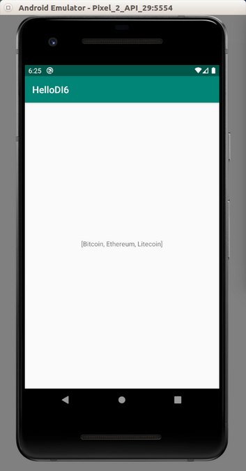

# Dependency Injection

Dependency injection is a technique to decouple components in software engineering. This is useful for testing. So we can replace component that talks to the network with dummy component in testing. We use Koin library for dependency injection.

Create a new empty Activity application. Name it HelloDI1.

Edit build.gradle (Module: app).

Add these dependencies.
```gradle
implementation 'org.koin:koin-android:2.0.0'
implementation 'org.koin:koin-test:2.0.0'
```

Sync the file.

## Injecting Objects

Let’s say we have two components. Component A requires a component (let’s call it Component B) to do its job. Instead creating Component B inside its class, the Component A can receive the Component B which has been created already outside. With this adjustment, we can replace Component B with another component (let’s call it Component C). Component C is simpler for testing for example. Both Component B and Component C must be compatible. They must exhibit same characteristics. We can use interface for this purpose.

This example is based on the example in the official website of Koin.

https://start.insert-koin.io/#/quickstart/android

Create an interface: app / java / com.example.hellodi1 / HelloRepository. In this example, our Component B and Component C must implement giveHello method.
```kotlin
package com.example.hellodi1


interface HelloRepository {
    fun giveHello(): String
}
```

Create an implementation of this interface, app / java / com.example.hellodi1 / HelloRepositoryImpl. This is what we call Component B.
```kotlin
package com.example.hellodi1


class HelloRepositoryImpl : HelloRepository {
    override fun giveHello() = "Hello Koin"
}
```

Create another implementation of this interface, app / java / com.example.hellodi1 / HelloRepositoryTestImpl. This is what we call Component C.

Create a class which uses Component B or Component C, app / java / com.example.hellodi1 / MySimplePresenter.
```kotlin
package com.example.hellodi1


class MySimplePresenter(val repo: HelloRepository) {
    fun sayHello() = "${repo.giveHello()} from presenter"
}
```

This MySimplePresenter class use HelloRepository compatible class to do its job.

Create a module which describes which classes we want to use. Create app / java / com.example.hellodi1 / appModule.
```kotlin
package com.example.hellodi1

import org.koin.dsl.module


val appModule = module {

    single<HelloRepository> { HelloRepositoryImpl() }

    factory { MySimplePresenter(get()) }
}
```

In this module, we use Component B (HelloRepositoryImpl) with MySimplePresenter.

“single” means we keep the object as the singleton.

“factory” will give a new instance every time we want to retrieve this instance.

Usually we use “single” for an object with a long time lifetime. For example: a class instance to connect to database. We will use the database class instance along Android lifecycle.

We use “factory” because we want to get new instance every time we inject this object. For example: a class instance related to a screen (Activity). If we get the same screen again in different time, we want to get a new instance.

Notice “get()” as the parameter inside “MySimplePresenter” constructor. It will retrieve the HelloRepositoryImpl instance automatically because it can find the correct object based on the class of the parameter. If there are more than one alternative, we must specify which object we want. However, the suitable object is only HelloRepositoryImpl instance.

Edit app / java / com.example.hellodi1 / MainActivity.

Add these import lines.
```kotlin
import android.util.Log
import org.koin.android.ext.android.get
import org.koin.android.ext.android.inject
import org.koin.android.ext.koin.androidContext
import org.koin.android.ext.koin.androidLogger
import org.koin.core.context.startKoin
```

Create a constant variable for logging purpose.
```kotlin
const val LOG = "hellodi-log"
```

Get MySimplePresenter instance by injection inside the MainActivity class. This is lazy approach. It will not inject the instance right away.
```kotlin
val mySimplePresenter : MySimplePresenter by inject()
```

Edit onCreate method.

Start the Koin injection process.
```kotlin
startKoin {
    androidLogger()
    androidContext(this@MainActivity)
    modules(appModule)
}
```

“androidLogger” is for logging purpose. “androidContext” is for setting up the context for the Android application. “modules” is for listing modules we want. Remember, module contains which classes we want to inject.

Execute “sayHello” method from “mySimplePresenter” object.
```kotlin
Log.d(LOG, mySimplePresenter.sayHello())
```

We can also inject an instance eagerly by using “get” instead of “inject”. Add these two lines. Eagerness means we must run “startKoin” process before using “get” method.
```kotlin
val mySimplePresenterEager : MySimplePresenter = get()
Log.d(LOG, mySimplePresenterEager.sayHello())
```

If we ran the application, we would get this output.
```
2020-02-06 16:30:59.336 11368-11368/com.example.hellodi1 D/hellodi-log: Hello Koin from presenter
2020-02-06 16:30:59.336 11368-11368/com.example.hellodi1 D/hellodi-log: Hello Koin from presenter
```

## Creating Test With Injection

Suppose we want to use Component C To test the injection, we create app / java / com.example.hellodi1 (test) / HelloKoinTest.
```kotlin
package com.example.hellodi1

import org.junit.After
import org.junit.Before
import org.junit.Test
import org.koin.core.context.startKoin
import org.koin.core.context.stopKoin
import org.koin.dsl.module
import org.koin.test.KoinTest
import org.koin.test.inject


class HelloKoinTest : KoinTest {

    val mySimplePresenter : MySimplePresenter by inject()

    val appModuleTesting = module {

        single<HelloRepository> { HelloRepositoryTestImpl() }

        factory { MySimplePresenter(get()) }
    }

    @Before
    fun setup() {
        startKoin {
            modules(appModuleTesting)
        }
    }

    @Test
    fun should_inject_components() {
        assert(mySimplePresenter.sayHello() == "Hello Koin for Testing from presenter")
    }

    @After
    fun tearDown() {
        stopKoin()
    }
}
```

We still get mySimplePresenter object by injection.
```kotlin
val mySimplePresenter : MySimplePresenter by inject()
```

This time, we want to use Component C, not Component B. We define the injection module here.
```kotlin
val appModuleTesting = module {

    single<HelloRepository> { HelloRepositoryTestImpl() }

    factory { MySimplePresenter(get()) }
}
```

We can start Koin in the setup procedure.
```kotlin
@Before
fun setup() {
    startKoin {
        modules(appModuleTesting)
    }
}
```

We can stop Koin in the tear down procedure.
```kotlin
@After
fun tearDown() {
    stopKoin()
}
```

Then when we executed the “sayHello” method from “mySimplePresenter” object, we would get different output because we inject different class to “mySimplePresenter” object.
```kotlin
@Test
fun should_inject_components() {
    assert(mySimplePresenter.sayHello() == "Hello Koin for Testing from presenter")
}
```

If we ran the test, we would get the success result.

## Named Objects

If we have two similar objects (same interface), we can differentiate them with “named” parameter in the module of dependencies injection.

Create a new empty Activity project. Name it HelloDI2.

Create an interface of HelloRepository, app / java / com.example.hellodi2 / HelloRepository.

```kotlin
package com.example.hellodi2


interface HelloRepository {
    fun giveHello(): String
}
```

Create two different implementations of this interface.

The first one is app / java / com.example.hellodi2 / HelloRepositoryImpl.
```kotlin
package com.example.hellodi2


class HelloRepositoryImpl : HelloRepository {
    override fun giveHello() = "Hello Koin"
}
```

The second one is app / java / com.example.hellodi2 / HelloRepositoryTestImpl.
```kotlin
package com.example.hellodi2


class HelloRepositoryTestImpl : HelloRepository {
    override fun giveHello() = "Hello Koin for Testing"
}
```

Create a presenter in app / java / com.example.hellodi2 / MySimplePresenter.
```kotlin
package com.example.hellodi2


class MySimplePresenter(val repo: HelloRepository) {
    fun sayHello() = "${repo.giveHello()} from presenter"
}
```

Create a module for these classes, app / java / com.example.hellodi2 / appModule.
```kotlin
package com.example.hellodi2

import org.koin.core.qualifier.named
import org.koin.dsl.module


val appModule = module {

    single<HelloRepository>(named("production")) { HelloRepositoryImpl() }

    single<HelloRepository>(named("test")) { HelloRepositoryTestImpl() }

    factory { MySimplePresenter(get(named("production"))) }

}
```

We have two HelloRepository objects. We can differentiate them with “named” parameter. Then in the MySimplePresenter, we use “named” parameter to differentiate which HelloRepository object we want to inject into MySimplePresenter.

Edit app / java / com.example.hellodi2 / MainActivity.
```kotlin
package com.example.hellodi2

import androidx.appcompat.app.AppCompatActivity
import android.os.Bundle
import android.util.Log
import org.koin.android.ext.android.get
import org.koin.android.ext.android.inject
import org.koin.android.ext.koin.androidContext
import org.koin.android.ext.koin.androidLogger
import org.koin.core.context.startKoin
import org.koin.core.qualifier.named


const val LOG = "hellodi-log"

// Code is taken and adapted from https://start.insert-koin.io/#/quickstart/android
class MainActivity : AppCompatActivity() {

    val helloRepository : HelloRepository by inject(named("production"))
    val mySimplePresenter : MySimplePresenter by inject()

    override fun onCreate(savedInstanceState: Bundle?) {
        super.onCreate(savedInstanceState)
        setContentView(R.layout.activity_main)

        startKoin {
            androidLogger()
            androidContext(this@MainActivity)
            modules(appModule)
        }

        Log.d(LOG, helloRepository.giveHello())
        Log.d(LOG, mySimplePresenter.sayHello())

        val helloRepositoryTest : HelloRepository = get(named("test"))
        Log.d(LOG, helloRepositoryTest.giveHello())
    }
}
```

Notice, we inject the object with “named” parameter.
```kotlin
val helloRepository : HelloRepository by inject(named("production"))
```

We can get the object eagerly with “named” parameter.
```kotlin
val helloRepositoryTest : HelloRepository = get(named("test"))
```

If we ran the application, we would get this output.
```
2020-02-07 16:11:21.243 18032-18032/com.example.hellodi2 D/hellodi-log: Hello Koin
2020-02-07 16:11:21.244 18032-18032/com.example.hellodi2 D/hellodi-log: Hello Koin from presenter
2020-02-07 16:11:21.244 18032-18032/com.example.hellodi2 D/hellodi-log: Hello Koin for Testing
```

## Parameters

We can send parameter to the injected object. Create a new empty Activity project. Name it HelloDI3.

Create an interface of HelloRepository, app / java / com.example.hellodi3 / HelloRepository.
```kotlin
package com.example.hellodi3


interface HelloRepository {
    fun giveHello(): String
}
```

Create an implementation of HelloRepository, app / java / com.example.hellodi3 / HelloRepositoryImpl.
```kotlin
package com.example.hellodi3


class HelloRepositoryImpl(val string: String) : HelloRepository {
    override fun giveHello() = "Hello Koin with $string"
}
```

In this implementation, we must send the parameter.

Create another implementation of HelloRepository, app / java / com.example.hellodi3 / HelloRepository2Impl.
```kotlin
package com.example.hellodi3


class HelloRepository2Impl(val string: String) : HelloRepository {
    override fun giveHello() = "Hello Koin 2 with $string"
}
```

Create a module for the dependencies.
```kotlin
package com.example.hellodi3

import org.koin.dsl.module


val appModule = module {

    single { (string: String) -> HelloRepositoryImpl(string) }

    single { (string: String) -> HelloRepository2Impl(string) }

}
```

For injected objects, we must use a callback that accepts parameter.

Then edit MainActivity: app / java / com.example.hellodi3 / MainActivity.
```kotlin
package com.example.hellodi3

import androidx.appcompat.app.AppCompatActivity
import android.os.Bundle
import android.util.Log
import org.koin.android.ext.android.get
import org.koin.android.ext.android.inject
import org.koin.android.ext.koin.androidContext
import org.koin.android.ext.koin.androidLogger
import org.koin.core.context.startKoin
import org.koin.core.parameter.parametersOf


const val LOG = "hellodi-log"

class MainActivity : AppCompatActivity() {

    val helloRepository : HelloRepositoryImpl by inject { parametersOf("Bitcoin") }

    override fun onCreate(savedInstanceState: Bundle?) {
        super.onCreate(savedInstanceState)
        setContentView(R.layout.activity_main)

        startKoin {
            androidLogger()
            androidContext(this@MainActivity)
            modules(appModule)
        }

        Log.d(LOG, helloRepository.giveHello())

        val helloRepositoryEager : HelloRepository2Impl = get { parametersOf("Ethereum") }
        Log.d(LOG, helloRepositoryEager.giveHello())
    }
}
```

Notice that we use “inject” that accepts a callback on which we use “parametersOf” function.
```kotlin
val helloRepository : HelloRepositoryImpl by inject { parametersOf("Bitcoin") }
```

Notice that we use “get” that accepts a callback on which we use “parametersOf” function.
```kotlin
val helloRepositoryEager : HelloRepository2Impl = get { parametersOf("Ethereum") }
```

If we ran the application, we would get this output.
```
2020-02-07 15:22:36.927 17673-17673/? D/hellodi-log: Hello Koin with Bitcoin
2020-02-07 15:22:36.927 17673-17673/? D/hellodi-log: Hello Koin 2 with Ethereum
```

## Android Context

We can get the context of the Android inside the module.

Create a new empty Activity project. Name it HelloDI4.

Create a new string in resource file. Edit app / res / values / strings.xml.
```xml
<resources>
    <string name="app_name">HelloDI4</string>
    <string name="cryptocurrency">Bitcoin</string>
</resources>
```

Create the new module of dependency injections, app / java / com.example.hellodi4 / appModule.
```kotlin
package com.example.hellodi4

import org.koin.android.ext.koin.androidContext
import org.koin.core.qualifier.named
import org.koin.dsl.module


val appModule = module {

    single(named("CRYPTOCURRENCY")) { androidContext().resources.getString(R.string.cryptocurrency) }

}
```

We can get the context of Android with “androidContext”. From there, we can get “resources” and the string value.

Edit app / java / com.example.hellodi4 / MainActivity.
```kotlin
package com.example.hellodi4

import androidx.appcompat.app.AppCompatActivity
import android.os.Bundle
import android.util.Log
import org.koin.android.ext.android.get
import org.koin.android.ext.koin.androidContext
import org.koin.android.ext.koin.androidLogger
import org.koin.core.context.startKoin
import org.koin.core.qualifier.named


const val LOG = "hellodi-log"

class MainActivity : AppCompatActivity() {

    override fun onCreate(savedInstanceState: Bundle?) {
        super.onCreate(savedInstanceState)
        setContentView(R.layout.activity_main)

        startKoin {
            androidLogger()
            androidContext(this@MainActivity)
            modules(appModule)
        }

        val cryptocurrency : String = get(named("CRYPTOCURRENCY"))
        Log.d(LOG, cryptocurrency)
    }
}
```

If we ran the application, we would get this output.
```
2020-02-08 18:04:14.070 19110-19110/com.example.hellodi4 D/hellodi-log: Bitcoin
```

## Scope

With scope, we can isolate injected dependencies. So we can have two different instances of injected object with scope.

Create a new empty Activity. Name it HelloDI5.

Create a new interface, app / java / com.example.hellodi5 / HelloRepository.
```kotlin
package com.example.hellodi5


interface HelloRepository {
    fun giveHello(): String
}
```

Create a new implementation of HelloRepository, app / java / com.example.hellodi5 / HelloRepositoryImpl.
```kotlin
package com.example.hellodi5


class HelloRepositoryImpl : HelloRepository {

    var hello = "Hello"

    override fun giveHello() = "$hello Koin"
}
```

Create a new implementation of HelloRepository, app / java / com.example.hellodi5 / HelloRepositoryTestImpl.
```kotlin
package com.example.hellodi5


class HelloRepositoryTestImpl : HelloRepository {
    override fun giveHello() = "Hello Koin for Testing"
}
```

Create a new module, app / java / com.example.hellodi5 / appModule.
```kotlin
package com.example.hellodi5

import org.koin.core.qualifier.named
import org.koin.dsl.module


val appModule = module {
    scope(named("Scope A")) {
        scoped { HelloRepositoryImpl() }
    }

    scope(named("Scope B")) {
        scoped { HelloRepositoryTestImpl() }
    }
}
```

There are two keywords: “scope” and “scoped”.  “scope” creates a scope. “scoped” creates an injected object that is tied to the scope which surrounds it.

Edit app / java / com.example.hellodi5 / MainActivity.
```kotlin
package com.example.hellodi5

import androidx.appcompat.app.AppCompatActivity
import android.os.Bundle
import android.util.Log
import org.koin.android.ext.android.getKoin
import org.koin.android.ext.koin.androidContext
import org.koin.android.ext.koin.androidLogger
import org.koin.core.context.startKoin
import org.koin.core.qualifier.named
import org.koin.core.scope.Scope


const val LOG = "hellodi-log"

class MainActivity : AppCompatActivity() {

    override fun onCreate(savedInstanceState: Bundle?) {
        super.onCreate(savedInstanceState)
        setContentView(R.layout.activity_main)

        startKoin {
            androidLogger()
            androidContext(this@MainActivity)
            modules(appModule)
        }

        val scopeA = getKoin().createScope("scopeA", named("Scope A"))
        val helloRepositoryImpl = scopeA.get<HelloRepositoryImpl>()
        helloRepositoryImpl.hello = "Hola"
        Log.d(LOG, helloRepositoryImpl.giveHello())

        val helloRepositoryImplSame = scopeA.get<HelloRepositoryImpl>()
        Log.d(LOG, helloRepositoryImplSame.giveHello())

        val scopeA2 = getKoin().createScope("scopeA2", named("Scope A"))
        val helloRepositoryImpl2 = scopeA2.get<HelloRepositoryImpl>()
        Log.d(LOG, helloRepositoryImpl2.giveHello())

        val scopeB : Scope = getKoin().createScope("scopeB", named("Scope B"))
        val helloRepositoryTestImpl = scopeB.get<HelloRepositoryTestImpl>()
        Log.d(LOG, helloRepositoryTestImpl.giveHello())


    }
}
```

To create a scope we must use “createScope” method and give it a name.
```kotlin 
val scopeA = getKoin().createScope("scopeA", named("Scope A"))
```

We create a scope instance named “scopeA” from “Scope A” scope.

From the scope, we can get the instance of the class.
```kotlin
val helloRepositoryImpl = scopeA.get<HelloRepositoryImpl>()
helloRepositoryImpl.hello = "Hola"
Log.d(LOG, helloRepositoryImpl.giveHello())
```

If you took the instance of the class from the same scope instance, you would get the same object.
```kotlin
val helloRepositoryImplSame = scopeA.get<HelloRepositoryImpl>()
Log.d(LOG, helloRepositoryImplSame.giveHello())
```

However, if you create a different instance from the same scope, you can get a new instance.
```kotlin
val scopeA2 = getKoin().createScope("scopeA2", named("Scope A"))
val helloRepositoryImpl2 = scopeA2.get<HelloRepositoryImpl>()
Log.d(LOG, helloRepositoryImpl2.giveHello())
```

If we ran the application, we would get this output.
```
2020-02-09 11:52:34.784 21740-21740/com.example.hellodi5 D/hellodi-log: Hola Koin
2020-02-09 11:52:34.785 21740-21740/com.example.hellodi5 D/hellodi-log: Hola Koin
2020-02-09 11:52:34.785 21740-21740/com.example.hellodi5 D/hellodi-log: Hello Koin
2020-02-09 11:52:34.785 21740-21740/com.example.hellodi5 D/hellodi-log: Hello Koin for Testing
```

## ViewModel

We can inject an object based on view model lifecycle.

Create a new empty Activity application. Name it HelloDI6.

Other than two dependencies of Koin, we need to install another dependencies.

Edit build.gradle (Module: app).
```gradle
implementation 'org.koin:koin-android-viewmodel:2.0.1'
implementation "androidx.lifecycle:lifecycle-viewmodel-ktx:2.2.0"
implementation 'androidx.fragment:fragment-ktx:1.2.1'
```

Sync it.

Create a ViewModel, app / java / com.example.hellodi6 / HelloViewModel.
```kotlin
package com.example.hellodi6

import androidx.lifecycle.ViewModel


class HelloViewModel : ViewModel() {
    private val cryptocurrencies = listOf("Bitcoin", "Ethereum", "Litecoin")

    fun getCryptocurrencies() = cryptocurrencies
}
```

Create a module for this view model dependency, app / java / com.example.hellodi6 / appModule.
```kotlin
package com.example.hellodi6

import org.koin.android.viewmodel.dsl.viewModel
import org.koin.dsl.module


val appModule = module {

    viewModel { HelloViewModel() }
}
```

Notice, we use “viewModel” instead of “single” or “factory”.

Create a detail fragment, a fragment which will be displayed when we click a button on the main fragment, app / java / com.example.hellodi6 / DetailFragment.
```kotlin
package com.example.hellodi6

import android.os.Bundle
import android.view.LayoutInflater
import android.view.View
import android.view.ViewGroup
import android.widget.TextView
import androidx.fragment.app.Fragment
import org.koin.android.viewmodel.ext.android.sharedViewModel


class DetailFragment : Fragment() {

    val cryptocurrency : HelloViewModel by sharedViewModel()

    override fun onCreateView(inflater: LayoutInflater, container: ViewGroup?, savedInstanceState: Bundle?): View? {
        return inflater.inflate(R.layout.fragment_detail, container, false)
    }

    override fun onViewCreated(view: View, savedInstanceState: Bundle?) {
        super.onViewCreated(view, savedInstanceState)
        view.findViewById<TextView>(R.id.textView).text = cryptocurrency.getCryptocurrencies().toString()
    }
}
```

We will inject the HelloViewModel in MainActivity. Here, in this fragment, we get the shared injected view model with “sharedViewModel” method.
```kotlin
val cryptocurrency : HelloViewModel by sharedViewModel()
```

In the onViewCreated method, we access the view model’s method.
```kotlin
view.findViewById<TextView>(R.id.textView).text = cryptocurrency.getCryptocurrencies().toString()
```

Create the main fragment, which we will put in the Activity initially, app / java / com.example.hellodi6 / MainFragment.
```kotlin
package com.example.hellodi6

import android.os.Bundle
import android.view.LayoutInflater
import android.view.View
import android.view.ViewGroup
import android.widget.Button
import androidx.fragment.app.Fragment
import androidx.fragment.app.commit


class MainFragment : Fragment() {

    override fun onCreateView(inflater: LayoutInflater, container: ViewGroup?, savedInstanceState: Bundle?): View? {
        return inflater.inflate(R.layout.fragment_main, container, false)
    }

    override fun onViewCreated(view: View, savedInstanceState: Bundle?) {
        super.onViewCreated(view, savedInstanceState)
        view.findViewById<Button>(R.id.button).setOnClickListener{
            activity?.supportFragmentManager?.commit {
                replace(android.R.id.content, DetailFragment())
                addToBackStack(null)
            }
        }
    }
}
```

Edit app / java / com.example.hellodi6 / MainActivity.
```kotlin 
package com.example.hellodi6

import androidx.appcompat.app.AppCompatActivity
import android.os.Bundle
import android.util.Log
import org.koin.android.ext.koin.androidContext
import org.koin.android.ext.koin.androidLogger
import org.koin.android.viewmodel.ext.android.viewModel
import org.koin.core.context.startKoin


const val LOG = "hellodi-log"

class MainActivity : AppCompatActivity() {

    val cryptocurrency : HelloViewModel by viewModel()

    override fun onCreate(savedInstanceState: Bundle?) {
        super.onCreate(savedInstanceState)

        if (supportFragmentManager.findFragmentById(android.R.id.content) == null) {
            supportFragmentManager.beginTransaction()
                .add(android.R.id.content,
                    MainFragment()).commit()
        }

        startKoin {
            androidLogger()
            androidContext(this@MainActivity)
            modules(appModule)
        }

        Log.d(LOG, cryptocurrency.getCryptocurrencies().toString())
    }
}
```

In this Activity, we inject the view model.
```kotlin
val cryptocurrency : HelloViewModel by viewModel()
```

Create two new layout resources.

The first one is app / res / layout / fragment_main.xml.
```xml
<?xml version="1.0" encoding="utf-8"?>
<androidx.constraintlayout.widget.ConstraintLayout
    xmlns:android="http://schemas.android.com/apk/res/android"
    xmlns:tools="http://schemas.android.com/tools"
    xmlns:app="http://schemas.android.com/apk/res-auto"
    android:layout_width="match_parent"
    android:layout_height="match_parent"
    tools:context=".MainActivity">
    <Button
        android:text="Button"
        android:layout_width="wrap_content"
        android:layout_height="wrap_content"
        android:id="@+id/button" android:layout_marginTop="8dp"
        app:layout_constraintTop_toTopOf="parent" android:layout_marginBottom="8dp"
        app:layout_constraintBottom_toBottomOf="parent" app:layout_constraintStart_toStartOf="parent"
        android:layout_marginStart="8dp" app:layout_constraintEnd_toEndOf="parent" android:layout_marginEnd="8dp"/>
</androidx.constraintlayout.widget.ConstraintLayout>
```

The second one is app / res / layout / fragment_detail.xml.
```xml
<?xml version="1.0" encoding="utf-8"?>
<androidx.constraintlayout.widget.ConstraintLayout xmlns:android="http://schemas.android.com/apk/res/android"
    xmlns:app="http://schemas.android.com/apk/res-auto"
    android:layout_width="match_parent"
    android:layout_height="match_parent">
    <TextView
        android:text="TextView"
        android:layout_width="wrap_content"
        android:layout_height="wrap_content"
        android:id="@+id/textView" app:layout_constraintTop_toTopOf="parent"
        android:layout_marginBottom="8dp" app:layout_constraintBottom_toBottomOf="parent"
        app:layout_constraintEnd_toEndOf="parent" android:layout_marginEnd="8dp"
        app:layout_constraintStart_toStartOf="parent" android:layout_marginStart="8dp"/>
</androidx.constraintlayout.widget.ConstraintLayout>
```

If we ran the application, we would get this output.
```
2020-02-09 16:15:52.904 24100-24100/com.example.hellodi6 D/hellodi-log: [Bitcoin, Ethereum, Litecoin]
```

Then if you clicked the button, you would get this text on the screen.
<p align="center">

</p>

