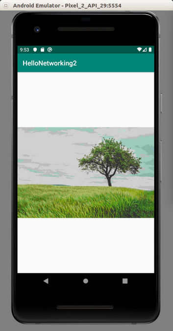
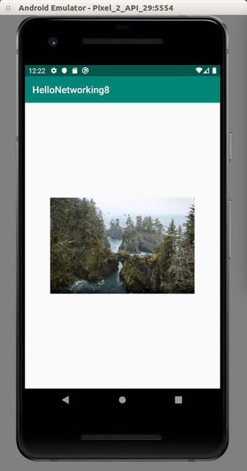
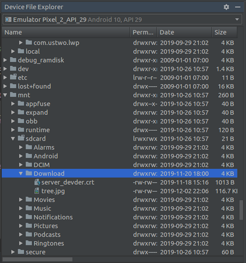
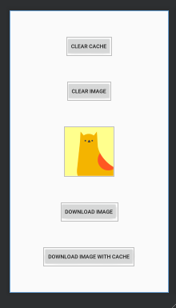
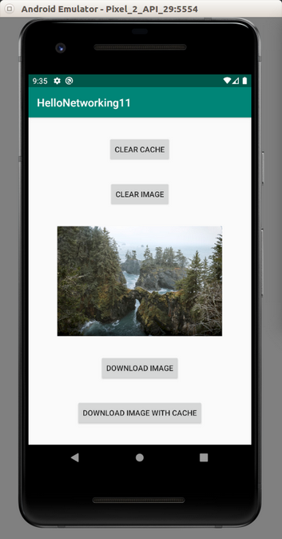

# Networking

It is too cumbersome to access network or internet without third-party libraries. So we will use third-party libraries which are OkHttp and Retrofit.

## Clear Text Configuration

Because we use local server to test the networking code. We need to create a custom networking configuration. By default, Android project can only access https not http.

Create a network security configuration file, app / res / xml / network_security_config.xml.
```xml
<?xml version="1.0" encoding="utf-8"?>
<network-security-config>
    <domain-config cleartextTrafficPermitted="true">
        <domain includeSubdomains="true">10.0.2.2</domain>
    </domain-config>
</network-security-config>
```

By default our localhost has ip address 10.0.2.2, so in this case, we permit clear text communication with the server which has ip address 10.0.2.2.

Then edit manifest file: AndroidManifest.xml. Add these two permissions outside “application” node.
```xml
<uses-permission android:name="android.permission.INTERNET" />
<uses-permission android:name="android.permission.ACCESS_NETWORK_STATE" />
```

Add this attribute on “application” node.
```xml
android:networkSecurityConfig="@xml/network_security_config"
```

## Synchronous and Asynchronous Download

Create a new empty Activity application and name it HelloNetworking1.

The code for server is Common/Backend/code/HelloBackend1. Here is the way to run the server’s code.
```
$ python3.8 -m venv backend-venv
$ source backend-venv/bin/activate
(backend-venv) $ cd Common/Backend/code/HelloBackend1
(backend-venv) $ export FLASK_APP=hello_backend
(backend-venv) $ flask run
```

Edit build.gradle (Module: app). Add this line inside “dependencies” block, then sync it.
```gradle
implementation("com.squareup.okhttp3:okhttp:4.2.1")
```

Edit app / java / com.example.hellonetworking1 / MainActivity.kt.

Add these import lines.
```kotlin
import android.util.Log
import okhttp3.*
import java.io.IOException
import kotlin.concurrent.thread
```

Add this constant variable declaration.
```kotlin
const val LOG = "networking-"
```

Create a http client inside MainActivity class.
```kotlin
private val client = OkHttpClient()
```

Create a method where we can download data synchronously.
```kotlin
fun synchronousDownload() {
    val l = "synchronous"
    val request = Request.Builder()
        .url("http://10.0.2.2:5000")
        .build()
    thread {
        client.newCall(request).execute().use { response ->
            Log.d(LOG + l, response.isSuccessful.toString())
            Log.d(LOG + l, response.headers.toString())
            Log.d(LOG + l, response.headers["Content-Type"]!!)
            Log.d(LOG + l, response.body!!.string())
        }
        Log.d(LOG + l, "After calling the synchronous downloading data process...")
    }
}
```

We create a request object first.
```kotlin
    val request = Request.Builder()
        .url("http://10.0.2.2:5000")
        .build()
```

In this example, we set the url endpoint for the request object. But we can do other things as well, such as setting the headers.

The synchronous call must not be executed on the main thread so that’s why we put the call inside thread block.

We create a call of this request.
```kotlin
client.newCall(request)
```

Then to execute this call synchronously we use “execute” method.
```kotlin
client.newCall(request).execute()
```

Then we add completion block, which is what we want to do after we get all the data.
```kotlin
    client.newCall(request).execute().use { response ->
        Log.d(LOG + l, response.isSuccessful.toString())
        Log.d(LOG + l, response.headers.toString())
        Log.d(LOG + l, response.headers["Content-Type"]!!)
        Log.d(LOG + l, response.body!!.string())
    }
```

In the completion block, we get the response object. We can check whether the response is successful or not with “isSuccessful” method. Successful response means the header of the response is 200 until 399.

We can get the headers of the response with “headers” method. It is a Map data type.

Finally we can get the body of the response with “body” method.

Then we should create another method where we download data asynchronously.
```kotlin
fun asynchronousDownload() {
    val l = "asynchronous"
    val request = Request.Builder()
        .url("http://10.0.2.2:5000")
        .build()
    client.newCall(request).enqueue(object: Callback {
        override fun onFailure(call: Call, e: IOException) {
            e.printStackTrace()
        }

        override fun onResponse(call: Call, response: Response) {
            Log.d(LOG + l, response.isSuccessful.toString())
            Log.d(LOG + l, response.headers.toString())
            Log.d(LOG + l, response.headers["Content-Type"]!!)
            Log.d(LOG + l, response.body!!.string())
        }
    })
    Log.d(LOG + l, "After calling the asynchronous downloading data process...")
}
```

There are some differences between asynchronous download and synchronous download.

The asynchronous download call uses “enqueue” instead of “execute”. We don’t need to put the call inside another thread. We can execute it inside main thread. As the parameter of the “enqueue” method is a Callback object. We have two methods inside this Callback object. The first method is “onFailure” method. The second method is “onResponse” method. “onFailure” method is called when we got error response. “onResponse” method is called when we got successful response.

Then run “synchronousDownload” and “asynchronousDownload” methods in “onCreate” method.
```kotlin
override fun onCreate(savedInstanceState: Bundle?) {
    super.onCreate(savedInstanceState)
    setContentView(R.layout.activity_main)

    synchronousDownload()
    Thread.sleep(500)
    asynchronousDownload()
}
```

If we run the application, we would get this output.
```
2019-11-19 14:47:21.403 8544-8583/? D/networking-synchronous: true
2019-11-19 14:47:21.403 8544-8583/? D/networking-synchronous: Content-Type: text/html; charset=utf-8
    Content-Length: 14
    Server: Werkzeug/0.16.0 Python/3.8.0
    Date: Tue, 19 Nov 2019 07:47:22 GMT
2019-11-19 14:47:21.403 8544-8583/? D/networking-synchronous: text/html; charset=utf-8
2019-11-19 14:47:21.404 8544-8583/? D/networking-synchronous: Hello Backend!
2019-11-19 14:47:21.404 8544-8583/? D/networking-synchronous: After calling the synchronous downloading data process...
2019-11-19 14:47:21.895 8544-8544/? D/networking-asynchronous: After calling the asynchronous downloading data process...
2019-11-19 14:47:21.916 8544-8586/? D/networking-asynchronous: true
2019-11-19 14:47:21.916 8544-8586/? D/networking-asynchronous: Content-Type: text/html; charset=utf-8
    Content-Length: 14
    Server: Werkzeug/0.16.0 Python/3.8.0
    Date: Tue, 19 Nov 2019 07:47:23 GMT
2019-11-19 14:47:21.916 8544-8586/? D/networking-asynchronous: text/html; charset=utf-8
2019-11-19 14:47:21.917 8544-8586/? D/networking-asynchronous: Hello Backend!
```

As you notice, the synchronous download finishes itself before executing the next line. On different side, the asynchronous download executes the next line before it finishes itself.

## Downloading Image

Downloading image is similar to downloading the string. We will discuss the code to update the image view with the downloaded data.

The code for server is Common/Backend/code/HelloBackend2. Here is the way to run the server’s code.
```
$ python3.8 -m venv backend-venv
$ source backend-venv/bin/activate
(backend-venv) $ cd Common/Backend/code/HelloBackend2
(backend-venv) $ export FLASK_APP=hello_image.py
(backend-venv) $ flask run
```

Create a new empty Activity project. Name it HelloNetworking2.

Don’t forget to set the project so it can use clear text communication.

Edit build.gradle (Module: app). Add this line inside “dependencies” block, then sync it.
```gradle
implementation("com.squareup.okhttp3:okhttp:4.2.1")
```

Edit app / res / layout / activity_main.xml. We want to put an image view.
```xml
<?xml version="1.0" encoding="utf-8"?>
<androidx.constraintlayout.widget.ConstraintLayout xmlns:android="http://schemas.android.com/apk/res/android"
    xmlns:app="http://schemas.android.com/apk/res-auto"
    xmlns:tools="http://schemas.android.com/tools"
    android:layout_width="match_parent"
    android:layout_height="match_parent"
    tools:context=".MainActivity">

    <ImageView
        android:id="@+id/imageView"
        android:layout_width="wrap_content"
        android:layout_height="wrap_content"
        app:layout_constraintBottom_toBottomOf="parent"
        app:layout_constraintEnd_toEndOf="parent"
        app:layout_constraintHorizontal_bias="0.5"
        app:layout_constraintStart_toStartOf="parent"
        app:layout_constraintTop_toTopOf="parent"
        tools:srcCompat="@tools:sample/avatars[10]" />
</androidx.constraintlayout.widget.ConstraintLayout>
```

Edit app / java / com.example.hellonetworking1 / MainActivity.kt.

Add these import lines.
```kotlin
import android.widget.ImageView
import okhttp3.OkHttpClient
import okhttp3.Request
import kotlin.concurrent.thread
```

Create a variable for http client.
```kotlin
private val client = OkHttpClient()
```

Create an image view variable.
```kotlin
private var imageView: ImageView? = null
```

Create a method inside MainActivity. Name it “downloadImage”.
```kotlin
fun downloadImage() {
    val request = Request.Builder()
        .url("http://10.0.2.2:5000/image")
        .build()
    thread {
        client.newCall(request).execute().use { response ->
            val imageBytes = response.body!!.byteStream()
            val image = BitmapFactory.decodeStream(imageBytes)
            runOnUiThread {
                imageView!!.setImageBitmap(image)
            }
        }
    }
}
```

We need to get the stream of bytes from the body of the response object.
```kotlin
val imageBytes = response.body!!.byteStream()
```

After that, we create a bitmap image from the input stream.
```kotlin
val image = BitmapFactory.decodeStream(imageBytes)
```

Then we set the bitmap to the image view. Remember, to update UI, we must use UI thread.
```kotlin
    runOnUiThread {
        imageView!!.setImageBitmap(image)
    }
```

Don’t forget to get the reference of the image view and execute “downloadImage” method in “onCreate” method.
```kotlin
override fun onCreate(savedInstanceState: Bundle?) {
    super.onCreate(savedInstanceState)
    setContentView(R.layout.activity_main)

    imageView = findViewById(R.id.imageView)
    downloadImage()
}
```

If we run the application, we would get this screen.
<p align="center">

</p>

## Uploading Image

We can also upload image.

The code for server is Common/Backend/code/HelloBackend3. Here is the way to run the server’s code.
```
$ python3.8 -m venv backend-venv
$ source backend-venv/bin/activate
(backend-venv) $ cd Common/Backend/code/HelloBackend3
(backend-venv) $ export FLASK_APP=hello_upload
(backend-venv) $ flask run
```

Create a new empty Activity project. Name it HelloNetworking2.

Don’t forget to set the project so it can use clear text communication.

Edit build.gradle (Module: app). Add this line inside “dependencies” block, then sync it.
```gradle
implementation("com.squareup.okhttp3:okhttp:4.2.1")
```

Add an jpeg image to app / res / drawable. Name the image “tree.jpg”.

Edit app / java / com.example.hellonetworking3 / MainActivity.kt.

Add these import lines.
```kotlin
import android.util.Log
import android.graphics.Bitmap
import android.graphics.BitmapFactory
import okhttp3.*
import okhttp3.RequestBody.Companion.toRequestBody
import okhttp3.MediaType.Companion.toMediaTypeOrNull
import java.io.ByteArrayOutputStream
import kotlin.concurrent.thread
```

Add a constant variable declaration.
```kotlin
const val LOG = "android-networking"
```

Create a http client variable inside MainActivity class.
```kotlin
private val client = OkHttpClient()
```

Create a new method. Name it “uploadImage”.
```kotlin
fun uploadImage() {
    val bitmapImage = BitmapFactory.decodeResource(applicationContext.resources, R.drawable.tree)
    val stream = ByteArrayOutputStream()
    bitmapImage.compress(Bitmap.CompressFormat.JPEG, 90, stream)
    val image = stream.toByteArray()

    val header = Headers.headersOf("Content-Disposition", "form-data; name=\"file\"; filename=\"tree.jpg\"")
    val jpgMediaType = "image/jpg".toMediaTypeOrNull()
    val imageRequestBody = image.toRequestBody(jpgMediaType)
    val requestBody = MultipartBody.Builder()
        .setType(MultipartBody.FORM)
        .addPart(header, imageRequestBody)
        .build()

    val request = Request.Builder()
        .url("http://10.0.2.2:5000/upload_image")
        .post(requestBody)
        .build()

    thread {
        client.newCall(request).execute().use { response ->
            val string = response.body!!.string()
            Log.d(LOG, string)
        }
    }
}
```

We convert the image in app / res / drawable / tree.jpg to byte array.
```kotlin
val bitmapImage = BitmapFactory.decodeResource(applicationContext.resources, R.drawable.tree)
val stream = ByteArrayOutputStream()
bitmapImage.compress(Bitmap.CompressFormat.JPEG, 90, stream)
val image = stream.toByteArray()
```

Then we need to create a header for the request body.
```kotlin
val header = Headers.headersOf("Content-Disposition", "form-data; name=\"file\"; filename=\"tree.jpg\"")
```

The content disposition header is to set the name of the field and its value for our image.

https://developer.mozilla.org/en-US/docs/Web/HTTP/Headers/Content-Disposition

Then we create the media type of jpeg.
```kotlin
val jpgMediaType = "image/jpg".toMediaTypeOrNull()
```

Then we convert the image to jpeg image request body.
```kotlin
val imageRequestBody = image.toRequestBody(jpgMediaType)
```

Then we build the multipart request body.
```kotlin
val requestBody = MultipartBody.Builder()
    .setType(MultipartBody.FORM)
    .addPart(header, imageRequestBody)
    .build()
```

After creating the multipart request body, we need to create a request object.
```kotlin
val request = Request.Builder()
    .url("http://10.0.2.2:5000/upload_image")
    .post(requestBody)
    .build()
```

Notice we put the request body inside the request object with “post” method which accepts a request body object.

Then we can call the “execute” method as usual.
```kotlin
thread {
    client.newCall(request).execute().use { response ->
        val string = response.body!!.string()
        Log.d(LOG, string)
    }
}
```

Don’t forget to call uploadImage method in onCreate method.
```kotlin
override fun onCreate(savedInstanceState: Bundle?) {
    super.onCreate(savedInstanceState)
    setContentView(R.layout.activity_main)

    uploadImage()
}
```

If we run the application, we would get this output in LogCat.
```
2019-11-20 18:02:10.777 14103-14141/com.example.hellonetworking3 D/android-networking: Hello Index!
```

## Downloading JSON

The process to download the JSON data is same as the process to download any data. But we have to decode the JSON into our object.

The code for server is Common/Backend/code/HelloBackend4. Here is the way to run the server’s code.
```
$ python3.8 -m venv backend-venv
$ source backend-venv/bin/activate
(backend-venv) $ cd Common/Backend/code/HelloBackend4
(backend-venv) $ export FLASK_APP=hello_json
(backend-venv) $ flask run
```

Create a new empty Activity project. Name it  HelloNetworking4.

Don’t forget to set the project so it can use clear text communication.

Edit build.gradle (Module: app). Add these lines inside “dependencies” block, then sync it.
```gradle
implementation("com.squareup.okhttp3:okhttp:4.2.1")
implementation 'com.google.code.gson:gson:2.8.6'
```

Create a class as an object for decoding JSON string, app / java / com.example.hellonetworking4 / CryptocurrencyJson.
```kotlin
package com.example.hellonetworking4


class Cryptocurrency(
    val name: String,
    val price: Int
) {
    override fun toString(): String {
        return "Cryptocurrency [name: ${this.name}, price: ${this.price}]"
    }
}

class CryptocurrencyJson(
    val release_date: String,
    val cryptocurrencies: ArrayList<Cryptocurrency>
) {
    override fun toString(): String {
        return "CryptocurrencyJson [release_date: ${this.release_date}, cryptocurrencies: ${this.cryptocurrencies}]"
    }
}
```

The attributes of the class reflect one to one to the attributes in JSON string.

Edit app / java / com.example.hellonetworking4 / MainActivity.

Add this import lines.
```kotlin
import android.util.Log
import com.google.gson.Gson
import okhttp3.OkHttpClient
import okhttp3.Request
import kotlin.concurrent.thread
```

Create a constant variable declaration.
```kotlin
const val LOG = "android-networking"
```

Create a http client variable inside MainActivity class.
```kotlin
private val client = OkHttpClient()
```

Create downloadJson method.
```kotlin 
fun downloadJson() {
    val request = Request.Builder()
        .url("http://10.0.2.2:5000")
        .build()

    thread {
        client.newCall(request).execute().use { response ->
            val string = response.body!!.string()
            val gson = Gson()
            val cryptocurrencyJson = gson.fromJson(string, CryptocurrencyJson::class.java)
            Log.d(LOG, cryptocurrencyJson.toString())
        }
    }
}
```

After getting the string from the response, we need to decode the JSON string with Gson and our classes creating for the JSON decoding purpose.
```kotlin
val gson = Gson()
val cryptocurrencyJson = gson.fromJson(string, CryptocurrencyJson::class.java)
```

Don’t forget to execute downloadJson method in onCreate method.
```kotlin
override fun onCreate(savedInstanceState: Bundle?) {
    super.onCreate(savedInstanceState)
    setContentView(R.layout.activity_main)

    downloadJson()
}
```

If we run the application, we would get this output.
```
2019-11-21 21:58:06.186 17200-17301/? D/android-networking: CryptocurrencyJson [release_date: 2019-09-09, cryptocurrencies: [Cryptocurrency [name: bitcoin, price: 8000], Cryptocurrency [name: ethereum, price: 145], Cryptocurrency [name: litecoin, price: 80]]]
```

## Uploading JSON

We can also upload JSON string and tell the server it is JSON type data so the server can handle it properly.

The code for server is Common/Backend/code/HelloBackend5. Here is the way to run the server’s code.
```
$ python3.8 -m venv backend-venv
$ source backend-venv/bin/activate
(backend-venv) $ cd Common/Backend/code/HelloBackend5
(backend-venv) $ export FLASK_APP=hello_receive_json
(backend-venv) $ flask run
```

Create a new empty Activity project. Name it  HelloNetworking5.

Don’t forget to set the project so it can use clear text communication.

Edit build.gradle (Module: app). Add these lines inside “dependencies” block, then sync it.
```gradle
implementation("com.squareup.okhttp3:okhttp:4.2.1")
implementation 'com.google.code.gson:gson:2.8.6'
```

Create a new class for json encoding purpose in app / java / com.example.hellonetworking5 / CryptocurrencyJson.
```kotlin
package com.example.hellonetworking5

class CryptocurrencyJson(
    val name: String
)
```

Edit app / java / com.example.hellonetworking5 / MainActivity.

Add these import lines.
```kotlin
import com.google.gson.Gson
import okhttp3.MediaType.Companion.toMediaTypeOrNull
import okhttp3.OkHttpClient
import okhttp3.Request
import okhttp3.RequestBody.Companion.toRequestBody
import kotlin.concurrent.thread
```

Create a constant variable declaration.
```kotlin
const val LOG = "android-networking"
```

Create a okhttp client variable inside MainActivity.
```kotlin
private val client = OkHttpClient()
```

Create a method. Name it uploadJson.
```kotlin
fun uploadJson() {
    val gson = Gson()
    val cryptocurrencyJson = CryptocurrencyJson("bitcoin")
    val jsonString = gson.toJson(cryptocurrencyJson)

    val jsonMediaType = "application/json".toMediaTypeOrNull()
    val requestBody = jsonString.toRequestBody(jsonMediaType)

    val request = Request.Builder()
        .url("http://10.0.2.2:5000")
        .post(requestBody)
        .build()

    thread {
        client.newCall(request).execute().use { response ->
            val string = response.body!!.string()
            Log.d(LOG, string)
        }
    }
}
```

First, we create a json string with gson library.
```kotlin
    val gson = Gson()
    val cryptocurrencyJson = CryptocurrencyJson("bitcoin")
    val jsonString = gson.toJson(cryptocurrencyJson)
```

We create a json request body. The crucial thing is to set the content type for this request body.
```kotlin
val jsonMediaType = "application/json".toMediaTypeOrNull()
val requestBody = jsonString.toRequestBody(jsonMediaType)
```

Then we can post this request body as usual with request object.
```kotlin
val request = Request.Builder()
    .url("http://10.0.2.2:5000")
    .post(requestBody)
    .build()
```

Finally we execute this request call.
```kotlin
thread {
    client.newCall(request).execute().use { response ->
        val string = response.body!!.string()
        Log.d(LOG, string)
    }
}
```

Don’t forget to call “uploadJson” method in onCreate method.
```kotlin
override fun onCreate(savedInstanceState: Bundle?) {
    super.onCreate(savedInstanceState)
    setContentView(R.layout.activity_main)

    uploadJson()
}
```

If we run this application, we would get this output in Logcat.
```
2019-11-22 22:44:25.858 22989-23027/? D/android-networking: 10000
```

## Follow Redirect

We can choose to follow redirect response or not from the server.

The code for server is Common/Backend/code/HelloBackend6. Here is the way to run the server’s code.
```
$ python3.8 -m venv backend-venv
$ source backend-venv/bin/activate
(backend-venv) $ cd Common/Backend/code/HelloBackend6
(backend-venv) $ export FLASK_APP=hello_redirect
(backend-venv) $ flask run
```

Create a new empty Activity project. Name it  HelloNetworking6.

Don’t forget to set the project so it can use clear text communication.

Edit build.gradle (Module: app). Add these lines inside “dependencies” block, then sync it.
```gradle
implementation("com.squareup.okhttp3:okhttp:4.2.1")
```

Edit app / java / com.example.hellonetworking6 / MainActivity.

Add these import lines.
```kotlin
import okhttp3.OkHttpClient
import okhttp3.Request
import kotlin.concurrent.thread
```

Create a constant variable declaration.
```kotlin
const val LOG = "networking-"
```

Create a http client builder inside MainActivity class.
```kotlin
private val clientBuilder = OkHttpClient().newBuilder()
```

Then create a method to follow redirect response from the server.
```kotlin
fun followRedirect() {
    val request = Request.Builder()
        .url("http://10.0.2.2:5000")
        .build()

    val client = clientBuilder.build()

    thread {
        client.newCall(request).execute().use { response ->
            val string = response.body!!.string()
            Log.d(LOG + "redirect", string)
        }
    }
}
```

To create a http client from the http client builder.
```kotlin
val client = clientBuilder.build()
```

Then create a method to not follow redirect response from the server.
```kotlin
fun dontFollowRedirect() {
    val request = Request.Builder()
        .url("http://10.0.2.2:5000")
        .build()

    val client = clientBuilder.followRedirects(false).build()

    thread {
        client.newCall(request).execute().use { response ->
            val string = response.body!!.string()
            Log.d(LOG + "not-redirect", string)
        }
    }
}
```

To create a http client which does not follow redirect response, we use “followRedirects” method with false value chained by “build” method.
```kotlin
val client = clientBuilder.followRedirects(false).build()
```

Don’t forget to call these two methods inside “onCreate” method.
```kotlin
override fun onCreate(savedInstanceState: Bundle?) {
    super.onCreate(savedInstanceState)
    setContentView(R.layout.activity_main)

    followRedirect()
    dontFollowRedirect()
}
```

If we run the application, we would get this output in Logcat.
```
2019-11-23 14:51:38.786 24299-24340/com.example.hellonetworking6 D/networking-not-redirect: <!DOCTYPE HTML PUBLIC "-//W3C//DTD HTML 3.2 Final//EN">
    <title>Redirecting...</title>
    <h1>Redirecting...</h1>
    <p>You should be redirected automatically to target URL: <a href="/page2">/page2</a>.  If not click the link.
2019-11-23 14:51:38.792 24299-24339/com.example.hellonetworking6 D/networking-redirect: Hello Redirect!
```

## Uploading Form Data

We can upload the form data to the server.

The code for server is Common/Backend/code/HelloBackend7. Here is the way to run the server’s code.
```
$ python3.8 -m venv backend-venv
$ source backend-venv/bin/activate
(backend-venv) $ cd Common/Backend/code/HelloBackend7
(backend-venv) $ export FLASK_APP=hello_form
(backend-venv) $ flask run
```

Create a new empty Activity project. Name it  HelloNetworking7.

Don’t forget to set the project so it can use clear text communication.

Edit build.gradle (Module: app). Add these lines inside “dependencies” block, then sync it.
```gradle
implementation("com.squareup.okhttp3:okhttp:4.2.1")
```

Edit app / java / com.example.hellonetworking7 / MainActivity.

Add these import lines.
```kotlin
import okhttp3.FormBody
import okhttp3.OkHttpClient
import okhttp3.Request
import kotlin.concurrent.thread
```

Create a new constant variable declaration.
```kotlin
const val LOG = "android-networking"
```

Create a okhttp client variable inside MainActivity.
```kotlin
private val client = OkHttpClient()
```

Create a new method. Name it uploadForm.
```kotlin
fun uploadForm() {
    val requestBody = FormBody.Builder()
        .add("name", "john woo")
        .add("age", "23")
        .build()
    val request = Request.Builder()
        .url("http://10.0.2.2:5000")
        .post(requestBody)
        .build()

    thread {
        client.newCall(request).execute().use { response ->
            val string = response.body!!.string()
            Log.d(LOG, string)
        }
    }
}
```

If our server accepts form data, in client, we use FormBody. Then we can add a field name and its value.
```kotlin
val requestBody = FormBody.Builder()
    .add("name", "john woo")
    .add("age", "23")
    .build()
```

Then we can post this request body with request object.
```kotlin
val request = Request.Builder()
    .url("http://10.0.2.2:5000")
    .post(requestBody)
    .build()
```

The rest is same as usual.
```kotlin
thread {
    client.newCall(request).execute().use { response ->
        val string = response.body!!.string()
        Log.d(LOG, string)
    }
}
```

If we run the application, we would get this output.
```
2019-11-25 09:59:40.241 25995-26048/com.example.hellonetworking7 D/android-networking: JOHN WOO is 46 years old
```

## Progress of Downloading Data

We can get the progress of downloading data with interceptor.

Create a new empty Activity project. Name it  HelloNetworking8.

Don’t forget to set the project so it can use clear text communication.

Edit build.gradle (Module: app). Add these lines inside “dependencies” block, then sync it.
```gradle
implementation("com.squareup.okhttp3:okhttp:4.2.1")
```

Create an interface for the download progress listener, app / java / com.example.hellonetworking8 / DownloadProgressListener.
```kotlin
package com.example.hellonetworking8


interface DownloadProgressListener {
    fun update(bytesRead: Long, contentLength: Long, done: Boolean)
}
```

The “bytesRead” variable indicates how many bytes we got in this particular moment. The “contentLength” variable indicates how many bytes is the total download size. The “done” variable indicates whether the download is finished or not.

Then we create a class that inherits ResponseBody, app / java / com.example.hellonetworking8 / DownloadProgressResponseBody.
```kotlin
package com.example.hellonetworking8

import okhttp3.MediaType
import okhttp3.ResponseBody
import okio.*
import java.io.IOException


class DownloadProgressResponseBody(val responseBody: ResponseBody, val downloadProgressListener: DownloadProgressListener): ResponseBody() {

    private var bufferedSource: BufferedSource? = null

    override fun contentLength(): Long = responseBody.contentLength()

    override fun contentType(): MediaType? = responseBody.contentType()

    override fun source(): BufferedSource {
        if (bufferedSource == null)
            bufferedSource = getforwardSource(responseBody.source()).buffer()
        return bufferedSource!!
    }

    private fun getforwardSource(source: Source): Source =
        object : ForwardingSource(source) {
            var totalBytesRead = 0L

            @Throws(IOException::class)
            override fun read(sink: Buffer, byteCount: Long): Long {
                val bytesRead = super.read(sink, byteCount)

                totalBytesRead += if (bytesRead != -1L) bytesRead else 0
                downloadProgressListener.update(totalBytesRead, responseBody.contentLength(), bytesRead == -1L)
                return bytesRead
            }
        }
}
```

This class inherits “ResponseBody” class. Because of that, we need to override 3 methods.

The first overridden method is “contentLength”, which is to describe how many bytes this response body is.
```kotlin
override fun contentLength(): Long = responseBody.contentLength()
```

The second overridden method is “contentType”, which is to describe the content type of the response body.
```kotlin
override fun contentType(): MediaType? = responseBody.contentType()
```

The third overridden method is “source”, which is to get the buffered source of the response body. But in this case, we intercept the source.
```kotlin
private var bufferedSource: BufferedSource? = null

override fun source(): BufferedSource {
    if (bufferedSource == null)
        bufferedSource = getforwardSource(responseBody.source()).buffer()
    return bufferedSource!!
}
```

The “getForwardSource” method is where we intercept the source of the response body.
```kotlin
private fun getforwardSource(source: Source): Source =
    object : ForwardingSource(source) {
        var totalBytesRead = 0L

        @Throws(IOException::class)
        override fun read(sink: Buffer, byteCount: Long): Long {
            val bytesRead = super.read(sink, byteCount)

            totalBytesRead += if (bytesRead != -1L) bytesRead else 0
            downloadProgressListener.update(totalBytesRead, responseBody.contentLength(), bytesRead == -1L)
            return bytesRead
        }
    }
```

The ForwardingSource is a subclass of Source class on which we forward calls to other.

In the overridden “read” method, we get the original bytes from the response body. This is the bytes of the partial of full downloaded data. Then we measure the total bytes that we have downloaded. After that, we pass the total bytes, the content length of the response body, and whether we are still downloading or not (checking the bytesRead’s value is -1 or not).

The next class that we are creating is Download Progress Interceptor.
```kotlin
package com.example.hellonetworking8

import android.util.Log
import okhttp3.Interceptor
import okhttp3.Response
import java.io.IOException


const val LOG = "android-networking"

class DownloadProgressInterceptor : Interceptor {

    @Throws(IOException::class)
    override fun intercept(chain: Interceptor.Chain): Response {
        val originalResponse = chain.proceed(chain.request())
        val responseBuilder = originalResponse.newBuilder()

        val downloadProgressListener = object: DownloadProgressListener {
            override fun update(bytesRead: Long, contentLength: Long, done: Boolean) {
                if (done) {
                    Log.d(LOG, "Complete downloading item")
                } else {
                    Log.d(LOG, "${(bytesRead * 100) / contentLength}% done")
                }
            }
        }

        val downloadProgressBody = DownloadProgressResponseBody(originalResponse.body!!, downloadProgressListener)

        responseBuilder.body(downloadProgressBody)

        return responseBuilder.build()
    }
}
```

This DownloadProgressInterceptor inherits Interceptor which means we need to override “intercept” method.

Inside the “intercept” method, we get the original response.
```kotlin
val originalResponse = chain.proceed(chain.request())
```

Then we create a builder from this original response.
```kotlin
val responseBuilder = originalResponse.newBuilder()
```

We define the DownloadProgressListener on which inside the “update” method we print out the progress of the downloading data.
```kotlin
val downloadProgressListener = object: DownloadProgressListener {
    override fun update(bytesRead: Long, contentLength: Long, done: Boolean) {
        if (done) {
            Log.d(LOG, "Complete downloading item")
        } else {
            Log.d(LOG, "${(bytesRead * 100) / contentLength}% done")
        }
    }
}
```

Then we construct the DownloadProgressResponseBody object.
```kotlin
val downloadProgressBody = DownloadProgressResponseBody(originalResponse.body!!, downloadProgressListener)
```

Then we set this body to the body of the response builder.
```kotlin
responseBuilder.body(downloadProgressBody)
```

Finally we build the response from the builder and return it.
```kotlin
responseBuilder.body(downloadProgressBody)
```

Edit app / res / layout / activity_main.xml. We need to put one image view in the screen.
```xml
<?xml version="1.0" encoding="utf-8"?>
<androidx.constraintlayout.widget.ConstraintLayout xmlns:android="http://schemas.android.com/apk/res/android"
    xmlns:app="http://schemas.android.com/apk/res-auto"
    xmlns:tools="http://schemas.android.com/tools"
    android:layout_width="match_parent"
    android:layout_height="match_parent"
    tools:context=".MainActivity">

    <ImageView
        android:id="@+id/imageView"
        android:layout_width="wrap_content"
        android:layout_height="wrap_content"
        app:layout_constraintBottom_toBottomOf="parent"
        app:layout_constraintEnd_toEndOf="parent"
        app:layout_constraintStart_toStartOf="parent"
        app:layout_constraintTop_toTopOf="parent"
        tools:srcCompat="@tools:sample/avatars[3]" />
</androidx.constraintlayout.widget.ConstraintLayout>
```

Edit app / java / com.example.hellonetworking8 / MainActivity.

Add these import lines.
```kotlin
import android.widget.ImageView
import okhttp3.OkHttpClient
import okhttp3.Request
import kotlin.concurrent.thread
```

Create an image view variable inside MainActivity.
```kotlin
private var imageView: ImageView? = null
```

In onCreate method, we need to initialize the image view and call our soon-to-be-defined method, named “downloadImageWithProgress”.
```kotlin
imageView = findViewById(R.id.imageView)
downloadImageWithProgress()
```

Create a method, named “downloadImageWithProgress”.
```kotlin
fun downloadImageWithProgress() {
    val imageUrl = "https://images.unsplash.com/photo-1573108037329-37aa135a142e?auto=format&fit=crop&w=800"
    val request = Request.Builder()
        .url(imageUrl)
        .build()

    val client = OkHttpClient.Builder()
        .addNetworkInterceptor(DownloadProgressInterceptor())
        .build()

    thread {
        client.newCall(request).execute().use { response ->
            val imageBytes = response.body!!.byteStream()
            val image = BitmapFactory.decodeStream(imageBytes)
            runOnUiThread {
                imageView!!.setImageBitmap(image)
            }
        }
    }
}
```

We create a request object.
```kotlin
val imageUrl = "https://images.unsplash.com/photo-1573108037329-37aa135a142e?auto=format&fit=crop&w=800"
val request = Request.Builder()
    .url(imageUrl)
    .build()
```

We create a http client object.
```kotlin
val client = OkHttpClient.Builder()
    .addNetworkInterceptor(DownloadProgressInterceptor())
    .build()
```

This time, we use network interceptor with our DownloadProgressInterceptor that we have built before.

Then we can call the request with our http client.
```kotlin
thread {
    client.newCall(request).execute().use { response ->
        val imageBytes = response.body!!.byteStream()
        val image = BitmapFactory.decodeStream(imageBytes)
        runOnUiThread {
            imageView!!.setImageBitmap(image)
        }
    }
}
```

If we run the application, we would get this output.
```
2019-11-27 12:20:06.661 29116-29198/? D/android-networking: 0% done
2019-11-27 12:20:06.672 29116-29198/? D/android-networking: 7% done
2019-11-27 12:20:06.673 29116-29198/? D/android-networking: 8% done
2019-11-27 12:20:06.674 29116-29198/? D/android-networking: 10% done
2019-11-27 12:20:06.674 29116-29198/? D/android-networking: 11% done
2019-11-27 12:20:06.675 29116-29198/? D/android-networking: 13% done
2019-11-27 12:20:06.735 29116-29198/? D/android-networking: 20% done
2019-11-27 12:20:06.735 29116-29198/? D/android-networking: 20% done
2019-11-27 12:20:06.738 29116-29198/? D/android-networking: 27% done
2019-11-27 12:20:06.738 29116-29198/? D/android-networking: 34% done
2019-11-27 12:20:06.739 29116-29198/? D/android-networking: 40% done
2019-11-27 12:20:06.739 29116-29198/? D/android-networking: 47% done
2019-11-27 12:20:06.739 29116-29198/? D/android-networking: 52% done
2019-11-27 12:20:06.768 29116-29198/? D/android-networking: 59% done
2019-11-27 12:20:06.769 29116-29198/? D/android-networking: 66% done
2019-11-27 12:20:06.769 29116-29198/? D/android-networking: 66% done
2019-11-27 12:20:06.773 29116-29198/? D/android-networking: 72% done
2019-11-27 12:20:06.773 29116-29198/? D/android-networking: 73% done
2019-11-27 12:20:06.774 29116-29198/? D/android-networking: 75% done
2019-11-27 12:20:06.787 29116-29198/? D/android-networking: 81% done
2019-11-27 12:20:06.787 29116-29198/? D/android-networking: 81% done
2019-11-27 12:20:06.793 29116-29198/? D/android-networking: 84% done
2019-11-27 12:20:06.802 29116-29198/? D/android-networking: 85% done
2019-11-27 12:20:06.802 29116-29198/? D/android-networking: 86% done
2019-11-27 12:20:06.803 29116-29198/? D/android-networking: 87% done
2019-11-27 12:20:06.803 29116-29198/? D/android-networking: 91% done
2019-11-27 12:20:06.837 29116-29198/? D/android-networking: 98% done
2019-11-27 12:20:06.838 29116-29198/? D/android-networking: 100% done
2019-11-27 12:20:06.838 29116-29198/? D/android-networking: Complete downloading item
```

We would get this screen.
<p align="center">

</p>

## Download Manager

To download a large file in the background, we can use DownloadManager. The download will not shut off even if the app is in the background.

Create a new empty Activity application. Name it HelloNetworking9.

Edit app / res / layout / activity_main.xml.
```xml
<?xml version="1.0" encoding="utf-8"?>
<androidx.constraintlayout.widget.ConstraintLayout xmlns:android="http://schemas.android.com/apk/res/android"
    xmlns:app="http://schemas.android.com/apk/res-auto"
    xmlns:tools="http://schemas.android.com/tools"
    android:layout_width="match_parent"
    android:layout_height="match_parent"
    tools:context=".MainActivity">

    <Button
        android:id="@+id/button"
        android:layout_width="wrap_content"
        android:layout_height="wrap_content"
        android:text="Download"
        app:layout_constraintBottom_toBottomOf="parent"
        app:layout_constraintEnd_toEndOf="parent"
        app:layout_constraintHorizontal_bias="0.5"
        app:layout_constraintStart_toStartOf="parent"
        app:layout_constraintTop_toTopOf="parent" />
</androidx.constraintlayout.widget.ConstraintLayout>
```

We put a button to start downloading process.

Edit app / manifests / AndroidManifest.xml.

Add these 2 permission lines inside “manifest” node.
```xml
<uses-permission android:name="android.permission.INTERNET" />
<uses-permission android:name="android.permission.WRITE_EXTERNAL_STORAGE" />
```

The download manager that we are going to use is not part of the application so it needs a permission to write to external storage. It can not write to internal storage.

We want to create a broadcast receiver to catch the event of the end of the download process. Create a new class, app / java / com.example.hellonetworking9 / OnDownloadReceiver.
```kotlin
package com.example.hellonetworking9

import android.content.BroadcastReceiver
import android.content.Context
import android.content.Intent
import android.util.Log


const val LOG = "download-manager"

class OnDownloadReceiver : BroadcastReceiver() {
    override fun onReceive(context: Context?, intent: Intent?) {
        Log.d(LOG, "Download Complete")
    }
}
```

The broadcast receiver is the subclass of BroadcastReceiver. We need to override “onReceive” method. In this example, we just log a string.

Edit app / java / com.example.hellonetworking9 / MainActivity.

Add these import lines.
```kotlin
import android.app.DownloadManager
import android.content.Context
import android.content.IntentFilter
import android.net.Uri
import android.widget.Button
```

Create an instance of OnDownloadReceiver inside MainActivity class.
```kotlin
val onDownloadReceiver = OnDownloadReceiver()
```

Add a callback to the button.
```kotlin
findViewById<Button>(R.id.button).setOnClickListener {
    download()
}
```

Create “download” method.
```kotlin
fun download() {
    val imageUrl = "https://images.unsplash.com/photo-1573108037329-37aa135a142e?auto=format&fit=crop&w=800"
    val uri = Uri.parse(imageUrl)

    val manager = getSystemService(Context.DOWNLOAD_SERVICE) as DownloadManager

    val req = DownloadManager.Request(uri)
    req.setTitle("Downloading Image")
        .setDestinationInExternalPublicDir(Environment.DIRECTORY_DOWNLOADS, "tree.jpg")
        .setAllowedOverRoaming(false)
        .setDescription("Description of Downloading Image")
        .setMimeType("image/jpeg")
        .setAllowedNetworkTypes(DownloadManager.Request.NETWORK_MOBILE.xor(DownloadManager.Request.NETWORK_WIFI))
    manager.enqueue(req)
}
```

We get the uri object.
```kotlin
val imageUrl = "https://images.unsplash.com/photo-1573108037329-37aa135a142e?auto=format&fit=crop&w=800"
val uri = Uri.parse(imageUrl)
```

Then we get the download manager system service.
```kotlin
val manager = getSystemService(Context.DOWNLOAD_SERVICE) as DownloadManager
```

Then we get the download manager request object.
```kotlin
val req = DownloadManager.Request(uri)
```

We can set the title, the destination of the downloaded object, the allowed network when downloading process begins, the allowed over roaming condition.

Then we can enqueue this request object to the download manager.
```kotlin
manager.enqueue(req)
```

Override method to  register our receiver in “onResume” method.
```kotlin
override fun onResume() {
    super.onResume()

    val filter = IntentFilter(DownloadManager.ACTION_DOWNLOAD_COMPLETE)
    registerReceiver(onDownloadReceiver, filter)
}
```

Override method to unregister our receiver in “onStop” method.
```kotlin
override fun onStop() {
    super.onStop()

    unregisterReceiver(onDownloadReceiver)
}
```

If we ran the application and we pressed the button on the screen, we would get this output in LogCat.
``` 
2019-12-02 22:42:39.542 31936-31936/com.example.hellonetworking9 D/download-manager: Download Complete
```

We can get the file in our sdcard, / mnt / sdcard / Download / tree.jpg.
<p align="center">

</p>

## Authenticating via JSON Web Token (JWT)

We can authenticate using token against the server.

Create a new empty Activity project. Name it HelloNetworking10.

Create app / java / com.example.hellonetworking10 / TokenJson. This class is responsible for decoding the token json string.
```kotlin
package com.example.hellonetworking10


class TokenJson (
    val access_token: String
)
```

Create app / java / com.example.hellonetworking10 / UserAuth. This class is responsible for encoding JSON object containing username and password to json string.
```kotlin
package com.example.hellonetworking10


class UserAuthJson (
    val username: String,
    val password: String
)
```

Edit app / java / com.example.hellonetworking10 / MainActivity.

Add these import lines.
```kotlin
import com.google.gson.Gson
import okhttp3.MediaType.Companion.toMediaTypeOrNull
import okhttp3.OkHttpClient
import okhttp3.Request
import okhttp3.RequestBody.Companion.toRequestBody
import kotlin.concurrent.thread
```

Create a constant variable.
```kotlin
const val LOG = "android-networking"
```

Create a HTTP client variable.
```kotlin
private val client = OkHttpClient()
```

Create a method to get the protected data, named getData.
```kotlin
fun getData(token: String) {
    val request = Request.Builder()
        .addHeader("Authorization", "JWT $token")
        .url("http://10.0.2.2:5000/secret")
        .build()

    client.newCall(request).execute().use { response ->
        val string = response.body!!.string()
        Log.d(LOG, string)
    }
}
```

We need to add a header to authenticate against the server with addHeader method.
```kotlin
val request = Request.Builder()
    .addHeader("Authorization", "JWT $token")
    .url("http://10.0.2.2:5000/secret")
    .build()
```

Create a method to get the token, named “login” method.
```kotlin
fun login() {
    val gson = Gson()
    val userAuthJson = UserAuthJson("john", "password")
    val jsonString = gson.toJson(userAuthJson)

    val jsonMediaType = "application/json".toMediaTypeOrNull()
    val requestBody = jsonString.toRequestBody(jsonMediaType)

    val request = Request.Builder()
        .url("http://10.0.2.2:5000/auth")
        .post(requestBody)
        .build()

    thread {
        client.newCall(request).execute().use { response ->
            val string = response.body!!.string()
            val token = gson.fromJson(string, TokenJson::class.java)
            getData(token.access_token)
        }
    }
}
```

We create a json string containing our username and password.
```kotlin
val gson = Gson()
val userAuthJson = UserAuthJson("john", "password")
val jsonString = gson.toJson(userAuthJson)
```

Then we create a request body from this json string.
```kotlin
val jsonMediaType = "application/json".toMediaTypeOrNull()
val requestBody = jsonString.toRequestBody(jsonMediaType)
```

Then we create a request object.
```kotlin
val request = Request.Builder()
    .url("http://10.0.2.2:5000/auth")
    .post(requestBody)
    .build()
```

Lastly, we decode the json string from the response’s body to the token object before calling getData method.

If we ran the application, we would get this output.
```
2019-12-08 23:15:29.328 10915-10954/com.example.hellonetworking10 D/android-networking: User(id='1')
```

## Caching

We can use cache in networking. So instead of pulling data from the server, we can pull data from the cache.

Create an empty Activity project. Name it HelloNetworking11.

Edit build.gradle (Module:app).
```gradle
implementation("com.squareup.okhttp3:okhttp:4.2.1")
```

Edit app / res / layout / activity_main.xml.
```xml
<?xml version="1.0" encoding="utf-8"?>
<androidx.constraintlayout.widget.ConstraintLayout xmlns:android="http://schemas.android.com/apk/res/android"
    xmlns:app="http://schemas.android.com/apk/res-auto"
    xmlns:tools="http://schemas.android.com/tools"
    android:layout_width="match_parent"
    android:layout_height="match_parent"
    tools:context=".MainActivity">

    <ImageView
        android:id="@+id/imageView"
        android:layout_width="wrap_content"
        android:layout_height="wrap_content"
        app:layout_constraintBottom_toBottomOf="parent"
        app:layout_constraintEnd_toEndOf="parent"
        app:layout_constraintHorizontal_bias="0.5"
        app:layout_constraintStart_toStartOf="parent"
        app:layout_constraintTop_toTopOf="parent"
        tools:srcCompat="@tools:sample/avatars[10]" />

    <Button
        android:id="@+id/buttonDownloadImage"
        android:layout_width="wrap_content"
        android:layout_height="wrap_content"
        android:text="Download Image"
        app:layout_constraintBottom_toTopOf="@+id/buttonDownloadImageWithCache"
        app:layout_constraintEnd_toEndOf="parent"
        app:layout_constraintHorizontal_bias="0.5"
        app:layout_constraintStart_toStartOf="parent"
        app:layout_constraintTop_toBottomOf="@+id/imageView" />

    <Button
        android:id="@+id/buttonDownloadImageWithCache"
        android:layout_width="wrap_content"
        android:layout_height="wrap_content"
        android:text="Download Image with Cache"
        app:layout_constraintBottom_toBottomOf="parent"
        app:layout_constraintEnd_toEndOf="parent"
        app:layout_constraintHorizontal_bias="0.5"
        app:layout_constraintStart_toStartOf="parent"
        app:layout_constraintTop_toBottomOf="@+id/buttonDownloadImage" />

    <Button
        android:id="@+id/buttonClearImage"
        android:layout_width="wrap_content"
        android:layout_height="wrap_content"
        android:text="Clear Image"
        app:layout_constraintBottom_toTopOf="@+id/imageView"
        app:layout_constraintEnd_toEndOf="parent"
        app:layout_constraintHorizontal_bias="0.5"
        app:layout_constraintStart_toStartOf="parent"
        app:layout_constraintTop_toBottomOf="@+id/buttonClearCache" />

    <Button
        android:id="@+id/buttonClearCache"
        android:layout_width="wrap_content"
        android:layout_height="wrap_content"
        android:text="Clear Cache"
        app:layout_constraintBottom_toTopOf="@+id/buttonClearImage"
        app:layout_constraintEnd_toEndOf="parent"
        app:layout_constraintHorizontal_bias="0.5"
        app:layout_constraintStart_toStartOf="parent"
        app:layout_constraintTop_toTopOf="parent" />
</androidx.constraintlayout.widget.ConstraintLayout>
```

We want to create an image view in the middle of the layout. Then add another two buttons on the top of the image view for clearing image and clearing cache. Then add another two buttons on the bottom of the image view for downloading image and getting image from the cache.
<p align="center">

</p>

Edit app / java / com.example.hellonetworking11 / MainActivity.

Add these import lines.
```kotlin
import android.widget.Button
import android.widget.ImageView
import okhttp3.*
import kotlin.concurrent.thread
```

Create an image view variable, an image url variable, and a http client variable.
```kotlin
private var imageView: ImageView? = null

private val imageUrl = "https://images.unsplash.com/photo-1573108037329-37aa135a142e?auto=format&fit=crop&w=800"

private lateinit var client: OkHttpClient
```

Edit onCreate method.
```kotlin
override fun onCreate(savedInstanceState: Bundle?) {
    super.onCreate(savedInstanceState)
    setContentView(R.layout.activity_main)

    findViewById<Button>(R.id.buttonDownloadImage).setOnClickListener {
        downloadImage()
    }

    findViewById<Button>(R.id.buttonDownloadImageWithCache).setOnClickListener {
        downloadImageWithCache()
    }

    findViewById<Button>(R.id.buttonClearImage).setOnClickListener {
        clearImage()
    }

    findViewById<Button>(R.id.buttonClearCache).setOnClickListener {
        clearCache()
    }

    imageView = findViewById(R.id.imageView)

    client = OkHttpClient.Builder().let {
        val cacheSize: Long = 40 * 1024 * 1024
        val cache = Cache(applicationContext.cacheDir, cacheSize)
        it.cache(cache).build()
    }
}
```

In onCreate method, we add a callback for each button.
```kotlin
findViewById<Button>(R.id.buttonDownloadImage).setOnClickListener {
    downloadImage()
}

findViewById<Button>(R.id.buttonDownloadImageWithCache).setOnClickListener {
    downloadImageWithCache()
}

findViewById<Button>(R.id.buttonClearImage).setOnClickListener {
    clearImage()
}

findViewById<Button>(R.id.buttonClearCache).setOnClickListener {
    clearCache()
}
```

Then we set the image view variable.
```kotlin
imageView = findViewById(R.id.imageView)
```

Then we create a http client which uses cache. In order to do this, we create Cache instance and use cache method of the http client builder.
```kotlin
client = OkHttpClient.Builder().let {
    val cacheSize: Long = 40 * 1024 * 1024
    val cache = Cache(applicationContext.cacheDir, cacheSize)
    it.cache(cache).build()
}
```

Then we need to define four methods attached to the four buttons.

Create a method to clear the cache, named clearCache.
```kotlin
fun clearCache() {
    client.cache?.evictAll()
}
```

Create a method to clear the image, named clearImage.
```kotlin
fun clearImage() {
    imageView!!.setImageDrawable(null)
}
```

Create a method to download the image, then save it to cache.
```kotlin
fun downloadImage() {
    val request = Request.Builder()
        .url(imageUrl)
        .build()
    thread {
        client.newCall(request).execute().use { response ->
            val imageBytes = response.body!!.byteStream()
            val image = BitmapFactory.decodeStream(imageBytes)
            runOnUiThread {
                imageView!!.setImageBitmap(image)
            }
        }
    }
}
```

Basically the work has been done by the http client.

Create a method to download the image from the cache.
```kotlin
fun downloadImageWithCache() {
    val request = Request.Builder()
        .cacheControl(CacheControl.FORCE_CACHE)  // CacheControl.FORCE_NETWORK is for disregarding cache and going to the network directly
        .url(imageUrl)
        .build()
    thread {
        client.newCall(request).execute().use { response ->
            response.body?.let {
                val imageBytes = it.byteStream()
                val image = BitmapFactory.decodeStream(imageBytes)
                runOnUiThread {
                    imageView!!.setImageBitmap(image)
                }
            }
        }
    }
}
```

To download data from the cache exclusively, we use cacheControl method and give it CacheControl.FORCE_CACHE value.
```kotlin
val request = Request.Builder()
    .cacheControl(CacheControl.FORCE_CACHE)  // CacheControl.FORCE_NETWORK is for disregarding cache and going to the network directly
    .url(imageUrl)
    .build()
```

If we ran the application, and we clicked the button “Download Image”, we would get this screen.
<p align="center">

</p>

If we clicked “Clear Image” button, the image would disappear. Then if we clicked “Download Image With Cache” button, the image would appear again. Then if we clicked “Clear Image” button, the image would disappear again. Then if we clicked “Clear Cache” button, the cache would be evicted (but we could not see it from the outside). This time, if we clicked “Download Image With Cache”, the image would NOT appear because there is no data anymore in the cache.

## WebSocket

OkHttp library also supports WebSocket. WebSocket is a dual communication channel between client and server. The client can push data to the server and the server can push data to the client.

The server code is in Common / WebSocket /  code / HelloWebSocket1 / hello_websocket.py.
```python
(virtual-environment) $ pip install websockets
(virtual-environment) $ python hello_websocket.py
```

Create a new empty Activity project and name it HelloNetworking12.

We must create a WebSocketListener class, app / java / com.example.hellonetworking12 / MyWebSocketListener.
```kotlin
package com.example.hellonetworking12

import android.util.Log
import okhttp3.Response
import okhttp3.WebSocket
import okhttp3.WebSocketListener


class MyWebSocketListener : WebSocketListener() {

    override fun onMessage(webSocket: WebSocket, text: String) {
        super.onMessage(webSocket, text)
        Log.d(LOG, text)
    }

    override fun onOpen(webSocket: WebSocket, response: Response) {
        super.onOpen(webSocket, response)
        webSocket.send("Hello Jakarta")
    }
}
```
“onOpen” method means the time when we open the websocket channel between our application to the server. In this example, we decided to send string data.

“onMessage” method is called every time when we receive data from the server. In this example, we just print the message in the log.

Edit app / java / com.example.hellonetworking12 / MainActivity.
```kotlin
package com.example.hellonetworking12

import androidx.appcompat.app.AppCompatActivity
import android.os.Bundle
import okhttp3.OkHttpClient
import okhttp3.Request
import kotlin.concurrent.thread


const val LOG = "networking-"

class MainActivity : AppCompatActivity() {

    private val client = OkHttpClient()

    override fun onCreate(savedInstanceState: Bundle?) {
        super.onCreate(savedInstanceState)
        setContentView(R.layout.activity_main)

        val request = Request.Builder()
                .url("http://10.0.2.2:8765")
                .build()
        thread {
            client.newWebSocket(request, MyWebSocketListener())
        }
    }
}
```

The difference compared to previous OkHttp example is for websocket, we use “newWebSocket” method from OkHttpClient instance instead of “newCall” method. “newWebSocket” receives our WebSocketListener instance on top of the Request object.

If we ran the application, we would get this output in log.
```
2020-03-28 23:10:45.882 20619-20664/com.example.hellonetworking12 D/networking-: Hello JakartaHello Jakarta
```

# Optional Readings

https://square.github.io/okhttp/

https://square.github.io/retrofit/

https://developer.mozilla.org/en-US/docs/Web/HTTP

# Exercises

1. Create a chatting application on which you can use WebSocket.

2. Create an application using recyclerview that got the data from the server. Create an interface to create, edit, and delete item with networking to the server.