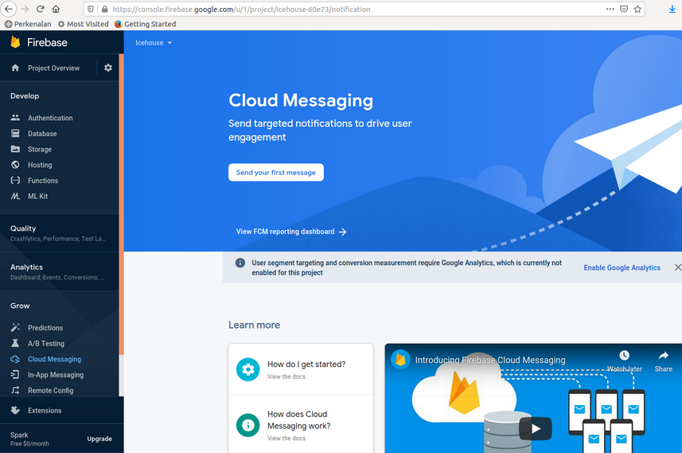

# Notification

We can create a notification in Android. Usually we get notification from outside (push notification) but the notification can be localized also (resembling alarm).

## Basic Notification

Create an empty Activity project. Name it HelloNotification1. This time, use minimum SDK Version 26 because we want to use notification channel. Prior to this, there is no notification channel. An application can categorize their notifications based on channel.

Edit app / res / values / strings.xml.
```xml
<resources>
    <string name="app_name">HelloNotification1</string>
    <string name="notification_title">Hello Title</string>
    <string name="notification_text">Hello Text</string>
    <string name="channel_name">Hello Channel</string>
    <string name="channel_description">Hello Description</string>
    <string name="notification_button">Send Email</string>
</resources>
```

We need to create additional 2 layouts. Each layout is for a screen which we will open when we click the notification.

Create app / res / layout / activity_open_notification.xml.
```xml
<?xml version="1.0" encoding="utf-8"?>
<androidx.constraintlayout.widget.ConstraintLayout xmlns:android="http://schemas.android.com/apk/res/android"
    xmlns:app="http://schemas.android.com/apk/res-auto"
    xmlns:tools="http://schemas.android.com/tools"
    android:layout_width="match_parent"
    android:layout_height="match_parent">

    <TextView
        android:id="@+id/textView"
        android:layout_width="wrap_content"
        android:layout_height="wrap_content"
        android:text="Hello Notification"
        app:layout_constraintBottom_toBottomOf="parent"
        app:layout_constraintEnd_toEndOf="parent"
        app:layout_constraintHorizontal_bias="0.5"
        app:layout_constraintStart_toStartOf="parent"
        app:layout_constraintTop_toTopOf="parent" />
</androidx.constraintlayout.widget.ConstraintLayout>
```

Create app / res / layout / activity_open_notification_with_button.xml.
```xml
<?xml version="1.0" encoding="utf-8"?>
<androidx.constraintlayout.widget.ConstraintLayout xmlns:android="http://schemas.android.com/apk/res/android"
    xmlns:app="http://schemas.android.com/apk/res-auto"
    xmlns:tools="http://schemas.android.com/tools"
    android:layout_width="match_parent"
    android:layout_height="match_parent">­

    <TextView
        android:id="@+id/textView2"
        android:layout_width="wrap_content"
        android:layout_height="wrap_content"
        android:text="Page from Notification Button"
        app:layout_constraintBottom_toBottomOf="parent"
        app:layout_constraintEnd_toEndOf="parent"
        app:layout_constraintHorizontal_bias="0.5"
        app:layout_constraintStart_toStartOf="parent"
        app:layout_constraintTop_toTopOf="parent" />
</androidx.constraintlayout.widget.ConstraintLayout>
```

Create two activities.

The first one is app / java / com.example.hellonotification1 / OpenNotificationActivity.
```kotlin
package com.example.hellonotification1

import android.os.Bundle
import androidx.appcompat.app.AppCompatActivity


class OpenNotificationActivity : AppCompatActivity() {

    override fun onCreate(savedInstanceState: Bundle?) {
        super.onCreate(savedInstanceState)
        setContentView(R.layout.activity_open_notification)
    }
}
```

The second one is app / java / com.example.hellonotification1 / OpenNotificationWithButtonActivity.
```kotlin
package com.example.hellonotification1

import android.os.Bundle
import androidx.appcompat.app.AppCompatActivity


class OpenNotificationWithButtonActivity : AppCompatActivity()  {

    override fun onCreate(savedInstanceState: Bundle?) {
        super.onCreate(savedInstanceState)
        setContentView(R.layout.activity_open_notification_with_button)
    }
}
```

Edit app / java / com.example.hellonotification1 / MainActivity. Empty the file.

Add these import lines and a constant variable.
```kotlin
package com.example.hellonotification1

import android.app.NotificationChannel
import android.app.NotificationManager
import android.app.PendingIntent
import android.content.Context
import android.content.Intent
import android.graphics.Color
import androidx.appcompat.app.AppCompatActivity
import android.os.Bundle
import androidx.core.app.NotificationCompat
import androidx.core.app.NotificationManagerCompat


const val CHANNEL_ID = "channel-hello"
```

Create MainActivity activity class.
```kotlin
// Adapted from https://developer.android.com/training/notify-user/build-notification
class MainActivity : AppCompatActivity() {

    override fun onCreate(savedInstanceState: Bundle?) {
        super.onCreate(savedInstanceState)
        setContentView(R.layout.activity_main)

        createNotificationChannel()

        createNotification()
    }
}
```

Then we define “createNotificationChannel” method inside MainActivity class.
```kotlin
private fun createNotificationChannel() {
    val name = getString(R.string.channel_name)
    val descriptionText = getString(R.string.channel_description)
    val importance = NotificationManager.IMPORTANCE_DEFAULT
    val channel = NotificationChannel(CHANNEL_ID, name, importance).apply {
        description = descriptionText
    }
    val notificationManager: NotificationManager = getSystemService(Context.NOTIFICATION_SERVICE) as NotificationManager
    notificationManager.createNotificationChannel(channel)
}
```

We create a notification channel with NotificationChannel constructor which accepts id, name, and importance.
```kotlin
val channel = NotificationChannel(CHANNEL_ID, name, importance).apply {
    description = descriptionText
}
```

To create a notification channel, we need a notification manager.
```kotlin
val notificationManager = getSystemService(Context.NOTIFICATION_SERVICE) as NotificationManager
notificationManager.createNotificationChannel(channel)
```

Then we create “createNotification” method.
```kotlin
private fun createNotification() {
    val intent = Intent(this, OpenNotificationActivity::class.java).apply {
        flags = Intent.FLAG_ACTIVITY_NEW_TASK or Intent.FLAG_ACTIVITY_CLEAR_TASK
    }
    val pendingIntent = PendingIntent.getActivity(this, 0, intent, 0)

    val intent2 = Intent(this, OpenNotificationWithButtonActivity::class.java).apply {
        flags = Intent.FLAG_ACTIVITY_NEW_TASK or Intent.FLAG_ACTIVITY_CLEAR_TASK
    }
    val buttonIntent = PendingIntent.getActivity(this, 0, intent2, 0)

    val builder = NotificationCompat.Builder(this, CHANNEL_ID)
        .setSmallIcon(android.R.drawable.ic_menu_mylocation)
        .setContentTitle(getString(R.string.notification_title))
        .setContentText(getString(R.string.notification_text))
        .setPriority(NotificationCompat.PRIORITY_DEFAULT)
        .setContentIntent(pendingIntent)
        .addAction(android.R.drawable.ic_dialog_email, getString(R.string.notification_button), buttonIntent)
        .setColorized(true)
        .setColor(Color.parseColor("#ff55fe"))
        .setAutoCancel(true)

    val notificationId = 0

    with(NotificationManagerCompat.from(this)) {
        notify(notificationId, builder.build())
    }
}
```

To create a notification, we use the notification channel id. But first, we must create intents for what we want to achieve when we click the notification or the button in the notification.
```kotlin
val intent = Intent(this, OpenNotificationActivity::class.java).apply {
    flags = Intent.FLAG_ACTIVITY_NEW_TASK or Intent.FLAG_ACTIVITY_CLEAR_TASK
}
val pendingIntent = PendingIntent.getActivity(this, 0, intent, 0)

val intent2 = Intent(this, OpenNotificationWithButtonActivity::class.java).apply {
    flags = Intent.FLAG_ACTIVITY_NEW_TASK or Intent.FLAG_ACTIVITY_CLEAR_TASK
}
val buttonIntent = PendingIntent.getActivity(this, 0, intent2, 0)
```

We create an intent and link it with our Activity classes.
```kotlin
val intent = Intent(this, OpenNotificationActivity::class.java).apply {
    flags = Intent.FLAG_ACTIVITY_NEW_TASK or Intent.FLAG_ACTIVITY_CLEAR_TASK
}
```

Then we create a pending intent which is a setting for intent.
```kotlin
val pendingIntent = PendingIntent.getActivity(this, 0, intent, 0)
```

The second parameter is a request code which is 0. If the intent of the pending intent is same, and we use the same request code, we would get the same pending intent.

The fourth parameter is a flag. For example: FLAG_CANCEL_CURRENT means if the pending intent already exists, we would cancel the current one before creating a new pending intent.

Then we can create a builder of Notification.
```kotlin
val builder = NotificationCompat.Builder(this, CHANNEL_ID)
    .setSmallIcon(android.R.drawable.ic_menu_mylocation)
    .setContentTitle(getString(R.string.notification_title))
    .setContentText(getString(R.string.notification_text))
    .setPriority(NotificationCompat.PRIORITY_DEFAULT)
    .setContentIntent(pendingIntent)
    .addAction(android.R.drawable.ic_dialog_email, getString(R.string.notification_button), buttonIntent)
    .setColorized(true)
    .setColor(Color.parseColor("#ff55fe"))
    .setAutoCancel(true)
```

The builder accept channel id. Then we can set the small icon, the content title, the content text, priority, the content intent (the intent which we will launch when we click the notification body), the color, the action (the intent which we will launch when we click the notification button). The auto cancel is to make sure we remove the notification when we click the notification.

Then to post the notification itself, to show it in the status bar, we use “notify” method.
```kotlin
val notificationId = 0

with(NotificationManagerCompat.from(this)) {
    notify(notificationId, builder.build())
}
```

Edit manifest file to include two activities, app / manifests / AndroidManifest.xml.

Add these 2 nodes inside “application” node.
```xml
<activity android:name=".OpenNotificationActivity"/>
<activity android:name=".OpenNotificationWithButtonActivity"/>
```

If we run the application, we would get a notification.
<p align="center">

</p>

If we clicked the button, or the body of the notification, we would be redirected to a related Activity.
<p align="center">

</p>

## Reply Notification

We can create a notification on which we can write an input on edit text. It’s like Whatsapp notification.

Create an empty Activity project. Name it HelloNotification2. This time, use minimum SDK Version 26 because we want to use notification channel. Prior to this, there is no notification channel. An application can categorize their notifications based on channel.

Edit app / res / values / strings.xml.
```xml
<resources>
    <string name="app_name">HelloNotification2</string>
    <string name="notification_title">Hello Title</string>
    <string name="notification_text">Hello Text</string>
    <string name="channel_name">Hello Channel</string>
    <string name="channel_description">Hello Description</string>
    <string name="notification_button">Send Email</string>
    <string name="reply_label">Reply This Notification</string>
</resources>
```

We need to create additional 1 layouts. This is the layout of the screen of the activity when we click the reply button and the activity which we will land after clicking the body of the updated notification.

Create app / res / layout / activity_open_notification.xml.
```xml
<?xml version="1.0" encoding="utf-8"?>
<androidx.constraintlayout.widget.ConstraintLayout xmlns:android="http://schemas.android.com/apk/res/android"
    xmlns:app="http://schemas.android.com/apk/res-auto"
    xmlns:tools="http://schemas.android.com/tools"
    android:layout_width="match_parent"
    android:layout_height="match_parent">

    <TextView
        android:id="@+id/textView"
        android:layout_width="wrap_content"
        android:layout_height="wrap_content"
        android:text="Hello Notification"
        app:layout_constraintBottom_toBottomOf="parent"
        app:layout_constraintEnd_toEndOf="parent"
        app:layout_constraintHorizontal_bias="0.5"
        app:layout_constraintStart_toStartOf="parent"
        app:layout_constraintTop_toTopOf="parent" />
</androidx.constraintlayout.widget.ConstraintLayout>
```

Edit the manifest file, app / manifests / AndroidManifest.xml. Add the new activity into the manifest file.
```xml
<activity android:name=".OpenNotificationActivity"/>
```

Put the “activity” node inside “application” node.

Edit app / java / com.example.hellonotification2 / MainActivity.
```kotlin
package com.example.hellonotification2

import android.app.NotificationChannel
import android.app.NotificationManager
import android.app.PendingIntent
import android.content.Context
import android.content.Intent
import androidx.appcompat.app.AppCompatActivity
import android.os.Bundle
import androidx.core.app.NotificationCompat
import androidx.core.app.NotificationManagerCompat
import androidx.core.app.RemoteInput


const val CHANNEL_ID = "channel-hello"
const val KEY_TEXT_REPLY = "key_text_reply"

class MainActivity : AppCompatActivity() {

    override fun onCreate(savedInstanceState: Bundle?) {
        super.onCreate(savedInstanceState)
        setContentView(R.layout.activity_main)

        createNotificationChannel()

        createNotification()
    }

    private fun createNotification() {
        val intent = Intent(this, OpenNotificationActivity::class.java).apply {
            flags = Intent.FLAG_ACTIVITY_NEW_TASK or Intent.FLAG_ACTIVITY_CLEAR_TASK
        }
        val pendingIntent = PendingIntent.getActivity(this, 0, intent, PendingIntent.FLAG_UPDATE_CURRENT)

        val replyLabel = getString(R.string.reply_label)
        val remoteInput = RemoteInput.Builder(KEY_TEXT_REPLY).run {
            setLabel(replyLabel)
            build()
        }

        val action = NotificationCompat.Action.Builder(android.R.drawable.ic_lock_idle_lock, replyLabel, pendingIntent)
            .addRemoteInput(remoteInput)
            .build()

        val builder = NotificationCompat.Builder(this, CHANNEL_ID)
            .setSmallIcon(android.R.drawable.ic_menu_mylocation)
            .setContentTitle(getString(R.string.notification_title))
            .setContentText(getString(R.string.notification_text))
            .addAction(action)
            .setAutoCancel(true)

        val notificationId = 0

        with(NotificationManagerCompat.from(this)) {
            notify(notificationId, builder.build())
        }
    }

    private fun createNotificationChannel() {
        val name = getString(R.string.channel_name)
        val descriptionText = getString(R.string.channel_description)
        val importance = NotificationManager.IMPORTANCE_DEFAULT
        val channel = NotificationChannel(CHANNEL_ID, name, importance).apply {
            description = descriptionText
        }
        val notificationManager = getSystemService(Context.NOTIFICATION_SERVICE) as NotificationManager
        notificationManager.createNotificationChannel(channel)
    }
}
```

The “createNotificationChannel” method is same as the previous one.

The difference is in “createNotification” method, especially the action part of the notification compat builder. We need to construct a special action.
```kotlin
val replyLabel = getString(R.string.reply_label)
val remoteInput = RemoteInput.Builder(KEY_TEXT_REPLY).run {
    setLabel(replyLabel)
    build()
}

val action = NotificationCompat.Action.Builder(android.R.drawable.ic_lock_idle_lock, replyLabel, pendingIntent)
    .addRemoteInput(remoteInput)
    .build()
```

The remote input is the edit text on the notification. The action receives this remote input as parameter with the image and the pending intent. This pending intent will be called when we click the “reply” button.

Then we set this “action” object to the notification compat builder.
```kotlin
val builder = NotificationCompat.Builder(this, CHANNEL_ID)
    .setSmallIcon(android.R.drawable.ic_menu_mylocation)
    .setContentTitle(getString(R.string.notification_title))
    .setContentText(getString(R.string.notification_text))
    .addAction(action)
    .setAutoCancel(true)
```

We need to create a new activity to handle the action from this reply notification. Edit app / java / com.example.hellonotification2 / OpenNotificationActivity.
```kotlin
package com.example.hellonotification2

import android.app.PendingIntent
import android.content.Intent
import android.os.Bundle
import android.widget.TextView
import androidx.appcompat.app.AppCompatActivity
import androidx.core.app.NotificationCompat
import androidx.core.app.NotificationManagerCompat
import androidx.core.app.RemoteInput


const val STRING_INPUT = "STRING_INPUT"

class OpenNotificationActivity : AppCompatActivity() {

    override fun onCreate(savedInstanceState: Bundle?) {
        super.onCreate(savedInstanceState)
        setContentView(R.layout.activity_open_notification)

        val remoteInput = RemoteInput.getResultsFromIntent(intent)

        if (remoteInput!=null) {
            val inputString = remoteInput.getCharSequence(KEY_TEXT_REPLY).toString()
            createNotification(inputString)
        } else {
            val textView = findViewById<TextView>(R.id.textView)
            textView.text = intent.getStringExtra(STRING_INPUT)
        }
    }

    private fun createNotification(string : String) {
        val intent = Intent(this, OpenNotificationActivity::class.java).apply {
            flags = Intent.FLAG_ACTIVITY_NEW_TASK or Intent.FLAG_ACTIVITY_CLEAR_TASK
            putExtra(STRING_INPUT, string)
        }
        val pendingIntent = PendingIntent.getActivity(this, 0, intent, PendingIntent.FLAG_UPDATE_CURRENT)

        val builder = NotificationCompat.Builder(this, CHANNEL_ID)
            .setSmallIcon(android.R.drawable.ic_menu_mylocation)
            .setContentTitle(getString(R.string.notification_title))
            .setContentText("Reply sent")
            .setContentIntent(pendingIntent)
            .setAutoCancel(true)

        val notificationId = 0

        with(NotificationManagerCompat.from(this)) {
            notify(notificationId, builder.build())
        }
    }
}
```

In “onCreate” method, we get the “reply” input string with RemoteInput.
```kotlin
val remoteInput = RemoteInput.getResultsFromIntent(intent)

if (remoteInput!=null) {
    val inputString = remoteInput.getCharSequence(KEY_TEXT_REPLY).toString()
    createNotification(inputString)
} else {
```

In the “createNotification” method, we update the notification. In the updated notification, we create an intent which will call this same activity but with input by using:
```kotlin
putExtra(STRING_INPUT, string)
```

The in the “onCreate” method, we will set the text view with this “reply” input string.
```kotlin
} else {
    val textView = findViewById<TextView>(R.id.textView)
    textView.text = intent.getStringExtra(STRING_INPUT)
}
```

If we run the application, we would get this notification.
<p align="center">

</p>

After typing the message and click the “reply” button, the notification is updated.
<p align="center">

</p>

If we clicked the notification, we would be redirected to the Activity which updates its text view with the reply message.
<p align="center">

</p>

## Push Notification

We can push notification from server to Android application. There are many ways to do it. We are going to use Firebase to achieve our purpose. We need to install Firebase SDK.

Go to Firebase Console.

https://console.firebase.google.com/

<p align="center">

</p>

Create a new project.
<p align="center">

</p>

Choose to enable or disable Google analytics. If we want to target one device, we need to enable it. But for this example, we choose to disable it.
<p align="center">

</p>

Our project is ready.
<p align="center">

</p>

Then we need to register our Android application.

Create a new empty Activity project and name it HelloNotification3. Get the package name.

Then come back to Firebase console. Click Continue. Fill it with the package name and click Next.
<p align="center">

</p>

Download  google-services.json. Put it in “app” root directory.
<p align="center">

</p>

Add Firebase dependencies in our gradle file.
<p align="center">

</p>

Then we can continue to Firebase console.
<p align="center">

</p>

<p align="center">

</p>

Come back to our Android application.

Edit our app / java / com.example.hellonotification3 / MainActivity.
```kotlin
package com.example.hellonotification3

import androidx.appcompat.app.AppCompatActivity
import android.os.Bundle
import android.util.Log
import com.google.firebase.iid.FirebaseInstanceId


const val LOG = "hello-notification"

class MainActivity : AppCompatActivity() {

    override fun onCreate(savedInstanceState: Bundle?) {
        super.onCreate(savedInstanceState)
        setContentView(R.layout.activity_main)

        FirebaseInstanceId.getInstance().instanceId
                .addOnCompleteListener {
                    val token = it.result?.token
                    Log.d(LOG, token)
                }
    }
}
```

This is the way to get the token of the device. In real world, we can send the token to the backend server so we can keep it.

Go back to Firebase console. We can send test message by clicking “Send your first message”.
<p align="center">

</p>

Type the message of the notification. Then click Next.
<p align="center">

</p>

Choose our package name as the target.
<p align="center">

</p>

Choose Now. Then click Review.
<p align="center">

</p>

Go back to our application. Run our application in device (not in simulator).

Then go back to Firebase Console, click Publish.

We would get the notification in our device.
<p align="center">

</p>

# Optional Readings

https://developer.android.com/guide/topics/ui/notifiers/notifications

https://firebase.google.com/docs/cloud-messaging/

# Exercises

1. Create a chatting application on which the application will receive a notification when it is in background.