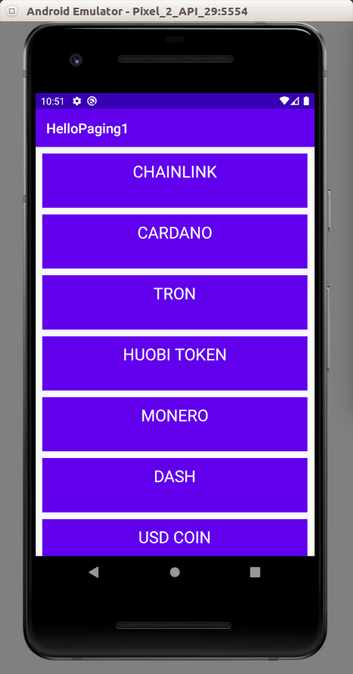

# Paging

Paging is basically pagination. We don’t load data wholly at one time but a small chunk a time. If we have 1000 items, we load 50 items at a time. 

Create a new empty Activity and name it HelloPaging1.

Edit build.gradle (Module: app).

Add this plugin.
```gradle
apply plugin: 'kotlin-kapt'
```

Use Java 1.8. Add these blocks inside “android” block.
```gradle
compileOptions {
    sourceCompatibility JavaVersion.VERSION_1_8
    targetCompatibility JavaVersion.VERSION_1_8
}
kotlinOptions {
    jvmTarget = "1.8"
}
```

Add these dependencies.
```gradle
implementation "androidx.paging:paging-runtime:2.1.2"
implementation "androidx.room:room-common:2.2.5"
implementation "androidx.fragment:fragment-ktx:1.2.3"
implementation "androidx.paging:paging-runtime-ktx:2.1.2"
kapt "androidx.room:room-compiler:2.2.5"
implementation "androidx.room:room-runtime:2.2.5"
```

Edit app / res / values / colors.xml.

Add white color entry.
```xml
<color name="colorWhite">#FFFFFF</color>
```

Delete app / res / layout / activity_main.xml.

Create a layout for a row, app / res / layout / fragment_row.xml.
```xml
<?xml version="1.0" encoding="utf-8"?>
<LinearLayout xmlns:android="http://schemas.android.com/apk/res/android"
    android:orientation="vertical"
    android:layout_width="match_parent"
    android:gravity="center"
    android:background="@color/colorPrimary"
    android:layout_marginTop="10dp"
    android:layout_marginStart="10dp"
    android:layout_marginEnd="10dp"
    android:layout_height="80sp">
    <TextView
        android:text="TextView"
        android:layout_marginTop="10dp"
        android:textColor="@color/colorWhite"
        android:textSize="24sp"
        android:layout_width="wrap_content"
        android:layout_height="wrap_content" android:id="@+id/nameRowTextView" android:layout_weight="1"/>
</LinearLayout>
```

Create a layout for a list, app / res / layout / fragment_list.xml.
```xml
<?xml version="1.0" encoding="utf-8"?>
<FrameLayout xmlns:android="http://schemas.android.com/apk/res/android"
    xmlns:tools="http://schemas.android.com/tools"
    android:layout_width="match_parent"
    android:layout_height="match_parent"
    tools:context=".view.ListFragment">
    <androidx.recyclerview.widget.RecyclerView
        android:id="@+id/list"
        android:layout_width="match_parent"
        android:layout_height="match_parent">
    </androidx.recyclerview.widget.RecyclerView>
</FrameLayout>
```

Create 3 directories inside app / java / com.example.hellopaging1: model, view, viewmodel. Move MainActivity to app / java / com.example.hellpaging1.

Create a model, app / java / com.example.hellopaging1 / CryptocurrencyModel.
```kotlin
package com.example.hellopaging1.model

import androidx.room.Entity
import androidx.room.PrimaryKey


@Entity(tableName = "cryptocurrencies")
data class CryptocurrencyModel (
    @PrimaryKey(autoGenerate = true)
    var id: Int,

    var name: String

)
```

Create a DAO for this model, app / java / com.example.hellopaging1 / CryptocurrenciesDao.
```kotlin
package com.example.hellopaging1.model

import androidx.paging.DataSource
import androidx.room.*


@Dao
interface CryptocurrenciesDao {

    @Insert(onConflict = OnConflictStrategy.ABORT)
    fun insertCryptocurrency(cryptocurrency: CryptocurrencyModel)

    @Query("select * from cryptocurrencies order by id asc")
    fun getAllCryptocurrencies(): DataSource.Factory<Int, CryptocurrencyModel>

}
```

Notice for “getAllCryptocurrencies”, we don’t use LiveData, but DataSource.Factory from paging library. It has two components, the integer and the model. Notice also, we use query using order. Basically the integer points to the id. That’s how we chunk the data.

Create a database, app / java / com.example.hellopaging1 / model / CryptocurrenciesDatabase.
```kotlin
package com.example.hellopaging1.model

import android.content.Context
import androidx.room.Database
import androidx.room.Room
import androidx.room.RoomDatabase
import androidx.sqlite.db.SupportSQLiteDatabase
import kotlin.concurrent.thread


// Adapted from https://github.com/android/sunflower/blob/master/app/src/main/java/com/google/samples/apps/sunflower/data/AppDatabase.kt
@Database(entities = [CryptocurrencyModel::class], version = 1, exportSchema = false)
abstract class CryptocurrenciesDatabase : RoomDatabase() {

    abstract fun cryptocurrenciesDao(): CryptocurrenciesDao

    companion object {

        @Volatile private var instance: CryptocurrenciesDatabase? = null

        fun getInstance(context: Context): CryptocurrenciesDatabase {
            return instance ?: synchronized(this) {
                instance ?: buildDatabase(context).also { instance = it }
            }
        }

        private fun buildDatabase(context: Context): CryptocurrenciesDatabase {
            return Room.databaseBuilder(context, CryptocurrenciesDatabase::class.java, "cryptocurrencies_db")
                .addCallback(object : RoomDatabase.Callback() {
                    override fun onCreate(db: SupportSQLiteDatabase) {
                        super.onCreate(db)
                        thread {
                            val database = getInstance(context)
                            cryptocurrencies.forEach {
                                val cryptocurrency = CryptocurrencyModel(id=0, name=it)
                                database.cryptocurrenciesDao().insertCryptocurrency(cryptocurrency)
                            }
                        }
                    }
                })
                .build()
        }
    }
}

val cryptocurrencies = arrayOf("BITCOIN", "ETHEREUM", "XRP", "TETHER", "BITCOIN CASH", "BITCOIN SV", "LITECOIN", "EOS", "BINANCE COIN", "TEZOS", "UNUS SED LEO",
"STELLAR", "CHAINLINK", "CARDANO", "TRON", "HUOBI TOKEN", "MONERO", "DASH", "USD COIN", "ETHEREUM CLASSIC", "CRYPTO.COM COIN", "HEDGETRADE", "NEO", "COSMOS",
"IOTA", "NEM", "ZCASH", "MAKER", "OKB", "ONTOLOGY", "FTX TOKEN", "PAXOS STANDARD", "DOGECOIN", "BASIC ATTENTION TOKEN", "BINANCE USD", "VECHAIN", "TRUEUSD",
"BITCOIN GOLD", "DECRED", "LISK", "HEDERA HASHGRAPH", "QTUM", "ZB TOKEN", "ICON", "ALGORAND", "0X", "AUGUR", "KUCOIN SHARES", "WAVES", "BITCOIN DIAMOND",
"KYBER NETWORK", "RAVENCOIN", "MULTI-COLLATERAL DAI", "SYNTHETIX NETWORK TOKEN", "MONACOIN", "OMISEGO", "STEEM", "MCO", "DXCHAIN TOKEN", "THETA", "ENJIN COIN",
"NEXO", "NANO", "BYTOM", "SIACOIN", "HOLO", "ABBC COIN", "DIGIXDAO", "NERVOS NETWORK", "HORIZEN", "DIGIBYTE", "BITSHARES", "V.SYSTEMS", "BITTORRENT", "HYPERCASH",
"STATUS", "KOMODO", "BYTECOIN", "TERRA", "ZILLIQA", "IOST", "VERGE", "SWIPE", "WAX", "ENERGI", "SEELE", "GOLEM", "ARDOR", "REN", "STASIS EURO", "MOLECULAR FUTURE",
"BLOCKSTACK", "ZCOIN", "AELF", "MATIC NETWORK", "YAP STONE", "AETERNITY", "NUMERAIRE", "LOOPRING", "AAVE")
```

Create a view model, app / java / com.example.hellopaging1 / viewmodel / CryptocurrenciesViewModel.
```kotlin
package com.example.hellopaging1.viewmodel

import android.app.Application
import androidx.lifecycle.AndroidViewModel
import androidx.lifecycle.LiveData
import androidx.paging.PagedList
import androidx.paging.toLiveData
import com.example.hellopaging1.model.CryptocurrenciesDao
import com.example.hellopaging1.model.CryptocurrenciesDatabase
import com.example.hellopaging1.model.CryptocurrencyModel


class CryptocurrenciesViewModel(app: Application): AndroidViewModel(app) {

    private val database : CryptocurrenciesDatabase
    private val cryptocurrenciesDao : CryptocurrenciesDao
    private val cryptocurrencies : LiveData<PagedList<CryptocurrencyModel>>

    init {
        database = CryptocurrenciesDatabase.getInstance(app)
        cryptocurrenciesDao = database.cryptocurrenciesDao()
        cryptocurrencies = cryptocurrenciesDao.getAllCryptocurrencies().toLiveData(pageSize=10)
    }

    fun getCryptocurrencies(): LiveData<PagedList<CryptocurrencyModel>> = cryptocurrencies
}
```

Notice the LiveData wraps PagedList which wraps our model. Then we convert our DataSource to LiveData with “toLiveData” method. We use 10 as pageSize.

Create a view holder, app / java / com.example.hellopaging1 / ListViewHolder.
```kotlin
package com.example.hellopaging1.view

import android.view.View
import android.widget.TextView
import androidx.recyclerview.widget.RecyclerView
import com.example.hellopaging1.R
import com.example.hellopaging1.model.CryptocurrencyModel


class ListViewHolder(private val view : View) : RecyclerView.ViewHolder(view) {

    private val nameRowTextView : TextView = this.view.findViewById(R.id.nameRowTextView)

    fun bindModel(item : CryptocurrencyModel) {
        this.nameRowTextView.text = item.name
    }
}
```

Create an adapter, app / java / com.example.hellopaging1 / view / ListAdapter.
```kotlin
package com.example.hellopaging1.view

import android.view.LayoutInflater
import android.view.ViewGroup
import androidx.paging.PagedListAdapter
import androidx.recyclerview.widget.DiffUtil
import com.example.hellopaging1.R
import com.example.hellopaging1.model.CryptocurrencyModel


class ListAdapter() : PagedListAdapter<CryptocurrencyModel, ListViewHolder>(DIFF_CALLBACK) {

    override fun onCreateViewHolder(parent: ViewGroup, viewType: Int): ListViewHolder {
        val layout = LayoutInflater.from(parent.context).inflate(R.layout.fragment_row, parent, false)
        return ListViewHolder(layout)
    }

    override fun onBindViewHolder(holder: ListViewHolder, position: Int) {
        val cryptocurrencyModel: CryptocurrencyModel? = getItem(position)
        cryptocurrencyModel?.let {
            holder.bindModel(it)
        }
    }

    companion object {
        private val DIFF_CALLBACK = object :
            DiffUtil.ItemCallback<CryptocurrencyModel>() {
            override fun areItemsTheSame(oldCryptocurrencyModel: CryptocurrencyModel,
                                         newCryptocurrencyModel: CryptocurrencyModel) = oldCryptocurrencyModel.id == newCryptocurrencyModel.id

            override fun areContentsTheSame(oldCryptocurrencyModel: CryptocurrencyModel,
                                            newCryptocurrencyModel: CryptocurrencyModel) = oldCryptocurrencyModel == newCryptocurrencyModel
        }
    }
    
}
```

Notice we don’t use Adapter from RecyclerView. We use PagedListAdapter.
```kotlin
class ListAdapter() : PagedListAdapter<CryptocurrencyModel, ListViewHolder>(DIFF_CALLBACK)
```

There is a DIFF_CALLBACK which is a callback to differentiate two items.
```kotlin
companion object {
        private val DIFF_CALLBACK = object :
            DiffUtil.ItemCallback<CryptocurrencyModel>() {
            override fun areItemsTheSame(oldCryptocurrencyModel: CryptocurrencyModel,
                                         newCryptocurrencyModel: CryptocurrencyModel) = oldCryptocurrencyModel.id == newCryptocurrencyModel.id

            override fun areContentsTheSame(oldCryptocurrencyModel: CryptocurrencyModel,
                                            newCryptocurrencyModel: CryptocurrencyModel) = oldCryptocurrencyModel == newCryptocurrencyModel
        }
    }
```

In onBindViewHolder, we get the item using getItem. Remember we use query which uses order in DAO class?

Create a fragment class, app / java / com.example.hellopaging1 / view / ListFragment.
```kotlin
package com.example.hellopaging1.view

import android.os.Bundle
import android.view.LayoutInflater
import android.view.View
import android.view.ViewGroup
import androidx.fragment.app.Fragment
import androidx.fragment.app.activityViewModels
import androidx.lifecycle.Observer
import androidx.recyclerview.widget.LinearLayoutManager
import androidx.recyclerview.widget.RecyclerView
import com.example.hellopaging1.R
import com.example.hellopaging1.viewmodel.CryptocurrenciesViewModel


class ListFragment : Fragment() {

    val vm : CryptocurrenciesViewModel by activityViewModels()

    override fun onCreateView(inflater: LayoutInflater, container: ViewGroup?, savedInstanceState: Bundle?): View? {
        return inflater.inflate(R.layout.fragment_list, container, false)
    }

    override fun onViewCreated(view: View, savedInstanceState: Bundle?) {
        super.onViewCreated(view, savedInstanceState)
        val recyclerView = view.findViewById<RecyclerView>(R.id.list)
        recyclerView.apply {
            setHasFixedSize(true)
            layoutManager = LinearLayoutManager(context)
        }
        val adapter = ListAdapter()
        vm.getCryptocurrencies().observe(viewLifecycleOwner, Observer {
            adapter.submitList(it)
        })
        recyclerView.adapter = adapter
    }
}
```

Notice that use “submitList” method of the adapter to subscribe the paging data.
```kotlin
val adapter = ListAdapter()
vm.getCryptocurrencies().observe(viewLifecycleOwner, Observer {
    adapter.submitList(it)
})
recyclerView.adapter = adapter
```

Edit app / java / com.example.hellopaging1 / view / MainActivity.
```kotlin
package com.example.hellopaging1.view

import androidx.appcompat.app.AppCompatActivity
import android.os.Bundle


class MainActivity : AppCompatActivity() {

    override fun onCreate(savedInstanceState: Bundle?) {
        super.onCreate(savedInstanceState)

        if (supportFragmentManager.findFragmentById(android.R.id.content) == null) {
            supportFragmentManager.beginTransaction()
                .add(android.R.id.content,
                    ListFragment()).commit()
        }
    }
}
```

This is basic code to use fragment.

If we ran the application, we would get this screen.
<p align="center">

</p>

# Optional Readings

https://developer.android.com/topic/libraries/architecture/paging/

https://developer.android.com/reference/androidx/paging/package-summary?hl=en

# Exercises

1. Convert one of your previous recyclerview projects to use Paging.