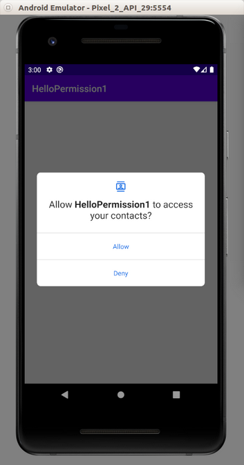

# Permission

Android application needs some permission to do its job. For example, we may want to use camera, so we have to ask permission to access camera hardware. Or maybe we want to read contacts in our application. The user needs to grant the permission to our application so our application can read contacts.

Create a new empty Activity project and name it HelloPermission1.

To ask permission, we need to edit the manifest file. For example, if we want to add permissions to read and write contacts, we have to add permissions in manifest file, app / manifests / AndroidManifest.xml.

Add these two lines.
```xml
<uses-permission android:name="android.permission.READ_CONTACTS"/>
<uses-permission android:name="android.permission.WRITE_CONTACTS"/>
```

Edit app / java / com.example.hellopermission / MainActivity.
```kotlin
package com.example.hellopermission1

import android.Manifest
import android.content.pm.PackageManager
import androidx.appcompat.app.AppCompatActivity
import android.os.Bundle
import android.util.Log
import androidx.core.app.ActivityCompat
import androidx.core.content.ContextCompat


const val LOG = "hello-permission"

class MainActivity : AppCompatActivity() {

    private val REQUEST_CODE_PERMISSION_READ_CONTACTS = 0

    override fun onCreate(savedInstanceState: Bundle?) {
        super.onCreate(savedInstanceState)
        setContentView(R.layout.activity_main)

        if (ContextCompat.checkSelfPermission(this, Manifest.permission.READ_CONTACTS) == PackageManager.PERMISSION_GRANTED) {
            Log.d(LOG, "Permission for reading contacts is granted")
        } else {
            Log.d(LOG, "Permission for reading contacts is not granted")

            if (ActivityCompat.shouldShowRequestPermissionRationale(this, Manifest.permission.READ_CONTACTS)) {
                Log.d(LOG, "You should grant permission for reading contacts")
            } else {
                ActivityCompat.requestPermissions(this, arrayOf(Manifest.permission.READ_CONTACTS), REQUEST_CODE_PERMISSION_READ_CONTACTS)
            }
        }
    }

    override fun onRequestPermissionsResult(requestCode: Int, permissions: Array<out String>, grantResults: IntArray) {
        super.onRequestPermissionsResult(requestCode, permissions, grantResults)

        when (requestCode) {
            REQUEST_CODE_PERMISSION_READ_CONTACTS -> {
                if (grantResults.isNotEmpty() && grantResults[0] == PackageManager.PERMISSION_GRANTED) {
                    Log.d(LOG, "User grants read contact permission")
                } else {
                    Log.d(LOG, "User does not grand read contact permission")
                }
                return
            }

            else -> {
                Log.d(LOG, "Something different happened")
            }
        }
    }
}
```

To check whether we have permission or not, we can use “checkSelfPermission” method.
```kotlin
if (ContextCompat.checkSelfPermission(this, Manifest.permission.READ_CONTACTS) == PackageManager.PERMISSION_GRANTED) {
```

To ask permission from the user, we can use “requestPermission” method from ActivityCompat.
```kotlin
ActivityCompat.requestPermissions(this, arrayOf(Manifest.permission.READ_CONTACTS), REQUEST_CODE_PERMISSION_READ_CONTACTS)
```

The second parameter is the permission we asked. The third parameter is the request code to differentiate which the Activity giving result to our Activity later.

We would be shown this dialog.
<p align="center">

</p>

After answering that permission dialog, the “onRequestPermissionResult” callback will called.
```kotlin
override fun onRequestPermissionsResult(requestCode: Int, permissions: Array<out String>, grantResults: IntArray) {
    super.onRequestPermissionsResult(requestCode, permissions, grantResults)

    when (requestCode) {
        REQUEST_CODE_PERMISSION_READ_CONTACTS -> {
            if (grantResults.isNotEmpty() && grantResults[0] == PackageManager.PERMISSION_GRANTED) {
                Log.d(LOG, "User grants read contact permission")
            } else {
                Log.d(LOG, "User does not grand read contact permission")
            }
            return
        }

        else -> {
            Log.d(LOG, "Something different happened")
        }
    }
}
```

We filter the request code because this callback can be called by other Activity as well. Then we can check whether the user has granted the permissions or not.
```kotlin
when (requestCode) {
    REQUEST_CODE_PERMISSION_READ_CONTACTS -> {
        if (grantResults.isNotEmpty() && grantResults[0] == PackageManager.PERMISSION_GRANTED) {
```

If we rerun the application, this answer is already embedded so we don’t have to ask permission everytime user runs our application. We could show the information to user why the permission is important after checking the permission has not been granted with “shouldShowRequestPermissionRational” method of ActivityCompat.
```kotlin
if (ActivityCompat.shouldShowRequestPermissionRationale(this, Manifest.permission.READ_CONTACTS)) {
```

If we ran the application, we would get this log (if we grant the permission).
```
2020-03-23 15:00:18.480 16385-16385/com.example.hellopermission1 D/hello-permission: Permission for reading contacts is not granted
2020-03-23 15:01:16.038 16385-16385/com.example.hellopermission1 D/hello-permission: User grants read contact permission
```

# Optional Readings

https://developer.android.com/training/permissions/requesting

https://developer.android.com/guide/topics/manifest/permission-element

# Exercises

1. Create a project on which you ask a variety of permissions.

2. Create a project on which you ask a permission to use camera and prepare for cases where a user rejects the permission and grants the permission.