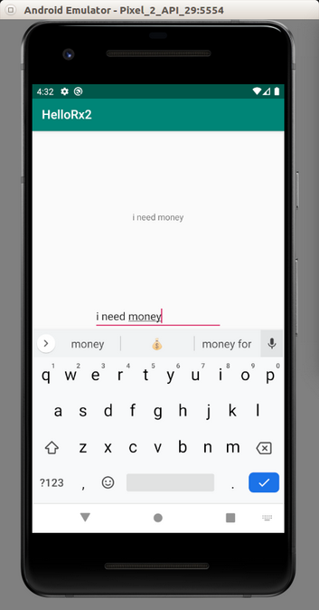
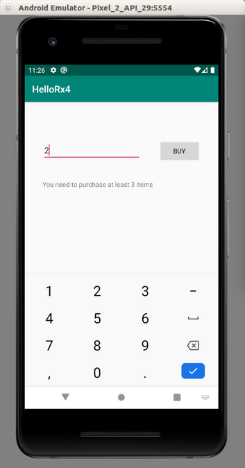
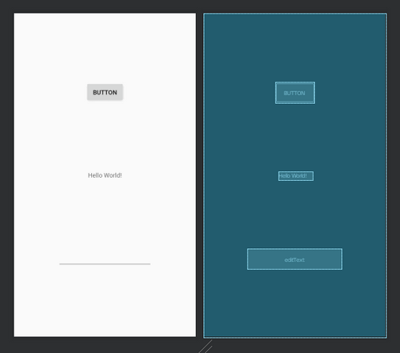
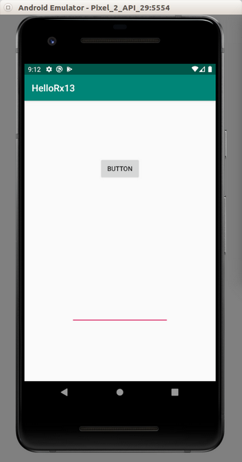
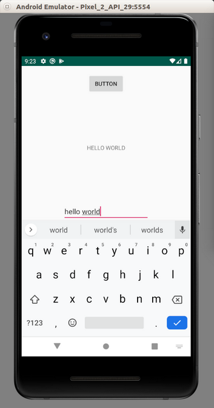
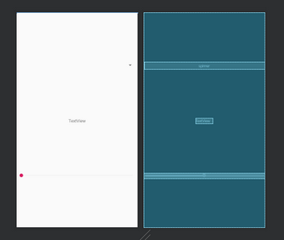
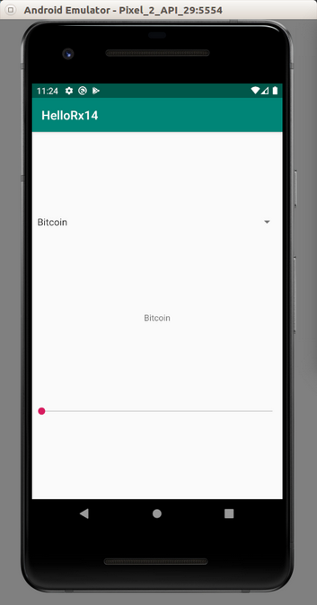
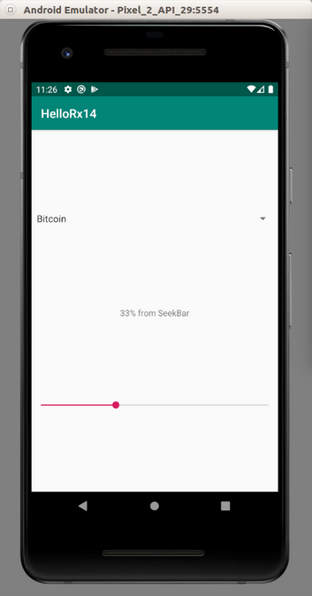
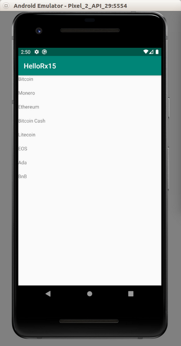

# RxKotlin

RxKotlin is used for Reactive Programming. Instead top down approach, we use reaction based approach. If something happens, we do something. We observe something, then if there is something interesting happens in the observation, we do something.

## Dependencies

Every example in this document needs these dependencies installed.

Edit build.gradle (Module: app).

Add these lines between dependencies.
```gradle
implementation 'io.reactivex.rxjava2:rxjava:2.2.16'
implementation 'io.reactivex.rxjava2:rxkotlin:2.4.0'
```

Sync the gradle file.

## Observable and Subscription

We observe observable. This observation is called subscription. We put the code in this subscription.

Create a new empty Activity project and name it HelloRx1.

Edit app / java / com.example.hellorx1 / MainActivity.

Add these import lines.
```kotlin
import android.util.Log
import io.reactivex.Observable
import io.reactivex.disposables.CompositeDisposable
import io.reactivex.rxkotlin.addTo
import io.reactivex.rxkotlin.subscribeBy
import io.reactivex.rxkotlin.toObservable
import io.reactivex.subjects.AsyncSubject
import io.reactivex.subjects.BehaviorSubject
import io.reactivex.subjects.PublishSubject
import io.reactivex.subjects.ReplaySubject
```

Create a constant variable.
```kotlin
const val LOG = "rxkotlin"
```

Create a method named playWithSimpleCase.
```kotlin
fun playWithSimpleCase() {
    val sub = arrayOf(1, 2, 3).toObservable().subscribe {
        Log.d(LOG + "-simple", it.toString())
    }
    sub.dispose()
}
```

There are two basic things: observable and subscription. In the previous method, the observable is: arrayOf(1, 2, 3).toObservable(). The subscription is the chained method to the observable: . Subscribe { … }. The “dispose” method is a method to unsubscribe the subscription.

Put the execution of this method inside onCreate method.
```kotlin
override fun onCreate(savedInstanceState: Bundle?) {
    super.onCreate(savedInstanceState)
    setContentView(R.layout.activity_main)

    playWithSimpleCase()
}
```

If we ran the application, we would get this output.
```
2020-01-11 14:19:20.997 5978-5978/com.example.hellorx1 D/rxkotlin-simple: 1
2020-01-11 14:19:20.997 5978-5978/com.example.hellorx1 D/rxkotlin-simple: 2
2020-01-11 14:19:20.997 5978-5978/com.example.hellorx1 D/rxkotlin-simple: 3
```

With previous way, we need to track subscription manually and dispose it after using it (to avoid memory leaks). If there are many subscriptions, it becomes cumbersome to dispose each subscription. There is another alternative on which we can gather all subscriptions into one composite disposable.

Create a method named playWithCompositeDisposable.
```kotlin
fun playWithCompositeDisposable() {
    val compositeDisposable = CompositeDisposable()
    arrayOf(1, 2, 3).toObservable().subscribe {
        Log.d(LOG + "-composite", it.toString())
    }.addTo(compositeDisposable)
    arrayOf(7, 8, 9).toObservable().subscribe {
        Log.d(LOG + "-composite", it.toString())
    }.addTo(compositeDisposable)
    compositeDisposable.dispose()
}
```

Here, we create two subscriptions and add them into one composite disposable.

Execute this method inside onCreate method.
```kotlin
override fun onCreate(savedInstanceState: Bundle?) {
    super.onCreate(savedInstanceState)
    setContentView(R.layout.activity_main)

    playWithCompositeDisposable()
}
```

If we ran the application, we would get this output.
```
2020-01-20 15:17:39.215 22647-22647/? D/rxkotlin-composite: 1
2020-01-20 15:17:39.215 22647-22647/? D/rxkotlin-composite: 2
2020-01-20 15:17:39.215 22647-22647/? D/rxkotlin-composite: 3
2020-01-20 15:17:39.215 22647-22647/? D/rxkotlin-composite: 7
2020-01-20 15:17:39.215 22647-22647/? D/rxkotlin-composite: 8
2020-01-20 15:17:39.215 22647-22647/? D/rxkotlin-composite: 9
```

Create a method named playWithSubscribe.
```kotlin
fun playWithSubscribe() {
    val sub = arrayOf(1, 2, 3).toObservable().subscribe(
        { Log.d(LOG + "-subscribe", it.toString()) },
        { Log.d(LOG + "-subscribe","Error") },
        { Log.d(LOG + "-subscribe", "Complete") })
    sub.dispose()

    val sub2 = arrayOf(1, 2, 3).toObservable().subscribeBy(
        onNext = { Log.d(LOG + "-subscribeBy", it.toString()) },
        onError = { Log.d(LOG + "-subscribeBy","Error") },
        onComplete = { Log.d(LOG + "-subscribeBy", "Complete") }
    )
    sub2.dispose()
}
```

In the first subscription, we sent 3 parameters. The first parameter is the callback which is executed for every event. We have an array with 3 members so we have 3 events. It means we call the first parameter callback 3 times. The second parameter is the callback which is executed when we handle error event from the observable. The third parameter is the callback which is executed when we handle completion event from the observable.
```kotlin
val sub = arrayOf(1, 2, 3).toObservable().subscribe(
    { Log.d(LOG + "-subscribe", it.toString()) },
    { Log.d(LOG + "-subscribe","Error") },
    { Log.d(LOG + "-subscribe", "Complete") })
sub.dispose()
```

Instead of “subscribe” method, we can use “subscribeBy” method. In the second subscription, we used 3 named parameters. They are similar to the previous method’s arguments. But we used named parameters: onNext, onError, onComplete. OnNext is when we execute the callback for every event. OnError is for handling error event. OnComplete is for handling completion event.

Execute this method inside onCreate.
```kotlin
override fun onCreate(savedInstanceState: Bundle?) {
    super.onCreate(savedInstanceState)
    setContentView(R.layout.activity_main)

    playWithSubscribe()
}
```

If we ran the application, we would get this output.
```
2020-01-11 14:19:20.998 5978-5978/com.example.hellorx1 D/rxkotlin-subscribe: 1
2020-01-11 14:19:20.998 5978-5978/com.example.hellorx1 D/rxkotlin-subscribe: 2
2020-01-11 14:19:20.998 5978-5978/com.example.hellorx1 D/rxkotlin-subscribe: 3
2020-01-11 14:19:20.998 5978-5978/com.example.hellorx1 D/rxkotlin-subscribe: Complete
2020-01-11 14:19:20.998 5978-5978/com.example.hellorx1 D/rxkotlin-subscribeBy: 1
2020-01-11 14:19:20.998 5978-5978/com.example.hellorx1 D/rxkotlin-subscribeBy: 2
2020-01-11 14:19:20.998 5978-5978/com.example.hellorx1 D/rxkotlin-subscribeBy: 3
2020-01-11 14:19:20.998 5978-5978/com.example.hellorx1 D/rxkotlin-subscribeBy: Complete
```

Create a method and name it playWithObservable.
```kotlin
fun playWithObservable() {
    val sub = Observable.fromArray(arrayOf(1, 2, 3)).subscribe {
        Log.d(LOG + "-toObservable", it.joinToString())
    }
    sub.dispose()

    val sub2 = Observable.just(1, 2, 3).subscribe {
        Log.d(LOG + "-just", it.toString())
    }
    sub2.dispose()

    val sub3 = Observable.fromIterable(listOf(1, 2, 3)).subscribe {
        Log.d(LOG + "-fromIterable", it.toString())
    }
    sub3.dispose()
}
```

Instead of using toObservable method, we can use Observable object and its methods, like “fromArray”, “just”, and “fromIterable”.

“fromArray” method sends an event of array, not the member of the array. So if the array has 3 members and the callback for the first subscription is called one time only not 3 times.

“just” method sends every parameter as event.

“fromIterable” method sends each member of the iterable (including array) as an event.

Execute this method inside onCreate method.
```kotlin
override fun onCreate(savedInstanceState: Bundle?) {
    super.onCreate(savedInstanceState)
    setContentView(R.layout.activity_main)

    playWithObservable()
}
```

If we ran the application, we would get this output.
```
2020-01-11 22:30:36.908 7071-7071/? D/rxkotlin-toObservable: 1, 2, 3
2020-01-11 22:30:36.908 7071-7071/? D/rxkotlin-just: 1
2020-01-11 22:30:36.908 7071-7071/? D/rxkotlin-just: 2
2020-01-11 22:30:36.908 7071-7071/? D/rxkotlin-just: 3
2020-01-11 22:30:36.909 7071-7071/? D/rxkotlin-fromIterable: 1
2020-01-11 22:30:36.909 7071-7071/? D/rxkotlin-fromIterable: 2
2020-01-11 22:30:36.909 7071-7071/? D/rxkotlin-fromIterable: 3
```

We can create an observable manually with “create” method.
```kotlin
fun playWithCreate() {
    val sub = Observable.create<Int> {
        it.onNext(1)
        it.onNext(2)
        it.onNext(3)
        it.onComplete()
    }.subscribeBy(
        onNext = { Log.d(LOG + "-create", it.toString()) },
        onComplete = { Log.d(LOG + "-create", "Complete") }
    )
    sub.dispose()
}
```

We can emit the event with “onNext” method inside the callback parameter in the “create” method. To end the emitting event, we can use “onComplete” method.
```kotlin
it.onNext(1)
it.onNext(2)
it.onNext(3)
it.onComplete()
```

Then we can use “subscribeBy” to create a subscription for this observable.

Execute this method inside onCreate method.
```kotlin
override fun onCreate(savedInstanceState: Bundle?) {
    super.onCreate(savedInstanceState)
    setContentView(R.layout.activity_main)

    playWithCreate()
}
```

If we ran the application, we would get this output.
```
2020-01-11 22:30:36.909 7071-7071/? D/rxkotlin-create: 1
2020-01-11 22:30:36.909 7071-7071/? D/rxkotlin-create: 2
2020-01-11 22:30:36.909 7071-7071/? D/rxkotlin-create: 3
2020-01-11 22:30:36.909 7071-7071/? D/rxkotlin-create: Complete
```

## Publish Subject

There is an object called PublishSubject. It is an observable and subscription at the same time.

In the same project (HelloRx1), create a method named playWithPublishSubject.
```kotlin
fun playWithPublishSubject() {
    val publishSubject = PublishSubject.create<Int>()
    val sub = publishSubject.subscribe {
        Log.d(LOG + "-PubSub-simple", it.toString())
    }
    publishSubject.onNext(1)
    publishSubject.onNext(2)
    publishSubject.onNext(3)
    publishSubject.onComplete()
    sub.dispose()
}
```

We create a PublishSubject object.
```kotlin
val publishSubject = PublishSubject.create<Int>()
```

Then we create a subscription with “subscribe” method.
```kotlin
val sub = publishSubject.subscribe {
    Log.d(LOG + "-PubSub-simple", it.toString())
}
```

Then we can emit the event from PublishSubject like it is an Observable.
```kotlin
publishSubject.onNext(1)
publishSubject.onNext(2)
publishSubject.onNext(3)
publishSubject.onComplete()
```

Execute this method inside onCreate method.
```kotlin
override fun onCreate(savedInstanceState: Bundle?) {
    super.onCreate(savedInstanceState)
    setContentView(R.layout.activity_main)

    playWithPublishSubject()
}
```

If we ran the application, we would get this output.
```
2020-01-11 22:30:36.910 7071-7071/? D/rxkotlin-PubSub-simple: 1
2020-01-11 22:30:36.910 7071-7071/? D/rxkotlin-PubSub-simple: 2
2020-01-11 22:30:36.910 7071-7071/? D/rxkotlin-PubSub-simple: 3
```

We can create two separate subscriptions for one observable.

Create a method named playWithMultiplePublishSubject.
```kotlin
fun playWithMultiplePublishSubject() {
    val publishSubject = PublishSubject.create<Int>()
    val sub = publishSubject.subscribe {
        Log.d(LOG + "-PubSub1", it.toString())
    }
    publishSubject.onNext(1)
    val sub2 = publishSubject.subscribe {
        Log.d(LOG + "-PubSub2", it.toString())
    }
    publishSubject.onNext(2)
    publishSubject.onNext(3)
    publishSubject.onComplete()
    sub.dispose()
    sub2.dispose()
}
```

Execute this method inside onCreate method.
```kotlin
override fun onCreate(savedInstanceState: Bundle?) {
    super.onCreate(savedInstanceState)
    setContentView(R.layout.activity_main)

    playWithMultiplePublishSubject()
}
```

If we ran the application, we would get this output.
```
2020-01-11 22:30:36.910 7071-7071/? D/rxkotlin-PubSub1: 1
2020-01-11 22:30:36.910 7071-7071/? D/rxkotlin-PubSub1: 2
2020-01-11 22:30:36.910 7071-7071/? D/rxkotlin-PubSub2: 2
2020-01-11 22:30:36.910 7071-7071/? D/rxkotlin-PubSub1: 3
2020-01-11 22:30:36.910 7071-7071/? D/rxkotlin-PubSub2: 3
```

As we can see, there is no output “rxkotlin-PubSub2:1” because the second subscription was made after the PublishSubject object emit event “1” integer.

Calling “dispose” method on one subscription does not affect other subscription.

## Behavior Subject, Replay Subject, Async Subject

There are different kinds of Publish Subject. It affects what happens when a new subscription comes in. We will discuss them one by one.

Still using the same project (HelloRxKotlin1), create a new method named playWithBehaviorSubject.
```kotlin
fun playWithBehaviorSubject() {
    val behaviorSubject = BehaviorSubject.createDefault(0)
    val sub = behaviorSubject.subscribe {
        Log.d(LOG + "-BehSub1", it.toString())
    }
    behaviorSubject.onNext(1)
    behaviorSubject.onNext(2)
    val sub2 = behaviorSubject.subscribe {
        Log.d(LOG + "-BehSub2", it.toString())
    }
    behaviorSubject.onNext(3)
    behaviorSubject.onComplete()
    sub.dispose()
    sub2.dispose()
}
```

We create a BehaviorSubect object. We can set the default value. This default value will be sent as a first event to the first subscription.

Execute this method inside onCreate method.
```kotlin
override fun onCreate(savedInstanceState: Bundle?) {
    super.onCreate(savedInstanceState)
    setContentView(R.layout.activity_main)

    playWithBehaviorSubject()
}
```

If we ran the application, we would get this output.
```
2020-01-12 12:16:32.146 7879-7879/com.example.hellorx1 D/rxkotlin-BehSub1: 0
2020-01-12 12:16:32.146 7879-7879/com.example.hellorx1 D/rxkotlin-BehSub1: 1
2020-01-12 12:16:32.146 7879-7879/com.example.hellorx1 D/rxkotlin-BehSub1: 2
2020-01-12 12:16:32.146 7879-7879/com.example.hellorx1 D/rxkotlin-BehSub2: 2
2020-01-12 12:16:32.146 7879-7879/com.example.hellorx1 D/rxkotlin-BehSub1: 3
2020-01-12 12:16:32.146 7879-7879/com.example.hellorx1 D/rxkotlin-BehSub2: 3
```

The first subscription got the default value, which is “0”. The second subscription got the latest value from the past events which is “2”. The PublishSubject object would not get this value.

Create a new method named playWithReplaySubject.
```kotlin
fun playWithReplaySubject() {
    val replaySubject = ReplaySubject.createWithSize<Int>(2)
    val sub = replaySubject.subscribe {
        Log.d(LOG + "-RepSub1", it.toString())
    }
    replaySubject.onNext(1)
    replaySubject.onNext(2)
    replaySubject.onNext(3)
    val sub2 = replaySubject.subscribe {
        Log.d(LOG + "-RepSub2", it.toString())
    }
    replaySubject.onNext(4)
    replaySubject.onComplete()
    sub.dispose()
    sub2.dispose()
}
```

We create a ReplaySubject object. We can use “createWithSize” method which accepts the size of the buffer. We will replay the past values of this size.

Execute this method inside onCreate method.
```kotlin
override fun onCreate(savedInstanceState: Bundle?) {
    super.onCreate(savedInstanceState)
    setContentView(R.layout.activity_main)

    playWithReplaySubject()
}
```

If we ran the application, we would get this output.
```
2020-01-12 12:16:32.147 7879-7879/com.example.hellorx1 D/rxkotlin-RepSub1: 1
2020-01-12 12:16:32.147 7879-7879/com.example.hellorx1 D/rxkotlin-RepSub1: 2
2020-01-12 12:16:32.147 7879-7879/com.example.hellorx1 D/rxkotlin-RepSub1: 3
2020-01-12 12:16:32.147 7879-7879/com.example.hellorx1 D/rxkotlin-RepSub2: 2
2020-01-12 12:16:32.147 7879-7879/com.example.hellorx1 D/rxkotlin-RepSub2: 3
2020-01-12 12:16:32.147 7879-7879/com.example.hellorx1 D/rxkotlin-RepSub1: 4
2020-01-12 12:16:32.147 7879-7879/com.example.hellorx1 D/rxkotlin-RepSub2: 4
```

As we can see, the second subscription got latest 2 past values from the observable, which are “2” and “3”.

Create a new method and name it playWithAsyncSubject.
```kotlin
fun playWithAsyncSubject() {
    val asyncSubject = AsyncSubject.create<Int>()
    val sub = asyncSubject.subscribe {
        Log.d(LOG + "-AsySub1", it.toString())
    }
    asyncSubject.onNext(1)
    asyncSubject.onNext(2)
    val sub2 = asyncSubject.subscribe {
        Log.d(LOG + "-AsySub2", it.toString())
    }
    asyncSubject.onNext(3)
    asyncSubject.onComplete()
    sub.dispose()
    sub2.dispose()
}
```

Execute this method inside onCreate method.
```kotlin
override fun onCreate(savedInstanceState: Bundle?) {
    super.onCreate(savedInstanceState)
    setContentView(R.layout.activity_main)

    playWithAsyncSubject()
}
```

If we ran the application, we would get this output.
```
2020-01-12 12:16:32.147 7879-7879/com.example.hellorx1 D/rxkotlin-AsySub1: 3
2020-01-12 12:16:32.147 7879-7879/com.example.hellorx1 D/rxkotlin-AsySub2: 3
```

Every subscription would get the latest value (just before the completion). The earlier values would be ignored.

## Example Case 1

In the simple case example, the observable is a UI interface such as edit text. In the subscription code, we can update the other widget, such as text view.

Create a new empty Activity and name it HelloRx2.

Edit app / res / layout / activity_main.xml. We want to add one text view and one edit text.
```xml
<?xml version="1.0" encoding="utf-8"?>
<androidx.constraintlayout.widget.ConstraintLayout xmlns:android="http://schemas.android.com/apk/res/android"
    xmlns:app="http://schemas.android.com/apk/res-auto"
    xmlns:tools="http://schemas.android.com/tools"
    android:layout_width="match_parent"
    android:layout_height="match_parent"
    tools:context=".MainActivity">

    <TextView
        android:id="@+id/textView"
        android:layout_width="wrap_content"
        android:layout_height="wrap_content"
        android:text="TextView"
        app:layout_constraintBottom_toTopOf="@+id/editText"
        app:layout_constraintEnd_toEndOf="parent"
        app:layout_constraintHorizontal_bias="0.5"
        app:layout_constraintStart_toStartOf="parent"
        app:layout_constraintTop_toTopOf="parent" />

    <EditText
        android:id="@+id/editText"
        android:layout_width="wrap_content"
        android:layout_height="wrap_content"
        android:ems="10"
        android:inputType="textPersonName"
        android:text=""
        app:layout_constraintBottom_toBottomOf="parent"
        app:layout_constraintEnd_toEndOf="parent"
        app:layout_constraintHorizontal_bias="0.5"
        app:layout_constraintStart_toStartOf="parent"
        app:layout_constraintTop_toTopOf="parent" />
</androidx.constraintlayout.widget.ConstraintLayout>
```

Edit app / java / com.example.hellorx2 / MainActivity.

Edit these import lines.
```kotlin
import android.widget.EditText
import android.widget.TextView
import androidx.core.widget.addTextChangedListener
import io.reactivex.disposables.Disposable
import io.reactivex.subjects.PublishSubject
```

Create 4 variables inside MainActivity.
```kotlin
private lateinit var editText : EditText
private lateinit var textView : TextView
private lateinit var subject : PublishSubject<String>
private lateinit var subscription : Disposable
```

Edit onCreate method.

Get the references for the edit text and text view.
```kotlin
editText = findViewById(R.id.editText)
textView = findViewById(R.id.textView)
```

Create a PublishSubject object and the subscription to it.	
```kotlin
subject = PublishSubject.create()
subscription = subject.subscribe {
    textView.text = it
}
```

Then in the text changed callback of the edit text, we can emit the event from the subject.
```kotlin
editText.addTextChangedListener {
    subject.onNext(it.toString())
}
```

We need to override the onDestroy method to dispose the subscription.
```kotlin
override fun onDestroy() {
    subscription.dispose()
    super.onDestroy()
}
```

If we ran the application, and we typed something in the edit text, the text view would be updated.
<p align="center">

</p>

## Operators

Reactive programming gives us operators for manipulating events. The operators can be divided into 3 categories: filtering, transforming and combining.

To visualize these operators, there are marble diagrams. The list of operators in reactive programming can be found here:

http://reactivex.io/documentation/operators.html

So there is “distinct” operator in filtering category. We can view its marble diagram in its page:

http://reactivex.io/documentation/operators/distinct.html


## Filtering

The previous example can be made simpler without reactive programming. In the callback of edit text, we can update text view directly. But what makes reactive programming interesting is we can manipulate the data in the pipeline.

Create a new empty Activity and name it HelloRx3.

Edit app / java / com.example.hellorx3 / MainActivity.

Add these import lines.
```kotlin
import android.util.Log
import io.reactivex.Observable
import io.reactivex.rxkotlin.toObservable
import java.util.concurrent.TimeUnit
```

Create a constant variable.
```kotlin
const val LOG = "rxkotlin-"
```

The first filter method is “filter”. Create a method named playWithFilter.
```kotlin
fun playWithFilter() {
    val sub = (1..10)
          .toObservable()
          .filter {
            it % 2 == 0
          }
          .subscribe {
        Log.d(LOG + "-filter", it.toString())
    }
    sub.dispose()
}
```

Here, we filter the events. Only the even numbers are passed to the subscription.

Execute this method inside onCreate method.
```kotlin
override fun onCreate(savedInstanceState: Bundle?) {
    super.onCreate(savedInstanceState)
    setContentView(R.layout.activity_main)

    playWithFilter()
}
```

If we ran the application, we would get this output.
```
2020-01-12 20:27:56.210 12151-12151/com.example.hellorx3 D/rxkotlin--filter: 2
2020-01-12 20:27:56.210 12151-12151/com.example.hellorx3 D/rxkotlin--filter: 4
2020-01-12 20:27:56.210 12151-12151/com.example.hellorx3 D/rxkotlin--filter: 6
2020-01-12 20:27:56.210 12151-12151/com.example.hellorx3 D/rxkotlin--filter: 8
2020-01-12 20:27:56.210 12151-12151/com.example.hellorx3 D/rxkotlin--filter: 10
```

The second filter method is “distinct”. Create a method named playWithDistinct.
```kotlin
fun playWithDistinct() {
    val sub = arrayOf(2, 3, 3, 3, 4, 8, 11, 11, 11, 19)
        .toObservable()
        .distinct()
        .subscribe {
            Log.d(LOG + "-distinct", it.toString())
        }
    sub.dispose()
}
```

Here, we only pass the non-duplicate items.

Execute this method inside onCreate method.
```kotlin
override fun onCreate(savedInstanceState: Bundle?) {
    super.onCreate(savedInstanceState)
    setContentView(R.layout.activity_main)

    playWithDistinct()
}
```

If we ran the application, we would get this output.
```
2020-01-12 20:27:56.210 12151-12151/com.example.hellorx3 D/rxkotlin--distinct: 2
2020-01-12 20:27:56.210 12151-12151/com.example.hellorx3 D/rxkotlin--distinct: 3
2020-01-12 20:27:56.210 12151-12151/com.example.hellorx3 D/rxkotlin--distinct: 4
2020-01-12 20:27:56.210 12151-12151/com.example.hellorx3 D/rxkotlin--distinct: 8
2020-01-12 20:27:56.210 12151-12151/com.example.hellorx3 D/rxkotlin--distinct: 11
2020-01-12 20:27:56.210 12151-12151/com.example.hellorx3 D/rxkotlin--distinct: 19
```

We can get nth element from the observable. Create a method named playWithElementAt.
```kotlin
fun playWithElementAt() {
    val sub = arrayOf("John", "Budi", "Joko", "Susan", "Dewi")
        .toObservable()
        .elementAt(2)
        .subscribe {
            Log.d(LOG + "-elementAt", it.toString())
        }
    sub.dispose()
}
```

We use “elementAt” method to get nth element. The parameter that we used is 2. It means we would get the third element (counting from 0).

Execute this method inside onCreate method.
```kotlin
override fun onCreate(savedInstanceState: Bundle?) {
    super.onCreate(savedInstanceState)
    setContentView(R.layout.activity_main)

    playWithElementAt()
}
```

If we ran the application, we would get this output.
```
2020-01-12 20:27:56.213 12151-12151/com.example.hellorx3 D/rxkotlin--elementAt: Joko
```

We can skip a specified number of events with “skip” method. Create a method named playWithSkip.
```kotlin
fun playWithSkip() {
    val sub = (1..10)
        .toObservable()
        .skip(7)
        .subscribe {
            Log.d(LOG + "-skip", it.toString())
        }
    sub.dispose()
}
```

“.skip(7)” means we skip 7 events before we pass the events to the subscription.

Execute this method inside onCreate method.
```kotlin
override fun onCreate(savedInstanceState: Bundle?) {
    super.onCreate(savedInstanceState)
    setContentView(R.layout.activity_main)

    playWithSkip()
}
```

If we ran the application, we would get this output.
```
2020-01-12 20:27:56.213 12151-12151/com.example.hellorx3 D/rxkotlin--skip: 8
2020-01-12 20:27:56.213 12151-12151/com.example.hellorx3 D/rxkotlin--skip: 9
2020-01-12 20:27:56.213 12151-12151/com.example.hellorx3 D/rxkotlin--skip: 10
```

Sometimes events come to fast for us to handle. We want to limit events based on a specified time. Create a method named playWithDebounce.
```kotlin
fun playWithDebounce() {
    val sub = Observable.create<Int> {
            it.onNext(1)
            it.onNext(2)
            Thread.sleep(600)
            it.onNext(3)
            Thread.sleep(600)
            it.onNext(4)
            it.onNext(5)
            it.onNext(6)
            Thread.sleep(600)
        }
        .debounce(200, TimeUnit.MILLISECONDS)
        .subscribe {
            Log.d(LOG + "-debounce", it.toString())
        }
    sub.dispose()
}
```

“.debounce(200, TimeUnit.MILLISECONDS)” means we want to get only one event when there is no other event for 200 milliseconds after that event. So if there are 10 events in that specified time where the time between them is less than 200 milliseconds, the first 9 events are dropped.

Execute this method inside onCreate method.
```kotlin
override fun onCreate(savedInstanceState: Bundle?) {
    super.onCreate(savedInstanceState)
    setContentView(R.layout.activity_main)

    playWithFilter()
    playWithDistinct()
    playWithElementAt()
    playWithSkip()
    playWithDebounce()
    playWithThrottle()
}
```

If we ran the application, we would get this output.
```
2020-01-12 20:27:56.417 12151-12230/com.example.hellorx3 D/rxkotlin--debounce: 2
2020-01-12 20:27:57.018 12151-12230/com.example.hellorx3 D/rxkotlin--debounce: 3
2020-01-12 20:27:57.619 12151-12230/com.example.hellorx3 D/rxkotlin--debounce: 6
```

As we can see, other events are dropped because they are still in the debounce time frame.

We can also throttle the events. Create a new method named playWithThrottle.
```kotlin
fun playWithThrottle() {
    val sub = Observable.create<Int> {
            it.onNext(1)
            it.onNext(2)
            Thread.sleep(600)
            it.onNext(3)
            Thread.sleep(600)
            it.onNext(4)
            it.onNext(5)
            it.onNext(6)
            Thread.sleep(600)
        }
        .throttleFirst(1000, TimeUnit.MILLISECONDS)
        .subscribe {
            Log.d(LOG + "-throttle", it.toString())
        }
    sub.dispose()
}
```

“.throttleFirst(1000, TimeUnit.MILLISECONDS)” means we only emit the first event for 1 second. Every other events in that 1 seconds are ignored.

Execute this method inside onCreate method.
```kotlin
override fun onCreate(savedInstanceState: Bundle?) {
    super.onCreate(savedInstanceState)
    setContentView(R.layout.activity_main)

    playWithThrottle()
}
```

If we ran the application, we would get this output.
```
2020-01-12 20:27:58.021 12151-12151/com.example.hellorx3 D/rxkotlin--throttle: 1
2020-01-12 20:27:59.222 12151-12151/com.example.hellorx3 D/rxkotlin--throttle: 4
```

The complete list of filter operation in reactive programming can be found here:

https://github.com/ReactiveX/RxJava/wiki/Filtering-Observables

## Example Case 2

In the simple case example, we can validate the input using filter in reactive programming.

Create a new empty Activity and name it HelloRx4.

Edit app / res / layout / activity_main.xml. We need to add an edit text, a button, and a text view.
```xml
<?xml version="1.0" encoding="utf-8"?>
<androidx.constraintlayout.widget.ConstraintLayout xmlns:android="http://schemas.android.com/apk/res/android"
    xmlns:app="http://schemas.android.com/apk/res-auto"
    xmlns:tools="http://schemas.android.com/tools"
    android:layout_width="match_parent"
    android:layout_height="match_parent"
    tools:context=".MainActivity">

    <EditText
        android:id="@+id/editText"
        android:layout_width="wrap_content"
        android:layout_height="wrap_content"
        android:layout_marginTop="80dp"
        android:ems="10"
        android:inputType="number"
        android:text=""
        app:layout_constraintEnd_toStartOf="@+id/button"
        app:layout_constraintHorizontal_bias="0.5"
        app:layout_constraintStart_toStartOf="parent"
        app:layout_constraintTop_toTopOf="parent" />

    <Button
        android:id="@+id/button"
        android:layout_width="wrap_content"
        android:layout_height="wrap_content"
        android:layout_marginTop="80dp"
        android:text="Buy"
        app:layout_constraintEnd_toEndOf="parent"
        app:layout_constraintHorizontal_bias="0.5"
        app:layout_constraintStart_toEndOf="@+id/editText"
        app:layout_constraintTop_toTopOf="parent" />

    <TextView
        android:id="@+id/textView"
        android:layout_width="wrap_content"
        android:layout_height="wrap_content"
        android:layout_marginTop="40dp"
        android:text=""
        app:layout_constraintStart_toStartOf="@+id/editText"
        app:layout_constraintTop_toBottomOf="@+id/editText" />
</androidx.constraintlayout.widget.ConstraintLayout>
```

Edit app / java / com.example.hellorx4 / MainActivity.

Add these import lines.
```kotlin
import android.widget.Button
import android.widget.EditText
import android.widget.TextView
import io.reactivex.disposables.Disposable
import io.reactivex.subjects.PublishSubject
```

Create state variables.
```kotlin
private lateinit var editText : EditText
private lateinit var textView : TextView
private lateinit var button : Button
private lateinit var subject : PublishSubject<String>
private lateinit var subscription : Disposable
```

Edit onCreate method.

Get the references for the widget.
```kotlin
editText = findViewById(R.id.editText)
button = findViewById(R.id.button)
textView = findViewById(R.id.textView)
```

Create a PublishSubject object.
```kotlin
subject = PublishSubject.create()
```

Then create a subscription with a filter.
```kotlin
subscription = subject
    .filter {
        it.toInt() < 3
    }
    .subscribe {
    textView.text = "You need to purchase at least 3 items"
}
```

Create a callback for the button to emit the event of the text in the edit text.
```kotlin
button.setOnClickListener {
    textView.text = ""
    subject.onNext(editText.text.toString())
}
```

Now that onCreate method is done, override onDestroy method.
```kotlin
override fun onDestroy() {
    subscription.dispose()
    super.onDestroy()
}
```

If we ran the application, and we fill the edit text with a number lower than 3 (for example: 2), we would get the validation text in the text view.
<p align="center">

</p>

## Transforming

We can transform each event in reactive programming.

Create a new empty Activity application. Name it HelloRx5.

Edit app / java / com.example.hellorx5 / MainActivity.

Add these import lines.
```kotlin
import android.util.Log
import io.reactivex.rxkotlin.toObservable
import io.reactivex.subjects.PublishSubject
```

Create a constant variable.
```kotlin
const val LOG = "rxkotlin-"
```

To transform each event into another event, we use “map” function.
```kotlin
fun playWithMap() {
    val sub = (1..4)
        .toObservable()
        .map {
            it * 3
        }
        .subscribe {
            Log.d(LOG + "-map", it.toString())
        }
    sub.dispose()
}
```

Here, for every event in the observable, we will times it with 3.

Execute this method inside onCreate method.
```kotlin
override fun onCreate(savedInstanceState: Bundle?) {
    super.onCreate(savedInstanceState)
    setContentView(R.layout.activity_main)

    playWithMap()
}
```

If we ran the application, we would get this output.
```
2020-01-14 20:43:26.806 16006-16006/com.example.hellorx5 D/rxkotlin--map: 3
2020-01-14 20:43:26.806 16006-16006/com.example.hellorx5 D/rxkotlin--map: 6
2020-01-14 20:43:26.806 16006-16006/com.example.hellorx5 D/rxkotlin--map: 9
2020-01-14 20:43:26.806 16006-16006/com.example.hellorx5 D/rxkotlin--map: 12
```

To accumulate events, we use “scan” function.
```kotlin
fun playWithScan() {
    val sub = arrayOf(1, 1, 2, 3, 5)
        .toObservable()
        .scan { t1: Int, t2: Int -> t1 + t2 }
        .subscribe {
            Log.d(LOG + "-scan", it.toString())
        }
    sub.dispose()
}
```

Here, we accumulate events with addition of the current event with the latest sum. The first event will be added with zero to become the latest sum. Then for the second event, we will add it with the latest sum to become the latest sum. And so on.

Execute this method inside onCreate method.
```kotlin
override fun onCreate(savedInstanceState: Bundle?) {
    super.onCreate(savedInstanceState)
    setContentView(R.layout.activity_main)

    playWithScan()
}
```

If we ran the application, we would get this output.
```
2020-01-14 20:43:26.806 16006-16006/com.example.hellorx5 D/rxkotlin--scan: 1
2020-01-14 20:43:26.806 16006-16006/com.example.hellorx5 D/rxkotlin--scan: 2
2020-01-14 20:43:26.806 16006-16006/com.example.hellorx5 D/rxkotlin--scan: 4
2020-01-14 20:43:26.806 16006-16006/com.example.hellorx5 D/rxkotlin--scan: 7
2020-01-14 20:43:26.806 16006-16006/com.example.hellorx5 D/rxkotlin--scan: 12
```

To create a list from the events, we can use “buffer” method.
```kotlin
fun playWithBuffer() {
    val sub = (1..5)
        .toObservable()
        .buffer(3, 1)
        .subscribe {
            Log.d(LOG + "-buffer", it.toString())
        }
    sub.dispose()
}
```

There are two parameters in “buffer” method, which is 3 and 1. The first parameter means the size of the list we want to emit after transformation. The second parameter means how many events we want to slide after emitting the event.

Execute this method inside onCreate method.
```kotlin
override fun onCreate(savedInstanceState: Bundle?) {
    super.onCreate(savedInstanceState)
    setContentView(R.layout.activity_main)

    playWithBuffer()
}
```

If we ran the application, we would get this output.
```
2020-01-14 20:43:26.806 16006-16006/com.example.hellorx5 D/rxkotlin--buffer: [1, 2, 3]
2020-01-14 20:43:26.806 16006-16006/com.example.hellorx5 D/rxkotlin--buffer: [2, 3, 4]
2020-01-14 20:43:26.806 16006-16006/com.example.hellorx5 D/rxkotlin--buffer: [3, 4, 5]
2020-01-14 20:43:26.806 16006-16006/com.example.hellorx5 D/rxkotlin--buffer: [4, 5]
2020-01-14 20:43:26.806 16006-16006/com.example.hellorx5 D/rxkotlin--buffer: [5]
```

Sometimes we have a map of many observables. Each observable can emit events. We want to flat all these events from different observables.

Create a method and name it playWithFlatMap.
```kotlin
fun playWithFlatMap() {
    val publishSubject = PublishSubject.create<PublishSubject<Int>>()
    val sub = publishSubject
        .flatMap {
            it
        }
        .subscribe {
            Log.d(LOG + "-flatMap", it.toString())
        }
    val bitcoin = PublishSubject.create<Int>()
    val ethereum = PublishSubject.create<Int>()
    publishSubject.onNext(bitcoin)
    publishSubject.onNext(ethereum)
    bitcoin.onNext(9000)
    ethereum.onNext(200)
    bitcoin.onNext(10000)
    ethereum.onNext(140)
    sub.dispose()
}
```

We have two observables (bitcoin and ethereum). We add these two observables to our publish subject. Then when each observable emit an event, we emit it in a flat way. So as far as we know, the event from bitcoin observable and ethereum observable have the same hierarchical.

Execute this method inside onCreate method.
```kotlin
override fun onCreate(savedInstanceState: Bundle?) {
    super.onCreate(savedInstanceState)
    setContentView(R.layout.activity_main)

    playWithFlatMap()
}
```

If we ran the application, we would get this output.
```
2020-01-14 20:43:26.814 16006-16006/com.example.hellorx5 D/rxkotlin--flatMap: 9000
2020-01-14 20:43:26.814 16006-16006/com.example.hellorx5 D/rxkotlin--flatMap: 200
2020-01-14 20:43:26.814 16006-16006/com.example.hellorx5 D/rxkotlin--flatMap: 10000
2020-01-14 20:43:26.814 16006-16006/com.example.hellorx5 D/rxkotlin--flatMap: 140
```

We have flatten two observables. The result from these two observables is as if they come from one observable.

We can also switch to the latest observable and ditch the previous observable with “switchMap” method.

Create a new method and name it playWithSwitchMap.
```kotlin
fun playWithSwitchMap() {
    val publishSubject = PublishSubject.create<PublishSubject<Int>>()
    val sub = publishSubject
        .switchMap {
            it
        }
        .subscribe {
            Log.d(LOG + "-switchMap", it.toString())
        }
    val bitcoin = PublishSubject.create<Int>()
    val ethereum = PublishSubject.create<Int>()
    publishSubject.onNext(bitcoin)
    bitcoin.onNext(9000)
    publishSubject.onNext(ethereum)
    ethereum.onNext(200)
    bitcoin.onNext(10000)
    ethereum.onNext(140)
    sub.dispose()
}
```

At first, we focus on the bitcoin observable. Then when bitcoin observable emit an event, our subscription will emit the event from the bitcoin observable. But when we add ethereum observable to our subscription, we will switch to ethereum observable. We don’t care about bitcoin observable anymore.

Execute this method inside onCreate method.
```kotlin
override fun onCreate(savedInstanceState: Bundle?) {
    super.onCreate(savedInstanceState)
    setContentView(R.layout.activity_main)

    playWithSwitchMap()
}
```

If we ran the application, we would get this output.
```
2020-01-14 20:43:26.815 16006-16006/com.example.hellorx5 D/rxkotlin--switchMap: 9000
2020-01-14 20:43:26.815 16006-16006/com.example.hellorx5 D/rxkotlin--switchMap: 200
2020-01-14 20:43:26.815 16006-16006/com.example.hellorx5 D/rxkotlin--switchMap: 140
```

The second event from bitcoin observable is ignored (10000).

## Combining

We can combine observables. So two or more observables can be combined into one subscription.

Create a new empty Activity, named HelloRx6.

Edit app / java / com.example.hellorx6 / MainActivity.

Add these import lines.
```kotlin
import io.reactivex.rxkotlin.toObservable
import io.reactivex.subjects.PublishSubject
```

Create a constant variable declaration.
```kotlin
const val LOG = "rxkotlin-"
```

We can start every observable with specified values with “startWith” method. Create a method named “playWithStart”.
```kotlin
fun playWithStart() {
    val sub = (1..4)
        .toObservable()
        .startWith(-90)
        .subscribe {
            Log.d(LOG + "-startWith", it.toString())
        }
    sub.dispose()
}
```

We give an argument with value “-90” to “.startWith” method. So this value will be emitted before we emit the values from the observable.

Execute this method inside “onCreate” method.
```kotlin
override fun onCreate(savedInstanceState: Bundle?) {
    super.onCreate(savedInstanceState)
    setContentView(R.layout.activity_main)

    playWithStart()
}
```

If we ran the application, we would get this output.
```
2020-01-19 16:06:08.058 19260-19260/com.example.hellorx6 D/rxkotlin--startWith: -90
2020-01-19 16:06:08.058 19260-19260/com.example.hellorx6 D/rxkotlin--startWith: 1
2020-01-19 16:06:08.058 19260-19260/com.example.hellorx6 D/rxkotlin--startWith: 2
2020-01-19 16:06:08.058 19260-19260/com.example.hellorx6 D/rxkotlin--startWith: 3
2020-01-19 16:06:08.058 19260-19260/com.example.hellorx6 D/rxkotlin--startWith: 4
```

We can emit all events from the first observable then emit all events from the second observable.

Create a method named playWithMerge.
```kotlin
fun playWithMerge() {
    val sub = (1..4)
        .toObservable()
        .mergeWith((5..8).toObservable())
        .subscribe {
            Log.d(LOG + "-mergeWith", it.toString())
        }
    sub.dispose()
}
```

We merge an observable with values of 1 to 4 and another observable with values of 5 to 8.

If we ran the application, we would get this output.
```
2020-01-19 16:06:08.059 19260-19260/com.example.hellorx6 D/rxkotlin--mergeWith: 1
2020-01-19 16:06:08.059 19260-19260/com.example.hellorx6 D/rxkotlin--mergeWith: 2
2020-01-19 16:06:08.059 19260-19260/com.example.hellorx6 D/rxkotlin--mergeWith: 3
2020-01-19 16:06:08.059 19260-19260/com.example.hellorx6 D/rxkotlin--mergeWith: 4
2020-01-19 16:06:08.059 19260-19260/com.example.hellorx6 D/rxkotlin--mergeWith: 5
2020-01-19 16:06:08.059 19260-19260/com.example.hellorx6 D/rxkotlin--mergeWith: 6
2020-01-19 16:06:08.059 19260-19260/com.example.hellorx6 D/rxkotlin--mergeWith: 7
2020-01-19 16:06:08.059 19260-19260/com.example.hellorx6 D/rxkotlin--mergeWith: 8
```

We can combine one event from the first observable and one event from the second observable in one event. We can achieve that by using “.zipWith” method.

Create a method named “playWithZip”.
```kotlin
fun playWithZip() {
    val sub = arrayOf("Joko", "Budi", "Susi")
        .toObservable()
        .zipWith(arrayOf("Widodo", "Gunawan", "Susanti").toObservable()) { first, second ->
            first + " " + second
        }
        .subscribe {
            Log.d(LOG + "-zipWith", it.toString())
        }
    sub.dispose()
}
```

Execute this method inside onCreate method.
```kotlin
override fun onCreate(savedInstanceState: Bundle?) {
    super.onCreate(savedInstanceState)
    setContentView(R.layout.activity_main)

    playWithZip()
}
```

If we ran this application, we would get this output.
```
2020-01-20 10:50:32.168 20866-20866/com.example.hellorx6 D/rxkotlin--zipWith: Joko Widodo
2020-01-20 10:50:32.168 20866-20866/com.example.hellorx6 D/rxkotlin--zipWith: Budi Gunawan
2020-01-20 10:50:32.168 20866-20866/com.example.hellorx6 D/rxkotlin--zipWith: Susi Susanti
```

What happens if the number of events from both observables are not same. The remaining events are ignored.

There is a different variant of zipping, which is called combining latest events. We use “.combineLatest” method.

Create a method named “playWithCombineLatest”.
```kotlin
fun playWithCombineLatest() {
    val publishSubjectCryptocurrency = PublishSubject.create<String>()
    val publishSubjectMarket = PublishSubject.create<String>()

    val sub = Observables.combineLatest(publishSubjectCryptocurrency, publishSubjectMarket) { p1, p2 ->
        p1 + " " + p2
    }.subscribe {
        Log.d(LOG + "-combineLatest", it.toString())
    }
    publishSubjectCryptocurrency.onNext("Bitcoin")
    publishSubjectMarket.onNext("Bear")
    publishSubjectMarket.onNext("Bear")
    publishSubjectMarket.onNext("Bull")
    publishSubjectCryptocurrency.onNext("Ethereum")
    publishSubjectCryptocurrency.onNext("Litecoin")
    publishSubjectMarket.onNext("Bear")
    sub.dispose()
}
```

In this combining latest events, we combine two observables. The first observable emit an event “Bitcoin”. The second observable emit an event, “Bear”. Then our combining latest subscription emit an event, “Bitcoin Bear”. The second observable emit another event, “Bear”. Our combining latest subscription emit an event, “Bitcoin Bear”, again. The second observable emit another event, “Bull”. Our combining latest subscription emit an event, “Bitcoin Bull”. This time, the first observable emit an event, “Ethereum”. Our combining latest subscription emit an event, “Ethereum Bull”. And so on.

If we ran the application, we would get this output.
```
2020-01-20 10:50:32.170 20866-20866/com.example.hellorx6 D/rxkotlin--combineLatest: Bitcoin Bear
2020-01-20 10:50:32.170 20866-20866/com.example.hellorx6 D/rxkotlin--combineLatest: Bitcoin Bear
2020-01-20 10:50:32.170 20866-20866/com.example.hellorx6 D/rxkotlin--combineLatest: Bitcoin Bull
2020-01-20 10:50:32.170 20866-20866/com.example.hellorx6 D/rxkotlin--combineLatest: Ethereum Bull
2020-01-20 10:50:32.170 20866-20866/com.example.hellorx6 D/rxkotlin--combineLatest: Litecoin Bull
2020-01-20 10:50:32.170 20866-20866/com.example.hellorx6 D/rxkotlin--combineLatest: Litecoin Bear
```

## Single, Maybe, and Completable

There are different kind of events other than pure values like integer or string.

Single is a kind of event where the event is one time only. Either it is a success or a failure. It would be only one time.

Maybe is a kind of event where the event can be success or failure. Maybe event can be emitted many times just like pure values.

Completable is a kind of event where the event signifies the completion event.

Create a new empty Activity project. Name it HelloRx7.

Edit app / java / com.example.hellorx7 / MainActivity.

Add import lines.
```kotlin
import android.util.Log
import io.reactivex.Completable
import io.reactivex.Maybe
import io.reactivex.Observable
import io.reactivex.Single
import io.reactivex.rxkotlin.subscribeBy
```

Create a constant variable declaration.
```kotlin
const val LOG = "rxkotlin-"
```

Let’s use Single. Create a method named “playWithSingle”.
```kotlin
fun playWithSingle() {
    val sub = Single.create<Int> {
        it.onSuccess(3)
    }.subscribeBy {
        Log.d(LOG + "-single", it.toString())
    }
    sub.dispose()
}
```

Instead of “.onNext” method, we use “.onSuccess” method.

Execute this method inside onCreate method.
```kotlin
override fun onCreate(savedInstanceState: Bundle?) {
    super.onCreate(savedInstanceState)
    setContentView(R.layout.activity_main)

    playWithSingle()
}
```

If we ran the application, we would get this output.
```
2020-01-20 17:32:21.835 24609-24609/? D/rxkotlin--single: 3
```

We can also send error event with Single. Create a method named “playWithSingleError”.
```kotlin
fun playWithSingleError() {
    val sub = Single.create<Int> {
        it.onError(Exception("Exception occurred"))
    }.subscribeBy(onSuccess = {
        Log.d(LOG + "-singleerror", "This will never be printed")
    }, onError = {
        Log.d(LOG + "-singleerror", it.toString())
    })
    sub.dispose()
}
```

To send error event withSingle, we use “.onError” method. We also need to catch the error event in subscription with “onError” callback.

Execute this method inside onCreate method.
```kotlin 
override fun onCreate(savedInstanceState: Bundle?) {
    super.onCreate(savedInstanceState)
    setContentView(R.layout.activity_main)

    playWithSingleError()
}
```

If we ran the application, we would get this output.
```
2020-01-20 17:32:21.835 24609-24609/? D/rxkotlin--singleerror: java.lang.Exception: Exception occurred
```

Maybe is just a wrapper of pure value or empty value or an error.

Create a method named “playWithMaybe”.
```kotlin
fun playWithMaybe() {
    val sub = Observable.create<Maybe<Int>> {
        it.onNext(Maybe.just(1))
        it.onNext(Maybe.empty())
        it.onNext(Maybe.just(2))
        it.onError(Exception("Exception 1"))
        it.onNext(Maybe.just(3))
    }.subscribeBy(onNext = {
        it.subscribe {
            Log.d(LOG + "-maybe", it.toString())
        }
    }, onError = {
        Log.d(LOG + "-maybe", it.toString())
    })
    sub.dispose()
}
```

We create an observable of `Maybe<Int>` type. This “maybe” type wraps pure integer value, or empty value, or an error or an exception.

We still emit the event using “.onNext” method.

Execute this method inside onCreate method.
```kotlin
override fun onCreate(savedInstanceState: Bundle?) {
    super.onCreate(savedInstanceState)
    setContentView(R.layout.activity_main)

    playWithMaybe()
}
```

If we ran this application, we would get this output.
```
2020-01-20 20:51:37.294 25214-25214/com.example.hellorx7 D/rxkotlin--maybe: 1
2020-01-20 20:51:37.294 25214-25214/com.example.hellorx7 D/rxkotlin--maybe: 2
2020-01-20 20:51:37.294 25214-25214/com.example.hellorx7 D/rxkotlin--maybe: java.lang.Exception: Exception 1
```

As we can see, the empty event is ignored. The event after an error event is ignored.

Completable just signifies the completion of event. Create a method named “playWithCompletable”.
```kotlin
fun playWithCompletable() {
    val sub = Completable.create {
        Log.d(LOG + "-completable", "Doing something")
        it.onComplete()
    }.subscribe {
        Log.d(LOG + "-completable", "The process is complete")
    }
    sub.dispose()
}
```

We just use “.onComplete” method to send the completion event.

Execute this method inside onCreate method.
```kotlin
override fun onCreate(savedInstanceState: Bundle?) {
    super.onCreate(savedInstanceState)
    setContentView(R.layout.activity_main)

    playWithCompletable()
}
```

If we ran the application, we would get this output.
```
2020-01-20 20:51:37.296 25214-25214/com.example.hellorx7 D/rxkotlin--completable: Doing something
2020-01-20 20:51:37.296 25214-25214/com.example.hellorx7 D/rxkotlin--completable: The process is complete
```

## Handling Error

We can catch the error event with “onError” callback. But we are given a creativity to handle errors in a variety ways.

Let’s create an empty Activity project. Name it HelloRx8.

Edit app / java / com.example.hellorx8 / MainActivity.

Add these import lines.
```kotlin
import android.util.Log
import io.reactivex.Observable
import io.reactivex.rxkotlin.subscribeBy
```

Create a constant variable declaration.
```kotlin
const val LOG = "rxkotlin-"
```

We can do something with “next” event value and “error” event value before they are caught in subscription.

Create a method named “playWithDoOnNext”.
```kotlin
fun playWithDoOnNext() {
    val sub = Observable.create<Int> {
            it.onNext(1)
            it.onError(Exception("Exception thrown"))
            it.onNext(3)
            it.onComplete()
        }
        .doOnNext {
            Log.d(LOG + "-doonnext-next", it.toString())
        }
        .doOnError {
            Log.d(LOG + "-doonnext-err", it.toString())
        }
        .subscribeBy(
            onNext= { Log.d(LOG + "-doonnext-subs", it.toString()) },
            onError= { Log.d(LOG + "-doonnext-subs", it.toString()) }
        )
    sub.dispose()
}
```

We catch the “next” event with “.doOnNext” method. We catch the “error” event with “.doOnError” method. These callback will be executed before the subscription.

Execute this method inside onCreate method.
```kotlin
override fun onCreate(savedInstanceState: Bundle?) {
    super.onCreate(savedInstanceState)
    setContentView(R.layout.activity_main)

    playWithDoOnNext()
}
```

If we ran the application, we would get this output.
```
2020-01-20 22:20:50.238 26630-26630/com.example.hellorx8 D/rxkotlin--doonnext-next: 1
2020-01-20 22:20:50.238 26630-26630/com.example.hellorx8 D/rxkotlin--doonnext-subs: 1
2020-01-20 22:20:50.238 26630-26630/com.example.hellorx8 D/rxkotlin--doonnext-err: java.lang.Exception: Exception thrown
2020-01-20 22:20:50.238 26630-26630/com.example.hellorx8 D/rxkotlin--doonnext-subs: java.lang.Exception: Exception thrown
```

We can also change the “error” event to the “next” event.
```kotlin
fun playWithOnErrorReturn() {
    val sub = Observable.create<Int> {
            it.onNext(1)
            it.onError(Exception("Exception thrown"))
            it.onNext(3)
            it.onComplete()
        }
        .onErrorReturn { -99 }
        .subscribeBy(
            onNext = { Log.d(LOG + "-error-return", it.toString()) },
            onComplete = { Log.d(LOG + "-error-return", "Complete") }
        )
    sub.dispose()
}
```

If there were an error return, we would send “next” event with “-99” value.

Execute this method inside onCreate method.
```kotlin
override fun onCreate(savedInstanceState: Bundle?) {
    super.onCreate(savedInstanceState)
    setContentView(R.layout.activity_main)

    playWithOnErrorReturn()
}
```

If we ran this application, we would get this output.
```
2020-01-20 22:20:50.238 26630-26630/com.example.hellorx8 D/rxkotlin--error-return: 1
2020-01-20 22:20:50.238 26630-26630/com.example.hellorx8 D/rxkotlin--error-return: -99
2020-01-20 22:20:50.238 26630-26630/com.example.hellorx8 D/rxkotlin--error-return: Complete
```

We can also retry the subscription process if error happens.

Create a method named “playWithRetry”.
```kotlin
fun playWithRetry() {
    var limit = 0
    val sub = Observable.create<Int> {
            it.onNext(1)
            it.onNext(2)
            if (limit < 1) {
                it.onError(Exception("Exception thrown"))
                limit++
            }
            it.onNext(18)
            it.onNext(19)
        }
        .retry(5)
        .subscribeBy(
            onNext = { Log.d(LOG + "-retry", it.toString()) },
            onComplete = { Log.d(LOG + "-retry", "Complete") }
        )
    sub.dispose()
}
```

Here, in this example, we retry the process maximum 5 times.

Execute this method inside onCreate method.
```kotlin
override fun onCreate(savedInstanceState: Bundle?) {
    super.onCreate(savedInstanceState)
    setContentView(R.layout.activity_main)

    playWithRetry()
}
```

If we ran the application, we would get this output.
```
2020-01-20 22:20:50.239 26630-26630/com.example.hellorx8 D/rxkotlin--retry: 1
2020-01-20 22:20:50.239 26630-26630/com.example.hellorx8 D/rxkotlin--retry: 2
2020-01-20 22:20:50.239 26630-26630/com.example.hellorx8 D/rxkotlin--retry: 1
2020-01-20 22:20:50.239 26630-26630/com.example.hellorx8 D/rxkotlin--retry: 2
2020-01-20 22:20:50.239 26630-26630/com.example.hellorx8 D/rxkotlin--retry: 18
2020-01-20 22:20:50.239 26630-26630/com.example.hellorx8 D/rxkotlin--retry: 19
```

As we can see the subscription process is retried one time.

## Schedulers

We can process the emitting events process in one thread (for example in the I/O background thread) and process the subscription in another thread (for example in the computation background thread).

Create a new empty Activity project. Name it HelloRx9.

For this project, we need to add another dependency.

Edit build.gradle (Module: app). Add this dependency on top other RxKotlin dependencies.
```gradle
implementation 'io.reactivex.rxjava2:rxandroid:2.1.1'
```

Sync the file.

Edit app / res / layout / activity_main.xml. We want to give an id to the text view.
```xml
<?xml version="1.0" encoding="utf-8"?>
<androidx.constraintlayout.widget.ConstraintLayout xmlns:android="http://schemas.android.com/apk/res/android"
    xmlns:app="http://schemas.android.com/apk/res-auto"
    xmlns:tools="http://schemas.android.com/tools"
    android:layout_width="match_parent"
    android:layout_height="match_parent"
    tools:context=".MainActivity">

    <TextView
        android:id="@+id/textView"
        android:layout_width="wrap_content"
        android:layout_height="wrap_content"
        android:text="Hello World!"
        app:layout_constraintBottom_toBottomOf="parent"
        app:layout_constraintLeft_toLeftOf="parent"
        app:layout_constraintRight_toRightOf="parent"
        app:layout_constraintTop_toTopOf="parent" />

</androidx.constraintlayout.widget.ConstraintLayout>
```

Edit app / java / com.example.hellorx3 / MainActivity.

Add these import lines.
```kotlin
import android.util.Log
import android.widget.TextView
import io.reactivex.Observable
import io.reactivex.android.schedulers.AndroidSchedulers
import io.reactivex.disposables.CompositeDisposable
import io.reactivex.rxkotlin.addTo
import io.reactivex.schedulers.Schedulers
```

Create a constant variable declaration.
```kotlin
const val LOG = "rxkotlin-"
```

Create two variables. One is for text view and other is for composite disposable.
```kotlin
private lateinit var textView : TextView
private lateinit var compositeDisposable : CompositeDisposable
```

Initialize them in onCreate method.
```kotlin
override fun onCreate(savedInstanceState: Bundle?) {
    super.onCreate(savedInstanceState)
    setContentView(R.layout.activity_main)

    textView = findViewById(R.id.textView)
    compositeDisposable = CompositeDisposable()
}
```

Override onDestroy method to dispose the composite disposable.
```kotlin
override fun onDestroy() {
    compositeDisposable.dispose()
    super.onDestroy()
}
```

Let’s play with different schedulers.
```kotlin
fun playWithDifferentScheduler() {
    Observable.create<Int> {
            it.onNext(1)
            it.onNext(2)
            it.onNext(3)
            it.onNext(4)
            it.onComplete()
        }
        .subscribeOn(Schedulers.io())
        .filter {
            Log.d(LOG + "-io", "$it ${Thread.currentThread().name}")
            it % 2 == 1
        }
        .observeOn(Schedulers.computation())
        .subscribe {
            Log.d(LOG + "-computation", "$it ${Thread.currentThread().name}")
        }
        .addTo(compositeDisposable)
}
```

There are two methods to play with schedulers: “.subscribeOn” and “.observeOn”.

The “.subscribeOn” means on which scheduler we want the emitting events happens. If the events come from network/database, we can use I/O scheduler. The “.observeOn” means on which scheduler we want the processing of events happen. Maybe after receiving images from network, we want to resize the image which requires heavy computation. If that’s the case, we can use computation scheduler.

Execute this method inside onCreate method.
```kotlin
override fun onCreate(savedInstanceState: Bundle?) {
    super.onCreate(savedInstanceState)
    setContentView(R.layout.activity_main)

    textView = findViewById(R.id.textView)
    compositeDisposable = CompositeDisposable()

    playWithDifferentScheduler()
}
```

Then create another method named “playWithAndroidSchedulers”.
```kotlin
fun playWithAndroidSchedulers() {
    Observable.create<Int> {
            it.onNext(1)
            it.onNext(2)
            it.onNext(3)
            it.onNext(4)
            it.onComplete()
        }
        .subscribeOn(Schedulers.trampoline())
        .filter {
            Log.d(LOG + "-trampoline", "$it ${Thread.currentThread().name}")
            it % 2 == 0
        }
        .observeOn(AndroidSchedulers.mainThread())
        .subscribe {
            textView.text = "${textView.text} $it"
            Log.d(LOG + "-mainthread", "$it ${Thread.currentThread().name}")
        }
        .addTo(compositeDisposable)
}
```

For manipulating UI, we can use main thread scheduler.

Execute this method inside onCreate method.
```kotlin
override fun onCreate(savedInstanceState: Bundle?) {
    super.onCreate(savedInstanceState)
    setContentView(R.layout.activity_main)

    textView = findViewById(R.id.textView)
    compositeDisposable = CompositeDisposable()

    playWithDifferentScheduler()
    playWithAndroidSchedulers()
}
```

If we ran the application, we would get this output.
```
2020-01-21 15:15:48.258 12767-12808/com.example.hellorx9 D/rxkotlin--io: 1 RxCachedThreadScheduler-1
2020-01-21 15:15:48.258 12767-12767/com.example.hellorx9 D/rxkotlin--trampoline: 1 main
2020-01-21 15:15:48.258 12767-12767/com.example.hellorx9 D/rxkotlin--trampoline: 2 main
2020-01-21 15:15:48.258 12767-12767/com.example.hellorx9 D/rxkotlin--trampoline: 3 main
2020-01-21 15:15:48.258 12767-12767/com.example.hellorx9 D/rxkotlin--trampoline: 4 main
2020-01-21 15:15:48.259 12767-12808/com.example.hellorx9 D/rxkotlin--io: 2 RxCachedThreadScheduler-1
2020-01-21 15:15:48.259 12767-12808/com.example.hellorx9 D/rxkotlin--io: 3 RxCachedThreadScheduler-1
2020-01-21 15:15:48.259 12767-12808/com.example.hellorx9 D/rxkotlin--io: 4 RxCachedThreadScheduler-1
2020-01-21 15:15:48.259 12767-12809/com.example.hellorx9 D/rxkotlin--computation: 1 RxComputationThreadPool-1
2020-01-21 15:15:48.259 12767-12809/com.example.hellorx9 D/rxkotlin--computation: 3 RxComputationThreadPool-1
2020-01-21 15:15:48.269 12767-12767/com.example.hellorx9 D/rxkotlin--mainthread: 2 main
2020-01-21 15:15:48.269 12767-12767/com.example.hellorx9 D/rxkotlin--mainthread: 4 main
```

## Flowable

What happens if events come so fast that the subscription can not handle it? We don’t want memory error. We have options on how we deal with events that we can not handle for some reasons.

Edit app / java / com.example.hellorx10 / MainActivity.

Add these import lines.
```kotlin
import android.util.Log
import io.reactivex.BackpressureStrategy
import io.reactivex.disposables.CompositeDisposable
import io.reactivex.rxkotlin.addTo
import io.reactivex.rxkotlin.subscribeBy
import io.reactivex.schedulers.Schedulers
import io.reactivex.subjects.PublishSubject
```

Create a constant variable declaration.
```kotlin
const val LOG = "rxkotlin-"
```

Create a composite disposable inside MainActivity.
```kotlin
private val compositeDisposable = CompositeDisposable()
```

The first option to deal with unhandled events is to drop them.

Create a method named “playWithFlowableDrop”.
```kotlin
fun playWithFlowableDrop() {
    val observable = PublishSubject.create<String>()
    observable
        .toFlowable(BackpressureStrategy.DROP)
        .onBackpressureDrop {
            Log.d(LOG + "drop-drop", it)
        }
        .observeOn(Schedulers.computation())
        .subscribeBy(
            onNext={ Log.d(LOG + "drop-next", it.toString())}
        ).addTo(compositeDisposable)
    (1..100000).forEach {
        observable.onNext("Event coming fast: $it")
    }
}
```

We can convert observable to flowable with “.toFlowable” method which accepts the back pressure strategy. We are using drop strategy. We can add “.onBackpressureDrop” callback to catch the drop events. We send 100000 events without stopping. The subscription can not catch up.

Execute this method inside onCreate method.

```kotlin
override fun onCreate(savedInstanceState: Bundle?) {
    super.onCreate(savedInstanceState)
    setContentView(R.layout.activity_main)

    playWithFlowableDrop()
}
```

If we ran the application, we would get this output.
```
...
2020-01-21 22:31:17.539 21792-21836/com.example.hellorx10 D/rxkotlin-drop-next: Event coming fast: 99109
2020-01-21 22:31:17.539 21792-21792/com.example.hellorx10 D/rxkotlin-drop-drop: Event coming fast: 99286
2020-01-21 22:31:17.539 21792-21836/com.example.hellorx10 D/rxkotlin-drop-next: Event coming fast: 99211
2020-01-21 22:31:17.539 21792-21836/com.example.hellorx10 D/rxkotlin-drop-next: Event coming fast: 99215
2020-01-21 22:31:17.539 21792-21792/com.example.hellorx10 D/rxkotlin-drop-drop: Event coming fast: 99320
2020-01-21 22:31:17.539 21792-21836/com.example.hellorx10 D/rxkotlin-drop-next: Event coming fast: 99224
...
```

The second option to deal with unhandled events is to create an error.

Create a method named “playWithFlowableError”.
```kotlin
fun playWithFlowableError() {
    val observable = PublishSubject.create<String>()
    observable
        .toFlowable(BackpressureStrategy.ERROR)
        .observeOn(Schedulers.computation())
        .subscribeBy(
            onNext={ Log.d(LOG + "error-next", it.toString())},
            onError={ Log.d(LOG + "error-error", it.message)}
        ).addTo(compositeDisposable)
    (1..100000).forEach {
        observable.onNext("Event coming fast: $it")
    }
}
```

If the back pressure can not be handled, we create an error.

Execute this method inside onCreate method.
```kotlin
override fun onCreate(savedInstanceState: Bundle?) {
    super.onCreate(savedInstanceState)
    setContentView(R.layout.activity_main)

    playWithFlowableError()
}
```

If we ran the application, we would get this output.
```
...
2020-01-21 23:07:31.292 22037-22076/? D/rxkotlin-error-next: Event coming fast: 89
2020-01-21 23:07:31.292 22037-22076/? D/rxkotlin-error-next: Event coming fast: 90
2020-01-21 23:07:31.292 22037-22076/? D/rxkotlin-error-next: Event coming fast: 91
2020-01-21 23:07:31.292 22037-22076/? D/rxkotlin-error-next: Event coming fast: 92
2020-01-21 23:07:31.292 22037-22076/? D/rxkotlin-error-next: Event coming fast: 93
2020-01-21 23:07:31.292 22037-22076/? D/rxkotlin-error-next: Event coming fast: 94
2020-01-21 23:07:31.292 22037-22076/? D/rxkotlin-error-next: Event coming fast: 95
2020-01-21 23:07:31.292 22037-22076/? D/rxkotlin-error-next: Event coming fast: 96
2020-01-21 23:07:31.292 22037-22076/? D/rxkotlin-error-next: Event coming fast: 97
2020-01-21 23:07:31.292 22037-22076/? D/rxkotlin-error-error: could not emit value due to lack of requests
```

The third option to deal with unhandled events is to create a buffer to contain unhandled events.

Create a method named “playWithFlowableBuffer”.
```kotlin
fun playWithFlowableBuffer() {
    val observable = PublishSubject.create<String>()
    observable
        .toFlowable(BackpressureStrategy.BUFFER)
        .onBackpressureBuffer(500)
        .observeOn(Schedulers.io())
        .subscribeBy(
            onNext={ Log.d(LOG + "buffer-next", it.toString())},
            onError={ Log.d(LOG + "buffer-error", it.message)}
        ).addTo(compositeDisposable)
    (1..100000).forEach {
        observable.onNext("Event coming fast: $it")
    }
}
```

We can set the size of the buffer with “.onBackpressureBuffer” method. We have a buffer that can handle 500 items.

Execute this method inside onCreate method.
```kotlin
override fun onCreate(savedInstanceState: Bundle?) {
    super.onCreate(savedInstanceState)
    setContentView(R.layout.activity_main)

    playWithFlowableBuffer()
}
```

If we ran the application, we would get this output.
```
...
2020-01-21 23:16:28.020 22193-22244/? D/rxkotlin-buffer-next: Event coming fast: 484
2020-01-21 23:16:28.020 22193-22244/? D/rxkotlin-buffer-next: Event coming fast: 485
2020-01-21 23:16:28.020 22193-22244/? D/rxkotlin-buffer-next: Event coming fast: 486
2020-01-21 23:16:28.020 22193-22244/? D/rxkotlin-buffer-next: Event coming fast: 487
2020-01-21 23:16:28.020 22193-22244/? D/rxkotlin-buffer-next: Event coming fast: 488
2020-01-21 23:16:28.020 22193-22244/? D/rxkotlin-buffer-next: Event coming fast: 489
2020-01-21 23:16:28.020 22193-22244/? D/rxkotlin-buffer-next: Event coming fast: 490
2020-01-21 23:16:28.020 22193-22244/? D/rxkotlin-buffer-next: Event coming fast: 491
2020-01-21 23:16:28.021 22193-22244/? D/rxkotlin-buffer-error: Buffer is full
```

The fourth option that we can do to handle unhandled events is to use the latest events and ignore the previous events.

Create a method named “playWithFlowableLatest”.
```kotlin
fun playWithFlowableLatest() {
    val observable = PublishSubject.create<String>()
    observable
        .toFlowable(BackpressureStrategy.LATEST)
        .observeOn(Schedulers.io())
        .subscribeBy(
            onNext={ Log.d(LOG + "latest-next", it.toString())},
            onError={ Log.d(LOG + "latest-error", it.message)}
        ).addTo(compositeDisposable)
    (1..100000).forEach {
        observable.onNext("Event coming fast: $it")
    }
}
```

Execute this method inside onCreate method.
```kotlin
override fun onCreate(savedInstanceState: Bundle?) {
    super.onCreate(savedInstanceState)
    setContentView(R.layout.activity_main)

    playWithFlowableLatest()
}
```

If we ran this application, we would get this output.
```
...
2020-01-21 23:39:47.068 22434-22477/? D/rxkotlin-latest-next: Event coming fast: 98514
2020-01-21 23:39:47.068 22434-22477/? D/rxkotlin-latest-next: Event coming fast: 98515
2020-01-21 23:39:47.068 22434-22477/? D/rxkotlin-latest-next: Event coming fast: 98966
2020-01-21 23:39:47.068 22434-22477/? D/rxkotlin-latest-next: Event coming fast: 98967
2020-01-21 23:39:47.068 22434-22477/? D/rxkotlin-latest-next: Event coming fast: 98968
2020-01-21 23:39:47.068 22434-22477/? D/rxkotlin-latest-next: Event coming fast: 98969
2020-01-21 23:39:47.068 22434-22477/? D/rxkotlin-latest-next: Event coming fast: 98970
2020-01-21 23:39:47.068 22434-22477/? D/rxkotlin-latest-next: Event coming fast: 98971
...
```

Notice there is a jump between 98515 and 98966.

## Interval

We can send integer values with specific timing (other than using sleep). We can use “.interval” method.

Create a new empty Activity project. Name it HelloRx11.

Edit app / java / com.example.hellorx11 / MainActivity.

Add these import lines.
```kotlin
import android.util.Log
import io.reactivex.Observable
import io.reactivex.disposables.CompositeDisposable
import io.reactivex.rxkotlin.addTo
import java.util.concurrent.TimeUnit
```

Create a constant variable declaration.
```kotlin
const val LOG = "rxkotlin-"
```

Create a composite disposable inside MainActivity.
```kotlin
private val compositeDisposable = CompositeDisposable()
```

Override onDestroy method.
```kotlin
override fun onDestroy() {
    compositeDisposable.dispose()
    super.onDestroy()
}
```

Create a method named “playWithInterval”.
```kotlin
fun playWithInterval() {
    Observable
        .interval(1, TimeUnit.SECONDS)
        .take(5)
        .subscribe {
            Log.d(LOG + "interval", it.toString())
        }.addTo(compositeDisposable)
}
```

We will emit integer value from 0 to 4 every 1 seconds.

Execute this method inside onCreate method.
```kotlin
override fun onCreate(savedInstanceState: Bundle?) {
    super.onCreate(savedInstanceState)
    setContentView(R.layout.activity_main)

    playWithInterval()
}
```

If we ran this application, we would get this output.
```
2020-01-22 15:23:51.197 23430-23474/com.example.hellorx11 D/rxkotlin-interval: 0
2020-01-22 15:23:52.196 23430-23474/com.example.hellorx11 D/rxkotlin-interval: 1
2020-01-22 15:23:53.197 23430-23474/com.example.hellorx11 D/rxkotlin-interval: 2
2020-01-22 15:23:54.196 23430-23474/com.example.hellorx11 D/rxkotlin-interval: 3
2020-01-22 15:23:55.196 23430-23474/com.example.hellorx11 D/rxkotlin-interval: 4
```

## Testing

We can test the observables.

Create a new empty Activity project. Name it HelloRx12.

Edit app / java / com.example.hellorx12 (test) / ExampleUnitTest.

Add this import line.
```kotlin
import io.reactivex.Observable
```

Add this one test method. Name it “observable_isCorrect”. Annotate it with @Test.
```kotlin
@Test
fun observable_isCorrect() {
    val observableTest = Observable.fromArray(0, 1, 2, 3, 4)
        .filter {
            it % 2 == 0
        }
        .test()
    observableTest.assertValueCount(3)
    observableTest.assertResult(0, 2, 4)
    observableTest.assertValues(0, 2, 4)
    observableTest.assertComplete()
}
```

Notice we chain the observable with “.test” method. We can asset the observable with “.assertValueCount”, “.assertResult”, “.assertValues”, and “.assertComplete”.

“.assertValueCount” asserts the number of events being emitted.

“.assertResult” asserts the result of observables. “.assertValues” does the same thing.  “.assertResult” is “assertSubscribed”, followed by “.assertValues”, “.assertNoErrors”, and “.assertComplete”.

“.assertComplete” assets the completion of the subscription.

Add another test method.
```kotlin
@Test
fun observable_isCaughtError() {
    val observableTest = Observable.create<Int> {
            it.onNext(1)
            it.onNext(2)
            it.onError(Exception("Error thrown"))
            it.onNext(4)
            it.onComplete()
        }
        .test()
    observableTest.assertValueCount(2)
    observableTest.assertError(Exception::class.java)
}
```

We can assert whether there is an error in emitting events with “.assertError”.

Run the test and all tests should pass.

## RxBinding

There is a library to add Reactive binding to Android widgets easily. It is called RxBinding. By this way, we can avoid manual work to setup reactive programming with Android widgets.

Create a new empty Activity project. Name it HelloRx13.

We need to install RxBinding dependency. Edit build.gradle (Module: app).
```gradle
implementation 'com.jakewharton.rxbinding2:rxbinding:2.2.0'
implementation 'com.jakewharton.rxbinding2:rxbinding-kotlin:2.2.0'
```

Edit app / res / layout / activity_main.xml. We need to add a text view, a button, a edit text.
```xml
<?xml version="1.0" encoding="utf-8"?>
<androidx.constraintlayout.widget.ConstraintLayout xmlns:android="http://schemas.android.com/apk/res/android"
    xmlns:app="http://schemas.android.com/apk/res-auto"
    xmlns:tools="http://schemas.android.com/tools"
    android:layout_width="match_parent"
    android:layout_height="match_parent"
    tools:context=".MainActivity">

    <TextView
        android:id="@+id/textView"
        android:layout_width="wrap_content"
        android:layout_height="wrap_content"
        android:text="Hello World!"
        app:layout_constraintBottom_toBottomOf="parent"
        app:layout_constraintLeft_toLeftOf="parent"
        app:layout_constraintRight_toRightOf="parent"
        app:layout_constraintTop_toTopOf="parent" />

    <Button
        android:id="@+id/button"
        android:layout_width="wrap_content"
        android:layout_height="wrap_content"
        android:text="Button"
        app:layout_constraintBottom_toTopOf="@+id/textView"
        app:layout_constraintEnd_toEndOf="parent"
        app:layout_constraintHorizontal_bias="0.5"
        app:layout_constraintStart_toStartOf="parent"
        app:layout_constraintTop_toTopOf="parent" />

    <EditText
        android:id="@+id/editText"
        android:layout_width="wrap_content"
        android:layout_height="wrap_content"
        android:ems="10"
        android:inputType="textPersonName"
        android:text=""
        app:layout_constraintBottom_toBottomOf="parent"
        app:layout_constraintEnd_toEndOf="parent"
        app:layout_constraintHorizontal_bias="0.5"
        app:layout_constraintStart_toStartOf="parent"
        app:layout_constraintTop_toBottomOf="@+id/textView" />

</androidx.constraintlayout.widget.ConstraintLayout>
```

<p align="center">

</p>

Edit app / java / com.example.hellorx13 / MainActivity.

Add these import lines.
```kotlin
import androidx.appcompat.app.AppCompatActivity
import android.os.Bundle
import android.widget.Button
import android.widget.EditText
import android.widget.TextView
import com.jakewharton.rxbinding2.view.RxView
import com.jakewharton.rxbinding2.widget.RxTextView
import io.reactivex.android.schedulers.AndroidSchedulers
import io.reactivex.disposables.CompositeDisposable
import io.reactivex.rxkotlin.addTo
import java.util.*
import java.util.concurrent.TimeUnit
```

Create three references for Android widgets.
```kotlin
private lateinit var textView: TextView
private lateinit var button: Button
private lateinit var editText: EditText
```

Create a composite disposable.
```kotlin
private val compositeDisposable = CompositeDisposable()
```

Create a counter variable.
```kotlin
private var i: Int = 0
```

Inside onCreate method, get the references for widgets and execute “setupRxBinding” method which we will define later.
```kotlin
override fun onCreate(savedInstanceState: Bundle?) {
    super.onCreate(savedInstanceState)
    setContentView(R.layout.activity_main)

    button = findViewById(R.id.button)
    textView = findViewById(R.id.textView)
    editText = findViewById(R.id.editText)

    setupRxBinding()
}
```

Override onDestroy method to dispose the composite disposable.
```kotlin
override fun onDestroy() {
    compositeDisposable.dispose()
    super.onDestroy()
}
```

Define “setupRxBinding” method.
```kotlin
fun setupRxBinding() {
    RxView
        .clicks(button)
        .debounce(500, TimeUnit.MILLISECONDS)
        .observeOn(AndroidSchedulers.mainThread())
        .subscribe {
            i++
            textView.text = "Clicked $i times"
        }
        .addTo(compositeDisposable)

    RxTextView
        .textChangeEvents(editText)
        .debounce(500, TimeUnit.MILLISECONDS)
        .observeOn(AndroidSchedulers.mainThread())
        .subscribe {
            textView.text = it.text().toString().toUpperCase(Locale.getDefault())
        }
        .addTo(compositeDisposable)
}
```

To set the button to be reactive, we use “.clicks” method from RxView and give the button reference as an argument to “.clicks” method.
```kotlin
RxView
    .clicks(button)
```

Because we manipulate other widget inside subscription callback, we need to observe on the main thread.
```kotlin
.observeOn(AndroidSchedulers.mainThread())
.subscribe {
    i++
    textView.text = "Clicked $i times"
}
```

To set the text view to be reactive, we use “.textChangeEvents” method from RxTextView and give the edit text as an argument to “.textChangeEvents” method.
```kotlin
RxTextView
    .textChangeEvents(editText)
```

If we ran the application, we would get this screen.
<p align="center">

</p>

If we clicked the button, the text would appear in the middle.
<p align="center">

</p>

If we typed in the edit text, the text view in the middle would change its text.
<p align="center">

</p>

Let’s use RxBinding for other widgets.

Create a new empty Activity project. Name it HelloRx14.

We need to install RxBinding dependency. Edit build.gradle (Module: app).
```gradle
implementation 'com.jakewharton.rxbinding2:rxbinding:2.2.0'
implementation 'com.jakewharton.rxbinding2:rxbinding-kotlin:2.2.0'
```

Edit app / res / layout / activity_main.xml. We need to add a spinner, a text view, and a seek bar.
```xml
<?xml version="1.0" encoding="utf-8"?>
<androidx.constraintlayout.widget.ConstraintLayout xmlns:android="http://schemas.android.com/apk/res/android"
    xmlns:app="http://schemas.android.com/apk/res-auto"
    xmlns:tools="http://schemas.android.com/tools"
    android:layout_width="match_parent"
    android:layout_height="match_parent"
    tools:context=".MainActivity">

    <Spinner
        android:id="@+id/spinner"
        android:layout_width="409dp"
        android:layout_height="wrap_content"
        app:layout_constraintBottom_toTopOf="@+id/textView"
        app:layout_constraintEnd_toEndOf="parent"
        app:layout_constraintStart_toStartOf="parent"
        app:layout_constraintTop_toTopOf="parent" />

    <SeekBar
        android:id="@+id/seekBar"
        android:layout_width="0dp"
        android:layout_height="wrap_content"
        app:layout_constraintBottom_toBottomOf="parent"
        app:layout_constraintEnd_toEndOf="parent"
        app:layout_constraintHorizontal_bias="0.5"
        app:layout_constraintStart_toStartOf="parent"
        app:layout_constraintTop_toBottomOf="@+id/textView" />

    <TextView
        android:id="@+id/textView"
        android:layout_width="wrap_content"
        android:layout_height="wrap_content"
        android:text="TextView"
        app:layout_constraintBottom_toTopOf="@+id/seekBar"
        app:layout_constraintEnd_toEndOf="parent"
        app:layout_constraintHorizontal_bias="0.5"
        app:layout_constraintStart_toStartOf="parent"
        app:layout_constraintTop_toBottomOf="@+id/spinner" />
</androidx.constraintlayout.widget.ConstraintLayout>
```

<p align="center">

</p>

Create an array string resource file in app / res / values / array.xml.
```xml
<?xml version="1.0" encoding="utf-8"?>
<resources>
    <string-array name="cryptocurrencies">
        <item>Bitcoin</item>
        <item>Ethereum</item>
        <item>Ripple</item>
        <item>Litecoin</item>
        <item>Bitcoin Cash</item>
    </string-array>
</resources>
```

Edit app / java / com.example.hellorx14 / MainActivity.

Add these import lines.
```kotlin
import android.widget.ArrayAdapter
import android.widget.SeekBar
import android.widget.Spinner
import android.widget.TextView
import com.jakewharton.rxbinding2.widget.RxAdapterView
import com.jakewharton.rxbinding2.widget.RxSeekBar
import io.reactivex.android.schedulers.AndroidSchedulers
import io.reactivex.disposables.CompositeDisposable
import io.reactivex.rxkotlin.addTo
```

Add these reference variables to widgets and composite disposable.
```kotlin
private lateinit var spinner: Spinner
private lateinit var textView: TextView
private lateinit var seekBar: SeekBar
private val compositeDisposable = CompositeDisposable()
```

Set the references to the widgets in onCreate method. Execute “setupSpinner” method and “setupRxBinding” methods which we will define later.

Define “setupSpinner” method to setup spinner with the values from the array string resource file.
```kotlin
fun setupSpinner() {
    ArrayAdapter.createFromResource(this, R.array.cryptocurrencies, android.R.layout.simple_spinner_item).also { adapter ->
        adapter.setDropDownViewResource(android.R.layout.simple_spinner_dropdown_item)
        spinner.adapter = adapter
    }
}
```

Define “setupRxBinding” method to setup widgets to be reactive.
```kotlin
fun setupRxBinding() {
     RxAdapterView.itemSelections(spinner).subscribeOn(AndroidSchedulers.mainThread()).subscribe {
        textView.text = resources.getStringArray(R.array.cryptocurrencies)[it]
    }.addTo(compositeDisposable)
    RxSeekBar.changes(seekBar).subscribeOn(AndroidSchedulers.mainThread()).subscribe {
        textView.text = "$it% from SeekBar"
    }.addTo(compositeDisposable)
}
```

To make the spinner reactive, we use “.itemSelection” method from RxAdapterView class. To make the seek bar reactive, we use “.changes” from RxSeekBar class.

Override “onDestroy” method.
```kotlin
override fun onDestroy() {
    compositeDisposable.dispose()
    super.onDestroy()
}
```

If we ran the application, we would get this screen.
<p align="center">

</p>

If we changed the value of the spinner, the text view’s text also would change.

If we dragged the indicator in the seek bar, the text view’s text also would change.
<p align="center">

</p>

For clicking items in recyclerview case, we can also use reactive programming.

Create a new empty Activity application and name it HelloRx15.

On top of usual dependencies, we need to add RxBinding and Recyclerview dependencies.
```gradle
implementation 'androidx.recyclerview:recyclerview:1.1.0'
implementation 'com.jakewharton.rxbinding2:rxbinding:2.2.0'
implementation 'com.jakewharton.rxbinding2:rxbinding-kotlin:2.2.0'
```

Edit app / res / layout / activity_main.xml.  We need to put the recyclerview.
```xml
<?xml version="1.0" encoding="utf-8"?>
<androidx.recyclerview.widget.RecyclerView
    xmlns:android="http://schemas.android.com/apk/res/android"
    android:id="@+id/recyclerView"
    android:layout_width="match_parent"
    android:layout_height="match_parent"/>
```

Edit app / res / layout / crypto_row.xml. We need to add a text view inside a linear layout.
```xml
<?xml version="1.0" encoding="utf-8"?>
<LinearLayout xmlns:android="http://schemas.android.com/apk/res/android"
    android:id="@+id/cryptoRow"
    android:orientation="horizontal"
    android:layout_width="match_parent"
    android:layout_height="wrap_content">
    <TextView
        android:text="TextView"
        android:layout_width="wrap_content"
        android:layout_height="40dp" android:id="@+id/textView" android:layout_weight="1"/>
</LinearLayout>
```

Create a view holder class for the recyclerview, app / java / com.example.hellorx15 / CryptoViewHolder.
```kotlin
package com.example.hellorx15

import android.view.View
import android.widget.TextView
import androidx.recyclerview.widget.RecyclerView


class CryptoViewHolder(private val view : View) : RecyclerView.ViewHolder(view) {

    private val textView : TextView = this.view.findViewById(R.id.textView)

    fun bindModel(item : String) {
        this.textView.text = item
    }

}
```

Create an adapter class for the recyclerview, app / java / com.example.hellorx15 / CryptoAdapter.
```kotlin
package com.example.hellorx15

import android.view.LayoutInflater
import android.view.ViewGroup
import androidx.recyclerview.widget.RecyclerView
import io.reactivex.subjects.PublishSubject


class CryptoAdapter(private val cryptoDataset: Array<String>) : RecyclerView.Adapter<CryptoViewHolder>() {

    val subject = PublishSubject.create<String>()

    override fun onCreateViewHolder(parent: ViewGroup, viewType: Int) : CryptoViewHolder {
        val linearLayout = LayoutInflater.from(parent.context).inflate(R.layout.crypto_row, parent, false)
        return CryptoViewHolder(linearLayout)
    }

    override fun onBindViewHolder(holder: CryptoViewHolder, position: Int) {
        holder.bindModel(cryptoDataset[position])
        holder.itemView.setOnClickListener {
            subject.onNext(cryptoDataset[position])
        }
    }

    override fun getItemCount() = cryptoDataset.size

}
```

Inside the adapter, we create a publish subject.
```kotlin
val subject = PublishSubject.create<String>()
```

Then inside the click callback of the item view (the row of the recyclerview) we call “.onNext” method of the publish subject. We send the data inside the row when we emit the event.
```kotlin
holder.itemView.setOnClickListener {
    subject.onNext(cryptoDataset[position])
}
```

Edit app / java / com.example.hellorx15 / MainActivity.

Add these import lines.
```kotlin
import android.util.Log
import androidx.recyclerview.widget.LinearLayoutManager
import androidx.recyclerview.widget.RecyclerView
import io.reactivex.disposables.CompositeDisposable
import io.reactivex.rxkotlin.addTo
```

Create a constant variable for logging purpose.
```kotlin
const val LOG = "rxbinding-"
```

Create variables of the class related with the recyclerview and the composite disposable.
```kotlin
private lateinit var recyclerView: RecyclerView
private lateinit var viewAdapter: RecyclerView.Adapter<*>
private lateinit var viewManager: RecyclerView.LayoutManager
private val compositeDisposable = CompositeDisposable()
val cryptocurrencies = arrayOf("Bitcoin", "Monero", "Ethereum", "Bitcoin Cash", "Litecoin", "EOS", "Ada", "BnB")
```

Override onDestroy method. We want to dispose the composite disposable.
```kotlin
override fun onDestroy() {
    super.onDestroy()
    compositeDisposable.dispose()
}
```

Inside onCreate method, we create a linear layout manager, create a CryptoAdapter instance, get the reference to the recyclerview. We also need to set the layout manager of the recyclerview to our linear layout manager and set the adapter to our CryptoAdapter instance.

Then we can create a subscription from the publish subject of the adapter. Inside the subscription, we just print the output of the data in the row to the log.
```kotlin
(viewAdapter as CryptoAdapter).subject.subscribe {
    Log.d(LOG, it.toString())
}.addTo(compositeDisposable)
```

If we ran the application, we would get this screen.
<p align="center">

</p>

If you clicked the items, you would get this output.
```
2020-01-28 12:24:03.041 1768-1768/com.example.hellorx15 D/rxbinding-: EOS
2020-01-28 12:24:04.572 1768-1768/com.example.hellorx15 D/rxbinding-: BnB
2020-01-28 12:24:06.346 1768-1768/com.example.hellorx15 D/rxbinding-: Ethereum
2020-01-28 12:24:07.682 1768-1768/com.example.hellorx15 D/rxbinding-: Monero
```

To use Retrofit with reactive programming, we need to use RxJava2 adapter.

Create a new empty Activity project.  Name it HelloRx16.

Edit build.gradle (Module: app).

Add these dependencies.
```gradle
implementation "com.squareup.retrofit2:retrofit:2.6.4"
implementation "com.squareup.retrofit2:converter-gson:2.6.4"
implementation "com.squareup.retrofit2:adapter-rxjava2:2.6.4"
```

The latest version, 2.7.1, has problem. So we must use the older version.

The server code is in Common/Restful/code/HelloRestful1.

We need to setup the local network in Android.

Create a directory: app / res / xml. Create a network_security_config.xml inside that directory.
```xml
<?xml version="1.0" encoding="utf-8"?>
<network-security-config>
    <domain-config cleartextTrafficPermitted="true">
        <domain includeSubdomains="true">10.0.2.2</domain>
    </domain-config>
</network-security-config>
```

Edit app / manifests / AndroidManifest.xml.

Add two permissions under “manifest” node.
```xml
<uses-permission android:name="android.permission.INTERNET" />
<uses-permission android:name="android.permission.ACCESS_NETWORK_STATE" />
```

Add “android:networkSecurityConfig” attribute to “application” node.
```xml
android:networkSecurityConfig="@xml/network_security_config"
```

Create an interface for Retrofit, app / java / com.example.hellorx16 / Todo.
```kotlin
package com.example.hellorx16

import io.reactivex.Observable
import retrofit2.http.GET


interface Todo {

    @GET("/todos")
    fun requestTodoList(): Observable<Map<String, Map<String, String>>>
}
```

Notice the return result is Observable type, not Call type.

Edit app / java / com.example.hellorx16 / MainActivity.

Add these import lines.
```kotlin
import android.util.Log
import io.reactivex.disposables.CompositeDisposable
import io.reactivex.schedulers.Schedulers
import retrofit2.Retrofit
import retrofit2.adapter.rxjava2.RxJava2CallAdapterFactory
import retrofit2.converter.gson.GsonConverterFactory
```

Create a constant variable declaration.
```kotlin
const val LOG = "rxbinding"
```

Create retrofit related variables and a composite disposable variable.
```kotlin
// The server code is in Common/Restful/code/HelloRestful1
private val retrofit = Retrofit.Builder()
    .baseUrl("http://10.0.2.2:5000")
    .addCallAdapterFactory(RxJava2CallAdapterFactory.create())
    .addConverterFactory(GsonConverterFactory.create())
    .build()

private val todoApi = retrofit.create(Todo::class.java)

private val compositeDisposable = CompositeDisposable()
```

Override onDestroy method to dispose the composite disposable.
```kotlin
override fun onDestroy() {
    super.onDestroy()
    compositeDisposable.dispose()
}
```

Create a method to execute “.requestTodoList” method.
```kotlin
fun downloadTodoList() {
    val subscription = todoApi
                         .requestTodoList()
                         .subscribeOn(Schedulers.io())
                         .observeOn(Schedulers.trampoline())
                         .subscribe {
        Log.d(LOG, it.toString())
    }
    compositeDisposable.add(subscription)
}
```

We need to execute “.subscribeOn” method with background thread because network code can not run on the UI thread. Inside the subscription we just print the response to the log.

If we ran the application, we would get this output.
```
2020-01-28 22:23:23.928 8833-8889/com.example.hellorx16 D/rxbinding: {todo1={task=build an API}, todo2={task=????}, todo3={task=profit}}
```

# Optional Readings

https://github.com/ReactiveX/RxKotlin

https://github.com/ReactiveX/RxJava

# Exercises

1. Create a project which uses RxJava, recyclerview and networking. The application must have a list screen, and a detail screen.