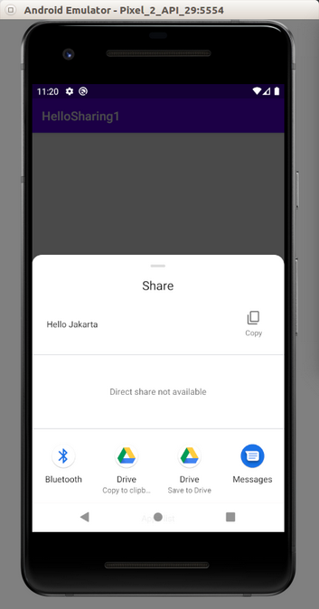
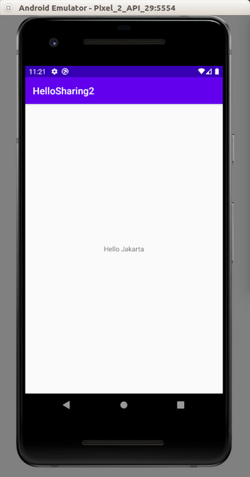

# Sharing

We can share data from application to other application.

## Sharing Intent

Create an empty Activity and name it HelloSharing1.

Edit app / res / layout / activity_main.xml. We need a button to launch sharing action.
```xml
<?xml version="1.0" encoding="utf-8"?>
<androidx.constraintlayout.widget.ConstraintLayout xmlns:android="http://schemas.android.com/apk/res/android"
    xmlns:app="http://schemas.android.com/apk/res-auto"
    xmlns:tools="http://schemas.android.com/tools"
    android:layout_width="match_parent"
    android:layout_height="match_parent"
    tools:context=".MainActivity">

    <Button
        android:id="@+id/button"
        android:layout_width="wrap_content"
        android:layout_height="wrap_content"
        android:text="Button"
        app:layout_constraintBottom_toBottomOf="parent"
        app:layout_constraintEnd_toEndOf="parent"
        app:layout_constraintHorizontal_bias="0.5"
        app:layout_constraintStart_toStartOf="parent"
        app:layout_constraintTop_toTopOf="parent" />
</androidx.constraintlayout.widget.ConstraintLayout>
```

Edit app / java / com.example.hellosharing1 / MainActivity.
```kotlin
package com.example.hellosharing1

import android.content.Intent
import androidx.appcompat.app.AppCompatActivity
import android.os.Bundle
import android.widget.Button


// Adapted from https://developer.android.com/training/sharing/send
class MainActivity : AppCompatActivity() {

    override fun onCreate(savedInstanceState: Bundle?) {
        super.onCreate(savedInstanceState)
        setContentView(R.layout.activity_main)

        findViewById<Button>(R.id.button).setOnClickListener {
            val sendIntent = Intent().apply {
                action = Intent.ACTION_SEND
                putExtra(Intent.EXTRA_TEXT, "Hello Jakarta")
                type = "text/plain"
            }

            val shareIntent = Intent.createChooser(sendIntent, "This is the title")
            startActivity(shareIntent)
        }
    }
}
```

We create an intent. The action of this intent should be ACTION_SEND. We put additional data to EXTRA_TEXT attribute (we can use any string). The type of data is the mime type. For this example, we use text/plain.

Then we create a share intent with “createChooser” method. Finally we launch the activity with that share intent.

Before we launch this application, let’s build another application to receive this data.

Create an empty Activity application and name it HelloSharing2.

Edit app / res / layout / activity_main.xml.
```xml
<?xml version="1.0" encoding="utf-8"?>
<androidx.constraintlayout.widget.ConstraintLayout xmlns:android="http://schemas.android.com/apk/res/android"
    xmlns:app="http://schemas.android.com/apk/res-auto"
    xmlns:tools="http://schemas.android.com/tools"
    android:layout_width="match_parent"
    android:layout_height="match_parent"
    tools:context=".MainActivity">

    <TextView
        android:id="@+id/textView"
        android:layout_width="wrap_content"
        android:layout_height="wrap_content"
        android:text="Hello World!"
        app:layout_constraintBottom_toBottomOf="parent"
        app:layout_constraintLeft_toLeftOf="parent"
        app:layout_constraintRight_toRightOf="parent"
        app:layout_constraintTop_toTopOf="parent" />

</androidx.constraintlayout.widget.ConstraintLayout>
```

Edit app / java / com.example.hellosharing2 / MainActivity.
```kotlin
package com.example.hellosharing2

import android.content.Intent
import androidx.appcompat.app.AppCompatActivity
import android.os.Bundle
import android.widget.TextView


// Adapted from https://developer.android.com/training/sharing/receive
class MainActivity : AppCompatActivity() {

    override fun onCreate(savedInstanceState: Bundle?) {
        super.onCreate(savedInstanceState)
        setContentView(R.layout.activity_main)

        when {
            intent?.action == Intent.ACTION_SEND -> {
                if ("text/plain" == intent.type) {
                    findViewById<TextView>(R.id.textView).text = intent.getStringExtra(Intent.EXTRA_TEXT)
                }
            }
        }
    }
}
```

We get the intent and if the action is “ACTION_SEND” and the type is “text/plain”, we can get the data using “getStringExtra” method of intent object. In this example we set the data to the text view.

Launch HelloSharing1 and press the button. We would get sharing sheet.
<p align="center">

</p>

Drag it to the top to see our HelloSharing2.
<p align="center">

</p>

If we click HelloSharing2, then we would be redirected to HelloSharing2.
<p align="center">

</p>
Our data has been shared successfully from HelloSharing1 to HelloSharing2.

# Optional Readings

https://developer.android.com/training/sharing/

# Exercises

1. Create a project which can share an image to another application.