# Facebook

We can put Facebook authentication on our Android application.

Go to https://developers.facebook.com/docs/facebook-login/android.

But we need to have a Facebook account and Facebook developer account first.
<p align="center">
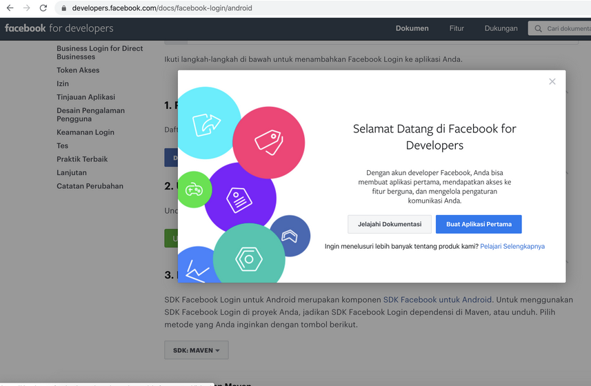
</p>

Then we need to create our application.
<p align="center">
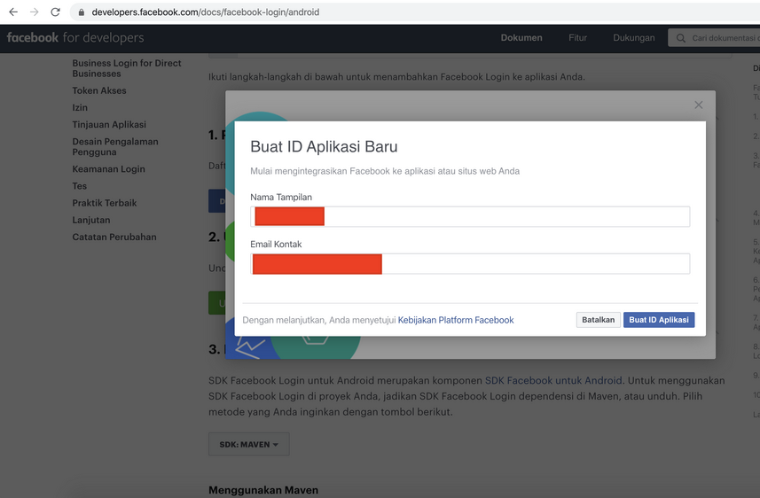
</p>

Then we choose our application in the Facebook Android authentication page.
<p align="center">
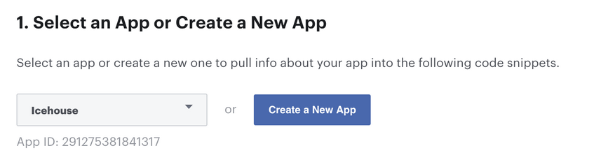
</p>

<p align="center">
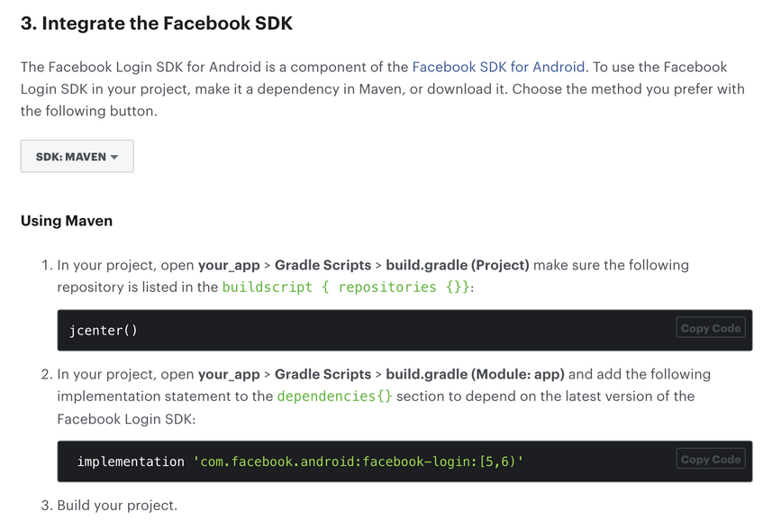
</p>

Create a new empty Activity project and name it HelloFacebook1.

Add dependency in our build.gradle (Module: app).
```gradle
implementation 'com.facebook.android:facebook-login:[5,6)'
```

Then we need to edit resources and manifests file.
<p align="center">
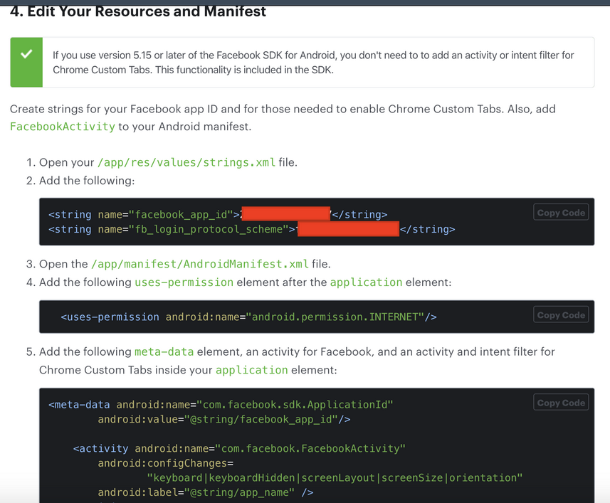
</p>

Then we need to associate our package name to our Facebook application.
<p align="center">
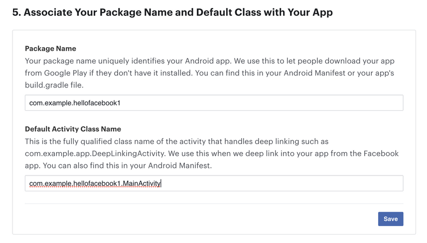
</p>

Then we need to add a key hash to this field.
<p align="center">
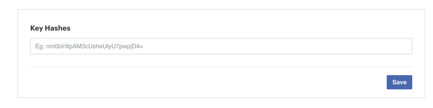
</p>

To get the key hash, we can run this command in our computer running Android studio.
```
$ keytool -exportcert -alias androiddebugkey -keystore ~/.android/debug.keystore | openssl sha1 -binary | openssl base64
```

Let’s go back to our application.

Edit app / res / layout / activity_main.xml.

```xml
<?xml version="1.0" encoding="utf-8"?>
<LinearLayout
    xmlns:android="http://schemas.android.com/apk/res/android"
    xmlns:app="http://schemas.android.com/apk/res-auto"
    xmlns:tools="http://schemas.android.com/tools"
    android:layout_width="match_parent"
    android:layout_height="match_parent"
    tools:context=".MainActivity"
    android:orientation="vertical"
    app:layout_constraintBottom_toBottomOf="parent"
    app:layout_constraintTop_toTopOf="parent"
    app:layout_constraintStart_toStartOf="parent"
    app:layout_constraintEnd_toEndOf="parent">
    <TextView
        android:id="@+id/textView"
        android:layout_width="match_parent"
        android:layout_height="wrap_content"
        android:layout_marginTop="20dp"
        android:layout_marginBottom="40dp"
        android:textAlignment="center"
        android:text="Email" />
    <com.facebook.login.widget.LoginButton
        android:id="@+id/button"
        android:layout_width="match_parent"
        android:layout_marginStart="40dp"
        android:layout_marginEnd="40dp"
        android:layout_height="wrap_content" />
</LinearLayout>
```

Notice, the button is Facebook’s LoginButton not normal button.

Edit app / java / com.example.hellofacebook1 / MainActivity.
```kotlin
package com.example.hellofacebook1

import android.content.Intent
import androidx.appcompat.app.AppCompatActivity
import android.os.Bundle
import android.widget.TextView
import com.facebook.CallbackManager
import com.facebook.login.LoginManager
import com.facebook.login.widget.LoginButton


const val EMAIL = "email"

class MainActivity : AppCompatActivity() {

    private lateinit var callbackManager: CallbackManager
    private lateinit var facebookCallback: MyFacebookCallback

    override fun onCreate(savedInstanceState: Bundle?) {
        super.onCreate(savedInstanceState)
        setContentView(R.layout.activity_main)

        val loginButton = findViewById<LoginButton>(R.id.button)
        loginButton.setPermissions(listOf(EMAIL))
        val textView = findViewById<TextView>(R.id.textView)
        callbackManager = CallbackManager.Factory.create()
        facebookCallback = MyFacebookCallback(textView)
        LoginManager.getInstance().registerCallback(callbackManager, facebookCallback)
    }

    override fun onActivityResult(requestCode: Int, resultCode: Int, data: Intent?) {
        super.onActivityResult(requestCode, resultCode, data)
        callbackManager.onActivityResult(requestCode, resultCode, data)
    }
}
```
We create a variable for CallbackManager and MyFacebookCallback.

MyFacebookCallback is defined in another file which we will discuss shortly.

Then  we set the permission for the login button.
```kotlin
val loginButton = findViewById<LoginButton>(R.id.button)
loginButton.setPermissions(listOf(EMAIL))
```

We setup the CallbackManager.
```kotlin
callbackManager = CallbackManager.Factory.create()
```

We setup MyFacebookCallback instance which accepts the textview instance.

Then we register the callback to our login process.
```kotlin
LoginManager.getInstance().registerCallback(callbackManager, facebookCallback)
```

Override onActivityResult method.
```kotlin
override fun onActivityResult(requestCode: Int, resultCode: Int, data: Intent?) {
    super.onActivityResult(requestCode, resultCode, data)
    callbackManager.onActivityResult(requestCode, resultCode, data)
}
```

Then we have to define MyFacebookCallback in app / java / com.example.hellofacebook1.
```kotlin
package com.example.hellofacebook1

import android.os.Bundle
import android.widget.TextView
import com.facebook.FacebookCallback
import com.facebook.FacebookException
import com.facebook.GraphRequest
import com.facebook.GraphResponse
import com.facebook.login.LoginResult
import org.json.JSONObject


class MyFacebookCallback(private val textView: TextView) : FacebookCallback<LoginResult> {

    override fun onSuccess(result: LoginResult?) {
        result?.let {
            val accessToken = result.accessToken
            val graphRequest = GraphRequest.newMeRequest(accessToken) { jsonObject: JSONObject, graphResponse: GraphResponse ->
                textView.text = jsonObject.getString("email")
            }
            val parameters = Bundle()
            parameters.putString("fields", "id,name,email")
            graphRequest.parameters = parameters
            graphRequest.executeAsync()
        }
    }

    override fun onCancel() {
    }

    override fun onError(error: FacebookException?) {
    }
}
```

In this example, we setup onSuccess callback only.

We get the access token.
```kotlin
val accessToken = result.accessToken
```

We create a graph request. In this case, we want to set the text view with the email of this login.
```kotlin
val graphRequest = GraphRequest.newMeRequest(accessToken) { jsonObject: JSONObject, graphResponse: GraphResponse ->
                textView.text = jsonObject.getString("email")
            }
```

Then we execute the graph request.
```kotlin
    val parameters = Bundle()
    parameters.putString("fields", "id,name,email")
    graphRequest.parameters = parameters
    graphRequest.executeAsync()
```

If we ran the application, we would get this screen.
<p align="center">
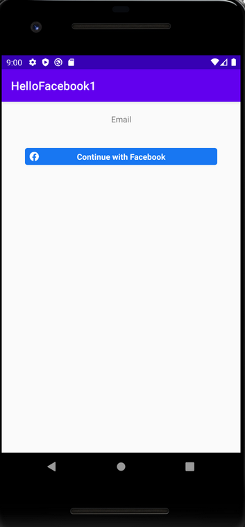
</p>

If we clicked Facebook login button, we would get this screen.
<p align="center">
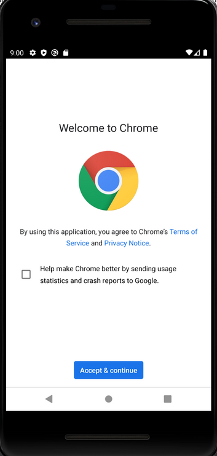
</p>

We login in Facebook through Chrome browser. Then we arrive in Facebook login screen.
<p align="center">
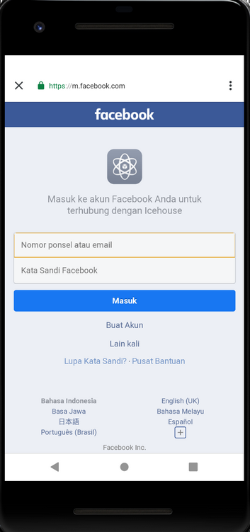
</p>

After logging in, we would get our email in the screen.
<p align="center">
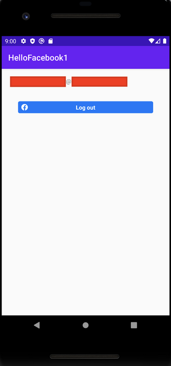
</p>

If we want to go further, we can pass the access token to the server on which we could confirm it.

To learn more, refer to this documentation.

https://developers.facebook.com/docs/facebook-login/manually-build-a-login-flow

https://developers.facebook.com/docs/facebook-login/web

# Optional Readings

https://developers.facebook.com/docs/android/

https://developer.android.com/training/id-auth/authenticate

# Exercises

1. Create a project on which you upload Facebook token to your server. In the server, you confirm the token legits or not. Then you make a request based on this token.