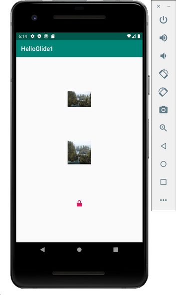
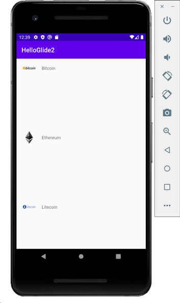

# Glide

Glide is image loading library from disk or internet. It can also transform the image.

## Basic Usage

Create a new empty Activity project and name it HelloGlide1.

Edit build.gradle (Module: app).

Add this plugin.
```gradle
apply plugin: 'kotlin-kapt'
```

Add these dependencies.
```gradle
implementation "com.github.bumptech.glide:glide:4.11.0"
kapt 'com.github.bumptech.glide:compiler:4.11.0'
```

Edit the manifest file so we can have internet access, app / manifests / AndroidManifest.xml.
```xml
<uses-permission android:name="android.permission.INTERNET"/>
```

Edit app / java / com.example.helloglide1 / MainActivity.
```kotlin
package com.example.helloglide1
import androidx.appcompat.app.AppCompatActivity
import android.os.Bundle
import android.widget.ImageView
import com.bumptech.glide.Glide
import com.bumptech.glide.request.RequestOptions

class MainActivity : AppCompatActivity() {

    override fun onCreate(savedInstanceState: Bundle?) {
        super.onCreate(savedInstanceState)
        setContentView(R.layout.activity_main)

        val imageUrl = "https://images.unsplash.com/photo-1573108037329-37aa135a142e?auto=format&fit=crop&w=800"

        val imageView = findViewById<ImageView>(R.id.imageView)
        Glide.with(this)
            .load(imageUrl)
            .override(200, 200)
            .into(imageView)

        val imageView2 = findViewById<ImageView>(R.id.imageView2)
        val options = RequestOptions().centerCrop().override(200, 200)
        Glide.with(this)
            .load(imageUrl)
            .apply(options)
            .into(imageView2)

        val imageView3 = findViewById<ImageView>(R.id.imageView3)
        Glide.with(this)
            .load("")
            .override(200, 200)
            .placeholder(android.R.drawable.ic_lock_lock)
            .into(imageView3)
    }
}
```

To load the image from internet, we just use “with” accepting the Activity or the Fragment, “load” accepting the image url, “into” accepting the image view or any view that can display an image. 
```kotlin
Glide.with(this)
    .load(imageUrl)
    .override(200, 200)
    .into(imageView)
```

The “override” is a method to resize the image. Glide has trasnformation methods.

We can create options which can transform images to be applied to our image using “RequestOptions”.
```kotlin
val options = RequestOptions().centerCrop().override(200, 200)
Glide.with(this)
    .load(imageUrl)
    .apply(options)
    .into(imageView2)
```

Here, we crop center the image.

We can also use placeholder as an image replacement before the image is displayed.
```kotlin
Glide.with(this)
    .load("")
    .override(200, 200)
    .placeholder(android.R.drawable.ic_lock_lock)
    .into(imageView3)
```

If we ran the application, we would get this output.
<p align="center">

</p>

## Integration with RecyclerView

Glide has integration library with RecyclerView. The purpose of the this integration library is for performance.  So when we scroll the recyclerview, the library can load the images for upcoming rows before we reach them.

Create a new empty Activity and name it HelloGlade2.

Edit build.gradle (Module: app).

Add kapt plugin.
```gradle
apply plugin: 'kotlin-kapt'
```

Add these dependencies: glide, recyclerview, and glide recyclerview integration library.
```gradle
implementation "androidx.recyclerview:recyclerview:1.1.0"
implementation "com.github.bumptech.glide:glide:4.11.0"
kapt 'com.github.bumptech.glide:compiler:4.11.0'
implementation ("com.github.bumptech.glide:recyclerview-integration:4.11.0") {
    transitive = false
}
```

Create a layout for reyclerview’s row, app / res / layout / row.xml.
```xml
<?xml version="1.0" encoding="utf-8"?>
<LinearLayout xmlns:android="http://schemas.android.com/apk/res/android"
    android:id="@+id/cryptoRow"
    android:orientation="horizontal"
    android:layout_width="match_parent"
    android:layout_height="wrap_content">
    <ImageView
        android:layout_width="40dp"
        android:layout_height="40dp"
        android:layout_marginStart="20dp"
        android:layout_marginEnd="20dp"
        android:layout_marginTop="10dp"
        android:id="@+id/imageView" />
    <TextView
        android:text="TextView"
        android:layout_width="0dp"
        android:layout_marginTop="20dp"
        android:layout_height="200dp" android:id="@+id/textView" android:layout_weight="1"/>
</LinearLayout>
```

Create a layout for the main activity.
```xml
<?xml version="1.0" encoding="utf-8"?>
<androidx.recyclerview.widget.RecyclerView
    xmlns:android="http://schemas.android.com/apk/res/android"
    android:id="@+id/recyclerView"
    android:layout_width="match_parent"
    android:layout_height="match_parent"/>
```

We will load images from internet. Edit app /manifests / AndroidManifest.xml. Add internet permission.
```xml
<uses-permission android:name="android.permission.INTERNET"/>
```

Create a view holder for the recyclerview, app / java / com.example.helloglide2 / CryptocurrencyViewHolder.
```kotlin
package com.example.helloglide2
import android.content.Context
import android.view.View
import android.widget.ImageView
import android.widget.TextView
import androidx.recyclerview.widget.RecyclerView
import com.bumptech.glide.Glide

class CryptocurrencyViewHolder(private val view : View, private val context: Context) : RecyclerView.ViewHolder(view) {

    private val textView : TextView = this.view.findViewById(R.id.textView)
    private val imageView : ImageView = this.view.findViewById(R.id.imageView)

    fun bindModel(item: Pair<String, String>) {
        this.textView.text = item.first
        Glide.with(context)
            .load(item.second)
            .into(imageView)
    }
}
```

We load image in the view holder with Glide in a usual way.
```kotlin
Glide.with(context)
    .load(item.second)
    .into(imageView)
```

Then we need to create an adapter for the recyclerview, app / java / com.example.helloglide2 / CryptocurrencyAdapter.
```kotlin
package com.example.helloglide2
import android.view.LayoutInflater
import android.view.ViewGroup
import androidx.recyclerview.widget.RecyclerView

class CryptocurrencyAdapter(private val cryptoDataset: List<Pair<String, String>>) : RecyclerView.Adapter<CryptocurrencyViewHolder>() {

    override fun onCreateViewHolder(parent: ViewGroup, viewType: Int) : CryptocurrencyViewHolder {
        val linearLayout = LayoutInflater.from(parent.context).inflate(R.layout.row, parent, false)
        return CryptocurrencyViewHolder(linearLayout, parent.context)
    }

    override fun onBindViewHolder(holder: CryptocurrencyViewHolder, position: Int) {
        holder.bindModel(cryptoDataset[position])
    }

    override fun getItemCount() = cryptoDataset.size
}
```

This is normal adapter. We pass the context of the view group to the view holder in “onCreateViewHolder” method.

Edit app / java / com.example.helloglide2 / MainActivity.
```kotlin
package com.example.helloglide2
import androidx.appcompat.app.AppCompatActivity
import android.os.Bundle
import androidx.recyclerview.widget.LinearLayoutManager
import androidx.recyclerview.widget.RecyclerView
import com.bumptech.glide.Glide
import com.bumptech.glide.integration.recyclerview.RecyclerViewPreloader
import com.bumptech.glide.util.FixedPreloadSizeProvider

class MainActivity : AppCompatActivity() {

    private lateinit var recyclerView: RecyclerView
    private lateinit var viewAdapter: RecyclerView.Adapter<*>
    private lateinit var viewManager: RecyclerView.LayoutManager
    val cryptocurrencies = listOf(
        Pair("Bitcoin", "https://upload.wikimedia.org/wikipedia/commons/thumb/c/c5/Bitcoin_logo.svg/200px-Bitcoin_logo.svg.png"),
        Pair("Ethereum", "https://upload.wikimedia.org/wikipedia/commons/thumb/0/05/Ethereum_logo_2014.svg/200px-Ethereum_logo_2014.svg.png"),
        Pair("Litecoin", "https://upload.wikimedia.org/wikipedia/commons/thumb/2/24/6_Full_Logo_S-2.png/320px-6_Full_Logo_S-2.png"),
        Pair("Bitcoin Cash", "https://upload.wikimedia.org/wikipedia/commons/thumb/5/58/Bitcoin_Cash.png/287px-Bitcoin_Cash.png"),
        Pair("Monero", "https://upload.wikimedia.org/wikipedia/commons/thumb/2/2d/Monero-Logo.svg/200px-Monero-Logo.svg.png"),
        Pair("Ripple", "https://upload.wikimedia.org/wikipedia/commons/thumb/8/88/Ripple_logo.svg/200px-Ripple_logo.svg.png"),
        Pair("Zcash", "https://upload.wikimedia.org/wikipedia/en/thumb/9/99/Zcash_logo_2019.svg/320px-Zcash_logo_2019.svg.png"),
        Pair("Stellar", "https://upload.wikimedia.org/wikipedia/commons/thumb/5/56/Stellar_Symbol.png/284px-Stellar_Symbol.png"),
        Pair("Tether", "https://upload.wikimedia.org/wikipedia/commons/thumb/7/73/Tether_Logo.svg/200px-Tether_Logo.svg.png"),
        Pair("Dash", "https://upload.wikimedia.org/wikipedia/commons/thumb/b/bf/Dash_logo_2018_rgb_for_screens.png/320px-Dash_logo_2018_rgb_for_screens.png")
    )

    override fun onCreate(savedInstanceState: Bundle?) {
        super.onCreate(savedInstanceState)
        setContentView(R.layout.activity_main)

        viewManager = LinearLayoutManager(this)
        viewAdapter = CryptocurrencyAdapter(cryptocurrencies)
        recyclerView = findViewById<RecyclerView>(R.id.recyclerView).apply {
            setHasFixedSize(true)
            layoutManager = viewManager
            adapter = viewAdapter
        }

        // Integration with RecyclerView
        val imageWidth = 50
        val imageHeight = 80
        val sizeProvider = FixedPreloadSizeProvider<Any>(imageWidth, imageHeight)
        val modelProvider = ImagePreloadModelProvider(cryptocurrencies, this, imageWidth, imageHeight)
        val preloader = RecyclerViewPreloader(Glide.with(this), modelProvider, sizeProvider, 3)
        recyclerView.addOnScrollListener(preloader)
    }
}
```

We setup the recyclerview as usual.
```kotlin
viewManager = LinearLayoutManager(this)
viewAdapter = CryptocurrencyAdapter(cryptocurrencies)
recyclerView = findViewById<RecyclerView>(R.id.recyclerView).apply {
    setHasFixedSize(true)
    layoutManager = viewManager
    adapter = viewAdapter
}
```

Then we setup the integration between recyclerview and Glide library.

First, we setup the size provider. We can use FixedPreloadSizeProvider and give the width and the height of the image we want.
```kotlin
val imageWidth = 50
val imageHeight = 80
val sizeProvider = FixedPreloadSizeProvider<Any>(imageWidth, imageHeight)
```

Then we must setup the model provider.
```kotlin
val modelProvider = ImagePreloadModelProvider(cryptocurrencies, this, imageWidth, imageHeight)
```

The ImagePreloadModelProvider class is a custom class which implements PreloadModelProvider.

Create app / java / com.example.helloglide2 / ImagePreloadModelProvider.
```kotlin
package com.example.helloglide2

import android.content.Context
import android.text.TextUtils
import com.bumptech.glide.Glide
import com.bumptech.glide.ListPreloader
import com.bumptech.glide.RequestBuilder
import java.util.*

class ImagePreloadModelProvider (private val listUrls: List<Pair<String, String>>,
                                 private val context: Context,
                                 private val imageWidth: Int,
                                 private val imageHeight: Int) :
    ListPreloader.PreloadModelProvider<Any> {

    override fun getPreloadItems(position: Int): MutableList<Any> {
        val url = listUrls.get(position)
        if (TextUtils.isEmpty(url.first)) {
            return Collections.emptyList()
        }
        return Collections.singletonList(url.first)
    }

    override fun getPreloadRequestBuilder(item: Any): RequestBuilder<*>? {
        return Glide.with(context)
            .load(item)
            .override(imageWidth, imageHeight)
    }
}
```

The model provider turns our dataset which is a list of Pair into a list of models. Each model from this list got a request builder which is provided by “getPreloadRequestBuilder” method.

Notice that we use the same image’s size in model provider and the loading of image in view holder. We need to do this for caching purpose.

We go back to our MainActivity.

After setting up our model provider, we setup the RecyclerViewPreloader.
```kotlin
val preloader = RecyclerViewPreloader(Glide.with(this), modelProvider, sizeProvider, 3)
```

The last parameter is the maximum preload number. We can increase the number for real world application.

Lastly, we need to set this preloader to our scroll listener in recyclerview.
```kotlin
recyclerView.addOnScrollListener(preloader)
```

If we ran the application, we would get this screen.
<p align="center">

</p>

# Optional Readings

https://bumptech.github.io/glide/

# Exercises

1. Create a project using Glade with caching strategy.

2. Create a project using Glade with configuration (AppGlideModule).