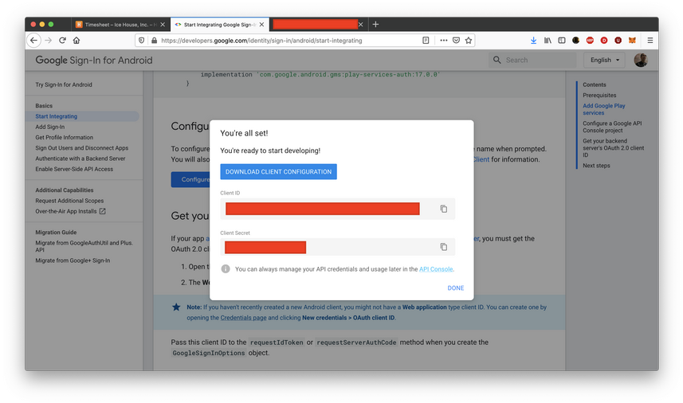

# Google Authentication

We can create a Google authentication in Android app. User can login in our application with their Google account. 

Create an empty Activity project. Name it HelloGoogle1.

Add Google Play dependency in build.gradle (Module: app).
```gradle
implementation 'com.google.android.gms:play-services-auth:17.0.0'
```

Go to https://developers.google.com/identity/sign-in/android/start-integrating. Then click “Configure a project” button.
<p align="center">

</p>

Give a project name. Then click Next.
<p align="center">

</p>

Give the name to our application.
<p align="center">

</p>

We need to fill the package name and the SHA-1 signing certificate.

To get the SHA-1 signing certificate, we can run this command.
```
$ keytool -list -v -keystore ~/.android/debug.keystore -alias androiddebugkey -storepass android -keypass android
```

Here, we are using debug key. In order to run “keytool” program, we need to install Java.

In Mac, do these steps:
```
$ brew tap adoptopenjdk/openjdk

$ brew cask install adoptopenjdk8
```

Then once we got the SHA-1 signing certificate from the output of the “keytool” program, we could fill it in the form.
<p align="center">

</p>

Then we can download the client configuration. In this example, we would not use client ID and client secret.

Edit app / res / layout / activity_main.xml.
```xml
<?xml version="1.0" encoding="utf-8"?>
<androidx.constraintlayout.widget.ConstraintLayout xmlns:android="http://schemas.android.com/apk/res/android"
    xmlns:app="http://schemas.android.com/apk/res-auto"
    xmlns:tools="http://schemas.android.com/tools"
    android:layout_width="match_parent"
    android:layout_height="match_parent"
    tools:context=".MainActivity">
    <TextView
        android:id="@+id/textView"
        android:layout_width="wrap_content"
        android:layout_height="wrap_content"
        android:text="Email"
        app:layout_constraintBottom_toTopOf="@+id/button"
        app:layout_constraintEnd_toEndOf="parent"
        app:layout_constraintHorizontal_bias="0.5"
        app:layout_constraintStart_toStartOf="parent"
        app:layout_constraintTop_toTopOf="parent" />
    <com.google.android.gms.common.SignInButton
        android:id="@+id/button"
        android:layout_width="wrap_content"
        android:layout_height="wrap_content"
        android:text="Button"
        app:layout_constraintBottom_toTopOf="@+id/linearLayout"
        app:layout_constraintEnd_toEndOf="parent"
        app:layout_constraintHorizontal_bias="0.5"
        app:layout_constraintStart_toStartOf="parent"
        app:layout_constraintTop_toBottomOf="@+id/textView" />
    <LinearLayout
        android:id="@+id/linearLayout"
        android:layout_width="409dp"
        android:layout_height="112dp"
        app:layout_constraintBottom_toBottomOf="parent"
        app:layout_constraintEnd_toEndOf="parent"
        app:layout_constraintHorizontal_bias="0.5"
        app:layout_constraintStart_toStartOf="parent"
        app:layout_constraintTop_toBottomOf="@+id/button">
        <Button
            android:id="@+id/logOutButton"
            android:layout_width="wrap_content"
            android:layout_height="wrap_content"
            android:layout_marginStart="20dp"
            android:layout_marginEnd="20dp"
            android:layout_weight="1"
            android:text="Logout" />
        <Button
            android:id="@+id/revokeButton"
            android:layout_width="wrap_content"
            android:layout_height="wrap_content"
            android:layout_marginStart="20dp"
            android:layout_marginEnd="20dp"
            android:layout_weight="1"
            android:text="Revoke" />
    </LinearLayout>
</androidx.constraintlayout.widget.ConstraintLayout>
```

Notice, one of the buttons is google’s SignInButton.

Edit the manifest file, app / manifests / AndroidManifest. Add internet permission.
```xml
<uses-permission android:name="android.permission.INTERNET" />
```

Edit app / java / com.example.hellogoogle1 / MainActivity.
```kotlin
package com.example.hellogoogle1

import android.content.Intent
import android.os.Bundle
import android.widget.Button
import android.widget.TextView
import androidx.appcompat.app.AppCompatActivity
import com.google.android.gms.auth.api.signin.GoogleSignIn
import com.google.android.gms.auth.api.signin.GoogleSignInAccount
import com.google.android.gms.auth.api.signin.GoogleSignInClient
import com.google.android.gms.auth.api.signin.GoogleSignInOptions
import com.google.android.gms.common.SignInButton
import com.google.android.gms.common.api.ApiException
import com.google.android.gms.tasks.Task


private val RC_SIGN_IN = 0

class MainActivity : AppCompatActivity() {

    private lateinit var googleSignInClient: GoogleSignInClient

    override fun onCreate(savedInstanceState: Bundle?) {
        super.onCreate(savedInstanceState)
        setContentView(R.layout.activity_main)

        val gso = GoogleSignInOptions.Builder(GoogleSignInOptions.DEFAULT_SIGN_IN).requestEmail().build()
        googleSignInClient = GoogleSignIn.getClient(this, gso)
        val account = GoogleSignIn.getLastSignedInAccount(this)
        account?.let {
            updateUI(it)
        }

        findViewById<SignInButton>(R.id.button).setOnClickListener {
            val signInIntent = googleSignInClient.signInIntent
            startActivityForResult(signInIntent, RC_SIGN_IN)
        }

        findViewById<Button>(R.id.logOutButton).setOnClickListener {
            googleSignInClient.signOut().addOnCompleteListener {
                clearUI()
            }
        }

        findViewById<Button>(R.id.revokeButton).setOnClickListener {
            googleSignInClient.revokeAccess().addOnCompleteListener {
                clearUI()
            }
        }
    }

    fun updateUI(account: GoogleSignInAccount) {
        findViewById<TextView>(R.id.textView).text = account.email
    }

    fun clearUI() {
        findViewById<TextView>(R.id.textView).text = ""
    }

    fun handleSignInResult(completedTask: Task<GoogleSignInAccount>) {
        val account = completedTask.getResult(ApiException::class.java)
        account?.let {
            updateUI(it)
        }
    }

    override fun onActivityResult(requestCode: Int, resultCode: Int, data: Intent?) {
        super.onActivityResult(requestCode, resultCode, data)
        if (requestCode == RC_SIGN_IN) {
            val task = GoogleSignIn.getSignedInAccountFromIntent(data)
            handleSignInResult(task)
        }
    }
}
```

We create a Google signin object.
```kotlin
val gso = GoogleSignInOptions.Builder(GoogleSignInOptions.DEFAULT_SIGN_IN).requestEmail().build()
googleSignInClient = GoogleSignIn.getClient(this, gso)
```

To launch Google signin screen, we can treat it as a normal intent.
```kotlin
val signInIntent = googleSignInClient.signInIntent
startActivityForResult(signInIntent, RC_SIGN_IN)
```

In the Activity result callback, we can get the result.
```kotlin
fun updateUI(account: GoogleSignInAccount) {
    findViewById<TextView>(R.id.textView).text = account.email
}
fun clearUI() {
    findViewById<TextView>(R.id.textView).text = ""
}
fun handleSignInResult(completedTask: Task<GoogleSignInAccount>) {
    val account = completedTask.getResult(ApiException::class.java)
    account?.let {
        updateUI(it)
    }
}
override fun onActivityResult(requestCode: Int, resultCode: Int, data: Intent?) {
    super.onActivityResult(requestCode, resultCode, data)
    if (requestCode == RC_SIGN_IN) {
        val task = GoogleSignIn.getSignedInAccountFromIntent(data)
        handleSignInResult(task)
    }
}
```

We get the task object then we get the result from the task object. The result is the account object on which we can extract the email. In this example, we set the email to the text view.

If we ran the application, we would get this screen.
<p align="center">

</p>

Click Google Sign in button.
<p align="center">

</p>

Then we would get the email of our account.
<p align="center">

</p>

Usually we combine the authentication in client with the backend. We ask the token with web client id (we have to generate it in other place). Then we would get the token after we successfully sign in. We would upload this token to the backend. In the backend, we would authenticate this token to Google server. The authentication process would give us the necessary information.

# Optional Readings

https://developers.google.com/identity/sign-in/android/backend-auth

# Exercises

1. Create a project which upload a token from Google to your server on which you must confirm the token is legit or not.