# Git

Git is a source code control version.

## Basic Usage

### Initialization
```
$ mkdir repo1
$ cd repo1
$ git init
```

We can initialize a directory as git repository with “git init”.We can make sure that the directory has been initialized properly by checking its content.
```
$ ls .git
HEAD		config		hooks		objects
branches	description	info		refs
```

Adding Files (To Staging)

Create a file named cryptocurrencies.txt and fill it with these lines.
```
Bitcoin
Ethereum
Litecoin
```

To check the status of our local repository, we can use “git status”.
```
$ git status
On branch master

No commits yet

Untracked files:
  (use "git add <file>..." to include in what will be committed)

	cryptocurrencies.txt

nothing added to commit but untracked files present (use "git add" to track)
```

To track the file, we can add the file.
```
$ git add cryptocurrencies.txt
On branch master

No commits yet

Changes to be committed:
  (use "git rm --cached <file>..." to unstage)

	new file:   cryptocurrencies.txt
```

This file has been tracked.

Add another line on cryptocurrency.txt so the content of the file becomes like this.
```
Bitcoin
Ethereum
Litecoin
Ripple
```
If we checked the status of the repository, we would get this output.
```
On branch master

No commits yet

Changes to be committed:
  (use "git rm --cached <file>..." to unstage)

	new file:   cryptocurrencies.txt

Changes not staged for commit:
  (use "git add <file>..." to update what will be committed)
  (use "git checkout -- <file>..." to discard changes in working directory)

	modified:   cryptocurrencies.txt
```

To check the changes to the staged area, we can use “git diff”.
```
$ git diff

+++ b/cryptocurrencies.txt
@@ -1,3 +1,4 @@
 Bitcoin
 Ethereum
 Litecoin
+Ripple
```

Add the changes.
```
$ git add .
```

. means everything.

Check the status again.
```
$ git status

On branch master

No commits yet

Changes to be committed:
  (use "git rm --cached <file>..." to unstage)

	new file:   cryptocurrencies.txt
```

## Commit

To commit changes to the repository, we can use “git commit”.
```
$ git commit -m “Add an initial file.”

[master (root-commit) ff2704f] Add an initial file.
 1 file changed, 4 insertions(+)
 create mode 100644 cryptocurrencies.txt
```

Check the status.
```
$ git status
On branch master
nothing to commit, working tree clean
```

Add a new line again so the content of cryptocurrency.txt looks like this.
```
Bitcoin
Ethereum
Litecoin
Ripple
Bitcoin Cash
```

Then add it.
```
$ git add .
```

Then add another new line so the content of cryptocurrency.txt looks like this.
```
Bitcoin
Ethereum
Litecoin
Ripple
Bitcoin Cash
Tether
```

Check the status.
```
$ git status
On branch master
Changes to be committed:
  (use "git reset HEAD <file>..." to unstage)

	modified:   cryptocurrencies.txt

Changes not staged for commit:
  (use "git add <file>..." to update what will be committed)
  (use "git checkout -- <file>..." to discard changes in working directory)

	modified:   cryptocurrencies.txt
```

We can check the difference to the staging (added but not commited).
```
$ git diff
diff --git a/cryptocurrencies.txt b/cryptocurrencies.txt
index 8d54ec1..375b92b 100644
--- a/cryptocurrencies.txt
+++ b/cryptocurrencies.txt
@@ -3,3 +3,4 @@ Ethereum
 Litecoin
 Ripple
 Bitcoin Cash
+Tether
```

We can check the difference to the top of the commited repository.
```
$ git diff HEAD
diff --git a/cryptocurrencies.txt b/cryptocurrencies.txt
index 41d45ea..375b92b 100644
--- a/cryptocurrencies.txt
+++ b/cryptocurrencies.txt
@@ -2,3 +2,5 @@ Bitcoin
 Ethereum
 Litecoin
 Ripple
+Bitcoin Cash
+Tether
```

HEAD is a pointer to the top (the newest) of the commited repository.

Add the changes and commit it.
```
$ git add .
$ git commit -m “Add Bitcoin Cash and Tether.”
```

## Log

We can check our work so far.
```
$ git log
[master 2766016] Add Bitcoin Cash and Tether.
 1 file changed, 2 insertions(+)
skys-MacBook-Pro:repo1 arjuna$ git log
commit 2766016aafe2ea349fd66aca63408df32a949d88 (HEAD -> master)
Author: Arjuna Sky Kok <sky.kok@lezatify.com>
Date:   Sun Mar 29 20:04:59 2020 +0700

    Add Bitcoin Cash and Tether.

commit ff2704f722611392c7a66521b34fb7ca34f3aaed
Author: Arjuna Sky Kok <sky.kok@lezatify.com>
Date:   Sun Mar 29 15:39:05 2020 +0700

    Add an initial file.
```

Notice “HEAD -> master” in the output of “git log”.

HEAD is the pointer pointing to the last commited place. So when we push another commit, it will be put on top of HEAD. Then the HEAD will be directed to the new commit. And so on.

We have two commits. The first one (the oldest) is “ff2704f...” and the second one (the newest) is “2766016...”. The HEAD pointer points to “2766016...” commit. If there is a new commit, that new commit will be put on top of “2766016...”. Then the HEAD pointer will move to that new commit.

The master is the name of the branch. Right now, we have one branch only. The name of the that branch is master.

## Undo Changes

Add a new line on cryptocurrency.txt so the content of the file looks like this.
```
Bitcoin
Ethereum
Litecoin
Ripple
Bitcoin Cash
Tether
Monero
```

Check the status.
```
$ git status
diff --git a/cryptocurrencies.txt b/cryptocurrencies.txt
index 375b92b..eaa1e3e 100644
--- a/cryptocurrencies.txt
+++ b/cryptocurrencies.txt
@@ -4,3 +4,4 @@ Litecoin
 Ripple
 Bitcoin Cash
 Tether
+Monero
```

If we want to undo the change (Monero), we can use “git checkout”.
```
$ git checkout HEAD cryptocurrencies.txt
Updated 1 path from aa3ed61
skys-MacBook-Pro:repo1 arjuna$ git status
On branch master
nothing to commit, working tree clean
```

It means we want to get the cryptocurrencies.txt of HEAD version to our working directory.

Add the changes (Monero) again. Add it.
```
$ git add .
```

Then to undo the changes, we can rest it.
```
$ git reset HEAD cryptocurrency.txt
```

Then the changes is unstaged.

Add the changes (Monero) again. Add it and commit it.
```
$ git add
$ git commit -m “Add Monero.”
```

Look at the log.
```
$ git log
commit d4ea8dd951009d84ed6ab8b8d290985fe516557d (HEAD -> master)
Author: Arjuna Sky Kok <sky.kok@lezatify.com>
Date:   Sun Mar 29 21:19:44 2020 +0700

    Add Monero.

commit 2766016aafe2ea349fd66aca63408df32a949d88
Author: Arjuna Sky Kok <sky.kok@lezatify.com>
Date:   Sun Mar 29 20:04:59 2020 +0700

    Add Bitcoin Cash and Tether.

commit ff2704f722611392c7a66521b34fb7ca34f3aaed
Author: Arjuna Sky Kok <sky.kok@lezatify.com>
Date:   Sun Mar 29 15:39:05 2020 +0700

    Add an initial file.
```

If we wanted to create changes to undo the changes (Add Monero), we could revert it.
```
$ git revert HEAD
```

We would be presented with this screen.
```
  Revert "Add Monero."
  
  This reverts commit d4ea8dd951009d84ed6ab8b8d290985fe516557d.
  
  # Please enter the commit message for your changes. Lines starting
  # with '#' will be ignored, and an empty message aborts the commit.
  #
  # On branch master
  # Changes to be committed:
  #       modified:   cryptocurrencies.txt
  #
```

Confirm it. Type “:wq” then press Enter. This screen is in Vim editing mode. Vim is a Unix text editor.
```
$ git revert HEAD
[master 046ccc9] Revert "Add Monero."
 1 file changed, 1 deletion(-)
```

Check our cryptocurrency.txt file. No more “Monero” line.

We can go back in time with resetting. We can delete the commit instead of creating a commit to undo the changes.

Check the log.
```
$ git log
commit 046ccc978ba9ca437b6a67e951ff124806c115e9 (HEAD -> master)
Author: Arjuna Sky Kok <sky.kok@lezatify.com>
Date:   Sun Mar 29 21:21:23 2020 +0700

    Revert "Add Monero."

    This reverts commit d4ea8dd951009d84ed6ab8b8d290985fe516557d.

commit d4ea8dd951009d84ed6ab8b8d290985fe516557d
Author: Arjuna Sky Kok <sky.kok@lezatify.com>
Date:   Sun Mar 29 21:19:44 2020 +0700

    Add Monero.

commit 2766016aafe2ea349fd66aca63408df32a949d88
Author: Arjuna Sky Kok <sky.kok@lezatify.com>
Date:   Sun Mar 29 20:04:59 2020 +0700

    Add Bitcoin Cash and Tether.

commit ff2704f722611392c7a66521b34fb7ca34f3aaed
Author: Arjuna Sky Kok <sky.kok@lezatify.com>
Date:   Sun Mar 29 15:39:05 2020 +0700

    Add an initial file.
```

We can delete the commit “046ccc978...”, ‘Revert “Add Monero.”’.
```
$ git reset --hard d4ea8dd95100
HEAD is now at d4ea8dd Add Monero.
```

Check the log again.
```
$ git log
commit d4ea8dd951009d84ed6ab8b8d290985fe516557d (HEAD -> master)
Author: Arjuna Sky Kok <sky.kok@lezatify.com>
Date:   Sun Mar 29 21:19:44 2020 +0700

    Add Monero.

commit 2766016aafe2ea349fd66aca63408df32a949d88
Author: Arjuna Sky Kok <sky.kok@lezatify.com>
Date:   Sun Mar 29 20:04:59 2020 +0700

    Add Bitcoin Cash and Tether.

commit ff2704f722611392c7a66521b34fb7ca34f3aaed
Author: Arjuna Sky Kok <sky.kok@lezatify.com>
Date:   Sun Mar 29 15:39:05 2020 +0700

    Add an initial file.
```

The commit for reverting “Monero” line has been deleted.

We are resetting the commit the hard way. There are other options, such as soft and mixed.

What if we want to change the last commit’s message? We can use --amend option.
```
$ git commit --amend
   Add Monero.
  
   # Please enter the commit message for your changes. Lines starting
   # with '#' will be ignored, and an empty message aborts the commit.
   #
   # Date:      Sun Mar 29 21:19:44 2020 +0700
   #
   # On branch master
   # Changes to be committed:
   #       modified:   cryptocurrencies.txt
   #
```

Change “Add Monero.” to “Added Monero.”

We would get this message.
```
[master 8f068b4] Added Monero.
 Date: Sun Mar 29 21:19:44 2020 +0700
 1 file changed, 1 insertion(+)
```

The commit message has been changed.

Change the message back to “Add Monero.”

## Branching

Branching is useful if we want to work on a feature in parallel. Right now, we have only one branch.

To create a new branch, we can use this command.
```
$ git checkout -b secret
Switched to a new branch 'secret'
```

Right now we have two branches: secret and master. Both have same commits.

Add a new line, “Zcash”, to our cryptocurrency.txt so the content of our cryptocurrency.txt looks like this.
```
Bitcoin
Ethereum
Litecoin
Ripple
Bitcoin Cash
Tether
Monero
Zcash
```

Add it and commit it.
```
$ git add .
$ git commit -m “Add Zcash.”
[secret 79a14d2] Add Zcash.
 1 file changed, 1 insertion(+)
```

Right now, this commit is in secret branch.

Check the log.
```
$ git log
commit 79a14d28f4d302aab812ed7f0908e6f22e6c27c3 (HEAD -> secret)
Author: Arjuna Sky Kok <sky.kok@lezatify.com>
Date:   Sun Mar 29 22:22:24 2020 +0700

    Add Zcash.

commit d4ea8dd951009d84ed6ab8b8d290985fe516557d (master)
Author: Arjuna Sky Kok <sky.kok@lezatify.com>
Date:   Sun Mar 29 21:19:44 2020 +0700

    Add Monero.

commit 2766016aafe2ea349fd66aca63408df32a949d88
Author: Arjuna Sky Kok <sky.kok@lezatify.com>
Date:   Sun Mar 29 20:04:59 2020 +0700

    Add Bitcoin Cash and Tether.

commit ff2704f722611392c7a66521b34fb7ca34f3aaed
Author: Arjuna Sky Kok <sky.kok@lezatify.com>
Date:   Sun Mar 29 15:39:05 2020 +0700

    Add an initial file.
```

Notice our HEAD points a commit in secret branch (HEAD -> secret). HEAD is not in master anymore.

We can go back to master by using checkout.
```
$ git checkout master
Switched to branch 'master'
```

Check the log again.
```
$ git log

commit d4ea8dd951009d84ed6ab8b8d290985fe516557d (HEAD -> master)
Author: Arjuna Sky Kok <sky.kok@lezatify.com>
Date:   Sun Mar 29 21:19:44 2020 +0700

    Add Monero.

commit 2766016aafe2ea349fd66aca63408df32a949d88
Author: Arjuna Sky Kok <sky.kok@lezatify.com>
Date:   Sun Mar 29 20:04:59 2020 +0700

    Add Bitcoin Cash and Tether.

commit ff2704f722611392c7a66521b34fb7ca34f3aaed
Author: Arjuna Sky Kok <sky.kok@lezatify.com>
Date:   Sun Mar 29 15:39:05 2020 +0700

    Add an initial file.
```

No more Zcash commit anymore.

Go back to secret branch again.

Add another line. Neo.

Add it to staging and commit it.
```
$ git add .
$ git commit -m “Add Neo.”
```

Go to master branch.
```
$ git checkout master
```

What if we want to bring changes from secret branch to master branch.
```
$ git merge secret
```

Then our changes (Zcash and Neo) has been brought to master.
```
$ git log
commit f440ba38ef14ce0600268ed061596b58aaaf5e25 (HEAD -> master, secret)
Author: Arjuna Sky Kok <sky.kok@lezatify.com>
Date:   Sun Mar 29 22:39:27 2020 +0700

    Add Neo.

commit 79a14d28f4d302aab812ed7f0908e6f22e6c27c3
Author: Arjuna Sky Kok <sky.kok@lezatify.com>
Date:   Sun Mar 29 22:22:24 2020 +0700

    Add Zcash.
...
```

Let’s revert it back to the changes before Zcash which is Monero.

**If your commit has different signature, adjust it accordingly. Use your hash signature, not mine. Mine is d4ea8dd95. We don’t have to use the full version of hash signature. Only first 9 characters (or even less) suffice.**
```
$ git reset --hard d4ea8dd95
HEAD is now at d4ea8dd Add Monero.
```

What if we want to combine those 2 commits from secret branch into one commit.

We can do that with --merge option.
```
$ git merge --squash secret
Updating d4ea8dd..f440ba3
Fast-forward
Squash commit -- not updating HEAD
 cryptocurrencies.txt | 2 ++
 1 file changed, 2 insertions(+)
```

The changes has been staged, ready to be committed.

Commit it.
```
$ git commit -m "Add Zcash and Neo."
[master 106a178] Add Zcash and Neo.
 1 file changed, 2 insertions(+)
```

Reset it again.
```
$ git reset --hard d4ea8d
HEAD is now at d4ea8dd Add Monero.
```

Add a line. MakerDao.
```
$ git commit -m "Add MakerDao."
[master baa7ea9] Add MakerDao.
 1 file changed, 1 insertion(+)
```

If we merged the changes from secret branch, we would get the error.
```
$ git merge secret
Auto-merging cryptocurrencies.txt
CONFLICT (content): Merge conflict in cryptocurrencies.txt
Automatic merge failed; fix conflicts and then commit the result.
```

Check the status.
```
$ git status
On branch master
You have unmerged paths.
  (fix conflicts and run "git commit")
  (use "git merge --abort" to abort the merge)

Unmerged paths:
  (use "git add <file>..." to mark resolution)

	both modified:   cryptocurrencies.txt

no changes added to commit (use "git add" and/or "git commit -a")
```

The content of cryptocurrency.txt looks like this.
```
Bitcoin
Ethereum
Litecoin
Ripple
Bitcoin Cash
Tether
Monero

<<<<<<< HEAD
MakerDao
=======
Zcash
Neo
>>>>>>> secret
```

Git does not know how to merge the changes from the secret branch because it is in conflict with our changes in master branch.

We can solve it. Let’s say we want all of 3 cryptocurrencies: MakerDao, Zcash, Neo.

Edit cryptocurrency.txt to make it look like this.
```
Bitcoin
Ethereum
Litecoin
Ripple
Bitcoin Cash
Tether
Monero
MakerDao
Zcash
Neo
```

Add it and commit it.
```
$ git commit -m "Add Zcash and Neo."
[master 484b482] Add Zcash and Neo.
```

Let’s reset it back again to MakerDao commit.
```
$ git reset --hard baa7ea
HEAD is now at baa7ea9 Add MakerDao.
```

## Rebasing

Rebasing changes is like writing history of commits. What if we want to combine latest two commits into one commit.
```
$ git checkout secret
Switched to branch 'secret'
```

In secret branch, we want to rebase master, meaning we want to put our changes (Zcash and Neo) on top of changes from master (MakerDao).
```
$ git rebase master
```

First, rewinding head to replay your work on top of it...
```
Applying: Add Zcash.
Using index info to reconstruct a base tree...
M	cryptocurrencies.txt
Falling back to patching base and 3-way merge...
Auto-merging cryptocurrencies.txt
CONFLICT (content): Merge conflict in cryptocurrencies.txt
error: Failed to merge in the changes.
Patch failed at 0001 Add Zcash.
hint: Use 'git am --show-current-patch' to see the failed patch
Resolve all conflicts manually, mark them as resolved with
"git add/rm <conflicted_files>", then run "git rebase --continue".
You can instead skip this commit: run "git rebase --skip".
To abort and get back to the state before "git rebase", run "git rebase --abort".
```

Fix the conflict. We want both Zcash and MakerDao.

Add the changes and rebase continue
```
$ git add .
$ git rebase --continue
```

Check the log.
```
commit 5cf882ba6611ca7db03e7952434ef8cf61a59e72 (HEAD -> secret)
Author: Arjuna Sky Kok <sky.kok@lezatify.com>
Date:   Sun Mar 29 22:39:27 2020 +0700

    Add Neo.

commit 1ef6ebde184e3ca1aa0ed26ddf85335ad27fe2d0
Author: Arjuna Sky Kok <sky.kok@lezatify.com>
Date:   Sun Mar 29 22:22:24 2020 +0700

    Add Zcash.

commit baa7ea93bd84c0b20dd65c71bc9b8aed60dba8c2 (master)
Author: Arjuna Sky Kok <sky.kok@lezatify.com>
Date:   Sun Mar 29 23:03:15 2020 +0700

    Add MakerDao.
...
```

Our changes have been put on top of MakerDao changes.

If we use “git merge master” instead of “git rebase master”, the changes of MakerDao will be put on top of Neo and Zcash (after we fix the conflict, of course). “rebase” means we base (put on top; make it descendant) our changes in the branch to the changes in the branch that we want to rebase.

Go back to master and merge the changes from secret branch.
```
$ git checkout master
$ git merge secret
```
We have changes from secret branch on the master.

Let’s do another case of rebasing.

Reset the master to Monero commit.
```
$ git reset --hard d4ea8dd9510
HEAD is now at d4ea8dd Add Monero.
```
Go to secret branch.
```
$ git checkout secret
Switched to branch 'secret'
```
Create a new branch from secret branch (not from master branch).
```
$ git checkout -b delete_cryptocurrency
Switched to a new branch 'delete_cryptocurrency'
```
Delete “Bitcoin Cash” line.

Add the changes and commit it.
```
$ git add .
$ git commit -m "Delete Bitcoin Cash."
[delete_cryptocurrency ca8cbbc] Delete Bitcoin Cash.
 1 file changed, 1 deletion(-)
```
Let’s say we want to incorporate this change (deleting Bitcoin Cash line) into the master but we don’t want to incorporate changes from secret branch (Neo, Zcash, and MakerDao).

We can rebase our current branch (delete_cryptocurrency) on top of master.
```
$ git rebase --onto master secret delete_cryptocurrency
First, rewinding head to replay your work on top of it...
Applying: Delete Bitcoin Cash.
Using index info to reconstruct a base tree...
M	cryptocurrencies.txt
Falling back to patching base and 3-way merge...
Auto-merging cryptocurrencies.txt
```
We can check the log.
```
$ git log
commit 9e43d3bcba6b84466c5da8760554e5ea26949679 (HEAD -> delete_cryptocurrency)
Author: Arjuna Sky Kok <sky.kok@lezatify.com>
Date:   Mon Mar 30 14:34:58 2020 +0700

    Delete Bitcoin Cash.

commit d4ea8dd951009d84ed6ab8b8d290985fe516557d (master)
Author: Arjuna Sky Kok <sky.kok@lezatify.com>
Date:   Sun Mar 29 21:19:44 2020 +0700

    Add Monero.
...
```

We can go back to master and merge the changes from the delete_cryptocurrency branch.
```
$ git checkout master
Switched to branch 'master'
$ git merge delete_cryptocurrency
Updating d4ea8dd..9e43d3b
Fast-forward
 cryptocurrencies.txt | 1 -
 1 file changed, 1 deletion(-)
```
Check the log.
```
$ git log
commit 9e43d3bcba6b84466c5da8760554e5ea26949679 (HEAD -> master, delete_cryptocurrency)
Author: Arjuna Sky Kok <sky.kok@lezatify.com>
Date:   Mon Mar 30 14:34:58 2020 +0700

    Delete Bitcoin Cash.

commit d4ea8dd951009d84ed6ab8b8d290985fe516557d
Author: Arjuna Sky Kok <sky.kok@lezatify.com>
Date:   Sun Mar 29 21:19:44 2020 +0700

    Add Monero.
...
```
We can also use rebasing to update the older commit’s message.

Reset back to “Add Bitcoin Cash and Tether.”
```
$ git reset --hard 276601
HEAD is now at 2766016 Add Bitcoin Cash and Tether.
```
Add “Bitcoin SV” line. Then add the changes and commit it.
```
$ cat cryptocurrencies.txt
Bitcoin
Ethereum
Litecoin
Ripple
Bitcoin Cash
Tether
Bitcoin SV
$ git add .
$ git commit -m "Add Bitcoin SV."
[master 55b2f2d] Add Bitcoin SV.
 1 file changed, 1 insertion(+)
$ git log --online
55b2f2d (HEAD -> master) Add Bitcoin SV.
2766016 Add Bitcoin Cash and Tether.
ff2704f Add an initial file.
```
To change the message of the second commit (“Add Bitcon Cash and Tether”), we can use interactive option for “rebase”. HEAD~2 means going back to two last commits from HEAD.
```
$ git rebase -i HEAD~2
pick 2766016 Add Bitcoin Cash and Tether.
pick 55b2f2d Add Bitcoin SV.

# Rebase ff2704f..55b2f2d onto ff2704f (2 commands)
...
```
We can change “pick” to “reword” in “Add Bitcoin Cash and Tether.” line.

The line should become like this.
```
reword 2766016 Add Bitcoin Cash and Tether.
```
Then save and exit the editor. In Vim, :wq. We would be directed to another editing text session again.

Add Bitcoin Cash, Tether.
```
# Please enter the commit message for your changes. Lines starting
```
Then change “Add Bitcoin Cash and Tether.” to “Add Bitcoin Cash, Tether.”

Then save and exit the editor.

We would get this message.
```
[detached HEAD d19844e] Add Bitcoin Cash, Tether.
 Date: Sun Mar 29 20:04:59 2020 +0700
 1 file changed, 2 insertions(+)
Successfully rebased and updated refs/heads/master.
```
Check the log.
```
$ git log --oneline
edbe7d1 (HEAD -> master) Add Bitcoin SV.
d19844e Add Bitcoin Cash, Tether.
ff2704f Add an initial file.
```
Rebasing also can combine two commits into one commit.

Rebase it again.
```
$ git rebase -i HEAD~2
pick d19844e Add Bitcoin Cash, Tether.
pick edbe7d1 Add Bitcoin SV.

# Rebase ff2704f..edbe7d1 onto ff2704f (2 commands)
```
Change the second line to squash. So the editing text session looks like this.
```
pick d19844e Add Bitcoin Cash, Tether.
squash edbe7d1 Add Bitcoin SV.

# Rebase ff2704f..edbe7d1 onto ff2704f (2 commands)
```
Save and exit.

We would be asked to write a message for the combination commit’s message.
```
# This is a combination of 2 commits.
# This is the 1st commit message:
  
Add Bitcoin Cash, Tether.
 
# This is the commit message #2:
 
Add Bitcoin SV.
 
# Please enter the commit message for your changes. Lines starting
...
```
Make it like this.

Add Bitcoin Cash, Tether, Bitcoin SV.
```
# Please enter the commit message for your changes. Lines starting
...
```
Save and exit the editing session.

We would get this message.
```
[detached HEAD e15e5e1] Add Bitcoin Cash, Tether, Bitcoin SV.
 Date: Sun Mar 29 20:04:59 2020 +0700
 1 file changed, 3 insertions(+)
Successfully rebased and updated refs/heads/master.
```

## Cleaning Up Working Area

We can delete files in working area (before adding them to staging) with “git clean”.
```
$ touch haha.txt
$ git status
On branch master
Untracked files:
  (use "git add <file>..." to include in what will be committed)

	haha.txt

nothing added to commit but untracked files present (use "git add" to track)
```
We can remove haha.txt file with “git clean”.
```
$ git clean -i
Would remove the following item:
  haha.txt
*** Commands ***
    1: clean                2: filter by pattern    3: select by numbers    4: ask each
    5: quit                 6: help
What now>
```
Type 1 and press Enter.

We would get this message.
```
Removing haha.txt
```
Create haha.txt file and fill it with “Hihi”.
```
$ cat haha.txt
Hihi
```
Add the changes.
```
$ git add .
```
Suppose we want to work on something else urgently, we can save our work on haha.txt into another branhc. But that is too cumbersome. We can use “stash”.
```
$ git stash
Saved working directory and index state WIP on master: e15e5e1 Add Bitcoin Cash, Tether, Bitcoin SV
```
Now our working directory is clean.
```
$ git status
On branch master
nothing to commit, working tree clean
```
Later, when we want to work on our changes again, we can pop it.
```
$ git stash pop
On branch master
Changes to be committed:
  (use "git reset HEAD <file>..." to unstage)

	new file:   haha.txt

Dropped refs/stash@{0} (6a490fc2e006020b319e0a9de2d6d670852474f6)
```
Reset the HEAD and delete the file.
```
$ git reset HEAD haha.txt
$ rm haha.txt
```

## Investigating Commits

We can check what’s inside the commit.

Check the log first.
```
$ git log
commit e15e5e1918ee3b2ebdc16960e3dae5bf7e6aab93 (HEAD -> master)
Author: Arjuna Sky Kok <sky.kok@lezatify.com>
Date:   Sun Mar 29 20:04:59 2020 +0700

    Add Bitcoin Cash, Tether, Bitcoin SV.

commit ff2704f722611392c7a66521b34fb7ca34f3aaed
Author: Arjuna Sky Kok <sky.kok@lezatify.com>
Date:   Sun Mar 29 15:39:05 2020 +0700

    Add an initial file.
```
To see what’s inside the latest commit, we can use “show”.
```
$ git show HEAD
commit e15e5e1918ee3b2ebdc16960e3dae5bf7e6aab93 (HEAD -> master)
Author: Arjuna Sky Kok <sky.kok@lezatify.com>
Date:   Sun Mar 29 20:04:59 2020 +0700

    Add Bitcoin Cash, Tether, Bitcoin SV.

diff --git a/cryptocurrencies.txt b/cryptocurrencies.txt
index 41d45ea..57c18f5 100644
--- a/cryptocurrencies.txt
+++ b/cryptocurrencies.txt
@@ -2,3 +2,6 @@ Bitcoin
 Ethereum
 Litecoin
 Ripple
+Bitcoin Cash
+Tether
+Bitcoin SV
```
If we want to know if one specific line comes from which commit, we can use “blame”.
```
$ git log --oneline
e15e5e1 (HEAD -> master) Add Bitcoin Cash, Tether, Bitcoin SV.
ff2704f Add an initial file.
$ git blame cryptocurrencies.txt
^ff2704f (Arjuna Sky Kok 2020-03-29 15:39:05 +0700 1) Bitcoin
^ff2704f (Arjuna Sky Kok 2020-03-29 15:39:05 +0700 2) Ethereum
^ff2704f (Arjuna Sky Kok 2020-03-29 15:39:05 +0700 3) Litecoin
^ff2704f (Arjuna Sky Kok 2020-03-29 15:39:05 +0700 4) Ripple
e15e5e19 (Arjuna Sky Kok 2020-03-29 20:04:59 +0700 5) Bitcoin Cash
e15e5e19 (Arjuna Sky Kok 2020-03-29 20:04:59 +0700 6) Tether
e15e5e19 (Arjuna Sky Kok 2020-03-29 20:04:59 +0700 7) Bitcoin SV
```
If we want to know the history of our actions, we can use “reflog”.
```
$ git reflog
e15e5e1 (HEAD -> master) HEAD@{0}: reset: moving to HEAD
e15e5e1 (HEAD -> master) HEAD@{1}: rebase -i (finish): returning to refs/heads/master
e15e5e1 (HEAD -> master) HEAD@{2}: rebase -i (squash): Add Bitcoin Cash, Tether, Bitcoin SV.
d19844e HEAD@{3}: rebase -i (start): checkout HEAD~2
edbe7d1 HEAD@{4}: rebase -i (finish): returning to refs/heads/master
edbe7d1 HEAD@{5}: rebase -i (pick): Add Bitcoin SV.
...
```
Add a line of “Zcash” in cryptocurrency.txt.
```
$ git add .
$ git commit -m "Add Zcash."
[master 73c6c88] Add Zcash.
 1 file changed, 1 insertion(+)
$ cat cryptocurrency.txt
Bitcoin
Ethereum
Litecoin
Ripple
Bitcoin Cash
Tether
Bitcoin SV
Zcash
```
Check the log.
```
$ git log
commit 73c6c88252d21d13cce9a8b4c97482426d8103c8 (HEAD -> master)
Author: Arjuna Sky Kok <sky.kok@lezatify.com>
Date:   Mon Mar 30 18:47:32 2020 +0700

    Add Zcash.

commit e15e5e1918ee3b2ebdc16960e3dae5bf7e6aab93
Author: Arjuna Sky Kok <sky.kok@lezatify.com>
Date:   Sun Mar 29 20:04:59 2020 +0700

    Add Bitcoin Cash, Tether, Bitcoin SV.

commit ff2704f722611392c7a66521b34fb7ca34f3aaed
Author: Arjuna Sky Kok <sky.kok@lezatify.com>
Date:   Sun Mar 29 15:39:05 2020 +0700

    Add an initial file.
```
We can go back in time. Let’s say we want to look around in commit “Add Bitcoin Cash, Tether, Bitcon SV.”
```
$ git checkout e15e5e191
Note: checking out 'e15e5e1918e'.
```
You are in 'detached HEAD' state. You can look around, make experimental
changes and commit them, and you can discard any commits you make in this
state without impacting any branches by performing another checkout.

If you want to create a new branch to retain commits you create, you may
do so (now or later) by using -b with the checkout command again. Example:
```
  git checkout -b <new-branch-name>

HEAD is now at e15e5e1 Add Bitcoin Cash, Tether, Bitcoin SV.

$ cat cryptocurrencies.txt
Bitcoin
Ethereum
Litecoin
Ripple
Bitcoin Cash
Tether
Bitcoin SV
```
We can create a branch from this previous commit. Or we can go back to master.
```
$ git checkout master
Previous HEAD position was e15e5e1 Add Bitcoin Cash, Tether, Bitcoin SV.
Switched to branch 'master'
```
Instead of using unfriendly cryptic hash signature, we can give it a name.

$ git tag bitcoincash e15e5e1918e

Then we can use this tag in our git operation.
```
$ git checkout bitcoincash
Note: checking out 'bitcoincash'.
```
You are in 'detached HEAD' state. You can look around, make experimental
changes and commit them, and you can discard any commits you make in this
state without impacting any branches by performing another checkout.

If you want to create a new branch to retain commits you create, you may
do so (now or later) by using -b with the checkout command again. Example:
```
  git checkout -b <new-branch-name>

HEAD is now at e15e5e1 Add Bitcoin Cash, Tether, Bitcoin SV.
```
Go back to master again.
```
$ git checkout master
```

## Remote

Usually we have a remote repository that we share together with other people. The most popular Git repository is GitHub. We will use GitHub for our remote repository. But the principles are same with GitLab and Bitbucket.

Create a new repository.
Go to GitHub. https://github.com

Login (register if you don’t have an account yet). Then click “New repository” menu.
<p align="center">
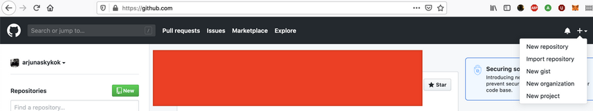
</p>

Type the repository name then click “Create repository” button.
<p align="center">
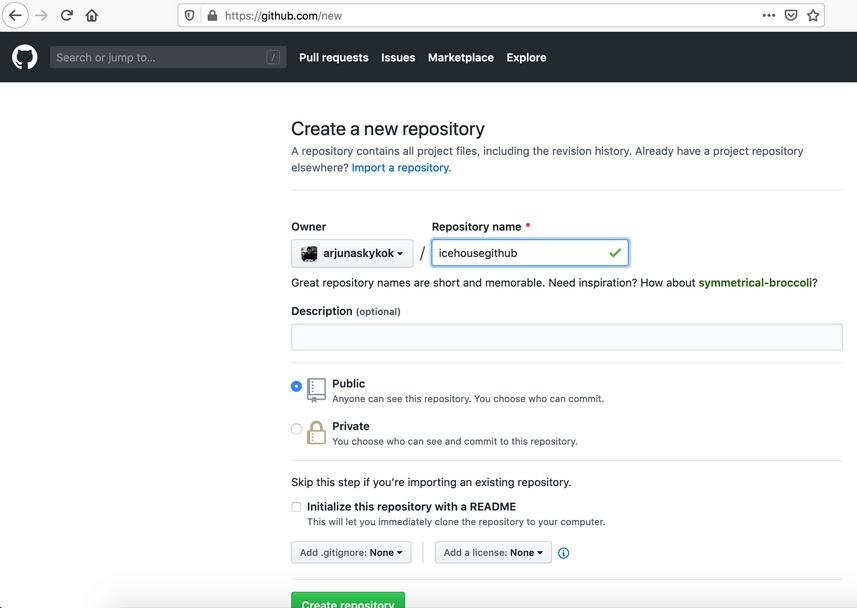
</p>

In order to upload our work in local repository to the remote repository, we can use HTTP or SSH way. HTTP way requires username and password. SSH uses private-public key cryptography. We will use the latter one.

Go to settings page. https://github.com/settings/profile
<p align="center">
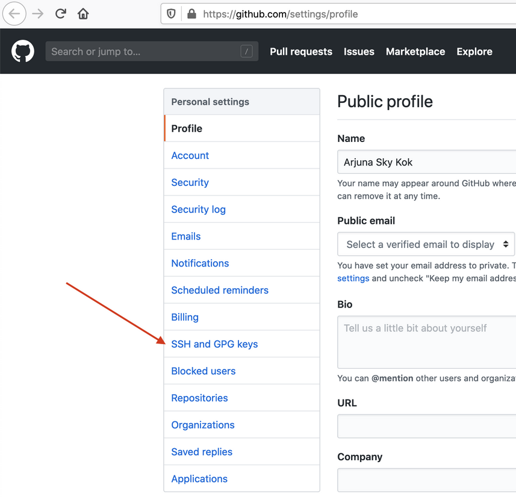
</p>

Click SSH and GPG keys.
<p align="center">
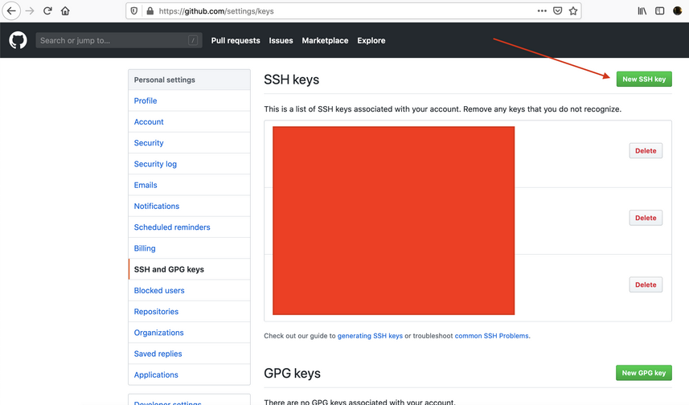
</p>

Click “New SSH key” button.

We have to generate our SSH key.
```
$ ssh-keygen -t rsa -b 4096 -C "your_email@example.com"
Generating public/private rsa key pair.
Enter file in which to save the key (/Users/xxx/.ssh/id_rsa): /tmp/id_rsa
Enter passphrase (empty for no passphrase):
Enter same passphrase again:
Your identification has been saved in /tmp/id_rsa.
Your public key has been saved in /tmp/id_rsa.pub.
The key fingerprint is:
SHA256:KgMA4KOf+F8+u8CeFjHBDQUyLigcMWLACzlTjM+1FeU your_email@example.com
The key's randomart image is:
+---[RSA 4096]----+
|OX=.o=oo.        |
|&o+o+ o.         |
|*Oo. +  E        |
|o++ +            |
|. .  o  S        |
| o +.  .         |
|. o =.o          |
| . ..B.          |
|  .o+ ++         |
+----[SHA256]-----+
```
The private key is id_rsa and the public key is id_rsa.pub.
```
$ cat id_rsa.pub
ssh-rsa AAAAB3NzaC1yc2EAAAADAQABAAACAQCcN5lAnI/JRLF8FAPHQQPyojSf4DFUNaSU/oPwBnU719MTCakb21lWSL6pz9nZ+bX31EufESTqSNMY8BHGtGSByNJ2QkXrdxudoLFhR7BgkAiwPLee6ohw55wGIZu7r8096GVyfGPGR+xcSyLNZoOAdqbp1yiIdXFnrrYwuPWly26wkKGMhtfl0of/rV8hNZqBxXmOdMYMArItOrTYh46hhqWZat24BrSYzHUz7gGRFu2A7IQ+/y9D9yQ5/pgGL/Q+kGAMpTWTD40p0xWQiCC2kB25efG4MgZht2Ci6LqVgVGjkCjFxpVgjfn2yTsl0/d60c5eGghmh/xceex9+IZPoE8N/WQDaZZYEg7h9kxZ1Z3+gie3kpuN7171OMj0D6M4OQoKDawuUR7Pt4Ad9o9wtFqAfIVeQYV9SZXUzl85SEskpuy4xxbvs16fz4fPzay5pvJrcolJooFP7Raqg9TPvrFmhzufAVhZhJ6l1ccO/01rQCX3h+TCpNAWgsdiNxzDs8c4Z4ki03gidOWjq1usQDlc90j/MTanuOmo4EvLaWgBw7LbjxPqQCcAe4hJYFUlaV3/kJXuX+gUtdYl9sklBSq9XQmqT2akUC4vtzpYMuBJ4GheCCN5YXpNyx7jswql6/EAvKQ171Dht6u/18hi98D/5RyVeBC422yJVrJirw== your_email@example.com
```
Paste the output into the SSH key field in GitHub.
<p align="center">
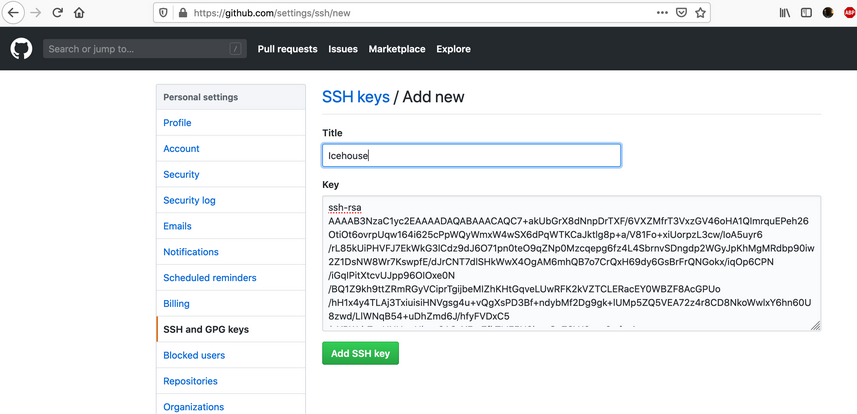
</p>

Click “Add SSH key” button. Then we would have the public key stored on GitHub.
<p align="center">
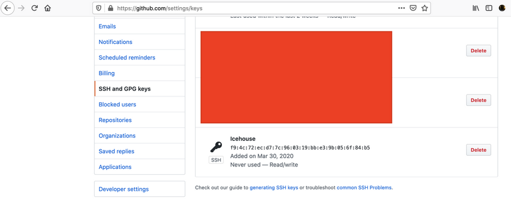
</p>

Then we can use our private-public key in connecting to remote repository. We need to load up our private key first.
```
$ ssh-add id_rsa
Identity added: id_rsa (your_email@example.com)
```
Let’s clone our remote repository. Change the remote repository to your remote repository.
```
$ git clone git@github.com:arjunaskykok/icehousegithub.git
Cloning into 'icehousegithub'...
warning: You appear to have cloned an empty repository.
```
To see our remote repository, we can use “remote”.
```
$ git remote
origin

$ cd icehousegithub/
```
Create cryptocurrency.txt. Add “Bitcoin” in the file.
```
$ cat cryptocurrency.txt
Bitcoin
```
Add the changes and commit it.
```
$ git add cryptocurrency.txt
$ git commit -m "Add Bitcoin."
```
At the current moment, the changes is in local repository. The changes is not in the remote repository.
```
$ git status
On branch master
Your branch is based on 'origin/master', but the upstream is gone.
  (use "git branch --unset-upstream" to fixup)

nothing to commit, working tree clean
```
To push the changes into the remote repository, we can use “push”. “origin” is the remote repository. “master” is the reference in the remote repository we want to update.
```
$ git push origin master
Enumerating objects: 3, done.
Counting objects: 100% (3/3), done.
Writing objects: 100% (3/3), 238 bytes | 238.00 KiB/s, done.
Total 3 (delta 0), reused 0 (delta 0)
To github.com:arjunaskykok/icehousegithub.git
 * [new branch]      master -> master
```
We can see our changes in the remote repository.

Go to your remote repository. In my case it is https://github.com/arjunaskykok/icehousegithub.
<p align="center">
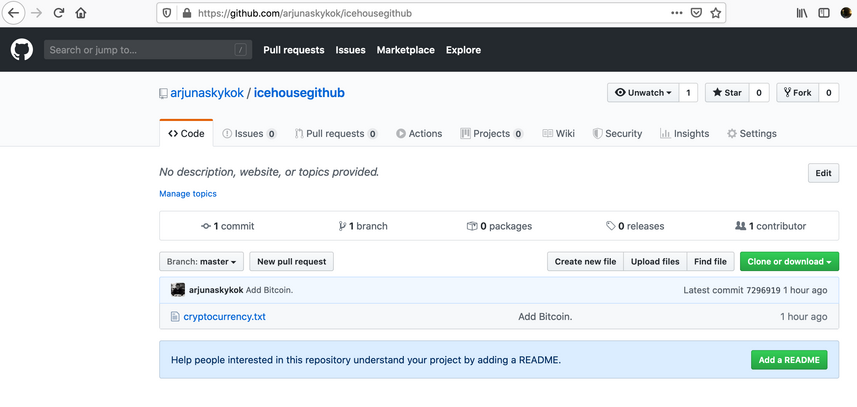
</p>

We can see the content of our cryptocurrency.txt by clicking cryptocurrency.txt.
<p align="center">
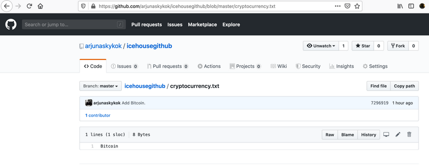
</p>

We can edit the file directly on GitHub by clicking pencil button in the right side of “Raw”, “Blame”, “History” buttons.

Add Ethereum after Bitcoin line.
<p align="center">

</p>

The commit it. Scroll to the bottom to find the interface to commit the changes.
<p align="center">
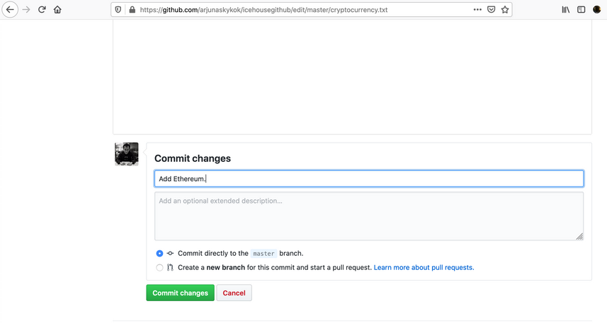
</p>

Click “Commit changes” button.
<p align="center">
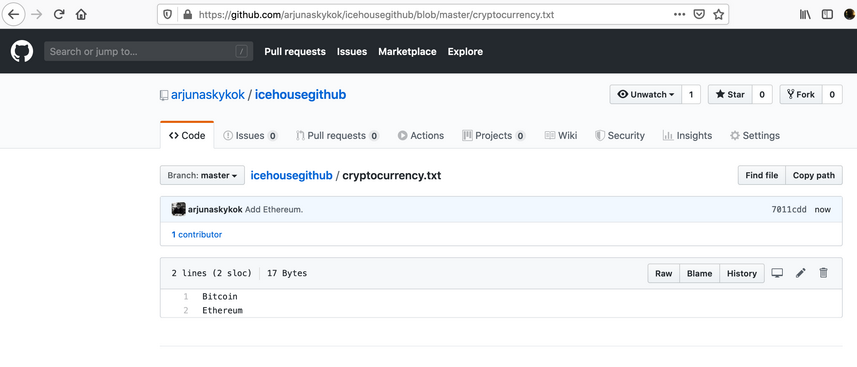
</p>

Our changes has been committed.

But our local repository is not aware yet of new changes (Ethereum). To update our local repository, we can use “pull” with “rebase” option.
```
$ git pull --rebase
remote: Enumerating objects: 5, done.
remote: Counting objects: 100% (5/5), done.
remote: Total 3 (delta 0), reused 0 (delta 0), pack-reused 0
Unpacking objects: 100% (3/3), done.
From github.com:arjunaskykok/icehousegithub
   7296919..7011cdd  master     -> origin/master
Updating 7296919..7011cdd
Fast-forward
 cryptocurrency.txt | 1 +
 1 file changed, 1 insertion(+)
Current branch master is up to date.

$ cat cryptocurrency.txt
Bitcoin
Ethereum
```

We can use other way to update our local repository. Add a new line (Bitcoin Cash) through GitHub interface. Then commit it through the interface.

To update our local repository, we can use “fetch”.
```
$ git fetch
remote: Enumerating objects: 5, done.
remote: Counting objects: 100% (5/5), done.
remote: Total 3 (delta 0), reused 0 (delta 0), pack-reused 0
Unpacking objects: 100% (3/3), done.
From github.com:arjunaskykok/icehousegithub
   7011cdd..926ba81  master     -> origin/master

```

However, we only download the changes from the remote repository. We haven’t merge to our master branch yet.
```
$ cat cryptocurrency.txt
Bitcoin
Ethereum
```
We can check the changes by checkout to “origin/master” branch.
```
$ git checkout origin/master
Note: checking out 'origin/master'.
```
You are in 'detached HEAD' state. You can look around, make experimental
changes and commit them, and you can discard any commits you make in this
state without impacting any branches by performing another checkout.

If you want to create a new branch to retain commits you create, you may
do so (now or later) by using -b with the checkout command again. Example:
```
  git checkout -b <new-branch-name>

HEAD is now at 926ba81 Add Bitcoin Cash.

$ cat cryptocurrency.txt
Bitcoin
Ethereum
Bitcoin Cash
```
Go back to our master.
```
$ git checkout master
```
Now when we are sure, we can merge the changes from “origin/master” to our “master”.
```
$  git merge origin/master
Updating 7011cdd..926ba81
Fast-forward
 cryptocurrency.txt | 1 +
 1 file changed, 1 insertion(+)
 ```

 ## Pull Request

Pull request is a part of workflow in Git. So we want to contribute to an opensource project. We fork the repository. Then we work on this forked repository. Later we can create a pull request and submit it to the opensource project on which we don’t have access. The owner of the opensource project can merge our pull request and integrate it to their opensource projects.

We will not use fork but we use branch. They are similar in pull request context.

Create a branch on which we will work on a new feature.
```
$ git checkout -b example_pull_request
Switched to a new branch 'example_pull_request'

$ git checkout -b example_pull_request
Switched to a new branch 'example_pull_request'
```
Add a new line in cryptocurrency.txt containing “Ripple” word.
```
$ cat cryptocurrency.txt
Bitcoin
Ethereum
Bitcoin Cash
Ripple
```
Add the changes and commit it.
```
$ git add .
$ git commit -m "Add Ripple."
[example_pull_request 26011fb] Add Ripple.
 1 file changed, 1 insertion(+)
```
Push this branch into our remote repository.
```
 git push origin example_pull_request
Enumerating objects: 5, done.
Counting objects: 100% (5/5), done.
Writing objects: 100% (3/3), 294 bytes | 147.00 KiB/s, done.
Total 3 (delta 0), reused 0 (delta 0)
remote:
remote: Create a pull request for 'example_pull_request' on GitHub by visiting:
remote:      https://github.com/arjunaskykok/icehousegithub/pull/new/example_pull_request
remote:
To github.com:arjunaskykok/icehousegithub.git
 * [new branch]      example_pull_request -> example_pull_request
```
Go to this url to create a pull request. https://github.com/arjunaskykok/icehousegithub/pull/new/example_pull_request

Change the remote repository to your remote repository in that url.

<p align="center">
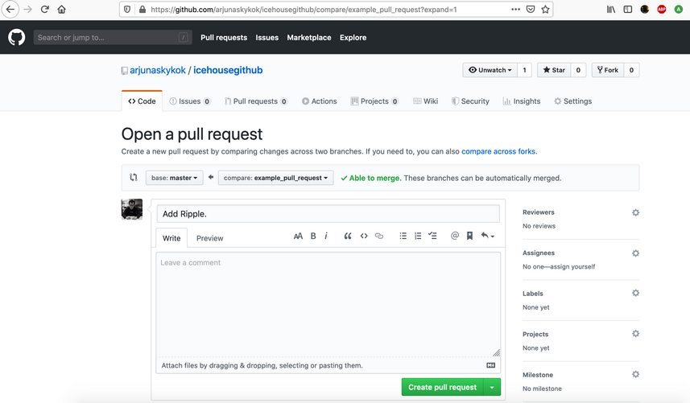
</p>

<p align="center">
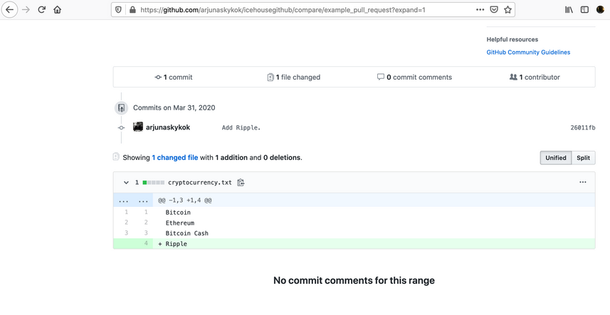
</p>

Click “Create pull request” button.

Our pull request has been created.
<p align="center">
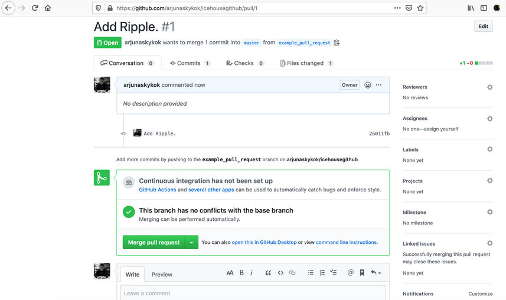
</p>

In real work, people seeing this pull request would be different compared to people creating the pull request.

Click “Merge pull request” then confirm it.

Now we have the pull request merged into the remote repository. We can check the content of the cryptocurrency.txt in remote repository.
<p align="center">
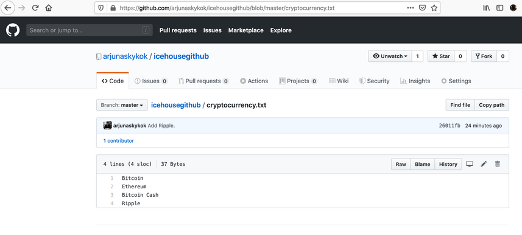
</p>