# Animation

Animation is moving and scaling views in a period of time.

## UIView.animate Method
Create a new single-view application.

Add this code:
```swift
let textField = UITextField(frame: CGRect(x: -100, y: 100, width: 200, height: 50))
textField.layer.backgroundColor = UIColor.gray.cgColor
self.view.addSubview(textField)

UIView.animate(withDuration: 0.8, delay: 0.3, options: [.curveEaseIn],
                animations: {
                    textField.center.x = self.view.bounds.midX
                },
                completion: nil
)
```

You put the text field in the x position of -100 (off the screen). Then you move the text field to the center of the screen in animations callback in UIView.animate method.

Run it and you would get this animation:
<p align="center">
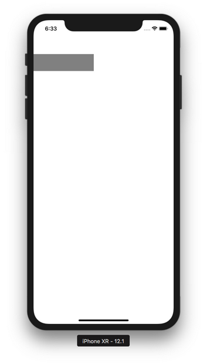
</p>

<p align="center">
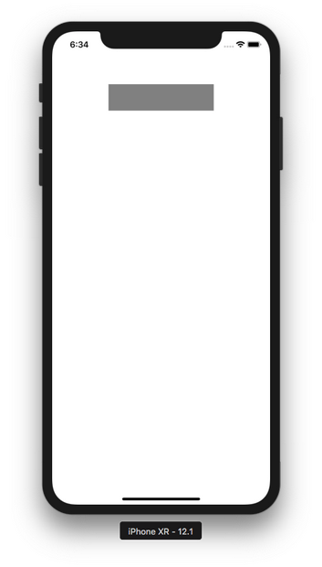
</p>

You can animate other property of the view, like alphaness.

Add this code:
```swift
let button = UIButton(frame: CGRect(x: 0, y: 200, width: 200, height: 50))
button.setTitle("Button", for: .normal)
button.backgroundColor = .green
button.center.x = self.view.bounds.midX
button.alpha = 0.0
self.view.addSubview(button)

UIView.animate(withDuration: 0.8, delay: 0.3, options: [],
                animations: {
                    button.alpha = 1.0
                },
                completion: nil
)
```

Here, you animate the alphaness of the button, from “button.alpha = 0.0” to “button.alpha = 1.0”. Run it and you will get this animation.
<p align="center">
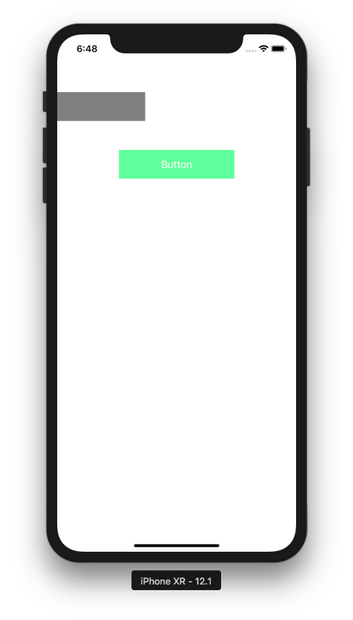
</p>

<p align="center">
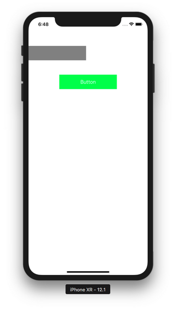
</p>

You can animate more than one property.

Add this code:
```swift
let imageView = UIImageView(frame: CGRect(x: 0, y: 350, width: 100, height: 100))
imageView.image = UIImage(named: "football")
imageView.center.x = self.view.bounds.midX
imageView.alpha = 0.0
self.view.addSubview(imageView)

UIView.animate(withDuration: 0.8,
                delay: 0.3,
                usingSpringWithDamping: 0.3,
                initialSpringVelocity: 0.9,
                options: [],
                animations: {
                    imageView.alpha = 1.0
                    imageView.center.y -= 50
                },
                completion: nil
)
```

<p align="center">
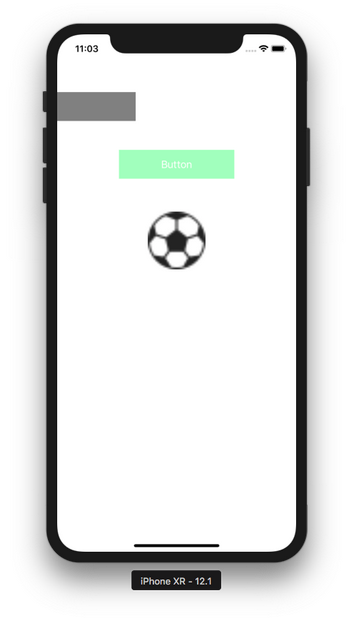
</p>

<p align="center">
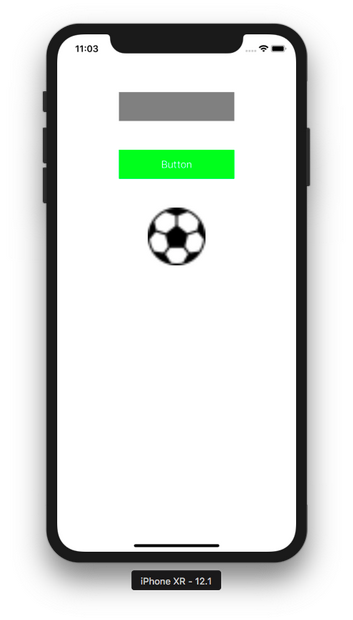
</p>

You can animate the appearance of the view from nothing to existence. It’s different from changing alphaness. You can use some animation style like curling (turning a page on the book).

Add an image view and make it a property of the class.
```swift
class ViewController: UIViewController {
    
    var swordView: UIImageView!
```

Add this code inside viewDidLoad method.
```swift
    swordView = UIImageView(frame: CGRect(x: 0, y: 450, width: 100, height: 100))
    swordView.image = UIImage(named: "swords")
    swordView.center.x = self.view.bounds.midX
    swordView.isHidden = true
    self.view.addSubview(swordView)
```
We hide the image view first with this statement:
```swift
swordView.isHidden = true
```
To animate the appearance of the view, you must put the animation code not inside viewDidLoad method, but viewDidAppear method.
```swift
    override func viewDidAppear(_ animated: Bool) {
        super.viewDidAppear(animated)
        
        UIView.transition(with: self.swordView,
                          duration: 2.5,
                          options: [.transitionCurlDown],
                          animations: {
                            self.swordView.isHidden = false
                          },
                          completion: nil
        )
    }
```

Run it and you will get this animation.
<p align="center">
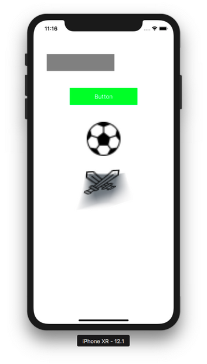
</p>

<p align="center">
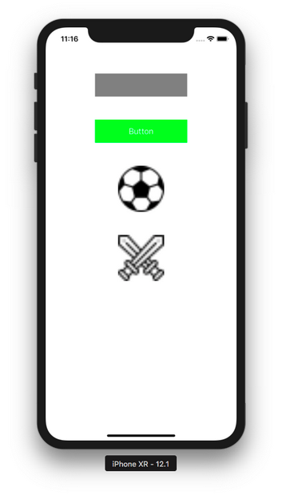
</p>

### Keyframe

You can also add keyframes when using animation. Keyframe is like a point time in animation. To understand the keyframe, let’s see it in action:
```swift
    let view1 = UIView(frame: CGRect(x: 0, y: 650, width: 100, height: 100))
    view1.backgroundColor = .red
    self.view.addSubview(view1)
    
    UIView.animateKeyframes(withDuration: 2, delay: 0.0, animations: {
    
        UIView.addKeyframe(withRelativeStartTime: 0.0, relativeDuration: 0.2, animations: {
            view1.center.x += 100
            view1.center.y += 10
        })
        
        UIView.addKeyframe(withRelativeStartTime: 0.2, relativeDuration: 0.5, animations: {
            view1.transform = CGAffineTransform(rotationAngle: -.pi / 8)
        })
        
        UIView.addKeyframe(withRelativeStartTime: 0.7, relativeDuration: 0.3, animations: {
            view1.center.x += 350
            view1.center.y -= 50
        })
        
    }, completion: nil)
```

You add animation inside UIView.addKeyframe method. WithRelativeStartTime parameter means the start time. 0.0 value means the very beginning. 1.0 value means the very end. RelativeDuration parameter means how long this keyframe lasts. 0.3 value means 30% of the whole animation duration.

This UIView.addKeyframe method must be wrapped inside UIView.animateKeyframes which accepts withDuration parameter. This is how long the entire animation lasts.

Run it and you will get this animation.
<p align="center">
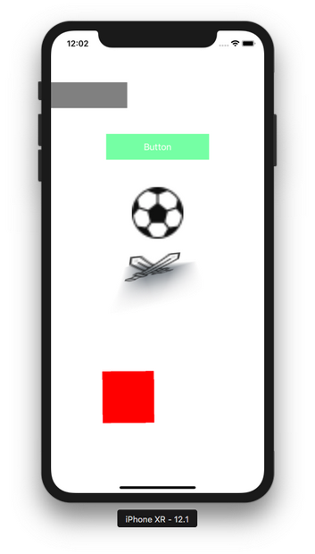
</p>

<p align="center">
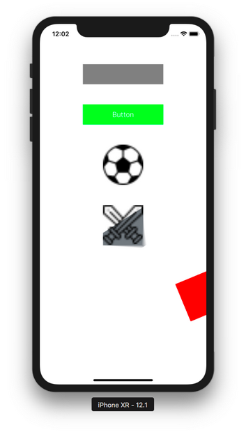
</p>

### Animating Constraints

When animating constraints, you can change the constant value of the constraint or activate/disactivate certain constraints, but there are some things that you need to set.

Create a new single-view application.

Let’s create views with their constraint. Add this code:
```swift
class ViewController: UIViewController {
    
    var view1Constraint1 : NSLayoutConstraint!
    var view1Constraint2 : NSLayoutConstraint!
    var view1Constraint3 : NSLayoutConstraint!
    var view1Constraint4 : NSLayoutConstraint!
    var view2Constraint1 : NSLayoutConstraint!
    var view2Constraint2 : NSLayoutConstraint!
    var view2Constraint3 : NSLayoutConstraint!
    var view2Constraint4 : NSLayoutConstraint!
    
    var view2 : UIView!

    override func viewDidLoad() {
        super.viewDidLoad()
        // Do any additional setup after loading the view, typically from a nib.
        
        let view1 = UIView()
        view1.translatesAutoresizingMaskIntoConstraints = false
        view1.backgroundColor = .red
        self.view.addSubview(view1)
        view1Constraint1 = view1.widthAnchor.constraint(equalToConstant: 100)
        view1Constraint2 = view1.heightAnchor.constraint(equalToConstant: 100)
        view1Constraint3 = view1.topAnchor.constraint(equalTo: self.view.topAnchor, constant: 100)
        view1Constraint4 = view1.centerXAnchor.constraint(equalTo: self.view.centerXAnchor)
        NSLayoutConstraint.activate([view1Constraint1, view1Constraint2, view1Constraint3, view1Constraint4])
        
        view2 = UIView()
        view2.translatesAutoresizingMaskIntoConstraints = false
        view2.backgroundColor = .blue
        self.view.addSubview(view2)
        view2Constraint1 = view2.widthAnchor.constraint(equalTo: view1.widthAnchor)
        view2Constraint2 = view2.heightAnchor.constraint(equalTo: view1.heightAnchor)
        view2Constraint3 = view2.topAnchor.constraint(equalTo: view1.bottomAnchor, constant: 100)
        view2Constraint4 = view2.centerXAnchor.constraint(equalTo: self.view.centerXAnchor)
        NSLayoutConstraint.activate([view2Constraint1, view2Constraint2, view2Constraint3, view2Constraint4])
        
        let button = UIButton()
        button.translatesAutoresizingMaskIntoConstraints = false
        button.setTitle("Button", for: .normal)
        button.setTitleColor(.blue, for: .normal)
        self.view.addSubview(button)
        let buttonConstraint1 = button.topAnchor.constraint(equalTo: self.view.topAnchor, constant: 50)
        let buttonConstraint2 = button.centerXAnchor.constraint(equalTo: self.view.centerXAnchor)
        NSLayoutConstraint.activate([buttonConstraint1, buttonConstraint2])
        button.addTarget(self, action: #selector(buttonTapped(_:)), for: .touchUpInside)
        
        self.view2.layoutIfNeeded()
    }
```

Then add buttonTapped method.
```swift
    @objc func buttonTapped(_ sender: UIButton) {
        self.view2Constraint3.constant = 400
        UIView.animate(withDuration: 5.8, delay: 0.0, options: [.curveEaseIn],
                       animations: {
                        self.view.layoutIfNeeded()
                       },
                       completion: nil
        )
    }
```

The key point is you change the constraint before calling UIView.animate method. Inside the buttonTapped method (specifically inside animations callback), you call layoutIfNeeded method.
```swift
self.view.layoutIfNeeded()
```

Run it and you will get this screen.
<p align="center">
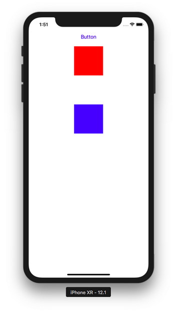
</p>

Click the button. The the blue view will move down.
<p align="center">
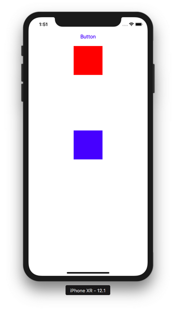
</p>

### Animation Presenting View Controller

You can also animate the presenting view controller process.

Create a new single-view application. 

Add this code inside viewDidLoad method.
```swift
        super.viewDidLoad()
        // Do any additional setup after loading the view, typically from a nib.
        let buttonView = UIView()
        buttonView.translatesAutoresizingMaskIntoConstraints = false
        buttonView.backgroundColor = .green
        self.view.addSubview(buttonView)
        
        NSLayoutConstraint.activate([
            buttonView.widthAnchor.constraint(equalToConstant: 100),
            buttonView.heightAnchor.constraint(equalToConstant: 100),
            buttonView.centerXAnchor.constraint(equalTo: self.view.centerXAnchor),
            buttonView.centerYAnchor.constraint(equalTo: self.view.centerYAnchor)
        ])
        
        let t1 = UITapGestureRecognizer(target: self, action: #selector(singleTap))
        buttonView.addGestureRecognizer(t1)
```

Add singleTap method.
```swift
    @objc func singleTap(_ t: UITapGestureRecognizer) {
        guard t.view != nil else { return }
        
        let presentedViewController = PresentedViewController()
        presentedViewController.transitioningDelegate = self
        present(presentedViewController, animated: true, completion: nil)
    }
```

Add a new file, PresentedViewController.swift. Make it subclass of ViewController. This is the code.
```swift
class PresentedViewController: UIViewController {

    override func viewDidLoad() {
        super.viewDidLoad()

        // Do any additional setup after loading the view.
        self.view.backgroundColor = .green
        let label = UILabel()
        label.text = "Presented View Controller"
        label.numberOfLines = 2
        label.font = UIFont(name: "Arial", size: 46)!
        label.translatesAutoresizingMaskIntoConstraints = false
        self.view.addSubview(label)
        NSLayoutConstraint.activate([
            label.topAnchor.constraint(equalTo: self.view.topAnchor, constant: 300),
            label.widthAnchor.constraint(equalTo: self.view.widthAnchor, constant: 0.8),
            label.centerXAnchor.constraint(equalTo: self.view.centerXAnchor)
        ])
        
        let button = UIButton()
        button.setTitle("Dismiss", for: .normal)
        button.titleLabel!.font = UIFont(name: "Arial", size: 23)!
        button.translatesAutoresizingMaskIntoConstraints = false
        self.view.addSubview(button)
        NSLayoutConstraint.activate([
            button.topAnchor.constraint(equalTo: self.view.topAnchor, constant: 100),
            button.centerXAnchor.constraint(equalTo: self.view.centerXAnchor)
        ])
        button.addTarget(self, action: #selector(buttonTapped(_:)), for: .touchUpInside)
        
    }
    
    @objc func buttonTapped(_ sender: UIButton) {
        self.presentingViewController?.dismiss(animated: true, completion: nil)
    }

}
```

Run it and you will get a green view on which you can click, then the presented view controller will appear. You can click “Dismiss” button on the presented view controller to dismiss it.

To animate the presenting presented view controller, make ViewController subclass of UIViewControllerTransitioningDelegate.

Then you need to implement two methods for presenting and dismissing view controller.
```swift
    func animationController(forPresented presented: UIViewController, presenting: UIViewController, source: UIViewController) -> UIViewControllerAnimatedTransitioning? {
        return PresentingAnimator()
    }
    
    func animationController(forDismissed dismissed: UIViewController) -> UIViewControllerAnimatedTransitioning? {
        return DismissingAnimator()
    }
```

You also need to implement two animator objects. The first one will be used when presenting view controller. The second one will be used when dismissing view controller.

Let’s create PresentingAnimator class. Add new file: PresentingAnimator.swift. This is the code.
```swift
class PresentingAnimator: NSObject, UIViewControllerAnimatedTransitioning {
    
    func transitionDuration(using transitionContext: UIViewControllerContextTransitioning?) -> TimeInterval {
        return 2.0
    }
    
    func animateTransition(using transitionContext: UIViewControllerContextTransitioning) {
        let containerView = transitionContext.containerView
        let presentedView = transitionContext.view(forKey: .to)!
        let presentingView = transitionContext.view(forKey: .from)!
        
        let originFrame = CGRect(x: presentingView.frame.midX - 50,
                                 y: presentingView.frame.midY - 50,
                                 width: 100,
                                 height: 100)
        
        let xScaleFactor = originFrame.width / presentedView.frame.width
        let yScaleFactor = originFrame.height / presentedView.frame.height
        
        presentedView.transform = CGAffineTransform(scaleX: xScaleFactor, y: yScaleFactor)
        
        containerView.addSubview(presentedView)
        
        UIView.animate(withDuration: 2.0,
                       delay: 0.0,
                       usingSpringWithDamping: 1,
                       initialSpringVelocity: 0.0,
                       animations: {
                         presentedView.transform = CGAffineTransform.identity
        }, completion: { _ in
            transitionContext.completeTransition(true)
        })
    }
    
}
```

This method determines how long the animation lasts.
```swift
    func transitionDuration(using transitionContext: UIViewControllerContextTransitioning?) -> TimeInterval {
        return 2.0
    }
```

Inside animateTransition method, you can get the containerView, presenting view controller, presented view controller.
```swift
        let containerView = transitionContext.containerView
        let presentedView = transitionContext.view(forKey: .to)!
        let presentingView = transitionContext.view(forKey: .from)!
```

You can get the frame of the view on the view controller with this way.
```swift
        let originFrame = CGRect(x: presentingView.frame.midX - 50,
                                 y: presentingView.frame.midY - 50,
                                 width: 100,
                                 height: 100)
```

You can get the scale between the view and the presented view with this way.
```swift
        let xScaleFactor = originFrame.width / presentedView.frame.width
        let yScaleFactor = originFrame.height / presentedView.frame.height
```

You make the presented view as small as the button view.
```swift
presentedView.transform = CGAffineTransform(scaleX: xScaleFactor, y: yScaleFactor)
```

You bring the presented view inside the container view.
```swift
containerView.addSubview(presentedView)
```

Then you animate the enlargement of the presented view.
```swift
        UIView.animate(withDuration: 2.0,
                       delay: 0.0,
                       usingSpringWithDamping: 1,
                       initialSpringVelocity: 0.0,
                       animations: {
                         presentedView.transform = CGAffineTransform.identity
        }, completion: { _ in
            transitionContext.completeTransition(true)
        })
```

You need to confirm the transition is over with this way:
```swift
transitionContext.completeTransition(true)
```

For the dismissing animation, this is the code for DismissingAnimator.swift file.
```swift
import UIKit

class DismissingAnimator: NSObject, UIViewControllerAnimatedTransitioning {
    
    func transitionDuration(using transitionContext: UIViewControllerContextTransitioning?) -> TimeInterval {
        return 2.0
    }
    
    func animateTransition(using transitionContext: UIViewControllerContextTransitioning) {
        let containerView = transitionContext.containerView
        let toView = transitionContext.view(forKey: .to)!
        let presentedView = transitionContext.view(forKey: .from)!
        
        let originFrame = CGRect(x: toView.frame.midX - 50,
                                 y: toView.frame.midY - 50,
                                 width: 100,
                                 height: 100)
        
        let xScaleFactor = originFrame.width / toView.frame.width
        let yScaleFactor = originFrame.height / toView.frame.height
        
        let scaleTransform = CGAffineTransform(scaleX: xScaleFactor, y: yScaleFactor)
        
        containerView.addSubview(toView)
        containerView.bringSubviewToFront(presentedView)
        
        UIView.animate(withDuration: 2.0,
                       delay: 0.0,
                       usingSpringWithDamping: 1,
                       initialSpringVelocity: 0.0,
                       animations: {
                         presentedView.transform = scaleTransform
        }, completion: { _ in
            transitionContext.completeTransition(true)
        })
    }
    
}
```

It’s similar to PresentingAnimator counterpart. You shrink the presented view controller with this way.
```swift
presentedView.transform = scaleTransform
```

Don’t forget to bring the presented view to the front.
```swift
containerView.bringSubviewToFront(presentedView)
```

Run it and you will get this screen.
<p align="center">
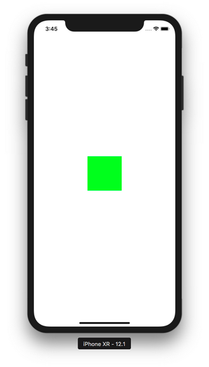
</p>

Tap the green view and you will get this animation.
<p align="center">
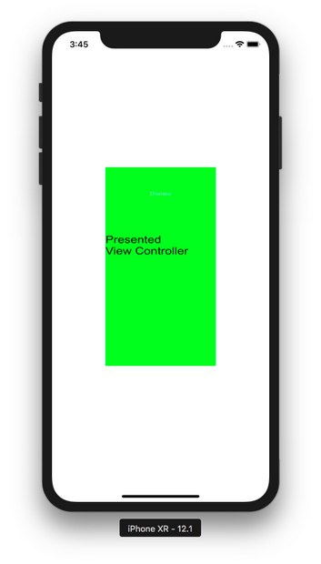
</p>

<p align="center">
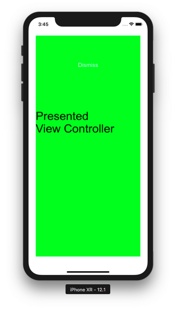
</p>

<p align="center">
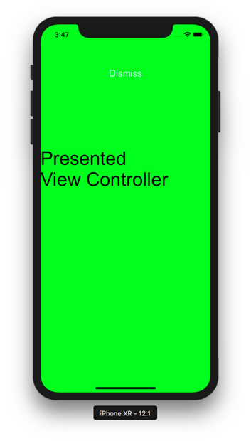
</p>

If you click “Dismiss” button, it will be shrunk.

# Optional Reading

https://developer.apple.com/documentation/uikit/uiviewpropertyanimator
https://developer.apple.com/documentation/uikit/uiviewcontrolleranimatedtransitioning

# Exercise

1. Recreate all previous examples but not with UIView.animate method. Use UIViewPropertyAnimator object.