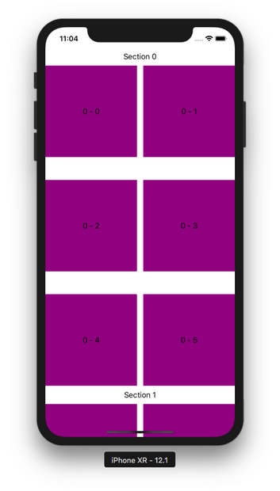
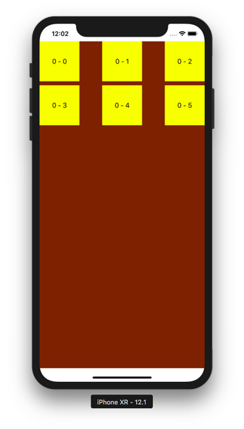

# CollectionView

CollectionView is like a table view but instead of going down with rows, it can go right with columns. Then for each row or column, it can have more than one item.

## Creating CollectionView by Code

Create a new single-view application.

Edit AppDelegate.swift. Make application method looks like this.
```swift
    func application(_ application: UIApplication, didFinishLaunchingWithOptions launchOptions: [UIApplication.LaunchOptionsKey: Any]?) -> Bool {
        // Override point for customization after application launch.
        let layout = UICollectionViewFlowLayout()
        layout.scrollDirection = .vertical
        layout.itemSize = CGSize(width: 200, height: 200)
        layout.headerReferenceSize = CGSize(width: 0, height: 40)
        layout.minimumLineSpacing = 50
        layout.minimumInteritemSpacing = 5
        let collectionViewController = CollectionViewController(collectionViewLayout: layout)
        self.window = self.window ?? UIWindow()
        self.window!.rootViewController = collectionViewController
        self.window!.makeKeyAndVisible()
        return true
    }
```

You created UICollectionFlowLayout instance.  This instance determines the scroll direction of collection view. It can also set the size of the item.

Then you constructed CollectionViewController which accepts UICollectionViewFlowLayout parameter.

We need to create CollectionViewController file. Create one and make it subclass of UICollectionViewController class.

This is the code for CollectionViewController.
```swift
private let reuseIdentifier = "Cell"
private let headerIdentifier = "Header"

class CollectionViewController: UICollectionViewController {

    override func viewDidLoad() {
        super.viewDidLoad()

        // Register cell classes
        self.collectionView!.register(UICollectionViewCell.self, forCellWithReuseIdentifier: reuseIdentifier)
        self.collectionView!.register(UICollectionReusableView.self, forSupplementaryViewOfKind: UICollectionView.elementKindSectionHeader, withReuseIdentifier: headerIdentifier)
        self.collectionView!.backgroundColor = .white
    }

    override func numberOfSections(in collectionView: UICollectionView) -> Int {
        return 2
    }

    override func collectionView(_ collectionView: UICollectionView, numberOfItemsInSection section: Int) -> Int {
        return 6
    }

    override func collectionView(_ collectionView: UICollectionView, cellForItemAt indexPath: IndexPath) -> UICollectionViewCell {
        let cell = collectionView.dequeueReusableCell(withReuseIdentifier: reuseIdentifier, for: indexPath)
    
        if cell.viewWithTag(1) == nil {
            let label = UILabel()
            label.tag = 1
            label.translatesAutoresizingMaskIntoConstraints = false
            cell.contentView.addSubview(label)
            NSLayoutConstraint.activate([label.centerXAnchor.constraint(equalTo: cell.contentView.centerXAnchor), label.centerYAnchor.constraint(equalTo: cell.contentView.centerYAnchor)])
        }
        let label = cell.viewWithTag(1) as! UILabel
        label.text = "\(indexPath.section) - \(indexPath.row)"
        cell.backgroundColor = .purple
            
        return cell
    }
    
    override func collectionView(_ collectionView: UICollectionView, viewForSupplementaryElementOfKind kind: String, at indexPath: IndexPath) -> UICollectionReusableView {
        let header = collectionView.dequeueReusableSupplementaryView(ofKind: UICollectionView.elementKindSectionHeader, withReuseIdentifier: headerIdentifier, for: indexPath)
        if header.viewWithTag(1) == nil {
            let label = UILabel()
            label.tag = 1
            label.translatesAutoresizingMaskIntoConstraints = false
            header.addSubview(label)
            NSLayoutConstraint.activate([label.centerXAnchor.constraint(equalTo: header.centerXAnchor), label.centerYAnchor.constraint(equalTo: header.centerYAnchor)])
        }
        let label = header.viewWithTag(1) as! UILabel
        label.text = "Section \(indexPath.section)"
        return header
    }
    
    override func collectionView(_ collectionView: UICollectionView, didSelectItemAt indexPath: IndexPath) {
        print(indexPath)
    }

}
```

If you created collection view by code, you need to register the collection view cell first with this code:
```swift
self.collectionView!.register(UICollectionViewCell.self, forCellWithReuseIdentifier: reuseIdentifier)
```

Then you constructed subviews inside the collection view cell and configure the collection view cell  in this method.
```swift
    override func collectionView(_ collectionView: UICollectionView, cellForItemAt indexPath: IndexPath) -> UICollectionViewCell {
        let cell = collectionView.dequeueReusableCell(withReuseIdentifier: reuseIdentifier, for: indexPath)
    
        if cell.viewWithTag(1) == nil {
            let label = UILabel()
            label.tag = 1
            label.translatesAutoresizingMaskIntoConstraints = false
            cell.contentView.addSubview(label)
            NSLayoutConstraint.activate([label.centerXAnchor.constraint(equalTo: cell.contentView.centerXAnchor), label.centerYAnchor.constraint(equalTo: cell.contentView.centerYAnchor)])
        }
        let label = cell.viewWithTag(1) as! UILabel
        label.text = "\(indexPath.section) - \(indexPath.row)"
        cell.backgroundColor = .purple
            
        return cell
    }
```

You constructed subviews of section header in this method.
```swift
    override func collectionView(_ collectionView: UICollectionView, viewForSupplementaryElementOfKind kind: String, at indexPath: IndexPath) -> UICollectionReusableView {
        let header = collectionView.dequeueReusableSupplementaryView(ofKind: UICollectionView.elementKindSectionHeader, withReuseIdentifier: headerIdentifier, for: indexPath)
        if header.viewWithTag(1) == nil {
            let label = UILabel()
            label.tag = 1
            label.translatesAutoresizingMaskIntoConstraints = false
            header.addSubview(label)
            NSLayoutConstraint.activate([label.centerXAnchor.constraint(equalTo: header.centerXAnchor), label.centerYAnchor.constraint(equalTo: header.centerYAnchor)])
        }
        let label = header.viewWithTag(1) as! UILabel
        label.text = "Section \(indexPath.section)"
        return header
    }
```

You intercepted the callback of clicking the collection view cell in this method.
```swift
    override func collectionView(_ collectionView: UICollectionView, didSelectItemAt indexPath: IndexPath) {
        print(indexPath)
    }
```

Run the application and you would get this screen.
<p align="center">

</p>

## Creating CollectionView by StoryBoard

Create a single-view application project.

In Main.storyboard, add collection view to the view controller.
<p align="center">

</p>

<p align="center">

</p>

Then add constraints to the collection view so it will be stretched to four directions.
<p align="center">

</p>

<p align="center">

</p>

You can configure the cell size. Click the collection view and you can configure the cell size in the right panel.
<p align="center">

</p>

You can also change the background color in that right panel.
<p align="center">

</p>

Add CollectionViewCell class. Make it subclass of UICollectionViewCell.

Then click collection view cell in the storyboard. Fill “Cell” to Identifier field. Add a label to the cell. Give center horizontal and vertical constraints. Control+Drag the label in the cell to CollectionViewCell and name the outlet variable “label”.
<p align="center">

</p>

Then edit ViewController.swift file. This is the code.
```swift
let reuseIdentifier = "Cell"

class ViewController: UIViewController, UICollectionViewDelegate, UICollectionViewDataSource {
    
    override func viewDidLoad() {
        super.viewDidLoad()
        // Do any additional setup after loading the view, typically from a nib.
        
    }
    
    func collectionView(_ collectionView: UICollectionView, numberOfItemsInSection section: Int) -> Int {
        return 6
    }
    
    func collectionView(_ collectionView: UICollectionView, cellForItemAt indexPath: IndexPath) -> UICollectionViewCell {
        let cell = collectionView.dequeueReusableCell(withReuseIdentifier: reuseIdentifier, for: indexPath) as! CollectionViewCell
        
        cell.backgroundColor = .yellow
        cell.label.text = "\(indexPath.section) - \(indexPath.row)"
        
        return cell
    }
}
```

Go back to the storyboard. Click collection view. Then in the right panel, drag dataSource and delegate to ViewController.

Run the application and you would get this screen.
<p align="center">

</p>

# Optional Reading

https://developer.apple.com/documentation/uikit/uicollectionview

# Exercise

1. Create a replica of iOS Photo application. No need functionalities. Only UI. Only showing images.