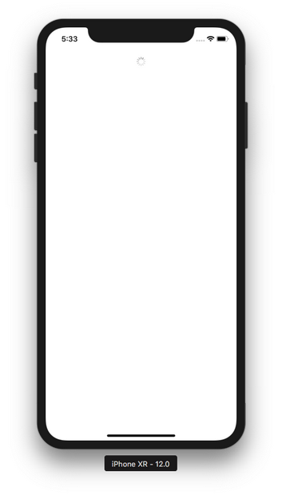

# Controls

In this document, you’ll learn about common controls in iOS, such as button, picker, progress bar, etc.

## UIActivityIndicatorView

This is like a spinner or a loading indicator to indicate something is going on.

Create a single view application. Add this code inside viewDidLoad method.
```swift
    let aiv = UIActivityIndicatorView(frame: CGRect(x: 0, y: 0, width: 0, height: 0))
    aiv.style = .gray
    aiv.startAnimating()
    aiv.translatesAutoresizingMaskIntoConstraints = false
    self.view.addSubview(aiv)
    let anchor_aiv_1 = aiv.topAnchor.constraint(equalTo: self.view.safeAreaLayoutGuide.topAnchor, constant: 20)
    let anchor_aiv_2 = aiv.centerXAnchor.constraint(equalTo: self.view.centerXAnchor)
    NSLayoutConstraint.activate([anchor_aiv_1, anchor_aiv_2])
```
Run it and you would get this screen.
<p align="center">

</p>

The startAnimating method must be called in order the activity indicator to spin.

## UIProgressView

This is a view to indicate the progress of a process.

Add this code.
```swift
    let pv = UIProgressView(frame: CGRect(x: 0, y: 0, width: 0, height: 0))
    pv.progressViewStyle = .default
    let progress = Progress()
    progress.totalUnitCount = 100
    progress.completedUnitCount = 35
    pv.observedProgress = progress
    //pv.setProgress(0.35, animated: true)
    pv.trackTintColor = .yellow
    pv.progressTintColor = .red
    pv.translatesAutoresizingMaskIntoConstraints = false
    self.view.addSubview(pv)
    let anchor_pv_1 = pv.topAnchor.constraint(equalTo: aiv.bottomAnchor, constant: 20)
    let anchor_pv_2 = pv.centerXAnchor.constraint(equalTo: self.view.centerXAnchor)
    let anchor_pv_3 = pv.widthAnchor.constraint(equalToConstant: 400)
    let anchor_pv_4 = pv.heightAnchor.constraint(equalToConstant: 20)
    NSLayoutConstraint.activate([anchor_pv_1, anchor_pv_2, anchor_pv_3, anchor_pv_4])
```
Run it and you would get this screen.
<p align="center">

</p>

To set the progress, you can use this way:
```swift
    let progress = Progress()
    progress.totalUnitCount = 100
    progress.completedUnitCount = 35
    pv.observedProgress = progress
```

The progress will be the completedUnitCount property divided by totalUnitCount property.

Or you can a simpler way:
```swift
    pv.setProgress(0.35, animated: true)
```

To change the color of progress bar and its background:
```swift
    pv.trackTintColor = .yellow
    pv.progressTintColor = .red
```
## UIPickerView

Picker view is like a select box.

You are going to create two picker views. The first one is text picker view. The second one is image picker view.

Add this code:
```swift
    // Picker Views
    let picker1 = UIPickerView(frame: CGRect(x: 0, y: 0, width: 0, height: 0))
    picker1.delegate = self
    picker1.translatesAutoresizingMaskIntoConstraints = false
    self.view.addSubview(picker1)
    let anchor_picker_1 = picker1.topAnchor.constraint(equalTo: pv.bottomAnchor, constant: 20)
    let anchor_picker_2 = picker1.centerXAnchor.constraint(equalTo: self.view.centerXAnchor)
    let anchor_picker_3 = picker1.widthAnchor.constraint(equalToConstant: 400)
    NSLayoutConstraint.activate([anchor_picker_1, anchor_picker_2, anchor_picker_3])
```

Then you must assign UIPickerViewDelegate and UIPickerViewDataSource to ViewController class like this:
```swift
class ViewController: UIViewController, UIPickerViewDelegate, UIPickerViewDataSource
```

Then add these methods:
```swift
    func numberOfComponents(in pickerView: UIPickerView) -> Int {
        return 2
    }

    func pickerView(_ pickerView: UIPickerView, numberOfRowsInComponent component: Int) -> Int {
        if component == 0 {
            return cryptocurrencyStrings.count
        } else {
            return deeplearningStrings.count
        }
    }
    
    func pickerView(_ pickerView: UIPickerView, titleForRow row: Int, forComponent component: Int) -> String? {
        if component == 0 {
            return cryptocurrencyStrings[row]
        } else {
            return deeplearningStrings[row]
        }
    }
    
    func pickerView(_ pickerView: UIPickerView, didSelectRow row: Int, inComponent component: Int) {
        print("Component: ", component)
        print("Row: ", row)
    }
```

You also need to add the string arrays as our data for this picker views inside the class definition so the string arrays will be the instance’s properties.
```swift
    let cryptocurrencyStrings = ["bitcoin", "ethereum", "monero", "filecoin"]
    let deeplearningStrings = ["tensorflow", "keras", "pytorch"]
```

Run it and you would get this screen.
<p align="center">

</p>

As you can see, we have two picker views side by side. We can say we have two columns. It is decided on this method:
```swift
    func numberOfComponents(in pickerView: UIPickerView) -> Int {
        return 2
    }
```

Column is what UIPickerView call component.

Then you need to answer the question how many rows there are in each column with this code:
```swift
    func pickerView(_ pickerView: UIPickerView, numberOfRowsInComponent component: Int) -> Int {
        if component == 0 {
            return cryptocurrencyStrings.count
        } else {
            return deeplearningStrings.count
        }
    }
```

Then you display the string row itself with this code:
```swift
    func pickerView(_ pickerView: UIPickerView, titleForRow row: Int, forComponent component: Int) -> String? {
        if component == 0 {
            return cryptocurrencyStrings[row]
        } else {
            return deeplearningStrings[row]
        }
    }
```

You can do some action when users spin the spinner with this code:
```swift
    func pickerView(_ pickerView: UIPickerView, didSelectRow row: Int, inComponent component: Int) {
        print("Component: ", component)
        print("Row: ", row)
    }
```

Let’s create a spinner composed of images. Add this code on the bottom of viewDidLoad method.
```swift
    let picker2 = UIPickerView(frame: CGRect(x: 0, y: 0, width: 0, height: 0))
    picker2.delegate = imagePickerDelegate
    picker2.translatesAutoresizingMaskIntoConstraints = false
    self.view.addSubview(picker2)
    let anchor_picker_4 = picker2.topAnchor.constraint(equalTo: picker1.bottomAnchor, constant: 20)
    let anchor_picker_5 = picker2.centerXAnchor.constraint(equalTo: self.view.centerXAnchor)
    let anchor_picker_6 = picker2.widthAnchor.constraint(equalToConstant: 200)
    NSLayoutConstraint.activate([anchor_picker_4, anchor_picker_5, anchor_picker_6])
```

Then you need to define imagePickerDelegate instance because you set the delegate property of picker2 to this instance. Declare it as a property of ViewController class.
```swift
class ViewController: UIViewController, UIPickerViewDelegate, UIPickerViewDataSource {
...
    let imagePickerDelegate = ImagePickerDelegate()
```

Then you need to define the ImagePickerDelegate class. You can define it after the definition of ViewController class.
```swift
class ImagePickerDelegate : NSObject, UIPickerViewDelegate, UIPickerViewDataSource {
    
    let imagePickerStrings = ["pencil", "coffee", "ruler"]
    
    func numberOfComponents(in pickerView: UIPickerView) -> Int {
        return 1
    }
    
    func pickerView(_ pickerView: UIPickerView, numberOfRowsInComponent component: Int) -> Int {
        return imagePickerStrings.count
    }
    
    func pickerView(_ pickerView: UIPickerView, didSelectRow row: Int, inComponent component: Int) {
        print("Component: ", component)
        print("Row: ", row)
    }
    
    func pickerView(_ pickerView: UIPickerView, rowHeightForComponent component: Int) -> CGFloat {
        return 100
    }
    
    func pickerView(_ pickerView: UIPickerView, viewForRow row: Int, forComponent component: Int, reusing view: UIView?) -> UIView {
        let imageName = imagePickerStrings[row]
        let image = UIImage(named: imageName)!
        let imageView = UIImageView()
        imageView.image = image
        imageView.sizeToFit()
        return imageView
    }
}
```

Everything looks familiar except for two last methods.
```swift
    func pickerView(_ pickerView: UIPickerView, rowHeightForComponent component: Int) -> CGFloat {
        return 100
    }

    func pickerView(_ pickerView: UIPickerView, viewForRow row: Int, forComponent component: Int, reusing view: UIView?) -> UIView {
        let imageName = imagePickerStrings[row]
        let image = UIImage(named: imageName)!
        let imageView = UIImageView()
        imageView.image = image
        imageView.sizeToFit()
        return imageView
    }
}
```

So instead of returning a string, you could return custom UIView. In this case we use UIImageView. Don’t forget to add three images into Assets.xcassets: pencil.png, coffee.png, and ruler.png. Our image is 64px x 64px so the default row height is not sufficient. So you can set the row height too with “pickerView(_ pickerView: UIPickerView, rowHeightForComponent component: Int) -> CGFloat” method.

Run it and you would get this screen.
<p align="center">

</p>

## UISearchBar

This is a search bar, a place where we can type the text to search something. Technically speaking, UISearchBar is a UITextField plus a lot of things.

Create a single view application and add this code inside viewDidLoad method:
```swift
    let searchBar = UISearchBar(frame: CGRect(x: 0, y: 0, width: 0, height: 0))
    searchBar.prompt = "Prompt"
    searchBar.searchFieldBackgroundPositionAdjustment = UIOffset(horizontal: 0, vertical: 20)
    searchBar.placeholder = "Placeholder"
    searchBar.barStyle = .black
    searchBar.barTintColor = .yellow
    searchBar.showsSearchResultsButton = true
    searchBar.setImage(UIImage(named: "coffee")!, for: .search, state: .normal)
    searchBar.showsScopeBar = true
    searchBar.scopeButtonTitles = ["Bitcoin", "Ethereum", "Monero"]
    searchBar.translatesAutoresizingMaskIntoConstraints = false
    //searchBar.delegate = self
    let anchor_searchBar_1 = searchBar.topAnchor.constraint(equalTo: self.view.safeAreaLayoutGuide.topAnchor)
    let anchor_searchBar_2 = searchBar.leadingAnchor.constraint(equalTo: self.view.leadingAnchor)
    let anchor_searchBar_3 = searchBar.trailingAnchor.constraint(equalTo: self.view.trailingAnchor)
    self.view.addSubview(searchBar)
    NSLayoutConstraint.activate([anchor_searchBar_1, anchor_searchBar_2, anchor_searchBar_3])
```

Run it and you would see this screen.
<p align="center">

</p>

This code is to set the prompt (the text above the search bar). To make sure the prompt does not overlap with the search bar, we must set the adjustment of the background position of search field.
```swift
    searchBar.prompt = "Prompt"
    searchBar.searchFieldBackgroundPositionAdjustment = UIOffset(horizontal: 0, vertical: 20)
```

This code is to configure the appearance of the search bar:
```swift
    searchBar.placeholder = "Placeholder"
    searchBar.barStyle = .black
    searchBar.barTintColor = .yellow
    searchBar.showsSearchResultsButton = true
    searchBar.setImage(UIImage(named: "coffee")!, for: .search, state: .normal)
```

The placeholder is the text that appears on the search field. The bar tint color is the background color of the search bar. The showsSearchResultsButton property is the attribute on which whether the search bar should display the result button which is located on the right side of the search field. The setImage method is to change the search icon of the search bar. By default the search icon is magnifying glass.

You can also add buttons below the search fields. They are called scope buttons. This is the code:
```swift
    searchBar.showsScopeBar = true
    searchBar.scopeButtonTitles = ["Bitcoin", "Ethereum", "Monero"]
```

To add callbacks for intercepting the typing text process, the clicking search button, the clicking of scope buttons, you need to make ViewController follows UISearchBarDelegate.
```swift
class ViewController: UIViewController, UISearchBarDelegate
```

Then make the delegate property of the search bar to ViewController instance class.
```swift
    searchBar.delegate = self
```

Then add some callbacks.
```swift
    func searchBarTextDidBeginEditing(_ searchBar: UISearchBar) {
        print("Mulai")
    }
    
    func searchBar(_ searchBar: UISearchBar, textDidChange searchText: String) {
        print("text did change")
        print(searchText)
    }
    
    func searchBar(_ searchBar: UISearchBar, shouldChangeTextIn range: NSRange, replacementText text: String) -> Bool {
        print("should change")
        print(range)
        print(text)
        return true
    }
    
    func searchBarSearchButtonClicked(_ searchBar: UISearchBar) {
        print(searchBar.text!)
    }
    
    func searchBar(_ searchBar: UISearchBar, selectedScopeButtonIndexDidChange selectedScope: Int) {
        print(selectedScope)
    }

    func searchBarResultsListButtonClicked(_ searchBar: UISearchBar) {
        print("result list")
    }
```

When we start typing text on the search field, this method will be called.
```swift
    func searchBarTextDidBeginEditing(_ searchBar: UISearchBar) {
        print("Mulai")
    }
```

When the text on the search field is changed, this method will be called.
```swift
    func searchBar(_ searchBar: UISearchBar, textDidChange searchText: String) {
        print("text did change")
        print(searchText)
    }
```

When you want to validate the text on the search field, you can use this method.
```swift
    func searchBar(_ searchBar: UISearchBar, shouldChangeTextIn range: NSRange, replacementText text: String) -> Bool {
        print("should change")
        print(range)
        print(text)
        return true
    }
```

If you want to do something when the searching action is done, this is the method:
```swift
    func searchBarSearchButtonClicked(_ searchBar: UISearchBar) {
        print(searchBar.text!)
    }
```

If you want to do something when the scope button is clicked, this is the method:
```swift
    func searchBar(_ searchBar: UISearchBar, selectedScopeButtonIndexDidChange selectedScope: Int) {
        print(selectedScope)
    }
```

If you want to do something when the result list button (the button which looked like an arrow pointed downward) is clicked, this is the method:
```swift
    func searchBarResultsListButtonClicked(_ searchBar: UISearchBar) {
        print("result list")
    }
```

## UISwitch

This is like a knob. It’s UI control for boolean value.

Add this code:
```swift
    let switchUi = UISwitch(frame: CGRect(x: 0, y: 0, width: 0, height: 0))
    switchUi.onTintColor = .red
    switchUi.tintColor = .yellow
    switchUi.thumbTintColor = .blue
    switchUi.setOn(true, animated: false)
    switchUi.translatesAutoresizingMaskIntoConstraints = false
    self.view.addSubview(switchUi)
    let anchor_switchUi_1 = switchUi.topAnchor.constraint(equalTo: searchBar.bottomAnchor, constant: 20)
    let anchor_switchUi_2 = switchUi.centerXAnchor.constraint(equalTo: self.view.centerXAnchor)
    NSLayoutConstraint.activate([anchor_switchUi_1, anchor_switchUi_2])
```

Run it and you would get this screen.
<p align="center">

</p>

You can configure the switch using this code:
```swift
    switchUi.onTintColor = .red
    switchUi.tintColor = .yellow
    switchUi.thumbTintColor = .blue
```

To add the callback when the switch is turned on and off, you can add this method:
```swift
    @objc func switchValueDidChange(_ sender: UISwitch) {
        if (sender.isOn) {
            print("is on")
        } else {
            print("is off")
        }
    }
```

Notice @obj keyword. Then you need to link a switch to this method with this code inside viewDidLoad method:
```swift
    switchUi.addTarget(self, action: #selector(switchValueDidChange(_:)), for: .valueChanged)
```

UISwitch has valueChanged event.

## UIStepper

This is a UI control to increase and decrease a value.

Add this code inside viewDidLoad method:
```swift
    let stepper = UIStepper(frame: CGRect(x: 0, y: 0, width: 0, height: 0))
    stepper.addTarget(self, action: #selector(stepperValueDidChange(_:)), for: .valueChanged)
    stepper.translatesAutoresizingMaskIntoConstraints = false
    self.view.addSubview(stepper)
    let anchor_stepper_1 = stepper.topAnchor.constraint(equalTo: switchUi.bottomAnchor, constant: 20)
    let anchor_stepper_2 = stepper.centerXAnchor.constraint(equalTo: self.view.centerXAnchor)
    NSLayoutConstraint.activate([anchor_stepper_1, anchor_stepper_2])
    
    let stepper2 = UIStepper(frame: CGRect(x: 0, y: 0, width: 0, height: 0))
    stepper2.addTarget(self, action: #selector(stepperValueDidChange(_:)), for: .valueChanged)
    stepper2.setDecrementImage(UIImage(named: "chevron-sign-left")!, for: .normal)
    stepper2.setIncrementImage(UIImage(named: "chevron-sign-right")!, for: .normal)
    stepper2.setDividerImage(UIImage(named: "vertical-ellipsis")!, forLeftSegmentState: .normal, rightSegmentState: .normal)
    stepper2.minimumValue = 1
    stepper2.maximumValue = 10
    stepper2.value = 5
    stepper2.stepValue = 1
    stepper2.setBackgroundImage(UIImage(named: "tent")!, for: .normal)
    stepper2.translatesAutoresizingMaskIntoConstraints = false
    self.view.addSubview(stepper2)
    let anchor_stepper_3 = stepper2.topAnchor.constraint(equalTo: stepper.bottomAnchor, constant: 20)
    let anchor_stepper_4 = stepper2.centerXAnchor.constraint(equalTo: self.view.centerXAnchor)
    NSLayoutConstraint.activate([anchor_stepper_3, anchor_stepper_4])
```

Then add this method:
```swift
    @objc func stepperValueDidChange(_ sender: UIStepper) {
        print(sender.value)
    }
```

Then add “chevron-sign-left.png”, “chevron-sign-right.png”, “tent.png”, “vertical-ellipsis.png” images to Assets.xcassets.

Run it and you would get this screen.
<p align="center">

</p>

To configure a stepper, you can use this code:
```swift
    stepper2.setDecrementImage(UIImage(named: "chevron-sign-left")!, for: .normal)
    stepper2.setIncrementImage(UIImage(named: "chevron-sign-right")!, for: .normal)
    stepper2.setDividerImage(UIImage(named: "vertical-ellipsis")!, forLeftSegmentState: .normal, rightSegmentState: .normal)
    stepper2.setBackgroundImage(UIImage(named: "tent")!, for: .normal)
```

The decrement image is the front image on the left side of the stepper. The increment image is the front image on the right side of the stepper. The divider image is the front image on the center side of the stepper. The background image is the background image of the stepper.

To configure the stepping action, you can use this code:
```swift
    stepper2.minimumValue = 1
    stepper2.maximumValue = 10
    stepper2.value = 5
    stepper2.stepValue = 1
```

The UIStepper also emits valueChanged event. We can add callback to the stepper when its value is being incremented or decremented. This is the callback:
```swift
    @objc func stepperValueDidChange(_ sender: UIStepper) {
        print(sender.value)
    }
```

Then you link this callback to the stepper with this code:
```swift
    stepper2.addTarget(self, action: #selector(stepperValueDidChange(_:)), for: .valueChanged)
```

## UIPageControl

This is a UI to indicate which page we are in now. It is composed of small bullets.

Add this code.
```swift
    let pageControl = UIPageControl(frame: CGRect(x: 0, y: 0, width: 0, height: 0))
    pageControl.numberOfPages = 4
    pageControl.currentPage = 2
    pageControl.pageIndicatorTintColor = .yellow
    pageControl.currentPageIndicatorTintColor = .blue
    pageControl.translatesAutoresizingMaskIntoConstraints = false
    self.view.addSubview(pageControl)
    let anchor_pageControl_1 = pageControl.topAnchor.constraint(equalTo: stepper2.bottomAnchor, constant: 20)
    let anchor_pageControl_2 = pageControl.centerXAnchor.constraint(equalTo: self.view.centerXAnchor)
    NSLayoutConstraint.activate([anchor_pageControl_1, anchor_pageControl_2])
    pageControl.addTarget(self, action: #selector(pageControlValueDidChange(_:)), for: .valueChanged)
```

Add this method for the page control’s callback:
```swift
    @objc func pageControlValueDidChange(_ sender: UIPageControl) {
        print(sender.currentPage)
    }
```

Run it and you would get this screen.
<p align="center">

</p>

To configure the page control, this is the code:
```swift
    pageControl.numberOfPages = 4
    pageControl.currentPage = 2
    pageControl.pageIndicatorTintColor = .yellow
    pageControl.currentPageIndicatorTintColor = .blue
```

numberOfPages decides how many bullets we have. currentPage decides which bullet is the active one. pageIndicatorTintColor is the color of non active bullets. currentPageIndicatorTintColor is the color of active bullet.

The callback when we change the active bullet is this method:
```swift
    @objc func pageControlValueDidChange(_ sender: UIPageControl) {
        print(sender.currentPage)
    }
```

Then we link the page control to this method with this code:
```swift
    pageControl.addTarget(self, action: #selector(pageControlValueDidChange(_:)), for: .valueChanged)
```

## UIDatePicker

This is a UI control to select date and/or time.

Add this code:
```swift
    let datePicker = UIDatePicker(frame: CGRect(x: 0, y: 0, width: 0, height: 0))
    datePicker.datePickerMode = .date
    var dateComponents = DateComponents()
    dateComponents.year = 2016
    dateComponents.month = 11
    dateComponents.day = 28
    let userCalendar = Calendar.current
    let dateTime = userCalendar.date(from: dateComponents)!
    datePicker.minimumDate = Date(timeIntervalSinceReferenceDate: dateTime.timeIntervalSinceReferenceDate)
    datePicker.timeZone = TimeZone(identifier: "Asia/Jakarta")!
    datePicker.locale = Locale(identifier: "id")
    datePicker.translatesAutoresizingMaskIntoConstraints = false
    self.view.addSubview(datePicker)
    let anchor_datePicker_1 = datePicker.topAnchor.constraint(equalTo: pageControl.bottomAnchor, constant: 20)
    let anchor_datePicker_2 = datePicker.centerXAnchor.constraint(equalTo: self.view.centerXAnchor)
    NSLayoutConstraint.activate([anchor_datePicker_1, anchor_datePicker_2])
    datePicker.addTarget(self, action: #selector(datePickerValueDidChange(_:)), for: .valueChanged)
```

Add this method also:
```swift
    @objc func datePickerValueDidChange(_ sender: UIDatePicker) {
        print(sender.date)
    }
```

Run it and you would get this screen.
<p align="center">

</p>

There are a couple of date picker mode. We use date picker mode. But you could also use time, dateAndTime, countDownTimer picker mode. You set the date picker mode with this code:
```swift
    datePicker.datePickerMode = .date
```

You could set minimum date which means you can not select lower date than this one with this code:
```swift
    var dateComponents = DateComponents()
    dateComponents.year = 2016
    dateComponents.month = 11
    dateComponents.day = 28
    let userCalendar = Calendar.current
    let dateTime = userCalendar.date(from: dateComponents)!
    datePicker.minimumDate = Date(timeIntervalSinceReferenceDate: dateTime.timeIntervalSinceReferenceDate)
```

You could also set the timezone and the locale with this code:
```swift
    datePicker.timeZone = TimeZone(identifier: "Asia/Jakarta")!
    datePicker.locale = Locale(identifier: "id")
```

You could add callback to the valueChanged event emitted by the date picker with this method:
```swift
    @objc func datePickerValueDidChange(_ sender: UIDatePicker) {
        print(sender.date)
    }
```

Then you must link the date picker with this callback.
```swift
    datePicker.addTarget(self, action: #selector(datePickerValueDidChange(_:)), for: .valueChanged)
```

Then when you change the date, you would get this output:
```
2019-03-18 04:03:15 +0000
```

The “+0000” string indicates this time is in UTC.

## UISlider

This is a UI control to slide a thumb on a line.

Add this code:
```swift
    let slider = UISlider(frame: CGRect(x: 0, y: 0, width: 0, height: 0))
    slider.minimumValue = 0
    slider.maximumValue = 100
    slider.setValue(40, animated: false)
    slider.minimumTrackTintColor = .blue
    slider.maximumTrackTintColor = .yellow
    slider.setThumbImage(UIImage(named: "space-shuttle")!, for: .normal)
    slider.setThumbImage(UIImage(named: "rocket")!, for: .highlighted)
    slider.minimumValueImage = UIImage(named: "earth")!
    slider.maximumValueImage = UIImage(named: "planets")!
    slider.translatesAutoresizingMaskIntoConstraints = false
    self.view.addSubview(slider)
    let anchor_slider_1 = slider.topAnchor.constraint(equalTo: datePicker.bottomAnchor, constant: 20)
    let anchor_slider_2 = slider.centerXAnchor.constraint(equalTo: self.view.centerXAnchor)
    let anchor_slider_3 = slider.leadingAnchor.constraint(equalTo: self.view.leadingAnchor)
    let anchor_slider_4 = slider.trailingAnchor.constraint(equalTo: self.view.trailingAnchor)
    NSLayoutConstraint.activate([anchor_slider_1, anchor_slider_2, anchor_slider_3, anchor_slider_4])
    slider.addTarget(self, action: #selector(sliderValueDidChange(_:)), for: .valueChanged)
```

Then add this method:
```swift
    @objc func sliderValueDidChange(_ sender: UISlider) {
        print(sender.value)
    }
```

You must also add “earth.png”, “planets.png”, “rocket.png”, space-shuttle.png” to Assets.xcassets.

Run it and you would get this screen:
<p align="center">

</p>

To configure the slider, you can use this code:
```swift
    slider.minimumValue = 0
    slider.maximumValue = 100
    slider.setValue(40, animated: false)
    slider.minimumTrackTintColor = .blue
    slider.maximumTrackTintColor = .yellow
    slider.setThumbImage(UIImage(named: "space-shuttle")!, for: .normal)
    slider.setThumbImage(UIImage(named: "rocket")!, for: .highlighted)
    slider.minimumValueImage = UIImage(named: "earth")!
    slider.maximumValueImage = UIImage(named: "planets")!
```

The setThumbImage method accepts “for” keyword parameter. You can give .normal value or .highlighted value. .normal mode means the thumb image is displayed when you don’t tap or drag the image. .highlighted mode means the thumb image is displayed when you tap or drag the image. So when you drag the thumb in the slider, the thumb image will change itself.

You can create a callback on which you can get the latest value of the slider with this code:
```swift
    @objc func sliderValueDidChange(_ sender: UISlider) {
        print(sender.value)
    }
```

Then you must link the slider with this callback with this code:
```swift
    slider.addTarget(self, action: #selector(sliderValueDidChange(_:)), for: .valueChanged)
```

## UISegmentedControl

This is a UI control which is like radio box.

Add this code:
```swift
    let segmentedControl = UISegmentedControl(items: [UIImage(named: "earth")!.withRenderingMode(.alwaysOriginal), "Mars", "Venus"])
    segmentedControl.translatesAutoresizingMaskIntoConstraints = false
    self.view.addSubview(segmentedControl)
    let anchor_segmentedControl_1 = segmentedControl.topAnchor.constraint(equalTo: slider.bottomAnchor, constant: 20)
    let anchor_segmentedControl_2 = segmentedControl.centerXAnchor.constraint(equalTo: self.view.centerXAnchor)
    NSLayoutConstraint.activate([anchor_segmentedControl_1, anchor_segmentedControl_2])
    segmentedControl.addTarget(self, action: #selector(segmentedControlValueDidChange(_:)), for: .valueChanged)
```

Then add this method:
```swift
    @objc func segmentedControlValueDidChange(_ sender: UISegmentedControl) {
        print(sender.selectedSegmentIndex)
    }
```

Run it and you would get this screen:
<p align="center">

</p>

To configure the segmented control, you use this code:
```swift
    let segmentedControl = UISegmentedControl(items: [UIImage(named: "earth")!.withRenderingMode(.alwaysOriginal), "Mars", "Venus"])
```

You can feed string or image to items parameter. For image, you must use withRenderingMode method with .alwaysOriginal value, otherwise the image would be all blue.

To add the callback when you click the image or the string in the segmented control, you use this method:
```swift
    @objc func segmentedControlValueDidChange(_ sender: UISegmentedControl) {
        print(sender.selectedSegmentIndex)
    }
```

Then you need to link the segmented control with the callback with this code:
```swift
    segmentedControl.addTarget(self, action: #selector(segmentedControlValueDidChange(_:)), for: .valueChanged)
```

## UIButton

This is a button. It can be clicked.

Add this code:
```swift
    let button1 = UIButton(type: .system)
    button1.tag = 1
    button1.setTitle("Button1", for: .normal)
    button1.setTitle("Button1 Highlighted", for: .highlighted)
    button1.translatesAutoresizingMaskIntoConstraints = false
    self.view.addSubview(button1)
    let anchor_button1_1 = button1.topAnchor.constraint(equalTo: self.view.safeAreaLayoutGuide.topAnchor, constant: 20)
    let anchor_button1_2 = button1.centerXAnchor.constraint(equalTo: self.view.centerXAnchor)
    NSLayoutConstraint.activate([anchor_button1_1, anchor_button1_2])
    button1.addTarget(self, action: #selector(buttonTapped(_:)), for: .touchUpInside)
```

UIButton initialization function accepts type parameter. We sent .system value to this parameter. It means we use a system style button, the ones used in navigation bars and toolbars. The tag property is used to differentiate buttons in the callback method. setTitle method is used to set the title of the button. Title can be set for normal mode or highlighted mode (when you are pressing the button).

Add this code:
```swift
    let button2 = UIButton(type: .infoDark)
    button2.tag = 2
    let button2Container = UIView(frame: CGRect(x: 0, y: 0, width: 0, height: 0))
    button2Container.backgroundColor = .green
    button2Container.translatesAutoresizingMaskIntoConstraints = false
    button2.showsTouchWhenHighlighted = true
    button2.translatesAutoresizingMaskIntoConstraints = false
    button2Container.addSubview(button2)
    self.view.addSubview(button2Container)
    let anchor_button2Container_1 = button2Container.topAnchor.constraint(equalTo: button1.bottomAnchor, constant: 20)
    let anchor_button2Container_2 = button2Container.centerXAnchor.constraint(equalTo: self.view.centerXAnchor)
    let anchor_button2Container_3 = button2Container.widthAnchor.constraint(equalToConstant: 30)
    let anchor_button2Container_4 = button2Container.heightAnchor.constraint(equalToConstant: 30)
    let anchor_button2_1 = button2.centerYAnchor.constraint(equalTo: button2Container.centerYAnchor)
    let anchor_button2_2 = button2.centerXAnchor.constraint(equalTo: button2Container.centerXAnchor)
    NSLayoutConstraint.activate([anchor_button2_1,
                                    anchor_button2_2,
                                    anchor_button2Container_1,
                                    anchor_button2Container_2,
                                    anchor_button2Container_3,
                                    anchor_button2Container_4])
    button2.addTarget(self, action: #selector(buttonTapped(_:)), for: .touchUpInside)
```

For this button, we use .infoDark type of button. The button is an image of “i” character in a circle. You created an instance of UIView which has a green background. Then you put the button on top of it. If showsTouchWhenHighlighted property is set to true, when you click the button, you will have a white glow spread in a circle. That’s why we put the button on top of green background.

Add this code:
```swift
    let button3 = UIButton(type: .custom)
    button3.tag = 3
    button3.setTitle("Button3", for: .normal)
    button3.setTitle("Button3 Highlighted", for: .highlighted)
    button3.setImage(UIImage(named: "earth")!, for: .normal)
    button3.setTitleColor(.blue, for: .normal)
    button3.setTitleColor(.cyan, for: .highlighted)
    button3.translatesAutoresizingMaskIntoConstraints = false
    self.view.addSubview(button3)
    let anchor_button3_1 = button3.topAnchor.constraint(equalTo: button2Container.bottomAnchor, constant: 20)
    let anchor_button3_2 = button3.centerXAnchor.constraint(equalTo: self.view.centerXAnchor)
    NSLayoutConstraint.activate([anchor_button3_1, anchor_button3_2])
    button3.addTarget(self, action: #selector(buttonTapped(_:)), for: .touchUpInside)
```

This is a custom button. No built-in style. You set the image with setImage method (the image will be on the left side of the label). You set the title with setTitle method. You set the color of the title with the setTitleColor method.

Add this code:
```swift
    let button4 = MyButton(type: .custom)
    button4.tag = 4
    button4.setTitle("Button4", for: .normal)
    button4.setBackgroundImage(UIImage(named: "ruler")!, for: .normal)
    button4.setTitleColor(.blue, for: .normal)
    button4.setTitleColor(.red, for: .highlighted)
    button4.translatesAutoresizingMaskIntoConstraints = false
    button4.contentEdgeInsets = UIEdgeInsets(top: 40, left: 40, bottom: 40, right: 40)
    self.view.addSubview(button4)
    let anchor_button4_1 = button4.topAnchor.constraint(equalTo: button3.bottomAnchor, constant: 20)
    let anchor_button4_2 = button4.centerXAnchor.constraint(equalTo: self.view.centerXAnchor)
    NSLayoutConstraint.activate([anchor_button4_1, anchor_button4_2])
    button4.addTarget(self, action: #selector(buttonTapped(_:)), for: .touchUpInside)
```

This is a subclass of button. You set the background image with setBackgroundImage method. Background image of a button is different than the image of a button. The image of a button is the image on the left side of the label of the button. The background image of a button is the background image of a button. So the image and the label are put on top of the background image.

Add the callback method:
```swift
    @objc func buttonTapped(_ sender: UIButton) {
        print(sender.tag)
    }
```

Then create a new file (Cocoa Touch class), named MyButton.swift. Add this method inside MyButton class:
```swift
    override func titleRect(forContentRect contentRect: CGRect) -> CGRect {
        let result = super.titleRect(forContentRect: contentRect)
        return result.insetBy(dx: -10, dy: -10)
    }
```

This method is to increase the title rectangular size. Other similar methods are imageRect, contentRect, backgroundRect.

Run it and you would get this screen.
<p align="center">

</p>

Try to press each button. They will change the image or the font color.

## Create UI Controls on StoryBoard

You could create all UI controls in StoryBoard. If you want to add UISwitch, just find UISwitch in UI library.
<p align="center">

</p>

Drag it to the Story Board.You can configure the switch from the right panel.

To get the reference of this UISwitch instance in the story board, you can Control Drag from the UISwitch instance to the code (ViewController class code). You can open both storyboard and the code interface side by side. While the story board interface is still opened, you open the code interface.
<p align="center">

</p>

<p align="center">

</p>

Then you Control Drag from UISwith to the code like in this screenshot.
<p align="center">

</p>

<p align="center">

</p>

You add the callback to UISwitch with the same way (Control Drag). But the type of connection should be Action, not Outlet. Then you set the event as “Value Changed”. 
<p align="center">

</p>

<p align="center">

</p>

<p align="center">

</p>

You could also add a button, and add its callback the same way. The only thing difference is for the button, the callback accepts “Touch Up Inside” event.

You could also add a picker view the same way. But you can not add the callback by Control Dragging because a picker view uses delegate. So you have to write all required callbacks manually. Same things happen to a search bar.

# Optional Readings

https://developer.apple.com/documentation/uikit/uibutton
https://developer.apple.com/documentation/uikit/uisegmentedcontrol 
https://developer.apple.com/documentation/uikit/uislider
https://developer.apple.com/documentation/uikit/uidatepicker
https://developer.apple.com/documentation/uikit/uipagecontrol
https://developer.apple.com/documentation/uikit/uistepper
https://developer.apple.com/documentation/uikit/uiswitch
https://developer.apple.com/documentation/uikit/uisearchbar
https://developer.apple.com/documentation/uikit/uiprogressview
https://developer.apple.com/documentation/uikit/uiactivityindicatorview

# Exercises

1. Create a screen like this on which you have a progress view, a stepper, a picker view, a switch, a button, and a label.
<p align="center">

</p>