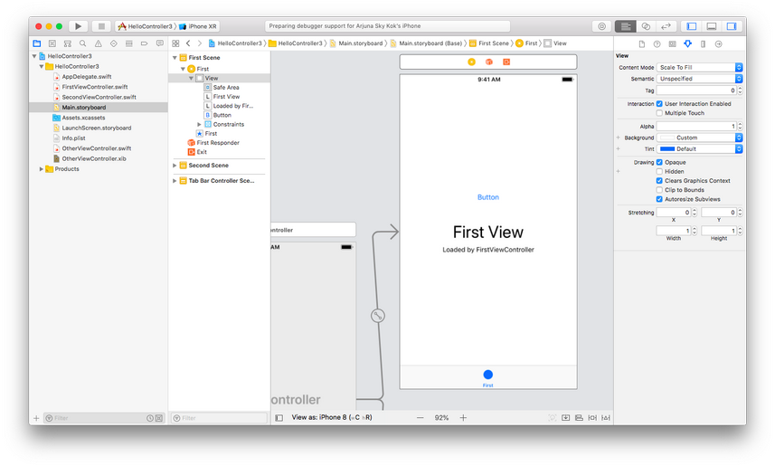
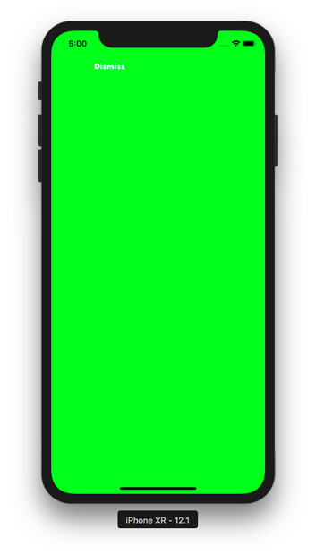
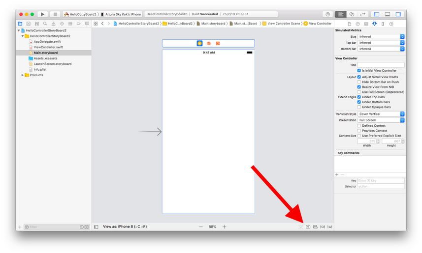
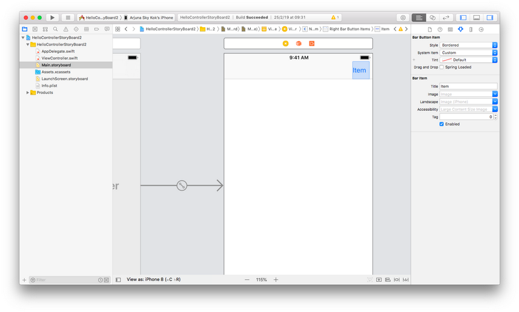
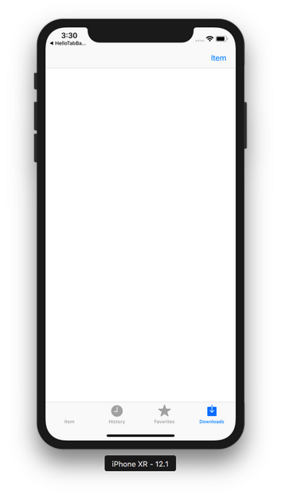
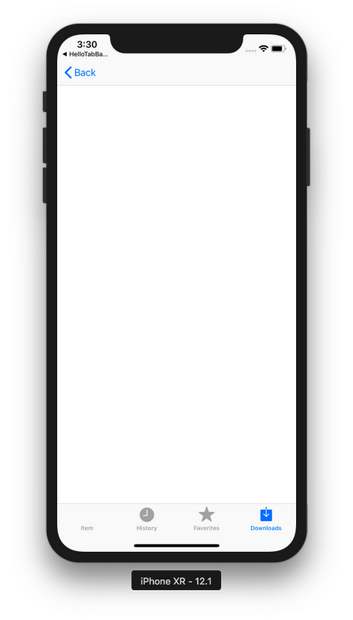

# View Controller

Controller is an object that manages the transition from one view to another view.

Controller can be divided into:
1. container controller
2. presentation controller

## Presentation Controller

Create a single-view application. Then add a new file. Choose Cocoa Touch Class. Then name the file OtherViewController. Make it subclass of UIViewController. Check “Also Create A XIB File”.
<p align="center">

</p>

Having XIB file means you can have a way to design this specific view controller. Click OtherViewController.xib. Change the background of the view to green. Add a label. Finally add a button. Change the label of that button to ‘Dismiss’.
<p align="center">

</p>

Add a callback to this button in OtherViewController.swift.
```swift
    @IBAction func dismiss(_ sender: Any?) {
        self.delegate?.getStringFromOtherViewController(string: "Hello from OtherViewController")
        //self.presentingViewController?.dismiss(animated: true)
    }
```

Now you need to define the delegate property.
```swift
    var string : String?
    weak var delegate : OtherViewControllerDelegate?
```

The string variable is a way for a presenting controller to send data to the presented controller. The presenting controller file is ViewController.swift. The presented controller file is OtherViewController.swift.

You also need to define the delegate class. Do it above OtherViewController class definition.
```swift
protocol OtherViewControllerDelegate : class {
    func getStringFromOtherViewController(string: String!)
}
```

In viewDidLoad method, add this code:
```swift
print(string!)
```

This is to demonstrate that you can send data from the presenting controller to presented controller.

In ViewController.swift, you define this method:
```swift
    func getStringFromOtherViewController(string: String!) {
        print(string)
        self.dismiss(animated: true)
    }
```

Printing string in this method is to demonstrate that you can send data from presented view controller to presenting view controller. The dismiss method will destroy the presented controller.

Add OtherViewControllerDelegate delegate class to ViewController class.
```swift
class ViewController: UIViewController, OtherViewControllerDelegate
```

Then add a button to ViewController class. Change the label of the button to ‘Present’. You can do that in Main.storyboard.
<p align="center">

</p>

Add a callback to this button.
```swift
    @IBAction func present(_ sender: Any?) {
        let ovc = OtherViewController()
        ovc.string = "Hello from ViewController"
        ovc.delegate = self
        //ovc.modalTransitionStyle = .coverVertical
        //ovc.modalTransitionStyle = .crossDissolve
        //ovc.modalTransitionStyle = .partialCurl
        ovc.modalTransitionStyle = .flipHorizontal
        self.present(ovc, animated: true)
    }
```

You send the string from the presenting controller to the presented controller with this code:
```swift
ovc.string = "Hello from ViewController"
```

Then you set the delegate of this controller object to ViewController class with this code:
```swift
ovc.delegate = self
```

There are 4 types of transitions when you are presented with OtherViewController:
```swift
    //ovc.modalTransitionStyle = .coverVertical
    //ovc.modalTransitionStyle = .crossDissolve
    //ovc.modalTransitionStyle = .partialCurl
    ovc.modalTransitionStyle = .flipHorizontal
```

You can try each one to see the transition.

Finally you present OtherViewController with this code:
```swift
self.present(ovc, animated: true)
```

Run it and you would get this screen:
<p align="center">

</p>

If you click “Present” button, you would get this screen:
<p align="center">

</p>

If you click “Dismiss” button, the green view controller would be destroyed and you are transferred back to the first view controller.

You also get this output:
```
Hello from ViewController
Optional("Hello from OtherViewController")
```

## UITabBarController

Create a single view application. Then add 3 files. Name them TabItem1ViewController, TabItem2ViewController, TabItem3ViewController. Check also “Also Create A XIB File” for all of them. Set different background for each of them.

Then edit AppDelegate.swift.

Inside application method, wipe all the content and use this code:
```swift
    self.window = self.window ?? UIWindow()
    let tab1 = TabItem1ViewController()
    tab1.tabBarItem = UITabBarItem(tabBarSystemItem: .contacts, tag: 0)
    let tab2 = TabItem2ViewController()
    tab2.tabBarItem = UITabBarItem(title: "Game", image: UIImage(named: "football")!, tag: 1)
    let tab3 = TabItem3ViewController()
    tab3.tabBarItem = UITabBarItem(tabBarSystemItem: .bookmarks, tag: 2)
    let tabBarController = UITabBarController()
    tabBarController.delegate = self
    tabBarController.viewControllers = [tab1, tab2, tab3]
    tabBarController.selectedIndex = 0
    self.window!.rootViewController = tabBarController
    self.window!.makeKeyAndVisible()
    return true
```

You get the access to the window by using this code:
```swift
self.window = self.window ?? UIWindow()
```

The “??” is to check whether self.window is nil or not. If it is not nil, the self.window is returned as is. If it is nil, the statement will create a new UIWindow instance and set it to self.window.

Then you created the first view controller. You also set the tab bar item for this controller in this tab bar controller. You used “contacts” system item icon. You set the tag also which will be useful in the selecing tab bar item callback.
```swift
    let tab1 = TabItem1ViewController()
    tab1.tabBarItem = UITabBarItem(tabBarSystemItem: .contacts, tag: 0)
```

Then you created the second view controller. This time you use custom image and title. Don’t forget to add “football.png” image in Assets.xcassets.
```swift
    let tab2 = TabItem2ViewController()
    tab2.tabBarItem = UITabBarItem(title: "Game", image: UIImage(named: "football")!, tag: 1)
```

Then you created the third view controller.
```swift
    let tab3 = TabItem3ViewController()
    tab3.tabBarItem = UITabBarItem(tabBarSystemItem: .bookmarks, tag: 2)
```

Then you created a tab bar controller and add all of these three view controllers to this tab bar controller. You set the selected index to be the first controller. You also set the delegate property of this tab bar controller to AppDelegate class.
```swift
    tabBarController.delegate = self
    tabBarController.viewControllers = [tab1, tab2, tab3]
    tabBarController.selectedIndex = 0
```

Then you set this tab bar controller as the window root view controller. It means ViewController.swift will not be used anymore.
```swift
    self.window!.rootViewController = tabBarController
    self.window!.makeKeyAndVisible()
```

You also need to set UITabBarControllerDelegate to AppDelegate class.
```swift
class AppDelegate: UIResponder, UIApplicationDelegate, UITabBarControllerDelegate
```

Then add this callback when user selects tab bar item.
```swift
    func tabBarController(_ tabBarController: UITabBarController, didSelect viewController: UIViewController) {
        print(viewController.tabBarItem.tag)
    }
```

Run it and you would get this screen.
<p align="center">


</p>

When you select other tab bar item, you would get this output:
```
1
```

Create a new application. But this time don’t choose single-view application. But choose tabbar application.
<p align="center">

</p>

Create a new file. Name it OtherViewController.swift. Check “Also Create A XIB file”. Make it subclass of UIViewController.

Change its background to yellow color. Add a button. Name it dismiss. Add a callback to this button.
```swift
    @IBAction func dismiss(_ sender: Any?) {
        self.presentingViewController?.dismiss(animated: true)
    }
```

To get the presenting view controller from the presented view controller, you use presentingViewController property. Then you dismiss the presented view controller by using dismiss method from presenting view controller object.
<p align="center">

</p>

Then in Main.storyboard, you add a button in the first view controller.
<p align="center">

</p>

Then add a callback for this button. Add this method in FirstViewController.swift.
```swift
    @IBAction func present(_ sender: Any?) {
        let ovc = OtherViewController(nibName: nil, bundle: nil)
        ovc.modalPresentationStyle = .overCurrentContext
        self.definesPresentationContext = true
        self.present(ovc, animated: true)
    }
```

Run it and you would get this screen.
<p align="center">

</p>

Click the “Button” button and you would be presented this view controller:
<p align="center">

</p>

Notice the presented view controller (yellow controller) does not cover tab bar part. Click dismiss to go back to first view controller.

But if you change the presenting view controller code to this code:
```swift
    @IBAction func present(_ sender: Any?) {
        let ovc = OtherViewController(nibName: nil, bundle: nil)
        //ovc.modalPresentationStyle = .overCurrentContext
        //self.definesPresentationContext = true
        self.present(ovc, animated: true)
    }
```

then when you click the “Button” button again (of course, you must rerun the application), the presented view controller will cover everything (including the tab bar).
<p align="center">

</p>

## UINavigationController

Navigation controller is a stack controller.

Create a single-view application. Then create 4 new files. All of them must be subclass of UIViewController. Check “Also Create A XIB File” for all files.

Name them Controller1ViewController, Controller2ViewController, Controller3ViewController, Controller4ViewController. For each view controller, give it a different background color. Add a label with different text for each view controller.

In AppDelegate.swift, replace the content of application method with this code:
```swift
    self.window = self.window ?? UIWindow()
    let controller1ViewController = Controller1ViewController()
    let navigationController = UINavigationController(rootViewController: controller1ViewController)
    self.window!.rootViewController = navigationController
    self.window!.makeKeyAndVisible()
    return true
```

You set Controller1ViewController as the initial view controller for navigation controller. Of course, you set the navigation controller as the root view controller.

The definition of Controller1ViewController is this code:
```swift
    override func viewDidLoad() {
        super.viewDidLoad()
        self.title = "Number 1"
        let rightBarButtonItem = UIBarButtonItem(barButtonSystemItem: .done, target: self, action: #selector(rightBarButtonItemClicked(_:)))
        self.navigationItem.rightBarButtonItem = rightBarButtonItem
        
        self.navigationController?.setToolbarHidden(true, animated: true)
    }

    @objc func rightBarButtonItemClicked(_ sender: Any?) {
        self.navigationController?.pushViewController(Controller2ViewController(), animated: true)
    }
```

You set the right bar button item of navigation item. For this controller, you use done bar button system item. Then add a callback to this right bar button item. Inside the callback you push a view controller (Controller2ViewController) to navigation controller with pushViewController method. Also, you hide the toolbar.

The definition of Controller2ViewController is this code:
```swift
    let titleView = UIView(frame: CGRect(x: 0, y: 0, width: 30, height: 30))
    
    override func viewDidLoad() {
        super.viewDidLoad()

        self.title = "Number 2"
        self.titleView.backgroundColor = .yellow
        self.navigationItem.titleView = self.titleView
        let rightBarButtonItem = UIBarButtonItem(image: UIImage(named: "football")!, style: .plain, target: self, action: #selector(rightBarButtonItemClicked(_:)))
        self.navigationItem.rightBarButtonItem = rightBarButtonItem
        
        self.navigationController?.setToolbarHidden(true, animated: true)
    }

    @objc func rightBarButtonItemClicked(_ sender: Any?) {
        self.navigationController?.pushViewController(Controller3ViewController(), animated: true)
    }
```

In Controller2ViewController, you add a custom view (UIView with yellow background) as a title by modifying titleView property of the controller. Then you set the right bar button item as usual. But this time you use custom image for the button. You also need to add “football.png” picture to Assets.xcassets. In the callback for this right bar button item, you push Controller3ViewController to navigation controller.

The definition of Controller3ViewController is this code:
```swift
    let view1 = UIView(frame: CGRect(x: 0, y: 0, width: 30, height: 30))
    
    override func viewDidLoad() {
        super.viewDidLoad()

        self.title = "Number 3"
        self.view1.backgroundColor = .green
        let tap = UITapGestureRecognizer(target: self, action: #selector(tapAction))
        self.view1.addGestureRecognizer(tap)
        let rightBarButtonItem = UIBarButtonItem(customView: view1)
        self.navigationItem.rightBarButtonItem = rightBarButtonItem
        
        let barButtonItem1 = UIBarButtonItem(barButtonSystemItem: .action, target: self, action: #selector(barButtonItemClicked(_:)))
        let barButtonItemSpace = UIBarButtonItem(barButtonSystemItem: .flexibleSpace, target: self, action: nil)
        let barButtonItem2 = UIBarButtonItem(barButtonSystemItem: .camera, target: self, action: #selector(barButtonItemClicked(_:)))
        let items = [barButtonItemSpace, barButtonItem1, barButtonItemSpace, barButtonItem2, barButtonItemSpace]
        self.setToolbarItems(items, animated: true)
        self.navigationController?.setToolbarHidden(false, animated: true)
    }
    
    @objc func barButtonItemClicked(_ sender: Any?) {
        print("clicked")
    }
    
    override func willMove(toParent parent: UIViewController?) {
        super.willMove(toParent: parent)
        if parent == nil {
            self.navigationController?.setToolbarHidden(true, animated: true)
        }
    }
    
    @objc func tapAction(_ sender: Any?) {
        self.navigationController?.pushViewController(Controller4ViewController(), animated: true)
    }
```

You set a custom view with tap gesture callback to right bar button item with this code:
```swift
    let view1 = UIView(frame: CGRect(x: 0, y: 0, width: 30, height: 30))

    override func viewDidLoad() {
        ...
        self.view1.backgroundColor = .green
        let tap = UITapGestureRecognizer(target: self, action: #selector(tapAction))
        self.view1.addGestureRecognizer(tap)
        let rightBarButtonItem = UIBarButtonItem(customView: view1)
        self.navigationItem.rightBarButtonItem = rightBarButtonItem
```

You also set toolbar items with a couple of bar button items. Don’t forget to set toolbar to be visible. This is the code to setup toolbar items:
```swift
    let barButtonItem1 = UIBarButtonItem(barButtonSystemItem: .action, target: self, action: #selector(barButtonItemClicked(_:)))
    let barButtonItemSpace = UIBarButtonItem(barButtonSystemItem: .flexibleSpace, target: self, action: nil)
    let barButtonItem2 = UIBarButtonItem(barButtonSystemItem: .camera, target: self, action: #selector(barButtonItemClicked(_:)))
    let items = [barButtonItemSpace, barButtonItem1, barButtonItemSpace, barButtonItem2, barButtonItemSpace]
    self.setToolbarItems(items, animated: true)
    self.navigationController?.setToolbarHidden(false, animated: true)

@objc func barButtonItemClicked(_ sender: Any?) {
    print("clicked")
}
```

You also want to hide the toolbar when you move to another view controller. You can use this code:
```swift
    override func willMove(toParent parent: UIViewController?) {
        super.willMove(toParent: parent)
        if parent == nil {
            self.navigationController?.setToolbarHidden(true, animated: true)
        }
    }
```

Lastly, this is the definition of Controller4ViewController.
```swift
    override func viewDidLoad() {
        super.viewDidLoad()

        self.title = "Number 4"
        let leftBarButtonItem = UIBarButtonItem(image: UIImage(named: "football")!, style: .done, target: self, action: #selector(leftBarButtonItemClicked(_:)))
        self.navigationItem.leftBarButtonItem = leftBarButtonItem
        
        self.navigationController?.navigationBar.barStyle = .black
        self.navigationController?.navigationBar.prefersLargeTitles = true
        
        self.navigationController?.setToolbarHidden(true, animated: true)
    }
    
    @objc func leftBarButtonItemClicked(_ sender: Any?) {
        self.navigationController?.popViewController(animated: true)
        self.navigationController?.navigationBar.barStyle = .default
        self.navigationController?.navigationBar.prefersLargeTitles = false
        self.navigationController?.setToolbarHidden(false, animated: true)
    }
```

This time, you set the left bar button item not the right bar button item. You use custom image to be used for this left bar button item. Then you set the bar style to be dark and titles to be large.

The callback is leftBarButtonItemClicked method. You pop up the controller using popViewController method. Then you set the bar style to be default and titles to be not large. You also unhide the toolbar because the toolbar in the previous controller is not hidden.

Run it and you would get this screen.
<p align="center">

</p>

If you click “Done” button, you would get this screen.
<p align="center">

</p>

If you click “football” icon on the top right corner, you would get this screen.
<p align="center">

</p>

If you click the green view, you would get this screen.
<p align="center">

</p>

## UIPageViewController

This is a controller to swipe pages like reading a book.

Create a new single-view application.

Add a new file. Name it SinglePageViewController. Make it a subclass of “View Controller”. Check “Also Create A XIB File”.

Give it some background and add a label.

This is the code of SinglePageViewController class:
```swift
class SinglePageViewController: UIViewController {

    @IBOutlet weak var label: UILabel!
    var string : String!
    
    init(_ string: String) {
        self.string = string
        super.init(nibName: nil, bundle: nil)
    }
    
    required init?(coder aDecoder: NSCoder) {
        super.init(coder: aDecoder)
    }
    
    override func viewDidLoad() {
        super.viewDidLoad()

        label.text = self.string
    }
}
```

You must link the label you added on the controller to “label” variable.

You create an initializer method to accept string parameter. In viewDidLoad method, you will use this string to set the label’s text. In the initalizer method, you have to call convenience initializer of view controller which is: super.init(nibName: nil, bundle: nil).

You also need to call implement init method which accepts aDecoder parameter.

Then edit AppDelegate.swift.

Make AppDelegate class implements UIPageViewControllerDataSource delegate.
```swift
class AppDelegate: UIResponder, UIApplicationDelegate, UIPageViewControllerDataSource
```

Add data to be used in page view controller. This data must be inside the class and outside of any method.
```swift
let strings : [String] = ["Bitcoin", "Ethereum", "Monero", "Ripple"]
```

Add this code inside application method.
```swift
    self.window = self.window ?? UIWindow()
    let pvc = UIPageViewController(transitionStyle: .scroll, navigationOrientation: .horizontal, options: nil)
    //let pvc = UIPageViewController(transitionStyle: .pageCurl, navigationOrientation: .horizontal, options: nil)
    let controller = SinglePageViewController(self.strings[0])
    pvc.setViewControllers([controller], direction: .forward, animated: true, completion: nil)
    pvc.dataSource = self
    self.window!.rootViewController = pvc
    self.window!.makeKeyAndVisible()
    return true
```

You created UIPageViewController instance. Then you set our SinglePageViewController to our UIPageViewController instance with setViewControllers method.

Then you set the dataSource property of UIPageViewController instance to be AppDelegate class.

You must implement two methods:
```swift
    func pageViewController(_ pageViewController: UIPageViewController, viewControllerBefore viewController: UIViewController) -> UIViewController? {
        let labelString = (viewController as! SinglePageViewController).string
        let index = self.strings.firstIndex(of: labelString!)! - 1
        if index < 0 {
            return nil
        }
        let controller = SinglePageViewController(self.strings[index])
        return controller
    }
    
    func pageViewController(_ pageViewController: UIPageViewController, viewControllerAfter viewController: UIViewController) -> UIViewController? {
        let labelString = (viewController as! SinglePageViewController).string
        let index = self.strings.firstIndex(of: labelString!)! + 1
        if index == self.strings.count {
            return nil
        }
        let controller = SinglePageViewController(self.strings[index])
        return controller
    }
```

These two methods will be called when user scrolls forward and backward. Each method will construct SinglePageViewController’s instance but with different string.

If you use scroll transitionStyle, you could implement two other methods to show the indicator.
```swift
    func presentationCount(for pageViewController: UIPageViewController) -> Int {
        return self.strings.count
    }
    
    func presentationIndex(for pageViewController: UIPageViewController) -> Int {
        let controller = pageViewController.viewControllers![0] as! SinglePageViewController
        let string = controller.string!
        return self.strings.firstIndex(of:string)!
    }
```

Run it and you would get this screen.
<p align="center">

</p>

Swipe it to the left and you would get this screen.
<p align="center">

</p>

You could also use other transition style like this one:
```swift
let pvc = UIPageViewController(transitionStyle: .pageCurl, navigationOrientation: .horizontal, options: nil)
```

You would get different transition. It would be like turning page on a book.

## Creating Controllers in Storyboard

Create a new single-view application. In the initial view controller, change its background to yellow. Add two buttons. The first button’s label is “Present Dark Green Controller”. The second button’s label is “Present Light Green Controller”. 
<p align="center">

</p>

Then add another view controller from UI library.
<p align="center">

</p>

Make this new view controller’s background color dark green. Add a button. Set the label of the button “Dismiss”.
<p align="center">

</p>

Add a new file. Name it GreenViewController.swift. Don’t check “Also Create a XIB File”. Add this method inside GreenViewController class.
```swift
    @IBAction func buttonClicked(_ sender: UIButton) {
        self.presentingViewController?.dismiss(animated: true, completion: nil)
    }
```

Link the button action to this method.

Then add another view controller from UI library. Make this new view controller’s background color light green. Add a button. Set the label of the button “Dismiss”. Set the Storyboard ID to “lightGreenStoryboard”.
<p align="center">

</p>

Edit ViewController.swift. Add 3 methods.
```swift
    @IBAction func presentLightGreenButtonClicked(_ sender: UIButton) {
        //performSegue(withIdentifier: "yellowToGreen", sender: nil)
        let lightGreenController : UIViewController = storyboard!.instantiateViewController(withIdentifier: "lightGreenStoryboard")
        present(lightGreenController, animated: true, completion: nil)
    }
    
    override func prepare(for segue: UIStoryboardSegue, sender: Any?) {
        if segue.identifier == "yellowToGreen" {
            let greenViewController = segue.destination as! GreenViewController
        }
    }
    
    @IBAction func unwind(_ seg: UIStoryboardSegue) {
        
    }
```

Link the “Present Light Green Controller” button to presentLightGreenButtonClicked method. Inside this method, you get the controller reference from storyboard object with instantiateViewController method. Then you present this controller as usual.

Then drag control from the button to the dark green view controller.
<p align="center">

</p>

Then choose “Present Modally”.
<p align="center">

</p>

The click the segue object.
<p align="center">

</p>

Then add a name “yellowToGreen” to Storyboard Segue.
<p align="center">

</p>

The prepare method can be used to send data from presenting view controller to presented view controller.
```swift
    override func prepare(for segue: UIStoryboardSegue, sender: Any?) {
        if segue.identifier == "yellowToGreen" {
            let greenViewController = segue.destination as! GreenViewController
        }
    }
```

You get the destination controller reference in presenting view controller code. But in this example, you are not doing anything.

The last method you added is unwind method. In light green view controller, you can link the button to this unwind method. Unwinding process means popping up.
<p align="center">

</p>

Then click “Unwind”.
<p align="center">

</p>

Remember! The unwind method must be declared in the presenting view controller, not the presented view controller. And you control drag the button in the presented view controller to Exit button.

Run it and you would get this screen.
<p align="center">

</p>

Click “Present Dark Green Controller” button and you would get this screen.
<p align="center">

</p>

Click “Dismiss” button and you get back to the yellow view controller. Click “Present Light Green Controller” button and you would get this screen.
<p align="center">

</p>

Click “Dismiss” button and you get back to yellow view controller.

### Creating Navigation Controller in Storyboard

Now create a new single-application project.

Then wrap a view controller with navigation controller.
<p align="center">

</p>

<p align="center">

</p>

You would get this screen.
<p align="center">

</p>

Add a bar button item.
<p align="center">

</p>

Put it on the right side of the navigation bar.
<p align="center">

</p>

Create a new view controller.
<p align="center">

</p>

Control drag from the right bar button item to this new view controller.
<p align="center">

</p>

Choose “Show” from Action Segue.
<p align="center">

</p>

Then you would get segue connecting these two view controllers.
<p align="center">

</p>

Run it and you would get this screen.
<p align="center">

</p>

Click “Item” button and you would get this screen.
<p align="center">

</p>

### Creating Tab Bar Controller in Storyboard

Create a new Tabbed application.
<p align="center">

</p>

You would get a tabbed application with two tabs.
<p align="center">

</p>

Add a new controller.
<p align="center">

</p>

Control drag from tab bar controller to the new controller.
<p align="center">

</p>

Choose “view controllers” in Relationship Segue.
<p align="center">

</p>

Then you would get a new tab.
<p align="center">

</p>

Run it and you would get this screen.
<p align="center">

</p>

Click the second tab bar item, and you would get this screen.
<p align="center">

</p>

# Optional Readings

https://developer.apple.com/documentation/uikit/uinavigationcontroller 
https://developer.apple.com/documentation/uikit/uiviewcontroller
https://developer.apple.com/documentation/uikit/uitabbarcontroller
https://developer.apple.com/documentation/uikit/uipageviewcontroller

# Exercise

1. Create a tabbed application which has 4 tabs. Each tab has different color background. The last tab is a navigation controller. When you are in the last tab, you can not select the first tab. You have to click the second or the third tab first.
<p align="center">

</p>

<p align="center">

</p>

<p align="center">

</p>

<p align="center">

</p>

<p align="center">

</p>