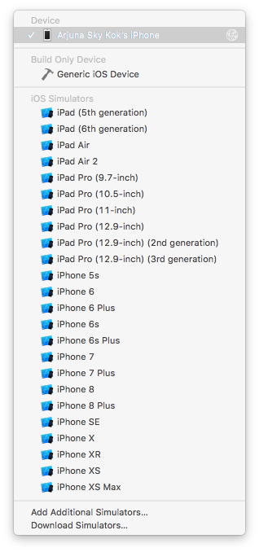
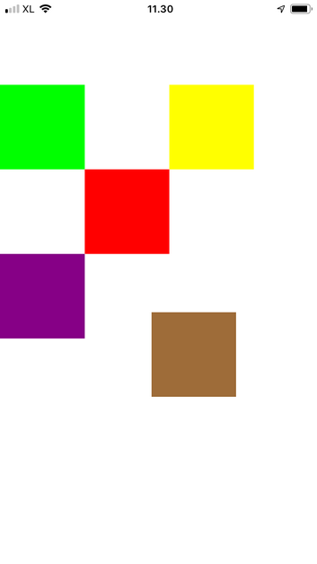

# Gesture

You can add gesture to a view. Gesture is a high level construct of how to interpret touches of fingers from a user.

Testing gesture on simulator is not easy so you should test it on the device. Choose device instead of simulator.
<p align="center">

</p>

You must connect the device (iPhone) to the computer with the cable. Then open “Devices and Simulators” window under “Window” menu.
<p align="center">

</p>

If you want to install application on the device, you can do it via network instead of cable. Make sure you check “Connect via network”.

## UITapGestureRecognizer

Add this code inside viewDidLoad method:
```swift
    let v1 = UIView(frame: CGRect(x: 0, y: 100, width: 100, height: 100))
    v1.backgroundColor = .green
    self.view.addSubview(v1)
    
    let t1 = UITapGestureRecognizer(target: self, action: #selector(singleTap))
    t1.numberOfTapsRequired = 3
    v1.addGestureRecognizer(t1)
```

Then add this method:
```swift
    @objc func singleTap(_ t: UITapGestureRecognizer) {
        guard t.view != nil else { return }
        
        print("tap")
    }
```

Run it and you would get this screen:
<p align="center">

</p>

If you click the green view three times in a short time you would get this output:
```
tap
```

To create and configure the tap gesture recognizer, you use this code:
```swift
    let t1 = UITapGestureRecognizer(target: self, action: #selector(singleTap))
    t1.numberOfTapsRequired = 3
    v1.addGestureRecognizer(t1)
```

The tap gesture recognizer has numberOfTapsRequired property to indicate how many taps we should require.

## UIPinchGestureRecognizer

Add this code:
```swift
    let v2 = UIView(frame: CGRect(x: 200, y: 100, width: 100, height: 100))
    v2.backgroundColor = .yellow
    self.view.addSubview(v2)
    
    let t2 = UIPinchGestureRecognizer(target: self, action: #selector(pinch))
    v2.addGestureRecognizer(t2)
```

Add this method:
```swift
    guard p.view != nil else { return }
    
    if p.state == .began || p.state == .changed {
        p.view?.transform = (p.view?.transform.scaledBy(x: p.scale, y: p.scale))!
        p.scale = 1.0
    }
    print(p.velocity)
}
```

Run it and you would get this screen:
<p align="center">

</p>

You can pinch it to resize it.
<p align="center">

</p>

The way you add UIPinchGestureRecognizer is with this code:
```swift
    let t2 = UIPinchGestureRecognizer(target: self, action: #selector(pinch))
    v2.addGestureRecognizer(t2)
```

In the callback itself, you can resize the view but you don’t have to.
```swift
    @objc func pinch(_ p: UIPinchGestureRecognizer) {
        guard p.view != nil else { return }
        
        if p.state == .began || p.state == .changed {
        `    p.view?.transform = (p.view?.transform.scaledBy(x: p.scale, y: p.scale))!
            p.scale = 1.0
        }
        print(p.velocity)
    }
```

The UIPinchGestureRecognizer has a state. In pinching gesture, you only need to care about began state and changed state.

Then you resize the view with this code.
```swift
p.view?.transform = (p.view?.transform.scaledBy(x: p.scale, y: p.scale))!
```

After resizing the view, you must reset the scale.
```swift
p.scale = 1.0
```

## UIRotationGestureRecognizer

This gesture recognizer is to capture the rotation gesture.

Add this code inside viewDidLoad method:
```swift
    let v3 = UIView(frame: CGRect(x: 100, y: 200, width: 100, height: 100))
    v3.backgroundColor = .red
    self.view.addSubview(v3)
    
    let t3 = UIRotationGestureRecognizer(target: self, action: #selector(rotate))
    v3.addGestureRecognizer(t3)
```

Add this method:
```swift
    @objc func rotate(_ r: UIRotationGestureRecognizer) {
        guard r.view != nil else { return }
        
        if r.state == .began || r.state == .changed {
            r.view?.transform = (r.view?.transform.rotated(by: r.rotation))!
            r.rotation = 0
        }
        print(r.velocity)
    }
```

Run it and you would get this screen:
<p align="center">

</p>

You can rotate the red view.
<p align="center">

</p>

You add the rotation gesture recognizer this way:
```swift
    let t3 = UIRotationGestureRecognizer(target: self, action: #selector(rotate))
    v3.addGestureRecognizer(t3)
```

Then you can add the callback for this rotation gesture recognition:
```swift
    @objc func rotate(_ r: UIRotationGestureRecognizer) {
        guard r.view != nil else { return }
        
        if r.state == .began || r.state == .changed {
            r.view?.transform = (r.view?.transform.rotated(by: r.rotation))!
            r.rotation = 0
        }
        print(r.velocity)
    }
```

Here, you care only about began state and changed state.

To rotate the view, you do it with this code:
```swift
r.view?.transform = (r.view?.transform.rotated(by: r.rotation))!
```

Then don’t forget to reset the rotation of the gesture recognizer.
```swift
r.rotation = 0
```

## UISwipeGestureRecognizer

Swiping is a gesture of dragging finger from one place to another in a short time.

Add this code in viewDidLoad method:
```swift
    let v4 = UIView(frame: CGRect(x: 0, y: 300, width: 100, height: 100))
    v4.backgroundColor = .purple
    self.view.addSubview(v4)
    
    let t4_right = UISwipeGestureRecognizer(target: self, action: #selector(swipe))
    t4_right.direction = .right
    v4.addGestureRecognizer(t4_right)
    
    let t4_left = UISwipeGestureRecognizer(target: self, action: #selector(swipe))
    t4_left.direction = .left
    v4.addGestureRecognizer(t4_left)
```

Swiping gesture recognizer can only recognize the swiping gesture for one direction only. So if you want to recognize the swiping gesture for more than one direction, you need to create two different swiping gesture recognizers. You set the direction with this code:
```swift
t4_left.direction = .left
```

Then you add this method for the callback:
```swift
    @objc func swipe(_ s: UISwipeGestureRecognizer) {
        guard s.view != nil else { return }
        
        var move = 0
        if s.state == .ended {
            switch s.direction {
            case .right:
                move = 100
            case .left:
                move = -100
            default:
                break
            }
            if move != 0 {
                s.view?.transform = (s.view?.transform.translatedBy(x: CGFloat(move), y: 0))!
            }
        }
        print(s.direction)
    }
```

This time you use the ended state, not began state nor changed state. The swiping gesture is not continuous gesture. You can only recognize it after it is being done.

In this callback you differentiate the direction of the gesture. Based on the direction you move the view (or translate the view) in x direction. The view will jump by 100 unit either to the right or left (based on the direction of the swiping gesture).

Run it and you would get this screen.
<p align="center">

</p>

If you swipe the purple view, it will jump by 100 unit.
<p align="center">

</p>

## UIPanGestureRecognizer

This gesture recognizer is to detect the dragging gesture.

Add this code:
```swift
    let v5 = UIView(frame: CGRect(x: 200, y: 300, width: 100, height: 100))
    v5.backgroundColor = .brown
    self.view.addSubview(v5)
    
    let t5 = UIPanGestureRecognizer(target: self, action: #selector(translate))
    v5.addGestureRecognizer(t5)
```

As usual, you create a dragging gesture recognizer, you use the instance of the class: UIPanGestureRecognizer.

Then add this method:
```swift
    @objc func translate(_ p: UIPanGestureRecognizer) {
        guard p.view != nil else { return }
        
        let translation = p.translation(in: p.view)
        if let view = p.view {
            view.center = CGPoint(x: view.center.x + translation.x,
                                  y: view.center.y + translation.y)
        }
        p.setTranslation(CGPoint.zero, in: p.view)
    }
```

In this method, you get the translation object on which you could get the translation distance in x and y direction. Then you move the object by changing its center coordinate. Don’t forget to reset the translation for this gesture recognizer with this code:
```swift
p.setTranslation(CGPoint.zero, in: p.view)
```

Run it and you would get this screen.
<p align="center">

</p>

You can touch the brown view and drag it to somewhere else.
<p align="center">

</p>

## UILongPressGestureRecognizer

This is a gesture to recognize long press gesture.

Add this code:
```swift
    let v6 = UIView(frame: CGRect(x: 100, y: 400, width: 100, height: 100))
    v6.backgroundColor = .blue
    self.view.addSubview(v6)
    
    let t6 = UILongPressGestureRecognizer(target: self, action: #selector(longpress))
    t6.minimumPressDuration = 2
    v6.addGestureRecognizer(t6)
```

You add a long press gresture recognizer with this method: UILongPressGestureRecognizer. Then you can configure how long the press is required before it is recognized by gesture recognizer with minimumPressDuration method. It accepts how many seconds it must wait.

Then add this method:
```swift
    @objc func longpress(_ l: UILongPressGestureRecognizer) {
        guard l.view != nil else { return }
        
        print("long press")
    }
```

Run it and you would get this screen:
<p align="center">

</p>

Tap the blue view for at least two seconds, then you would get this output:
```
long press
```

## UIScreenEdgePanGestureRecognizer

This is a gesture recognizer to recognize dragging action from the corner side of the view.

Add this code:
```swift
    let t7 = UIScreenEdgePanGestureRecognizer(target: self, action: #selector(screen))
    t7.edges = .right
    t7.delegate = self
    self.view.addGestureRecognizer(t7)
```

In above code, you add the gesture recognizer to the root view. You only detect the dragging from the right edge with edges property. If you want to detect the gesture from other edges, you need to create a separate gesture recognizer.

Add this method:
```swift
    @objc func screen(_ s: UIScreenEdgePanGestureRecognizer) {
        guard s.view != nil else { return }
        
        if s.state == .began || s.state == .changed {
            let translation = s.translation(in: s.view)
            print(translation.x)
            print(translation.y)
        }
    }
```

Run it and you would get the same screen. But if you drag your finger from the right edge of the screen, you would get this output.
```
-5.0
0.0
-10.5
0.0
-10.5
0.0
-16.0
0.0
-21.0
0.0
-25.0
0.0
-29.0
0.0
-32.5
0.0
-36.0
0.0
-40.0
0.0
-44.5
0.0
-49.5
0.0
-54.5
0.0
-59.5
0.0
-63.0
0.0
-65.0
0.0
-66.0
0.0
-66.5
0.0
-66.5
0.0
```

## Create UIGestureRecognizer in StoryBoard

Create a view in Story board.
<p align="center">

</p>

Then choose UIGestureRecognizer in UI library.
<p align="center">

</p>

Drag the gesture recognizer from this UI library to the view.

Then open the code interface beside the story board. Then drag the gesture recognizer in the left panel to the code. Choose “Action” connection.
<p align="center">

</p>

Then you would have the gesture recognizer callback.
<p align="center">

</p>

# Optional Reading

https://developer.apple.com/documentation/uikit/uigesturerecognizer

# Exercises

1. Create a view on which you can only drag to x direction. When you are dragging the view, the alphaness of the view will be decreased and the view will be rotated to some degrees. If you drag the view far enough, the view will be disssapeared. If you drag the view not far enough, the view will be back in the initial location.
<p align="center">

</p>

<p align="center">

</p>

<p align="center">

</p>