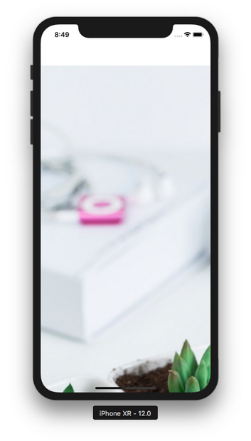

# Image View

Image View is a type of view which can display an image. Other types of views also can display image, such as Button, Label. But Image View has the most flexibility in displaying image.

Objectives:
* learn how to initialize an image from Assets.xcassets, Bundle, Data,
* learn how to initialize an image view with its varieties of content mode,
* understand clipping to bounds property,
* learn how to tile images,
* learn how to resize an image

## UIImage

To create an image object, you can use UIImage.

Create a single view application project.

Then download some images from https://unsplash.com/photos/0DFk--9cWO4 and https://unsplash.com/photos/XDkBZEqPul4.

Name the downloaded image from https://unsplash.com/photos/0DFk--9cWO4 as view.jpg. Resize view.jpg to 1024x1476 size image. Name the downloaded image from https://unsplash.com/photos/XDkBZEqPul4 as fruit.jpg. Resize fruit.jpg to 100x150 size image.

Drag view.jpg and fruit.jpg to Assets.xcassets which is located in User Interface File.
<p align="center">

</p>

Then drag view.jpg (yes, same file) to HelloImageView directory which is located in User Interface File. When asked about whether you should create groups, confirm it.
<p align="center">

</p>

<p align="center">

</p>

Then open ViewController.swift, then add this code on the bottom of viewDidLoad method.
```swift
    let image = UIImage(named: "view")!
    let imageView = UIImageView(frame: CGRect(x: 50, y: 100, width: 300, height: 300))
    imageView.image = image
    self.view.addSubview(imageView)
```

<u>Note to teacher</u>

There is UIImage and there is UIImageView. Make sure students understand the difference between these two classes. UIImage is a class that represents the image object. UIImageView is a view that displays UIImage in screen. On top of that, UIImage returns an optional object because the image could not exist in the first place. In the sample code, I use bang notation (!) because I am 100% sure I have the image. If students are confused about optional, maybe it’s a good time to review optional in Swift.

You would get this result.
<p align="center">

</p>

If you initialize UIImage with named parameter, the image must exists in Assets.xcassets. You should omit the extension. So view.jpg file becomes view as value in named parameter.

If you use named parameter in UIImage constructor, the image would be cached. If you don’t want the image to be cached, you need to use contentsOfFile parameter. By using this way, you can not load an image from Assets.xcassets. You can only load an image from Bundle folder (the image inside HelloImageView folder).
```swift
    let bundlePath = Bundle.main.path(forResource: "view", ofType: "jpg")!
    let image = UIImage(contentsOfFile: bundlePath)!
    let imageView = UIImageView(frame: CGRect(x: 50, y: 100, width: 300, height: 300))
    imageView.image = image
    self.view.addSubview(imageView)
```

You would get the same result. But this time, the image is not cached and can be purged in anytime.

## Content Mode

Image View can show an image in many ways. It is configured with content mode. By default, the content mode is scale to fill. The image is forced to have the size of the image view. Some content modes can display an image in a different way if it is combined with clips to bounds setting. The clips to bounds setting does not work with scale to fill content mode.

Let’s try different content mode values.

You can use the same code or the first code, such as:
```swift
    let image = UIImage(named: "view")!
    let imageView = UIImageView(frame: CGRect(x: 50, y: 100, width: 300, height: 300))
    imageView.image = image
    self.view.addSubview(imageView)
```

Then you will try many combinations of code below the code to load up the image on the screen. The first combination is:
```swift
    imageView.contentMode = .top
    //imageView.clipsToBounds = true
```

You would get this result.
<p align="center">

</p>

The second combination is:
```swift
    imageView.contentMode = .top
    imageView.clipsToBounds = true
```

You would get this result.
<p align="center">

</p>

The third combination is:
```swift
    imageView.contentMode = .bottomLeft
    //imageView.clipsToBounds = true
```

You would get this result.
<p align="center">

</p>

The fourth combination is:
```swift
    imageView.contentMode = .center
    imageView.clipsToBounds = true
```

You would get this result.
<p align="center">

</p>

The fifth combination is:
```swift
    imageView.contentMode = .center
    //imageView.clipsToBounds = true
```

You would get this result.
<p align="center">

</p>

The sixth combination is:
```swift
    imageView.contentMode = .scaleAspectFill
    //imageView.clipsToBounds = true
```

You would get this result.
<p align="center">

</p>

The seventh combination is:
```swift
    imageView.contentMode = .scaleAspectFill
    imageView.clipsToBounds = true
```

You would get this result.
<p align="center">

</p>

The eight combination is:
```swift
    imageView.contentMode = .scaleAspectFit
    //imageView.clipsToBounds = true
```

The clips to bounds setting does not make any difference with this content mode. You would get this result.
<p align="center">

</p>

The ninth combination is:
```swift
    imageView.contentMode = .right
    //imageView.clipsToBounds = true
```

<p align="center">

</p>

The tenth combination is:
```swift
    imageView.contentMode = .right
    imageView.clipsToBounds = true
```

You would get this result.
<p align="center">

</p>

## Tiling Image

Content mode is useful when the image is bigger than the container. Imagine the image is much more smaller than the container (image view), what should we do? You can display the image as is. But you have other options. You can tile the image or you can stretch the image.

Replace the custom code in viewDidLoad method with this code:
```swift
    let image = UIImage(named: "fruit")!
    let imageTiled = image.resizableImage(withCapInsets: .zero, resizingMode: .tile)
    let imageView = UIImageView(frame: CGRect(x: 50, y: 100, width: 300, height: 300))
    imageView.image = imageTiled
    self.view.addSubview(imageView)
```

You would get this result.
<p align="center">

</p>

Change that code into this code for stretch option:
```swift
    let image = UIImage(named: "fruit")!
    let imageStretched = image.resizableImage(withCapInsets: .zero, resizingMode: .stretch)
    let imageView = UIImageView(frame: CGRect(x: 50, y: 100, width: 300, height: 300))
    imageView.image = imageStretched
    self.view.addSubview(imageView)
```

You would get this option.
<p align="center">

</p>

## Load Image From Internet

You can also load an image from the internet. Replace the custom code in viewDidLoad method with this code:
```swift
    let imageView = UIImageView(frame: CGRect(x: 50, y: 100, width: 300, height: 300))
    let url = URL(string: "https://via.placeholder.com/1024.png")!
    do {
        let data = try Data(contentsOf: url)
        let image = UIImage(data: data)!
        imageView.image = image
    } catch {
        print(error)
    }
    self.view.addSubview(imageView)
```

You would get this result.
<p align="center">

</p>

First, you created an URL of the picture with this code:
```swift
let url = URL(string: "https://via.placeholder.com/1024.png")!
```

URL initializer method returns optional object (because URL can be invalid). Because we know https://via.placeholder.com/1024.png is definitely valid, we can unwrap with (!).

Then we retrieve the content of the remote file.
```swift
let data = try Data(contentsOf: url)
```

<u>Note to teacher</u>

In Swift, sometimes the designer of API differentiates the success case and the failure case with optional object. For example URL initializer with string parameter can return nil if the URL is invalid (for example: hoop://gogo.me). But sometimes the method throws exception in failure case, such as in Data initializer method.

Then you initialized image with Image initializer method but with data parameter.
```swift
let image = UIImage(data: data)!
```

Then you set the image of UIImage with this code:
```swift
imageView.image = image
```

You must wrap these codes inside do catch because Data initializer method can throws exception.
```swift
    do {
        let data = try Data(contentsOf: url)
        let image = UIImage(data: data)!
        imageView.image = image
    } catch {
        print(error)
    }
```

## Resizing Image

You could resize the image. Replace the custom code in viewDidLoad method with this code:
```swift
    let image = UIImage(named: "view")!
    let imageView = UIImageView(frame: CGRect(x: 50, y: 100, width: 300, height: 300))
    let newSize = CGSize(width: 100, height: 100)
    let renderer = UIGraphicsImageRenderer(size: newSize)
    let resizedImage = renderer.image { _ in
        image.draw(in: CGRect.init(origin: CGPoint.zero, size: newSize))
    }
    imageView.image = resizedImage
    self.view.addSubview(imageView)
```

You created graphics image renderer with this code:
```swift
    let renderer = UIGraphicsImageRenderer(size: newSize)
```

Then you resize the image by drawing the original image in the context of the graphics image renderer with this code:
```swift
    let resizedImage = renderer.image { _ in
        image.draw(in: CGRect.init(origin: CGPoint.zero, size: newSize))
    }
```

<u>Note to teacher</u>

renderer.image is a method that accepts a closure. It’s a shorthand of this code:
```swift
    let resizedImage = renderer.image(actions: { ctx in
        image.draw(in: CGRect.init(origin: CGPoint.zero, size: newSize))
    })
```

Maybe it’s a good idea to review the closure.

ctx is a context of graphics image renderer. It’s part of Core Graphics and will be discussed in more advanced course.

## Using UIImageView in StoryBoard

Create a single view application project in Xcode. Add view.jpg and fruit.jpg to Assets.xcassets. 

Then add UIImageView to the screen.
<p align="center">

</p>

<p align="center">

</p>

You can choose image from the right panel.
<p align="center">

</p>

You could change the content mode in right panel.
<p align="center">

</p>

You can change the clips to bounds property in the right panel also.

# Optional Materials

https://developer.apple.com/documentation/uikit/uiimageview

https://developer.apple.com/documentation/uikit/uiimage

# Exercise

1. Create a single-view application project that displays an image like this. The image view’s height is one third of the height of the screen.
<p align="center">

</p>

2. Create a single view application that download the image, resize it to 200x200, and display the image inside the image view that has the size 200x200 as well. In the background, it should display tiled images of pineapple. The student should copy the fruit.jpg into Assets.xcassets.
<p align="center">

</p>