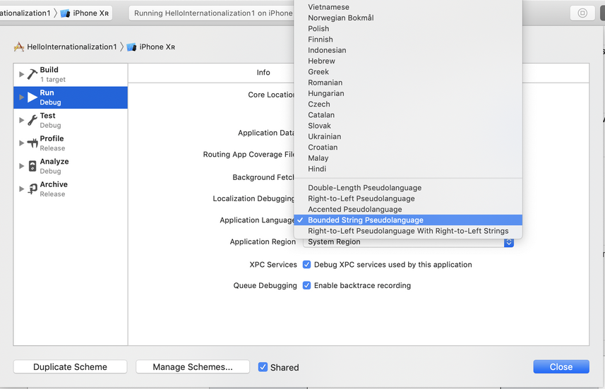
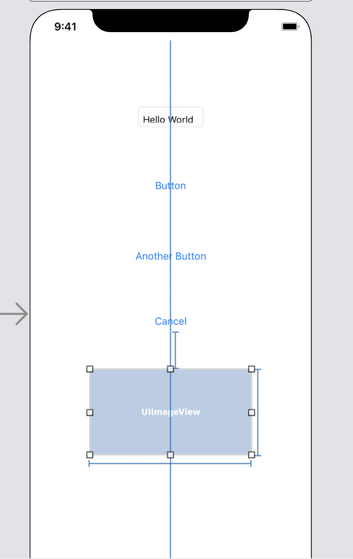

# Internationalization

Internationalization is the process to prepare the ios application to be translated. Localization is the process of localizing the ios application to one specific language / region.

## Translating Storyboard

Create an empty view ios project. Name it HelloInternationalization1.

In Main.storyboard, create a text field, and a button. For the text field, fill it with “Hello World” text. For the button, let the value of button is “Button”.

Then localize Main.storyboard.

Click HelloInternationalization1 root project, then click HelloInternationalization1 in PROJECT part. There are two tabs: “Info” and “Build Settings”. Click “Info” tab. Then click + button under “Localizations” part which should only have English language.
<p align="center">

</p>

Choose “Indonesian” language. Then a popup dialog will show up.
<p align="center">

</p>

<p align="center">

</p>

The LaunchScreen can not be translated. We can check or uncheck it. It does not matter. But we must check Main.storyboard.

After clicking Finish button, we will have Main.strings (Indonesian) file.
<p align="center">

</p>

We can start translating the storyboard.

We want to add some widgets in Main.storyboard. In this example, let’s add another two or three buttons.
<p align="center">

</p>

How do we update Main.strings (Indonesian). We can use third-party tool.

Let’s install Barty Crouch.
```
$ brew install bartycrouch
```

Then go inside HelloInternationalization1 project directory.
```
$ bartycrouch update
```

Then we can see that our Main.strings (Indonesian) is updated. Translate the strings.

Run the application.

We will get the English version of the application.
<p align="center">

</p>

Stop it.

Edit scheme of the project.
<p align="center">

</p>

A modal dialog will show up.
<p align="center">

</p>

Click “Run” tab in left panel. Then click “Options” tab. Choose “Indonesian” in “Application Language” field.
<p align="center">

</p>

Then run the application. This time we will get Indonesian version.
<p align="center">

</p>

## Pseudolanguages

Other than ordinary languages like Indonesian and English, there is a special language when running application in Xcode, called pseudolanguage. There are 5 kinds of pseudolanguage but for Indonesian and English languages support, we only need to care 2 kinds of pseudolanguage: Double-Length Pseudolanguage and Bounded String Pseudolanguage. The first one will double our strings. So “Hello World” becomes “Hello WorldHello World”. The second one will put “[# ” word in front of the string and “ #]” word in the end of the string. So “Hello World” becomes “[# Hello World #]”. This is useful to detect our string will not be truncated.

Set the width contraint of any button. For example, we give a width contraint to “Another Button” button. Then change the application language to “Bounded String Pseudolanguage”.
<p align="center">

</p>

Run the application.
<p align="center">

</p>

As you can see “[# Another Button #]” button is truncated because it has width constraint.

## NSLocalizedString

To create translatable strings in the code (not storyboard), we can use NSLocalizedString.

Edit HelloInternationalization1 / ViewController.swift. Add this code inside viewDidLoad method.

        let helloWorld = NSLocalizedString("Hello World", comment: "Comment for 'Hello World' string")
        print(helloWorld)

NSLocalizedString accepts two parameters. The first parameter is key, the second parameter is comment.

We need to create Localizable.strings file. Click File – New – File.... Choose “Strings” file.
<p align="center">

</p>

Then name it Localizable.strings file.
<p align="center">

</p>

<p align="center">

</p>

Check Indonesian then we will get Localizable.strings (Indonesian) file.
<p align="center">

</p>

The Localizable.strings (Indonesian) file is still empty.

We need to run Barty Crouch tool again.
```
$ bartycrouch update
```

Then edit Localizable.strings (Indonesian) file.
<p align="center">

</p>

We can translate “Hello World” to “Halo Dunia”.

Don’t forget to edit MedicalLocalizable.strings (Base). We can translate “Hello World” to “Hello World”.

Run the application in Indonesian language. We may need to edit scheme first.

We will get “Halo Dunia” printed when we run the application again.

## Custom Table

Localizable.strings file is the default translation file. But we can also use custom translation file. Create another “Strings” file. Name it MedicalLocalizable.strings. Then check Indonesian checkbox so we can have MedicalLocalizable.strings (Indonesian) file.

In viewDidLoad method in ViewController.swift file, add this code:
```swift
    let nurse = NSLocalizedString("Nurse", tableName: "MedicalLocalizable", value: "Student", comment: "Comment for 'Nurse' string")
    print(nurse)
```

This time we don’t use Localizable.strings anymore. We use MedicalLocalizable.strings file. The value which has value “Student” means to give default value if MedicalLocalizable.strings is not found.

There is no tool that can update custom “Strings” file. So we have to add key “Nurse” manually inside MedicalLocalizable.strings (Indonesian).

Edit MedicalLocalizable.strings (Indonesian) file.
```swift
/* Comment for 'Nurse' string */
"Nurse" = "Perawat";
```

Run the application again in Indonesian. This time we have these strings being printed:
```
Halo Dunia
Perawat
```

If we run the application in English, we have these strings being printed:
```
Hello World
Student
```

### String Formatting in Translation

Sometimes we want to have a dynamic variable inside the translatable strings. We can use string formatting.

Add this code in viewDidLoad method.
```swift
    let bill = "Bill Gates"
    let number = 1
    let billLocalizedString = NSLocalizedString("%@ is the successful businessman number %d.", comment: "Comment for Bill Gates")
    let billString = String.localizedStringWithFormat(billLocalizedString, bill, number)
    print(billString)
```

If you notice, there are two placeholders inside the localized string: “%@” and “%d”. “%@” is for object placeholder. “%d” is for integer placeholder. The complete list of placeholders can be found here:

https://developer.apple.com/library/archive/documentation/Cocoa/Conceptual/Strings/Articles/formatSpecifiers.html#//apple_ref/doc/uid/TP40004265-SW1

To get the string itself from the formatted localized string, we can use String.localizedStringWithFormat. The first parameter is the localized string, the remaining parameters are the objects/integers that we want to substitute to placeholders.

Don’t forget to update Localizable.strings.
```
$ bartycrouch update
```

Then edit Localizable.strings (Base) and Localizable.strings (Indonesian). For Localizable.strings (Base), we can fill the same string.
```swift
/* Comment for Bill Gates */
"%@ is the successful businessman number %d." = "%@ is the successful businessman number %d.";
```

For Localizable.strings (Indonesian), we can fill this Indonesian string.
```swift
/* Comment for Bill Gates */
"%@ is the successful businessman number %d." = "%@ adalah pebisnis yang sukses nomor %d.";
```

Run the application in English. We should get this string.
```
Bill Gates is the successful businessman number 1.
```

Run the application in Indonesian. We should get this string.
```
Bill Gates adalah pebisnis yang sukses nomor 1.
```

### Date Formatting in Translation

Date is presented differently in different languages. Rather than hardcoding the date formatting, we need to use a flexible formatting.

Add this code inside viewDidLoad method.
```swift
    let dateFormatter = DateFormatter()
    dateFormatter.dateStyle = .long
    dateFormatter.timeStyle = .medium
    
    let date = Date(timeIntervalSinceNow: 0)
    let dateString = dateFormatter.string(from: date)
    print(dateString)
```

We create a date formatter object. Then we set the date style and time style. We have “full”, “none”, and “short” options other than “long” and “medium” options.

Then we can print the date string with “string” method.

If you run the application in Indonesian, you will get this string:
```
11 September 2019 15.21.53
```

If you run the application in English, you will get this string:
```
September 11, 2019 at 3:26:48 PM
```

For representing the date interval, we have DateIntervalFormatter.

Add this code inside viewDidLoad method.
```swift
    let dateIntervalFormatter = DateIntervalFormatter()
    dateIntervalFormatter.dateStyle = .full
    
    let endDate = Date(timeInterval: 86400, since: date)
    let dateIntervalString = dateIntervalFormatter.string(from: date, to: endDate)
    print(dateIntervalString)
```

It is similar to DateFormatter, we create DateIntervalFormatter object and set its date style. Then we get the date interval string with “string” method of DateIntervalFormatter object.

Run the application in English, you will get this string:
```
Wednesday, September 11, 2019, 3:26 PM – Thursday, September 12, 2019, 3:26 PM
```

Run the application in Indonesian, you will get this string:
```
Rabu, 11 September 2019 15.36 – Kamis, 12 September 2019 15.36
```

### Number Formatting in Translation

Number should be displayed differently in different languages.

Add this code in viewDidLoad method.
```swift
    let numberFormatter = NumberFormatter()
    numberFormatter.numberStyle = .decimal
    
    let num = 200456 as NSNumber
    let numString = numberFormatter.string(from: num)!
    print(numString)
```

We create a NumberFormatter object and set its number style. Then we can get the number string with “string” method. But we must covert Integer object to NSNumber before sending it to “string” method.

Other than “decimal” style, we have other number styles like ordinal, currency, percent, etc. Add this code to use different number style.
```swift
    numberFormatter.numberStyle = .currency
    numberFormatter.currencyCode = "Rp "
    let numCurrencyString = numberFormatter.string(from: num)!
    print(numCurrencyString)
```

We must set the currency code manually. The currency code does not change when we switch locale. Here, we set it to “Rp ”. To get the currency number string we can use “string” method.

Run the application in Indonesian and we will get this string:
```
200.456
Rp 200.456,00
```

Run the application in English and we will get this string:
```
200,456
Rp 200,456.00
```

## Pluralization

The rule for pluralization in English and Indonesian are different. For example, in English:

“There is 1 book.” vs “There are 5 books.”

In Indonesian, things are simpler:

“Ada 1 buku.” vs “Ada 5 buku.”

We can cover that rule with stringsdict file. Create a new stringsdict file: File – New – File...

Choose Stringsdict File.
<p align="center">

</p>

Give the name of the file: Localizable.stringsdict and save it inside Base.lproj directory.
<p align="center">

</p>

<p align="center">

</p>

Select “Localizable.stringsdict” file and check Indonesian in Localization section.

We will get Localizable.stringsdict (Base) and Localizable.stringsdict (Indonesian).
<p align="center">

</p>

For Localizable.stringsdict (Base), edit the rule to be like this:
<p align="center">

</p>

d in NSStringFormatValueTypeKey means %d, the integer placeholder. The localized string key is “Book sentence” which will we use in code.

For Localizable.stringsdict (Indonesian), edit the rule to be like this:
<p align="center">

</p>

Edit ViewController.swift. Add this code inside viewDidLoad method.
```swift
    let bookLocalizedString = NSLocalizedString("Book sentence", comment: "")
    let noBookString = String.localizedStringWithFormat(bookLocalizedString, 0)
    let oneBookString = String.localizedStringWithFormat(bookLocalizedString, 1)
    let manyBookString = String.localizedStringWithFormat(bookLocalizedString, 5)
    print(noBookString)
    print(oneBookString)
    print(manyBookString)
```

Run the application in English, we will get these strings:
```
In this room there are 0 books
In this room there is 1 book
In this room there are 5 books
```

Run the application in Indonesian, we will get these strings:
```
Di ruangan ini ada 0 buku
Di ruangan ini ada 1 buku
Di ruangan ini ada 5 buku
```

## Gender Based Sentences

English has gender rule in sentences: male (he), female (she), and neutral (they). Indonesian does not have gender rule.

We can cover this in stringsdict file. 
<p align="center">

</p>

Add another key in Localizable.stringsdict (Base): “Gender sentence”.

Add another key in Localizable.stringsdict (Indonesian): “Gender sentence”.
<p align="center">

</p>

In gender rule, we use NSStringGenderRuleType in NSStringFormatSpecTypeKey. For the key itself, we use number, 0, 1, and 2 to indicate whether it is a male, female, or neutral.

Edit ViewController.swift. Add this code inside viewDidLoad method.
```swift
    let genderLocalizedString = NSLocalizedString("Gender sentence", comment: "")
    let hisGenderString = String.localizedStringWithFormat(genderLocalizedString, 0)
    let herGenderString = String.localizedStringWithFormat(genderLocalizedString, 1)
    let theirGenderString = String.localizedStringWithFormat(genderLocalizedString, 2)
    print(hisGenderString)
    print(herGenderString)
    print(theirGenderString)
```

Run the application in English and we will get these strings:
```
He is standing there.
She is standing there.
They are standing there.
```

Run the application in Indonesian and we will get these strings:
```
Dia berdiri di sana.
Dia berdiri di sana.
Mereka berdiri di sana.
```

## Translating Images

Sometimes we want to use different images in different locale.

Let’s add image inside HelloInternationalization1 folder. We can drag an image from Finder window to HelloInternationalization1 folder in tree panel in Xcode.
<p align="center">

</p>

<p align="center">

</p>

Choose our file in tree panel in the left, then click Localize button.
<p align="center">

</p>

We will have localization option. Check Indonesian option.
<p align="center">

</p>

<p align="center">

</p>

Now we have our image in Indonesian version. Right click the image in Indonesian version, and choose “Show in Finder”. 

We can replace the image or edit the image. In this example, we put “Indonesian” word on top of the image.
<p align="center">

</p>

Then add an UIImageView on the Storyboard. Choose our image as the image for this UIImageView.
<p align="center">

</p>

<p align="center">

</p>

<p align="center">

</p>

Run the application in Indonesian, we will get this screen.
<p align="center">

</p>

Run the application in English, we will get this screen.
<p align="center">

</p>

## Exporting and Importing Translation

Usually we don’t perform the translation directly in Xcode. We export the translation from Xcode to xliff format.

Choose root project in tree panel, and click Editor – Export for Localization...
<p align="center">

</p>

We can save the exported files wherever we like. Choose Indonesian in Localizations options.
<p align="center">

</p>

We will have HelloInternationalization1 directory. Inside of this directory, ethere is id.xcloc directory. Inside of id.xcloc directory, there are contents.json file, Localized Contents directory, Notes directory, Source Contents directory.

Open Localized Contents directory. There are HelloInternationalization1 directory and id.xliff file. We can edit id.xliff file to translate our strings to Indonesian strings. Inside HelloInternationalization1, there is id.lproj directoy which contains our Indonesian version of image.

After having done the translation work, we can import back our translation work into Xcode.

Choose project root directory, then click Editor – Import Localizations. Choose our id.xcloc directory.
<p align="center">

</p>

<p align="center">

</p>

We will get a popup window to confirm our import process.
<p align="center">

</p>

<p align="center">

</p>

The updated string is highlighted.

If we confirm the import process, we will get our updated string.

## Locale Object

To get the information about localization in iOS app, we can use Locale static object and instance.

Add this code inside viewDidLoad method in ViewController.swift.
```swift
    let currentLocale = Locale.current
    print(currentLocale)
    print(currentLocale.identifier)
    print(currentLocale.languageCode!)
    print(currentLocale.regionCode!)
    print(currentLocale.currencyCode!)
    print(currentLocale.currencySymbol!)
    print(currentLocale.localizedString(forIdentifier: currentLocale.identifier)!)
    print(Locale.preferredLanguages)
```

Run the application in English and we will get this output.
```
en_US (current)
en_US
en
US
USD
$
English (United States)
["en"]
```

Run the application in Indonesian and we will get this output.
```
id_US (current)
id_US
id
US
USD
US$
Indonesia (Amerika Serikat)
["id"]
```

To change the preferred languages and region, other than editing scheme in Xcode, we can also set in simulator settings.
<p align="center">

</p>

Choose Language & Region.
<p align="center">

</p>

<p align="center">

</p>

## Open Settings Programmatically

If we want to give user the power to change the localization of the application, we can redirect them to Settings.

Create a new single view application. Name it HelloInternationalization2.

Add a button on the default view controller on Storyboard. Set the text on the button to “Launch Settings” and create Indonesian translation for this storyboard. For Indonesian version, set the text on the button to “Luncurkan Pengaturan”.
<p align="center">

</p>

Then create a callback for this button in ViewController. Control drag the button to ViewController.swift code.
```swift
    @IBAction func launchSettingsClicked(_ sender: UIButton) {
        if let url = URL.init(string: UIApplication.openSettingsURLString) {
            UIApplication.shared.open(url, options: [:], completionHandler: nil)
        }
    }
```

Run the application with real device (not in simulator because there is a problem switching language in simulator).

If we click the button, we will open Settings application in iOS. Change the language and go back to application. The button will be translated.

## Testing Translations

We must be careful when running tests with localization. We should not hardcode the string.

Create a new single view application. Check “Include UI Tests”.

Then create a button and another view controller. In the second view controller, add a label with text “Hello”. Control drag the button to the second view controller.
<p align="center">

</p>

Localize the storyboard. This is the Indonesian translation for the button and the label.
```swift
/* Class = "UILabel"; text = "Hello"; ObjectID = "5aJ-pO-gnw"; */
"5aJ-pO-gnw.text" = "Halo";

/* Class = "UIButton"; normalTitle = "Button"; ObjectID = "FCU-uK-r3H"; */
"FCU-uK-r3H.normalTitle" = "Tombol";
```

You will have different objectID than the one presented here.

Edit the UI test file. The file is named HelloInternationalization3UITests.swift inside HelloInternationalization3UITests directory.
```swift
import XCTest

class HelloInternationalization3UITests: XCTestCase {

    var app: XCUIApplication!
    
    override func setUp() {
        continueAfterFailure = false
        
        app = XCUIApplication()
        app.launch()
        
    }
    
    func testButton() {
        app.buttons["Button"].tap()
        let helloLabel = app.staticTexts["Hello"]
        XCTAssertTrue(helloLabel.exists)
    }
    
    override func tearDown() {
    }

}
```

If we run this test in English, this test will pass. But if we run this test in Indonesian, this test will fail. To run the test in different language, we can edit the scheme. Change the application language in Test section.
<p align="center">

</p>

To run the UI tests properly without hardcoded string, we need to give each element the accessibilityIdentifier. We can give it in storyboard, in User Defined Runtime Attributes. For the button: the key path is “accessibilityIdentifier”, the type is “String”, the value is “button”. For the label: the key path is “accessibilityIdentifier”, the type is “String”, the value is “hello”.
<p align="center">

</p>

Add another UI test method.
```swift
    func testButtonWithAccessibilityIdentifier() {
        app.buttons["button"].tap()
        let helloLabel = app.staticTexts["hello"]
        XCTAssertTrue(helloLabel.exists)
    }
```

Run the test again in Indonesian and English. This time this new test passes.

## Saving Screenshots

We can save screenshots when running tests. This is useful if we want to give screenshots in different languages to translators and marketers.

Add another UI test method.
```swift
    func testButtonSaveScreenshot() {
        var screenshot = XCUIScreen.main.screenshot()
        var attachment = XCTAttachment(screenshot: screenshot)
        attachment.lifetime = .keepAlways
        add(attachment)
        
        app.buttons["button"].tap()
        
        screenshot = XCUIScreen.main.screenshot()
        attachment = XCTAttachment(screenshot: screenshot)
        attachment.lifetime = .keepAlways
        add(attachment)
    }
```

To get the screenshot we use screenshot method.
```swift
var screenshot = XCUIScreen.main.screenshot()
```

To save the attachment we use XCTAttachment class and “add” method.
```swift
var attachment = XCTAttachment(screenshot: screenshot)
attachment.lifetime = .keepAlways
add(attachment)
```

Run the application in any language and we will get screenshots.

To access the screenshots, we can get them from test browsers in Xcode.
<p align="center">

</p>

# Exercises

1. Translate your previous applications.