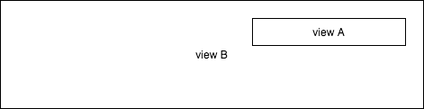
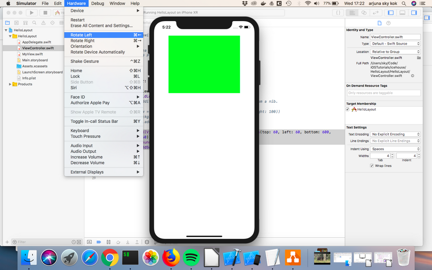
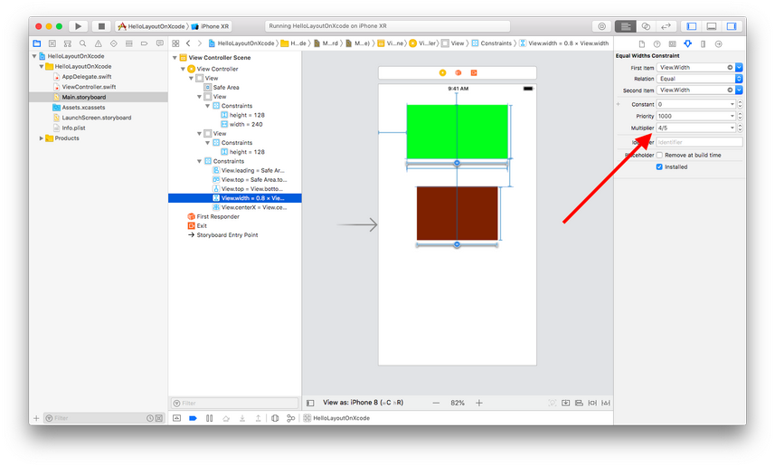
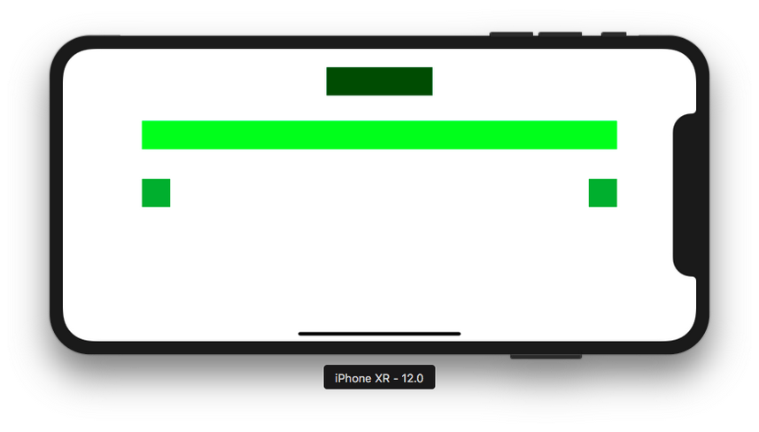
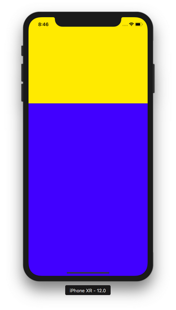

# Layout

Layout is how we position a view regarding to other view. If other view resizes or moves, what should this view do? Layout is how we answer that question.

## Objective
- Be aware of layoutSubviews method,
- Understanding Autoresizing,
- Understanding Autolayout,
- Creating layout by code and storyboard

There are 3 ways to create layout for views:
1. using layoutSubviews method,
2. using Autoresizing,
3. using Autolayout.

layoutSubviews is used very rarely, only for advanced usage. However, the students just need to know that this method exists if they need it in the future.

Autoresizing is used quite often in real world. But it is too simple. It can only describe the layout relationship between the subview and the superview.

Autolayout is really powerful and it can describe the relationship between any views (not just between superviews and subviews). It can describe the layout relationship between sibling views. Autolayout uses layoutSubviews behind the scenes. Technically speaking, Autolayout is the simple way to use layoutSubviews method.

The general rule is the students probably would use Autolayout 95%, Autoresizing 4%, and layoutSubviews 1%.

## layoutSubviews method

Create Single View App in XCode. It has been described in View lesson.

Then create a new Cocoa Touch class. Name it MyView.
<p align="center">

</p>

<p align="center">

</p>

<p align="center">

</p>

<p align="center">

</p>

Then open MyView.swift.

Add this method inside the class.
```swift
    override func layoutSubviews() {
        super.layoutSubviews()
        self.center = CGPoint(x: 300, y: 300)
    }
```

Then open ViewController.swift. Add this code inside viewDidLoad method.
```swift
    let myview = MyView(frame: CGRect(x: 0, y: 0, width: 100, height: 100))
    myview.backgroundColor = .green
    self.view.addSubview(myview)
```

<u>Note to teachers</u>

Make sure the students notice that we initialized MyView class not UIView class. MyView is a child of UIView.

Run the application and you would get this result.
<p align="center">

</p>

In ViewController.swift, we initialize MyView class with a frame which has x: 0 and y: 0 but our green view is not positioned on the top left corner of the screen. That happened because in layoutSubviews method of MyView class, we manually positioned our view. We set the middle of the view to be in position of x: 300 and y: 300.

layoutSubviews is so powerful that you can create a constraint like this. If today is Friday, the width of this view is 200, if today is Saturday, the width of this view is 350, and so on.

In what situation we should manually position a view is part of advanced course. For now, the students just need to aware that this method exists.

## Autoresizing

Autoresizing is a simple way to describe the relationship between the subview and the superview. If the superview resizes or moves, what should the subview does? Autoresizing can not describe siblings relationship.

The AutoresizingMask property describes Autoresizing behaviour of the view in its superview (parent) container. There are six values: flexibleLeftMargin, flexibleWidth, flexibleRightMargin, flexibleTopMargin, flexibleHeight, flexibleBottomMargin.

These six values are not six exclusive values (you have to choose one of these 6 values). AutoresizingMask is a bitmask, meaning you could combine these values. It mean the value of AutoresizingMask property of a view could be the combination of flexibleLeftMargin and flexibleHeight.

Note to teacher
bitmask is a data that used for bit computation. If students are confused about bit computation, review shortly about bit, or, xor, and, not. 
https://en.wikipedia.org/wiki/Mask_(computing)
https://en.wikipedia.org/wiki/Bitwise_operation


Let’s describe what should happen to a view when its superview becomes wider.

This is the screen containing view A and view B. View A is a subview of view B. view B is a superview of view A.
<p align="center">

</p>

If we resizes view B, and view A has **flexible right margin**, it would end up like this.
<p align="center">

</p>

Notice the left margin and the width of view A do not change.

If we resizes view B, and view A has **flexible left margin**, it would end up like this.
<p align="center">

</p>

Notice the right margin and the width of view A do not change.

If we resizes view B, and view A has **flexible width**, it would end up like this.
<p align="center">

</p>

Notice the right margin and the left margin of view A do not change.

Let’s test the feature out.

Comment the initial code in viewDidLoad method of ViewController.swift file.
```swift
    //let myview = MyView(frame: CGRect(x: 0, y: 0, width: 100, height: 100))
    //myview.backgroundColor = .green
    //self.view.addSubview(myview)
```

Add this code instead:
```swift
    let view = UIView(frame: self.view.bounds.inset(by: UIEdgeInsets(top: 60, left: 60, bottom: 600, right: 60)))
    view.backgroundColor = .green
    self.view.addSubview(view)
```

Run it and you would get a green view on the screen.
<p align="center">

</p>

Rotate it to the left, by clicking Cmd + Left Arrow.
<p align="center">

</p>

You would get this screen.
<p align="center">

</p>

By default the value of <i>AutoresizingMask</i> property of a view is <i>flexibleRightMargin</i> and <i>flexibleBottomMargin</i>.

Let’s change it to <i>flexibleLeftMargin</i> and <i>flexibleBottomMargin</i>.

Add this code on the bottom of viewDidLoad method.
```swift
    view.autoresizingMask = [.flexibleLeftMargin, .flexibleBottomMargin]
```

Make your simulator in portrait position first before running this code. After you got the application launched, rotate it again to the left. You would get the screen view anchored to the right.
<p align="center">

</p>

Let’s change it to <i>flexibleWidth</i> and <i>flexibleBottomMargin</i>.
```swift
view.autoresizingMask = [.flexibleWidth, .flexibleBottomMargin]
```

Rotate the simulator again to the portrait position and run the code again. You would see the view is stretched and becomes wider.
<p align="center">

</p>

Now, let’s setup Autoresizing in storyboard. Click Main.storyboard.

Then add UIView instance to ViewController.
<p align="center">

</p>

To change the AutoresizingMask property of the view, click the relevant tab as shown in this picture. You could also change the x, y, width, height of the frame property of this view in this tab.
<p align="center">

</p>

<p align="center">

</p>

You could click the red line in Autoresizing option and see the live review of your decision.

## Autolayout

Autolayout is based on NSLayoutConstraint object. You could combine Autoresizing and Autolayout but it is error prone. So when using Autolayout, we usually disable Autoresizing behavior.

To disable Autoresizing, we can set translatesAutoresizingMaskIntoConstraints to false value. But if we use storyboard or nib, it will be disabled automatically. So we only need to do this if we setup constraints in code.
```swift
view.translatesAutoresizingMaskIntoConstraints = false
```

<i>NSLayoutConstraint</i> class accepts a few parameters: <i>item, attribute, relatedBy, toItem, attribute, multiplier, constant</i>.

**item** is an object (a view or a button, etc) which this constraint applies to.

**attribute** is the attribute of an object which this constraint applies to. For example, if we want to create a constraint, “the width of view A must be 20 unit”, then the attribute value is width. If we want to create a constraint, “the top of view A must be 20 unit below the bottom of view B”, the the attribute value is top. The possible values are width, height, top, bottom, left, right, leading, trailing, centerX, centerY, firstBaseline, lastBaseline, etc.

**relatedBy** is a value describing between an attribute of an object to other attribute of other object. Is it same? Is it bigger? Is it smaller? The possible values are equal, lessThanOrEqual, greaterThanOrEqual.

**toItem** is another object if the constraint describes the relationship between two objects. For example, if we create a constraint, “the top of view A must be 20 unit below the bottom of view B”, then if item value is view A, toItem value would be view B. If a constraint is about one object only, for example a constraint about the width of view A, then toItem value is nil.

**attribute** (the second one) is the attribute of a second object which this constraint applies to. If we create a constraint, “the top of view A must be 20 unit below the bottom of view B”, then the first attribute’s value is top and the second attribute’s value is bottom.

**multiplier** is what sets the value of the first attribute’s value from the second attribute’s value. If we want to make the view A and view B centered in horizontal fashion (their centers share the same y value), then the multiplier is 1. If you want to make the height of view A half the height of view B, then the multiplier is 0.5.

**constant** is what completes multiplier when setting the value of the first attribute’s value from the second attribute’s value. If we want to make the width of view A is 20 unit, then the constant value is 20.

Let’s create some constraints for a view. Before that, delete the view that we added in storyboard.

In viewDidLoad method, let’s create a view and three constraints.
```swift
        let view1 = UIView(frame: CGRect(x: 0, y: 0, width: 0, height: 0))
        view1.backgroundColor = .blue
        view1.translatesAutoresizingMaskIntoConstraints = false
        self.view.addSubview(view1)
        
        let constraint1 = NSLayoutConstraint(item: self.view,
                                             attribute: .trailing,
                                             relatedBy: .equal,
                                             toItem: view1,
                                             attribute: .trailing,
                                             multiplier: 1,
                                             constant: 0)
        let constraint2 = NSLayoutConstraint(item: view1,
                                             attribute: .width,
                                             relatedBy: .equal,
                                             toItem: nil,
                                             attribute: .notAnAttribute,
                                             multiplier: 1,
                                             constant: 100)
        let constraint3 = NSLayoutConstraint(item: view1,
                                             attribute: .height,
                                             relatedBy: .equal,
                                             toItem: nil,
                                             attribute: .notAnAttribute,
                                             multiplier: 1,
                                             constant: 100)
        self.view.addConstraint(constraint1)
        view1.addConstraint(constraint2)
        view1.addConstraint(constraint3)
```

We create a view with a frame with parameters, x: 0, y: 0, width: 0, height: 0. It means our view will be on the top left corner of the screen with empty size!

Then we set translatesAutoresizingMaskIntoConstraints property of the view to false. It means we don’t want to use Autoresizing. We want to use Autolayout completely.

Then we add the view to self.view as self.view’s child.

There are three constraints.

The first constraint is to make sure the trailing of self.view is the same as the trailing of our view. Trailing attribute is the right border/side of a view. It means we want to attach our view to the right side of self.view.

The second constraint is to make sure the width of our view is 100 unit. For this constraint, we have empty second item and empty second item’s attribute.

The third attribute is same as the second attribute, but for height attribute.

Run it and this is the result.
<p align="center">

</p>

Remember when we initialize our view with this way?
```swift
let view1 = UIView(frame: CGRect(x: 0, y: 0, width: 0, height: 0))
```

But in the screen our view’s size is bigger than 0 and it is on the right corner although our frame of our view has parameters x: 0, y: 0, width: 0, height: 0.

The answer is the constraints can override a view’s position and size. It is very common to set a view’s position and size with constraints instead of frame.

If we create a constraint between a parent (superview) and a child (subview), the parent view must be give position as the first item in NSLayoutConstraint, like this.
```swift
let constraint1 = NSLayoutConstraint(item: self.view,
                                             attribute: .trailing,
                                             relatedBy: .equal,
                                             toItem: view1,
                                             attribute: .trailing,
                                             multiplier: 1,
                                             constant: 0)
```

**self.view** is a superview of view1. So self.view must be in the first item argument while view1 must be in the second item argument. If you reverse them, the application would crash if it is executed.

Let’s create another views and add other types of constraints.
```swift
        let view2 = UIView()
        view2.backgroundColor = .cyan
        view2.translatesAutoresizingMaskIntoConstraints = false
        self.view.addSubview(view2)
        
        let view3 = UIView()
        view3.backgroundColor = .magenta
        view3.translatesAutoresizingMaskIntoConstraints = false
        self.view.addSubview(view3)
        
        let constraint4 = NSLayoutConstraint(item: view2,
                                             attribute: .centerX,
                                             relatedBy: .equal,
                                             toItem: view3,
                                             attribute: .centerX,
                                             multiplier: 1,
                                             constant: 0)
        let constraint5 = NSLayoutConstraint(item: view1,
                                             attribute: .leading,
                                             relatedBy: .equal,
                                             toItem: view2,
                                             attribute: .trailing,
                                             multiplier: 1,
                                             constant: 20)
        let constraint6 = NSLayoutConstraint(item: view2,
                                             attribute: .width,
                                             relatedBy: .equal,
                                             toItem: nil,
                                             attribute: .notAnAttribute,
                                             multiplier: 1,
                                             constant: 100)
        let constraint7 = NSLayoutConstraint(item: view2,
                                             attribute: .height,
                                             relatedBy: .equal,
                                             toItem: nil,
                                             attribute: .notAnAttribute,
                                             multiplier: 1,
                                             constant: 100)
        let constraint8 = NSLayoutConstraint(item: view3,
                                             attribute: .width,
                                             relatedBy: .equal,
                                             toItem: nil,
                                             attribute: .notAnAttribute,
                                             multiplier: 1,
                                             constant: 140)
        let constraint9 = NSLayoutConstraint(item: view3,
                                             attribute: .height,
                                             relatedBy: .equal,
                                             toItem: nil,
                                             attribute: .notAnAttribute,
                                             multiplier: 1,
                                             constant: 100)
        let constraint10 = NSLayoutConstraint(item: view3,
                                             attribute: .top,
                                             relatedBy: .equal,
                                             toItem: view2,
                                             attribute: .bottom,
                                             multiplier: 1,
                                             constant: 100)
        
        self.view.addConstraint(constraint5)
        view2.addConstraint(constraint6)
        view2.addConstraint(constraint7)
        
        self.view.addConstraint(constraint4)
        view3.addConstraint(constraint8)
        view3.addConstraint(constraint9)
        self.view.addConstraint(constraint10)
```

Run it and you would get this result.
<p align="center">

</p>

view1 is the dark blue view. view2 is the cyan (light blue/green) view. view3 is the magenta (light red) view.
```swift
let constraint4 = NSLayoutConstraint(item: view2,
                                             attribute: .centerX,
                                             relatedBy: .equal,
                                             toItem: view3,
                                             attribute: .centerX,
                                             multiplier: 1,
                                             constant: 0)
```

This constraint is to center view3 with reference to view2.
```swift
let constraint5 = NSLayoutConstraint(item: view1,
                                             attribute: .leading,
                                             relatedBy: .equal,
                                             toItem: view2,
                                             attribute: .trailing,
                                             multiplier: 1,
                                             constant: 20)
```

This is to put view1’s leading attribute (left side) separated 20 unit distance with the view2’s trailing attribute (right side).

Every constraint you created must be added into a view, like this.
```swift
view3.addConstraint(constraint9)
```

The question is which view we want to add the constraint to? If the constraint describes the relationship between a superview and a subview, we choose the superview. If the constraint describes the relationship between siblings, we choose their parent. If the constraint describes the width or the height of a view, then we choose that view.

Let’s create another view and add another type of constraint.
```swift
        let view4 = UIView()
        view4.backgroundColor = .green
        view4.translatesAutoresizingMaskIntoConstraints = false
        self.view.addSubview(view4)
        
        let constraint11 = NSLayoutConstraint(item: view4,
                                             attribute: .width,
                                             relatedBy: .equal,
                                             toItem: nil,
                                             attribute: .notAnAttribute,
                                             multiplier: 1,
                                             constant: 140)
        let constraint12 = NSLayoutConstraint(item: view4,
                                             attribute: .height,
                                             relatedBy: .equal,
                                             toItem: view3,
                                             attribute: .height,
                                             multiplier: 2,
                                             constant: 0)
        let constraint13 = NSLayoutConstraint(item: view4,
                                              attribute: .top,
                                              relatedBy: .equal,
                                              toItem: view3,
                                              attribute: .bottom,
                                              multiplier: 1,
                                              constant: 0)
        let constraint14 = NSLayoutConstraint(item: view4,
                                             attribute: .centerX,
                                             relatedBy: .equal,
                                             toItem: view3,
                                             attribute: .centerX,
                                             multiplier: 1,
                                             constant: 0)
        
        view4.addConstraint(constraint11)
        self.view.addConstraint(constraint12)
        self.view.addConstraint(constraint13)
        self.view.addConstraint(constraint14)
```

Run it and this is the result.
<p align="center">

</p>


The constraint to set the height can use other view’s height as reference.
```swift
        let constraint12 = NSLayoutConstraint(item: view4,
                                             attribute: .height,
                                             relatedBy: .equal,
                                             toItem: view3,
                                             attribute: .height,
                                             multiplier: 2,
                                             constant: 0)
```

This constraint means the height of view4 (green view) should be twice as big (the value of multiplier is 2) as the height of view3 (magenta view). This is the formula.
```
height of view4 = height of view3 * multiplier + constant
```

Be careful. Because this constraint describes the relationship between two views, we should use their parent view when adding the constraint.
```swift
self.view.addConstraint(constraint12)
```

Real world use case using constraint of layouts.
<p align="center">

</p>

The height of the video part is one third (1/3) of the height of the screen. You can achieve that using constraint of layout between the height of two different views.

## Anchor Notation

There is other way to create constraints other than creating NSLayoutConstraint instances. This method is called Anchor Notation and it is more convenient.

Comment out our constraints’ code of view4. 
```swift
/*
        let constraint11 = NSLayoutConstraint(item: view4,
                                             attribute: .width,
                                             relatedBy: .equal,
                                             toItem: nil,
                                             attribute: .notAnAttribute,
                                             multiplier: 1,
                                             constant: 140)
        let constraint12 = NSLayoutConstraint(item: view4,
                                             attribute: .height,
                                             relatedBy: .equal,
                                             toItem: view3,
                                             attribute: .height,
                                             multiplier: 2,
                                             constant: 0)
        let constraint13 = NSLayoutConstraint(item: view4,
                                              attribute: .top,
                                              relatedBy: .equal,
                                              toItem: view3,
                                              attribute: .bottom,
                                              multiplier: 1,
                                              constant: 0)
        let constraint14 = NSLayoutConstraint(item: view4,
                                             attribute: .centerX,
                                             relatedBy: .equal,
                                             toItem: view3,
                                             attribute: .centerX,
                                             multiplier: 1,
                                             constant: 0)
        
        view4.addConstraint(constraint11)
        self.view.addConstraint(constraint12)
        self.view.addConstraint(constraint13)
        self.view.addConstraint(constraint14)
        */
```

Add this code below it.
```swift
        let anchor1 = view4.centerXAnchor.constraint(equalTo: view3.centerXAnchor)
        let anchor2 = view4.widthAnchor.constraint(equalToConstant: 140)
        let anchor3 = view4.heightAnchor.constraint(equalTo: view3.heightAnchor, multiplier: 2)
        let anchor4 = view4.topAnchor.constraint(equalTo: view3.bottomAnchor)
        NSLayoutConstraint.activate([anchor1, anchor2, anchor3, anchor4])
```

We use method named constraint which is the property of other properties with Anchor words as the suffix. So if we want to set centerX attribute then the property is centerXAnchor. If we want to set top attribute then the property is topAnchor. It accepts arguments like equalTo which we can feed other view’s anchor or equalToConstant if we want to give a constant value. It also accepts multiplier and constant arguments.

From these methods, we get NSLayoutAnchor. Then we need to activate them with NSLayoutConstraint.activate method.

Run it and the result would still be the same as previous code using the strategy of adding NSLayoutConstraint instances.

## Visual Format Notation

The last way to set layout constraint is using visual format notation.

The components of visual format notation is:
```
1.<orientation>:? 2.<superview><connection>? 3.[<view>] 4.<connection><view>* 5.<connection><superview>?
```

? means optional. * means it can be more than one time.
```
1.<orientation>?
```

The possible values are H (horizontal) and V (vertical).
```
2.<superview><connection>?
```

If number 1 is V (vertical), this means the spacing between the top border of the view and the top border of the superview. If number 1 is H (horizontal), this means the spacing between the left border of the view and the left border of the superview.
```
3.[<view>]
```

This is the view that we want to layout.
```
4.<connection><view>*
```

This is the connection of the view in number 3 to other view.
```
5.<connection><superview>?
```

If number 1 is V (vertical), this means the spacing between the bottom border of the view and the bottom border of the superview. If number 1 is H (horizontal), this means the spacing between the right border of the view and the right border of the superview.

Create another single view application project in Xcode because we want to start afresh.

Then in ViewController.swift, in viewDidLoad method, add these code to create 5 views:
```swift
        let view1 = UIView(frame: CGRect(x: 0, y: 0, width: 0, height: 0))
        view1.backgroundColor = .blue
        view1.translatesAutoresizingMaskIntoConstraints = false
        self.view.addSubview(view1)
        
        let view2 = UIView(frame: CGRect(x: 0, y: 0, width: 0, height: 0))
        view2.backgroundColor = .green
        view2.translatesAutoresizingMaskIntoConstraints = false
        self.view.addSubview(view2)
        
        let view3 = UIView(frame: CGRect(x: 0, y: 0, width: 0, height: 0))
        view3.backgroundColor = .cyan
        view3.translatesAutoresizingMaskIntoConstraints = false
        self.view.addSubview(view3)
        
        let view4 = UIView(frame: CGRect(x: 0, y: 0, width: 0, height: 0))
        view4.backgroundColor = .purple
        view4.translatesAutoresizingMaskIntoConstraints = false
        self.view.addSubview(view4)
        
        let view5 = UIView(frame: CGRect(x: 0, y: 0, width: 0, height: 0))
        view5.backgroundColor = .brown
        view5.translatesAutoresizingMaskIntoConstraints = false
        self.view.addSubview(view5)
```

Now let’s give layout to three views, view1, view2, view3, view4, view5 using visual format notation.
```swift
        let views: [String:Any] = [
            "view1": view1,
            "view2": view2,
            "view3": view3,
            "view4": view4,
            "view5": view5
        ]
        
        var constraints: [NSLayoutConstraint] = []
        
        let view1VerticalConstraint = NSLayoutConstraint.constraints(withVisualFormat: "V:|-40-[view1(40)]", metrics: nil, views: views)
        constraints += view1VerticalConstraint
        
        let view2VerticalConstraint = NSLayoutConstraint.constraints(withVisualFormat: "V:|-40-[view2(40)]", metrics: nil, views: views)
        constraints += view2VerticalConstraint
        
        let view3VerticalConstraint = NSLayoutConstraint.constraints(withVisualFormat: "V:|-40-[view3(20)]", metrics: nil, views: views)
        constraints += view3VerticalConstraint
        
        let topHorizontalConstraints = NSLayoutConstraint.constraints(withVisualFormat: "H:|-40-[view1(40)]-10-[view2(40)]-[view3(20)]-20-|", metrics: nil, views: views)
        constraints += topHorizontalConstraints
        
        NSLayoutConstraint.activate(constraints)
```

Run it and you would get this result.
<p align="center">

</p>

Let’s take a look at the first constraint.
```swift
let view1VerticalConstraint = NSLayoutConstraint.constraints(withVisualFormat: "V:|-40-[view1(40)]", metrics: nil, views: views)
```

The visual format string is “V:|-40-[view1(40)]”. view1 is purple view. “view1” in the string refers to view1 because we defined views object as in:
```swift
        let views: [String:Any] = [
            "view1": view1,
            "view2": view2,
            "view3": view3,
            "view4": view4,
            "view5": view5
        ]
```

and we send this views object as parameter in NSLayoutConstraint.constraints method.

“V” in the string means Vertical constraint. Remember number 1 in our visual string format components? “|” represents superview. If it is in the left and the constraint is Vertical, it means the top border of superview. “-40-” means there are 40 units distance between the top border of the superview and the top border of the view. “[view1(40)]” means the constraint is applied to view1. The “(40)” means the height of view1 is 40.

The second and third constraints are similar to the first constraint. Only for different views.

The fourth constraint is:
```swift
        let topHorizontalConstraints = NSLayoutConstraint.constraints(withVisualFormat: "H:|-40-[view1(40)]-10-[view2(40)]-[view3(20)]-20-|", metrics: nil, views: views)
        constraints += topHorizontalConstraints
```

“H” means horizontal constraints. “-40-” means there are 40 units distance between the left border of the superview and the left border of the view, which is view1. “[view1(40)]” means view1 has 40 units width. “-10-” means there are 10 units distance between view1 and view2 because “-10-” is located between “[view1(40)]” and “[view2(40)]”. “[view2(40)]” means the width of view2 is 40 units. “-” is like “-8-”. It means 8 units distance. “[view3(20)]” means the the width of view3 is 20 units. “-20-” means there are 20 units distance between the right border of view3 and the right border of the superview. “|” represents superview. Because it is located in the right (not left) in horizontal constraint string, it means it is the right border.

This visual string has a conflict. View2 is green view. We set the width of view2 to be 40 units with this substring “[view2(40)]”. But as you can see, the view2 is stretched. This happens because Autolayout can not satisfy all constraints. Some constraints must be sacrificed.

**Priority**

We can use priority to tell AutoLayout which constraints are more important than the others. In visual format notation, we can use “@” to indicate priorities. Replace the last constraint to this one:
```swift
let topHorizontalConstraints = NSLayoutConstraint.constraints(withVisualFormat: "H:|-40-[view1(40)]-10@250-[view2(40)]-[view3(20)]-20-|", metrics: nil, views: views)
```

Notice that we change “-10-” to “-10@250-”. It means this constraint should have lower priority than the others.

This is the result.
<p align="center">

</p>

By default all constraints have priority 1000 (required). You could set it 750 (high), 500 (medium), and 250 (low).

Let’s create another constraints for view4 and view5. Add these code on the bottom of viewDidLoad method.
```swift
        let view4WidthConstraints = NSLayoutConstraint.constraints(withVisualFormat: "H:[view4(40)]", metrics: nil, views: views)
        constraints += view4WidthConstraints
        
        let view5WidthConstraints = NSLayoutConstraint.constraints(withVisualFormat: "H:[view5(40)]", metrics: nil, views: views)
        constraints += view5WidthConstraints
        
        let bottomVerticalConstraints = NSLayoutConstraint.constraints(withVisualFormat: "V:[view4(40)]-20-[view5(40)]-100-|", metrics: nil, views: views)
        constraints += bottomVerticalConstraints
        
        NSLayoutConstraint.activate(constraints)
```

Run the script and you would get this result.
<p align="center">

</p>

Take a look at view4 (purple view) and view5 (brown view). The constraint in visual format notation can describe one constraint only, such as width of the view, like width constraint of view4.
```swift
let view4WidthConstraints = NSLayoutConstraint.constraints(withVisualFormat: "H:[view4(40)]", metrics: nil, views: views)
        constraints += view4WidthConstraints
```

The constraint string is only “H:[view4(40)]”. There is no “|” or “-”. This constraint does not describe the relationship between view4 and its superview or other view.

Then our vertical constraints can be described this way:
```swift
        let bottomVerticalConstraints = NSLayoutConstraint.constraints(withVisualFormat: "V:[view4(40)]-20-[view5(40)]-100-|", metrics: nil, views: views)
        constraints += bottomVerticalConstraints
```

Here’s how to read the constraints. `“[view4(40)]”` means view4 has height of 40 units. “-20-” means there is 20 units distance in vertical direction between the bottom border of view4 and the top border of view5. `“[view5(40)]”` means view5 has height of 40 units. “-100-|” means there is 100 units distance in vertical direction between the bottom border of view5 and the bottom border of the superview.

The notice that view4 and view5 is attached on the left border of the superview. That happens because we only set width constraints for horizontal constraints of view4 and view5.

Replace the constraints for view4 and view5 with this code.
```swift
        let view4WidthConstraints = NSLayoutConstraint.constraints(withVisualFormat: "H:|-[view4]-|", metrics: nil, views: views)
        constraints += view4WidthConstraints
        
        let view5WidthConstraints = NSLayoutConstraint.constraints(withVisualFormat: "H:[view5(40)]", metrics: nil, views: views)
        constraints += view5WidthConstraints
        
        let bottomVerticalConstraints = NSLayoutConstraint.constraints(withVisualFormat: "V:[view4(40)]-20-[view5(40)]-100-|", metrics: nil, views: views)
        constraints += bottomVerticalConstraints
```

Run the code and you would get this result.
<p align="center">

</p>

This time the view4 (purple view) is stretched with this string constraint: “H:|-[view4]-|”.

**Options**

Now suppose you want to center view5 (brown view), you can use options keyword. Replace bottomVerticalConstraints constraint with this code:
```swift
let bottomVerticalConstraints = NSLayoutConstraint.constraints(withVisualFormat: "V:[view4(40)]-20-[view5(40)]-100-|", options: .alignAllCenterX, metrics: nil, views: views)
```

Notice “.alignAllCenterX” string. Run the code and you would get this result.
<p align="center">

</p>

The options for centering only works when there is complete horizontal constraint, like` “H:|-[view4]-|”`.  However `“H:[view4(40)]”` is not a complete horizontal constraint, so our options would not work. Keep that in mind.

**Metrics**

So views argument is to replace string like “view5” in “H:[view5(40)]” constraint string. With metrics argument you could replace string like “40” in “H:[view5(40)]” like this:
```swift
let view5WidthConstraints = NSLayoutConstraint.constraints(withVisualFormat: "H:[view5(width)]", metrics: ["width": 40], views: views)
```

Look at [“width”: 40] value for metrics argument.

## Safe Area

Let’s create another single-view application. In viewDidLoad method, add this code:
```swift
        let view1 = UIView(frame: CGRect(x: 0, y: 0, width: 0, height: 0))
        view1.backgroundColor = .red
        view1.translatesAutoresizingMaskIntoConstraints = false
        self.view.addSubview(view1)
        
        let anchor1 = view1.topAnchor.constraint(equalTo: self.view.topAnchor)
        let anchor2 = view1.widthAnchor.constraint(equalToConstant: 300)
        let anchor3 = view1.heightAnchor.constraint(equalToConstant: 100)
        let anchor4 = view1.centerXAnchor.constraint(equalTo: self.view.centerXAnchor)
        NSLayoutConstraint.activate([anchor1, anchor2, anchor3, anchor4])
```

Run the code and you would get this result.
<p align="center">

</p>

If you notice, the red view was covered partially by bezel (the black frame of the phone). Of course, you could add distance manually, like:
```swift
let anchor1 = view1.topAnchor.constraint(equalTo: self.view.topAnchor, constant: 50)
```

You would get this result.
<p align="center">

</p>

But if you rotate it, the 50 units distance would still be there.
<p align="center">

</p>

However, there is a safe area in screen that we can use to avoid this inconsistency.
```swift
    let anchor1 = view1.topAnchor.constraint(equalTo: self.view.safeAreaLayoutGuide.topAnchor)
```

You would get the same result.
<p align="center">

</p>

But if you rotate it, there is no distance.
<p align="center">

</p>

## Layout With Xcode

Now you are going to layout the view using the interface in XCode. Create a single view application. Then click the storyboard. Put a view on the interface.
<p align="center">

</p>

Change the color of the view.
<p align="center">

</p>

Now, to create a constraint, there are some ways to do it.

**1. Adding constraints using mouse (Control + Drag)**

The first way is to while you press Control key, you click the view with your left mouse then drag it to the superview view (any area outside your view), then you would get a pop up.
<p align="center">

</p>

<p align="center">

</p>

You have couple of options. Let’s choose “Center Horizontally in Safe Area”.
<p align="center">

</p>

You would have an indicator that now your view has a constraint that center the view in horizontal orientation. But the indicator is in red color, meaning the constraints for the view are not complete. iOS does not have a complete information how to layout this view. For example, yes, it should center the view in horizontal orientation. But what about constraints in vertical orientation? How far should the view be from the top edge of the screen (the superview)?

Let’s create a vertical constraint. This time, choose “Top Space to Safe Area”.
<p align="center">

</p>

The the indicators are still red. It means, we still need to add more constraints. The last constraint that we need to add is height and width constraint.

Press Control key, then click using left mouse on the view, then drag it but release the click on the area of the view (not outside of the view). Choose “Height”. Do it again. Choose “Width”.
<p align="center">

</p>

<p align="center">

</p>

The view has all constraints it needs. The indicators are all blue now.

**2. Adding constraints using Auto Layout tools**

Remove all constraints. You can undo the constraints by using Cmd+Z until the view has no more constraints. Or you could delete the constraints in the interface.
<p align="center">

</p>

Just click the constraint and press “Delete”. Do it for 4 constraints.

To add constraints in a different way, make sure the view is selected. Then you add constraints from Auto Layout tools.
<p align="center">

</p>

<p align="center">

</p>

For now, add “Horizontally in Container” constraint, “Width” constraint, “Height” constraint, and “Top” constraint.
<p align="center">

</p>

## Aspect Ratio of Width and Height

What if we want to add the constraint like this: the height of the view must be half of the superview.

First, let’s clear all constraints. Then add top constraint (0), width constraint (240), center horizontally.

We want to add the height constraint. So you can add “Equal Height” constraint.
<p align="center">

</p>

<p align="center">

</p>

Then click the height constraint in left panel so you can change the value of the multiplier from 1 to 0.5.
<p align="center">

</p>

## Constraints Between Two (Sibling) Views

Delete every thing. Then create two views. Make sure they don’t have the same width.
<p align="center">

</p>

Let’s create a constraint to make sure the right borders of both views tally. Choose both views. Click two views while pressing Shift key. Then add alignment constraint from Auto Layout tools. 
<p align="center">

</p>

<p align="center">

</p>

You need to add another constraints to make the indicators blue.

You could add top spacing from green view to superview, leading spacing from green view to superview, width and height constraints of green view, top spacing from red view to green view, width and height constraints of red view. After these constraints, the indicators would be blue again:
<p align="center">

</p>

Delete the trailing constraint. Then add “Horizontal Centers” constraint. You would get this result.
<p align="center">

</p>

You can also create a width constraint between these two views. Let’s say you want the red view to have 4/5 width of the green view. Delete the width constraint with constant value of the red view. Then click-drag from the red view to the green view. Choose “Equal Width” constraint. Then click this constraint in the left panel. Change the multiplier value from 1 to 4/5.
<p align="center">

</p>

# Exercise

1. Create this kind of layout of views with constraints. Students can use any method (creating constraints from code or interface).

i. The dark green view is centered but when rotated, it stays in the center but the width stays the same.
ii. The medium green view is centered but when rotated, it stays in the center but the left margin and the right margin stay the same.
iii. The light green views are attached to the left side and the right side of medium green view. Their widths stay the same.
<p align="center">

</p>

<p align="center">

</p>

2. Create this kind of layout of views with constraints. Students can use any method (creating constraints from code or interface).

i. The yellow view occupies 1/3 of the height of superview. The blue view occupies 2/3 of the height of superview.
ii. Both views’ width are same as the width of the superview.
<p align="center">

</p>

<p align="center">

</p>