# ScrollView

This User Interface widget is a container on which you can scroll to.

Create a single-view application.

Add this code in viewDidLoad method of ViewController.swift file.
```swift
        let sv1 = UIScrollView(frame: CGRect(x: 100, y: 100, width: 200, height: 200))
        self.view.addSubview(sv1)
        sv1.layer.borderColor = UIColor.yellow.cgColor
        sv1.layer.borderWidth = 2
        
        let view1 = UIView(frame: CGRect(x: 0, y: 0, width: 200, height: 150))
        view1.backgroundColor = .red
        sv1.addSubview(view1)
        let view2 = UIView(frame: CGRect(x: 0, y: 170, width: 200, height: 150))
        view2.backgroundColor = .purple
        sv1.addSubview(view2)
        
        sv1.contentSize = CGSize(width: 200, height: 320)
        sv1.setContentOffset(CGPoint(x: 0, y: 50), animated: true)
```

Run it and you would get this screen.
<p align="center">
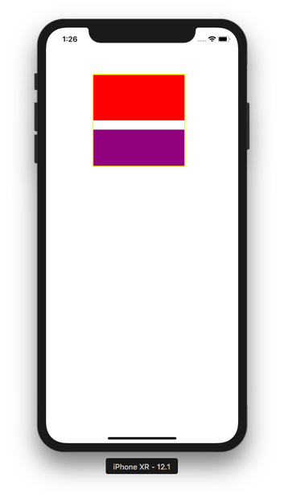
</p>

You can scroll the view inside the scroll view (with the yellow border).

To make the scroll view scrollable, you need to set the content size to be bigger than the frame size of the scroll view.
```swift
sv1.contentSize = CGSize(width: 200, height: 320)
```

You can start the scroll view position with this code:
```swift
sv1.setContentOffset(CGPoint(x: 0, y: 50), animated: true)
```

You need to set content size if you set the size of the frame of the scroll view explicitly.

You can add callback to intercept when you scroll the scroll view.

You need to make the ViewController implements UIScrollViewDelegate.
```swift
class ViewController: UIViewController, UIScrollViewDelegate
```

Then make the delegate of the scroll view to ViewController.
```swift
sv1.delegate = self
```

Add this method.
```swift
    func scrollViewDidScroll(_ scrollView: UIScrollView) {
        print(scrollView.contentOffset)
    }
```

Run it and if you scroll, you would get the content offset printed on the terminal.

Actually you don’t have to set the content size manually. You can use other method: setting the size of the frame of the scroll view and the subviews using constraints.

Let’s add another scrollview:
```swift
        let sv2 = UIScrollView()
        sv2.translatesAutoresizingMaskIntoConstraints = false
        self.view.addSubview(sv2)
        sv2.layer.borderColor = UIColor.yellow.cgColor
        sv2.layer.borderWidth = 2
        NSLayoutConstraint.activate([
            sv2.topAnchor.constraint(equalTo: self.view.topAnchor, constant: 320),
            sv2.leadingAnchor.constraint(equalTo: self.view.leadingAnchor, constant: 100),
            sv2.widthAnchor.constraint(equalToConstant: 200),
            sv2.heightAnchor.constraint(equalToConstant: 200)
        ])
        
        let view3 = UIView(frame: CGRect(x: 0, y: 0, width: 0, height: 0))
        view3.backgroundColor = .red
        view3.translatesAutoresizingMaskIntoConstraints = false
        sv2.addSubview(view3)
        NSLayoutConstraint.activate([
            view3.topAnchor.constraint(equalTo: sv2.topAnchor),
            view3.leadingAnchor.constraint(equalTo: sv2.leadingAnchor),
            view3.widthAnchor.constraint(equalToConstant: 200),
            view3.heightAnchor.constraint(equalToConstant: 150)
        ])
        
        let view4 = UIView(frame: CGRect(x: 0, y: 0, width: 0, height: 0))
        view4.backgroundColor = .purple
        view4.translatesAutoresizingMaskIntoConstraints = false
        sv2.addSubview(view4)
        NSLayoutConstraint.activate([
            view4.topAnchor.constraint(equalTo: view3.bottomAnchor, constant: 20),
            view4.leadingAnchor.constraint(equalTo: sv2.leadingAnchor),
            view4.widthAnchor.constraint(equalToConstant: 200),
            view4.heightAnchor.constraint(equalToConstant: 150),
            view4.bottomAnchor.constraint(equalTo: sv2.bottomAnchor)
        ])
        
        sv2.contentInset = UIEdgeInsets(top: 20, left: 0, bottom: 0, right: 0)
```

The constraints must be complete so that the scroll view knows how big the content size is. If you notice, there is no code to set the content size explicitly.

The content inset of the scroll view is an extra space (white background).
<p align="center">
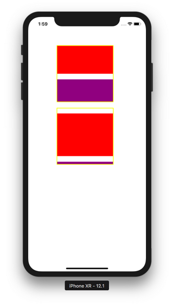
</p>

You can create a scroll view on which you can scroll a certain size. This configuration is called pagination.

Add a variable of page control inside the class of ViewController.
```swift
class ViewController: UIViewController, UIScrollViewDelegate {
    
    let pageControl = UIPageControl()

    ...
```

Add this code in viewDidLoad method:
```swift
        let sv3 = UIScrollView()
        sv3.translatesAutoresizingMaskIntoConstraints = false
        sv3.isPagingEnabled = true
        self.view.addSubview(sv3)
        sv3.layer.borderColor = UIColor.yellow.cgColor
        sv3.layer.borderWidth = 2
        NSLayoutConstraint.activate([
            sv3.topAnchor.constraint(equalTo: sv2.bottomAnchor, constant: 20),
            sv3.leadingAnchor.constraint(equalTo: self.view.leadingAnchor, constant: 100),
            sv3.widthAnchor.constraint(equalToConstant: 200),
            sv3.heightAnchor.constraint(equalToConstant: 200)
        ])
        
        let view5 = UIView(frame: CGRect(x: 0, y: 0, width: 0, height: 0))
        view5.backgroundColor = .red
        view5.translatesAutoresizingMaskIntoConstraints = false
        sv3.addSubview(view5)
        NSLayoutConstraint.activate([
            view5.topAnchor.constraint(equalTo: sv3.topAnchor),
            view5.leadingAnchor.constraint(equalTo: sv3.leadingAnchor),
            view5.widthAnchor.constraint(equalToConstant: 200),
            view5.heightAnchor.constraint(equalToConstant: 150)
        ])
        
        let view6 = UIView(frame: CGRect(x: 0, y: 0, width: 0, height: 0))
        view6.backgroundColor = .purple
        view6.translatesAutoresizingMaskIntoConstraints = false
        sv3.addSubview(view6)
        NSLayoutConstraint.activate([
            view6.topAnchor.constraint(equalTo: sv3.topAnchor),
            view6.leadingAnchor.constraint(equalTo: view5.trailingAnchor),
            view6.widthAnchor.constraint(equalToConstant: 200),
            view6.heightAnchor.constraint(equalToConstant: 150)
        ])
        
        let view7 = UIView(frame: CGRect(x: 0, y: 0, width: 0, height: 0))
        view7.backgroundColor = .green
        view7.translatesAutoresizingMaskIntoConstraints = false
        sv3.addSubview(view7)
        NSLayoutConstraint.activate([
            view7.topAnchor.constraint(equalTo: sv3.topAnchor),
            view7.leadingAnchor.constraint(equalTo: view6.trailingAnchor),
            view7.widthAnchor.constraint(equalToConstant: 200),
            view7.heightAnchor.constraint(equalToConstant: 150),
            view7.trailingAnchor.constraint(equalTo: sv3.trailingAnchor)
        ])
        
        pageControl.translatesAutoresizingMaskIntoConstraints = false
        pageControl.numberOfPages = 3
        pageControl.currentPage = 0
        pageControl.pageIndicatorTintColor = .yellow
        pageControl.currentPageIndicatorTintColor = .blue
        sv3.addSubview(pageControl)
        sv3.delegate = self
        NSLayoutConstraint.activate([
            pageControl.topAnchor.constraint(equalTo: sv3.topAnchor, constant: 140),
            pageControl.centerXAnchor.constraint(equalTo: self.view.centerXAnchor)
        ])
```

To enable the pagination, you can use this code:
```swift
sv3.isPagingEnabled = true
```

This time we scroll in x direction.

We also added a page control. This is an optional UI to indicate which page we are in.
```swift
        pageControl.numberOfPages = 3
        pageControl.currentPage = 0
        pageControl.pageIndicatorTintColor = .yellow
        pageControl.currentPageIndicatorTintColor = .blue
```

So we have a page control that has 3 dots, indicating there are 3 pages inside the scroll view.

To update the page control, we need to add the callback to listen the time when the user stops dragging on this scroll view.
```swift
    func scrollViewDidEndDragging(_ scrollView: UIScrollView, willDecelerate decelerate: Bool) {
        let position = (scrollView.contentOffset.x + (0.5 * 200)) / 200
        pageControl.currentPage = Int(position)
    }
```

200 is the width of one page in the scroll view. 0.5 is half of the page. If you scroll less than half of the page, it will bounce back to the current page.

Run it and you would get this screen.
<p align="center">
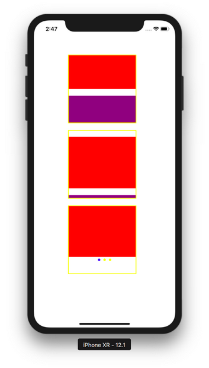
</p>

Scroll it to the right. The page control ui will be updated.
<p align="center">
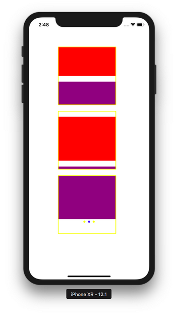
</p>

## Zooming

You can zoom in and zoom out in the scroll view.

Create a new single-view application.

This is the code of ViewController inside ViewController.swift.
```swift
class ViewController: UIViewController, UIScrollViewDelegate {

    override func viewDidLoad() {
        super.viewDidLoad()
        // Do any additional setup after loading the view, typically from a nib.
        
        let sv1 = UIScrollView(frame: CGRect(x: 100, y: 100, width: 200, height: 200))
        self.view.addSubview(sv1)
        sv1.layer.borderColor = UIColor.yellow.cgColor
        sv1.layer.borderWidth = 2
        
        let view1 = UIView(frame: CGRect(x: 50, y: 50, width: 100, height: 100))
        view1.backgroundColor = .red
        view1.tag = 1
        sv1.minimumZoomScale = 1.0
        sv1.maximumZoomScale = 3.0
        sv1.delegate = self
        sv1.addSubview(view1)
        
        sv1.contentSize = CGSize(width: 200, height: 200)
    }

    func viewForZooming(in scrollView: UIScrollView) -> UIView? {
        return scrollView.viewWithTag(1)
    }

}
```

You set the minimum zoom scale and the maximum zoom scale.
```swift
        sv1.minimumZoomScale = 1.0
        sv1.maximumZoomScale = 3.0
```

Then you just need to add this method.
```swift
    func viewForZooming(in scrollView: UIScrollView) -> UIView? {
        return scrollView.viewWithTag(1)
    }
```

Make sure the view controller implements UIScrollViewDelegate. Then make sure the delegate of the scroll view is the view controller class.

Run it and you would get this screen.
<p align="center">
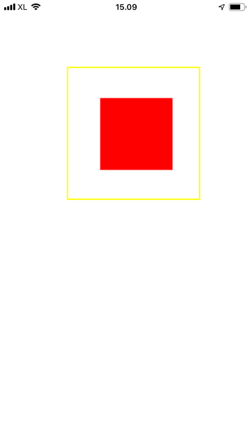
</p>

You can zoom out and zoom in by pinching it with two fingers.
<p align="center">
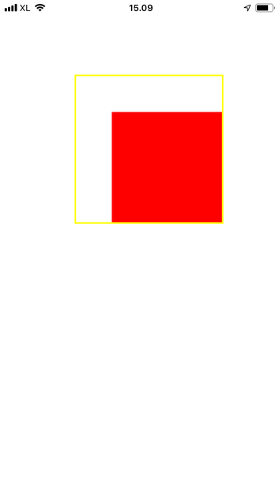
</p>

## Keyboard

One of the most common pattern in a scroll view is to moving up the text field on the bottom.

Create a new single-view application.

This is the code of ViewController class in ViewController.swift.
```swift
class ViewController: UIViewController, UITextFieldDelegate {

    let sv = UIScrollView()
    let textField = UITextField()
    var topConstraint = NSLayoutConstraint()
    var topConstraintKeyboard = NSLayoutConstraint()
    let topDistance : CGFloat = 800
    
    override func viewDidLoad() {
        super.viewDidLoad()
        // Do any additional setup after loading the view, typically from a nib.
        sv.translatesAutoresizingMaskIntoConstraints = false
        self.view.addSubview(sv)
        NSLayoutConstraint.activate([
            sv.topAnchor.constraint(equalTo: self.view.topAnchor),
            sv.leadingAnchor.constraint(equalTo: self.view.leadingAnchor),
            sv.trailingAnchor.constraint(equalTo: self.view.trailingAnchor),
            sv.bottomAnchor.constraint(equalTo: self.view.bottomAnchor)
        ])
        
        let textField = UITextField()
        textField.translatesAutoresizingMaskIntoConstraints = false
        textField.backgroundColor = .blue
        textField.delegate = self
        sv.addSubview(textField)
        topConstraint = textField.topAnchor.constraint(equalTo: sv.topAnchor, constant: topDistance)
        topConstraintKeyboard = textField.topAnchor.constraint(equalTo: sv.topAnchor, constant: 0)
        NSLayoutConstraint.activate([
            textField.centerXAnchor.constraint(equalTo: sv.centerXAnchor),
            textField.widthAnchor.constraint(equalToConstant: 200),
            topConstraint
        ])
        
        NotificationCenter.default.addObserver(self,
                                               selector: #selector(adjustKeyboard(_:)),
                                               name: UIResponder.keyboardWillShowNotification,
                                               object: nil)
        NotificationCenter.default.addObserver(self,
                                               selector: #selector(adjustKeyboard(_:)),
                                               name: UIResponder.keyboardWillHideNotification,
                                               object: nil)
    }
    
    @objc func adjustKeyboard(_ notification: Notification) {
        guard let userInfo = notification.userInfo else { return }
        let keyboardFrame = (userInfo[UIResponder.keyboardFrameEndUserInfoKey] as! NSValue).cgRectValue
        
        topConstraintKeyboard.constant = topDistance - keyboardFrame.size.height
        
        let show = notification.name == UIResponder.keyboardWillShowNotification
        
        if show {
            topConstraint.isActive = false
            topConstraintKeyboard.isActive = true
        } else {
            topConstraint.isActive = true
            topConstraintKeyboard.isActive = false
        }
    }
    
    func textFieldShouldReturn(_ textField: UITextField) -> Bool {
        textField.resignFirstResponder()
        return false
    }

}
```

We need to register the keyboard notification so we know when the keyboard shows up or is hidden with this code:
```swift
        NotificationCenter.default.addObserver(self,
                                               selector: #selector(adjustKeyboard(_:)),
                                               name: UIResponder.keyboardWillShowNotification,
                                               object: nil)
        NotificationCenter.default.addObserver(self,
                                               selector: #selector(adjustKeyboard(_:)),
                                               name: UIResponder.keyboardWillHideNotification,
                                               object: nil)
```

Then we need to define the callback:
```swift
    @objc func adjustKeyboard(_ notification: Notification) {
        guard let userInfo = notification.userInfo else { return }
        let keyboardFrame = (userInfo[UIResponder.keyboardFrameEndUserInfoKey] as! NSValue).cgRectValue
        
        topConstraintKeyboard.constant = topDistance - keyboardFrame.size.height
        
        let show = notification.name == UIResponder.keyboardWillShowNotification
        
        if show {
            topConstraint.isActive = false
            topConstraintKeyboard.isActive = true
        } else {
            topConstraint.isActive = true
            topConstraintKeyboard.isActive = false
        }
    }
```

We need to get the keyboard height from the notification, then we need to change the constraint which is more compatible with the keyboard. If the keyboard shows up, we use the constraint with top distance between text field and the top border of the scroll view with the value subtracted with the height of the keyboard. If the keyboard is hidden, we use the constraint with the default top distance.

Run it and you would get this screen.
<p align="center">
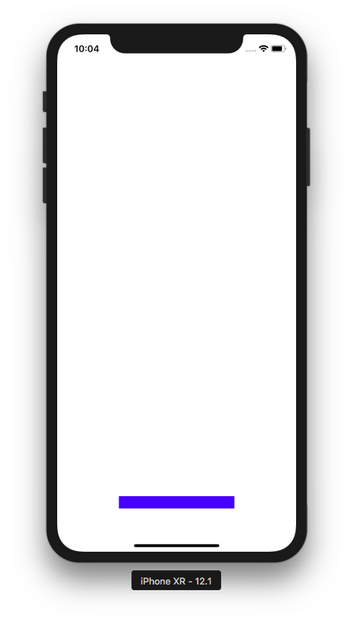
</p>

If you click and type text in the text field, the text field will be lifted up.
<p align="center">
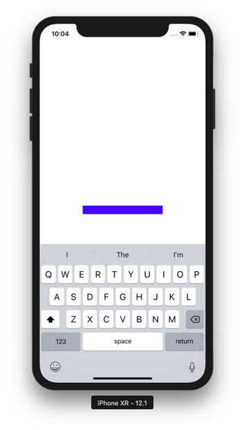
</p>

## Creating ScrollView in StoryBoard

There are many ways to make a scroll view works in a storyboard. I am going to present you a recommended way.

Create a new single-view application.

You can extend the height of the view controller in the story board.

Click the view controller in the left panel, then choose the simulated size configuration tab in the right panel.
<p align="center">
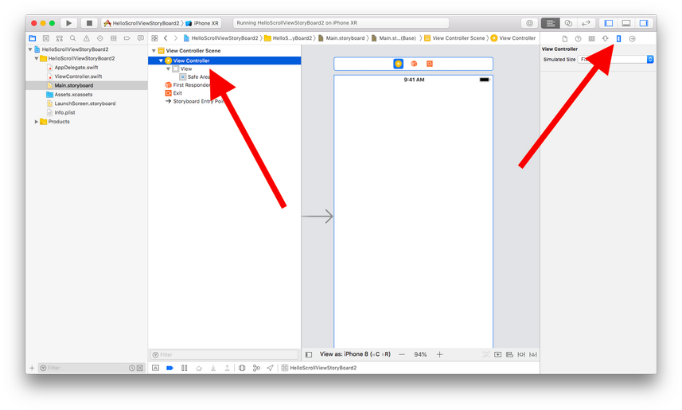
</p>

Change the simulated size from “Fixed” to “Freeform”. Then change the height from 667 to 1067.
<p align="center">
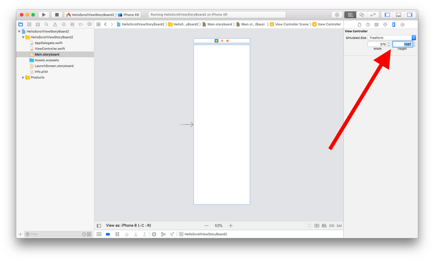
</p>

Add a UIView to the view controller.
<p align="center">
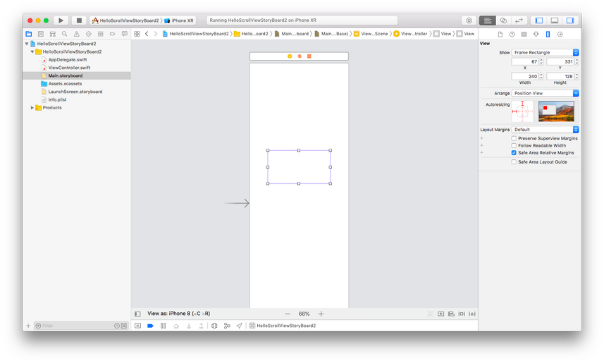
</p>

Add some constraints to UIView so it is stretched to the superview. 
<p align="center">
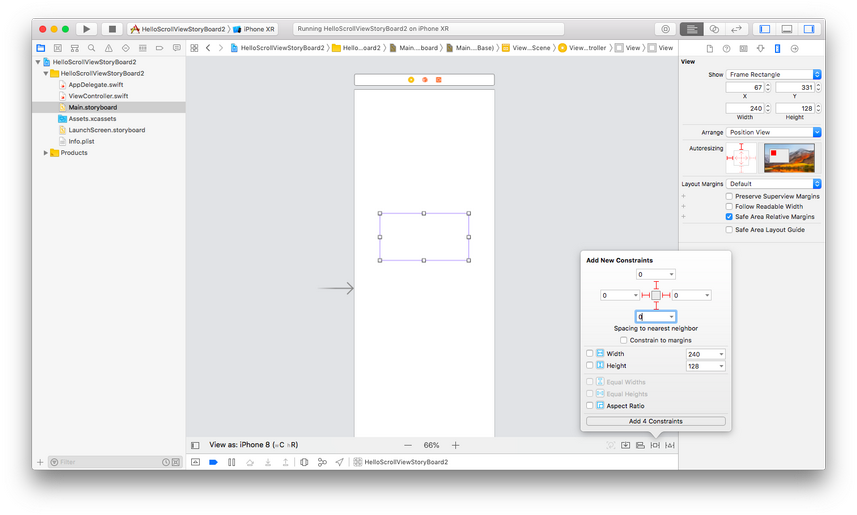
</p>

Then wrap this view with a scroll view.
<p align="center">
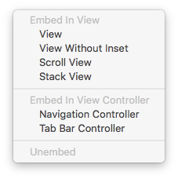
</p>

Then all of your constraints will be gone. You need to add constraints again: 4 constraints for scroll view and 4 constraints for the view inside the scroll view.
<p align="center">
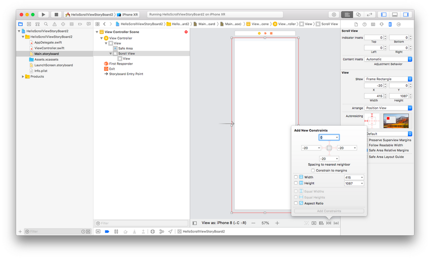
</p>

<p align="center">
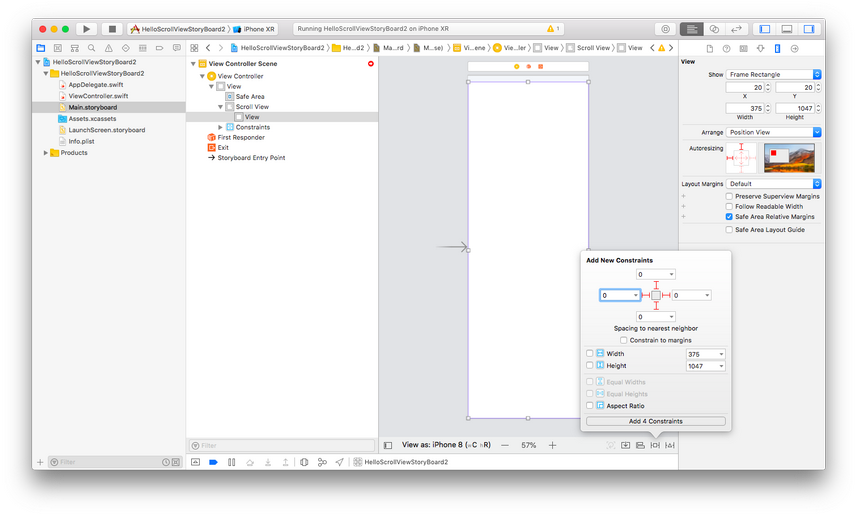
</p>

Now you need to set the constraint of width and height of the view so the scrollview knows the content size implicitly.
<p align="center">
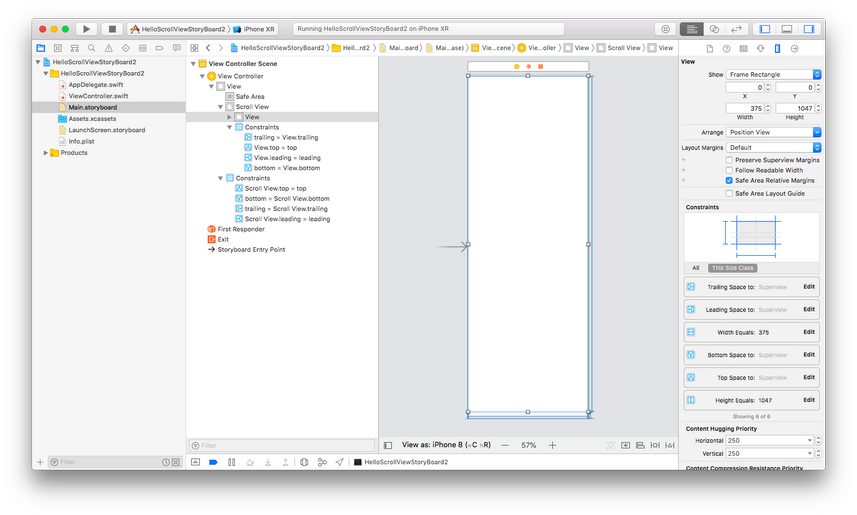
</p>

Or you could add subviews inside this view with the constraints so the big view has the size constraint implicitly.

Let’s remove the height and width constraints. Then add subviews inside this big view with their constraints.
<p align="center">
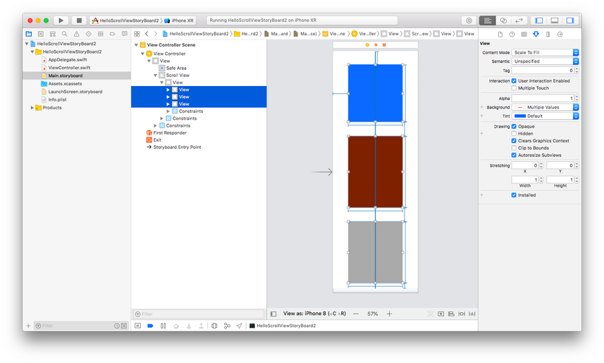
</p>

If you run it, you would get this screen.
<p align="center">
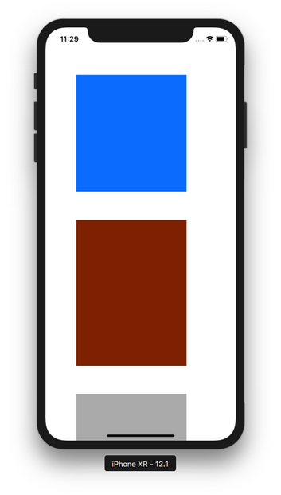
</p>

You can scroll it.

# Optional Materials

https://developer.apple.com/documentation/uikit/uiscrollview

# Exercise

1. Create a horizontal scroll view like this. These screenshots are from Nike Training app.
<p align="center">


</p>