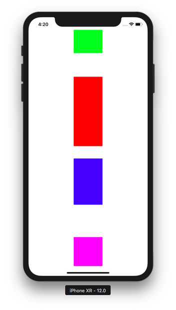

# StackView

You use StackView to create constraints which can arrange all views in distribute manner. It’s like flexbox in CSS.

## Creating UIStackView in Code

Create a new single view application in Xcode. Then create a new file, called MyView.swift. This should be a subview of UIView.

Put this code inside MyView.swift.
```swift
import UIKit

class MyView: UIView {
    
    var height = 1.0
    var width = 1.0
    
    override var intrinsicContentSize: CGSize {
        return CGSize(width: width, height: height)
    }

}
```

Then in viewDidLoad method of ViewController.swift, add this code to create 4 views based on our custom UIView:
```swift
        let view1 = MyView(frame: CGRect(x: 0, y: 0, width: 0, height: 0))
        view1.backgroundColor = .green
        view1.translatesAutoresizingMaskIntoConstraints = false
        view1.height = 80
        view1.width = 100
        self.view.addSubview(view1)
        
        let view2 = MyView(frame: CGRect(x: 0, y: 0, width: 0, height: 0))
        view2.backgroundColor = .red
        view2.translatesAutoresizingMaskIntoConstraints = false
        view2.height = 240
        view2.width = 100
        self.view.addSubview(view2)
        
        let view3 = MyView(frame: CGRect(x: 0, y: 0, width: 0, height: 0))
        view3.backgroundColor = .blue
        view3.translatesAutoresizingMaskIntoConstraints = false
        view3.height = 160
        view3.width = 100
        self.view.addSubview(view3)
        
        let view4 = MyView(frame: CGRect(x: 0, y: 0, width: 0, height: 0))
        view4.backgroundColor = .magenta
        view4.translatesAutoresizingMaskIntoConstraints = false
        view4.height = 100
        view4.width = 100
        self.view.addSubview(view4)
```

Here, we use intrinsic content to set the width and the height of our views.

### Intrinsic Content Size

Some views (like button, image view) have content that affects the size of that view. The content of the button is the label of the button. The content of the image view is the image itself. The layout system is not aware of this content. So intrinsic content size is the way the view to tell the layout system the size of the content that will affect the size of the view.

UIView does not have intrinsic content size so we have to simulate it. UIStackView (most of the time) needs intrinsic content size of its arranged views.

When we add an instance of UIView and add constraints to it, other than location constraints (for example: “Top Space to Safe Area”), you need to add size constraints (width and height constraints) as well. But for other type of views like UIButton, you don’t need to add size constraints. You can try to add button on the screen.
<p align="center">

</p>

<p align="center">

</p>

<p align="center">

</p>

As I have described in Layout lesson previously, if you do the same to UIView, you need to add width and height constraints as well. But UIButton has intrinsic content size. That’s why you don’t need to add height and width constraints to UIButton instance.

Add this code under the code you have added in viewDidLoad method:
```swift
        let views : [UIView] = [view1, view2, view3, view4]
        
        let sv = UIStackView(arrangedSubviews: views)
        sv.axis = .vertical
        sv.alignment = .center
        sv.distribution = .equalSpacing
        sv.translatesAutoresizingMaskIntoConstraints = false
        
        self.view.addSubview(sv)
        
        NSLayoutConstraint.activate([
            sv.topAnchor.constraint(equalTo: self.view.safeAreaLayoutGuide.topAnchor),
            sv.bottomAnchor.constraint(equalTo: self.view.safeAreaLayoutGuide.bottomAnchor),
            sv.leadingAnchor.constraint(equalTo: self.view.layoutMarginsGuide.leadingAnchor),
            sv.trailingAnchor.constraint(equalTo: self.view.layoutMarginsGuide.trailingAnchor)
        ])
```

Run it and you would get this result.
<p align="center">

</p>

You add views to StackView using arrangedSubviews parameter.
```swift
        let views : [UIView] = [view1, view2, view3, view4]
        
        let sv = UIStackView(arrangedSubviews: views)
```

### Axis

You put all views you want to arrange in the stack view with this statement.
```swift
        sv.axis = .vertical
```

This is the orientation of arranged views.  You can change it to horizontal like this code:
```swift
        sv.axis = .horizontal
```

You would this result.
<p align="center">

</p>

### Alignment

Let’s turn it back to vertical orientation.
```swift
        sv.alignment = .center
```

This is the alignment in contrast with the axis orientation of the arranged views. We can change it to  leading alignment with this code.
```swift
        sv.alignment = .leading
```

<p align="center">

</p>

If you change it to trailing with this code:
```swift
        sv.alignment = .trailing
```

you would get this result.
<p align="center">

</p>

<p align="center">

</p>

If you change it to filling with this code:
```swift
        sv.alignment = .fill
```

you would get this result.
<p align="center">

</p>

### Distribution

Until now, you already used equal spacing distribution with this code.
```swift
sv.distribution = .equalSpacing
```

There are other values as well for distribution. One of examples is equal centering.
```swift
sv.distribution = .equalCentering
```

You would get this result.
<p align="center">

</p>


In equal spacing distribution, Stack View distributes views equally based on the spacing between the views. So that’s why the spacing between views in equal spacing distribution is same and equal.

In equal centering distribution, Stack View distributes views equally based on the center of the arranged views. That’s why the spacing between views is not same.

Other value for distribution is fill.
```swift
sv.distribution = .fill
```

You would get this result.
<p align="center">

</p>

As you can see, the green view (which supposed to have the height of 80) is stretched to occupies the rest of spacing in Stack View.

Other value for distribution is filling proportionally.
```swift
sv.distribution = .fillProportionally
```

You would get this result.
<p align="center">

</p>

All views are stretched accordingly. For example, to cover the the remaining spaces, each view could be stretched 15% from the original size.

Other value for distribution is filling equally.
```swift
sv.distribution = .fillEqually
```

You would get this result.
<p align="center">

</p>

You can add some spacing between these views with spacing property like this code:
```swift
sv.spacing = 20
```

You would get this result.
<p align="center">

</p>

The rest of the code is to layout the Stack View inside the screen.
```swift
        self.view.addSubview(sv)
        
        NSLayoutConstraint.activate([
            sv.topAnchor.constraint(equalTo: self.view.safeAreaLayoutGuide.topAnchor),
            sv.bottomAnchor.constraint(equalTo: self.view.safeAreaLayoutGuide.bottomAnchor),
            sv.leadingAnchor.constraint(equalTo: self.view.layoutMarginsGuide.leadingAnchor),
            sv.trailingAnchor.constraint(equalTo: self.view.layoutMarginsGuide.trailingAnchor)
        ])
```

## Creating UIStackView in StoryBoard

Let’s create a single-view application project in Xcode.

Add UIStackView instance (the vertical one) to storyboard.
<p align="center">

</p>

Stretch the stack view to every direction.
<p align="center">

</p>

Then add constraints to every side with Autolayout tools.
<p align="center">

</p>

Make sure the alignment of the Stack View is Center and the distribution of the Stack View is Equal Spacing.
<p align="center">

</p>

Add a button.
<p align="center">

</p>

Make sure you add buttons inside Stack View.
<p align="center">

</p>

Change the background color of the buttons.
<p align="center">

</p>

<p align="center">

</p>

If you change the alignment from Center to Leading, you would get this result.
<p align="center">

</p>

If you change the alignment to Trailing, you would get this result.
<p align="center">

</p>

If you change the alignment to Fill, you would get this result.
<p align="center">

</p>

Change the alignment back to Center, then change the distribution to Fill Equally.
<p align="center">

</p>

You could also add another Stack View inside Stack View. Add Horizontal Stack View to your Vertical Stack View. Then add some buttons inside this Horizontal Stack View.
<p align="center">

</p>

This Horizontal Stack View has its own alignment and distribution. You can change the alignment of Horizontal Stack View from Fill To Bottom. Then you would get this result.
<p align="center">

</p>

### Embed Views with Stack View

Create a new single view application. Then in the story board, add some buttons.
<p align="center">

</p>

Then select all buttons and click Embed tool in Autolayout tool. Choose “Stack View”.
<p align="center">

</p>

All your buttons would be put inside the stack view. Of course, you need to give constraints to the stack view.

# Optional Materials

https://developer.apple.com/documentation/uikit/uistackview

https://www.raywenderlich.com/508-uistackview-tutorial-introducing-stack-views

https://www.youtube.com/watch?v=a-W5SciZrXo

https://www.youtube.com/watch?v=QN7Q1rQ89aQ

https://www.youtube.com/watch?v=Argw_Rz_P1w


# Exercises

1. Create a view mainly using the combination of Stack Views and constraints and the view should look like this. The students use buttons, text views, and labels inside the stack views.
<p align="center">

</p>