# TableView

TableView is a view to display list.

## Built-In Cell Type

Each row in tableview is a cell. Cell has built-in type.

Create a single-view application. Add a new file. Name it TableViewController. Make it subclass of UITableViewController.

Add image “swords.png” to Assets.xcassets.

Then add a new file again. Name it TableViewCell.swift. Make it subclass of UITableViewCell.

This is the code of TableViewCell class.
```swift
class TableViewCell: UITableViewCell {

    override func awakeFromNib() {
        super.awakeFromNib()
    }
    
    override init(style: UITableViewCell.CellStyle, reuseIdentifier: String?) {
        //super.init(style: .default, reuseIdentifier: reuseIdentifier)
        //super.init(style: .subtitle, reuseIdentifier: reuseIdentifier)
        super.init(style: .value1, reuseIdentifier: reuseIdentifier)
        //super.init(style: .value2, reuseIdentifier: reuseIdentifier)
    }
    
    required init?(coder aDecoder: NSCoder) {
        super.init(coder: aDecoder)
    }
    
    override func setSelected(_ selected: Bool, animated: Bool) {
        super.setSelected(selected, animated: animated)
    }

}
```

There are four built-in cell types: default, subtitle, value1, value2. You can try each cell type. In this case we are using value1 style.

Then this is the code for TableViewController.swift.

In the viewDidLoad method we register the TableViewCell for our table view.
```swift
self.tableView.register(TableViewCell.self, forCellReuseIdentifier: "reuseIdentifier")
```

Then we add methods to describe how many sections and rows this table view has. Our table view has 1 section and that section has 25 rows.
```swift
    override func numberOfSections(in tableView: UITableView) -> Int {
        return 1
    }

    override func tableView(_ tableView: UITableView, numberOfRowsInSection section: Int) -> Int {
        return 25
    }
```

Then we add a method to describe the cell.
```swift
    override func tableView(_ tableView: UITableView, cellForRowAt indexPath: IndexPath) -> UITableViewCell {
        let cell = tableView.dequeueReusableCell(withIdentifier: "reuseIdentifier", for: indexPath)
        
        cell.textLabel!.text = "Halo! \(indexPath.row)"
        cell.detailTextLabel!.text = "downhere"
        cell.imageView!.image = UIImage(named: "swords")

        return cell
    }
```

We load the cell with dequeueReusableCell method of tableView object. Then we set the values for textLabel, detailTextLabel, and imageView properties of cell object. IndexPath object indicates on which section and row cell is.

Then you need to modify AppDelegate.swift so the app will load our TableViewController instead of ViewController.

Modify application method to look like this:
```swift
    func application(_ application: UIApplication, didFinishLaunchingWithOptions launchOptions: [UIApplication.LaunchOptionsKey: Any]?) -> Bool {
        // Override point for customization after application launch.
        self.window = self.window ?? UIWindow()
        self.window!.rootViewController = TableViewController()
        self.window!.makeKeyAndVisible()
        return true
    }
```

Run it and you would get this screen.
<p align="center">
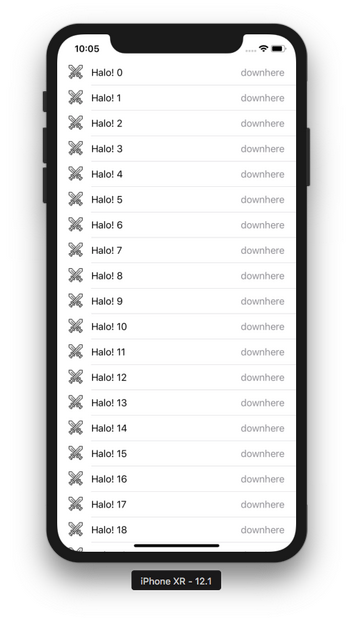
</p>

If you change the built-in style from value1 to subtitle, you would get this screen:
<p align="center">
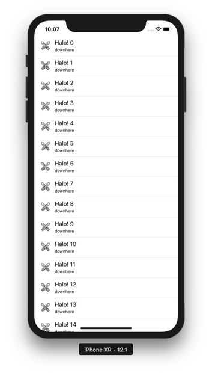
</p>

You can configure the table view. Add this code in viewDidLoad method:
```swift
        self.tableView.separatorColor = .yellow
        self.tableView.rowHeight = 100
        self.tableView.backgroundColor = .purple
        self.tableView.tableHeaderView = UISwitch()
```

Run the application and you would get this screen:
<p align="center">
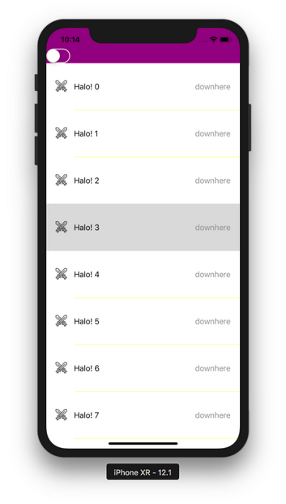
</p>

You can also configure cell more heavily. Add this code inside the method to show the cell.
```swift
        cell.accessoryType = .disclosureIndicator
        cell.indentationLevel = 4
        cell.separatorInset = UIEdgeInsets(top: 0, left: 100, bottom: 0, right: 0)
        cell.backgroundColor = UIColor.cyan
```

Run the application and you will get this screen.
<p align="center">
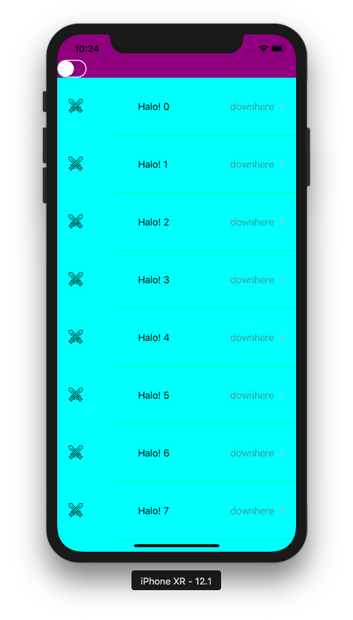
</p>

## Modifying Cell via layoutSubviews Method

We can modify cell with its layoutSubviews method.

Create a single-view application. Add TableViewController, TableViewCell just like before. Modify AppDelegate just like before.

For TableViewController, this is the code.
```swift
class TableViewController: UITableViewController {
    
    override func viewDidLoad() {
        super.viewDidLoad()

        self.tableView.register(TableViewCell.self, forCellReuseIdentifier: "reuseIdentifier")
    }
    
    override func numberOfSections(in tableView: UITableView) -> Int {
        return 1
    }

    override func tableView(_ tableView: UITableView, numberOfRowsInSection section: Int) -> Int {
        return 25
    }

    override func tableView(_ tableView: UITableView, cellForRowAt indexPath: IndexPath) -> UITableViewCell {
        let cell = tableView.dequeueReusableCell(withIdentifier: "reuseIdentifier", for: indexPath)
        
        cell.textLabel!.text = "Halo! \(indexPath.row)"
        cell.detailTextLabel!.text = "downhere"
        cell.imageView!.image = UIImage(named: "swords")
        
        return cell
    }

}
```

Don’t forget to add image “swords.png” to Assets.xcassets.

This is the code for TableViewCell.
```swift
class TableViewCell: UITableViewCell {

    override func awakeFromNib() {
        super.awakeFromNib()
        // Initialization code
    }
    
    override init(style: UITableViewCell.CellStyle, reuseIdentifier: String?) {
        super.init(style: .value1, reuseIdentifier: reuseIdentifier)
    }
    
    required init?(coder aDecoder: NSCoder) {
        super.init(coder: aDecoder)
    }
    
    override func layoutSubviews() {
        super.layoutSubviews()
        let cvb = self.contentView.bounds
        self.imageView!.frame.origin.x = cvb.size.width / 2
        self.textLabel!.frame.origin.x = 0
    }
    
    override func setSelected(_ selected: Bool, animated: Bool) {
        super.setSelected(selected, animated: animated)
    }

}
```

Focus on the layoutSubviews method. Here we changed the position of imageView and textLabel.

Run the application and you will get this screen.
<p align="center">
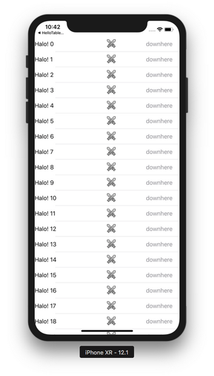
</p>

## Modifying Cell via tableView Method

You can also modify the cell inside the tableView method which shows cell.

Create a single-view application. Add TableViewController just like before. Modify AppDelegate just like before. This time you don’t need to add TableViewCell. You also don’t need to add image to Assets.xcassets.

This is the code for TableViewController.
```swift
class TableViewController: UITableViewController {
    
    override func viewDidLoad() {
        super.viewDidLoad()

        self.tableView.register(UITableViewCell.self, forCellReuseIdentifier: "reuseIdentifier")
    }

    override func numberOfSections(in tableView: UITableView) -> Int {
        return 1
    }

    override func tableView(_ tableView: UITableView, numberOfRowsInSection section: Int) -> Int {
        return 25
    }

    override func tableView(_ tableView: UITableView, cellForRowAt indexPath: IndexPath) -> UITableViewCell {
        let cell = tableView.dequeueReusableCell(withIdentifier: "reuseIdentifier", for: indexPath)
        
        if cell.viewWithTag(1) == nil {
            let label = UILabel()
            label.tag = 1
            label.translatesAutoresizingMaskIntoConstraints = false
            cell.contentView.addSubview(label)
            NSLayoutConstraint.activate([
                label.centerXAnchor.constraint(equalTo: cell.contentView.centerXAnchor),
                label.centerYAnchor.constraint(equalTo: cell.contentView.centerYAnchor)])
        }
        let label = cell.viewWithTag(1) as! UILabel
        label.text = "Halo \(indexPath.row)"

        return cell
    }

}
```

In this case, you register UITableViewCell in the table view not custom class: TableViewCell.

In the method to show the cell, you add a label. You add any subview to contentView property of the cell. To make sure that you don’t recreate the same subview multiple times, you set the tag of the subview.

Run the application and you will get this screen.
<p align="center">
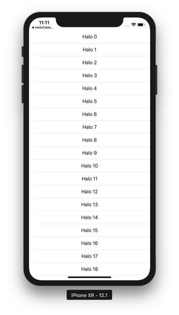
</p>

## Modifying Cell via Nib

You can also use Nib to modify cell.

Create a single-view application. Add TableViewController. Modify AppDelegate. Then add TableViewCell. This time check “Also create a XIB file”. Add a label and an image view.
<p align="center">
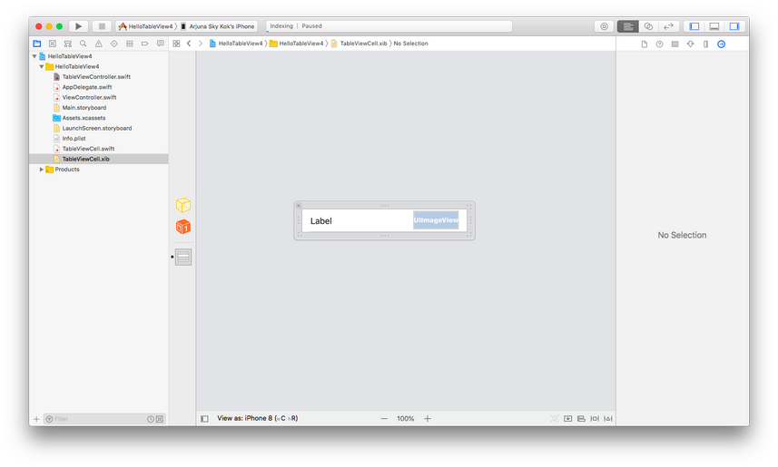
</p>

Link this label and image view to TableViewCell.swift file.
<p align="center">
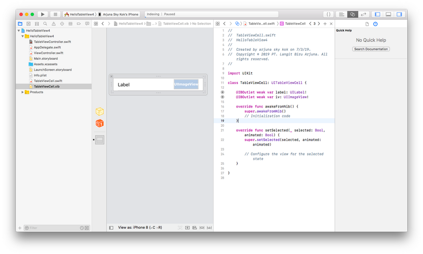
</p>

This is the code for TableViewController.
```swift
class TableViewController: UITableViewController {
    
    override func viewDidLoad() {
        super.viewDidLoad()

        self.tableView.register(UINib(nibName: "TableViewCell", bundle: nil), forCellReuseIdentifier: "reuseIdentifier")
        
    }

    override func numberOfSections(in tableView: UITableView) -> Int {
        return 1
    }

    override func tableView(_ tableView: UITableView, numberOfRowsInSection section: Int) -> Int {
        return 25
    }

    override func tableView(_ tableView: UITableView, cellForRowAt indexPath: IndexPath) -> UITableViewCell {
        let cell = tableView.dequeueReusableCell(withIdentifier: "reuseIdentifier", for: indexPath) as! TableViewCell

        let label = cell.label!
        label.text = "Halo \(indexPath.row)"
        
        let imageView = cell.iv!
        imageView.image = UIImage(named: "swords")

        return cell
    }

}
```

This time you register the nib of cell to the table view.
```swift
self.tableView.register(UINib(nibName: "TableViewCell", bundle: nil), forCellReuseIdentifier: "reuseIdentifier")
```

Then in the tableView method to show the cell, you just access the subview that you have put in the nib.
```swift
        let imageView = cell.iv!
        imageView.image = UIImage(named: "swords")
```

Run the application and you will get this screen.
<p align="center">
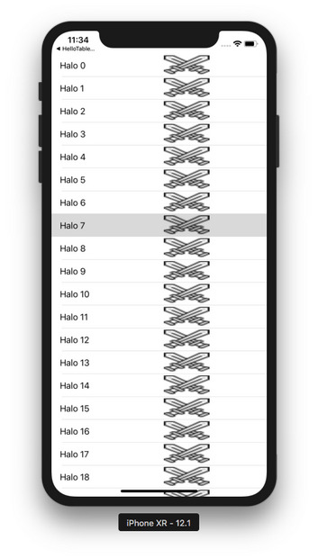
</p>

## Sections and Rows

Table view has sections and rows.

Create a single-view application. Add TableViewController. 

This is the code for TableViewController.
```swift
class TableViewController: UITableViewController {
    
    let currencies = ["usd", "yen", "euro", "idr"]
    let crypto = ["bitcoin", "ethereum", "dogecoin", "litecoin"]
    
    override func viewDidLoad() {
        super.viewDidLoad()

        self.tableView.register(UITableViewCell.self, forCellReuseIdentifier: "reuseIdentifier")
        
    }

    override func numberOfSections(in tableView: UITableView) -> Int {
        return 2
    }

    override func tableView(_ tableView: UITableView, numberOfRowsInSection section: Int) -> Int {
        if section == 0 {
            return currencies.count
        } else {
            return crypto.count
        }
    }

    override func tableView(_ tableView: UITableView, cellForRowAt indexPath: IndexPath) -> UITableViewCell {
        let cell = tableView.dequeueReusableCell(withIdentifier: "reuseIdentifier", for: indexPath)

        if indexPath.section == 0 {
            cell.textLabel!.text = currencies[indexPath.row]
        } else {
            cell.textLabel!.text = crypto[indexPath.row]
        }

        return cell
    }
    
    override func tableView(_ tableView: UITableView, titleForHeaderInSection section: Int) -> String? {
        if section == 0 {
            return "Normal Currencies"
        } else {
            return "Crypto Currencies"
        }
    }
    
    override func sectionIndexTitles(for tableView: UITableView) -> [String]? {
        return ["N", "C"]
    }

}
```

You created the source of data.
```swift
    let currencies = ["usd", "yen", "euro", "idr"]
    let crypto = ["bitcoin", "ethereum", "dogecoin", "litecoin"]
```

You register UITableViewCell for this table view controller.
```swift
self.tableView.register(UITableViewCell.self, forCellReuseIdentifier: "reuseIdentifier")
```

Now we have two sections.
```swift
    override func numberOfSections(in tableView: UITableView) -> Int {
        return 2
    }
```

For each sections, the table view has different rows amount for different section.
```swift
    override func tableView(_ tableView: UITableView, numberOfRowsInSection section: Int) -> Int {
        if section == 0 {
            return currencies.count
        } else {
            return crypto.count
        }
    }
```

For showing cell, we make sure we use the section information.
```swift
        if indexPath.section == 0 {
            cell.textLabel!.text = currencies[indexPath.row]
        } else {
            cell.textLabel!.text = crypto[indexPath.row]
        }
```

For the title of the section, we can use this method:
```swift
    override func tableView(_ tableView: UITableView, titleForHeaderInSection section: Int) -> String? {
        if section == 0 {
            return "Normal Currencies"
        } else {
            return "Crypto Currencies"
        }
    }
```

For the index of section, we can use this method:
```swift
    override func sectionIndexTitles(for tableView: UITableView) -> [String]? {
        return ["N", "C"]
    }
```

Run the application and you will get this screen.
<p align="center">
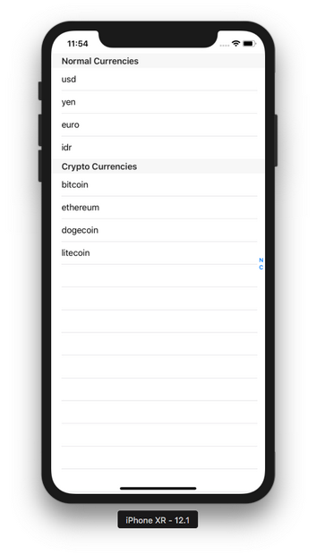
</p>

## Reloading Data in Table View

To reload data, you need to update the data source as well so they sync harmoniously.

Create a single-view application. Edit AppDelegate as usual. The code of TableViewController is here.
```swift
class TableViewController: UITableViewController {
    
    let crypto = ["bitcoin", "ethereum", "dogecoin", "litecoin"]
    let currencies = ["usd", "yen", "yuan", "idr", "euro", "sgd"]
    var useCrypto = false
    
    override func viewDidLoad() {
        super.viewDidLoad()

        self.tableView.register(UITableViewCell.self, forCellReuseIdentifier: "reuseIdentifier")
        let uiswitch = UISwitch()
        uiswitch.isOn = useCrypto
        uiswitch.addTarget(self, action: #selector(switchValueDidChange(_:)), for: .valueChanged)
        self.tableView.tableHeaderView = uiswitch
        self.tableView.refreshControl = UIRefreshControl()
        self.tableView.refreshControl!.addTarget(self, action: #selector(doRefresh), for: .valueChanged)
    }
    
    @objc func switchValueDidChange(_: UISwitch) {
        useCrypto = !useCrypto
        self.tableView.reloadData()
    }
    
    @objc func doRefresh(_ sender: Any) {
        (self.tableView.tableHeaderView! as! UISwitch).setOn(!useCrypto, animated: true)
        useCrypto = !useCrypto
        self.tableView.reloadData()
        (sender as! UIRefreshControl).endRefreshing()
    }

    override func numberOfSections(in tableView: UITableView) -> Int {
        return 1
    }

    override func tableView(_ tableView: UITableView, numberOfRowsInSection section: Int) -> Int {
        if useCrypto {
            return crypto.count
        } else {
            return currencies.count
        }
    }

    override func tableView(_ tableView: UITableView, cellForRowAt indexPath: IndexPath) -> UITableViewCell {
        let cell = tableView.dequeueReusableCell(withIdentifier: "reuseIdentifier", for: indexPath)

        if useCrypto {
            cell.textLabel!.text = crypto[indexPath.row]
        } else {
            cell.textLabel!.text = currencies[indexPath.row]
        }

        return cell
    }

}
```

We created two ways to change data in the table view.
```swift
        let uiswitch = UISwitch()
        uiswitch.isOn = useCrypto
        uiswitch.addTarget(self, action: #selector(switchValueDidChange(_:)), for: .valueChanged)
        self.tableView.tableHeaderView = uiswitch
        self.tableView.refreshControl = UIRefreshControl()
        self.tableView.refreshControl!.addTarget(self, action: #selector(doRefresh), for: .valueChanged)
```

The first control to change the data is switch. The second control to change the data is refresh control.

The callback for switch is this method.
```swift
    @objc func switchValueDidChange(_: UISwitch) {
        useCrypto = !useCrypto
        self.tableView.reloadData()
    }
```

The callback for updating table is this method.
```swift
    @objc func doRefresh(_ sender: Any) {
        (self.tableView.tableHeaderView! as! UISwitch).setOn(!useCrypto, animated: true)
        useCrypto = !useCrypto
        self.tableView.reloadData()
        (sender as! UIRefreshControl).endRefreshing()
    }
```

Then when showing the cell, we take into account of useCrypto boolean variable.
```swift
        if useCrypto {
            cell.textLabel!.text = crypto[indexPath.row]
        } else {
            cell.textLabel!.text = currencies[indexPath.row]
        }
```

Run the application and you will get this screen.
<p align="center">
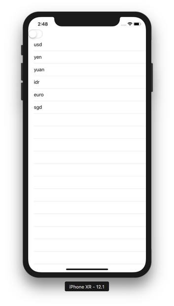
</p>

Pull down to refresh the table or tap the switch control. The data in the table view will change.
<p align="center">
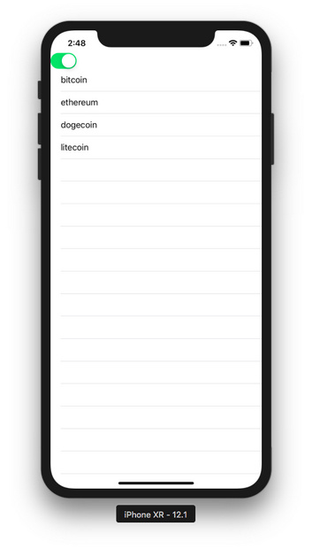
</p>

## Row Height

Row in table view can have different height.

Create a single view app. Modify AppDelegate as usual. Add TableViewController.

This is the code for TableViewController.
```swift
class TableViewController: UITableViewController {
    
    let crypto = ["bitcoin", "ethereum", "dogecoin", "long name really long name really long name I mean really long name super long name", "litecoin"]
    
    override func viewDidLoad() {
        super.viewDidLoad()

        self.tableView.register(UITableViewCell.self, forCellReuseIdentifier: "reuseIdentifier")
    }

    override func numberOfSections(in tableView: UITableView) -> Int {
        return 1
    }

    override func tableView(_ tableView: UITableView, numberOfRowsInSection section: Int) -> Int {
        return crypto.count
    }

    override func tableView(_ tableView: UITableView, cellForRowAt indexPath: IndexPath) -> UITableViewCell {
        let cell = tableView.dequeueReusableCell(withIdentifier: "reuseIdentifier", for: indexPath)

        cell.textLabel!.text = crypto[indexPath.row]
        if indexPath.row == 3 {
            cell.textLabel!.numberOfLines = 2
        }

        return cell
    }
    
    override func tableView(_ tableView: UITableView, heightForRowAt indexPath: IndexPath) -> CGFloat {
        if indexPath.row == 3 {
            return 200
        } else {
            return 75
        }
    }

}
```

You use different row height by this method.
```swift
    override func tableView(_ tableView: UITableView, heightForRowAt indexPath: IndexPath) -> CGFloat {
        if indexPath.row == 3 {
            return 200
        } else {
            return 75
        }
    }
```

Run the application and you will get this screen.
<p align="center">
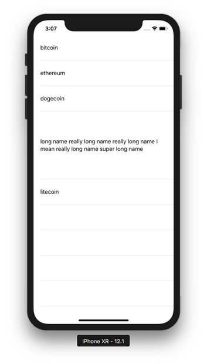
</p>

## Selecting Row

We can present a view controller when we select the row in the table view.

Create a single-view application. Modify AppDelegate as usual. Add TableViewController. This is the code.
```swift
class TableViewController: UITableViewController {
    
    let crypto = ["bitcoin", "ethereum", "dogecoin", "litecoin"]
    
    override func viewDidLoad() {
        super.viewDidLoad()

        self.tableView.register(UITableViewCell.self, forCellReuseIdentifier: "reuseIdentifier")
    }

    override func numberOfSections(in tableView: UITableView) -> Int {
        return 1
    }

    override func tableView(_ tableView: UITableView, numberOfRowsInSection section: Int) -> Int {
        return crypto.count
    }

    override func tableView(_ tableView: UITableView, cellForRowAt indexPath: IndexPath) -> UITableViewCell {
        let cell = tableView.dequeueReusableCell(withIdentifier: "reuseIdentifier", for: indexPath)

        cell.textLabel!.text = crypto[indexPath.row]

        return cell
    }
    
    override func tableView(_ tableView: UITableView, didSelectRowAt indexPath: IndexPath) {
        let v = ViewController()
        v.string = crypto[indexPath.row]
        self.present(v, animated: true, completion: nil)
    }

}
```

The method you need to implement for selecting callback is this method.
```swift
    override func tableView(_ tableView: UITableView, didSelectRowAt indexPath: IndexPath) {
        let v = ViewController()
        v.string = crypto[indexPath.row]
        self.present(v, animated: true, completion: nil)
    }
```

Then you need to implement ViewController. This is the code.
```swift
class ViewController: UIViewController {
    
    var string = ""

    override func viewDidLoad() {
        super.viewDidLoad()
        // Do any additional setup after loading the view, typically from a nib.
        
        let label = UILabel(frame: CGRect(x: 100, y: 200, width: 100, height: 20))
        label.text = string
        self.view.addSubview(label)
        self.view.backgroundColor = .white
        
        let button = UIButton()
        button.translatesAutoresizingMaskIntoConstraints = false
        button.setTitle("Dismiss", for: .normal)
        button.backgroundColor = .green
        self.view.addSubview(button)
        NSLayoutConstraint.activate([
            button.leftAnchor.constraint(equalTo: self.view.leftAnchor),
            button.topAnchor.constraint(equalTo: self.view.topAnchor, constant: 50)
        ])
        button.addTarget(self, action: #selector(dismissButtonClick(_:)), for: .touchUpInside)
    }
    
    @objc func dismissButtonClick(_: UIButton) {
        self.presentingViewController?.dismiss(animated: true, completion: nil)
    }

}
```

Run the application and you will get this screen.
<p align="center">
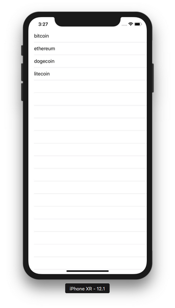
</p>

Click one of the rows and you will get this screen.
<p align="center">
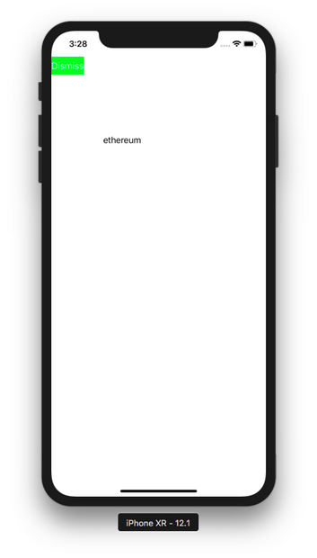
</p>

## Editing, Deleting, and Moving Rows

You can edit, delete and move rows.

Create a new single-view application.

Edit AppDelegate. Make the application method look like this.
```swift
    func application(_ application: UIApplication, didFinishLaunchingWithOptions launchOptions: [UIApplication.LaunchOptionsKey: Any]?) -> Bool {
        // Override point for customization after application launch.
        let tableViewController = TableViewController()
        let navigationController = UINavigationController(rootViewController: tableViewController)
        self.window = self.window ?? UIWindow()
        self.window!.rootViewController = navigationController
        self.window!.makeKeyAndVisible()
        return true
    }
```


This time we added navigation controller.

Add TableViewController.

Add a source data for rows in the table view.
```swift
class TableViewController: UITableViewController {
    
    var crypto = ["bitcoin", "ethereum", "dogecoin", "litecoin"]
```

Add a default edit button on navigation item.
```swift
    override func viewDidLoad() {
        super.viewDidLoad()

        self.tableView.register(UITableViewCell.self, forCellReuseIdentifier: "reuseIdentifier")
        self.navigationItem.rightBarButtonItem = self.editButtonItem
    }
```

For showing icon style in editing mode, add this method.
```swift
    override func tableView(_ tableView: UITableView, editingStyleForRowAt indexPath: IndexPath) -> UITableViewCell.EditingStyle {
        if indexPath.row % 2 == 0 {
            return .delete
        } else {
            return .insert
        }
    }
```

To add callback when you click the editing action, add this method.
```swift
    override func tableView(_ tableView: UITableView, commit editingStyle: UITableViewCell.EditingStyle, forRowAt indexPath: IndexPath) {
        if editingStyle == .delete {
            print("delete")
            self.crypto.remove(at: indexPath.row)
            self.tableView.performBatchUpdates({self.tableView.deleteRows(at: [indexPath], with: .top)}, completion: nil)
        } else {
            print("insert")
            let newIndexPath = IndexPath(row: indexPath.row + 1, section: indexPath.section)
            self.crypto.insert("new item", at: newIndexPath.row)
            self.tableView.performBatchUpdates({self.tableView.insertRows(at: [newIndexPath], with: .top)}, completion: nil)
        }
        print(indexPath.row)
    }
```

To delete or insert rows, wrap it inside performBatchUpdates.

You can also add action buttons when swiping the rows.
```swift
    override func tableView(_ tableView: UITableView, trailingSwipeActionsConfigurationForRowAt indexPath: IndexPath) -> UISwipeActionsConfiguration? {
        let deleteAction = UIContextualAction(style: .destructive, title: nil) {
            action, view, completion in
            self.crypto.remove(at: indexPath.row)
            self.tableView.performBatchUpdates({self.tableView.deleteRows(at: [indexPath], with: .top)}, completion: nil)
            print("delete action")
            completion(true)
        }
        deleteAction.image = UIGraphicsImageRenderer(size: CGSize(width: 30, height: 30)).image { _ in
            UIImage(named: "swords")?.draw(in: CGRect(x: 0, y: 0, width: 30, height: 30))
        }
        let customAction = UIContextualAction(style: .normal, title: "Custom") {
            action, view, completion in
            print("custom action")
            completion(true)
        }
        customAction.backgroundColor = .blue
        return UISwipeActionsConfiguration(actions: [deleteAction, customAction])
    }
```

To create swiping menu, you use UIContextualAction. Then you can update the image and the background color of this contextual action.

For moving rows, you can add these two methods.
```swift
    override func tableView(_ tableView: UITableView, moveRowAt sourceIndexPath: IndexPath, to destinationIndexPath: IndexPath) {
        let row = self.crypto.remove(at: sourceIndexPath.row)
        self.crypto.insert(row, at: destinationIndexPath.row)
        self.tableView.reloadData()
    }
    
    override func tableView(_ tableView: UITableView, canMoveRowAt indexPath: IndexPath) -> Bool {
        return true
    }
```

The full code of TableViewController is this code.
```swift
class TableViewController: UITableViewController {
    
    var crypto = ["bitcoin", "ethereum", "dogecoin", "litecoin"]
    
    override func viewDidLoad() {
        super.viewDidLoad()

        self.tableView.register(UITableViewCell.self, forCellReuseIdentifier: "reuseIdentifier")
        self.navigationItem.rightBarButtonItem = self.editButtonItem
    }

    override func numberOfSections(in tableView: UITableView) -> Int {
        return 1
    }

    override func tableView(_ tableView: UITableView, numberOfRowsInSection section: Int) -> Int {
        return crypto.count
    }

    override func tableView(_ tableView: UITableView, cellForRowAt indexPath: IndexPath) -> UITableViewCell {
        let cell = tableView.dequeueReusableCell(withIdentifier: "reuseIdentifier", for: indexPath)

        cell.textLabel!.text = crypto[indexPath.row]

        return cell
    }
    
    override func tableView(_ tableView: UITableView, commit editingStyle: UITableViewCell.EditingStyle, forRowAt indexPath: IndexPath) {
        if editingStyle == .delete {
            print("delete")
            self.crypto.remove(at: indexPath.row)
            self.tableView.performBatchUpdates({self.tableView.deleteRows(at: [indexPath], with: .top)}, completion: nil)
        } else {
            print("insert")
            let newIndexPath = IndexPath(row: indexPath.row + 1, section: indexPath.section)
            self.crypto.insert("new item", at: newIndexPath.row)
            self.tableView.performBatchUpdates({self.tableView.insertRows(at: [newIndexPath], with: .top)}, completion: nil)
        }
        print(indexPath.row)
    }
    
    override func tableView(_ tableView: UITableView, trailingSwipeActionsConfigurationForRowAt indexPath: IndexPath) -> UISwipeActionsConfiguration? {
        let deleteAction = UIContextualAction(style: .destructive, title: nil) {
            action, view, completion in
            self.crypto.remove(at: indexPath.row)
            self.tableView.performBatchUpdates({self.tableView.deleteRows(at: [indexPath], with: .top)}, completion: nil)
            print("delete action")
            completion(true)
        }
        deleteAction.image = UIGraphicsImageRenderer(size: CGSize(width: 30, height: 30)).image { _ in
            UIImage(named: "swords")?.draw(in: CGRect(x: 0, y: 0, width: 30, height: 30))
        }
        let customAction = UIContextualAction(style: .normal, title: "Custom") {
            action, view, completion in
            print("custom action")
            completion(true)
        }
        customAction.backgroundColor = .blue
        return UISwipeActionsConfiguration(actions: [deleteAction, customAction])
    }
    
    override func tableView(_ tableView: UITableView, editingStyleForRowAt indexPath: IndexPath) -> UITableViewCell.EditingStyle {
        if indexPath.row % 2 == 0 {
            return .delete
        } else {
            return .insert
        }
    }
    
    override func tableView(_ tableView: UITableView, moveRowAt sourceIndexPath: IndexPath, to destinationIndexPath: IndexPath) {
        let row = self.crypto.remove(at: sourceIndexPath.row)
        self.crypto.insert(row, at: destinationIndexPath.row)
        self.tableView.reloadData()
    }
    
    override func tableView(_ tableView: UITableView, canMoveRowAt indexPath: IndexPath) -> Bool {
        return true
    }

}
```

Run the application and you will get this screenshot
<p align="center">
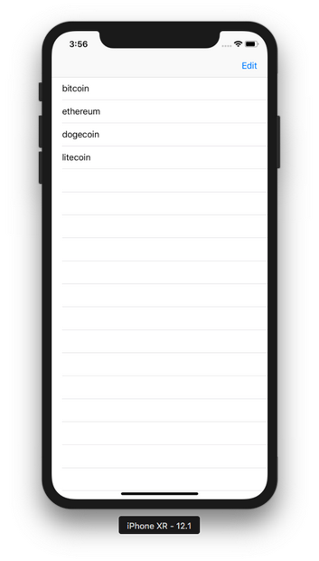
</p>

Click Edit button and you will get this screen.
<p align="center">
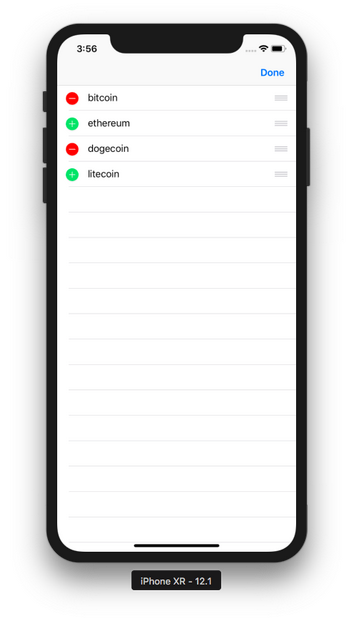
</p>

If you click delete icon, you will delete the row. If you click add icon, you will add one new row. Click Done button to exit editing mode.

You can swipe the row from right to left and you will get this screen.
<p align="center">
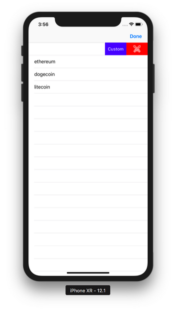
</p>

## Menu

You can show up menu when you long press the row.

Create a single-view application.

Edit AppDelegate. Make application method to be like this.
```swift
    func application(_ application: UIApplication, didFinishLaunchingWithOptions launchOptions: [UIApplication.LaunchOptionsKey: Any]?) -> Bool {
        // Override point for customization after application launch.
        let tableViewController = TableViewController()
        self.window = self.window ?? UIWindow()
        self.window!.rootViewController = tableViewController
        self.window!.makeKeyAndVisible()
        return true
    }
```

Add TableViewCell. This is the code.
```swift
class TableViewCell: UITableViewCell {

    override func awakeFromNib() {
        super.awakeFromNib()
        // Initialization code
    }

    override func setSelected(_ selected: Bool, animated: Bool) {
        super.setSelected(selected, animated: animated)

        // Configure the view for the selected state
    }
    
    @objc func customAction(_ sender: Any?) {
        print("custom menu action")
    }

}
```

In TableViewCell class, you created a callback named customAction.

Add TableViewController. This is the code.
```swift
class TableViewController: UITableViewController {
    
    var crypto = ["bitcoin", "ethereum", "dogecoin", "litecoin"]
    
    let copy = #selector(UIResponderStandardEditActions.copy)
    let cut = #selector(UIResponderStandardEditActions.cut)
    let paste = #selector(UIResponderStandardEditActions.paste)
    let customAction = #selector(TableViewCell.customAction(_:))
    
    override func viewDidLoad() {
        super.viewDidLoad()

        self.tableView.register(TableViewCell.self, forCellReuseIdentifier: "reuseIdentifier")
        self.navigationItem.rightBarButtonItem = self.editButtonItem
    }

    override func numberOfSections(in tableView: UITableView) -> Int {
        return 1
    }

    override func tableView(_ tableView: UITableView, numberOfRowsInSection section: Int) -> Int {
        return crypto.count
    }

    override func tableView(_ tableView: UITableView, cellForRowAt indexPath: IndexPath) -> UITableViewCell {
        let cell = tableView.dequeueReusableCell(withIdentifier: "reuseIdentifier", for: indexPath)

        cell.textLabel!.text = crypto[indexPath.row]

        return cell
    }
    
    override func tableView(_ tableView: UITableView, shouldShowMenuForRowAt indexPath: IndexPath) -> Bool {
        
        let customMenu = UIMenuItem(title: "Custom Action", action: customAction)
        UIMenuController.shared.menuItems = [customMenu]
        return true
    }
    
    override func tableView(_ tableView: UITableView, canPerformAction action: Selector, forRowAt indexPath: IndexPath, withSender sender: Any?) -> Bool {
        return action == customAction || action == copy || action == cut || action == paste
    }
    
    override func tableView(_ tableView: UITableView, performAction action: Selector, forRowAt indexPath: IndexPath, withSender sender: Any?) {
        if action == copy {
            print("copy")
        } else if action == cut {
            print("cut")
        } else if action == paste {
            print("paste")
        }
    }

}
```

At first, you got the actions selector.
```swift
    let copy = #selector(UIResponderStandardEditActions.copy)
    let cut = #selector(UIResponderStandardEditActions.cut)
    let paste = #selector(UIResponderStandardEditActions.paste)
    let customAction = #selector(TableViewCell.customAction(_:))
```

To add a custom menu, you added this method.
```swift
    override func tableView(_ tableView: UITableView, shouldShowMenuForRowAt indexPath: IndexPath) -> Bool {
        let customMenu = UIMenuItem(title: "Custom Action", action: customAction)
        UIMenuController.shared.menuItems = [customMenu]
        return true
    }
```

To show a custom menu and some built-in menus, you added this method.
```swift
    override func tableView(_ tableView: UITableView, canPerformAction action: Selector, forRowAt indexPath: IndexPath, withSender sender: Any?) -> Bool {
        return action == customAction || action == copy || action == cut || action == paste
    }
```

To add the callbacks to built-in menus, you added this method.
```swift
    override func tableView(_ tableView: UITableView, performAction action: Selector, forRowAt indexPath: IndexPath, withSender sender: Any?) {
        if action == copy {
            print("copy")
        } else if action == cut {
            print("cut")
        } else if action == paste {
            print("paste")
        }
    }
```

Run the application and you will get this screen.
<p align="center">
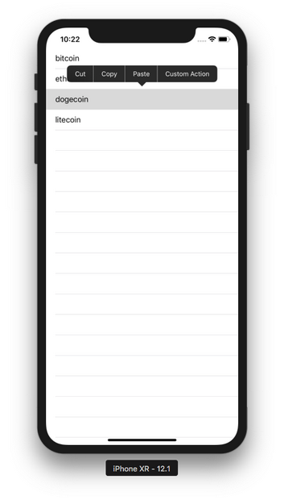
</p>

# Optional Readings

https://developer.apple.com/documentation/uikit/uitableview
https://developer.apple.com/documentation/uikit/uitableviewcontroller

# Exercise

1. Create a view controller that has a static subview (to make it simple, it could be just an image view) that takes 1/3rd of the height of the view controller. Then the rest of the view controller is taken by a table view. It looks like this.
<p align="center">
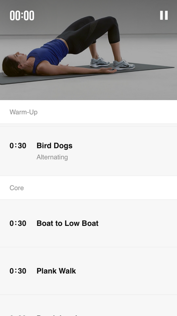
</p>